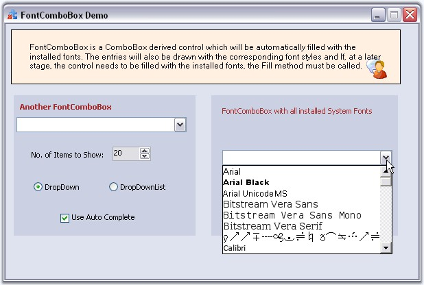

::: {style="DISPLAY: none"}
{#d2h_url_template}{#d2h_package_url style="WIDTH: 0px; DISPLAY: none; HEIGHT: 0px"}
:::

::: {.d2h_secondary_topic style="PADDING-BOTTOM: 10pt; MARGIN: 0pt; PADDING-LEFT: 0pt; PADDING-RIGHT: 0pt; PADDING-TOP: 0pt"}
#### FontComboBox {#fontcombobox style="tab-stops: 0pt"}

[]{style="COLOR: #15428b"} 

The **FontComboBox** is a combo box-derived controls that are automatically populated with the fonts installed on the user\'s system. It provide an easy way to fill a combo box with system fonts.

[]{style="COLOR: #15428b"} 

{border="0"}

**[]{style="COLOR: #15428b"}** 

Figure 585: FontComboBox Control

**[]{style="COLOR: #15428b"}** 

See Also

[]{style="COLOR: #15428b"} 

More:

[ ]{#related-topics}

[{border="0" align="absMiddle"}Features](ms-xhelp:///?Id=ded0777d-6e75-4e27-bb60-4876dac64d48){style="TEXT-DECORATION: none"}

[{border="0" align="absMiddle"}Creating FontComboBox](ms-xhelp:///?Id=d48344da-bd19-47d3-a578-d10ab2b7da57){style="TEXT-DECORATION: none"}

[{border="0" align="absMiddle"}Concepts and Features](ms-xhelp:///?Id=bb0033fa-5b57-4ace-b127-0e6d385ab768){style="TEXT-DECORATION: none"}

[{border="0" align="absMiddle"}Events](ms-xhelp:///?Id=f9f63e08-8eb2-4839-94fd-eafc28cff670){style="TEXT-DECORATION: none"}
:::
