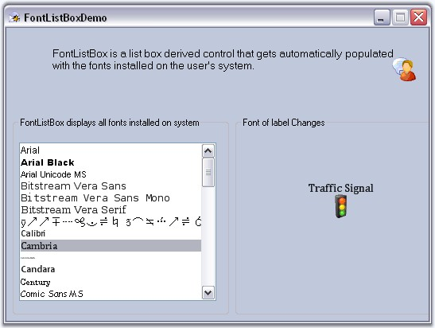

::: {style="DISPLAY: none"}
{#d2h_url_template}{#d2h_package_url style="WIDTH: 0px; DISPLAY: none; HEIGHT: 0px"}
:::

::: {.d2h_secondary_topic style="PADDING-BOTTOM: 10pt; MARGIN: 0pt; PADDING-LEFT: 0pt; PADDING-RIGHT: 0pt; PADDING-TOP: 0pt"}
#### FontListBox {#fontlistbox style="tab-stops: 0pt"}

[]{style="COLOR: #15428b"} 

The **FontListBox** is a list box derived control that are automatically populated with the fonts installed on the user\'s system. It provide an easy way to fill a list box with system fonts.

[]{style="COLOR: #15428b"} 

{border="0"}

[]{style="COLOR: #15428b"} 

Figure 579: FontListBox Control

**[]{style="COLOR: #15428b"}** 

See Also

[]{style="COLOR: #15428b"} 

More:

[ ]{#related-topics}

[{border="0" align="absMiddle"}Features](ms-xhelp:///?Id=b0b0e4d9-84de-416b-bedd-c0ec03b75a83){style="TEXT-DECORATION: none"}

[{border="0" align="absMiddle"}Creating FontListBox](ms-xhelp:///?Id=d5b9ddb5-f0dc-4706-a14d-14d842091cc8){style="TEXT-DECORATION: none"}

[{border="0" align="absMiddle"}Concepts and Features](ms-xhelp:///?Id=dbe86220-4e93-4844-ad20-734f9c2f5b9e){style="TEXT-DECORATION: none"}

[{border="0" align="absMiddle"}Frequently Asked Questions](ms-xhelp:///?Id=de176fe0-20e1-46ad-81ff-d5d2c6561915){style="TEXT-DECORATION: none"}

[{border="0" align="absMiddle"}Events](ms-xhelp:///?Id=bcbd17b9-8cbb-4210-9f14-5d26b8e265d0){style="TEXT-DECORATION: none"}
:::
