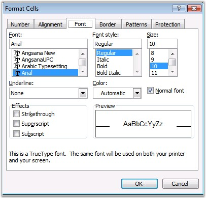
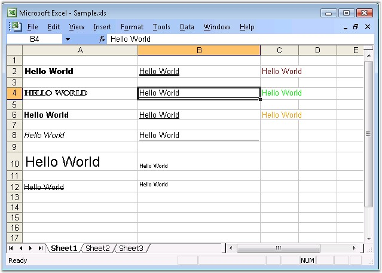

::: {style="DISPLAY: none"}
{#d2h_url_template}{#d2h_package_url style="WIDTH: 0px; DISPLAY: none; HEIGHT: 0px"}
:::

:::: {.d2h_secondary_topic style="PADDING-BOTTOM: 10pt; MARGIN: 0pt; PADDING-LEFT: 0pt; PADDING-RIGHT: 0pt; PADDING-TOP: 0pt"}
#### Font Settings {#font-settings style="tab-stops: 0pt"}

 

MS Excel provides support to customize the font settings through the **Format Cells** dialog box. Font tab in the format dialog box provides options to set the font name, size, color, and so on.

 

{border="0"}

Figure 34: Font settings in MS Excel[]{style="FONT-FAMILY: 'Trebuchet MS','sans-serif'; COLOR: #15428b"}

**[]{style="FONT-FAMILY: 'Trebuchet MS','sans-serif'; COLOR: #15428b; FONT-SIZE: 9pt"}** 

[]{style="FONT-FAMILY: 'Trebuchet MS','sans-serif'; COLOR: #15428b; FONT-SIZE: 9pt"} 

Font Settings in XlsIO

 

XlsIO also has API support for specifying the font style for the text in the cells. **CellStyle** property exposes various font settings which is illustrated in the following code.

 

+------------------------------------------------------------------------------------------------------------------------------------------------------------------------------------------------------------------------+
| **[\[C#\]]{style="FONT-FAMILY: 'Courier New'"}**                                                                                                                                                                       |
|                                                                                                                                                                                                                        |
| **[]{style="FONT-FAMILY: 'Courier New'"}**                                                                                                                                                                             |
|                                                                                                                                                                                                                        |
| [// Setting Font Type.]{style="FONT-FAMILY: 'Courier New'; COLOR: green"}                                                                                                                                              |
|                                                                                                                                                                                                                        |
| [sheet.Range\[\"A2\"\].CellStyle.Font.FontName = \"Arial Black\";]{style="FONT-FAMILY: 'Courier New'; COLOR: black"}                                                                                                   |
|                                                                                                                                                                                                                        |
| [sheet.Range\[\"A4\"\].CellStyle.Font.FontName = \"Castellar\";]{style="FONT-FAMILY: 'Courier New'; COLOR: black"}                                                                                                     |
|                                                                                                                                                                                                                        |
| []{style="FONT-FAMILY: 'Courier New'; COLOR: black"}                                                                                                                                                                   |
|                                                                                                                                                                                                                        |
| [// Setting Font Styles.]{style="FONT-FAMILY: 'Courier New'; COLOR: green"}                                                                                                                                            |
|                                                                                                                                                                                                                        |
| [sheet.Range\[\"A6\"\].CellStyle.Font.Bold = ]{style="FONT-FAMILY: 'Courier New'; COLOR: black"}[true]{style="FONT-FAMILY: 'Courier New'; COLOR: blue"}[;]{style="FONT-FAMILY: 'Courier New'; COLOR: black"}           |
|                                                                                                                                                                                                                        |
| [sheet.Range\[\"A8\"\].CellStyle.Font.Italic = ]{style="FONT-FAMILY: 'Courier New'; COLOR: black"}[true]{style="FONT-FAMILY: 'Courier New'; COLOR: blue"}[;]{style="FONT-FAMILY: 'Courier New'; COLOR: black"}         |
|                                                                                                                                                                                                                        |
| []{style="FONT-FAMILY: 'Courier New'; COLOR: black"}                                                                                                                                                                   |
|                                                                                                                                                                                                                        |
| [// Setting Font Size.]{style="FONT-FAMILY: 'Courier New'; COLOR: green"}                                                                                                                                              |
|                                                                                                                                                                                                                        |
| [sheet.Range\[ \"A10\" \].CellStyle.Font.Size = 18;]{style="FONT-FAMILY: 'Courier New'; COLOR: black"}                                                                                                                 |
|                                                                                                                                                                                                                        |
| []{style="FONT-FAMILY: 'Courier New'; COLOR: black"}                                                                                                                                                                   |
|                                                                                                                                                                                                                        |
| [// Setting Font Effects.]{style="FONT-FAMILY: 'Courier New'; COLOR: green"}                                                                                                                                           |
|                                                                                                                                                                                                                        |
| [sheet.Range\[\"A12\"\].CellStyle.Font.Strikethrough = ]{style="FONT-FAMILY: 'Courier New'; COLOR: black"}[true]{style="FONT-FAMILY: 'Courier New'; COLOR: blue"}[;]{style="FONT-FAMILY: 'Courier New'; COLOR: black"} |
|                                                                                                                                                                                                                        |
| [sheet.Range\[\"B10\"\].CellStyle.Font.Subscript = ]{style="FONT-FAMILY: 'Courier New'; COLOR: black"}[true]{style="FONT-FAMILY: 'Courier New'; COLOR: blue"}[;]{style="FONT-FAMILY: 'Courier New'; COLOR: black"}     |
|                                                                                                                                                                                                                        |
| [sheet.Range\[\"B12\"\].CellStyle.Font.Superscript = ]{style="FONT-FAMILY: 'Courier New'; COLOR: black"}[true]{style="FONT-FAMILY: 'Courier New'; COLOR: blue"}[;]{style="FONT-FAMILY: 'Courier New'; COLOR: black"}   |
|                                                                                                                                                                                                                        |
| []{style="FONT-FAMILY: 'Courier New'; COLOR: black"}                                                                                                                                                                   |
|                                                                                                                                                                                                                        |
| [// Setting UnderLine Types.]{style="FONT-FAMILY: 'Courier New'; COLOR: green"}                                                                                                                                        |
|                                                                                                                                                                                                                        |
| [sheet.Range\[\"B2\"\].CellStyle.Font.Underline = ExcelUnderline.Double;]{style="FONT-FAMILY: 'Courier New'; COLOR: black"}                                                                                            |
|                                                                                                                                                                                                                        |
| [sheet.Range\[\"B4\"\].CellStyle.Font.Underline = ExcelUnderline.DoubleAccounting;]{style="FONT-FAMILY: 'Courier New'; COLOR: black"}                                                                                  |
|                                                                                                                                                                                                                        |
| [sheet.Range\[\"B6\"\].CellStyle.Font.Underline = ExcelUnderline.Single;]{style="FONT-FAMILY: 'Courier New'; COLOR: black"}                                                                                            |
|                                                                                                                                                                                                                        |
| [sheet.Range\[\"B8\"\].CellStyle.Font.Underline = ExcelUnderline.SingleAccounting;]{style="FONT-FAMILY: 'Courier New'; COLOR: black"}                                                                                  |
|                                                                                                                                                                                                                        |
| []{style="FONT-FAMILY: 'Courier New'; COLOR: black"}                                                                                                                                                                   |
|                                                                                                                                                                                                                        |
| [// Setting Font Color.]{style="FONT-FAMILY: 'Courier New'; COLOR: green"}                                                                                                                                             |
|                                                                                                                                                                                                                        |
| [sheet.Range\[\"C2\"\].CellStyle.Font.Color = ExcelKnownColors.Lavender;]{style="FONT-FAMILY: 'Courier New'; COLOR: black"}                                                                                            |
|                                                                                                                                                                                                                        |
| [sheet.Range\[\"C4\"\].CellStyle.Font.Color = ExcelKnownColors.Light_blue;]{style="FONT-FAMILY: 'Courier New'; COLOR: black"}                                                                                          |
|                                                                                                                                                                                                                        |
| [sheet.Range\[\"C6\"\].CellStyle.Font.Color = ExcelKnownColors.Indigo;]{style="FONT-FAMILY: 'Courier New'; COLOR: black"}                                                                                              |
+------------------------------------------------------------------------------------------------------------------------------------------------------------------------------------------------------------------------+

[]{style="FONT-FAMILY: 'Trebuchet MS','sans-serif'; COLOR: #15428b; FONT-SIZE: 9pt"} 

+-----------------------------------------------------------------------------------------------------------------------------------------------------------------+
| **[\[VB.NET\]]{style="FONT-FAMILY: 'Courier New'"}**                                                                                                            |
|                                                                                                                                                                 |
| **[]{style="FONT-FAMILY: 'Courier New'"}**                                                                                                                      |
|                                                                                                                                                                 |
| [\' Setting Font Type.]{style="FONT-FAMILY: 'Courier New'; COLOR: green"}                                                                                       |
|                                                                                                                                                                 |
| [sheet.Range(\"A2\").CellStyle.Font.FontName = \"Arial Black\"]{style="FONT-FAMILY: 'Courier New'; COLOR: black"}                                               |
|                                                                                                                                                                 |
| [sheet.Range(\"A4\").CellStyle.Font.FontName = \"Castellar\"]{style="FONT-FAMILY: 'Courier New'; COLOR: black"}                                                 |
|                                                                                                                                                                 |
| []{style="FONT-FAMILY: 'Courier New'; COLOR: black"}                                                                                                            |
|                                                                                                                                                                 |
| [\' Setting Font Styles.]{style="FONT-FAMILY: 'Courier New'; COLOR: green"}                                                                                     |
|                                                                                                                                                                 |
| [sheet.Range(\"A6\").CellStyle.Font.Bold = ]{style="FONT-FAMILY: 'Courier New'; COLOR: black"}[True]{style="FONT-FAMILY: 'Courier New'; COLOR: blue"}           |
|                                                                                                                                                                 |
| [sheet.Range(\"A8\").CellStyle.Font.Italic = ]{style="FONT-FAMILY: 'Courier New'; COLOR: black"}[True]{style="FONT-FAMILY: 'Courier New'; COLOR: blue"}         |
|                                                                                                                                                                 |
| []{style="FONT-FAMILY: 'Courier New'; COLOR: blue"}                                                                                                             |
|                                                                                                                                                                 |
| [\' Setting Font Size.]{style="FONT-FAMILY: 'Courier New'; COLOR: green"}                                                                                       |
|                                                                                                                                                                 |
| [sheet.Range(\"A10\").CellStyle.Font.Size = 18]{style="FONT-FAMILY: 'Courier New'; COLOR: black"}                                                               |
|                                                                                                                                                                 |
| []{style="FONT-FAMILY: 'Courier New'; COLOR: black"}                                                                                                            |
|                                                                                                                                                                 |
| [\' Setting Font Effects.]{style="FONT-FAMILY: 'Courier New'; COLOR: green"}                                                                                    |
|                                                                                                                                                                 |
| [sheet.Range(\"A12\").CellStyle.Font.Strikethrough = ]{style="FONT-FAMILY: 'Courier New'; COLOR: black"}[True]{style="FONT-FAMILY: 'Courier New'; COLOR: blue"} |
|                                                                                                                                                                 |
| [sheet.Range(\"B10\").CellStyle.Font.Subscript = ]{style="FONT-FAMILY: 'Courier New'; COLOR: black"}[True]{style="FONT-FAMILY: 'Courier New'; COLOR: blue"}     |
|                                                                                                                                                                 |
| [sheet.Range(\"B12\").CellStyle.Font.Superscript = ]{style="FONT-FAMILY: 'Courier New'; COLOR: black"}[True]{style="FONT-FAMILY: 'Courier New'; COLOR: blue"}   |
|                                                                                                                                                                 |
| []{style="FONT-FAMILY: 'Courier New'; COLOR: blue"}                                                                                                             |
|                                                                                                                                                                 |
| [\' Setting UnderLine Types.]{style="FONT-FAMILY: 'Courier New'; COLOR: green"}                                                                                 |
|                                                                                                                                                                 |
| [sheet.Range(\"B2\").CellStyle.Font.Underline = ExcelUnderline.Double]{style="FONT-FAMILY: 'Courier New'; COLOR: black"}                                        |
|                                                                                                                                                                 |
| [sheet.Range(\"B4\").CellStyle.Font.Underline = ExcelUnderline.DoubleAccounting]{style="FONT-FAMILY: 'Courier New'; COLOR: black"}                              |
|                                                                                                                                                                 |
| [sheet.Range(\"B6\").CellStyle.Font.Underline = ExcelUnderline.Single]{style="FONT-FAMILY: 'Courier New'; COLOR: black"}                                        |
|                                                                                                                                                                 |
| [sheet.Range(\"B8\").CellStyle.Font.Underline = ExcelUnderline.SingleAccounting]{style="FONT-FAMILY: 'Courier New'; COLOR: black"}                              |
|                                                                                                                                                                 |
| []{style="FONT-FAMILY: 'Courier New'; COLOR: black"}                                                                                                            |
|                                                                                                                                                                 |
| [\' Setting Font Color.]{style="FONT-FAMILY: 'Courier New'; COLOR: green"}                                                                                      |
|                                                                                                                                                                 |
| [sheet.Range(\"C2\").CellStyle.Font.Color = ExcelKnownColors.Lavender]{style="FONT-FAMILY: 'Courier New'; COLOR: black"}                                        |
|                                                                                                                                                                 |
| [sheet.Range(\"C4\").CellStyle.Font.Color = ExcelKnownColors.Light_blue]{style="FONT-FAMILY: 'Courier New'; COLOR: black"}                                      |
|                                                                                                                                                                 |
| [sheet.Range(\"C6\").CellStyle.Font.Color = ExcelKnownColors.Indigo]{style="FONT-FAMILY: 'Courier New'; COLOR: black"}                                          |
+-----------------------------------------------------------------------------------------------------------------------------------------------------------------+

[]{style="FONT-FAMILY: 'Trebuchet MS','sans-serif'; COLOR: #15428b; FONT-SIZE: 9pt"} 

Editing Rich Text

[]{style="FONT-FAMILY: 'Trebuchet MS','sans-serif'; COLOR: #15428b; FONT-SIZE: 9pt"} 

XlsIO provides support for reading and writing rich text by using the **IRichTextString** interface. It enables to format each character in the cell with different font styles.

[]{style="FONT-FAMILY: 'Trebuchet MS','sans-serif'; COLOR: #15428b; FONT-SIZE: 9pt"} 

::: {style="BORDER-BOTTOM: windowtext 1pt solid; BORDER-LEFT: medium none; PADDING-BOTTOM: 1pt; MARGIN-TOP: 9pt; PADDING-LEFT: 0pt; PADDING-RIGHT: 0pt; MARGIN-BOTTOM: 9pt; BORDER-TOP: windowtext 1pt solid; BORDER-RIGHT: medium none; PADDING-TOP: 1pt"}
{border="0"}Note: Currently XlsIO cannot write formatted rich text.
:::

[]{style="FONT-FAMILY: 'Trebuchet MS','sans-serif'; COLOR: #15428b; FONT-SIZE: 9pt"} 

+------------------------------------------------------------------------------------------------------------------------------------------------------------------------------------+
| **[\[C#\]]{style="FONT-FAMILY: 'Courier New'"}**                                                                                                                                   |
|                                                                                                                                                                                    |
| []{style="FONT-FAMILY: 'Courier New'; COLOR: black"}                                                                                                                               |
|                                                                                                                                                                                    |
| [// Insert Rich Text.]{style="FONT-FAMILY: 'Courier New'; COLOR: green"}                                                                                                           |
|                                                                                                                                                                                    |
| [IRange range = sheet.Range\[\"A1\"\];]{style="FONT-FAMILY: 'Courier New'; COLOR: black"}                                                                                          |
|                                                                                                                                                                                    |
| [range.Text = \"RichText\";]{style="FONT-FAMILY: 'Courier New'; COLOR: black"}                                                                                                     |
|                                                                                                                                                                                    |
| [IRichTextString rtf = range.RichText;]{style="FONT-FAMILY: 'Courier New'; COLOR: black"}                                                                                          |
|                                                                                                                                                                                    |
| []{style="FONT-FAMILY: 'Courier New'"}                                                                                                                                             |
|                                                                                                                                                                                    |
| [// Formatting first 4 characters.]{style="FONT-FAMILY: 'Courier New'; COLOR: green"}                                                                                              |
|                                                                                                                                                                                    |
| [IFont redFont = workbook.CreateFont();]{style="FONT-FAMILY: 'Courier New'; COLOR: black"}                                                                                         |
|                                                                                                                                                                                    |
| [redFont.Bold = ]{style="FONT-FAMILY: 'Courier New'; COLOR: black"}[true]{style="FONT-FAMILY: 'Courier New'; COLOR: blue"}[;]{style="FONT-FAMILY: 'Courier New'; COLOR: black"}    |
|                                                                                                                                                                                    |
| [redFont.Italic = ]{style="FONT-FAMILY: 'Courier New'; COLOR: black"}[true]{style="FONT-FAMILY: 'Courier New'; COLOR: blue"}[;]{style="FONT-FAMILY: 'Courier New'; COLOR: black"}  |
|                                                                                                                                                                                    |
| [redFont.RGBColor = Color.Red;]{style="FONT-FAMILY: 'Courier New'; COLOR: black"}                                                                                                  |
|                                                                                                                                                                                    |
| [rtf.SetFont(0, 3, redFont);]{style="FONT-FAMILY: 'Courier New'; COLOR: black"}                                                                                                    |
|                                                                                                                                                                                    |
| []{style="FONT-FAMILY: 'Courier New'; COLOR: black"}                                                                                                                               |
|                                                                                                                                                                                    |
| [// Formatting last 4 characters.]{style="FONT-FAMILY: 'Courier New'; COLOR: green"}                                                                                               |
|                                                                                                                                                                                    |
| [IFont blueFont = workbook.CreateFont();]{style="FONT-FAMILY: 'Courier New'; COLOR: black"}                                                                                        |
|                                                                                                                                                                                    |
| [blueFont.Bold = ]{style="FONT-FAMILY: 'Courier New'; COLOR: black"}[true]{style="FONT-FAMILY: 'Courier New'; COLOR: blue"}[;]{style="FONT-FAMILY: 'Courier New'; COLOR: black"}   |
|                                                                                                                                                                                    |
| [blueFont.Italic = ]{style="FONT-FAMILY: 'Courier New'; COLOR: black"}[true]{style="FONT-FAMILY: 'Courier New'; COLOR: blue"}[;]{style="FONT-FAMILY: 'Courier New'; COLOR: black"} |
|                                                                                                                                                                                    |
| [blueFont.RGBColor= Color.Blue;]{style="FONT-FAMILY: 'Courier New'; COLOR: black"}                                                                                                 |
|                                                                                                                                                                                    |
| [rtf.SetFont(4, 7, blueFont); ]{style="FONT-FAMILY: 'Courier New'; COLOR: black"}                                                                                                  |
+------------------------------------------------------------------------------------------------------------------------------------------------------------------------------------+

[]{style="FONT-FAMILY: 'Trebuchet MS','sans-serif'; COLOR: #15428b; FONT-SIZE: 9pt"} 

+-------------------------------------------------------------------------------------------------------------------------------------------------------------------------------------------------------------------------------------------------------------+
| **[\[VB.NET\]]{style="FONT-FAMILY: 'Courier New'"}**                                                                                                                                                                                                        |
|                                                                                                                                                                                                                                                             |
| **[]{style="FONT-FAMILY: 'Courier New'"}**                                                                                                                                                                                                                  |
|                                                                                                                                                                                                                                                             |
| [\' Insert Rich Text.]{style="FONT-FAMILY: 'Courier New'; COLOR: green"}                                                                                                                                                                                    |
|                                                                                                                                                                                                                                                             |
| [Dim]{style="FONT-FAMILY: 'Courier New'; COLOR: blue"}[ range ]{style="FONT-FAMILY: 'Courier New'; COLOR: black"}[As]{style="FONT-FAMILY: 'Courier New'; COLOR: blue"}[ IRange = sheet.Range(\"A1\")]{style="FONT-FAMILY: 'Courier New'; COLOR: black"}     |
|                                                                                                                                                                                                                                                             |
| [range.Text = \"RichText\"]{style="FONT-FAMILY: 'Courier New'; COLOR: black"}                                                                                                                                                                               |
|                                                                                                                                                                                                                                                             |
| [Dim]{style="FONT-FAMILY: 'Courier New'; COLOR: blue"}[ rtf ]{style="FONT-FAMILY: 'Courier New'; COLOR: black"}[As]{style="FONT-FAMILY: 'Courier New'; COLOR: blue"}[ IRichTextString = range.RichText]{style="FONT-FAMILY: 'Courier New'; COLOR: black"}   |
|                                                                                                                                                                                                                                                             |
| []{style="FONT-FAMILY: 'Courier New'"}                                                                                                                                                                                                                      |
|                                                                                                                                                                                                                                                             |
| [\' Formatting first 4 characters.]{style="FONT-FAMILY: 'Courier New'; COLOR: green"}                                                                                                                                                                       |
|                                                                                                                                                                                                                                                             |
| [Dim]{style="FONT-FAMILY: 'Courier New'; COLOR: blue"}[ redFont ]{style="FONT-FAMILY: 'Courier New'; COLOR: black"}[As]{style="FONT-FAMILY: 'Courier New'; COLOR: blue"}[ IFont = workbook.CreateFont()]{style="FONT-FAMILY: 'Courier New'; COLOR: black"}  |
|                                                                                                                                                                                                                                                             |
| [redFont.Bold = ]{style="FONT-FAMILY: 'Courier New'; COLOR: black"}[True]{style="FONT-FAMILY: 'Courier New'; COLOR: blue"}                                                                                                                                  |
|                                                                                                                                                                                                                                                             |
| [redFont.Italic = ]{style="FONT-FAMILY: 'Courier New'; COLOR: black"}[True]{style="FONT-FAMILY: 'Courier New'; COLOR: blue"}                                                                                                                                |
|                                                                                                                                                                                                                                                             |
| [redFont.RGBColor = Color.Red]{style="FONT-FAMILY: 'Courier New'; COLOR: black"}                                                                                                                                                                            |
|                                                                                                                                                                                                                                                             |
| [rtf.SetFont(0, 3, redFont)]{style="FONT-FAMILY: 'Courier New'; COLOR: black"}                                                                                                                                                                              |
|                                                                                                                                                                                                                                                             |
| []{style="FONT-FAMILY: 'Courier New'; COLOR: black"}                                                                                                                                                                                                        |
|                                                                                                                                                                                                                                                             |
| [\' Formatting last 4 characters.]{style="FONT-FAMILY: 'Courier New'; COLOR: green"}                                                                                                                                                                        |
|                                                                                                                                                                                                                                                             |
| [Dim]{style="FONT-FAMILY: 'Courier New'; COLOR: blue"}[ blueFont ]{style="FONT-FAMILY: 'Courier New'; COLOR: black"}[As]{style="FONT-FAMILY: 'Courier New'; COLOR: blue"}[ IFont = workbook.CreateFont()]{style="FONT-FAMILY: 'Courier New'; COLOR: black"} |
|                                                                                                                                                                                                                                                             |
| [blueFont.Bold = ]{style="FONT-FAMILY: 'Courier New'; COLOR: black"}[True]{style="FONT-FAMILY: 'Courier New'; COLOR: blue"}                                                                                                                                 |
|                                                                                                                                                                                                                                                             |
| [blueFont.Italic = ]{style="FONT-FAMILY: 'Courier New'; COLOR: black"}[True]{style="FONT-FAMILY: 'Courier New'; COLOR: blue"}                                                                                                                               |
|                                                                                                                                                                                                                                                             |
| [blueFont.RGBColor = Color.Blue]{style="FONT-FAMILY: 'Courier New'; COLOR: black"}                                                                                                                                                                          |
|                                                                                                                                                                                                                                                             |
| [rtf.SetFont(4, 7, blueFont)]{style="FONT-FAMILY: 'Courier New'; COLOR: black"}                                                                                                                                                                             |
+-------------------------------------------------------------------------------------------------------------------------------------------------------------------------------------------------------------------------------------------------------------+

[]{style="FONT-FAMILY: 'Trebuchet MS','sans-serif'; COLOR: #15428b; FONT-SIZE: 9pt"} 

{border="0"}

Figure 35: XlsIO with Font Settings[]{style="FONT-FAMILY: 'Trebuchet MS','sans-serif'; COLOR: #15428b"}

**[]{style="FONT-FAMILY: 'Trebuchet MS','sans-serif'; COLOR: #15428b; FONT-SIZE: 9pt"}** 

 

[]{#p39}**[]{style="FONT-FAMILY: 'Segoe UI','sans-serif'; COLOR: black"}** 

**[]{style="FONT-FAMILY: 'Segoe UI','sans-serif'; COLOR: black"}** 

[]{#related-topics}
::::
