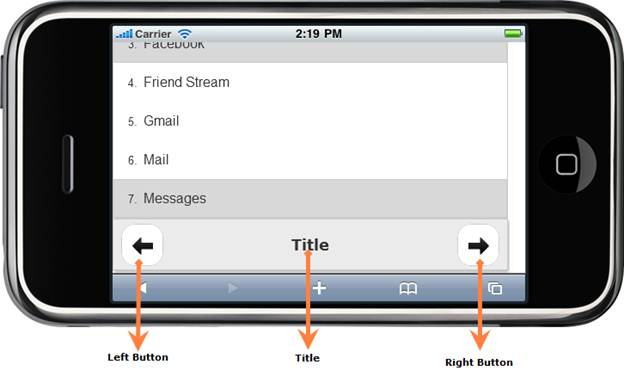

::: {style="DISPLAY: none"}
{#d2h_url_template} {#d2h_package_url style="WIDTH: 0px; DISPLAY: none; HEIGHT: 0px"}
:::

::::: {#nsbanner .d2h_main_nsbanner style="BORDER-BOTTOM: #999999 1px solid; POSITION: relative; PADDING-BOTTOM: 0px; BACKGROUND-COLOR: transparent; PADDING-LEFT: 0px; PADDING-RIGHT: 0px; DISPLAY: none; BORDER-TOP: #999999 1px solid; PADDING-TOP: 0px; LEFT: 0px"}
:::: {#TitleRow .d2h_main_titlerow style="PADDING-BOTTOM: 4px; BACKGROUND-COLOR: transparent; PADDING-LEFT: 22px; WIDTH: 100%; PADDING-RIGHT: 10px; DISPLAY: none; PADDING-TOP: 4px"}
::: {#ienav .d2h_main_ienav style="DISPLAY: none"}
{#D2HPrevious .D2HPreviousEnabled}  {#D2HNext .D2HNextEnabled}
:::
::::
:::::

:::: {#nstext .d2h_main_nstext style="PADDING-BOTTOM: 10px; BACKGROUND-COLOR: transparent; PADDING-LEFT: 22px; PADDING-RIGHT: 10px; HEIGHT: 100%; OVERFLOW: auto; PADDING-TOP: 5px" hasuserbackground="true" valign="bottom"}
::: {#d2h_breadcrumbs .d2h_breadcrumbs}
[Essential Studio User Guide Documentation](ms-xhelp:///?Id=12457748-09e3-4d74-a240-8e049cedf030){.d2h_breadcrumbsNormal} [ \> ]{.d2h_breadcrumbsLinkSeparator} [User Interface Edition](ms-xhelp:///?Id=c29296b7-531c-413b-a0ec-488ca1f7f669){.d2h_breadcrumbsNormal} [ \> ]{.d2h_breadcrumbsLinkSeparator} [Essential Mobile MVC](ms-xhelp:///?Id=74df42e3-5434-4590-9be6-3ae2f911cbbc){.d2h_breadcrumbsNormal} [ \> ]{.d2h_breadcrumbsLinkSeparator} [Essential Tools]{.d2h_breadcrumbsContentsOnly} [ \> ]{.d2h_breadcrumbsLinkSeparator} [Controls and Components](ms-xhelp:///?Id=143afae1-3f83-4d32-9bfa-92ed7022a696){.d2h_breadcrumbsNormal}
:::

## Footer {#footer style="tab-stops: 0pt"}

Essential Footer control for Mobile MVC is used to display the Footer content in a mobile application. It facilitates the user to customize the caption, show/hide Footer, and to customize template content using both the left and right button.

 The Footer control supports the following four built-in skins that enhance the look and feel:

[·      ]{style="FONT-FAMILY: Symbol"}BlueLight

[·      ]{style="FONT-FAMILY: Symbol"}DarkNight

[·      ]{style="FONT-FAMILY: Symbol"}MetroBlue

[·      ]{style="FONT-FAMILY: Symbol"}Spinach

 

The key features of Footer control are:

[·      ]{style="FONT-FAMILY: Symbol"}Customizable Left and Right button

[·      ]{style="FONT-FAMILY: Symbol"}Template support

[·      ]{style="FONT-FAMILY: Symbol"}Rich set of client-side event

[·      ]{style="FONT-FAMILY: Symbol"}Four pre-defined skins

[]{style="FONT-WEIGHT: normal"} 

Appearance and Structure

[]{style="FONT-WEIGHT: normal"} 

{border="0"}

Figure 43: Footer Control[]{style="FONT-FAMILY: 'Calibri','sans-serif'"}

More:

[ ]{#related-topics}

[{border="0" align="absMiddle"}Adding Footer to the Mobile MVC application](ms-xhelp:///?Id=996849a4-8adc-4a31-a3df-79c0402c020d){style="TEXT-DECORATION: none"}

[{border="0" align="absMiddle"}Concepts and Features](ms-xhelp:///?Id=a2a6387d-32e8-43d3-927c-1febd0dbe3fb){style="TEXT-DECORATION: none"}
::::
