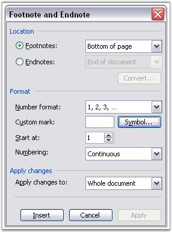

::: {style="DISPLAY: none"}
{#d2h_url_template}{#d2h_package_url style="WIDTH: 0px; DISPLAY: none; HEIGHT: 0px"}
:::

::::: {.d2h_secondary_topic style="PADDING-BOTTOM: 10pt; MARGIN: 0pt; PADDING-LEFT: 0pt; PADDING-RIGHT: 0pt; PADDING-TOP: 0pt"}
#### Footnote and Endnote {#footnote-and-endnote style="tab-stops: 0pt"}

 

[]{#p60}A **Footnote** is a note of text placed at the bottom of a page in a book or document. It is normally flagged by a superscript number followed by the text where it is referenced to.

 

An **Endnote** is a note or reference given at the end of a text or a major text section. Endnotes are similar to footnotes, and the only difference is that they are collected together at the end of a chapter or at the end of work.

 

To add a footnote or endnote to a document:

1.   Select the text to which you want to apply the footnote or endnote.

2.   Open **Insert** menu.

3.   Point to **Reference**, and then click **Footnote** in the **Microsoft Word** menu.

 

{border="0"}

Figure 65: Footnote and Endnote Option in MS Word

 

 

DocIO has an ability to preserve Word footnotes and endnotes, but their creation and modification with DocIO API is limited.

 

Footnotes and Endnotes are the subdocuments of Word. Presentation of these subdocuments in the document consists of two parts namely **special marker**, which defines the footnote or endnote location in the document, and **special data**, which defines the text and formatting of the subdocument.

 

**WFootnote** class represents the structure and properties of footnotes and endnotes. As footnotes and endnotes share the same structure in the document, a single class is used to represent them. This class has the **FootnoteType** property, which enables you to add a footnote or endnote. It takes two values namely:

 

[·      ]{style="FONT-FAMILY: Symbol"}Footnote

[·      ]{style="FONT-FAMILY: Symbol"}Endnote

 

Class Hierarchy

 

ParagraphItem

                  \|

             WFootnote

 

Public Constructor

 

::: {align="center"}
  ------------------------------------- -----------------------------------------------------
  Name                                  Description
  WFootnote.WFootnote (IWordDocument)   Initializes a new instance of the WFootnote class  
  ------------------------------------- -----------------------------------------------------
:::

 

Public Properties

 

::: {align="center"}
  ----------------------- --------------------------------------------------------------------------------------------------------------------------------------------------
  Name                    Description
  EntityType              Gets the type of the entity
  FootnoteType            Gets or sets footnote type: footnote or endnote  
  IsAutoNumbered          Gets the value indicating if the footnote is auto numbered  
  MarkerCharacterFormat   Gets the marker character format  
  TextBody                Gets the text body
  SymbolCode              Gets or sets the marker Symbol code
  CustomMarker            Defines custom (string) marker for footnote. If footnote is autonumbered, this property won't have any influence (footnote will be autonumbered)
  ----------------------- --------------------------------------------------------------------------------------------------------------------------------------------------
:::

 

The following code illustrates how to create a Footnote and an Endnote by using Essential DocIO.

 

+-------------------------------------------------------------------------------------------------------------------------------------------------------------------------------------------------------------------------------------------------------+
| **[\[C#\]]{style="FONT-FAMILY: 'Courier New'"}**                                                                                                                                                                                                      |
|                                                                                                                                                                                                                                                       |
| **[]{style="FONT-FAMILY: 'Courier New'"}**                                                                                                                                                                                                            |
|                                                                                                                                                                                                                                                       |
| [// Creating a new document]{style="FONT-FAMILY: 'Courier New'; COLOR: green"}                                                                                                                                                                        |
|                                                                                                                                                                                                                                                       |
| [WordDocument]{style="FONT-FAMILY: 'Courier New'; COLOR: #2b91af"}[ document = [new]{style="COLOR: blue"} [WordDocument]{style="COLOR: #2b91af"}();]{style="FONT-FAMILY: 'Courier New'"}                                                              |
|                                                                                                                                                                                                                                                       |
| []{style="FONT-FAMILY: 'Courier New'"}                                                                                                                                                                                                                |
|                                                                                                                                                                                                                                                       |
| [// Creating a section]{style="FONT-FAMILY: 'Courier New'; COLOR: green"}                                                                                                                                                                             |
|                                                                                                                                                                                                                                                       |
| [IWSection]{style="FONT-FAMILY: 'Courier New'; COLOR: #2b91af"}[ section1 = document.AddSection();]{style="FONT-FAMILY: 'Courier New'"}                                                                                                               |
|                                                                                                                                                                                                                                                       |
| []{style="FONT-FAMILY: 'Courier New'"}                                                                                                                                                                                                                |
|                                                                                                                                                                                                                                                       |
| [// Adding a paragraph to a section]{style="FONT-FAMILY: 'Courier New'; COLOR: green"}                                                                                                                                                                |
|                                                                                                                                                                                                                                                       |
| [IWParagraph]{style="FONT-FAMILY: 'Courier New'; COLOR: #2b91af"}[ paragraph = section1.AddParagraph();]{style="FONT-FAMILY: 'Courier New'"}                                                                                                          |
|                                                                                                                                                                                                                                                       |
| []{style="FONT-FAMILY: 'Courier New'"}                                                                                                                                                                                                                |
|                                                                                                                                                                                                                                                       |
| [// Creating a footnote]{style="FONT-FAMILY: 'Courier New'; COLOR: green"}                                                                                                                                                                            |
|                                                                                                                                                                                                                                                       |
| [WFootnote]{style="FONT-FAMILY: 'Courier New'; COLOR: #2b91af"}[ footnote = [new]{style="COLOR: blue"} [WFootnote]{style="COLOR: #2b91af"}(document);]{style="FONT-FAMILY: 'Courier New'"}                                                            |
|                                                                                                                                                                                                                                                       |
| []{style="FONT-FAMILY: 'Courier New'"}                                                                                                                                                                                                                |
|                                                                                                                                                                                                                                                       |
| [// Appending endnote]{style="FONT-FAMILY: 'Courier New'; COLOR: green"}                                                                                                                                                                              |
|                                                                                                                                                                                                                                                       |
| [footnote = paragraph.AppendFootnote(Syncfusion.DocIO.[FootnoteType]{style="COLOR: #2b91af"}.Endnote);]{style="FONT-FAMILY: 'Courier New'"}                                                                                                           |
|                                                                                                                                                                                                                                                       |
| []{style="FONT-FAMILY: 'Courier New'"}                                                                                                                                                                                                                |
|                                                                                                                                                                                                                                                       |
| [// Setting the footnote character format]{style="FONT-FAMILY: 'Courier New'; COLOR: green"}                                                                                                                                                          |
|                                                                                                                                                                                                                                                       |
| [footnote.MarkerCharacterFormat.SubSuperScript = [SubSuperScript]{style="COLOR: #2b91af"}.SuperScript;]{style="FONT-FAMILY: 'Courier New'"}                                                                                                           |
|                                                                                                                                                                                                                                                       |
| []{style="FONT-FAMILY: 'Courier New'"}                                                                                                                                                                                                                |
|                                                                                                                                                                                                                                                       |
| [// Inserting Text into the paragraph]{style="FONT-FAMILY: 'Courier New'; COLOR: green"}                                                                                                                                                              |
|                                                                                                                                                                                                                                                       |
| [paragraph.AppendText([\"Essential DocIO\"]{style="COLOR: #a31515"}).CharacterFormat.Bold = [true]{style="COLOR: blue"};]{style="FONT-FAMILY: 'Courier New'"}                                                                                         |
|                                                                                                                                                                                                                                                       |
| []{style="FONT-FAMILY: 'Courier New'"}                                                                                                                                                                                                                |
|                                                                                                                                                                                                                                                       |
| [// Adding footnote text]{style="FONT-FAMILY: 'Courier New'; COLOR: green"}                                                                                                                                                                           |
|                                                                                                                                                                                                                                                       |
| [paragraph = footnote.TextBody.AddParagraph();]{style="FONT-FAMILY: 'Courier New'"}                                                                                                                                                                   |
|                                                                                                                                                                                                                                                       |
| []{style="FONT-FAMILY: 'Courier New'"}                                                                                                                                                                                                                |
|                                                                                                                                                                                                                                                       |
| [paragraph.AppendText([\"Essential DocIO is a .NET library that has a simple yet and powerful object model which provides the ability to customize the document to a great extent. \"]{style="COLOR: #a31515"});]{style="FONT-FAMILY: 'Courier New'"} |
|                                                                                                                                                                                                                                                       |
| []{style="FONT-FAMILY: 'Courier New'"}                                                                                                                                                                                                                |
|                                                                                                                                                                                                                                                       |
| [// Saving the document to disk]{style="FONT-FAMILY: 'Courier New'; COLOR: green"}                                                                                                                                                                    |
|                                                                                                                                                                                                                                                       |
| [document.Save([\"Sample.doc\"]{style="COLOR: #a31515"}, Syncfusion.DocIO.[FormatType]{style="COLOR: #2b91af"}.Doc);[]{style="COLOR: green"}]{style="FONT-FAMILY: 'Courier New'"}                                                                     |
+-------------------------------------------------------------------------------------------------------------------------------------------------------------------------------------------------------------------------------------------------------+

 

+------------------------------------------------------------------------------------------------------------------------------------------------------------------------------------------------------------------------------------------------------+
| **[\[VB.NET\]]{style="FONT-FAMILY: 'Courier New'"}**                                                                                                                                                                                                 |
|                                                                                                                                                                                                                                                      |
| []{style="FONT-FAMILY: 'Courier New'"}                                                                                                                                                                                                               |
|                                                                                                                                                                                                                                                      |
| [\' Creating a new document]{style="FONT-FAMILY: 'Courier New'; COLOR: green"}                                                                                                                                                                       |
|                                                                                                                                                                                                                                                      |
| [Dim]{style="FONT-FAMILY: 'Courier New'; COLOR: blue"}[ document [As]{style="COLOR: blue"} WordDocument = [New]{style="COLOR: blue"} WordDocument]{style="FONT-FAMILY: 'Courier New'"}                                                               |
|                                                                                                                                                                                                                                                      |
| []{style="FONT-FAMILY: 'Courier New'"}                                                                                                                                                                                                               |
|                                                                                                                                                                                                                                                      |
| [\' Creating a section]{style="FONT-FAMILY: 'Courier New'; COLOR: green"}                                                                                                                                                                            |
|                                                                                                                                                                                                                                                      |
| [Dim]{style="FONT-FAMILY: 'Courier New'; COLOR: blue"}[ section1 [As]{style="COLOR: blue"} IWSection = document.AddSection]{style="FONT-FAMILY: 'Courier New'"}                                                                                      |
|                                                                                                                                                                                                                                                      |
| []{style="FONT-FAMILY: 'Courier New'"}                                                                                                                                                                                                               |
|                                                                                                                                                                                                                                                      |
| [\' Adding a paragraph to a section]{style="FONT-FAMILY: 'Courier New'; COLOR: green"}                                                                                                                                                               |
|                                                                                                                                                                                                                                                      |
| [Dim]{style="FONT-FAMILY: 'Courier New'; COLOR: blue"}[ paragraph [As]{style="COLOR: blue"} IWParagraph = section1.AddParagraph]{style="FONT-FAMILY: 'Courier New'"}                                                                                 |
|                                                                                                                                                                                                                                                      |
| []{style="FONT-FAMILY: 'Courier New'"}                                                                                                                                                                                                               |
|                                                                                                                                                                                                                                                      |
| [\' Creating a footnote]{style="FONT-FAMILY: 'Courier New'; COLOR: green"}                                                                                                                                                                           |
|                                                                                                                                                                                                                                                      |
| [Dim]{style="FONT-FAMILY: 'Courier New'; COLOR: blue"}[ footnote [As]{style="COLOR: blue"} WFootnote = [New]{style="COLOR: blue"} WFootnote(document)]{style="FONT-FAMILY: 'Courier New'"}                                                           |
|                                                                                                                                                                                                                                                      |
| []{style="FONT-FAMILY: 'Courier New'"}                                                                                                                                                                                                               |
|                                                                                                                                                                                                                                                      |
| [\' Appending endnote]{style="FONT-FAMILY: 'Courier New'; COLOR: green"}[]{style="FONT-FAMILY: 'Courier New'"}                                                                                                                                       |
|                                                                                                                                                                                                                                                      |
| [footnote=[ ]{style="COLOR: green"}paragraph.AppendFootnote(Syncfusion.DocIO.FootnoteType.Endnote) []{style="COLOR: green"}]{style="FONT-FAMILY: 'Courier New'"}                                                                                     |
|                                                                                                                                                                                                                                                      |
| []{style="FONT-FAMILY: 'Courier New'"}                                                                                                                                                                                                               |
|                                                                                                                                                                                                                                                      |
| [\' Setting the footnote character format]{style="FONT-FAMILY: 'Courier New'; COLOR: green"}                                                                                                                                                         |
|                                                                                                                                                                                                                                                      |
| [footnote.MarkerCharacterFormat.SubSuperScript = SubSuperScript.SuperScript ]{style="FONT-FAMILY: 'Courier New'"}                                                                                                                                    |
|                                                                                                                                                                                                                                                      |
| []{style="FONT-FAMILY: 'Courier New'"}                                                                                                                                                                                                               |
|                                                                                                                                                                                                                                                      |
| [\'Inserting Text into the paragraph]{style="FONT-FAMILY: 'Courier New'; COLOR: green"}                                                                                                                                                              |
|                                                                                                                                                                                                                                                      |
| [paragraph.AppendText([\"Essential DocIO\"]{style="COLOR: maroon"}).CharacterFormat.Bold = [True]{style="COLOR: blue"} ]{style="FONT-FAMILY: 'Courier New'"}                                                                                         |
|                                                                                                                                                                                                                                                      |
| []{style="FONT-FAMILY: 'Courier New'; COLOR: green"}                                                                                                                                                                                                 |
|                                                                                                                                                                                                                                                      |
| [\' Adding footnote text]{style="FONT-FAMILY: 'Courier New'; COLOR: green"}                                                                                                                                                                          |
|                                                                                                                                                                                                                                                      |
| [paragraph = footnote.TextBody.AddParagraph ]{style="FONT-FAMILY: 'Courier New'"}                                                                                                                                                                    |
|                                                                                                                                                                                                                                                      |
| [paragraph.AppendText([\"Essential DocIO is a .NET library that has a simple yet and powerful object model which provides the ability to customize the document to a great extent. \"]{style="COLOR: maroon"}) ]{style="FONT-FAMILY: 'Courier New'"} |
|                                                                                                                                                                                                                                                      |
| []{style="FONT-FAMILY: 'Courier New'"}                                                                                                                                                                                                               |
|                                                                                                                                                                                                                                                      |
| [\' Saving the document to disk]{style="FONT-FAMILY: 'Courier New'; COLOR: green"}                                                                                                                                                                   |
|                                                                                                                                                                                                                                                      |
| [document.Save([\"Sample.doc\"]{style="COLOR: maroon"}, Syncfusion.DocIO.FormatType.Doc)]{style="FONT-FAMILY: 'Courier New'"}                                                                                                                        |
+------------------------------------------------------------------------------------------------------------------------------------------------------------------------------------------------------------------------------------------------------+

 

 

[]{#related-topics}
:::::
