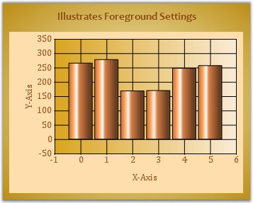

::: {style="DISPLAY: none"}
{#d2h_url_template}{#d2h_package_url style="WIDTH: 0px; DISPLAY: none; HEIGHT: 0px"}
:::

::::: {#nsbanner .d2h_main_nsbanner style="BORDER-BOTTOM: #999999 1px solid; POSITION: relative; PADDING-BOTTOM: 0px; BACKGROUND-COLOR: transparent; PADDING-LEFT: 0px; PADDING-RIGHT: 0px; DISPLAY: none; BORDER-TOP: #999999 1px solid; PADDING-TOP: 0px; LEFT: 0px"}
:::: {#TitleRow .d2h_main_titlerow style="PADDING-BOTTOM: 4px; BACKGROUND-COLOR: transparent; PADDING-LEFT: 22px; WIDTH: 100%; PADDING-RIGHT: 10px; DISPLAY: none; PADDING-TOP: 4px"}
::: {#ienav .d2h_main_ienav style="DISPLAY: none"}
{#D2HPrevious .D2HPreviousEnabled}  {#D2HNext .D2HNextEnabled}
:::
::::
:::::

:::::: {#nstext .d2h_main_nstext style="PADDING-BOTTOM: 10px; BACKGROUND-COLOR: transparent; PADDING-LEFT: 22px; PADDING-RIGHT: 10px; HEIGHT: 100%; OVERFLOW: auto; PADDING-TOP: 5px" hasuserbackground="true" valign="bottom"}
::: {#d2h_breadcrumbs .d2h_breadcrumbs}
[Essential Studio User Guide Documentation](ms-xhelp:///?Id=12457748-09e3-4d74-a240-8e049cedf030){.d2h_breadcrumbsNormal}[ \> ]{.d2h_breadcrumbsLinkSeparator}[User Interface Edition](ms-xhelp:///?Id=c29296b7-531c-413b-a0ec-488ca1f7f669){.d2h_breadcrumbsNormal}[ \> ]{.d2h_breadcrumbsLinkSeparator}[Essential ASP.NET](ms-xhelp:///?Id=25c35330-c127-4dad-9a92-ed79dc7261a6){.d2h_breadcrumbsNormal}[ \> ]{.d2h_breadcrumbsLinkSeparator}[Essential Chart]{.d2h_breadcrumbsContentsOnly}[ \> ]{.d2h_breadcrumbsLinkSeparator}[Concepts and Features](ms-xhelp:///?Id=100687ce-82f2-4424-9d16-0949ea76cf15){.d2h_breadcrumbsNormal}[ \> ]{.d2h_breadcrumbsLinkSeparator}[Chart Appearance](ms-xhelp:///?Id=ffd49f03-f677-452a-81e4-aa2f18f1b9a0){.d2h_breadcrumbsNormal}
:::

### Foreground Settings {#foreground-settings style="tab-stops: 0pt"}

[]{style="FONT-FAMILY: 'Trebuchet MS','sans-serif'; FONT-SIZE: 9pt"} 

Chart Title

**[]{style="FONT-FAMILY: 'Trebuchet MS','sans-serif'"}** 

The ChartControl provides properties to customize and align the text within the control. Below are the text properties.

Using the **ChartControl.Text** property, users can provide the title that appears at the top of the chart. **TextPosition** and **TextAlignment** further lets you control the relative positioning of this title.

Here are some properties that affect the title text in the chart.

[]{style="FONT-FAMILY: 'Trebuchet MS','sans-serif'; FONT-SIZE: 9pt"} 

::: {align="center"}
+-----------------------------------+------------------------------------------------------------------------------------------+
| Chart Control Properties          | Description                                                                              |
+-----------------------------------+------------------------------------------------------------------------------------------+
| Text                              | Specifies the title for the chart.                                                       |
+-----------------------------------+------------------------------------------------------------------------------------------+
| TextPosition                      | Specifies the position of the chart. Possible values are,                                |
|                                   |                                                                                          |
|                                   | Top (**default setting**)                                                                |
|                                   |                                                                                          |
|                                   | Bottom                                                                                   |
|                                   |                                                                                          |
|                                   | Left                                                                                     |
|                                   |                                                                                          |
|                                   | Right                                                                                    |
+-----------------------------------+------------------------------------------------------------------------------------------+
| TextAlignment                     | Specifies the alignment of the title with respect to the chart borders. Possible values: |
|                                   |                                                                                          |
|                                   | Near                                                                                     |
|                                   |                                                                                          |
|                                   | Center (**default setting**)                                                             |
|                                   |                                                                                          |
|                                   | Far                                                                                      |
+-----------------------------------+------------------------------------------------------------------------------------------+
| Font                              | Indicates the font style of the title.                                                   |
+-----------------------------------+------------------------------------------------------------------------------------------+
| ForeColor                         | Indicates the foreground color of the title.                                             |
+-----------------------------------+------------------------------------------------------------------------------------------+
:::

[]{style="FONT-FAMILY: 'Trebuchet MS','sans-serif'; FONT-SIZE: 9pt"} 

+------------------------------------------------------------------------------------------------------------------------------------------------------------------------------------------------------------------------------------------------------------------------------------------------+
| **[\[C#\]]{style="FONT-FAMILY: 'Courier New'; COLOR: black"}**                                                                                                                                                                                                                                 |
|                                                                                                                                                                                                                                                                                                |
| **[]{style="FONT-FAMILY: 'Courier New'; COLOR: black"}**                                                                                                                                                                                                                                       |
|                                                                                                                                                                                                                                                                                                |
| [this]{style="FONT-FAMILY: 'Courier New'; COLOR: blue"}[.ChartWebControl1.Text = [\"Illustrates Foreground Settings\"]{style="COLOR: maroon"};]{style="FONT-FAMILY: 'Courier New'"}                                                                                                            |
|                                                                                                                                                                                                                                                                                                |
| [this]{style="FONT-FAMILY: 'Courier New'; COLOR: blue"}[.ChartWebControl1.Font = [new]{style="COLOR: blue"} System.Drawing.[Font]{style="COLOR: teal"}([\"Arial\"]{style="COLOR: maroon"}, 11.25F, System.Drawing.[FontStyle]{style="COLOR: teal"}.Bold);]{style="FONT-FAMILY: 'Courier New'"} |
|                                                                                                                                                                                                                                                                                                |
| [this]{style="FONT-FAMILY: 'Courier New'; COLOR: blue"}[.ChartWebControl1.ForeColor = System.Drawing.[Color]{style="COLOR: teal"}.Bisque;]{style="FONT-FAMILY: 'Courier New'"}                                                                                                                 |
|                                                                                                                                                                                                                                                                                                |
| [this]{style="FONT-FAMILY: 'Courier New'; COLOR: blue"}[.ChartWebControl1.TextPosition = [ChartTextPosition]{style="COLOR: teal"}.Top;]{style="FONT-FAMILY: 'Courier New'"}                                                                                                                    |
+------------------------------------------------------------------------------------------------------------------------------------------------------------------------------------------------------------------------------------------------------------------------------------------------+

[]{style="FONT-FAMILY: 'Trebuchet MS','sans-serif'; FONT-SIZE: 9pt"} 

+---------------------------------------------------------------------------------------------------------------------------------------------------------------------------------------------------------------------------------------------------------------------------------------------+
| **[\[VB.NET\]]{style="FONT-FAMILY: 'Courier New'; COLOR: black"}**                                                                                                                                                                                                                          |
|                                                                                                                                                                                                                                                                                             |
| **[]{style="FONT-FAMILY: 'Courier New'; COLOR: black"}**                                                                                                                                                                                                                                    |
|                                                                                                                                                                                                                                                                                             |
| [Me]{style="FONT-FAMILY: 'Courier New'; COLOR: blue"}[.ChartWebControl1.Text = [\"Illustrates Foreground Settings\"]{style="COLOR: maroon"}]{style="FONT-FAMILY: 'Courier New'"}                                                                                                            |
|                                                                                                                                                                                                                                                                                             |
| [Me]{style="FONT-FAMILY: 'Courier New'; COLOR: blue"}[.ChartWebControl1.Font = [New]{style="COLOR: blue"} System.Drawing.[Font]{style="COLOR: teal"}([\"Arial\"]{style="COLOR: maroon"}, 11.25F, System.Drawing.[FontStyle]{style="COLOR: teal"}.Bold)]{style="FONT-FAMILY: 'Courier New'"} |
|                                                                                                                                                                                                                                                                                             |
| [Me]{style="FONT-FAMILY: 'Courier New'; COLOR: blue"}[.ChartWebControl1.ForeColor = System.Drawing.[Color]{style="COLOR: teal"}.Bisque]{style="FONT-FAMILY: 'Courier New'"}                                                                                                                 |
|                                                                                                                                                                                                                                                                                             |
| [Me]{style="FONT-FAMILY: 'Courier New'; COLOR: blue"}[.ChartWebControl1.TextPosition = [ChartTextPosition]{style="COLOR: teal"}.Top]{style="FONT-FAMILY: 'Courier New'"}                                                                                                                    |
+---------------------------------------------------------------------------------------------------------------------------------------------------------------------------------------------------------------------------------------------------------------------------------------------+

[]{style="COLOR: red; FONT-SIZE: 8pt"} 

{border="0"}

**[]{style="FONT-FAMILY: 'Trebuchet MS','sans-serif'; FONT-SIZE: 9pt"}** 

Figure 301: Illustrates changes affecting the Title Text

**[]{style="FONT-FAMILY: 'Trebuchet MS','sans-serif'; FONT-SIZE: 9pt"}** 

General Text Related settings

**[]{style="FONT-FAMILY: 'Trebuchet MS','sans-serif'"}** 

The following text related properties affect all the text rendered in the chart.

[]{style="FONT-FAMILY: 'Trebuchet MS','sans-serif'; FONT-SIZE: 9pt"} 

::: {align="center"}
+-----------------------------------+--------------------------------------------------------------------------------------------------------------------------------------------------------------------------------------------------------------------------------------+
| Chart Control Properties          | Description                                                                                                                                                                                                                          |
+-----------------------------------+--------------------------------------------------------------------------------------------------------------------------------------------------------------------------------------------------------------------------------------+
| TextRenderingHint                 | Specifies the way the text is drawn. Possible values:                                                                                                                                                                                |
|                                   |                                                                                                                                                                                                                                      |
|                                   |                                                                                                                                                                                                                                      |
|                                   |                                                                                                                                                                                                                                      |
|                                   | AntiAlias - each character is drawn using its anti-aliased glyph bitmap without hinting.                                                                                                                                             |
|                                   |                                                                                                                                                                                                                                      |
|                                   | AntiAliasGridFit - each character is drawn using its antialiased glyph bitmap with hinting.                                                                                                                                          |
|                                   |                                                                                                                                                                                                                                      |
|                                   | ClearTypeGridFit - each character is drawn using its glyph clear type bitmap with hinting.                                                                                                                                           |
|                                   |                                                                                                                                                                                                                                      |
|                                   | SingleBitPerPixel - each character is drawn using its glyph bitmap.                                                                                                                                                                  |
|                                   |                                                                                                                                                                                                                                      |
|                                   | SingleBitPerPixelGridFit - each character is drawn using its glyph bitmap.                                                                                                                                                           |
|                                   |                                                                                                                                                                                                                                      |
|                                   | SystemDefault - each character is drawn using its glyph bitmap with the system default rendering hint. The text will be drawn using whatever the font-smoothing settings the user had selected for the system. (**default setting**) |
+-----------------------------------+--------------------------------------------------------------------------------------------------------------------------------------------------------------------------------------------------------------------------------------+
| SmoothingMode                     | Specifies how chart elements should be rendered. Possible values:                                                                                                                                                                    |
|                                   |                                                                                                                                                                                                                                      |
|                                   | Antialias                                                                                                                                                                                                                            |
|                                   |                                                                                                                                                                                                                                      |
|                                   | HighQuality                                                                                                                                                                                                                          |
|                                   |                                                                                                                                                                                                                                      |
|                                   | HighSpeed                                                                                                                                                                                                                            |
|                                   |                                                                                                                                                                                                                                      |
|                                   | Invalid                                                                                                                                                                                                                              |
|                                   |                                                                                                                                                                                                                                      |
|                                   | None                                                                                                                                                                                                                                 |
|                                   |                                                                                                                                                                                                                                      |
|                                   | Default(**default** **setting**)                                                                                                                                                                                                     |
+-----------------------------------+--------------------------------------------------------------------------------------------------------------------------------------------------------------------------------------------------------------------------------------+
:::

[]{style="FONT-FAMILY: 'Trebuchet MS','sans-serif'; FONT-SIZE: 9pt"} 

See Also

[]{style="FONT-FAMILY: 'Trebuchet MS','sans-serif'; FONT-SIZE: 9pt"} 

[Axis Label Text Formatting]{.UGHyperlink}[, ]{.UGHyperlink}[Appearance and Positioning]{.UGHyperlink}, (for info on changing axis label text settings)

[Customizing Label Text]{.UGHyperlink}[, ]{.UGHyperlink}[Intersecting Labels]{.UGHyperlink}[, ]{.UGHyperlink}[Grouping Labels]{.UGHyperlink}[, ]{style="COLOR: black"}(for info on changing axis label text settings)

[Series Customization]{.UGHyperlink}[, ]{style="COLOR: black"}(for info on changing series text settings)

[Chart Legend]{.UGHyperlink}[ ]{style="COLOR: black"}(for info on changing legend text settings)

[]{#p209} 

[]{#related-topics}
::::::
