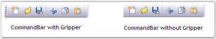

::: {style="DISPLAY: none"}
{#d2h_url_template}{#d2h_package_url style="WIDTH: 0px; DISPLAY: none; HEIGHT: 0px"}
:::

:::::: {.d2h_secondary_topic style="PADDING-BOTTOM: 10pt; MARGIN: 0pt; PADDING-LEFT: 0pt; PADDING-RIGHT: 0pt; PADDING-TOP: 0pt"}
##### Foreground Settings {#foreground-settings style="tab-stops: 0pt"}

[]{style="COLOR: #15428b"} 

The foreground settings of the CommandBar control are discussed below.

[]{style="COLOR: #4a5c8c; FONT-SIZE: 8pt"} 

Gripper

[]{style="COLOR: #15428b"} 

The gripper plays a major role in the CommandBar package. It allows the user to dock / float the CommandBar at runtime.

[]{style="COLOR: #15428b"} 

::: {align="center"}
  --------------------- -------------------------------------------------------
  CommandBar Property   Description
  HideGripper           Draws the CommandBar with / without the drag gripper.
  --------------------- -------------------------------------------------------
:::

[]{style="FONT-SIZE: 8pt"} 

+----------------------------------------------------------------------------------------------------------------------------------------------------+
| **[\[C#\]]{style="FONT-FAMILY: 'Courier New'; COLOR: black"}**                                                                                     |
|                                                                                                                                                    |
| []{style="FONT-FAMILY: 'Courier New'; COLOR: black"}                                                                                               |
|                                                                                                                                                    |
| [this]{style="FONT-FAMILY: 'Courier New'; COLOR: blue"}[.commandBar1.HideGripper=[true]{style="COLOR: blue"};]{style="FONT-FAMILY: 'Courier New'"} |
+----------------------------------------------------------------------------------------------------------------------------------------------------+

[]{style="COLOR: #15428b"} 

+-------------------------------------------------------------------------------------------------------------------------------------------------+
| **[\[VB.NET\]]{style="FONT-FAMILY: 'Courier New'; COLOR: black"}**                                                                              |
|                                                                                                                                                 |
| []{style="FONT-FAMILY: 'Courier New'; COLOR: black"}                                                                                            |
|                                                                                                                                                 |
| [Me]{style="FONT-FAMILY: 'Courier New'; COLOR: blue"}[.commandBar1.HideGripper=[True]{style="COLOR: blue"}]{style="FONT-FAMILY: 'Courier New'"} |
+-------------------------------------------------------------------------------------------------------------------------------------------------+

[]{style="COLOR: #15428b"} 

{border="0"}

[]{style="COLOR: #15428b"} 

Figure 28: \"HideGripper\" property of CommandBar

[]{style="COLOR: #15428b"} 

Font

**[]{style="COLOR: #15428b"}** 

The font of the text displayed in the CommandBar can be customized using the property given below.

**[\`]{style="COLOR: #15428b"}**

::: {align="center"}
  --------------------- -----------------------------------------------
  CommandBar Property   Description
  Font                  The font used to display text in the control.
  --------------------- -----------------------------------------------
:::

[]{style="COLOR: #15428b"} 

+---------------------------------------------------------------------------------------------------------------------------------------------------------------------------------------------------------------------------------------------------------------------------------------------------------------------------------------------------------------------------------------------------+
| **[\[C#\]]{style="FONT-FAMILY: 'Courier New'; COLOR: black"}**                                                                                                                                                                                                                                                                                                                                    |
|                                                                                                                                                                                                                                                                                                                                                                                                   |
| []{style="FONT-FAMILY: 'Courier New'; COLOR: black"}                                                                                                                                                                                                                                                                                                                                              |
|                                                                                                                                                                                                                                                                                                                                                                                                   |
| [this]{style="FONT-FAMILY: 'Courier New'; COLOR: blue"}[.commandBar3.Font = [new]{style="COLOR: blue"} System.Drawing.[Font]{style="COLOR: teal"}([\"Comic Sans MS\"]{style="COLOR: maroon"}, 8.25F, System.Drawing.[FontStyle]{style="COLOR: teal"}.Regular, System.Drawing.[GraphicsUnit]{style="COLOR: teal"}.Point, (([byte]{style="COLOR: blue"})(0)));]{style="FONT-FAMILY: 'Courier New'"} |
+---------------------------------------------------------------------------------------------------------------------------------------------------------------------------------------------------------------------------------------------------------------------------------------------------------------------------------------------------------------------------------------------------+

[]{style="COLOR: #15428b"} 

+--------------------------------------------------------------------------------------------------------------------------------------------------------------------------------------------------------------------------------------------------------------------------------------------------------------------------+
| **[\[VB.NET\]]{style="FONT-FAMILY: 'Courier New'; COLOR: black"}**                                                                                                                                                                                                                                                       |
|                                                                                                                                                                                                                                                                                                                          |
| []{style="FONT-FAMILY: 'Courier New'; COLOR: black"}                                                                                                                                                                                                                                                                     |
|                                                                                                                                                                                                                                                                                                                          |
| [Me]{style="FONT-FAMILY: 'Courier New'; COLOR: blue"}[.commandBar3.Font = [New]{style="COLOR: blue"} System.Drawing.Font([\"Comic Sans MS\"]{style="COLOR: maroon"}, 8.25F, System.Drawing.FontStyle.Regular, System.Drawing.GraphicsUnit.Point, [CByte]{style="COLOR: blue"}((0)))]{style="FONT-FAMILY: 'Courier New'"} |
+--------------------------------------------------------------------------------------------------------------------------------------------------------------------------------------------------------------------------------------------------------------------------------------------------------------------------+

[]{style="COLOR: #4a5c8c; FONT-SIZE: 8pt"} 

{border="0"}

[]{style="COLOR: #15428b"} 

Figure 29: \"Font\" property of CommandBar Set

[]{style="COLOR: #15428b"} 

[]{style="COLOR: #15428b"} 

[]{style="COLOR: #15428b"} 

[]{style="COLOR: #15428b"} 

[]{style="COLOR: #15428b"} 

[]{style="COLOR: #15428b"} 

::: {style="BORDER-BOTTOM: windowtext 1pt solid; BORDER-LEFT: medium none; PADDING-BOTTOM: 1pt; MARGIN-TOP: 9pt; PADDING-LEFT: 0pt; PADDING-RIGHT: 0pt; MARGIN-BOTTOM: 9pt; BORDER-TOP: windowtext 1pt solid; BORDER-RIGHT: medium none; PADDING-TOP: 1pt"}
{border="0"} Note:[ ]{style="COLOR: black; FONT-SIZE: 8pt"}The ResetFont() method can be used to reset the Font property to it\'s default value.
:::

[]{#related-topics}
::::::
