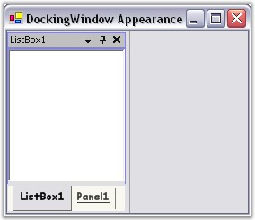
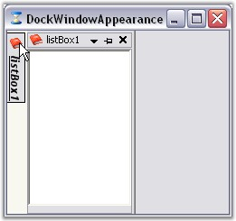
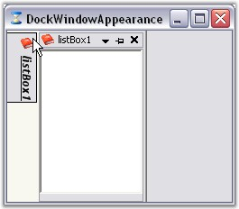
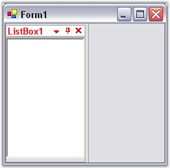
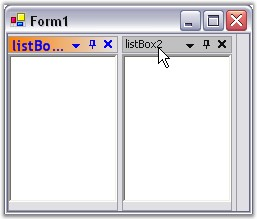

::: {style="DISPLAY: none"}
{#d2h_url_template}{#d2h_package_url style="WIDTH: 0px; DISPLAY: none; HEIGHT: 0px"}
:::

::::::::::::: {.d2h_secondary_topic style="PADDING-BOTTOM: 10pt; MARGIN: 0pt; PADDING-LEFT: 0pt; PADDING-RIGHT: 0pt; PADDING-TOP: 0pt"}
##### Foreground Settings {#foreground-settings style="tab-stops: 0pt"}

[]{style="COLOR: #15428b"} 

This section will walk you through the foreground settings of the Dock tabs, caption area and AutoHidden tabs.

[]{style="COLOR: #15428b"} 

###### 3.2.3.5.1.1 Dock Tab and Label Settings {#dock-tab-and-label-settings style="tab-stops: 0pt"}

[]{style="COLOR: #15428b"} 

The docking Manager provides tab and label settings for the docked windows. These settings lets you control the appearance of the dock tabs.

[]{style="COLOR: #15428b"} 

Foreground Settings for the Dock Tabs

**[]{style="COLOR: #15428b"}** 

The font style and the height of the tab controls in a tabbed docking group, can be controlled using the below properties respectively.

[]{style="COLOR: #15428b"} 

::: {align="center"}
  ------------------------- ---------------------------------------------------------------------------
  DockingManager Property   Description
  DockTabFont               Gets or sets the font for the tab control used in tabbed docking group.
  DockTabHeight             Gets or sets the height for the tab control used in tabbed docking group.
  ------------------------- ---------------------------------------------------------------------------
:::

[]{style="COLOR: #15428b"} 

+--------------------------------------------------------------------------------------------------------------------------------------------------------------------------------------------------------------------------------------------------------------------------------------------------------------------------------------------------------+
| **[\[C#\]]{style="FONT-FAMILY: 'Courier New'; COLOR: black"}**                                                                                                                                                                                                                                                                                         |
|                                                                                                                                                                                                                                                                                                                                                        |
| **[]{style="FONT-FAMILY: 'Courier New'; COLOR: black"}**                                                                                                                                                                                                                                                                                               |
|                                                                                                                                                                                                                                                                                                                                                        |
| [this]{style="FONT-FAMILY: 'Courier New'; COLOR: blue"}[.dockingManager1.DockTabFont = [new]{style="COLOR: blue"} System.Drawing.Font(\"Arial\", 9F, ((System.Drawing.FontStyle)((System.Drawing.FontStyle.Bold \| System.Drawing.FontStyle.Underline))), System.Drawing.GraphicsUnit.Point, ((System.Byte)(0)));]{style="FONT-FAMILY: 'Courier New'"} |
|                                                                                                                                                                                                                                                                                                                                                        |
| [this]{style="FONT-FAMILY: 'Courier New'; COLOR: blue"}[.dockingManager1.DockTabHeight = 30;]{style="FONT-FAMILY: 'Courier New'"}                                                                                                                                                                                                                      |
+--------------------------------------------------------------------------------------------------------------------------------------------------------------------------------------------------------------------------------------------------------------------------------------------------------------------------------------------------------+

[]{style="COLOR: #15428b"} 

+--------------------------------------------------------------------------------------------------------------------------------------------------------------------------------------------------------------------------------------------------------------------------------------------------------------------------------------------------------------------------------------------------------------------------------------------------+
| **[\[VB.NET\]]{style="FONT-FAMILY: 'Courier New'; COLOR: black"}**                                                                                                                                                                                                                                                                                                                                                                               |
|                                                                                                                                                                                                                                                                                                                                                                                                                                                  |
| **[]{style="FONT-FAMILY: 'Courier New'; COLOR: black"}**                                                                                                                                                                                                                                                                                                                                                                                         |
|                                                                                                                                                                                                                                                                                                                                                                                                                                                  |
| [Me]{style="FONT-FAMILY: 'Courier New'; COLOR: blue"}[.DockingManager1.DockTabFont = [New]{style="COLOR: blue"} System.Drawing.Font(\"Arial\", 9.0!, [CType]{style="COLOR: blue"}((System.Drawing.FontStyle.Bold [Or]{style="COLOR: blue"} System.Drawing.FontStyle.Underline), System.Drawing.FontStyle), System.Drawing.GraphicsUnit.Point, [CType]{style="COLOR: blue"}(0, [Byte]{style="COLOR: blue"}))]{style="FONT-FAMILY: 'Courier New'"} |
|                                                                                                                                                                                                                                                                                                                                                                                                                                                  |
| [Me]{style="FONT-FAMILY: 'Courier New'; COLOR: blue"}[.DockingManager1.DockTabHeight = 30]{style="FONT-FAMILY: 'Courier New'"}                                                                                                                                                                                                                                                                                                                   |
+--------------------------------------------------------------------------------------------------------------------------------------------------------------------------------------------------------------------------------------------------------------------------------------------------------------------------------------------------------------------------------------------------------------------------------------------------+

[]{style="COLOR: #15428b"} 

{border="0"}

[]{style="COLOR: #15428b"} 

Figure 72: FontStyle = \"Arial 9, Bold, Underline\"; TabHeight = \"30\"

[]{style="COLOR: #15428b"} 

::: {style="BORDER-BOTTOM: windowtext 1pt solid; BORDER-LEFT: medium none; PADDING-BOTTOM: 1pt; MARGIN-TOP: 9pt; PADDING-LEFT: 0pt; PADDING-RIGHT: 0pt; MARGIN-BOTTOM: 9pt; BORDER-TOP: windowtext 1pt solid; BORDER-RIGHT: medium none; PADDING-TOP: 1pt"}
{border="0"} Note:[ ]{style="COLOR: black; FONT-SIZE: 8pt"}ResetDockTabFont and ResetDockTabHeight methods lets you reset the above settings.
:::

[]{style="COLOR: #15428b"} 

+-------------------------------------------------------------------------------------------------------------------------------------+
| **[\[C#\]]{style="FONT-FAMILY: 'Courier New'; COLOR: black"}**                                                                      |
|                                                                                                                                     |
| []{style="FONT-FAMILY: 'Courier New'"}                                                                                              |
|                                                                                                                                     |
| [//Restoring to default settings]{style="FONT-FAMILY: 'Courier New'; COLOR: green"}                                                 |
|                                                                                                                                     |
| [this]{style="FONT-FAMILY: 'Courier New'; COLOR: blue"}[.dockingManager1.ResetDockTabFont();]{style="FONT-FAMILY: 'Courier New'"}   |
|                                                                                                                                     |
| [this]{style="FONT-FAMILY: 'Courier New'; COLOR: blue"}[.dockingManager1.ResetDockTabHeight();]{style="FONT-FAMILY: 'Courier New'"} |
+-------------------------------------------------------------------------------------------------------------------------------------+

[]{style="COLOR: #15428b"} 

+----------------------------------------------------------------------------------------------------------------------------------+
| **[\[VB.NET\]]{style="FONT-FAMILY: 'Courier New'; COLOR: black"}**                                                               |
|                                                                                                                                  |
| []{style="FONT-FAMILY: 'Courier New'"}                                                                                           |
|                                                                                                                                  |
| [\'Restoring to default settings]{style="FONT-FAMILY: 'Courier New'; COLOR: green"}                                              |
|                                                                                                                                  |
| [Me]{style="FONT-FAMILY: 'Courier New'; COLOR: blue"}[.dockingManager1.ResetDockTabFont()]{style="FONT-FAMILY: 'Courier New'"}   |
|                                                                                                                                  |
| [Me]{style="FONT-FAMILY: 'Courier New'; COLOR: blue"}[.dockingManager1.ResetDockTabHeight()]{style="FONT-FAMILY: 'Courier New'"} |
+----------------------------------------------------------------------------------------------------------------------------------+

**[]{style="COLOR: #15428b"}** 

See Also

[]{style="COLOR: #15428b"} 

Tabbing the Docked controls in Tabbed Docking[]{style="COLOR: black"}

###### []{#p66}[]{#_AutoHidden_Tabs}3.2.3.5.1.2 AutoHidden Tabs {#autohidden-tabs style="tab-stops: 0pt"}

[]{style="COLOR: #15428b"} 

The font style for the autohidden tabs can be specified in **AutoHideTabFont** property.

[]{style="COLOR: #15428b"} 

::: {align="center"}
  ------------------------- ----------------------------------------------------
  DockingManager Property   Description
  AutoHideTabFont           Gets or sets the tab for the autohide tab control.
  ------------------------- ----------------------------------------------------
:::

 

::: {style="BORDER-BOTTOM: windowtext 1pt solid; BORDER-LEFT: medium none; PADDING-BOTTOM: 1pt; MARGIN-TOP: 9pt; PADDING-LEFT: 0pt; PADDING-RIGHT: 0pt; MARGIN-BOTTOM: 9pt; BORDER-TOP: windowtext 1pt solid; BORDER-RIGHT: medium none; PADDING-TOP: 1pt"}
{border="0"} Note: This setting will effect only with DockingManager.VisualStyle property set as Default.
:::

[]{style="COLOR: #15428b"} 

+---------------------------------------------------------------------------------------------------------------------------------------------------------------------------------------------------------------------------------------------------------------------------------------------------+
| **[\[C#\]]{style="FONT-FAMILY: 'Courier New'; COLOR: black"}**                                                                                                                                                                                                                                    |
|                                                                                                                                                                                                                                                                                                   |
| **[]{style="FONT-FAMILY: 'Courier New'; COLOR: black"}**                                                                                                                                                                                                                                          |
|                                                                                                                                                                                                                                                                                                   |
| [//Setting Auto hide tab Font style]{style="FONT-FAMILY: 'Courier New'; COLOR: green"}                                                                                                                                                                                                            |
|                                                                                                                                                                                                                                                                                                   |
| [this]{style="FONT-FAMILY: 'Courier New'; COLOR: blue"}[.dockingManager1.AutoHideTabFont = [new]{style="COLOR: blue"} System.Drawing.Font(\"Arial\", 9.75F, ((System.Drawing.FontStyle)(((System.Drawing.FontStyle.Bold \| System.Drawing.FontStyle.Italic) ]{style="FONT-FAMILY: 'Courier New'"} |
|                                                                                                                                                                                                                                                                                                   |
| [\| System.Drawing.FontStyle.Underline))), System.Drawing.GraphicsUnit.Point, ((System.Byte)(0)));]{style="FONT-FAMILY: 'Courier New'"}                                                                                                                                                           |
+---------------------------------------------------------------------------------------------------------------------------------------------------------------------------------------------------------------------------------------------------------------------------------------------------+

[]{style="COLOR: #15428b"} 

+---------------------------------------------------------------------------------------------------------------------------------------------------------------------------------------------------------------------------------------------------------------------------------------------------------------------------+
| **[\[VB.NET\]]{style="FONT-FAMILY: 'Courier New'; COLOR: black"}**                                                                                                                                                                                                                                                        |
|                                                                                                                                                                                                                                                                                                                           |
| []{style="FONT-FAMILY: 'Courier New'; COLOR: black"}                                                                                                                                                                                                                                                                      |
|                                                                                                                                                                                                                                                                                                                           |
| [\'Setting Auto hide tab Font style]{style="FONT-FAMILY: 'Courier New'; COLOR: green"}                                                                                                                                                                                                                                    |
|                                                                                                                                                                                                                                                                                                                           |
| [Me]{style="FONT-FAMILY: 'Courier New'; COLOR: blue"}[.DockingManager1.AutoHideTabFont = [New]{style="COLOR: blue"} System.Drawing.Font(\"Arial\", 9.75!, [CType]{style="COLOR: blue"}(((System.Drawing.FontStyle.Bold [Or]{style="COLOR: blue"} System.Drawing.FontStyle.Italic) \_]{style="FONT-FAMILY: 'Courier New'"} |
|                                                                                                                                                                                                                                                                                                                           |
| [Or]{style="FONT-FAMILY: 'Courier New'; COLOR: blue"}[ System.Drawing.FontStyle.Underline), System.Drawing.FontStyle), System.Drawing.GraphicsUnit.Point, [CType]{style="COLOR: blue"}(0, [Byte]{style="COLOR: blue"}))]{style="FONT-FAMILY: 'Courier New'"}                                                              |
+---------------------------------------------------------------------------------------------------------------------------------------------------------------------------------------------------------------------------------------------------------------------------------------------------------------------------+

[]{style="COLOR: #15428b"} 

{border="0"}

[]{style="COLOR: #15428b"} 

Figure 73: Docked Window with AutoHideTabFont Set

**[]{style="COLOR: #15428b"}** 

The height for the auto hidden tabs can be specified in **AutoHideTabHeight** property.

[]{style="COLOR: #15428b"} 

::: {align="center"}
  ------------------------- ------------------------------------------------------
  DockingManager Property   Description
  AutoHideTabHeight         Gets or sets the height of the autohide tab control.
  ------------------------- ------------------------------------------------------
:::

[]{style="COLOR: #15428b"} 

::: {style="BORDER-BOTTOM: windowtext 1pt solid; BORDER-LEFT: medium none; PADDING-BOTTOM: 1pt; MARGIN-TOP: 9pt; PADDING-LEFT: 0pt; PADDING-RIGHT: 0pt; MARGIN-BOTTOM: 9pt; BORDER-TOP: windowtext 1pt solid; BORDER-RIGHT: medium none; PADDING-TOP: 1pt"}
{border="0"} Note: This setting will effect only with DockingManager.VisualStyle property set as Default.
:::

[]{style="COLOR: #15428b"} 

+---------------------------------------------------------------------------------------------------------------------------------------+
| **[\[C#\]]{style="FONT-FAMILY: 'Courier New'; COLOR: black"}**                                                                        |
|                                                                                                                                       |
| **[]{style="FONT-FAMILY: 'Courier New'; COLOR: black"}**                                                                              |
|                                                                                                                                       |
| [//Setting Auto hide tab height]{style="FONT-FAMILY: 'Courier New'; COLOR: green"}                                                    |
|                                                                                                                                       |
| [this]{style="FONT-FAMILY: 'Courier New'; COLOR: blue"}[.dockingManager1.AutoHideTabHeight = 35;]{style="FONT-FAMILY: 'Courier New'"} |
+---------------------------------------------------------------------------------------------------------------------------------------+

[]{style="COLOR: #15428b"} 

+------------------------------------------------------------------------------------------------------------------------------------+
| **[\[VB.NET\]]{style="FONT-FAMILY: 'Courier New'; COLOR: black"}**                                                                 |
|                                                                                                                                    |
| []{style="FONT-FAMILY: 'Courier New'; COLOR: black"}                                                                               |
|                                                                                                                                    |
| [\'Setting Auto hide tab height]{style="FONT-FAMILY: 'Courier New'; COLOR: green"}                                                 |
|                                                                                                                                    |
| [Me]{style="FONT-FAMILY: 'Courier New'; COLOR: blue"}[.DockingManager1.AutoHideTabHeight = 35]{style="FONT-FAMILY: 'Courier New'"} |
+------------------------------------------------------------------------------------------------------------------------------------+

[]{style="COLOR: #15428b"} 

{border="0"}

**[]{style="COLOR: #15428b"}** 

Figure 74: Docked Window with AutoHideTabHeight Set

**[]{style="COLOR: #15428b"}** 

See Also

[]{style="COLOR: #15428b"} 

[Visual Styles]{.UGHyperlink}[]{.UGHyperlink}

 

###### []{#p67}[]{#_Active_and_Inactive}3.2.3.5.1.3 Active and Inactive caption {#active-and-inactive-caption style="tab-stops: 0pt"}

 

Active Caption Settings

[]{style="COLOR: #15428b"} 

Caption FontStyle and foreground settings, for an active docked control, can be controlled by **ActiveCaptionFont** and **ActiveCaptionForeGround** properties.

[]{style="COLOR: #15428b"} 

::: {align="center"}
  ------------------------- --------------------------------------------------------------
  DockingManager Property   Description
  ActiveCaptionFont         Gets or sets the font for the active caption.
  ActiveCaptionForeGround   Indicates the color of the caption text in the active state.
  ------------------------- --------------------------------------------------------------
:::

[]{style="COLOR: #15428b"} 

::: {style="BORDER-BOTTOM: windowtext 1pt solid; BORDER-LEFT: medium none; PADDING-BOTTOM: 1pt; MARGIN-TOP: 9pt; PADDING-LEFT: 0pt; PADDING-RIGHT: 0pt; MARGIN-BOTTOM: 9pt; BORDER-TOP: windowtext 1pt solid; BORDER-RIGHT: medium none; PADDING-TOP: 1pt"}
{border="0"} Note: These settings will effect only with DockingManager.VisualStyle property set as Default.
:::

[]{style="COLOR: #15428b"} 

+--------------------------------------------------------------------------------------------------------------------------------------------------------------------------------------------------------------------------------------------------------------------------------------------------+
| **[\[C#\]]{style="FONT-FAMILY: 'Courier New'; COLOR: black"}**                                                                                                                                                                                                                                   |
|                                                                                                                                                                                                                                                                                                  |
| **[]{style="FONT-FAMILY: 'Courier New'; COLOR: black"}**                                                                                                                                                                                                                                         |
|                                                                                                                                                                                                                                                                                                  |
| [this]{style="FONT-FAMILY: 'Courier New'; COLOR: blue"}[.dockingManager1.ActiveCaptionFont = [new]{style="COLOR: blue"} System.Drawing.Font(\"Trebuchet MS\", 9.75F, System.Drawing.FontStyle.Bold, System.Drawing.GraphicsUnit.Point, ((System.Byte)(0)));]{style="FONT-FAMILY: 'Courier New'"} |
|                                                                                                                                                                                                                                                                                                  |
| [this]{style="FONT-FAMILY: 'Courier New'; COLOR: blue"}[.dockingManager1.ActiveCaptionForeGround = System.Drawing.Color.Red;]{style="FONT-FAMILY: 'Courier New'"}                                                                                                                                |
+--------------------------------------------------------------------------------------------------------------------------------------------------------------------------------------------------------------------------------------------------------------------------------------------------+

[]{style="COLOR: #15428b"} 

+-----------------------------------------------------------------------------------------------------------------------------------------------------------------------------------------------------------------------------------------------------------------------------------------------------------------------------------------+
| **[\[VB.NET\]]{style="FONT-FAMILY: 'Courier New'; COLOR: black"}**                                                                                                                                                                                                                                                                      |
|                                                                                                                                                                                                                                                                                                                                         |
| **[]{style="FONT-FAMILY: 'Courier New'; COLOR: black"}**                                                                                                                                                                                                                                                                                |
|                                                                                                                                                                                                                                                                                                                                         |
| [Me]{style="FONT-FAMILY: 'Courier New'; COLOR: blue"}[.dockingManager1.ActiveCaptionFont = [New]{style="COLOR: blue"} System.Drawing.Font(\"Trebuchet MS\", 9.75!, System.Drawing.FontStyle.Bold, System.Drawing.GraphicsUnit.Point, [CType]{style="COLOR: blue"}(0, [Byte]{style="COLOR: blue"}))]{style="FONT-FAMILY: 'Courier New'"} |
|                                                                                                                                                                                                                                                                                                                                         |
| **[]{style="FONT-FAMILY: 'Courier New'; COLOR: black"}**                                                                                                                                                                                                                                                                                |
|                                                                                                                                                                                                                                                                                                                                         |
| [Me]{style="FONT-FAMILY: 'Courier New'; COLOR: blue"}[.DockingManager1.ActiveCaptionForeGround = System.Drawing.Color.Red]{style="FONT-FAMILY: 'Courier New'"}                                                                                                                                                                          |
+-----------------------------------------------------------------------------------------------------------------------------------------------------------------------------------------------------------------------------------------------------------------------------------------------------------------------------------------+

**[]{style="COLOR: #15428b"}** 

{border="0"}

[]{style="COLOR: #15428b"} 

Figure 75: Docked Window with Active Caption Foreground Set

**[]{style="COLOR: #15428b"}** 

Inactive Caption settings

**[]{style="COLOR: #15428b"}** 

By setting the **InactiveCaptionFont** and **InactiveCaptionForeGround** properties, the caption foreground appearance of the inactive controls among the docked controls can be customized.

**[]{style="COLOR: #15428b"}** 

::: {align="center"}
  --------------------------- ------------------------------------------------------------
  DockingManager Property     Description
  InactiveCaptionFont         Gets or sets the font of the inactive caption.
  InactiveCaptionForeGround   Indicates the color of the caption text in inactive state.
  --------------------------- ------------------------------------------------------------
:::

**[]{style="COLOR: #15428b"}** 

::: {style="BORDER-BOTTOM: windowtext 1pt solid; BORDER-LEFT: medium none; PADDING-BOTTOM: 1pt; MARGIN-TOP: 9pt; PADDING-LEFT: 0pt; PADDING-RIGHT: 0pt; MARGIN-BOTTOM: 9pt; BORDER-TOP: windowtext 1pt solid; BORDER-RIGHT: medium none; PADDING-TOP: 1pt"}
{border="0"} Note: These settings will effect only with DockingManager.VisualStyle property set as Default.
:::

[]{style="COLOR: #15428b"} 

+----------------------------------------------------------------------------------------------------------------------------------------------------------------------------------------------------------------------------------------------------------------------------------------------+
| **[\[C#\]]{style="FONT-FAMILY: 'Courier New'; COLOR: black"}**                                                                                                                                                                                                                               |
|                                                                                                                                                                                                                                                                                              |
| **[]{style="FONT-FAMILY: 'Courier New'; COLOR: black"}**                                                                                                                                                                                                                                     |
|                                                                                                                                                                                                                                                                                              |
| [this]{style="FONT-FAMILY: 'Courier New'; COLOR: blue"}[.dockingManager1.InActiveCaptionFont = [new]{style="COLOR: blue"} System.Drawing.Font(\"Arial\", 11.25F, System.Drawing.FontStyle.Bold, System.Drawing.GraphicsUnit.Point, ((System.Byte)(0)));]{style="FONT-FAMILY: 'Courier New'"} |
|                                                                                                                                                                                                                                                                                              |
| []{style="FONT-FAMILY: 'Courier New'"}                                                                                                                                                                                                                                                       |
|                                                                                                                                                                                                                                                                                              |
| [this]{style="FONT-FAMILY: 'Courier New'; COLOR: blue"}[.dockingManager1.InActiveCaptionForeGround = System.Drawing.Color.Blue;]{style="FONT-FAMILY: 'Courier New'"}                                                                                                                         |
+----------------------------------------------------------------------------------------------------------------------------------------------------------------------------------------------------------------------------------------------------------------------------------------------+

[]{style="COLOR: #15428b"} 

+-------------------------------------------------------------------------------------------------------------------------------------------------------------------------------------------------------------------------------------------------------------------------------------------------------------------------------------+
| **[\[VB.NET\]]{style="FONT-FAMILY: 'Courier New'; COLOR: black"}**                                                                                                                                                                                                                                                                  |
|                                                                                                                                                                                                                                                                                                                                     |
| []{style="FONT-FAMILY: 'Courier New'; COLOR: blue"}                                                                                                                                                                                                                                                                                 |
|                                                                                                                                                                                                                                                                                                                                     |
| [Me]{style="FONT-FAMILY: 'Courier New'; COLOR: blue"}[.DockingManager1.InActiveCaptionFont = [New]{style="COLOR: blue"} System.Drawing.Font(\"Arial\", 11.25!, System.Drawing.FontStyle.Bold, System.Drawing.GraphicsUnit.Point, [CType]{style="COLOR: blue"}(0, [Byte]{style="COLOR: blue"}))]{style="FONT-FAMILY: 'Courier New'"} |
|                                                                                                                                                                                                                                                                                                                                     |
| []{style="FONT-FAMILY: 'Courier New'"}                                                                                                                                                                                                                                                                                              |
|                                                                                                                                                                                                                                                                                                                                     |
| [Me]{style="FONT-FAMILY: 'Courier New'; COLOR: blue"}[.DockingManager1.InActiveCaptionForeGround = System.Drawing.Color.MediumSlateBlue]{style="FONT-FAMILY: 'Courier New'"}                                                                                                                                                        |
+-------------------------------------------------------------------------------------------------------------------------------------------------------------------------------------------------------------------------------------------------------------------------------------------------------------------------------------+

[]{style="COLOR: #15428b"} 

{border="0"}

[]{style="COLOR: #15428b"} 

Figure 76: Docked Window with Inactive Captions

**[]{style="COLOR: #15428b"}** 

The Docking Manager provides the ProvideGraphicsItems event that can be handled for custom rendering the docking window caption area. This event is fired whenever a docking window's caption needs to be painted and the ProvideGraphicsItemsEventArgs provides the control being drawn and allows you to specify the new set of graphics objects to use.

[]{style="COLOR: #15428b"} 

See Also

[]{style="COLOR: #15428b"} 

[Visual Styles]{.UGHyperlink}[]{.UGHyperlink}

[]{#related-topics}
:::::::::::::
