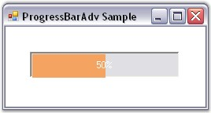
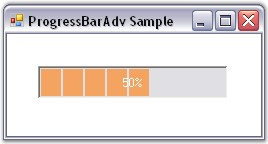
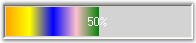
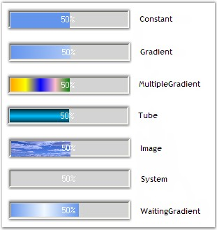
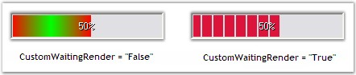

::: {style="DISPLAY: none"}
{#d2h_url_template}{#d2h_package_url style="WIDTH: 0px; DISPLAY: none; HEIGHT: 0px"}
:::

:::::::::::: {.d2h_secondary_topic style="PADDING-BOTTOM: 10pt; MARGIN: 0pt; PADDING-LEFT: 0pt; PADDING-RIGHT: 0pt; PADDING-TOP: 0pt"}
##### Foreground Settings {#foreground-settings style="MARGIN-LEFT: 18pt; tab-stops: 18.0pt"}

[]{style="COLOR: #15428b"} 

This section discusses the foreground settings of the ProgressBarAdv control.

 

The topics included are given below.

[]{style="COLOR: #15428b"} 

[]{style="COLOR: black"} 

 

 

 

[]{#p711} 

###### 3.7.1.3.3.1      Foreground Segment Settings {#foreground-segment-settings style="MARGIN-LEFT: 18pt; tab-stops: 18.0pt"}

[]{style="FONT-SIZE: 8pt"} 

The foreground segment settings available in the ProgressBarAdv control are explained below.

[]{style="FONT-FAMILY: 'Verdana','sans-serif'; FONT-SIZE: 8pt"} 

The foreground of the ProgressBarAdv can be displayed with a segmented appearance using the property given below.

[]{style="COLOR: #15428b"} 

::: {align="center"}
  ------------------------- --------------------------------------------
  ProgressBarAdv Property   Description
  ForeSegments              Determines if the foreground is segmented.
  ------------------------- --------------------------------------------
:::

[]{style="COLOR: #15428b"} 

By default this property will be set to \'True\'. To set it to \'False\', use the code snippet given below.

[]{style="COLOR: #15428b"} 

+------------------------------------------------------------------------------------------------------------------------------------------------------------+
| **[\[C#\]]{style="FONT-FAMILY: 'Courier New'; COLOR: black"}**                                                                                             |
|                                                                                                                                                            |
| []{style="FONT-FAMILY: 'Courier New'; COLOR: black"}                                                                                                       |
|                                                                                                                                                            |
| [this]{style="FONT-FAMILY: 'Courier New'; COLOR: blue"}[.progressBarAdv1.ForeSegments = [false]{style="COLOR: blue"};]{style="FONT-FAMILY: 'Courier New'"} |
+------------------------------------------------------------------------------------------------------------------------------------------------------------+

[]{style="COLOR: #15428b"} 

+---------------------------------------------------------------------------------------------------------------------------------------------------------+
| **[\[VB.NET\]]{style="FONT-FAMILY: 'Courier New'; COLOR: black"}**                                                                                      |
|                                                                                                                                                         |
| []{style="FONT-FAMILY: 'Courier New'; COLOR: black"}                                                                                                    |
|                                                                                                                                                         |
| [Me]{style="FONT-FAMILY: 'Courier New'; COLOR: blue"}[.progressBarAdv1.ForeSegments = [False]{style="COLOR: blue"}]{style="FONT-FAMILY: 'Courier New'"} |
+---------------------------------------------------------------------------------------------------------------------------------------------------------+

[]{style="COLOR: #4a5c8c; FONT-SIZE: 8pt"} 

[{border="0"}]{style="COLOR: #4a5c8c; FONT-SIZE: 8pt"}[]{style="COLOR: #4a5c8c; FONT-SIZE: 8pt"}

[]{style="COLOR: #15428b"} 

Figure 963: ForeSegments property set to \"False\"

[]{style="COLOR: #15428b"} 

Segment Width

[]{style="COLOR: #4a5c8c; FONT-SIZE: 8pt"} 

The foreground segments can be customized using the property given below.

[]{style="COLOR: #15428b"} 

::: {align="center"}
  ------------------------- --------------------------------------
  ProgressBarAdv Property   Description
  SegmentWidth              Specifies the width of the segments.
  ------------------------- --------------------------------------
:::

[]{style="COLOR: #4a5c8c; FONT-SIZE: 8pt"} 

+----------------------------------------------------------------------------------------------------------------------------------+
| **[\[C#\]]{style="FONT-FAMILY: 'Courier New'; COLOR: black"}**                                                                   |
|                                                                                                                                  |
| []{style="FONT-FAMILY: 'Courier New'; COLOR: black"}                                                                             |
|                                                                                                                                  |
| [this]{style="FONT-FAMILY: 'Courier New'; COLOR: blue"}[.progressBarAdv1.SegmentWidth = 20;]{style="FONT-FAMILY: 'Courier New'"} |
+----------------------------------------------------------------------------------------------------------------------------------+

[]{style="COLOR: #15428b"} 

+-------------------------------------------------------------------------------------------------------------------------------+
| **[\[VB.NET\]]{style="FONT-FAMILY: 'Courier New'; COLOR: black"}**                                                            |
|                                                                                                                               |
| []{style="FONT-FAMILY: 'Courier New'; COLOR: black"}                                                                          |
|                                                                                                                               |
| [Me]{style="FONT-FAMILY: 'Courier New'; COLOR: blue"}[.progressBarAdv1.SegmentWidth = 20]{style="FONT-FAMILY: 'Courier New'"} |
+-------------------------------------------------------------------------------------------------------------------------------+

[]{style="COLOR: #4a5c8c; FONT-SIZE: 8pt"} 

{border="0"}

[]{style="COLOR: #15428b"} 

Figure 964: SegmentWidth property set to \"20\"

[]{style="COLOR: #15428b"} 

See Also

**[]{style="COLOR: #15428b"}** 

[[Background Settings]{.UGHyperlink}](../../../../../../../../Documents%20and%20Settings/sylviap/Desktop/Tools%20-%20Part%202.docx#_Background_Settings)[]{.UGHyperlink}

 

 

 

[]{#p712} 

###### 3.7.1.3.3.2      Foreground Color Settings {#foreground-color-settings style="MARGIN-LEFT: 18pt; tab-stops: 18.0pt"}

[]{style="COLOR: #15428b"} 

This section illustrates the color settings that can be applied to the foreground of the ProgressBarAdv.

[]{style="COLOR: #15428b"} 

Font and Fore Color Settings

[]{style="COLOR: #4a5c8c; FONT-SIZE: 8pt"} 

The font color and the fore color can be set using the properties given below.

[]{style="COLOR: #15428b"} 

::: {align="center"}
  ------------------------- ------------------------------------------------------------------------------------
  ProgressBarAdv Property   Description
  ForeColor                 Specifies the color used to draw the foreground in segment mode and constant mode.
  FontColor                 Specifies the color of the font used to draw the text of the ProgressBarAdv.
  ------------------------- ------------------------------------------------------------------------------------
:::

[]{style="COLOR: #15428b"} 

+----------------------------------------------------------------------------------------------------------------------------------------------------------------------------------+
| **[\[C#\]]{style="FONT-FAMILY: 'Courier New'; COLOR: black"}**                                                                                                                   |
|                                                                                                                                                                                  |
| []{style="FONT-FAMILY: 'Courier New'; COLOR: black"}                                                                                                                             |
|                                                                                                                                                                                  |
| [this]{style="FONT-FAMILY: 'Courier New'; COLOR: blue"}[.progressBarAdv1.FontColor = System.Drawing.[Color]{style="COLOR: teal"}.SteelBlue;]{style="FONT-FAMILY: 'Courier New'"} |
|                                                                                                                                                                                  |
| [this]{style="FONT-FAMILY: 'Courier New'; COLOR: blue"}[.progressBarAdv1.ForeColor = System.Drawing.[Color]{style="COLOR: teal"}.Turquoise;]{style="FONT-FAMILY: 'Courier New'"} |
+----------------------------------------------------------------------------------------------------------------------------------------------------------------------------------+

[]{style="COLOR: #15428b"} 

+-------------------------------------------------------------------------------------------------------------------------------------------------------------------------------+
| **[\[VB.NET\]]{style="FONT-FAMILY: 'Courier New'; COLOR: black"}**                                                                                                            |
|                                                                                                                                                                               |
| []{style="FONT-FAMILY: 'Courier New'; COLOR: black"}                                                                                                                          |
|                                                                                                                                                                               |
| [Me]{style="FONT-FAMILY: 'Courier New'; COLOR: blue"}[.progressBarAdv1.FontColor = System.Drawing.[Color]{style="COLOR: teal"}.SteelBlue]{style="FONT-FAMILY: 'Courier New'"} |
|                                                                                                                                                                               |
| [Me]{style="FONT-FAMILY: 'Courier New'; COLOR: blue"}[.progressBarAdv1.ForeColor = System.Drawing.[Color]{style="COLOR: teal"}.Turquoise]{style="FONT-FAMILY: 'Courier New'"} |
+-------------------------------------------------------------------------------------------------------------------------------------------------------------------------------+

[]{style="COLOR: #15428b"} 

{border="0"}

[]{style="COLOR: #15428b"} 

Figure 965: FontColor and ForeColor Set

[]{style="COLOR: #15428b"} 

Gradient Color Settings

[]{style="COLOR: #15428b"} 

The color of the foreground gradient can be changed using the properties given below.

[]{style="COLOR: #15428b"} 

::: {align="center"}
+-----------------------------------+-----------------------------------------------------------+
| ProgressBarAdv Property           | Description                                               |
+-----------------------------------+-----------------------------------------------------------+
| GradientStartColor                | Specifies the start color of the foreground gradient.     |
|                                   |                                                           |
|                                   |                                                           |
|                                   |                                                           |
|                                   | The ProgressStyle property should be set to \'Gradient\'. |
+-----------------------------------+-----------------------------------------------------------+
| GradientEndColor                  | Specifies the start color of the foreground gradient.     |
|                                   |                                                           |
|                                   |                                                           |
|                                   |                                                           |
|                                   | The ProgressStyle property should be set to \'Gradient\'. |
+-----------------------------------+-----------------------------------------------------------+
:::

[]{style="COLOR: #15428b"} 

+-------------------------------------------------------------------------------------------------------------------------------------------------------------------------------------------+
| **[\[C#\]]{style="FONT-FAMILY: 'Courier New'; COLOR: black"}**                                                                                                                            |
|                                                                                                                                                                                           |
| []{style="FONT-FAMILY: 'Courier New'; COLOR: black"}                                                                                                                                      |
|                                                                                                                                                                                           |
| [this]{style="FONT-FAMILY: 'Courier New'; COLOR: blue"}[.progressBarAdv1.GradientEndColor = System.Drawing.[Color]{style="COLOR: teal"}.Yellow;]{style="FONT-FAMILY: 'Courier New'"}      |
|                                                                                                                                                                                           |
| [this]{style="FONT-FAMILY: 'Courier New'; COLOR: blue"}[.progressBarAdv1.GradientStartColor = System.Drawing.[Color]{style="COLOR: teal"}.OrangeRed;]{style="FONT-FAMILY: 'Courier New'"} |
+-------------------------------------------------------------------------------------------------------------------------------------------------------------------------------------------+

[]{style="COLOR: #15428b"} 

+-----------------------------------------------------------------------------------------------------------------------------------------------------------------+
| **[\[VB.NET\]]{style="FONT-FAMILY: 'Courier New'; COLOR: black"}**                                                                                              |
|                                                                                                                                                                 |
| []{style="FONT-FAMILY: 'Courier New'; COLOR: black"}                                                                                                            |
|                                                                                                                                                                 |
| [Me]{style="FONT-FAMILY: 'Courier New'; COLOR: blue"}[.progressBarAdv1.GradientEndColor = System.Drawing.Color.Yellow]{style="FONT-FAMILY: 'Courier New'"}      |
|                                                                                                                                                                 |
| [Me]{style="FONT-FAMILY: 'Courier New'; COLOR: blue"}[.progressBarAdv1.GradientStartColor = System.Drawing.Color.OrangeRed]{style="FONT-FAMILY: 'Courier New'"} |
+-----------------------------------------------------------------------------------------------------------------------------------------------------------------+

**[]{style="COLOR: #15428b"}** 

{border="0"}

[]{style="COLOR: #15428b"} 

Figure 966: Foreground Gradient Color Set

[]{style="COLOR: #15428b"} 

The foreground can be displayed with multiple colors using the property given below.

[]{style="COLOR: #15428b"} 

::: {align="center"}
+-----------------------------------+-------------------------------------------------------------------------------------+
| ProgressBarAdv Property           | Description                                                                         |
+-----------------------------------+-------------------------------------------------------------------------------------+
| MultipleColors                    | Specifies the array of colors used to draw the multiple gradient of the foreground. |
|                                   |                                                                                     |
|                                   |                                                                                     |
|                                   |                                                                                     |
|                                   | The ProgressStyle property should be set to \'MultipleGradient\'.                   |
+-----------------------------------+-------------------------------------------------------------------------------------+
| StretchMultGrad                   | Determines if the multiple gradient will be stretched.                              |
+-----------------------------------+-------------------------------------------------------------------------------------+
:::

[]{style="COLOR: #15428b"} 

+----------------------------------------------------------------------------------------------------------------------------------------------------------------------------------------------------------------------------------------------------------------------------------------------------------------------------------------------------------------------------------------------------------------------------------------------------------------------------+
| **[\[C#\]]{style="FONT-FAMILY: 'Courier New'; COLOR: black"}**                                                                                                                                                                                                                                                                                                                                                                                                             |
|                                                                                                                                                                                                                                                                                                                                                                                                                                                                            |
| []{style="FONT-FAMILY: 'Courier New'; COLOR: black"}                                                                                                                                                                                                                                                                                                                                                                                                                       |
|                                                                                                                                                                                                                                                                                                                                                                                                                                                                            |
| [this]{style="FONT-FAMILY: 'Courier New'; COLOR: blue"}[.progressBarAdv1.ProgressStyle = Syncfusion.Windows.Forms.Tools.[ProgressBarStyles]{style="COLOR: teal"}.MultipleGradient;]{style="FONT-FAMILY: 'Courier New'"}                                                                                                                                                                                                                                                    |
|                                                                                                                                                                                                                                                                                                                                                                                                                                                                            |
| [this]{style="FONT-FAMILY: 'Courier New'; COLOR: blue"}[.progressBarAdv1.MultipleColors = [new]{style="COLOR: blue"} System.Drawing.[Color]{style="COLOR: teal"}\[\] {System.Drawing.[Color]{style="COLOR: teal"}.Orange, System.Drawing.[Color]{style="COLOR: teal"}.Yellow, System.Drawing.[Color]{style="COLOR: teal"}.Blue, System.Drawing.[Color]{style="COLOR: teal"}.Pink, System.Drawing.[Color]{style="COLOR: teal"}.Green};]{style="FONT-FAMILY: 'Courier New'"} |
|                                                                                                                                                                                                                                                                                                                                                                                                                                                                            |
| [this]{style="FONT-FAMILY: 'Courier New'; COLOR: blue"}[.progressBarAdv1.StretchMultGrad = [false]{style="COLOR: blue"};]{style="FONT-FAMILY: 'Courier New'"}                                                                                                                                                                                                                                                                                                              |
+----------------------------------------------------------------------------------------------------------------------------------------------------------------------------------------------------------------------------------------------------------------------------------------------------------------------------------------------------------------------------------------------------------------------------------------------------------------------------+

[]{style="COLOR: #15428b"} 

+--------------------------------------------------------------------------------------------------------------------------------------------------------------------------------------------------------------------------------------------------------------------------------------------------------------------------------+
| **[\[VB.NET\]]{style="FONT-FAMILY: 'Courier New'; COLOR: black"}**                                                                                                                                                                                                                                                             |
|                                                                                                                                                                                                                                                                                                                                |
| []{style="FONT-FAMILY: 'Courier New'; COLOR: black"}                                                                                                                                                                                                                                                                           |
|                                                                                                                                                                                                                                                                                                                                |
| [Me]{style="FONT-FAMILY: 'Courier New'; COLOR: blue"}[.progressBarAdv1.ProgressStyle = Syncfusion.Windows.Forms.Tools.ProgressBarStyles.MultipleGradient]{style="FONT-FAMILY: 'Courier New'"}                                                                                                                                  |
|                                                                                                                                                                                                                                                                                                                                |
| [Me]{style="FONT-FAMILY: 'Courier New'; COLOR: blue"}[.progressBarAdv1.MultipleColors = [New]{style="COLOR: blue"} System.Drawing.Color\[\] {System.Drawing.Color.Orange, System.Drawing.Color.Yellow, System.Drawing.Color.Blue, System.Drawing.Color.Pink, System.Drawing.Color.Green};]{style="FONT-FAMILY: 'Courier New'"} |
|                                                                                                                                                                                                                                                                                                                                |
| [Me]{style="FONT-FAMILY: 'Courier New'; COLOR: blue"}[.progressBarAdv1.StretchMultGrad = [False]{style="COLOR: blue"}]{style="FONT-FAMILY: 'Courier New'"}                                                                                                                                                                     |
+--------------------------------------------------------------------------------------------------------------------------------------------------------------------------------------------------------------------------------------------------------------------------------------------------------------------------------+

[]{style="COLOR: #15428b"} 

{border="0"}

[]{style="COLOR: #15428b"} 

Figure 967: Foreground Gradient displayed with Multiple Colors

[]{style="COLOR: #4a5c8c; FONT-SIZE: 8pt"} 

Tube Color Settings

[]{style="COLOR: #15428b"} 

Colors can be set for the foreground tube of the ProgressBarAdv.

[]{style="COLOR: #15428b"} 

::: {align="center"}
+-----------------------------------+-------------------------------------------------------+
| ProgressBarAdv Property           | Description                                           |
+-----------------------------------+-------------------------------------------------------+
| TubeStartColor                    | Specifies the start color of the foreground tube.     |
|                                   |                                                       |
|                                   |                                                       |
|                                   |                                                       |
|                                   | The ProgressStyle property should be set to \'Tube\'. |
+-----------------------------------+-------------------------------------------------------+
| TubeEndColor                      | Specifies the start color of the foreground tube.     |
|                                   |                                                       |
|                                   |                                                       |
|                                   |                                                       |
|                                   | The ProgressStyle property should be set to \'Tube\'. |
+-----------------------------------+-------------------------------------------------------+
:::

[]{style="COLOR: #15428b"} 

+---------------------------------------------------------------------------------------------------------------------------------------------------------------------------------+
| **[\[C#\]]{style="FONT-FAMILY: 'Courier New'; COLOR: black"}**                                                                                                                  |
|                                                                                                                                                                                 |
| []{style="FONT-FAMILY: 'Courier New'; COLOR: black"}                                                                                                                            |
|                                                                                                                                                                                 |
| [this]{style="FONT-FAMILY: 'Courier New'; COLOR: blue"}[.progressBarAdv1.TubeEndColor = System.Drawing.[Color]{style="COLOR: teal"}.Black;]{style="FONT-FAMILY: 'Courier New'"} |
|                                                                                                                                                                                 |
| [this]{style="FONT-FAMILY: 'Courier New'; COLOR: blue"}[.progressBarAdv1.TubeStartColor = System.Drawing.[Color]{style="COLOR: teal"}.Red;]{style="FONT-FAMILY: 'Courier New'"} |
+---------------------------------------------------------------------------------------------------------------------------------------------------------------------------------+

[]{style="COLOR: #15428b"} 

+-------------------------------------------------------------------------------------------------------------------------------------------------------+
| **[\[VB.NET\]]{style="FONT-FAMILY: 'Courier New'; COLOR: black"}**                                                                                    |
|                                                                                                                                                       |
| []{style="FONT-FAMILY: 'Courier New'; COLOR: black"}                                                                                                  |
|                                                                                                                                                       |
| [Me]{style="FONT-FAMILY: 'Courier New'; COLOR: blue"}[.progressBarAdv1.TubeEndColor = System.Drawing.Color.Black]{style="FONT-FAMILY: 'Courier New'"} |
|                                                                                                                                                       |
| [Me]{style="FONT-FAMILY: 'Courier New'; COLOR: blue"}[.progressBarAdv1.TubeStartColor = System.Drawing.Color.Red]{style="FONT-FAMILY: 'Courier New'"} |
+-------------------------------------------------------------------------------------------------------------------------------------------------------+

[]{style="COLOR: #15428b"} 

{border="0"}

[]{style="COLOR: #15428b"} 

Figure 968: Foreground Tube Color Set

[]{style="COLOR: #15428b"} 

See Also

[]{style="COLOR: #15428b"} 

[[Background Color Settings]{.UGHyperlink}](../../../../../../../../Documents%20and%20Settings/sylviap/Desktop/Tools%20-%20Part%202.docx#_Background_Color_Settings)[]{.UGHyperlink}

 

 

 

[]{#p713} 

###### 3.7.1.3.3.3      Foreground Image Settings {#foreground-image-settings style="MARGIN-LEFT: 18pt; tab-stops: 18.0pt"}

[]{style="COLOR: #15428b"} 

This section discusses the foreground image settings of ProgressBarAdv.

 

When the BackgroundStyle and ProgressStyle are set to the \'Image\' style, then the foreground image can be specified using the below given property.

[]{style="COLOR: #15428b"} 

::: {align="center"}
  ------------------------- -----------------------------------------------------------
  ProgressBarAdv Property   Description
  ForegroundImage           Determines if the foreground is segmented.
  StretchImage              Indicates whether the foreground image will be stretched.
  ------------------------- -----------------------------------------------------------
:::

[]{style="COLOR: #15428b"} 

+--------------------------------------------------------------------------------------------------------------------------------------------------------------------------------------------------------------------------------------------------------------------------------------------------------------+
| **[\[C#\]]{style="FONT-FAMILY: 'Courier New'; COLOR: black"}**                                                                                                                                                                                                                                               |
|                                                                                                                                                                                                                                                                                                              |
| []{style="FONT-FAMILY: 'Courier New'; COLOR: black"}                                                                                                                                                                                                                                                         |
|                                                                                                                                                                                                                                                                                                              |
| [this]{style="FONT-FAMILY: 'Courier New'; COLOR: blue"}[.progressBarAdv1.ForegroundImage = ((System.Drawing.[Image]{style="COLOR: teal"})(resources.GetObject(]{style="FONT-FAMILY: 'Courier New'"}[\"clouds\"]{style="FONT-FAMILY: 'Courier New'; COLOR: maroon"}[)));]{style="FONT-FAMILY: 'Courier New'"} |
|                                                                                                                                                                                                                                                                                                              |
| [this]{style="FONT-FAMILY: 'Courier New'; COLOR: blue"}[.progressBarAdv1.StretchImage = [true]{style="COLOR: blue"};]{style="FONT-FAMILY: 'Courier New'"}                                                                                                                                                    |
+--------------------------------------------------------------------------------------------------------------------------------------------------------------------------------------------------------------------------------------------------------------------------------------------------------------+

[]{style="COLOR: #15428b"} 

+---------------------------------------------------------------------------------------------------------------------------------------------------------------------------------------------------------------------------------------------------------------------------------------------------------------------------------------+
| **[\[VB.NET\]]{style="FONT-FAMILY: 'Courier New'; COLOR: black"}**                                                                                                                                                                                                                                                                    |
|                                                                                                                                                                                                                                                                                                                                       |
| []{style="FONT-FAMILY: 'Courier New'; COLOR: black"}                                                                                                                                                                                                                                                                                  |
|                                                                                                                                                                                                                                                                                                                                       |
| [Me]{style="FONT-FAMILY: 'Courier New'; COLOR: blue"}[.progressBarAdv1.ForegroundImage = [CType]{style="COLOR: blue"}((resources.GetObject(]{style="FONT-FAMILY: 'Courier New'"}[\"clouds\"]{style="FONT-FAMILY: 'Courier New'; COLOR: maroon"}[)), System.Drawing.[Image]{style="COLOR: teal"})]{style="FONT-FAMILY: 'Courier New'"} |
|                                                                                                                                                                                                                                                                                                                                       |
| [Me]{style="FONT-FAMILY: 'Courier New'; COLOR: blue"}[.progressBarAdv1.StretchImage = [True]{style="COLOR: blue"}]{style="FONT-FAMILY: 'Courier New'"}                                                                                                                                                                                |
+---------------------------------------------------------------------------------------------------------------------------------------------------------------------------------------------------------------------------------------------------------------------------------------------------------------------------------------+

[]{style="COLOR: #15428b"} 

[{border="0"}]{style="COLOR: #15428b"}[]{style="COLOR: #15428b"}

[]{style="COLOR: #15428b"} 

Figure 969: ProgressBarAdv displayed with Foreground Image

 

 

 

[]{#p714} 

###### []{#_Foreground_Style_Settings}3.7.1.3.3.4      Foreground Style Settings {#foreground-style-settings style="MARGIN-LEFT: 18pt; tab-stops: 18.0pt"}

[]{style="COLOR: #15428b"} 

The progress style of the ProgressBarAdv control can be set using the properties given below.

[]{style="FONT-SIZE: 8pt"} 

::: {align="center"}
+-----------------------------------+-----------------------------------------------------------------------------------------------------------------------------------+
| ProgressBarAdv Property           | Description                                                                                                                       |
+-----------------------------------+-----------------------------------------------------------------------------------------------------------------------------------+
| ProgressStyle                     | Determines the foreground drawing style. It includes the options given below.                                                     |
|                                   |                                                                                                                                   |
|                                   |                                                                                                                                   |
|                                   |                                                                                                                                   |
|                                   | [·      ]{style="FONT-FAMILY: Symbol"}Constant,                                                                                   |
|                                   |                                                                                                                                   |
|                                   | [·      ]{style="FONT-FAMILY: Symbol"}Gradient,                                                                                   |
|                                   |                                                                                                                                   |
|                                   | [·      ]{style="FONT-FAMILY: Symbol"}MultipleGradient,                                                                           |
|                                   |                                                                                                                                   |
|                                   | [·      ]{style="FONT-FAMILY: Symbol"}Tube,                                                                                       |
|                                   |                                                                                                                                   |
|                                   | [·      ]{style="FONT-FAMILY: Symbol"}Image and                                                                                   |
|                                   |                                                                                                                                   |
|                                   | [·      ]{style="FONT-FAMILY: Symbol"}System.                                                                                     |
+-----------------------------------+-----------------------------------------------------------------------------------------------------------------------------------+
| ProgressFallbackStyle             | Determines the foreground drawing style when the ProgressStyle is set to \'System\', provided the system doesn\'t support themes. |
+-----------------------------------+-----------------------------------------------------------------------------------------------------------------------------------+
:::

[]{style="COLOR: #15428b"} 

+---------------------------------------------------------------------------------------------------------------------------------------------------------------------------------------------------------------------------------+
| **[\[C#\]]{style="FONT-FAMILY: 'Courier New'; COLOR: black"}**                                                                                                                                                                  |
|                                                                                                                                                                                                                                 |
| []{style="FONT-FAMILY: 'Courier New'; COLOR: black"}                                                                                                                                                                            |
|                                                                                                                                                                                                                                 |
| [this]{style="FONT-FAMILY: 'Courier New'; COLOR: blue"}[.progressBarAdv1.ProgressStyle = Syncfusion.Windows.Forms.Tools.[ProgressBarStyles]{style="COLOR: teal"}.WaitingGradient;]{style="FONT-FAMILY: 'Courier New'"}          |
|                                                                                                                                                                                                                                 |
| [this]{style="FONT-FAMILY: 'Courier New'; COLOR: blue"}[.progressBarAdv1.ProgressFallbackStyle = Syncfusion.Windows.Forms.Tools.[ProgressBarStyles]{style="COLOR: teal"}.MultipleGradient;]{style="FONT-FAMILY: 'Courier New'"} |
+---------------------------------------------------------------------------------------------------------------------------------------------------------------------------------------------------------------------------------+

[]{style="COLOR: #15428b"} 

+--------------------------------------------------------------------------------------------------------------------------------------------------------------------------------------------------------------------------------+
| **[\[VB.NET\]]{style="FONT-FAMILY: 'Courier New'; COLOR: black"}**                                                                                                                                                             |
|                                                                                                                                                                                                                                |
| []{style="FONT-FAMILY: 'Courier New'; COLOR: black"}                                                                                                                                                                           |
|                                                                                                                                                                                                                                |
| [Me]{style="FONT-FAMILY: 'Courier New'; COLOR: blue"}[.progressBarAdv1.ProgressStyle = Syncfusion.Windows.Forms.Tools.ProgressBarStyles.WaitingGradient]{style="FONT-FAMILY: 'Courier New'"}                                   |
|                                                                                                                                                                                                                                |
| [Me]{style="FONT-FAMILY: 'Courier New'; COLOR: blue"}[.progressBarAdv1.ProgressFallbackStyle = Syncfusion.Windows.Forms.Tools.[ProgressBarStyles]{style="COLOR: black"}.MultipleGradient;]{style="FONT-FAMILY: 'Courier New'"} |
+--------------------------------------------------------------------------------------------------------------------------------------------------------------------------------------------------------------------------------+

[]{style="COLOR: #15428b"} 

[{border="0"}]{style="COLOR: #15428b"}[]{style="COLOR: #15428b"}

[]{style="COLOR: #15428b"} 

Figure 970: Foreground Styles

[]{style="COLOR: #15428b"} 

The **Waiting Gradient** Style of the ProgressBarAdv consists of the following properties that can be used to change the appearance and behavior of the style.

[]{style="COLOR: #15428b"} 

::: {align="center"}
+-----------------------------------+-----------------------------------------------------------------------------------------------------------------------------------------+
| ProgressBarAdv Property           | Description                                                                                                                             |
+-----------------------------------+-----------------------------------------------------------------------------------------------------------------------------------------+
| WaitingGradientEnabled            | Determines if the waiting gradient is enabled.                                                                                          |
|                                   |                                                                                                                                         |
|                                   |                                                                                                                                         |
|                                   |                                                                                                                                         |
|                                   | The ProgressStyle property should be set to \'WaitingGradient\'.                                                                        |
+-----------------------------------+-----------------------------------------------------------------------------------------------------------------------------------------+
| WaitingGradientInterval           | Determines the interval of the waiting gradient.                                                                                        |
+-----------------------------------+-----------------------------------------------------------------------------------------------------------------------------------------+
| WaitingGradientWidth              | Determines the width of the waiting gradient.                                                                                           |
+-----------------------------------+-----------------------------------------------------------------------------------------------------------------------------------------+
| CustomWaitingRender               | Indicates whether the waiting gradient will be replaced by another custom waiting render which is defaulted to segments.                |
|                                   |                                                                                                                                         |
|                                   |                                                                                                                                         |
|                                   |                                                                                                                                         |
|                                   | This property when set to \'True\' will display the foreground with segments in the color that has been set for the ForeColor property. |
|                                   |                                                                                                                                         |
|                                   |                                                                                                                                         |
|                                   |                                                                                                                                         |
|                                   | This property when set to \'False\' will display the foreground in the default waiting gradient style.                                  |
+-----------------------------------+-----------------------------------------------------------------------------------------------------------------------------------------+
:::

[]{style="COLOR: #15428b"} 

+--------------------------------------------------------------------------------------------------------------------------------------------------------------------------------+
| **[\[C#\]]{style="FONT-FAMILY: 'Courier New'; COLOR: black"}**                                                                                                                 |
|                                                                                                                                                                                |
| []{style="FONT-FAMILY: 'Courier New'; COLOR: black"}                                                                                                                           |
|                                                                                                                                                                                |
| [this]{style="FONT-FAMILY: 'Courier New'; COLOR: blue"}[.progressBarAdv1.WaitingGradientEnabled = [true]{style="COLOR: blue"};]{style="FONT-FAMILY: 'Courier New'"}            |
|                                                                                                                                                                                |
| [this]{style="FONT-FAMILY: 'Courier New'; COLOR: blue"}[.progressBarAdv1.WaitingGradientInterval = 20;]{style="FONT-FAMILY: 'Courier New'"}                                    |
|                                                                                                                                                                                |
| [this]{style="FONT-FAMILY: 'Courier New'; COLOR: blue"}[.progressBarAdv1.WaitingGradientWidth = 500;]{style="FONT-FAMILY: 'Courier New'"}                                      |
|                                                                                                                                                                                |
| [this]{style="FONT-FAMILY: 'Courier New'; COLOR: blue"}[.progressBarAdv1.CustomWaitingRender = [true]{style="COLOR: blue"};]{style="FONT-FAMILY: 'Courier New'"}               |
|                                                                                                                                                                                |
| [this]{style="FONT-FAMILY: 'Courier New'; COLOR: blue"}[.progressBarAdv1.ForeColor = System.Drawing.[Color]{style="COLOR: teal"}.Crimson;]{style="FONT-FAMILY: 'Courier New'"} |
+--------------------------------------------------------------------------------------------------------------------------------------------------------------------------------+

[]{style="COLOR: #15428b"} 

+------------------------------------------------------------------------------------------------------------------------------------------------------------------+
| **[\[VB.NET\]]{style="FONT-FAMILY: 'Courier New'; COLOR: black"}**                                                                                               |
|                                                                                                                                                                  |
| []{style="FONT-FAMILY: 'Courier New'; COLOR: black"}                                                                                                             |
|                                                                                                                                                                  |
| [Me]{style="FONT-FAMILY: 'Courier New'; COLOR: blue"}[.progressBarAdv1.WaitingGradientEnabled = [True]{style="COLOR: blue"}]{style="FONT-FAMILY: 'Courier New'"} |
|                                                                                                                                                                  |
| [Me]{style="FONT-FAMILY: 'Courier New'; COLOR: blue"}[.progressBarAdv1.WaitingGradientInterval = 20]{style="FONT-FAMILY: 'Courier New'"}                         |
|                                                                                                                                                                  |
| [Me]{style="FONT-FAMILY: 'Courier New'; COLOR: blue"}[.progressBarAdv1.WaitingGradientWidth = 500]{style="FONT-FAMILY: 'Courier New'"}                           |
|                                                                                                                                                                  |
| [Me]{style="FONT-FAMILY: 'Courier New'; COLOR: blue"}[.progressBarAdv1.CustomWaitingRender = [True]{style="COLOR: blue"}]{style="FONT-FAMILY: 'Courier New'"}    |
|                                                                                                                                                                  |
| [Me]{style="FONT-FAMILY: 'Courier New'; COLOR: blue"}[.progressBarAdv1.ForeColor = System.Drawing.Color.Crimson]{style="FONT-FAMILY: 'Courier New'"}             |
+------------------------------------------------------------------------------------------------------------------------------------------------------------------+

[]{style="FONT-SIZE: 8pt"} 

{border="0"}

**[]{style="COLOR: #15428b"}** 

Figure 971: CustomWaitingRender property of ProgressBarAdv

[]{style="FONT-SIZE: 8pt"} 

See Also

[]{style="COLOR: #15428b"} 

[[Background Settings]{.UGHyperlink}](../../../../../../../../Documents%20and%20Settings/sylviap/Desktop/Tools%20-%20Part%202.docx#_Background_Settings)[]{.UGHyperlink}

 

 

 

[]{#p715} 

[]{#related-topics}
::::::::::::
