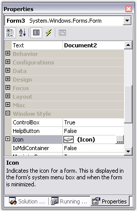

::: {style="DISPLAY: none"}
{#d2h_url_template}{#d2h_package_url style="WIDTH: 0px; DISPLAY: none; HEIGHT: 0px"}
:::

:::: {.d2h_secondary_topic style="PADDING-BOTTOM: 10pt; MARGIN: 0pt; PADDING-LEFT: 0pt; PADDING-RIGHT: 0pt; PADDING-TOP: 0pt"}
##### Foreground Settings {#foreground-settings style="MARGIN-LEFT: 18pt; tab-stops: 18.0pt"}

[]{style="COLOR: #15428b"} 

This section guides you in setting the text and icons for the tabs.

[]{style="COLOR: #15428b"} 

Tab Text

[]{style="COLOR: blue; FONT-SIZE: 8pt"} 

The text of the tabs can be set by directly setting the **Text** property of the form, if the tabbed window is going to be a normal form.

[]{style="COLOR: #15428b"} 

Icon Settings

[]{style="FONT-FAMILY: 'Verdana','sans-serif'; COLOR: #485e8c; FONT-SIZE: 8pt"} 

The below properties controls the appearance and behavior of the icon settings.

[]{style="COLOR: #15428b"} 

::: {align="center"}
  ---------------------------- ---------------------------------------------------------------------------------------------------------------------------------------------------------------
   TabbedMDIManager Property   Description
  Icon                         Gets / sets icons for tabs. When the Icon property is clicked, the browse page will be displayed, through which the user can select the icon to be displayed.
  UseIconsInTabs               Gets / sets the value which determines whether icons should be added to the MDIChild.
  ImageSize                    The size of the image or icon that you want to add to the tabs can be set using this property.
  ---------------------------- ---------------------------------------------------------------------------------------------------------------------------------------------------------------
:::

[]{style="COLOR: #15428b"} 

+---------------------------------------------------------------------------------------------------------------------------------------------------------------------------------------------------------------------+
| **[\[C#\]]{style="FONT-FAMILY: 'Courier New'; COLOR: black"}**                                                                                                                                                      |
|                                                                                                                                                                                                                     |
| []{style="FONT-FAMILY: 'Courier New'; COLOR: black"}                                                                                                                                                                |
|                                                                                                                                                                                                                     |
| [this]{style="FONT-FAMILY: 'Courier New'; COLOR: blue"}[.Text = [\"Tabbed MDI Demo (Syncfusion Inc.)\"]{style="COLOR: maroon"};]{style="FONT-FAMILY: 'Courier New'"}                                                |
|                                                                                                                                                                                                                     |
| [this]{style="FONT-FAMILY: 'Courier New'; COLOR: blue"}[.Icon = ((System.Drawing.[Icon]{style="COLOR: teal"})(resources.GetObject([\"\$this.Icon\"]{style="COLOR: maroon"})));]{style="FONT-FAMILY: 'Courier New'"} |
|                                                                                                                                                                                                                     |
| [this]{style="FONT-FAMILY: 'Courier New'; COLOR: blue"}[.TabbedMDIManager.UseIconsInTabs = [false;]{style="COLOR: blue"}]{style="FONT-FAMILY: 'Courier New'"}                                                       |
|                                                                                                                                                                                                                     |
| [this]{style="FONT-FAMILY: 'Courier New'; COLOR: blue"}[.tabbedMDIManager1.ImageSize = [new]{style="COLOR: blue"} System.Drawing.[Size]{style="COLOR: teal"}(16, 16);]{style="FONT-FAMILY: 'Courier New'"}          |
+---------------------------------------------------------------------------------------------------------------------------------------------------------------------------------------------------------------------+

[]{style="COLOR: #15428b"} 

+-----------------------------------------------------------------------------------------------------------------------------------------------------------------------------------------------------------------------+
| **[\[VB.NET\]]{style="FONT-FAMILY: 'Courier New'; COLOR: black"}**                                                                                                                                                    |
|                                                                                                                                                                                                                       |
| []{style="FONT-FAMILY: 'Courier New'; COLOR: black"}                                                                                                                                                                  |
|                                                                                                                                                                                                                       |
| [Me]{style="FONT-FAMILY: 'Courier New'; COLOR: blue"}[.Text = [\"Tabbed MDI Demo (Syncfusion Inc.)\"]{style="COLOR: maroon"} ]{style="FONT-FAMILY: 'Courier New'"}                                                    |
|                                                                                                                                                                                                                       |
| [Me]{style="FONT-FAMILY: 'Courier New'; COLOR: blue"}[.Icon = [CType]{style="COLOR: blue"}((resources.GetObject([\"\$this.Icon\"]{style="COLOR: maroon"})), System.Drawing.Icon)]{style="FONT-FAMILY: 'Courier New'"} |
|                                                                                                                                                                                                                       |
| [Me]{style="FONT-FAMILY: 'Courier New'; COLOR: blue"}[.TabbedMDIManager.UseIconsInTabs = [False]{style="COLOR: blue"}]{style="FONT-FAMILY: 'Courier New'"}                                                            |
|                                                                                                                                                                                                                       |
| [Me]{style="FONT-FAMILY: 'Courier New'; COLOR: blue"}[.TabbedMDIManager1.ImageSize = [New]{style="COLOR: blue"} System.Drawing.Size(20, 20)]{style="FONT-FAMILY: 'Courier New'"}                                      |
+-----------------------------------------------------------------------------------------------------------------------------------------------------------------------------------------------------------------------+

[]{style="COLOR: #485e8c; FONT-SIZE: 8pt"} 

{border="0"}

**[]{style="COLOR: #15428b"}** 

Figure 1099: Text and Icon Properties in the Properties Grid

 

 

 

[]{#p918} 

[]{#related-topics}
::::
