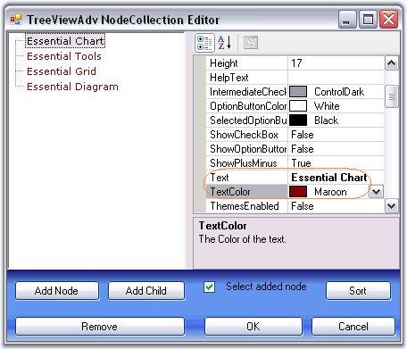
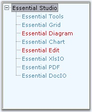

::: {style="DISPLAY: none"}
{#d2h_url_template}{#d2h_package_url style="WIDTH: 0px; DISPLAY: none; HEIGHT: 0px"}
:::

:::::::::::: {.d2h_secondary_topic style="PADDING-BOTTOM: 10pt; MARGIN: 0pt; PADDING-LEFT: 0pt; PADDING-RIGHT: 0pt; PADDING-TOP: 0pt"}
##### Foreground Settings {#foreground-settings style="MARGIN-LEFT: 18pt; tab-stops: 18.0pt"}

**[]{style="COLOR: #15428b"}** 

Foreground Settings for the tree node text

 

Using the Text and TextColor property, individual node\'s text can be edited and colored respectively.

 

Using the Font and the ForeColor properties of the control, the text and text color of the nodes can be set for all the nodes in the TreeView control.

[]{style="COLOR: #15428b"} 

::: {style="BORDER-BOTTOM: windowtext 1pt solid; BORDER-LEFT: medium none; PADDING-BOTTOM: 1pt; MARGIN: 9pt 0pt 9pt 18pt; PADDING-LEFT: 0pt; PADDING-RIGHT: 0pt; BORDER-TOP: windowtext 1pt solid; BORDER-RIGHT: medium none; PADDING-TOP: 1pt"}
{border="0"} Note: The font style for individual nodes, can be set using the Font property available for individual nodes using NodeCollection Editor.
:::

[]{style="COLOR: #15428b"} 

::: {align="center"}
  ------------------------ --------------------------------------------
  TreeViewAdv Properties   Description
  Font                     Specifies the Font style of the node text.
  ForeColor                Specifies the text color of the nodes.
  ------------------------ --------------------------------------------
:::

[]{style="COLOR: #15428b"} 

::: {align="center"}
  ------------------------ --------------------------------------------
  TreeViewAdv Properties   Description
  Text                     Sets text for the node.
  TextColor                Sets the color for the specific node text.
  ------------------------ --------------------------------------------
:::

[]{style="COLOR: #15428b"} 

::: {style="BORDER-BOTTOM: windowtext 1pt solid; BORDER-LEFT: medium none; PADDING-BOTTOM: 1pt; MARGIN: 9pt 0pt 9pt 18pt; PADDING-LEFT: 0pt; PADDING-RIGHT: 0pt; BORDER-TOP: windowtext 1pt solid; BORDER-RIGHT: medium none; PADDING-TOP: 1pt"}
{border="0"} Note: When you set the ForeColor property for TreeViewAdv control, it will get reflected in the Node\'s TextColor property. User can change the color for specific nodes using TreeNodeAdv.TextColor property.
:::

[]{style="COLOR: #15428b"} 

{border="0"}

[]{style="COLOR: #15428b"} 

Figure 1148: TextColor property in the TreeViewAdv NodeCollection Editor

[]{style="COLOR: #15428b"} 

See Also

[]{style="COLOR: #15428b"} 

###### []{#_Drawing_Selected_Node}3.11.3.5.2.1    Drawing Selected Node Foreground {#drawing-selected-node-foreground style="MARGIN-LEFT: 18pt; tab-stops: 18.0pt"}

[]{style="COLOR: #15428b"} 

Painting the foreground of the Specified Nodes

**[]{style="COLOR: #15428b"}** 

User can paint specific nodes using the BeforeNodePaint event.

[]{style="COLOR: #15428b"} 

::: {align="center"}
  ------------------- -----------------------------------------
  TreeNodeAdv event   Description
  BeforeNodePaint     Handled before a node is being painted.
  ------------------- -----------------------------------------
:::

***[]{style="COLOR: black; FONT-SIZE: 8pt"}*** 

::: {style="BORDER-BOTTOM: windowtext 1pt solid; BORDER-LEFT: medium none; PADDING-BOTTOM: 1pt; MARGIN: 9pt 0pt 9pt 18pt; PADDING-LEFT: 0pt; PADDING-RIGHT: 0pt; BORDER-TOP: windowtext 1pt solid; BORDER-RIGHT: medium none; PADDING-TOP: 1pt"}
[{border="0"}]{style="COLOR: black; FONT-SIZE: 8pt"} Note:[ ]{style="COLOR: black; FONT-SIZE: 8pt"}OwnerDrawNodes property should be set to true while handling this event.
:::

[]{style="COLOR: #15428b"} 

::: {align="center"}
  ------------------------ -----------------------------------------------------------------------------
  treeViewAdv Properties   Description
  OwnerDrawNodes           Indicates if the BeforeNodePaint event will be fired before drawing a node.
  ------------------------ -----------------------------------------------------------------------------
:::

[]{style="COLOR: #15428b"} 

+-----------------------------------------------------------------------------------------------------------------------------------------------------------------------------------------------------------------------------------------------------+
| **[\[C#\]]{style="FONT-FAMILY: 'Courier New'; COLOR: black"}**                                                                                                                                                                                      |
|                                                                                                                                                                                                                                                     |
| []{style="COLOR: #15428b"}                                                                                                                                                                                                                          |
|                                                                                                                                                                                                                                                     |
| [this]{style="FONT-FAMILY: 'Courier New'; COLOR: blue"}[.treeViewAdv1.OwnerDrawNodes = [true]{style="COLOR: blue"};]{style="FONT-FAMILY: 'Courier New'"}                                                                                            |
|                                                                                                                                                                                                                                                     |
| [// Enabling Node\'s Foreground]{style="FONT-FAMILY: 'Courier New'; COLOR: green"}                                                                                                                                                                  |
|                                                                                                                                                                                                                                                     |
| [private]{style="FONT-FAMILY: 'Courier New'; COLOR: blue"}[ [void]{style="COLOR: blue"} treeViewAdv1_BeforeNodePaint([object]{style="COLOR: blue"} sender, [TreeNodeAdvPaintEventArgs]{style="COLOR: teal"} e)]{style="FONT-FAMILY: 'Courier New'"} |
|                                                                                                                                                                                                                                                     |
| [{]{style="FONT-FAMILY: 'Courier New'"}                                                                                                                                                                                                             |
|                                                                                                                                                                                                                                                     |
| [ [if]{style="COLOR: blue"} (e.Node.Index == 2 \| e.Node.Index == 4)]{style="FONT-FAMILY: 'Courier New'"}                                                                                                                                           |
|                                                                                                                                                                                                                                                     |
| [ {]{style="FONT-FAMILY: 'Courier New'"}                                                                                                                                                                                                            |
|                                                                                                                                                                                                                                                     |
| [     e.ForeColor=[Color]{style="COLOR: teal"}.Red;]{style="FONT-FAMILY: 'Courier New'"}                                                                                                                                                            |
|                                                                                                                                                                                                                                                     |
| [ }]{style="FONT-FAMILY: 'Courier New'"}                                                                                                                                                                                                            |
|                                                                                                                                                                                                                                                     |
| [}]{style="FONT-FAMILY: 'Courier New'"}[]{style="FONT-FAMILY: 'Courier New'"}                                                                                                                                                                       |
+-----------------------------------------------------------------------------------------------------------------------------------------------------------------------------------------------------------------------------------------------------+

[]{style="COLOR: #15428b"} 

+-------------------------------------------------------------------------------------------------------------------------------------------------------------------------------------------------------------------------------------------------------------------------------------------------------------------------------------------+
| **[\[VB.NET\]]{style="FONT-FAMILY: 'Courier New'; COLOR: black"}**                                                                                                                                                                                                                                                                        |
|                                                                                                                                                                                                                                                                                                                                           |
| []{style="COLOR: black"}                                                                                                                                                                                                                                                                                                                  |
|                                                                                                                                                                                                                                                                                                                                           |
| [Me]{style="FONT-FAMILY: 'Courier New'; COLOR: blue"}[.treeViewAdv1.OwnerDrawNodes = [True]{style="COLOR: blue"}]{style="FONT-FAMILY: 'Courier New'"}                                                                                                                                                                                     |
|                                                                                                                                                                                                                                                                                                                                           |
| [\' Enabling Node\'s Foreground]{style="FONT-FAMILY: 'Courier New'; COLOR: green"}                                                                                                                                                                                                                                                        |
|                                                                                                                                                                                                                                                                                                                                           |
| [Private]{style="FONT-FAMILY: 'Courier New'; COLOR: blue"}[ [Sub]{style="COLOR: blue"} treeViewAdv1_BeforeNodePaint([ByVal]{style="COLOR: blue"} sender [As]{style="COLOR: blue"} [Object]{style="COLOR: blue"}, [ByVal]{style="COLOR: blue"} e [As]{style="COLOR: blue"} TreeNodeAdvPaintEventArgs)]{style="FONT-FAMILY: 'Courier New'"} |
|                                                                                                                                                                                                                                                                                                                                           |
| [   If]{style="FONT-FAMILY: 'Courier New'; COLOR: blue"}[ e.Node.Index = 2 [Or]{style="COLOR: blue"} e.Node.Index = 4 [Then]{style="COLOR: blue"}]{style="FONT-FAMILY: 'Courier New'"}                                                                                                                                                    |
|                                                                                                                                                                                                                                                                                                                                           |
| [             e.ForeColor = Color.Red]{style="FONT-FAMILY: 'Courier New'"}                                                                                                                                                                                                                                                                |
|                                                                                                                                                                                                                                                                                                                                           |
| [   [End]{style="COLOR: blue"} [If]{style="COLOR: blue"}]{style="FONT-FAMILY: 'Courier New'"}                                                                                                                                                                                                                                             |
|                                                                                                                                                                                                                                                                                                                                           |
| [End]{style="FONT-FAMILY: 'Courier New'; COLOR: blue"}[ [Sub]{style="COLOR: blue"}]{style="FONT-FAMILY: 'Courier New'"}[]{style="FONT-FAMILY: 'Courier New'; COLOR: blue"}                                                                                                                                                                |
+-------------------------------------------------------------------------------------------------------------------------------------------------------------------------------------------------------------------------------------------------------------------------------------------------------------------------------------------+

[]{style="COLOR: #15428b"} 

{border="0"}

**[]{style="COLOR: #15428b"}** 

Figure 1149: Node2 and Node4 painted by using BeforeNodePaint Event

**[]{style="COLOR: #15428b"}** 

Active Node Foreground Settings

 

SelectedNodeForeColor property lets you paint the selected node.

[]{style="COLOR: #15428b"} 

::: {align="center"}
  ------------------------ -------------------------------------------------------
  treeViewAdv Properties   Description
  SelectedNodeForeColor    Indicates the forecolor of the node that is selected.
  ------------------------ -------------------------------------------------------
:::

[]{style="COLOR: #15428b"} 

+-----------------------------------------------------------------------------------------------------------------------------------------------------------------------------------------------------+
| **[\[C#\]]{style="FONT-FAMILY: 'Courier New'; COLOR: black"}**                                                                                                                                      |
|                                                                                                                                                                                                     |
| []{style="FONT-FAMILY: 'Courier New'; COLOR: black"}                                                                                                                                                |
|                                                                                                                                                                                                     |
| [this]{style="FONT-FAMILY: 'Courier New'; COLOR: blue"}[.treeViewAdv1.SelectedNodeForeColor = System.Drawing.Color.Gray;]{style="FONT-FAMILY: 'Courier New'"}[]{style="FONT-FAMILY: 'Courier New'"} |
+-----------------------------------------------------------------------------------------------------------------------------------------------------------------------------------------------------+

[]{#p982}[]{style="COLOR: #15428b"} 

+--------------------------------------------------------------------------------------------------------------------------------------------------------------------------------------------------+
| **[\[VB.NET\]]{style="FONT-FAMILY: 'Courier New'; COLOR: black"}**                                                                                                                               |
|                                                                                                                                                                                                  |
| []{style="FONT-FAMILY: 'Courier New'; COLOR: black"}                                                                                                                                             |
|                                                                                                                                                                                                  |
| [Me]{style="FONT-FAMILY: 'Courier New'; COLOR: blue"}[.treeViewAdv1.SelectedNodeForeColor = System.Drawing.Color.Gray]{style="FONT-FAMILY: 'Courier New'"}[]{style="FONT-FAMILY: 'Courier New'"} |
+--------------------------------------------------------------------------------------------------------------------------------------------------------------------------------------------------+

[]{style="COLOR: #15428b"} 

Post Default Drawing

[]{style="COLOR: #15428b"} 

Users can also draw on the node, after the default drawing routines have rendered the node appropriately. Users can do so by first turning on OwnerDrawnNodes in the tree and listening to the [AfterNodePaint]{style="FONT-FAMILY: 'Verdana','sans-serif'; COLOR: black; FONT-SIZE: 8pt"} event.

[]{style="COLOR: #15428b"} 

::: {align="center"}
  ----------------------------------- ----------------------------------
  []{#p983}TooltipTreeNodeAdv event   Description
  AfterNodePaint                      Handled after a node is painted.
  ----------------------------------- ----------------------------------
:::

[]{style="COLOR: #15428b"} 

See Also

[[]{style="TEXT-DECORATION: none"}]{.UGHyperlink} 

[[Image Overlaying]{.UGHyperlink}](../../../../../../../../Documents%20and%20Settings/sylviap/Desktop/Tools%20-%20Part%202.docx#_Image_Overlaying)[]{.UGHyperlink}

 

 

 

 

[]{#related-topics}
::::::::::::
