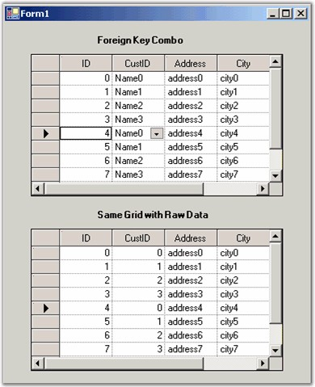

::: {style="DISPLAY: none"}
{#d2h_url_template}{#d2h_package_url style="WIDTH: 0px; DISPLAY: none; HEIGHT: 0px"}
:::

::: {.d2h_secondary_topic style="PADDING-BOTTOM: 10pt; MARGIN: 0pt; PADDING-LEFT: 0pt; PADDING-RIGHT: 0pt; PADDING-TOP: 0pt"}
#### Foreign Key Columns: Showing One Value but Saving Another {#foreign-key-columns-showing-one-value-but-saving-another style="tab-stops: 0pt"}

[]{style="FONT-FAMILY: 'Trebuchet MS','sans-serif'; COLOR: #15428b; FONT-SIZE: 9pt"} 

Very often a table will have a column that displays an ID key defined in another table. In your grid, you may like to have this foreign key mapped to some meaningful value, which is referenced from a different column in this other table. The key column in the foreign table is referred to as the **ValueMember** and the meaningful column is referred to as the **DisplayMember**.

 

Essential Grid will handle this work for you and it can all be done through the designer. For the example discussed below we use code to handle most of the steps.

 

In the designer, drag two of the Grid Data Bound Grids onto a form. Use one grid to show the foreign key combobox and the other to show the raw data for the primary table. Once the grids are in place, the code, which is given below will create the tables for this sample and then the code in the Form_Load will hook up the foreign key combobox. In our sample, we have set the combobox button to display only the current row.

[]{style="FONT-FAMILY: 'Trebuchet MS','sans-serif'; COLOR: #15428b; FONT-SIZE: 9pt"} 

+-----------------------------------------------------------------------------------------------------------------------------------------------------------------------------------------------------------------------------+
| **[\[C#\]]{style="FONT-FAMILY: 'Courier New'; COLOR: black"}**                                                                                                                                                              |
|                                                                                                                                                                                                                             |
| []{style="FONT-FAMILY: 'Courier New'; COLOR: black"}                                                                                                                                                                        |
|                                                                                                                                                                                                                             |
| [private]{style="FONT-FAMILY: 'Courier New'; COLOR: blue"}[ [void]{style="COLOR: blue"} Form1_Load([object]{style="COLOR: blue"} sender, System.[EventArgs]{style="COLOR: #2b91af"} e)]{style="FONT-FAMILY: 'Courier New'"} |
|                                                                                                                                                                                                                             |
| [{]{style="FONT-FAMILY: 'Courier New'"}                                                                                                                                                                                     |
|                                                                                                                                                                                                                             |
| [    [this]{style="COLOR: blue"}.gridDataBoundGrid1.DataSource = PrimaryTable();]{style="FONT-FAMILY: 'Courier New'"}                                                                                                       |
|                                                                                                                                                                                                                             |
| [    [this]{style="COLOR: blue"}.gridDataBoundGrid1.EnableAddNew = [false]{style="COLOR: blue"};]{style="FONT-FAMILY: 'Courier New'"}                                                                                       |
|                                                                                                                                                                                                                             |
| []{style="FONT-FAMILY: 'Courier New'"}                                                                                                                                                                                      |
|                                                                                                                                                                                                                             |
| [    [// Column 2 of the grid is the foreign key combo.]{style="COLOR: green"}]{style="FONT-FAMILY: 'Courier New'"}                                                                                                         |
|                                                                                                                                                                                                                             |
| [    [GridBoundColumn]{style="COLOR: #2b91af"} gbc = [this]{style="COLOR: blue"}.gridDataBoundGrid1.Binder.InternalColumns\[1\];]{style="FONT-FAMILY: 'Courier New'"}                                                       |
|                                                                                                                                                                                                                             |
| [    gbc.StyleInfo.CellType = [\"ComboBox\"]{style="COLOR: #a31515"};]{style="FONT-FAMILY: 'Courier New'"}                                                                                                                  |
|                                                                                                                                                                                                                             |
| [    gbc.StyleInfo.DataSource = ForeignKeyTable();]{style="FONT-FAMILY: 'Courier New'"}                                                                                                                                     |
|                                                                                                                                                                                                                             |
| [    gbc.StyleInfo.DisplayMember = [\"Name\"]{style="COLOR: #a31515"};]{style="FONT-FAMILY: 'Courier New'"}                                                                                                                 |
|                                                                                                                                                                                                                             |
| [    gbc.StyleInfo.ValueMember = [\"CustID\"]{style="COLOR: #a31515"};]{style="FONT-FAMILY: 'Courier New'"}                                                                                                                 |
|                                                                                                                                                                                                                             |
| [    gbc.StyleInfo.ShowButtons = [GridShowButtons]{style="COLOR: #2b91af"}.ShowCurrentRow;]{style="FONT-FAMILY: 'Courier New'"}                                                                                             |
|                                                                                                                                                                                                                             |
| [    gbc.StyleInfo.HorizontalAlignment = [GridHorizontalAlignment]{style="COLOR: #2b91af"}.Left;]{style="FONT-FAMILY: 'Courier New'"}                                                                                       |
|                                                                                                                                                                                                                             |
| []{style="FONT-FAMILY: 'Courier New'"}                                                                                                                                                                                      |
|                                                                                                                                                                                                                             |
| [    [// Display the primary table in a second grid without the foreign key column.]{style="COLOR: green"}]{style="FONT-FAMILY: 'Courier New'"}                                                                             |
|                                                                                                                                                                                                                             |
| [    [this]{style="COLOR: blue"}.gridDataBoundGrid2.DataSource = [this]{style="COLOR: blue"}.gridDataBoundGrid1.DataSource;]{style="FONT-FAMILY: 'Courier New'"}                                                            |
|                                                                                                                                                                                                                             |
| [    [this]{style="COLOR: blue"}.gridDataBoundGrid2.EnableAddNew = [false]{style="COLOR: blue"};]{style="FONT-FAMILY: 'Courier New'"}                                                                                       |
|                                                                                                                                                                                                                             |
| [    [this]{style="COLOR: blue"}.gridDataBoundGrid2.Enabled = [false]{style="COLOR: blue"};]{style="FONT-FAMILY: 'Courier New'"}                                                                                            |
|                                                                                                                                                                                                                             |
| [}]{style="FONT-FAMILY: 'Courier New'"}                                                                                                                                                                                     |
|                                                                                                                                                                                                                             |
| []{style="FONT-FAMILY: 'Courier New'"}                                                                                                                                                                                      |
|                                                                                                                                                                                                                             |
| [private]{style="FONT-FAMILY: 'Courier New'; COLOR: blue"}[ [DataTable]{style="COLOR: #2b91af"} PrimaryTable()]{style="FONT-FAMILY: 'Courier New'"}                                                                         |
|                                                                                                                                                                                                                             |
| [{]{style="FONT-FAMILY: 'Courier New'"}                                                                                                                                                                                     |
|                                                                                                                                                                                                                             |
| [    [DataTable]{style="COLOR: #2b91af"} dt = [new]{style="COLOR: blue"} [DataTable]{style="COLOR: #2b91af"}([\"PrimaryTable\"]{style="COLOR: #a31515"});]{style="FONT-FAMILY: 'Courier New'"}                              |
|                                                                                                                                                                                                                             |
| [    dt.Columns.Add([new]{style="COLOR: blue"} [DataColumn]{style="COLOR: #2b91af"}([\"ID\"]{style="COLOR: #a31515"}, [typeof]{style="COLOR: blue"}([int]{style="COLOR: blue"})));]{style="FONT-FAMILY: 'Courier New'"}     |
|                                                                                                                                                                                                                             |
| [    dt.Columns.Add([new]{style="COLOR: blue"} [DataColumn]{style="COLOR: #2b91af"}([\"CustID\"]{style="COLOR: #a31515"}, [typeof]{style="COLOR: blue"}([int]{style="COLOR: blue"})));]{style="FONT-FAMILY: 'Courier New'"} |
|                                                                                                                                                                                                                             |
| [    dt.Columns.Add([new]{style="COLOR: blue"} [DataColumn]{style="COLOR: #2b91af"}([\"Address\"]{style="COLOR: #a31515"}));]{style="FONT-FAMILY: 'Courier New'"}                                                           |
|                                                                                                                                                                                                                             |
| [    dt.Columns.Add([new]{style="COLOR: blue"} [DataColumn]{style="COLOR: #2b91af"}([\"City\"]{style="COLOR: #a31515"}));]{style="FONT-FAMILY: 'Courier New'"}                                                              |
|                                                                                                                                                                                                                             |
| [    [for]{style="COLOR: blue"}([int]{style="COLOR: blue"} i = 0; i \< 10; ++i)]{style="FONT-FAMILY: 'Courier New'"}                                                                                                        |
|                                                                                                                                                                                                                             |
| [    {]{style="FONT-FAMILY: 'Courier New'"}                                                                                                                                                                                 |
|                                                                                                                                                                                                                             |
| [        [DataRow]{style="COLOR: #2b91af"} dr = dt.NewRow();]{style="FONT-FAMILY: 'Courier New'"}                                                                                                                           |
|                                                                                                                                                                                                                             |
| [        dr\[0\] = i;]{style="FONT-FAMILY: 'Courier New'"}                                                                                                                                                                  |
|                                                                                                                                                                                                                             |
| [        dr\[1\] = i % 4;]{style="FONT-FAMILY: 'Courier New'"}                                                                                                                                                              |
|                                                                                                                                                                                                                             |
| [        dr\[2\] = [string]{style="COLOR: blue"}.Format([\"address{0}\"]{style="COLOR: #a31515"}, i);]{style="FONT-FAMILY: 'Courier New'"}                                                                                  |
|                                                                                                                                                                                                                             |
| [        dr\[3\] = [string]{style="COLOR: blue"}.Format([\"city{0}\"]{style="COLOR: #a31515"}, i);]{style="FONT-FAMILY: 'Courier New'"}                                                                                     |
|                                                                                                                                                                                                                             |
| [        dt.Rows.Add(dr);]{style="FONT-FAMILY: 'Courier New'"}                                                                                                                                                              |
|                                                                                                                                                                                                                             |
| [    }]{style="FONT-FAMILY: 'Courier New'"}                                                                                                                                                                                 |
|                                                                                                                                                                                                                             |
| [    [return]{style="COLOR: blue"} dt;]{style="FONT-FAMILY: 'Courier New'"}                                                                                                                                                 |
|                                                                                                                                                                                                                             |
| [}]{style="FONT-FAMILY: 'Courier New'"}                                                                                                                                                                                     |
|                                                                                                                                                                                                                             |
| []{style="FONT-FAMILY: 'Courier New'"}                                                                                                                                                                                      |
|                                                                                                                                                                                                                             |
| [private]{style="FONT-FAMILY: 'Courier New'; COLOR: blue"}[ [DataTable]{style="COLOR: #2b91af"} ForeignKeyTable()]{style="FONT-FAMILY: 'Courier New'"}                                                                      |
|                                                                                                                                                                                                                             |
| [{]{style="FONT-FAMILY: 'Courier New'"}                                                                                                                                                                                     |
|                                                                                                                                                                                                                             |
| [    [// Two columns CustID (Value Member) and Name (Display Member).]{style="COLOR: green"}]{style="FONT-FAMILY: 'Courier New'"}                                                                                           |
|                                                                                                                                                                                                                             |
| [    [DataTable]{style="COLOR: #2b91af"} dt = [new]{style="COLOR: blue"} [DataTable]{style="COLOR: #2b91af"}([\"ForeignKeyTable\"]{style="COLOR: #a31515"});]{style="FONT-FAMILY: 'Courier New'"}                           |
|                                                                                                                                                                                                                             |
| [    dt.Columns.Add([new]{style="COLOR: blue"} [DataColumn]{style="COLOR: #2b91af"}([\"CustID\"]{style="COLOR: #a31515"}, [typeof]{style="COLOR: blue"}([int]{style="COLOR: blue"})));]{style="FONT-FAMILY: 'Courier New'"} |
|                                                                                                                                                                                                                             |
| [    dt.Columns.Add([new]{style="COLOR: blue"} [DataColumn]{style="COLOR: #2b91af"}([\"Name\"]{style="COLOR: #a31515"}));]{style="FONT-FAMILY: 'Courier New'"}                                                              |
|                                                                                                                                                                                                                             |
| [    [for]{style="COLOR: blue"}([int]{style="COLOR: blue"} i = 0; i \< 4; ++i)]{style="FONT-FAMILY: 'Courier New'"}                                                                                                         |
|                                                                                                                                                                                                                             |
| [    {]{style="FONT-FAMILY: 'Courier New'"}                                                                                                                                                                                 |
|                                                                                                                                                                                                                             |
| [        [DataRow]{style="COLOR: #2b91af"} dr = dt.NewRow();]{style="FONT-FAMILY: 'Courier New'"}                                                                                                                           |
|                                                                                                                                                                                                                             |
| [        dr\[0\] = i;]{style="FONT-FAMILY: 'Courier New'"}                                                                                                                                                                  |
|                                                                                                                                                                                                                             |
| [        dr\[1\] = [string]{style="COLOR: blue"}.Format([\"Name{0}\"]{style="COLOR: #a31515"}, i);]{style="FONT-FAMILY: 'Courier New'"}                                                                                     |
|                                                                                                                                                                                                                             |
| [        dt.Rows.Add(dr);]{style="FONT-FAMILY: 'Courier New'"}                                                                                                                                                              |
|                                                                                                                                                                                                                             |
| [    }]{style="FONT-FAMILY: 'Courier New'"}                                                                                                                                                                                 |
|                                                                                                                                                                                                                             |
| [    [return]{style="COLOR: blue"} dt;]{style="FONT-FAMILY: 'Courier New'"}                                                                                                                                                 |
|                                                                                                                                                                                                                             |
| [}]{style="FONT-FAMILY: 'Courier New'"}                                                                                                                                                                                     |
+-----------------------------------------------------------------------------------------------------------------------------------------------------------------------------------------------------------------------------+

[]{style="FONT-FAMILY: 'Trebuchet MS','sans-serif'; COLOR: #15428b; FONT-SIZE: 9pt"} 

+----------------------------------------------------------------------------------------------------------------------------------------------------------------------------------------------------------------------------------------------------------------------------------------------------------------+
| **[\[VB.NET\]]{style="FONT-FAMILY: 'Courier New'; COLOR: black"}**                                                                                                                                                                                                                                             |
|                                                                                                                                                                                                                                                                                                                |
| []{style="FONT-FAMILY: 'Courier New'; COLOR: black"}                                                                                                                                                                                                                                                           |
|                                                                                                                                                                                                                                                                                                                |
| [Private]{style="FONT-FAMILY: 'Courier New'; COLOR: blue"}[ [Sub]{style="COLOR: blue"} Form1_Load([ByVal]{style="COLOR: blue"} sender [As]{style="COLOR: blue"} [Object]{style="COLOR: blue"}, [ByVal]{style="COLOR: blue"} e [As]{style="COLOR: blue"} System.EventArgs)]{style="FONT-FAMILY: 'Courier New'"} |
|                                                                                                                                                                                                                                                                                                                |
| [Me]{style="FONT-FAMILY: 'Courier New'; COLOR: blue"}[.gridDataBoundGrid1.DataSource = PrimaryTable()]{style="FONT-FAMILY: 'Courier New'"}                                                                                                                                                                     |
|                                                                                                                                                                                                                                                                                                                |
| [Me]{style="FONT-FAMILY: 'Courier New'; COLOR: blue"}[.gridDataBoundGrid1.EnableAddNew = [False]{style="COLOR: blue"}]{style="FONT-FAMILY: 'Courier New'"}                                                                                                                                                     |
|                                                                                                                                                                                                                                                                                                                |
| []{style="FONT-FAMILY: 'Courier New'; COLOR: blue"}                                                                                                                                                                                                                                                            |
|                                                                                                                                                                                                                                                                                                                |
| [\' Col 2 of the grid is the foreign key combo.]{style="FONT-FAMILY: 'Courier New'; COLOR: green"}                                                                                                                                                                                                             |
|                                                                                                                                                                                                                                                                                                                |
| [Dim]{style="FONT-FAMILY: 'Courier New'; COLOR: blue"}[ gbc [As]{style="COLOR: blue"} GridBoundColumn = [Me]{style="COLOR: blue"}.gridDataBoundGrid1.Binder.InternalColumns(1)]{style="FONT-FAMILY: 'Courier New'"}                                                                                            |
|                                                                                                                                                                                                                                                                                                                |
| [gbc.StyleInfo.CellType = [\"ComboBox\"]{style="COLOR: #a31515"}]{style="FONT-FAMILY: 'Courier New'"}                                                                                                                                                                                                          |
|                                                                                                                                                                                                                                                                                                                |
| [gbc.StyleInfo.DataSource = ForeignKeyTable()]{style="FONT-FAMILY: 'Courier New'"}                                                                                                                                                                                                                             |
|                                                                                                                                                                                                                                                                                                                |
| [gbc.StyleInfo.DisplayMember = [\"Name\"]{style="COLOR: #a31515"}]{style="FONT-FAMILY: 'Courier New'"}                                                                                                                                                                                                         |
|                                                                                                                                                                                                                                                                                                                |
| [gbc.StyleInfo.ValueMember = [\"CustID\"]{style="COLOR: #a31515"}]{style="FONT-FAMILY: 'Courier New'"}                                                                                                                                                                                                         |
|                                                                                                                                                                                                                                                                                                                |
| [gbc.StyleInfo.ShowButtons = GridShowButtons.ShowCurrentRow]{style="FONT-FAMILY: 'Courier New'"}                                                                                                                                                                                                               |
|                                                                                                                                                                                                                                                                                                                |
| [gbc.StyleInfo.HorizontalAlignment = GridHorizontalAlignment.Left]{style="FONT-FAMILY: 'Courier New'"}                                                                                                                                                                                                         |
|                                                                                                                                                                                                                                                                                                                |
| []{style="FONT-FAMILY: 'Courier New'"}                                                                                                                                                                                                                                                                         |
|                                                                                                                                                                                                                                                                                                                |
| [\' Just display the primary table in a second grid without the foreign key column.]{style="FONT-FAMILY: 'Courier New'; COLOR: green"}                                                                                                                                                                         |
|                                                                                                                                                                                                                                                                                                                |
| [Me]{style="FONT-FAMILY: 'Courier New'; COLOR: blue"}[.gridDataBoundGrid2.DataSource = [Me]{style="COLOR: blue"}.gridDataBoundGrid1.DataSource]{style="FONT-FAMILY: 'Courier New'"}                                                                                                                            |
|                                                                                                                                                                                                                                                                                                                |
| [Me]{style="FONT-FAMILY: 'Courier New'; COLOR: blue"}[.gridDataBoundGrid2.EnableAddNew = [False]{style="COLOR: blue"}]{style="FONT-FAMILY: 'Courier New'"}                                                                                                                                                     |
|                                                                                                                                                                                                                                                                                                                |
| []{style="FONT-FAMILY: 'Courier New'; COLOR: blue"}                                                                                                                                                                                                                                                            |
|                                                                                                                                                                                                                                                                                                                |
| [\' Don\'t allow clicking it.]{style="FONT-FAMILY: 'Courier New'; COLOR: green"}                                                                                                                                                                                                                               |
|                                                                                                                                                                                                                                                                                                                |
| [Me]{style="FONT-FAMILY: 'Courier New'; COLOR: blue"}[.gridDataBoundGrid2.Enabled = [False]{style="COLOR: blue"}]{style="FONT-FAMILY: 'Courier New'"}                                                                                                                                                          |
|                                                                                                                                                                                                                                                                                                                |
| []{style="FONT-FAMILY: 'Courier New'; COLOR: blue"}                                                                                                                                                                                                                                                            |
|                                                                                                                                                                                                                                                                                                                |
| [\' Form1_Load]{style="FONT-FAMILY: 'Courier New'; COLOR: green"}                                                                                                                                                                                                                                              |
|                                                                                                                                                                                                                                                                                                                |
| [End]{style="FONT-FAMILY: 'Courier New'; COLOR: blue"}[ [Sub]{style="COLOR: blue"}]{style="FONT-FAMILY: 'Courier New'"}                                                                                                                                                                                        |
|                                                                                                                                                                                                                                                                                                                |
| []{style="FONT-FAMILY: 'Courier New'; COLOR: blue"}                                                                                                                                                                                                                                                            |
|                                                                                                                                                                                                                                                                                                                |
| [Private]{style="FONT-FAMILY: 'Courier New'; COLOR: blue"}[ [Function]{style="COLOR: blue"} PrimaryTable() [As]{style="COLOR: blue"} DataTable]{style="FONT-FAMILY: 'Courier New'"}                                                                                                                            |
|                                                                                                                                                                                                                                                                                                                |
| [Dim]{style="FONT-FAMILY: 'Courier New'; COLOR: blue"}[ dt [As]{style="COLOR: blue"} [New]{style="COLOR: blue"} DataTable([\"PrimaryTable\"]{style="COLOR: #a31515"})]{style="FONT-FAMILY: 'Courier New'"}                                                                                                     |
|                                                                                                                                                                                                                                                                                                                |
| [dt.Columns.Add([New]{style="COLOR: blue"} DataColumn([\"ID\"]{style="COLOR: #a31515"}, [GetType]{style="COLOR: blue"}([Integer]{style="COLOR: blue"})))]{style="FONT-FAMILY: 'Courier New'"}                                                                                                                  |
|                                                                                                                                                                                                                                                                                                                |
| [dt.Columns.Add([New]{style="COLOR: blue"} DataColumn([\"CustID\"]{style="COLOR: #a31515"}, [GetType]{style="COLOR: blue"}([Integer]{style="COLOR: blue"})))]{style="FONT-FAMILY: 'Courier New'"}                                                                                                              |
|                                                                                                                                                                                                                                                                                                                |
| [dt.Columns.Add([New]{style="COLOR: blue"} DataColumn([\"Address\"]{style="COLOR: #a31515"}))]{style="FONT-FAMILY: 'Courier New'"}                                                                                                                                                                             |
|                                                                                                                                                                                                                                                                                                                |
| [dt.Columns.Add([New]{style="COLOR: blue"} DataColumn([\"City\"]{style="COLOR: #a31515"}))]{style="FONT-FAMILY: 'Courier New'"}                                                                                                                                                                                |
|                                                                                                                                                                                                                                                                                                                |
| []{style="FONT-FAMILY: 'Courier New'"}                                                                                                                                                                                                                                                                         |
|                                                                                                                                                                                                                                                                                                                |
| [Dim]{style="FONT-FAMILY: 'Courier New'; COLOR: blue"}[ i [As]{style="COLOR: blue"} [Integer]{style="COLOR: blue"}]{style="FONT-FAMILY: 'Courier New'"}                                                                                                                                                        |
|                                                                                                                                                                                                                                                                                                                |
| [While]{style="FONT-FAMILY: 'Courier New'; COLOR: blue"}[ i \< 10]{style="FONT-FAMILY: 'Courier New'"}                                                                                                                                                                                                         |
|                                                                                                                                                                                                                                                                                                                |
| [Dim]{style="FONT-FAMILY: 'Courier New'; COLOR: blue"}[ dr [As]{style="COLOR: blue"} DataRow = dt.NewRow()]{style="FONT-FAMILY: 'Courier New'"}                                                                                                                                                                |
|                                                                                                                                                                                                                                                                                                                |
| [dr(0) = i]{style="FONT-FAMILY: 'Courier New'"}                                                                                                                                                                                                                                                                |
|                                                                                                                                                                                                                                                                                                                |
| [dr(1) = i [Mod]{style="COLOR: blue"} 4]{style="FONT-FAMILY: 'Courier New'"}                                                                                                                                                                                                                                   |
|                                                                                                                                                                                                                                                                                                                |
| [dr(2) = [String]{style="COLOR: blue"}.Format([\"address{0}\"]{style="COLOR: #a31515"}, i)]{style="FONT-FAMILY: 'Courier New'"}                                                                                                                                                                                |
|                                                                                                                                                                                                                                                                                                                |
| [dr(3) = [String]{style="COLOR: blue"}.Format([\"city{0}\"]{style="COLOR: #a31515"}, i)]{style="FONT-FAMILY: 'Courier New'"}                                                                                                                                                                                   |
|                                                                                                                                                                                                                                                                                                                |
| [dt.Rows.Add(dr)]{style="FONT-FAMILY: 'Courier New'"}                                                                                                                                                                                                                                                          |
|                                                                                                                                                                                                                                                                                                                |
| [i += 1]{style="FONT-FAMILY: 'Courier New'"}                                                                                                                                                                                                                                                                   |
|                                                                                                                                                                                                                                                                                                                |
| [End]{style="FONT-FAMILY: 'Courier New'; COLOR: blue"}[ [While]{style="COLOR: blue"}]{style="FONT-FAMILY: 'Courier New'"}                                                                                                                                                                                      |
|                                                                                                                                                                                                                                                                                                                |
| [Return]{style="FONT-FAMILY: 'Courier New'; COLOR: blue"}[ dt]{style="FONT-FAMILY: 'Courier New'"}                                                                                                                                                                                                             |
|                                                                                                                                                                                                                                                                                                                |
| []{style="FONT-FAMILY: 'Courier New'"}                                                                                                                                                                                                                                                                         |
|                                                                                                                                                                                                                                                                                                                |
| [\' Primary Table]{style="FONT-FAMILY: 'Courier New'; COLOR: green"}                                                                                                                                                                                                                                           |
|                                                                                                                                                                                                                                                                                                                |
| [End]{style="FONT-FAMILY: 'Courier New'; COLOR: blue"}[ [Function]{style="COLOR: blue"}]{style="FONT-FAMILY: 'Courier New'"}                                                                                                                                                                                   |
|                                                                                                                                                                                                                                                                                                                |
| []{style="FONT-FAMILY: 'Courier New'; COLOR: blue"}                                                                                                                                                                                                                                                            |
|                                                                                                                                                                                                                                                                                                                |
| [Private]{style="FONT-FAMILY: 'Courier New'; COLOR: blue"}[ [Function]{style="COLOR: blue"} ForeignKeyTable() [As]{style="COLOR: blue"} DataTable]{style="FONT-FAMILY: 'Courier New'"}                                                                                                                         |
|                                                                                                                                                                                                                                                                                                                |
| []{style="FONT-FAMILY: 'Courier New'"}                                                                                                                                                                                                                                                                         |
|                                                                                                                                                                                                                                                                                                                |
| [\' Two columns CustID (Value Member) and Name (Display Member).]{style="FONT-FAMILY: 'Courier New'; COLOR: green"}                                                                                                                                                                                            |
|                                                                                                                                                                                                                                                                                                                |
| [Dim]{style="FONT-FAMILY: 'Courier New'; COLOR: blue"}[ dt [As]{style="COLOR: blue"} [New]{style="COLOR: blue"} DataTable([\"ForeignKeyTable\"]{style="COLOR: #a31515"})]{style="FONT-FAMILY: 'Courier New'"}                                                                                                  |
|                                                                                                                                                                                                                                                                                                                |
| [dt.Columns.Add([New]{style="COLOR: blue"} DataColumn([\"CustID\"]{style="COLOR: #a31515"}, [GetType]{style="COLOR: blue"}([Integer]{style="COLOR: blue"})))]{style="FONT-FAMILY: 'Courier New'"}                                                                                                              |
|                                                                                                                                                                                                                                                                                                                |
| [dt.Columns.Add([New]{style="COLOR: blue"} DataColumn([\"Name\"]{style="COLOR: #a31515"}))]{style="FONT-FAMILY: 'Courier New'"}                                                                                                                                                                                |
|                                                                                                                                                                                                                                                                                                                |
| []{style="FONT-FAMILY: 'Courier New'; COLOR: blue"}                                                                                                                                                                                                                                                            |
|                                                                                                                                                                                                                                                                                                                |
| [Dim]{style="FONT-FAMILY: 'Courier New'; COLOR: blue"}[ i [As]{style="COLOR: blue"} [Integer]{style="COLOR: blue"}]{style="FONT-FAMILY: 'Courier New'"}                                                                                                                                                        |
|                                                                                                                                                                                                                                                                                                                |
| [While]{style="FONT-FAMILY: 'Courier New'; COLOR: blue"}[ i \< 4]{style="FONT-FAMILY: 'Courier New'"}                                                                                                                                                                                                          |
|                                                                                                                                                                                                                                                                                                                |
| [Dim]{style="FONT-FAMILY: 'Courier New'; COLOR: blue"}[ dr [As]{style="COLOR: blue"} DataRow = dt.NewRow()]{style="FONT-FAMILY: 'Courier New'"}                                                                                                                                                                |
|                                                                                                                                                                                                                                                                                                                |
| [dr(0) = i]{style="FONT-FAMILY: 'Courier New'"}                                                                                                                                                                                                                                                                |
|                                                                                                                                                                                                                                                                                                                |
| [dr(1) = [String]{style="COLOR: blue"}.Format([\"Name{0}\"]{style="COLOR: #a31515"}, i)]{style="FONT-FAMILY: 'Courier New'"}                                                                                                                                                                                   |
|                                                                                                                                                                                                                                                                                                                |
| [dt.Rows.Add(dr)]{style="FONT-FAMILY: 'Courier New'"}                                                                                                                                                                                                                                                          |
|                                                                                                                                                                                                                                                                                                                |
| [i = i + 1]{style="FONT-FAMILY: 'Courier New'"}                                                                                                                                                                                                                                                                |
|                                                                                                                                                                                                                                                                                                                |
| [End]{style="FONT-FAMILY: 'Courier New'; COLOR: blue"}[ [While]{style="COLOR: blue"}]{style="FONT-FAMILY: 'Courier New'"}                                                                                                                                                                                      |
|                                                                                                                                                                                                                                                                                                                |
| [Return]{style="FONT-FAMILY: 'Courier New'; COLOR: blue"}[ dt]{style="FONT-FAMILY: 'Courier New'"}                                                                                                                                                                                                             |
|                                                                                                                                                                                                                                                                                                                |
| []{style="FONT-FAMILY: 'Courier New'"}                                                                                                                                                                                                                                                                         |
|                                                                                                                                                                                                                                                                                                                |
| [\' Foreign Key Table]{style="FONT-FAMILY: 'Courier New'; COLOR: green"}                                                                                                                                                                                                                                       |
|                                                                                                                                                                                                                                                                                                                |
| [End]{style="FONT-FAMILY: 'Courier New'; COLOR: blue"}[ [Function]{style="COLOR: blue"}]{style="FONT-FAMILY: 'Courier New'"}                                                                                                                                                                                   |
+----------------------------------------------------------------------------------------------------------------------------------------------------------------------------------------------------------------------------------------------------------------------------------------------------------------+

[]{style="FONT-FAMILY: 'Trebuchet MS','sans-serif'; COLOR: #15428b; FONT-SIZE: 9pt"} 

{border="0"}

[]{style="FONT-FAMILY: 'Trebuchet MS','sans-serif'; COLOR: #15428b; FONT-SIZE: 9pt"} 

*[Figure ]{style="FONT-SIZE: 9pt"}[212]{style="FONT-SIZE: 9pt"}[: CustID Column of the Top Row Displays Name Field Instead of Raw CustID Field]{style="FONT-SIZE: 9pt"}****[]{style="FONT-FAMILY: 'Trebuchet MS','sans-serif'; COLOR: #15428b; FONT-SIZE: 9pt"}***

 

[]{#p375} 

 

[]{#related-topics}
:::
