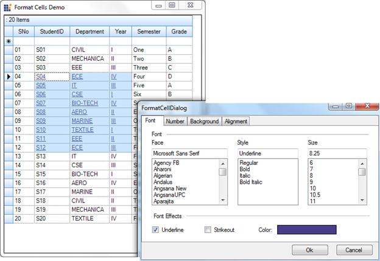

::: {style="DISPLAY: none"}
{#d2h_url_template}{#d2h_package_url style="WIDTH: 0px; DISPLAY: none; HEIGHT: 0px"}
:::

:::: {.d2h_secondary_topic style="PADDING-BOTTOM: 10pt; MARGIN: 0pt; PADDING-LEFT: 0pt; PADDING-RIGHT: 0pt; PADDING-TOP: 0pt"}
##### Format Cells Dialog Support {#format-cells-dialog-support style="tab-stops: 0pt"}

 

The GridGrouping control provides support to apply styles using a Format Cell dialog as found in Microsoft Excel.

 

Use Case Scenarios

This feature enables you to dynamically format such cell attributes as cell background color, font, text color, alignment, and more.

[]{style="COLOR: #c00000"} 

[]{style="FONT-FAMILY: 'Calibri','sans-serif'; COLOR: black"} 

Methods

 

Table 7: Method Table

::: {align="center"}
  **[Method ]{style="LINE-HEIGHT: 115%; FONT-FAMILY: 'Calibri','sans-serif'; FONT-SIZE: 11pt"}**[]{style="LINE-HEIGHT: 115%; FONT-FAMILY: 'Calibri','sans-serif'; FONT-SIZE: 11pt"}   **[Description ]{style="LINE-HEIGHT: 115%; FONT-FAMILY: 'Calibri','sans-serif'; FONT-SIZE: 11pt"}**[]{style="LINE-HEIGHT: 115%; FONT-FAMILY: 'Calibri','sans-serif'; FONT-SIZE: 11pt"}   **[Parameters ]{style="LINE-HEIGHT: 115%; FONT-FAMILY: 'Calibri','sans-serif'; FONT-SIZE: 11pt"}**[]{style="LINE-HEIGHT: 115%; FONT-FAMILY: 'Calibri','sans-serif'; FONT-SIZE: 11pt"}   **[Type ]{style="LINE-HEIGHT: 115%; FONT-FAMILY: 'Calibri','sans-serif'; FONT-SIZE: 11pt"}**[]{style="LINE-HEIGHT: 115%; FONT-FAMILY: 'Calibri','sans-serif'; FONT-SIZE: 11pt"}   **[Return Type ]{style="LINE-HEIGHT: 115%; FONT-FAMILY: 'Calibri','sans-serif'; FONT-SIZE: 11pt"}**[]{style="LINE-HEIGHT: 115%; FONT-FAMILY: 'Calibri','sans-serif'; FONT-SIZE: 11pt"}   **[Reference links ]{style="LINE-HEIGHT: 115%; FONT-FAMILY: 'Calibri','sans-serif'; FONT-SIZE: 11pt"}**[]{style="LINE-HEIGHT: 115%; FONT-FAMILY: 'Calibri','sans-serif'; FONT-SIZE: 11pt"}
  ----------------------------------------------------------------------------------------------------------------------------------------------------------------------------------- ---------------------------------------------------------------------------------------------------------------------------------------------------------------------------------------- --------------------------------------------------------------------------------------------------------------------------------------------------------------------------------------- --------------------------------------------------------------------------------------------------------------------------------------------------------------------------------- ---------------------------------------------------------------------------------------------------------------------------------------------------------------------------------------- --------------------------------------------------------------------------------------------------------------------------------------------------------------------------------------------
  *Grouping*[GridFormatCellDialog]{style="COLOR: #8d2e1c"} ()                                                                                                                         Uses to wire the Grid with FormatCell Dialog                                                                                                                                             GridGoupingControl                                                                                                                                                                      Method (Constructor)                                                                                                                                                              N/A.                                                                                                                                                                                     N/A.
:::

[]{style="FONT-FAMILY: 'Calibri','sans-serif'; COLOR: black"} 

Sample Link

A demo of this feature is available in the following location:

***..\\..\\\\AppData\\Local\\Syncfusion\\EssentialStudio\\{Version}\\Windows\\Grid.Grouping.Windows\\Samples\\2.0\\Appearance\\FormatCells Dialog Demo***

 

Adding GridFormatCellDialog To The GridGroupingControl

You can add the cell formatting dialog using the *GridFormatCellDialog* class. To add the *GridFormatCellDialog*, pass the *GridGroupingControl* as a parameter of the *GroupingGridFormatCellDialog()* method.

 

The following code illustrates this:

[]{style="FONT-FAMILY: 'Courier New'"} 

+------------------------------------------------------------------------------------------------------------------------------------------------------------------------------------------------------------------------------------------------------------------------------------------+
| [\[C#\]]{style="FONT-FAMILY: 'Courier New'"}                                                                                                                                                                                                                                             |
|                                                                                                                                                                                                                                                                                          |
| []{style="FONT-FAMILY: 'Courier New'"}                                                                                                                                                                                                                                                   |
|                                                                                                                                                                                                                                                                                          |
| [Grouping[GridFormatCellDialog Dialog = new ]{style="COLOR: #2b91af"}Grouping[GridFormatCellDialog(this.]{style="COLOR: #2b91af"}]{style="FONT-FAMILY: 'Courier New'"}[gridGroupingControl1]{style="FONT-FAMILY: 'Courier New'"}[);]{style="FONT-FAMILY: 'Courier New'; COLOR: #2b91af"} |
|                                                                                                                                                                                                                                                                                          |
| [Dialog.ShowDialog();]{style="FONT-FAMILY: 'Courier New'; COLOR: #2b91af"}                                                                                                                                                                                                               |
|                                                                                                                                                                                                                                                                                          |
| []{style="FONT-FAMILY: 'Courier New'"}                                                                                                                                                                                                                                                   |
+------------------------------------------------------------------------------------------------------------------------------------------------------------------------------------------------------------------------------------------------------------------------------------------+

 

+------------------------------------------------------------------------------------------------------------------------------------------------------------------------------------------------------------------------------------------------------------------------------------------------------------------------------------------------------------------------------------------------------------------------------------------------------------------------------------------------------------------------------------------------------------------------------+
| [\[VB\]]{style="FONT-FAMILY: 'Courier New'"}                                                                                                                                                                                                                                                                                                                                                                                                                                                                                                                                 |
|                                                                                                                                                                                                                                                                                                                                                                                                                                                                                                                                                                              |
| []{style="FONT-FAMILY: 'Courier New'; COLOR: #1f497d"}                                                                                                                                                                                                                                                                                                                                                                                                                                                                                                                       |
|                                                                                                                                                                                                                                                                                                                                                                                                                                                                                                                                                                              |
| [Dim]{style="FONT-FAMILY: 'Courier New'; COLOR: blue"}[ ]{style="FONT-FAMILY: 'Courier New'"}[Dialog]{style="FONT-FAMILY: 'Courier New'; COLOR: #2b91af"}[ [As]{style="COLOR: blue"} ]{style="FONT-FAMILY: 'Courier New'"}[Grouping[GridFormatCellDialog ]{style="COLOR: #2b91af"}]{style="FONT-FAMILY: 'Courier New'"}[= [New ]{style="COLOR: blue"}]{style="FONT-FAMILY: 'Courier New'"}[Grouping[GridFormatCellDialog]{style="COLOR: #2b91af"}]{style="FONT-FAMILY: 'Courier New'"}[([Me]{style="COLOR: blue"}.gridGroupingControl1)]{style="FONT-FAMILY: 'Courier New'"} |
|                                                                                                                                                                                                                                                                                                                                                                                                                                                                                                                                                                              |
| [Dialog]{style="FONT-FAMILY: 'Courier New'; COLOR: #2b91af"}[.ShowDialog()]{style="FONT-FAMILY: 'Courier New'"}                                                                                                                                                                                                                                                                                                                                                                                                                                                              |
+------------------------------------------------------------------------------------------------------------------------------------------------------------------------------------------------------------------------------------------------------------------------------------------------------------------------------------------------------------------------------------------------------------------------------------------------------------------------------------------------------------------------------------------------------------------------------+

{border="0"}

Figure 323: Format Cell Dialog

 

[]{#related-topics}
::::
