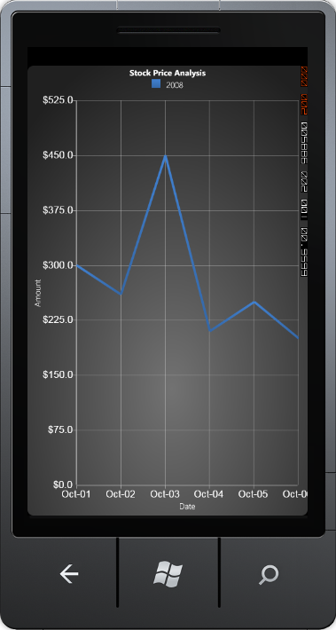

::: {style="DISPLAY: none"}
{#d2h_url_template}{#d2h_package_url style="WIDTH: 0px; DISPLAY: none; HEIGHT: 0px"}
:::

:::: {.d2h_secondary_topic style="PADDING-BOTTOM: 10pt; MARGIN: 0pt; PADDING-LEFT: 0pt; PADDING-RIGHT: 0pt; PADDING-TOP: 0pt"}
#### Format Settings {#format-settings style="tab-stops: 0pt"}

[]{style="COLOR: #15428b"} 

By default, the value type of the chart axis labels is *double*. You can change it to other formats also, by using some in-built properties. This section discusses about those properties, which can set different formats for the labels.

You can apply three types of formats to the chart axis labels using ValueType property. They are *Double(default)* and *DateTime* and *String* formats.

Chart has the following properties, which controls the formatting features.

[]{style="COLOR: #15428b"} 

::: {align="center"}
+-----------------------------------+-------------------------------------------------------------------------------------------------+
| Axis Label property               | Description                                                                                     |
+-----------------------------------+-------------------------------------------------------------------------------------------------+
| ValueType                         | Specifies any of the following value types for the axis labels:                                 |
|                                   |                                                                                                 |
|                                   |                                                                                                 |
|                                   |                                                                                                 |
|                                   | Double - This type is the default one. It indicates that the axis label's data type is double.  |
|                                   |                                                                                                 |
|                                   | DateTime - This is used to set the axis label to  Date format.                                  |
|                                   |                                                                                                 |
|                                   | String - This is used to set the string data to be bind on axis labels.                         |
+-----------------------------------+-------------------------------------------------------------------------------------------------+
| LabelFormat                       | Specifies the double value format for axis labels when the ValueType is set to *Double*.        |
+-----------------------------------+-------------------------------------------------------------------------------------------------+
| LabelDateTimeFormat               | Specifies the date-time formatting for the axis labels when the ValueType is set to *DateTime*. |
+-----------------------------------+-------------------------------------------------------------------------------------------------+
| Prefix                            | Specifies the content to be added before the axis labels.                                       |
+-----------------------------------+-------------------------------------------------------------------------------------------------+
| Suffix                            | Specifies the content to be added after the axis labels.                                        |
+-----------------------------------+-------------------------------------------------------------------------------------------------+
:::

[]{style="COLOR: #15428b"} 

The following code is used to format the axis labels.

[]{style="COLOR: #15428b"} 

+------------------------------------------------------------------------------------------------------------------------------------------------------------------------------------------------------------------------------------------------------------------------------------------------------------------------------------------------------------------------------------------------------------------------------------------------------------------------------------------------------------------------------------------------------------------------------------------------------------------------------------------------------------------------------------------------------------------------------------------------------------------------+
| [\[XAML\]]{style="FONT-FAMILY: 'Courier New'"}                                                                                                                                                                                                                                                                                                                                                                                                                                                                                                                                                                                                                                                                                                                         |
|                                                                                                                                                                                                                                                                                                                                                                                                                                                                                                                                                                                                                                                                                                                                                                        |
| **[]{style="FONT-FAMILY: 'Courier New'"}**                                                                                                                                                                                                                                                                                                                                                                                                                                                                                                                                                                                                                                                                                                                             |
|                                                                                                                                                                                                                                                                                                                                                                                                                                                                                                                                                                                                                                                                                                                                                                        |
| [\<]{style="FONT-FAMILY: 'Courier New'; COLOR: blue"}[syncfusion:ChartArea.PrimaryAxis]{style="FONT-FAMILY: 'Courier New'; COLOR: #a31515"}[\>]{style="FONT-FAMILY: 'Courier New'; COLOR: blue"}                                                                                                                                                                                                                                                                                                                                                                                                                                                                                                                                                                       |
|                                                                                                                                                                                                                                                                                                                                                                                                                                                                                                                                                                                                                                                                                                                                                                        |
| [  \<]{style="FONT-FAMILY: 'Courier New'; COLOR: blue"}[syncfusion:ChartAxis]{style="FONT-FAMILY: 'Courier New'; COLOR: #a31515"}[ ]{style="FONT-FAMILY: 'Courier New'; COLOR: blue"}[LabelFontFamily]{style="FONT-FAMILY: 'Courier New'; COLOR: red"}[=]{style="FONT-FAMILY: 'Courier New'; COLOR: blue"}[\"[Arial]{style="COLOR: blue"}\"[ ]{style="COLOR: blue"}[ValueType]{style="COLOR: red"}[=]{style="COLOR: blue"}\"[DateTime]{style="COLOR: blue"}\"[ ]{style="COLOR: blue"}[LabelFontSize]{style="COLOR: red"}[=]{style="COLOR: blue"}\"[17]{style="COLOR: blue"}\"[ ]{style="COLOR: blue"}[LabelDateTimeFormat]{style="COLOR: red"}[=]{style="COLOR: blue"}\"[MMM-dd]{style="COLOR: blue"}\"[ \>]{style="COLOR: blue"}]{style="FONT-FAMILY: 'Courier New'"} |
|                                                                                                                                                                                                                                                                                                                                                                                                                                                                                                                                                                                                                                                                                                                                                                        |
| [    \<]{style="FONT-FAMILY: 'Courier New'; COLOR: blue"}[syncfusion:ChartAxis.Header]{style="FONT-FAMILY: 'Courier New'; COLOR: #a31515"}[\>]{style="FONT-FAMILY: 'Courier New'; COLOR: blue"}                                                                                                                                                                                                                                                                                                                                                                                                                                                                                                                                                                        |
|                                                                                                                                                                                                                                                                                                                                                                                                                                                                                                                                                                                                                                                                                                                                                                        |
| [      \<]{style="FONT-FAMILY: 'Courier New'; COLOR: blue"}[TextBlock]{style="FONT-FAMILY: 'Courier New'; COLOR: #a31515"}[ ]{style="FONT-FAMILY: 'Courier New'; COLOR: blue"}[Text]{style="FONT-FAMILY: 'Courier New'; COLOR: red"}[=]{style="FONT-FAMILY: 'Courier New'; COLOR: blue"}[\"[Date]{style="COLOR: blue"}\"[ ]{style="COLOR: blue"}[FontSize]{style="COLOR: red"}[=]{style="COLOR: blue"}\"[14]{style="COLOR: blue"}\"[/\>]{style="COLOR: blue"}]{style="FONT-FAMILY: 'Courier New'"}                                                                                                                                                                                                                                                                     |
|                                                                                                                                                                                                                                                                                                                                                                                                                                                                                                                                                                                                                                                                                                                                                                        |
| [    \</]{style="FONT-FAMILY: 'Courier New'; COLOR: blue"}[syncfusion:ChartAxis.Header]{style="FONT-FAMILY: 'Courier New'; COLOR: #a31515"}[\>]{style="FONT-FAMILY: 'Courier New'; COLOR: blue"}                                                                                                                                                                                                                                                                                                                                                                                                                                                                                                                                                                       |
|                                                                                                                                                                                                                                                                                                                                                                                                                                                                                                                                                                                                                                                                                                                                                                        |
| [  \</]{style="FONT-FAMILY: 'Courier New'; COLOR: blue"}[syncfusion:ChartAxis]{style="FONT-FAMILY: 'Courier New'; COLOR: #a31515"}[\>]{style="FONT-FAMILY: 'Courier New'; COLOR: blue"}                                                                                                                                                                                                                                                                                                                                                                                                                                                                                                                                                                                |
|                                                                                                                                                                                                                                                                                                                                                                                                                                                                                                                                                                                                                                                                                                                                                                        |
| [\</]{style="FONT-FAMILY: 'Courier New'; COLOR: blue"}[syncfusion:ChartArea.PrimaryAxis]{style="FONT-FAMILY: 'Courier New'; COLOR: #a31515"}[\>]{style="FONT-FAMILY: 'Courier New'; COLOR: blue"}                                                                                                                                                                                                                                                                                                                                                                                                                                                                                                                                                                      |
|                                                                                                                                                                                                                                                                                                                                                                                                                                                                                                                                                                                                                                                                                                                                                                        |
| []{style="FONT-FAMILY: 'Courier New'; COLOR: blue"}                                                                                                                                                                                                                                                                                                                                                                                                                                                                                                                                                                                                                                                                                                                    |
|                                                                                                                                                                                                                                                                                                                                                                                                                                                                                                                                                                                                                                                                                                                                                                        |
| [\<]{style="FONT-FAMILY: 'Courier New'; COLOR: blue"}[syncfusion:ChartArea.SecondaryAxis]{style="FONT-FAMILY: 'Courier New'; COLOR: #a31515"}[\>]{style="FONT-FAMILY: 'Courier New'; COLOR: blue"}                                                                                                                                                                                                                                                                                                                                                                                                                                                                                                                                                                     |
|                                                                                                                                                                                                                                                                                                                                                                                                                                                                                                                                                                                                                                                                                                                                                                        |
| [  \<]{style="FONT-FAMILY: 'Courier New'; COLOR: blue"}[syncfusion:ChartAxis]{style="FONT-FAMILY: 'Courier New'; COLOR: #a31515"}[ ]{style="FONT-FAMILY: 'Courier New'; COLOR: blue"}[LabelFontSize]{style="FONT-FAMILY: 'Courier New'; COLOR: red"}[=]{style="FONT-FAMILY: 'Courier New'; COLOR: blue"}[\"[17]{style="COLOR: blue"}\"[ ]{style="COLOR: blue"}[LabelFormat]{style="COLOR: red"}[=]{style="COLOR: blue"}\"[0.0]{style="COLOR: blue"}\"[ ]{style="COLOR: blue"}[Prefix]{style="COLOR: red"}[=]{style="COLOR: blue"}\"[\$]{style="COLOR: blue"}\"[\>]{style="COLOR: blue"}]{style="FONT-FAMILY: 'Courier New'"}                                                                                                                                           |
|                                                                                                                                                                                                                                                                                                                                                                                                                                                                                                                                                                                                                                                                                                                                                                        |
| [    \<]{style="FONT-FAMILY: 'Courier New'; COLOR: blue"}[syncfusion:ChartAxis.Header]{style="FONT-FAMILY: 'Courier New'; COLOR: #a31515"}[\>]{style="FONT-FAMILY: 'Courier New'; COLOR: blue"}                                                                                                                                                                                                                                                                                                                                                                                                                                                                                                                                                                        |
|                                                                                                                                                                                                                                                                                                                                                                                                                                                                                                                                                                                                                                                                                                                                                                        |
| [      \<]{style="FONT-FAMILY: 'Courier New'; COLOR: blue"}[TextBlock]{style="FONT-FAMILY: 'Courier New'; COLOR: #a31515"}[ ]{style="FONT-FAMILY: 'Courier New'; COLOR: blue"}[Text]{style="FONT-FAMILY: 'Courier New'; COLOR: red"}[=]{style="FONT-FAMILY: 'Courier New'; COLOR: blue"}[\"[Amount]{style="COLOR: blue"}\"[ ]{style="COLOR: blue"}[FontSize]{style="COLOR: red"}[=]{style="COLOR: blue"}\"[14]{style="COLOR: blue"}\"[/\>]{style="COLOR: blue"}]{style="FONT-FAMILY: 'Courier New'"}                                                                                                                                                                                                                                                                   |
|                                                                                                                                                                                                                                                                                                                                                                                                                                                                                                                                                                                                                                                                                                                                                                        |
| [    \</]{style="FONT-FAMILY: 'Courier New'; COLOR: blue"}[syncfusion:ChartAxis.Header]{style="FONT-FAMILY: 'Courier New'; COLOR: #a31515"}[\>]{style="FONT-FAMILY: 'Courier New'; COLOR: blue"}                                                                                                                                                                                                                                                                                                                                                                                                                                                                                                                                                                       |
|                                                                                                                                                                                                                                                                                                                                                                                                                                                                                                                                                                                                                                                                                                                                                                        |
| [  \</]{style="FONT-FAMILY: 'Courier New'; COLOR: blue"}[syncfusion:ChartAxis]{style="FONT-FAMILY: 'Courier New'; COLOR: #a31515"}[\>]{style="FONT-FAMILY: 'Courier New'; COLOR: blue"}                                                                                                                                                                                                                                                                                                                                                                                                                                                                                                                                                                                |
|                                                                                                                                                                                                                                                                                                                                                                                                                                                                                                                                                                                                                                                                                                                                                                        |
| [\</]{style="FONT-FAMILY: 'Courier New'; COLOR: blue"}[syncfusion:ChartArea.SecondaryAxis]{style="FONT-FAMILY: 'Courier New'; COLOR: #a31515"}[\>]{style="FONT-FAMILY: 'Courier New'; COLOR: blue"}                                                                                                                                                                                                                                                                                                                                                                                                                                                                                                                                                                    |
+------------------------------------------------------------------------------------------------------------------------------------------------------------------------------------------------------------------------------------------------------------------------------------------------------------------------------------------------------------------------------------------------------------------------------------------------------------------------------------------------------------------------------------------------------------------------------------------------------------------------------------------------------------------------------------------------------------------------------------------------------------------------+

[]{style="COLOR: #15428b"} 

+--------------------------------------------------------------------------------------------------------------------------------+
| [\[C#\]]{style="FONT-FAMILY: 'Courier New'"}                                                                                   |
|                                                                                                                                |
| **[]{style="FONT-FAMILY: 'Courier New'"}**                                                                                     |
|                                                                                                                                |
| [//To set the Axis Label type as Date Time]{style="FONT-FAMILY: 'Courier New'; COLOR: green"}                                  |
|                                                                                                                                |
| [chart.Areas\[0\].PrimaryAxis.ValueType = ChartValueType.DateTime;]{style="FONT-FAMILY: 'Courier New'"}                        |
|                                                                                                                                |
| []{style="FONT-FAMILY: 'Courier New'"}                                                                                         |
|                                                                                                                                |
| [//To set the Date-Time format for Axis label]{style="FONT-FAMILY: 'Courier New'; COLOR: green"}                               |
|                                                                                                                                |
| [chart.Areas\[0\].PrimaryAxis.LabelDateTimeFormat = [\"MMM-dd\"]{style="COLOR: #a31515"};]{style="FONT-FAMILY: 'Courier New'"} |
|                                                                                                                                |
| []{style="FONT-FAMILY: 'Courier New'"}                                                                                         |
|                                                                                                                                |
| [//To set the Double format for Axis label]{style="FONT-FAMILY: 'Courier New'; COLOR: green"}                                  |
|                                                                                                                                |
| [chart.Areas\[0\].SecondaryAxis.LabelFormat = [\"0.0\"]{style="COLOR: #a31515"};]{style="FONT-FAMILY: 'Courier New'"}          |
|                                                                                                                                |
| []{style="FONT-FAMILY: 'Courier New'"}                                                                                         |
|                                                                                                                                |
| [//To set the prefix content to be added before axis label]{style="FONT-FAMILY: 'Courier New'; COLOR: green"}                  |
|                                                                                                                                |
| [chart.Areas\[0\].SecondaryAxis.Prefix = [\"\$\"]{style="COLOR: #a31515"};]{style="FONT-FAMILY: 'Courier New'"}                |
+--------------------------------------------------------------------------------------------------------------------------------+

[]{style="COLOR: #15428b"} 

The following images illustrate the chart labels with *DateTime* format settings for x-axis and *Double* format settings for y-axis.

[]{style="COLOR: #15428b"} 

{border="0"}

 

Figure 86 : PrimaryAxis.LabelDateTimeFormat = \"MMM-DD\"; PrimaryAxis.ValueType = \"DateTime\"; SecondaryAxis.Prefix = \"\$\"; SecondaryAxis.LabelFormat = \"0.0\"

[]{style="COLOR: #15428b"} 

**[]{style="COLOR: #15428b"}** 

See Also

[]{style="COLOR: #15428b"} 

[Chart Axis Date-Time Range]{.UGHyperlink}[]{.UGHyperlink}

[]{#related-topics}
::::
