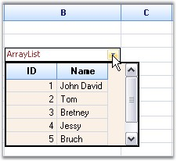

::: {style="DISPLAY: none"}
{#d2h_url_template}{#d2h_package_url style="WIDTH: 0px; DISPLAY: none; HEIGHT: 0px"}
:::

:::: {.d2h_secondary_topic style="PADDING-BOTTOM: 10pt; MARGIN: 0pt; PADDING-LEFT: 0pt; PADDING-RIGHT: 0pt; PADDING-TOP: 0pt"}
##### Formatting Drop-down List {#formatting-drop-down-list style="tab-stops: 0pt"}

[]{style="FONT-FAMILY: 'Trebuchet MS','sans-serif'; COLOR: #15428b; FONT-SIZE: 9pt"} 

Essential Grid has built-in support for displaying a Grid List control as a drop-down inside a grid cell. We can embed grid list controls into the grid cells and customize them.

 

The following screen shot shows a grid cell with Grid List control as its drop-down.

[]{style="FONT-FAMILY: 'Trebuchet MS','sans-serif'; COLOR: #15428b; FONT-SIZE: 9pt"} 

{border="0"}

[]{style="FONT-FAMILY: 'Trebuchet MS','sans-serif'; COLOR: #15428b; FONT-SIZE: 9pt"} 

*[Figure ]{style="FONT-SIZE: 9pt"}[169]{style="FONT-SIZE: 9pt"}[: Grid List control embedded in a Grid Cell]{style="FONT-SIZE: 9pt"}*

[]{style="FONT-FAMILY: 'Trebuchet MS','sans-serif'; COLOR: #15428b; FONT-SIZE: 9pt"} 

Let us see how to add a Grid List control to a grid cell and bind some data.

 

To have a Grid List control in a Grid cell, set its **CellType** property as *GridListControl*. An array is used as data source in the following example. You can set its **DataSource** and **DisplayMember** properties as follows:

[]{style="FONT-FAMILY: 'Trebuchet MS','sans-serif'; COLOR: #15428b; FONT-SIZE: 9pt"} 

+-------------------------------------------------------------------------------------------------------------------------------------------------------------------------------------+
| **[\[C#\]]{style="FONT-FAMILY: 'Courier New'; COLOR: black"}**                                                                                                                      |
|                                                                                                                                                                                     |
| []{style="FONT-FAMILY: 'Courier New'; COLOR: black"}                                                                                                                                |
|                                                                                                                                                                                     |
| [ArrayList]{style="FONT-FAMILY: 'Courier New'; COLOR: #2b91af"}[ array = [new]{style="COLOR: blue"} [ArrayList]{style="COLOR: #2b91af"}();]{style="FONT-FAMILY: 'Courier New'"}     |
|                                                                                                                                                                                     |
| [array.Add([new]{style="COLOR: blue"} MyClass(001, [\"John David\"]{style="COLOR: #a31515"}));]{style="FONT-FAMILY: 'Courier New'"}                                                 |
|                                                                                                                                                                                     |
| [array.Add([new]{style="COLOR: blue"} MyClass(002, [\"Tom\"]{style="COLOR: #a31515"}));]{style="FONT-FAMILY: 'Courier New'"}                                                        |
|                                                                                                                                                                                     |
| [array.Add([new]{style="COLOR: blue"} MyClass(003, [\"Bretney\"]{style="COLOR: #a31515"}));]{style="FONT-FAMILY: 'Courier New'"}                                                    |
|                                                                                                                                                                                     |
| [array.Add([new]{style="COLOR: blue"} MyClass(004, [\"Jessy\"]{style="COLOR: #a31515"}));]{style="FONT-FAMILY: 'Courier New'"}                                                      |
|                                                                                                                                                                                     |
| [array.Add([new]{style="COLOR: blue"} MyClass(005, [\"Bruch\"]{style="COLOR: #a31515"}));]{style="FONT-FAMILY: 'Courier New'"}                                                      |
|                                                                                                                                                                                     |
| [array.Add([new]{style="COLOR: blue"} MyClass(006, [\"Johny\"]{style="COLOR: #a31515"}));]{style="FONT-FAMILY: 'Courier New'"}                                                      |
|                                                                                                                                                                                     |
| []{style="FONT-FAMILY: 'Courier New'"}                                                                                                                                              |
|                                                                                                                                                                                     |
| [// Set up a Grid List control cell.]{style="FONT-FAMILY: 'Courier New'; COLOR: green"}                                                                                             |
|                                                                                                                                                                                     |
| [this]{style="FONT-FAMILY: 'Courier New'; COLOR: blue"}[.gridControl1\[rowIndex, 2\].CellType = [\"GridListControl\"]{style="COLOR: #a31515"};]{style="FONT-FAMILY: 'Courier New'"} |
|                                                                                                                                                                                     |
| []{style="FONT-FAMILY: 'Courier New'"}                                                                                                                                              |
|                                                                                                                                                                                     |
| [// Specify the data source and display member for the Grid List control.]{style="FONT-FAMILY: 'Courier New'; COLOR: green"}                                                        |
|                                                                                                                                                                                     |
| [this]{style="FONT-FAMILY: 'Courier New'; COLOR: blue"}[.gridControl1\[rowIndex, 2\].DataSource = array;]{style="FONT-FAMILY: 'Courier New'"}                                       |
|                                                                                                                                                                                     |
| [this]{style="FONT-FAMILY: 'Courier New'; COLOR: blue"}[.gridControl1\[rowIndex, 2\].DisplayMember = [\"Name\"]{style="COLOR: #a31515"};]{style="FONT-FAMILY: 'Courier New'"}       |
+-------------------------------------------------------------------------------------------------------------------------------------------------------------------------------------+

[]{style="FONT-FAMILY: 'Trebuchet MS','sans-serif'; COLOR: #15428b; FONT-SIZE: 9pt"} 

+---------------------------------------------------------------------------------------------------------------------------------------------------------------------------------+
| **[\[VB.NET\]]{style="FONT-FAMILY: 'Courier New'; COLOR: black"}**                                                                                                              |
|                                                                                                                                                                                 |
| []{style="FONT-FAMILY: 'Courier New'; COLOR: blue"}                                                                                                                             |
|                                                                                                                                                                                 |
| [Dim]{style="FONT-FAMILY: 'Courier New'; COLOR: blue"}[ array [As]{style="COLOR: blue"} ArrayList = [New]{style="COLOR: blue"} ArrayList()]{style="FONT-FAMILY: 'Courier New'"} |
|                                                                                                                                                                                 |
| [array.Add([New]{style="COLOR: blue"} \[MyClass\](1, [\"John David\"]{style="COLOR: #a31515"}))]{style="FONT-FAMILY: 'Courier New'"}                                            |
|                                                                                                                                                                                 |
| [array.Add([New]{style="COLOR: blue"} \[MyClass\](2, [\"Tom\"]{style="COLOR: #a31515"}))]{style="FONT-FAMILY: 'Courier New'"}                                                   |
|                                                                                                                                                                                 |
| [array.Add([New]{style="COLOR: blue"} \[MyClass\](3, [\"Bretney\"]{style="COLOR: #a31515"}))]{style="FONT-FAMILY: 'Courier New'"}                                               |
|                                                                                                                                                                                 |
| [array.Add([New]{style="COLOR: blue"} \[MyClass\](4, [\"Jessy\"]{style="COLOR: #a31515"}))]{style="FONT-FAMILY: 'Courier New'"}                                                 |
|                                                                                                                                                                                 |
| [array.Add([New]{style="COLOR: blue"} \[MyClass\](5, [\"Bruch\"]{style="COLOR: #a31515"}))]{style="FONT-FAMILY: 'Courier New'"}                                                 |
|                                                                                                                                                                                 |
| [array.Add([New]{style="COLOR: blue"} \[MyClass\](6, [\"Johny\"]{style="COLOR: #a31515"}))]{style="FONT-FAMILY: 'Courier New'"}                                                 |
|                                                                                                                                                                                 |
| []{style="FONT-FAMILY: 'Courier New'"}                                                                                                                                          |
|                                                                                                                                                                                 |
| [\' Set up a Grid List control cell.]{style="FONT-FAMILY: 'Courier New'; COLOR: green"}                                                                                         |
|                                                                                                                                                                                 |
| [Me]{style="FONT-FAMILY: 'Courier New'; COLOR: blue"}[.gridControl1(rowIndex, 2).CellType = [\"GridListControl\"]{style="COLOR: #a31515"}]{style="FONT-FAMILY: 'Courier New'"}  |
|                                                                                                                                                                                 |
| []{style="FONT-FAMILY: 'Courier New'"}                                                                                                                                          |
|                                                                                                                                                                                 |
| [\' Specify the data source and display member for the Grid List control.]{style="FONT-FAMILY: 'Courier New'; COLOR: green"}                                                    |
|                                                                                                                                                                                 |
| [Me]{style="FONT-FAMILY: 'Courier New'; COLOR: blue"}[.gridControl1(rowIndex, 2).DataSource = array]{style="FONT-FAMILY: 'Courier New'"}                                        |
|                                                                                                                                                                                 |
| [Me]{style="FONT-FAMILY: 'Courier New'; COLOR: blue"}[.gridControl1(rowIndex, 2).DisplayMember = [\"Name\"]{style="COLOR: #a31515"}]{style="FONT-FAMILY: 'Courier New'"}        |
+---------------------------------------------------------------------------------------------------------------------------------------------------------------------------------+

[]{style="FONT-FAMILY: 'Trebuchet MS','sans-serif'; COLOR: #15428b; FONT-SIZE: 9pt"} 

We have now added a Grid List control in a Grid cell and bound the data to it.

[]{style="FONT-FAMILY: 'Trebuchet MS','sans-serif'; COLOR: #15428b; FONT-SIZE: 9pt"} 

This Grid List control can be customized by accessing the GridDropDownGridListControlCellRenderer class, inside the CurrentCellShowedDropDown event handler.

[]{style="FONT-FAMILY: 'Trebuchet MS','sans-serif'; COLOR: #15428b; FONT-SIZE: 9pt"} 

::: {style="BORDER-BOTTOM: windowtext 1pt solid; BORDER-LEFT: medium none; PADDING-BOTTOM: 1pt; MARGIN-TOP: 9pt; PADDING-LEFT: 0pt; PADDING-RIGHT: 0pt; MARGIN-BOTTOM: 9pt; BORDER-TOP: windowtext 1pt solid; BORDER-RIGHT: medium none; PADDING-TOP: 1pt"}
{border="0"}Note: CurrentCellShowedDropDown event is handled once the drop-down of the specified grid cell is made visible by clicking the downward arrow at the end of the cell.
:::

[]{style="FONT-FAMILY: 'Trebuchet MS','sans-serif'; COLOR: #15428b; FONT-SIZE: 9pt"} 

The following code illustrates this event:

[]{style="FONT-FAMILY: 'Trebuchet MS','sans-serif'; COLOR: #15428b; FONT-SIZE: 9pt"} 

+--------------------------------------------------------------------------------------------------------------------------------------------------------------------------------------------------------------------------------------------------+
| **[\[C#\]]{style="FONT-FAMILY: 'Courier New'; COLOR: black"}**                                                                                                                                                                                   |
|                                                                                                                                                                                                                                                  |
| []{style="FONT-FAMILY: 'Courier New'"}                                                                                                                                                                                                           |
|                                                                                                                                                                                                                                                  |
| [private]{style="FONT-FAMILY: 'Courier New'; COLOR: blue"}[ [void]{style="COLOR: blue"} gridControl1_CurrentCellShowedDropDown([object]{style="COLOR: blue"} sender, [EventArgs]{style="COLOR: #2b91af"} e)]{style="FONT-FAMILY: 'Courier New'"} |
|                                                                                                                                                                                                                                                  |
| [{]{style="FONT-FAMILY: 'Courier New'"}                                                                                                                                                                                                          |
|                                                                                                                                                                                                                                                  |
| [    [// Retrieve the DropDownList Cell Renderer.]{style="COLOR: green"}]{style="FONT-FAMILY: 'Courier New'"}                                                                                                                                    |
|                                                                                                                                                                                                                                                  |
| [    [GridDropDownGridListControlCellRenderer]{style="COLOR: #2b91af"} listRenderer =]{style="FONT-FAMILY: 'Courier New'"}                                                                                                                       |
|                                                                                                                                                                                                                                                  |
| [    ([GridDropDownGridListControlCellRenderer]{style="COLOR: #2b91af"})[this]{style="COLOR: blue"}.gridControl1.CellRenderers\[[\"GridListControl\"]{style="COLOR: #a31515"}\];]{style="FONT-FAMILY: 'Courier New'"}                            |
|                                                                                                                                                                                                                                                  |
| [    ]{style="FONT-FAMILY: 'Courier New'"}                                                                                                                                                                                                       |
|                                                                                                                                                                                                                                                  |
| [    // Apply styles to Grid List control in the drop-down.]{style="FONT-FAMILY: 'Courier New'; COLOR: green"}                                                                                                                                   |
|                                                                                                                                                                                                                                                  |
| [    listRenderer.ListControlPart.Grid.TableStyle.Font.Size = 17.8f;]{style="FONT-FAMILY: 'Courier New'"}                                                                                                                                        |
|                                                                                                                                                                                                                                                  |
| [    listRenderer.ListControlPart.BorderStyle = [BorderStyle]{style="COLOR: #2b91af"}.FixedSingle;]{style="FONT-FAMILY: 'Courier New'"}                                                                                                          |
|                                                                                                                                                                                                                                                  |
| [    listRenderer.ListControlPart.Grid.BackColor = [Color]{style="COLOR: #2b91af"}.FromArgb(250, 240, 230);]{style="FONT-FAMILY: 'Courier New'"}                                                                                                 |
|                                                                                                                                                                                                                                                  |
| [    listRenderer.ListControlPart.Grid.DefaultGridBorderStyle = [GridBorderStyle]{style="COLOR: #2b91af"}.Solid;]{style="FONT-FAMILY: 'Courier New'"}                                                                                            |
|                                                                                                                                                                                                                                                  |
| [    listRenderer.ListControlPart.Grid.TableStyle.TextColor = [Color]{style="COLOR: #2b91af"}.MidnightBlue;]{style="FONT-FAMILY: 'Courier New'"}                                                                                                 |
|                                                                                                                                                                                                                                                  |
| [    listRenderer.ListControlPart.Grid.Properties.GridLineColor = [Color]{style="COLOR: #2b91af"}.FromArgb(208, 215, 229);]{style="FONT-FAMILY: 'Courier New'"}                                                                                  |
|                                                                                                                                                                                                                                                  |
| [    listRenderer.ListControlPart.FillLastColumn = [false]{style="COLOR: blue"};]{style="FONT-FAMILY: 'Courier New'"}                                                                                                                            |
|                                                                                                                                                                                                                                                  |
| [}]{style="FONT-FAMILY: 'Courier New'"}                                                                                                                                                                                                          |
+--------------------------------------------------------------------------------------------------------------------------------------------------------------------------------------------------------------------------------------------------+

[]{style="FONT-FAMILY: 'Trebuchet MS','sans-serif'; COLOR: #15428b; FONT-SIZE: 9pt"} 

+-------------------------------------------------------------------------------------------------------------------------------------------------------------------------------------------------------------------------------------------------------------------------------------------------------------------------------------+
| **[\[VB.NET\]]{style="FONT-FAMILY: 'Courier New'; COLOR: black"}**                                                                                                                                                                                                                                                                  |
|                                                                                                                                                                                                                                                                                                                                     |
| []{style="FONT-FAMILY: 'Courier New'"}                                                                                                                                                                                                                                                                                              |
|                                                                                                                                                                                                                                                                                                                                     |
| [Private]{style="FONT-FAMILY: 'Courier New'; COLOR: blue"}[ [Sub]{style="COLOR: blue"} gridControl1_CurrentCellShowedDropDown([ByVal]{style="COLOR: blue"} sender [As]{style="COLOR: blue"} [Object]{style="COLOR: blue"}, [ByVal]{style="COLOR: blue"} e [As]{style="COLOR: blue"} EventArgs)]{style="FONT-FAMILY: 'Courier New'"} |
|                                                                                                                                                                                                                                                                                                                                     |
| [    ]{style="FONT-FAMILY: 'Courier New'"}                                                                                                                                                                                                                                                                                          |
|                                                                                                                                                                                                                                                                                                                                     |
| [    \' Retrieve the DropDownList Cell Renderer.]{style="FONT-FAMILY: 'Courier New'; COLOR: green"}                                                                                                                                                                                                                                 |
|                                                                                                                                                                                                                                                                                                                                     |
| [    [Dim]{style="COLOR: blue"} listRenderer [As]{style="COLOR: blue"} GridDropDownGridListControlCellRenderer =]{style="FONT-FAMILY: 'Courier New'"}                                                                                                                                                                               |
|                                                                                                                                                                                                                                                                                                                                     |
| [    CType]{style="FONT-FAMILY: 'Courier New'; COLOR: blue"}[([Me]{style="COLOR: blue"}.gridControl1.CellRenderers([\"GridListControl\"]{style="COLOR: #a31515"}), GridDropDownGridListControlCellRenderer)]{style="FONT-FAMILY: 'Courier New'"}                                                                                    |
|                                                                                                                                                                                                                                                                                                                                     |
| [    ]{style="FONT-FAMILY: 'Courier New'"}                                                                                                                                                                                                                                                                                          |
|                                                                                                                                                                                                                                                                                                                                     |
| [    \' Apply styles to Grid List control in the drop-down.]{style="FONT-FAMILY: 'Courier New'; COLOR: green"}                                                                                                                                                                                                                      |
|                                                                                                                                                                                                                                                                                                                                     |
| [    listRenderer.ListControlPart.Grid.TableStyle.Font.Size = 17.8F]{style="FONT-FAMILY: 'Courier New'"}                                                                                                                                                                                                                            |
|                                                                                                                                                                                                                                                                                                                                     |
| [    listRenderer.ListControlPart.BorderStyle = BorderStyle.FixedSingle]{style="FONT-FAMILY: 'Courier New'"}                                                                                                                                                                                                                        |
|                                                                                                                                                                                                                                                                                                                                     |
| [    listRenderer.ListControlPart.Grid.BackColor = Color.FromArgb(250, 240, 230)]{style="FONT-FAMILY: 'Courier New'"}                                                                                                                                                                                                               |
|                                                                                                                                                                                                                                                                                                                                     |
| [    listRenderer.ListControlPart.Grid.DefaultGridBorderStyle = GridBorderStyle.Solid]{style="FONT-FAMILY: 'Courier New'"}                                                                                                                                                                                                          |
|                                                                                                                                                                                                                                                                                                                                     |
| [    listRenderer.ListControlPart.Grid.TableStyle.TextColor = Color.MidnightBlue]{style="FONT-FAMILY: 'Courier New'"}                                                                                                                                                                                                               |
|                                                                                                                                                                                                                                                                                                                                     |
| [    listRenderer.ListControlPart.Grid.Properties.GridLineColor = Color.FromArgb(208, 215, 229)]{style="FONT-FAMILY: 'Courier New'"}                                                                                                                                                                                                |
|                                                                                                                                                                                                                                                                                                                                     |
| [    listRenderer.ListControlPart.FillLastColumn = [False]{style="COLOR: blue"}]{style="FONT-FAMILY: 'Courier New'"}                                                                                                                                                                                                                |
|                                                                                                                                                                                                                                                                                                                                     |
| [End]{style="FONT-FAMILY: 'Courier New'; COLOR: blue"}[ [Sub]{style="COLOR: blue"}]{style="FONT-FAMILY: 'Courier New'"}                                                                                                                                                                                                             |
+-------------------------------------------------------------------------------------------------------------------------------------------------------------------------------------------------------------------------------------------------------------------------------------------------------------------------------------+

 

You can apply various styles such as table style, border style, text color, grid line color etc, to the Grid List control inside a grid cell as in Figure 1.

 

[]{#p324} 

 

[]{#related-topics}
::::
