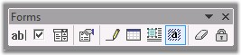
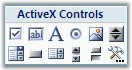
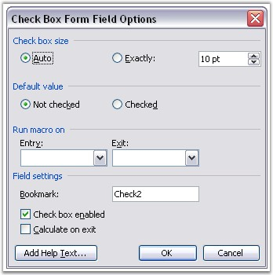
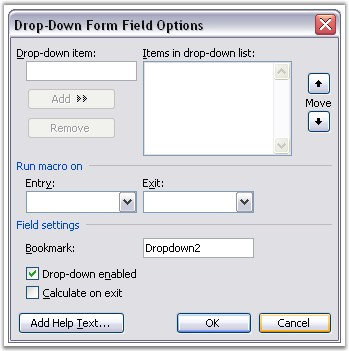
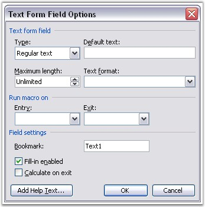

::: {style="DISPLAY: none"}
{#d2h_url_template}{#d2h_package_url style="WIDTH: 0px; DISPLAY: none; HEIGHT: 0px"}
:::

::::::::::: {.d2h_secondary_topic style="PADDING-BOTTOM: 10pt; MARGIN: 0pt; PADDING-LEFT: 0pt; PADDING-RIGHT: 0pt; PADDING-TOP: 0pt"}
##### Form Field {#form-field style="tab-stops: 0pt"}

 

**WFormField** is the base abstract class for all form fields in DocIO (WCheckBox, WDropDownFormField and WTextFormField). There are three types of form fields.

 

[·      ]{style="FONT-FAMILY: Symbol"}**Text**: text form field

[·      ]{style="FONT-FAMILY: Symbol"}**CheckBox**: check box form field

[·      ]{style="FONT-FAMILY: Symbol"}**DropDown**: drop-down form field

 

The WFormField class holds all the common properties for the form fields. The following are the common properties of the form fields.

 

[·      ]{style="FONT-FAMILY: Symbol"}CalculateOnExit

[·      ]{style="FONT-FAMILY: Symbol"}Enabled: defines whether the status bar form field is enabled

[·      ]{style="FONT-FAMILY: Symbol"}FormFieldType: defines type of form field

[·      ]{style="FONT-FAMILY: Symbol"}Help: represents form field help

[·      ]{style="FONT-FAMILY: Symbol"}MacroOnEnd: defines the name of the macro to run on entry of form field

[·      ]{style="FONT-FAMILY: Symbol"}MacroOnStart: defines the name of the macro to run on start of form field

[·      ]{style="FONT-FAMILY: Symbol"}Name: represents the name of the form field

[·      ]{style="FONT-FAMILY: Symbol"}StatusBarHelp: represents the help to display in the status bar

 

You can also insert these fields through the **Forms** toolbar in MS Word. The following screen shot illustrates a Forms toolbar in MS Word.

 

{border="0"}

Figure 46: Forms Toolbar

 

**Class Hierarchy**

 

WTextRange

            WField

              WFormField

 

**Public Properties**

 

::: {align="center"}
  ----------------- ---------------------------------------------------------------
  Name              Description
  CalculateOnExit   Gets or sets calculate on exit property.  
  Enabled           Gets or sets Enabled property (true if form field enabled).  
  EntityType        Gets the type of the entity.  
  FieldPattern      Gets or sets field pattern.  
  FieldType         Gets or sets field type.
  FieldValue        Gets the field value.
  FormFieldType     Gets type of this form field.  
  Help              Gets or sets form field help.  
  MacroOnEnd        Gets or sets the name of macros on end.  
  MacroOnStart      Gets or sets the name of macros on start.  
  Name              Gets form field title name (bookmark name).  
  StatusBarHelp     Gets or sets the status bar help.  
  TextFormat        Gets or sets regular text format.  
  ----------------- ---------------------------------------------------------------
:::

 

Note that the Form Field ActiveX controls shown in the following screenshot can only be preserved in doc and docx formats and cannot be inserted by using DocIO.

 

{border="0"}

Figure 47[: ActiveX Controls]{style="FONT-STYLE: normal"}

 

###### 4.4.1.2.4.1 CheckBox {#checkbox style="tab-stops: 0pt"}

 

**WCheckBox** class represents a check box form field in the Word document. To add a check box to the Word document, click **Check Box Form Field** on the **Forms** toolbar.

 

{border="0"}

Figure 48: Forms Panel

 

 

{border="0"}

Figure 49: CheckBox Properties in MS Word

 

 

 

**CheckBoxSize** property defines the size of the check box. When the **SizeType** property is set to **Auto**, the size of the check box will be set automatically. You can also set custom size for the check box. This is achieved by setting the SizeType property to **Exactly**.

 

**DefaultCheckBoxValue** defines the default value of the check box. You can use the **Checked** property to set the value of the check box.

 

You can use the **AppendCheckBox** function of WParagraph to append a check box to the end of the paragraph.

 

**Class Hierarchy**

 

WTextRange

            \|

            WField

              \|

           WFormField

                 \|

               WCheckBox

 

**Public Methods**

 

::: {align="center"}
  -------------------------------------- -----------------------------------------------------
  Name                                   Description
  WCheckBox.WCheckBox (IWordDocument)    Initializes a new instance of the WCheckBox class. 
  -------------------------------------- -----------------------------------------------------
:::

 

Public Properties

 

::: {align="center"}
  ---------------------- -----------------------------------------------
  Name                   Description
  CheckBoxSize           Gets or sets size of checkbox (in integer).  
  Checked                Gets or sets Checked property.  
  DefaultCheckBoxValue   Gets or sets default checkbox value.  
  EntityType             Gets the type of the entity.  
  SizeType               Gets or sets check box size type.  
  ---------------------- -----------------------------------------------
:::

 

The following example illustrates how to use the WCheckBox class.

 

+--------------------------------------------------------------------------------------------------------------------------------------------------------------------------------+
| **[\[C#\]]{style="FONT-FAMILY: 'Courier New'; COLOR: black"}**                                                                                                                 |
|                                                                                                                                                                                |
| []{style="COLOR: black"}                                                                                                                                                       |
|                                                                                                                                                                                |
| [IWordDocument]{style="FONT-FAMILY: 'Courier New'; COLOR: teal"}[ doc = [new]{style="COLOR: blue"} [WordDocument]{style="COLOR: teal"}();]{style="FONT-FAMILY: 'Courier New'"} |
|                                                                                                                                                                                |
| [doc.EnsureMinimal();]{style="FONT-FAMILY: 'Courier New'"}                                                                                                                     |
|                                                                                                                                                                                |
| [IWParagraph]{style="FONT-FAMILY: 'Courier New'; COLOR: teal"}[ par = doc.LastParagraph;]{style="FONT-FAMILY: 'Courier New'"}                                                  |
|                                                                                                                                                                                |
| [WCheckBox]{style="FONT-FAMILY: 'Courier New'; COLOR: teal"}[ checkBox = par.AppendCheckBox();]{style="FONT-FAMILY: 'Courier New'"}                                            |
|                                                                                                                                                                                |
| [checkBox.Enabled = [false]{style="COLOR: blue"};]{style="FONT-FAMILY: 'Courier New'"}                                                                                         |
|                                                                                                                                                                                |
| [checkBox.StatusBarHelp = [\"Help1\"]{style="COLOR: maroon"};]{style="FONT-FAMILY: 'Courier New'"}                                                                             |
|                                                                                                                                                                                |
| [checkBox.Help = [\"Help2\"]{style="COLOR: maroon"};]{style="FONT-FAMILY: 'Courier New'"}                                                                                      |
|                                                                                                                                                                                |
| [checkBox.DefaultCheckBoxValue = [true]{style="COLOR: blue"};]{style="FONT-FAMILY: 'Courier New'"}                                                                             |
|                                                                                                                                                                                |
| [checkBox.SizeType = [CheckBoxSizeType]{style="COLOR: teal"}.Auto;]{style="FONT-FAMILY: 'Courier New'"}                                                                        |
|                                                                                                                                                                                |
| [checkBox.CalculateOnExit = [true]{style="COLOR: blue"};]{style="FONT-FAMILY: 'Courier New'"}                                                                                  |
|                                                                                                                                                                                |
| [par.AppendText([\" CheckBox2: \"]{style="COLOR: maroon"});]{style="FONT-FAMILY: 'Courier New'"}                                                                               |
|                                                                                                                                                                                |
| [WCheckBox]{style="FONT-FAMILY: 'Courier New'; COLOR: teal"}[ checkBox1 = par.AppendCheckBox();]{style="FONT-FAMILY: 'Courier New'"}                                           |
|                                                                                                                                                                                |
| [checkBox1.CheckBoxSize = 30;]{style="FONT-FAMILY: 'Courier New'"}                                                                                                             |
|                                                                                                                                                                                |
| [checkBox1.SizeType = [CheckBoxSizeType]{style="COLOR: teal"}.Exactly;]{style="FONT-FAMILY: 'Courier New'"}                                                                    |
|                                                                                                                                                                                |
| [checkBox1.CalculateOnExit = [false]{style="COLOR: blue"};]{style="FONT-FAMILY: 'Courier New'"}                                                                                |
|                                                                                                                                                                                |
| [checkBox1.Checked = [true]{style="COLOR: blue"};]{style="FONT-FAMILY: 'Courier New'"}                                                                                         |
|                                                                                                                                                                                |
| [doc.Save([\"TestDoc.doc\"]{style="COLOR: maroon"});]{style="FONT-FAMILY: 'Courier New'"}                                                                                      |
+--------------------------------------------------------------------------------------------------------------------------------------------------------------------------------+

 

+--------------------------------------------------------------------------------------------------------------------------------------------------------------------------------------+
| **[\[VB.NET\]]{style="FONT-FAMILY: 'Courier New'; COLOR: black"}**                                                                                                                   |
|                                                                                                                                                                                      |
|                                                                                                                                                                                      |
|                                                                                                                                                                                      |
| [Dim]{style="FONT-FAMILY: 'Courier New'; COLOR: blue"}[ doc [As]{style="COLOR: blue"} IWordDocument = [New]{style="COLOR: blue"} WordDocument()]{style="FONT-FAMILY: 'Courier New'"} |
|                                                                                                                                                                                      |
| [doc.EnsureMinimal()]{style="FONT-FAMILY: 'Courier New'"}                                                                                                                            |
|                                                                                                                                                                                      |
| [Dim]{style="FONT-FAMILY: 'Courier New'; COLOR: blue"}[ par [As]{style="COLOR: blue"} IWParagraph = doc.LastParagraph]{style="FONT-FAMILY: 'Courier New'"}                           |
|                                                                                                                                                                                      |
| [Dim]{style="FONT-FAMILY: 'Courier New'; COLOR: blue"}[ checkBox [As]{style="COLOR: blue"} WCheckBox = par.AppendCheckBox()]{style="FONT-FAMILY: 'Courier New'"}                     |
|                                                                                                                                                                                      |
| [checkBox.Enabled = [False]{style="COLOR: blue"}]{style="FONT-FAMILY: 'Courier New'"}                                                                                                |
|                                                                                                                                                                                      |
| [checkBox.StatusBarHelp = [\"Help1\"]{style="COLOR: maroon"}]{style="FONT-FAMILY: 'Courier New'"}                                                                                    |
|                                                                                                                                                                                      |
| [checkBox.Help = [\"Help2\"]{style="COLOR: maroon"}]{style="FONT-FAMILY: 'Courier New'"}                                                                                             |
|                                                                                                                                                                                      |
| [checkBox.DefaultCheckBoxValue = [True]{style="COLOR: blue"}]{style="FONT-FAMILY: 'Courier New'"}                                                                                    |
|                                                                                                                                                                                      |
| [checkBox.SizeType = CheckBoxSizeType.Auto]{style="FONT-FAMILY: 'Courier New'"}                                                                                                      |
|                                                                                                                                                                                      |
| [checkBox.CalculateOnExit = [True]{style="COLOR: blue"}]{style="FONT-FAMILY: 'Courier New'"}                                                                                         |
|                                                                                                                                                                                      |
| [par.AppendText([\" CheckBox2: \"]{style="COLOR: maroon"})]{style="FONT-FAMILY: 'Courier New'"}                                                                                      |
|                                                                                                                                                                                      |
| [checkBox1 [As]{style="COLOR: blue"} WCheckBox = par.AppendCheckBox()]{style="FONT-FAMILY: 'Courier New'"}                                                                           |
|                                                                                                                                                                                      |
| [checkBox1.CheckBoxSize = 30]{style="FONT-FAMILY: 'Courier New'"}                                                                                                                    |
|                                                                                                                                                                                      |
| [checkBox1.SizeType = CheckBoxSizeType.Exactly]{style="FONT-FAMILY: 'Courier New'"}                                                                                                  |
|                                                                                                                                                                                      |
| [checkBox1.CalculateOnExit = [False]{style="COLOR: blue"}]{style="FONT-FAMILY: 'Courier New'"}                                                                                       |
|                                                                                                                                                                                      |
| [checkBox1.Checked = [True]{style="COLOR: blue"}]{style="FONT-FAMILY: 'Courier New'"}                                                                                                |
|                                                                                                                                                                                      |
| [doc.Save([\"TestDoc.doc\"]{style="COLOR: maroon"})]{style="FONT-FAMILY: 'Courier New'"}                                                                                             |
+--------------------------------------------------------------------------------------------------------------------------------------------------------------------------------------+

 

 

 

###### 4.4.1.2.4.2 DropDown {#dropdown style="tab-stops: 0pt"}

 

WDropDownFormField class represents a drop-down form field in the Word document. To add a drop-down form field to the Word document, click DropDown Form Field on the Forms toolbar.

 

{border="0"}

Figure 50: Forms Panel

 

{border="0"}

Figure 51: DropDown Form Field Properties

 

**DropDownSelectedIndex** property is used to define the index of the record to be displayed in the drop-down form field. The record is chosen among the collection of the drop-down records. This collection is accessible through the **DropDownItems** property.

 

You can use the **AppendDropDownFormField** function of WParagraph to append drop-down form fields to the end of the paragraph.

 

**Class Hierarchy**

 

WTextRange

     \|

   WField

        \|

      WFormField

             \|

            WDropDownFormField

 

**Public Constructor**

 

::: {align="center"}
  ------------------------------------------------------- -------------------------------------------------------------
  Name                                                    Description
  WdropDownForm.FieldWDropDownFormField (IWordDocument)   Initializes a new instance of the WDropDownFormField class.
  ------------------------------------------------------- -------------------------------------------------------------
:::

 

Public Properties

 

::: {align="center"}
  ----------------------- --------------------------------------------
  Name                    Description
  DropDownItems           Gets drop down items.
  DropDownSelectedIndex   Gets or sets the selected drop-down index.
  ----------------------- --------------------------------------------
:::

 

+--------------------------------------------------------------------------------------------------------------------------------------------------------------------------------+
| **[\[C#\]]{style="FONT-FAMILY: 'Courier New'; COLOR: black"}**                                                                                                                 |
|                                                                                                                                                                                |
| []{style="COLOR: black"}                                                                                                                                                       |
|                                                                                                                                                                                |
| [IWordDocument]{style="FONT-FAMILY: 'Courier New'; COLOR: teal"}[ doc = [new]{style="COLOR: blue"} [WordDocument]{style="COLOR: teal"}();]{style="FONT-FAMILY: 'Courier New'"} |
|                                                                                                                                                                                |
| [doc.EnsureMinimal();]{style="FONT-FAMILY: 'Courier New'"}                                                                                                                     |
|                                                                                                                                                                                |
| []{style="FONT-FAMILY: 'Courier New'"}                                                                                                                                         |
|                                                                                                                                                                                |
| [IWParagraph]{style="FONT-FAMILY: 'Courier New'; COLOR: teal"}[ par = doc.LastParagraph;]{style="FONT-FAMILY: 'Courier New'"}                                                  |
|                                                                                                                                                                                |
| [WDropDownFormField]{style="FONT-FAMILY: 'Courier New'; COLOR: teal"}[ dropDown = par.AppendDropDownFormField();]{style="FONT-FAMILY: 'Courier New'"}                          |
|                                                                                                                                                                                |
| [dropDown.DropDownItems.Add([\"One\"]{style="COLOR: maroon"});]{style="FONT-FAMILY: 'Courier New'"}                                                                            |
|                                                                                                                                                                                |
| [dropDown.DropDownItems.Add([\"Two\"]{style="COLOR: maroon"});]{style="FONT-FAMILY: 'Courier New'"}                                                                            |
|                                                                                                                                                                                |
| [dropDown.DropDownSelectedIndex = 1;]{style="FONT-FAMILY: 'Courier New'"}                                                                                                      |
|                                                                                                                                                                                |
| [dropDown.CalculateOnExit = [true]{style="COLOR: blue"};]{style="FONT-FAMILY: 'Courier New'"}                                                                                  |
|                                                                                                                                                                                |
| [dropDown.Enabled = [false]{style="COLOR: blue"};]{style="FONT-FAMILY: 'Courier New'"}                                                                                         |
|                                                                                                                                                                                |
| [dropDown.Help = [\"Help2\"]{style="COLOR: maroon"};]{style="FONT-FAMILY: 'Courier New'"}                                                                                      |
|                                                                                                                                                                                |
| [dropDown.StatusBarHelp = [\"Help1\"]{style="COLOR: maroon"};]{style="FONT-FAMILY: 'Courier New'"}                                                                             |
|                                                                                                                                                                                |
| []{style="FONT-FAMILY: 'Courier New'"}                                                                                                                                         |
|                                                                                                                                                                                |
| [doc.Save([\"TestDoc.doc\"]{style="COLOR: maroon"});]{style="FONT-FAMILY: 'Courier New'"}                                                                                      |
+--------------------------------------------------------------------------------------------------------------------------------------------------------------------------------+

 

+--------------------------------------------------------------------------------------------------------------------------------------------------------------------------------------+
| **[\[VB.NET\]]{style="FONT-FAMILY: 'Courier New'; COLOR: black"}**                                                                                                                   |
|                                                                                                                                                                                      |
| []{style="COLOR: black"}                                                                                                                                                             |
|                                                                                                                                                                                      |
| [Dim]{style="FONT-FAMILY: 'Courier New'; COLOR: blue"}[ doc [As]{style="COLOR: blue"} IWordDocument = [New]{style="COLOR: blue"} WordDocument()]{style="FONT-FAMILY: 'Courier New'"} |
|                                                                                                                                                                                      |
| [doc.EnsureMinimal()]{style="FONT-FAMILY: 'Courier New'"}                                                                                                                            |
|                                                                                                                                                                                      |
| []{style="FONT-FAMILY: 'Courier New'"}                                                                                                                                               |
|                                                                                                                                                                                      |
| [Dim]{style="FONT-FAMILY: 'Courier New'; COLOR: blue"}[ par [As]{style="COLOR: blue"} IWParagraph = doc.LastParagraph]{style="FONT-FAMILY: 'Courier New'"}                           |
|                                                                                                                                                                                      |
| [Dim]{style="FONT-FAMILY: 'Courier New'; COLOR: blue"}[ dropDown [As]{style="COLOR: blue"} WDropDownFormField = par.AppendDropDownFormField()]{style="FONT-FAMILY: 'Courier New'"}   |
|                                                                                                                                                                                      |
| [dropDown.DropDownItems.Add([\"One\"]{style="COLOR: maroon"})]{style="FONT-FAMILY: 'Courier New'"}                                                                                   |
|                                                                                                                                                                                      |
| [dropDown.DropDownItems.Add([\"Two\"]{style="COLOR: maroon"})]{style="FONT-FAMILY: 'Courier New'"}                                                                                   |
|                                                                                                                                                                                      |
| [dropDown.DropDownSelectedIndex = 1]{style="FONT-FAMILY: 'Courier New'"}                                                                                                             |
|                                                                                                                                                                                      |
| [dropDown.CalculateOnExit = [True]{style="COLOR: blue"}]{style="FONT-FAMILY: 'Courier New'"}                                                                                         |
|                                                                                                                                                                                      |
| [dropDown.Enabled = [False]{style="COLOR: blue"}]{style="FONT-FAMILY: 'Courier New'"}                                                                                                |
|                                                                                                                                                                                      |
| [dropDown.Help = [\"Help2\"]{style="COLOR: maroon"}]{style="FONT-FAMILY: 'Courier New'"}                                                                                             |
|                                                                                                                                                                                      |
| [dropDown.StatusBarHelp = [\"Help1\"]{style="COLOR: maroon"}]{style="FONT-FAMILY: 'Courier New'"}                                                                                    |
|                                                                                                                                                                                      |
| []{style="FONT-FAMILY: 'Courier New'; COLOR: maroon"}                                                                                                                                |
|                                                                                                                                                                                      |
| [doc.Save([\"TestDoc.doc\"]{style="COLOR: maroon"})]{style="FONT-FAMILY: 'Courier New'"}                                                                                             |
+--------------------------------------------------------------------------------------------------------------------------------------------------------------------------------------+

###### []{#p51}4.4.1.2.4.3 Text {#text style="tab-stops: 0pt"}

 

**WTextFormField** class represents a text form field in Word document. To add a text form field to the Word document, click Text Form Field on the Forms toolbar.

 

{border="0"}

Figure 52: Forms Panel

 

 

{border="0"}

Figure 53[: Text Form Field Properties]{style="FONT-STYLE: normal"}

 

To set the format of the DocIO text directly from the field, you can use the **StringFormat** property. To get or set the default text for the text form field, you can use the **DefaultText** property.

 

::: {style="BORDER-BOTTOM: windowtext 1pt solid; BORDER-LEFT: medium none; PADDING-BOTTOM: 1pt; MARGIN-TOP: 9pt; PADDING-LEFT: 0pt; PADDING-RIGHT: 0pt; MARGIN-BOTTOM: 9pt; BORDER-TOP: windowtext 1pt solid; BORDER-RIGHT: medium none; PADDING-TOP: 1pt"}
{border="0"}Note:[ ]{style="COLOR: black; FONT-SIZE: 8pt"}Text form field will display the default text only when the text of the form field has no value, i.e., when the TextRange property (TextRange.Text) has no value.
:::

 

**TextRange** property is used to set the text of the text form field. **Type** property specifies the type of the text form field. The following are the types of the text form field.

 

[·      ]{style="FONT-FAMILY: Symbol"}RegularText

[·      ]{style="FONT-FAMILY: Symbol"}NumberText

[·      ]{style="FONT-FAMILY: Symbol"}DateText

 

**Class Hierarchy**

 

WTextRange

             \|

            WField

             \|

              WFormField

                 \|

              WTextFormField

 

**Public Constructor**

 

::: {align="center"}
  ----------------------------------------------- ---------------------------------------------------------
  Name                                            Description
  WTextFormField.WTextFormField (IWordDocument)   Initializes a new instance of the WTextFormField class.
  ----------------------------------------------- ---------------------------------------------------------
:::

 

Public Properties

 

::: {align="center"}
  --------------- ------------------------------------------------------------------
  Name            Description
  DefaultText     Gets/sets default text for text form field.
  MaximumLength   Gets/sets maximum text length.
  StringFormat    Gets/sets string text format (text, date/time, number) directly.
  TextRange       Gets/sets form field text range.
  Type            Get/sets text form field type.
  --------------- ------------------------------------------------------------------
:::

 

The following three examples illustrate the different variants of text form field usage.

*[]{style="COLOR: red"}* 

+-----------------------------------------------------------------------------------------------------------------------------------------------------------------------------------------------------------------+
| **[\[C#\]]{style="FONT-FAMILY: 'Courier New'; COLOR: black"}**                                                                                                                                                  |
|                                                                                                                                                                                                                 |
| []{style="COLOR: black"}                                                                                                                                                                                        |
|                                                                                                                                                                                                                 |
| **[Example 1]{style="FONT-FAMILY: 'Courier New'; COLOR: black"}**                                                                                                                                               |
|                                                                                                                                                                                                                 |
| **[]{style="FONT-FAMILY: 'Courier New'"}**                                                                                                                                                                      |
|                                                                                                                                                                                                                 |
| [IWordDocument]{style="FONT-FAMILY: 'Courier New'; COLOR: #2b91af"}[ doc = [new]{style="COLOR: blue"} [WordDocument]{style="COLOR: #2b91af"}([true]{style="COLOR: blue"});]{style="FONT-FAMILY: 'Courier New'"} |
|                                                                                                                                                                                                                 |
| [IWParagraph]{style="FONT-FAMILY: 'Courier New'; COLOR: #2b91af"}[ par = doc.LastParagraph;]{style="FONT-FAMILY: 'Courier New'"}                                                                                |
|                                                                                                                                                                                                                 |
| []{style="FONT-FAMILY: 'Courier New'"}                                                                                                                                                                          |
|                                                                                                                                                                                                                 |
| [// Append text form field to the paragraph.]{style="FONT-FAMILY: 'Courier New'; COLOR: green"}                                                                                                                 |
|                                                                                                                                                                                                                 |
| [WTextFormField]{style="FONT-FAMILY: 'Courier New'; COLOR: #2b91af"}[ textFormField = par.AppendTextFormField([\"Hello\"]{style="COLOR: #a31515"});]{style="FONT-FAMILY: 'Courier New'"}                        |
|                                                                                                                                                                                                                 |
| [textFormField.TextFormat = [TextFormat]{style="COLOR: #2b91af"}.Uppercase;]{style="FONT-FAMILY: 'Courier New'"}                                                                                                |
|                                                                                                                                                                                                                 |
| [textFormField.Enabled = [false]{style="COLOR: blue"};]{style="FONT-FAMILY: 'Courier New'"}                                                                                                                     |
|                                                                                                                                                                                                                 |
| [textFormField.Help = [\"Help2\"]{style="COLOR: #a31515"};]{style="FONT-FAMILY: 'Courier New'"}                                                                                                                 |
|                                                                                                                                                                                                                 |
| [textFormField.StatusBarHelp = [\"Help1\"]{style="COLOR: #a31515"};]{style="FONT-FAMILY: 'Courier New'"}                                                                                                        |
|                                                                                                                                                                                                                 |
| [textFormField.MacroOnStart = [\"Test1\"]{style="COLOR: #a31515"};]{style="FONT-FAMILY: 'Courier New'"}                                                                                                         |
|                                                                                                                                                                                                                 |
| [textFormField.CalculateOnExit = [true]{style="COLOR: blue"};]{style="FONT-FAMILY: 'Courier New'"}                                                                                                              |
|                                                                                                                                                                                                                 |
| []{style="FONT-FAMILY: 'Courier New'"}                                                                                                                                                                          |
|                                                                                                                                                                                                                 |
| **[Example 2]{style="FONT-FAMILY: 'Courier New'"}**                                                                                                                                                             |
|                                                                                                                                                                                                                 |
| []{style="FONT-FAMILY: 'Courier New'"}                                                                                                                                                                          |
|                                                                                                                                                                                                                 |
| [// In this sample we modify all text form field in document.]{style="FONT-FAMILY: 'Courier New'; COLOR: green"}                                                                                                |
|                                                                                                                                                                                                                 |
| [foreach]{style="FONT-FAMILY: 'Courier New'; COLOR: blue"}[ ([WSection]{style="COLOR: #2b91af"} sec [in]{style="COLOR: blue"} doc.Sections)]{style="FONT-FAMILY: 'Courier New'"}                                |
|                                                                                                                                                                                                                 |
| [{]{style="FONT-FAMILY: 'Courier New'"}                                                                                                                                                                         |
|                                                                                                                                                                                                                 |
| [    [foreach]{style="COLOR: blue"} ([WTextBody]{style="COLOR: #2b91af"} body [in]{style="COLOR: blue"} sec.ChildEntities)]{style="FONT-FAMILY: 'Courier New'"}                                                 |
|                                                                                                                                                                                                                 |
| [    {  ]{style="FONT-FAMILY: 'Courier New'"}                                                                                                                                                                   |
|                                                                                                                                                                                                                 |
| [        [// Every WTextBody object has a collection of form fields.]{style="COLOR: green"}]{style="FONT-FAMILY: 'Courier New'"}                                                                                |
|                                                                                                                                                                                                                 |
| [        [foreach]{style="COLOR: blue"} ([WFormField]{style="COLOR: #2b91af"} ffield [in]{style="COLOR: blue"} body.FormFields)]{style="FONT-FAMILY: 'Courier New'"}                                            |
|                                                                                                                                                                                                                 |
| [        {]{style="FONT-FAMILY: 'Courier New'"}                                                                                                                                                                 |
|                                                                                                                                                                                                                 |
| [            [switch]{style="COLOR: blue"} (ffield.FormFieldType)]{style="FONT-FAMILY: 'Courier New'"}                                                                                                          |
|                                                                                                                                                                                                                 |
| [            {]{style="FONT-FAMILY: 'Courier New'"}                                                                                                                                                             |
|                                                                                                                                                                                                                 |
| [              [case]{style="COLOR: blue"} [FormFieldType]{style="COLOR: #2b91af"}.TextInput:]{style="FONT-FAMILY: 'Courier New'"}                                                                              |
|                                                                                                                                                                                                                 |
| [               [WTextFormField]{style="COLOR: #2b91af"} textField = ([WTextFormField]{style="COLOR: #2b91af"})ffield;]{style="FONT-FAMILY: 'Courier New'"}                                                     |
|                                                                                                                                                                                                                 |
| [               textField.Type = [TextFormFieldType]{style="COLOR: #2b91af"}.DateText;]{style="FONT-FAMILY: 'Courier New'"}                                                                                     |
|                                                                                                                                                                                                                 |
| [               ]{style="FONT-FAMILY: 'Courier New'"}                                                                                                                                                           |
|                                                                                                                                                                                                                 |
| [               [// Setting of default text of form field.]{style="COLOR: green"}]{style="FONT-FAMILY: 'Courier New'"}                                                                                          |
|                                                                                                                                                                                                                 |
| [               textField.DefaultText = [\"01/01/2007\"]{style="COLOR: #a31515"};]{style="FONT-FAMILY: 'Courier New'"}                                                                                          |
|                                                                                                                                                                                                                 |
| [               textField.StringFormat = [\"MM/dd/yyyy \"]{style="COLOR: #a31515"};]{style="FONT-FAMILY: 'Courier New'"}                                                                                        |
|                                                                                                                                                                                                                 |
| [               ]{style="FONT-FAMILY: 'Courier New'"}                                                                                                                                                           |
|                                                                                                                                                                                                                 |
| [               [// Setting character format of field (not text of form field).]{style="COLOR: green"}]{style="FONT-FAMILY: 'Courier New'"}                                                                     |
|                                                                                                                                                                                                                 |
| [               [// This formatting you can see, when you press Alt+F9 on]{style="COLOR: green"}]{style="FONT-FAMILY: 'Courier New'"}                                                                           |
|                                                                                                                                                                                                                 |
| [               [// document, which has form field.]{style="COLOR: green"}]{style="FONT-FAMILY: 'Courier New'"}                                                                                                 |
|                                                                                                                                                                                                                 |
| [               textField.CharacterFormat.FontName = [\"Comic Sans MS\"]{style="COLOR: #a31515"};]{style="FONT-FAMILY: 'Courier New'"}                                                                          |
|                                                                                                                                                                                                                 |
| [               textField.CharacterFormat.Shadow = [true]{style="COLOR: blue"};]{style="FONT-FAMILY: 'Courier New'"}                                                                                            |
|                                                                                                                                                                                                                 |
| [               textField.CharacterFormat.FontSize = 20f;]{style="FONT-FAMILY: 'Courier New'"}                                                                                                                  |
|                                                                                                                                                                                                                 |
| [               ]{style="FONT-FAMILY: 'Courier New'"}                                                                                                                                                           |
|                                                                                                                                                                                                                 |
| [               [// Setting text of text form field and it\'s character format.]{style="COLOR: green"}]{style="FONT-FAMILY: 'Courier New'"}                                                                     |
|                                                                                                                                                                                                                 |
| [               [// If textField.TextRange.Text value is not equal to string.Empty]{style="COLOR: green"}]{style="FONT-FAMILY: 'Courier New'"}                                                                  |
|                                                                                                                                                                                                                 |
| [               [// form field\'s text will be textField.TextRange.Text, in other]{style="COLOR: green"}]{style="FONT-FAMILY: 'Courier New'"}                                                                   |
|                                                                                                                                                                                                                 |
| [               [// case textField.DefaultText.]{style="COLOR: green"}]{style="FONT-FAMILY: 'Courier New'"}                                                                                                     |
|                                                                                                                                                                                                                 |
| [               textField.TextRange.Text = [string]{style="COLOR: blue"}.Empty;]{style="FONT-FAMILY: 'Courier New'"}                                                                                            |
|                                                                                                                                                                                                                 |
| [               textField.TextRange.CharacterFormat.FontName = [\"Comic Sans MS\"]{style="COLOR: #a31515"};]{style="FONT-FAMILY: 'Courier New'"}                                                                |
|                                                                                                                                                                                                                 |
| [               textField.TextRange.CharacterFormat.Shadow = [true]{style="COLOR: blue"};]{style="FONT-FAMILY: 'Courier New'"}                                                                                  |
|                                                                                                                                                                                                                 |
| [               textField.TextRange.CharacterFormat.FontSize = 20f;]{style="FONT-FAMILY: 'Courier New'"}                                                                                                        |
|                                                                                                                                                                                                                 |
| [               textField.TextRange.CharacterFormat.TextColor = [Color]{style="COLOR: #2b91af"}.Blue;]{style="FONT-FAMILY: 'Courier New'"}                                                                      |
|                                                                                                                                                                                                                 |
| [               [break]{style="COLOR: blue"};]{style="FONT-FAMILY: 'Courier New'"}                                                                                                                              |
|                                                                                                                                                                                                                 |
| []{style="FONT-FAMILY: 'Courier New'"}                                                                                                                                                                          |
|                                                                                                                                                                                                                 |
| [               [default]{style="COLOR: blue"}:]{style="FONT-FAMILY: 'Courier New'"}                                                                                                                            |
|                                                                                                                                                                                                                 |
| [               [break]{style="COLOR: blue"};]{style="FONT-FAMILY: 'Courier New'"}                                                                                                                              |
|                                                                                                                                                                                                                 |
| [            }]{style="FONT-FAMILY: 'Courier New'"}                                                                                                                                                             |
|                                                                                                                                                                                                                 |
| [        }]{style="FONT-FAMILY: 'Courier New'"}                                                                                                                                                                 |
|                                                                                                                                                                                                                 |
| [    }]{style="FONT-FAMILY: 'Courier New'"}                                                                                                                                                                     |
|                                                                                                                                                                                                                 |
| [}]{style="FONT-FAMILY: 'Courier New'"}                                                                                                                                                                         |
+-----------------------------------------------------------------------------------------------------------------------------------------------------------------------------------------------------------------+

 

+--------------------------------------------------------------------------------------------------------------------------------------------------------------------------------------------------------------------+
| **[\[VB.NET\]]{style="FONT-FAMILY: 'Courier New'; COLOR: black"}**                                                                                                                                                 |
|                                                                                                                                                                                                                    |
| **[]{style="COLOR: black"}**                                                                                                                                                                                       |
|                                                                                                                                                                                                                    |
| **[Example 1]{style="FONT-FAMILY: 'Courier New'; COLOR: black"}**                                                                                                                                                  |
|                                                                                                                                                                                                                    |
| []{style="FONT-FAMILY: 'Courier New'; COLOR: black"}                                                                                                                                                               |
|                                                                                                                                                                                                                    |
| [Dim]{style="FONT-FAMILY: 'Courier New'; COLOR: blue"}[ doc [As]{style="COLOR: blue"} IWordDocument = [New]{style="COLOR: blue"} WordDocument([True]{style="COLOR: blue"})]{style="FONT-FAMILY: 'Courier New'"}    |
|                                                                                                                                                                                                                    |
| [Dim]{style="FONT-FAMILY: 'Courier New'; COLOR: blue"}[ par [As]{style="COLOR: blue"} IWParagraph = doc.LastParagraph]{style="FONT-FAMILY: 'Courier New'"}                                                         |
|                                                                                                                                                                                                                    |
| []{style="FONT-FAMILY: 'Courier New'"}                                                                                                                                                                             |
|                                                                                                                                                                                                                    |
| [\' Append text form field to the paragraph.]{style="FONT-FAMILY: 'Courier New'; COLOR: green"}                                                                                                                    |
|                                                                                                                                                                                                                    |
| [Dim]{style="FONT-FAMILY: 'Courier New'; COLOR: blue"}[ textFormField [As]{style="COLOR: blue"} WTextFormField = par.AppendTextFormField([\"Hello\"]{style="COLOR: #a31515"})]{style="FONT-FAMILY: 'Courier New'"} |
|                                                                                                                                                                                                                    |
| [textFormField.TextFormat = TextFormat.Uppercase]{style="FONT-FAMILY: 'Courier New'"}                                                                                                                              |
|                                                                                                                                                                                                                    |
| [textFormField.Enabled = [False]{style="COLOR: blue"}]{style="FONT-FAMILY: 'Courier New'"}                                                                                                                         |
|                                                                                                                                                                                                                    |
| [textFormField.Help = [\"Help2\"]{style="COLOR: #a31515"}]{style="FONT-FAMILY: 'Courier New'"}                                                                                                                     |
|                                                                                                                                                                                                                    |
| [textFormField.StatusBarHelp = [\"Help1\"]{style="COLOR: #a31515"}]{style="FONT-FAMILY: 'Courier New'"}                                                                                                            |
|                                                                                                                                                                                                                    |
| [textFormField.MacroOnStart = [\"Test1\"]{style="COLOR: #a31515"}]{style="FONT-FAMILY: 'Courier New'"}                                                                                                             |
|                                                                                                                                                                                                                    |
| [textFormField.CalculateOnExit = [True ]{style="COLOR: blue"}]{style="FONT-FAMILY: 'Courier New'"}                                                                                                                 |
|                                                                                                                                                                                                                    |
| []{style="FONT-FAMILY: 'Courier New'; COLOR: blue"}                                                                                                                                                                |
|                                                                                                                                                                                                                    |
| **[Example 2]{style="FONT-FAMILY: 'Courier New'"}**                                                                                                                                                                |
|                                                                                                                                                                                                                    |
| []{style="FONT-FAMILY: 'Courier New'"}                                                                                                                                                                             |
|                                                                                                                                                                                                                    |
| [\' In this sample we modify all text form field in document.]{style="FONT-FAMILY: 'Courier New'; COLOR: green"}                                                                                                   |
|                                                                                                                                                                                                                    |
| [For]{style="FONT-FAMILY: 'Courier New'; COLOR: blue"}[ [Each]{style="COLOR: blue"} sec [As]{style="COLOR: blue"} WSection [In]{style="COLOR: blue"} doc.Sections]{style="FONT-FAMILY: 'Courier New'"}             |
|                                                                                                                                                                                                                    |
| [For]{style="FONT-FAMILY: 'Courier New'; COLOR: blue"}[ [Each]{style="COLOR: blue"} body [As]{style="COLOR: blue"} WTextBody [In]{style="COLOR: blue"} sec.ChildEntities]{style="FONT-FAMILY: 'Courier New'"}      |
|                                                                                                                                                                                                                    |
| []{style="FONT-FAMILY: 'Courier New'; COLOR: green"}                                                                                                                                                               |
|                                                                                                                                                                                                                    |
| [\'Every WTextBody object has a collection of form fields.]{style="FONT-FAMILY: 'Courier New'; COLOR: green"}                                                                                                      |
|                                                                                                                                                                                                                    |
| [For]{style="FONT-FAMILY: 'Courier New'; COLOR: blue"}[ [Each]{style="COLOR: blue"} ffield [As]{style="COLOR: blue"} WFormField [In]{style="COLOR: blue"} body.FormFields]{style="FONT-FAMILY: 'Courier New'"}     |
|                                                                                                                                                                                                                    |
| [Select]{style="FONT-FAMILY: 'Courier New'; COLOR: blue"}[ [Case]{style="COLOR: blue"} ffield.FormFieldType]{style="FONT-FAMILY: 'Courier New'"}                                                                   |
|                                                                                                                                                                                                                    |
| [Case]{style="FONT-FAMILY: 'Courier New'; COLOR: blue"}[ FormFieldType.TextInput]{style="FONT-FAMILY: 'Courier New'"}                                                                                              |
|                                                                                                                                                                                                                    |
| [Dim]{style="FONT-FAMILY: 'Courier New'; COLOR: blue"}[ textField [As]{style="COLOR: blue"} WTextFormField = [CType]{style="COLOR: blue"}(ffield, WTextFormField)]{style="FONT-FAMILY: 'Courier New'"}             |
|                                                                                                                                                                                                                    |
| [textField.Type = TextFormFieldType.DateText]{style="FONT-FAMILY: 'Courier New'"}                                                                                                                                  |
|                                                                                                                                                                                                                    |
| []{style="FONT-FAMILY: 'Courier New'; COLOR: green"}                                                                                                                                                               |
|                                                                                                                                                                                                                    |
| [\'Setting of default text of form field.]{style="FONT-FAMILY: 'Courier New'; COLOR: green"}                                                                                                                       |
|                                                                                                                                                                                                                    |
| [textField.DefaultText = [\"01/01/2007\"]{style="COLOR: #a31515"}]{style="FONT-FAMILY: 'Courier New'"}                                                                                                             |
|                                                                                                                                                                                                                    |
| [textField.StringFormat = [\"MM/dd/yyyy \"]{style="COLOR: #a31515"}]{style="FONT-FAMILY: 'Courier New'"}                                                                                                           |
|                                                                                                                                                                                                                    |
| []{style="FONT-FAMILY: 'Courier New'; COLOR: green"}                                                                                                                                                               |
|                                                                                                                                                                                                                    |
| [\'Setting character format of field (not text of form field).]{style="FONT-FAMILY: 'Courier New'; COLOR: green"}                                                                                                  |
|                                                                                                                                                                                                                    |
| [\'This formatting you can see, when you press Alt+F9 on]{style="FONT-FAMILY: 'Courier New'; COLOR: green"}                                                                                                        |
|                                                                                                                                                                                                                    |
| [\' document, which has form field. ]{style="FONT-FAMILY: 'Courier New'; COLOR: green"}                                                                                                                            |
|                                                                                                                                                                                                                    |
| [textField.CharacterFormat.FontName = [\"Comic Sans MS\"]{style="COLOR: #a31515"}]{style="FONT-FAMILY: 'Courier New'"}                                                                                             |
|                                                                                                                                                                                                                    |
| [textField.CharacterFormat.Shadow = [True]{style="COLOR: blue"}]{style="FONT-FAMILY: 'Courier New'"}                                                                                                               |
|                                                                                                                                                                                                                    |
| [textField.CharacterFormat.FontSize = 20.0F]{style="FONT-FAMILY: 'Courier New'"}                                                                                                                                   |
|                                                                                                                                                                                                                    |
| []{style="FONT-FAMILY: 'Courier New'"}                                                                                                                                                                             |
|                                                                                                                                                                                                                    |
| [\'Setting text of text form field and it\'s character format.]{style="FONT-FAMILY: 'Courier New'; COLOR: green"}                                                                                                  |
|                                                                                                                                                                                                                    |
| [\'If textField.TextRange. Text value is not equal to string.Empty]{style="FONT-FAMILY: 'Courier New'; COLOR: green"}                                                                                              |
|                                                                                                                                                                                                                    |
| [\'form field\'s text will be textField.TextRange.Text, in other]{style="FONT-FAMILY: 'Courier New'; COLOR: green"}                                                                                                |
|                                                                                                                                                                                                                    |
| [\'case textField.DefaultText.]{style="FONT-FAMILY: 'Courier New'; COLOR: green"}                                                                                                                                  |
|                                                                                                                                                                                                                    |
| [textField.TextRange.Text = [String]{style="COLOR: blue"}.Empty]{style="FONT-FAMILY: 'Courier New'"}                                                                                                               |
|                                                                                                                                                                                                                    |
| [textField.TextRange.CharacterFormat.FontName = [\"Comic Sans MS\"]{style="COLOR: #a31515"}]{style="FONT-FAMILY: 'Courier New'"}                                                                                   |
|                                                                                                                                                                                                                    |
| [textField.TextRange.CharacterFormat.Shadow = [True]{style="COLOR: blue"}]{style="FONT-FAMILY: 'Courier New'"}                                                                                                     |
|                                                                                                                                                                                                                    |
| [textField.TextRange.CharacterFormat.FontSize = 20.0F]{style="FONT-FAMILY: 'Courier New'"}                                                                                                                         |
|                                                                                                                                                                                                                    |
| [textField.TextRange.CharacterFormat.TextColor = Color.Blue]{style="FONT-FAMILY: 'Courier New'"}                                                                                                                   |
|                                                                                                                                                                                                                    |
| []{style="FONT-FAMILY: 'Courier New'"}                                                                                                                                                                             |
|                                                                                                                                                                                                                    |
| [Case]{style="FONT-FAMILY: 'Courier New'; COLOR: blue"}[ [Else]{style="COLOR: blue"}]{style="FONT-FAMILY: 'Courier New'"}                                                                                          |
|                                                                                                                                                                                                                    |
| [End]{style="FONT-FAMILY: 'Courier New'; COLOR: blue"}[ [Select]{style="COLOR: blue"}]{style="FONT-FAMILY: 'Courier New'"}                                                                                         |
|                                                                                                                                                                                                                    |
| [Next]{style="FONT-FAMILY: 'Courier New'; COLOR: blue"}[ ffield]{style="FONT-FAMILY: 'Courier New'"}                                                                                                               |
|                                                                                                                                                                                                                    |
| [Next]{style="FONT-FAMILY: 'Courier New'; COLOR: blue"}[ body]{style="FONT-FAMILY: 'Courier New'"}                                                                                                                 |
|                                                                                                                                                                                                                    |
| [Next]{style="FONT-FAMILY: 'Courier New'; COLOR: blue"}[ sec]{style="FONT-FAMILY: 'Courier New'"}                                                                                                                  |
+--------------------------------------------------------------------------------------------------------------------------------------------------------------------------------------------------------------------+

 

DocIO also provides option to add/remove form field shading. It specifies whether to turn on the gray shading on form fields using the below code snippet.

 

+------------------------------------------------------------------------------------------------------------+
| **[\[C#\]]{style="FONT-FAMILY: 'Courier New'; COLOR: black"}**                                             |
|                                                                                                            |
| []{style="COLOR: black"}                                                                                   |
|                                                                                                            |
| [document.Properties.FormFieldShading = [false]{style="COLOR: blue"};]{style="FONT-FAMILY: 'Courier New'"} |
+------------------------------------------------------------------------------------------------------------+

 

+-----------------------------------------------------------------------------------------------------------+
| **[\[VB.NET\]]{style="FONT-FAMILY: 'Courier New'; COLOR: black"}**                                        |
|                                                                                                           |
| []{style="COLOR: black"}                                                                                  |
|                                                                                                           |
| [document.Properties.FormFieldShading = [False]{style="COLOR: blue"}]{style="FONT-FAMILY: 'Courier New'"} |
+-----------------------------------------------------------------------------------------------------------+

[]{#related-topics}
:::::::::::
