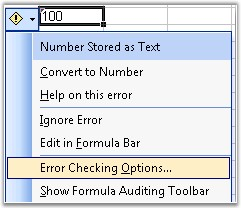
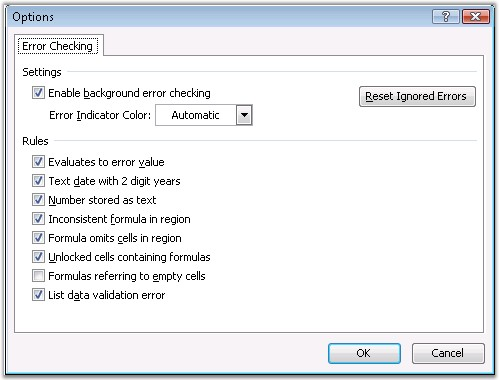

::: {style="DISPLAY: none"}
{#d2h_url_template}{#d2h_package_url style="WIDTH: 0px; DISPLAY: none; HEIGHT: 0px"}
:::

::::: {#nsbanner .d2h_main_nsbanner style="BORDER-BOTTOM: #999999 1px solid; POSITION: relative; PADDING-BOTTOM: 0px; BACKGROUND-COLOR: transparent; PADDING-LEFT: 0px; PADDING-RIGHT: 0px; DISPLAY: none; BORDER-TOP: #999999 1px solid; PADDING-TOP: 0px; LEFT: 0px"}
:::: {#TitleRow .d2h_main_titlerow style="PADDING-BOTTOM: 4px; BACKGROUND-COLOR: transparent; PADDING-LEFT: 22px; WIDTH: 100%; PADDING-RIGHT: 10px; DISPLAY: none; PADDING-TOP: 4px"}
::: {#ienav .d2h_main_ienav style="DISPLAY: none"}
{#D2HPrevious .D2HPreviousEnabled}  {#D2HNext .D2HNextEnabled}
:::
::::
:::::

::::: {#nstext .d2h_main_nstext style="PADDING-BOTTOM: 10px; BACKGROUND-COLOR: transparent; PADDING-LEFT: 22px; PADDING-RIGHT: 10px; HEIGHT: 100%; OVERFLOW: auto; PADDING-TOP: 5px" hasuserbackground="true" valign="bottom"}
::: {#d2h_breadcrumbs .d2h_breadcrumbs}
[Essential Studio User Guide Documentation](ms-xhelp:///?Id=12457748-09e3-4d74-a240-8e049cedf030){.d2h_breadcrumbsNormal}[ \> ]{.d2h_breadcrumbsLinkSeparator}[Reporting Edition](ms-xhelp:///?Id=027aa5b6-6676-4f93-ad23-c20e8c45792e){.d2h_breadcrumbsNormal}[ \> ]{.d2h_breadcrumbsLinkSeparator}[Essential XlsIO](ms-xhelp:///?Id=b01a1b50-1d7d-40c0-bc83-af67e57c9005){.d2h_breadcrumbsNormal}[ \> ]{.d2h_breadcrumbsLinkSeparator}[Concepts and Features](ms-xhelp:///?Id=21b26556-5905-4ad9-90b4-40320db25faf){.d2h_breadcrumbsNormal}[ \> ]{.d2h_breadcrumbsLinkSeparator}[Formulas](ms-xhelp:///?Id=c863333a-35ff-470d-abbc-279e765c84b1){.d2h_breadcrumbsNormal}
:::

### Formula Auditing {#formula-auditing style="tab-stops: 0pt"}

 

Excel has an option to find the quickest way to identify any cell that contains an error on the active worksheet, and ignore the error that is showed with green indicator, through the Error Checking dialog box. This dialog box provides various options to get information on the error, how a formula is evaluated, its trace, and an option to ignore the error by changing its data type.

 

{border="0"}

Figure 126: : Error Checking[]{style="FONT-FAMILY: 'Trebuchet MS','sans-serif'; COLOR: #15428b"}

 

Excel has the following set of rules that can be enabled or disabled, to show/hide warnings with green indicators.

 

[·      ]{style="FONT-FAMILY: Symbol"}**Evaluates to Error Value**-This rule treats cells containing formulas that result in an error, and displays a warning.

[·      ]{style="FONT-FAMILY: Symbol"}**Text Date**-This rule treats formulas that contain text formatted cells with years represented as 2-digits, as an error, and displays a warning while checking for errors.

[·      ]{style="FONT-FAMILY: Symbol"}**Number stored as Text**-This rule treats numbers formatted as text or preceded by an apostrophe, as an error, and displays a warning.

[·      ]{style="FONT-FAMILY: Symbol"}**Inconsistent Formula in Region**-This rule treats a formula in a region of your worksheet that differs from the other formulas in the same region, as an error, and displays a warning.

[·      ]{style="FONT-FAMILY: Symbol"}**Formula omits Cells in Region**-This rule treats formulas that omit certain cells in a region, as an error, and displays a warning.

[·      ]{style="FONT-FAMILY: Symbol"}**Unlocked Cells containing Formulas**-This rule treats an unlocked cell containing a formula, as an error, and displays a warning when checking for errors.

[·      ]{style="FONT-FAMILY: Symbol"}**Formulas referring to Empty Cells**-This rule treats formulas that refer to empty cells, as an error, and displays a warning.

[]{style="FONT-FAMILY: 'Trebuchet MS','sans-serif'; COLOR: #15428b; FONT-SIZE: 9pt"} 

{border="0"}

Figure 127: Options Dialog Box - Error Checking[]{style="FONT-FAMILY: 'Trebuchet MS','sans-serif'; COLOR: #15428b"}

 

XlsIO provides all the above options to ignore errors, and remove the green indicators. This can be done through the **IgnoreErrorOptions** property of the IRange interface.

 

Following are the values that can be set for the IgnoreError option, through the **ExcelIgnoreError** enumerator.

 

::: {align="center"}
  ---------------------- -----------------------------------------------------------------------
  Member name            Description
  None                   Represents None flag of excel ignore error indicator.
  EvaluateToError        Represents EvaluateToError flag of excel ignore error indicator.
  EmptyCellReferences    Represents EmptyCellReferences flag of excel ignore error indicator.
  NumberAsText           Represents NumberAsText flag of excel ignore error indicator.
  OmittedCells           Represents OmittedCells flag of excel ignore error indicator.
  InconsistentFormula    Represents InconsistentFormula flag of excel ignore error indicator.
  TextDate               Represents TextDate flag of excel ignore error indicator.
  UnlockedFormulaCells   Represents UnlockedFormulaCells flag of excel ignore error indicator.
  All                    Represents All flag of excel ignore error indicator.
  ---------------------- -----------------------------------------------------------------------
:::

 

Following code example illustrates how to ignore or set an error indicator.

 

+------------------------------------------------------------------------------------------------------------------------------------------------------------------------+
| **[\[C#\]]{style="FONT-FAMILY: 'Courier New'"}**                                                                                                                       |
|                                                                                                                                                                        |
| **[]{style="FONT-FAMILY: 'Courier New'"}**                                                                                                                             |
|                                                                                                                                                                        |
| [// Sets warning if number is entered as text.]{style="FONT-FAMILY: 'Courier New'; COLOR: green"}                                                                      |
|                                                                                                                                                                        |
| [sheet.Range\[[\"A2:D2\"]{style="COLOR: #a31515"}\].IgnoreErrorOptions = [ExcelIgnoreError]{style="COLOR: #2b91af"}.NumberAsText;]{style="FONT-FAMILY: 'Courier New'"} |
|                                                                                                                                                                        |
| []{style="FONT-FAMILY: 'Courier New'"}                                                                                                                                 |
|                                                                                                                                                                        |
| [// Ignores all the error warnings.]{style="FONT-FAMILY: 'Courier New'; COLOR: green"}                                                                                 |
|                                                                                                                                                                        |
| [sheet.Range\[[\"A3\"]{style="COLOR: #a31515"}\].IgnoreErrorOptions = [ExcelIgnoreError]{style="COLOR: #2b91af"}.None;]{style="FONT-FAMILY: 'Courier New'"}            |
+------------------------------------------------------------------------------------------------------------------------------------------------------------------------+

[]{style="FONT-FAMILY: 'Trebuchet MS','sans-serif'; COLOR: #15428b; FONT-SIZE: 9pt"} 

+--------------------------------------------------------------------------------------------------------------------------------------------+
| **[\[VB.NET\]]{style="FONT-FAMILY: 'Courier New'"}**                                                                                       |
|                                                                                                                                            |
| **[]{style="FONT-FAMILY: 'Courier New'"}**                                                                                                 |
|                                                                                                                                            |
| [\' Sets warning if number is entered as text.]{style="FONT-FAMILY: 'Courier New'; COLOR: green"}                                          |
|                                                                                                                                            |
| [sheet.Range\[[\"A2:D2\"]{style="COLOR: maroon"}\].IgnoreErrorOptions = ExcelIgnoreError.NumberAsText]{style="FONT-FAMILY: 'Courier New'"} |
|                                                                                                                                            |
| []{style="FONT-FAMILY: 'Courier New'"}                                                                                                     |
|                                                                                                                                            |
| [\' Ignores all the error warnings.]{style="FONT-FAMILY: 'Courier New'; COLOR: green"}                                                     |
|                                                                                                                                            |
| [sheet.Range\[[\"A3\"]{style="COLOR: maroon"}\].IgnoreErrorOptions = ExcelIgnoreError.None]{style="FONT-FAMILY: 'Courier New'"}            |
+--------------------------------------------------------------------------------------------------------------------------------------------+

 

 

[]{#related-topics}
:::::
