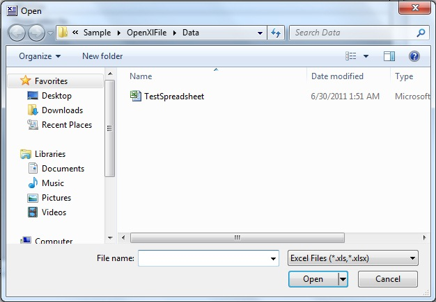
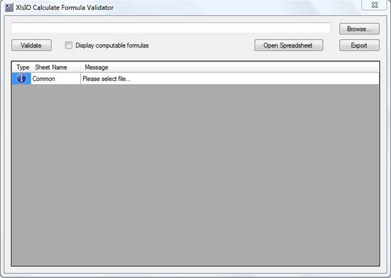
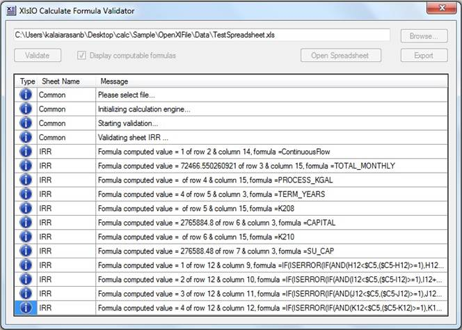

::: {style="DISPLAY: none"}
{#d2h_url_template}{#d2h_package_url style="WIDTH: 0px; DISPLAY: none; HEIGHT: 0px"}
:::

::::: {#nsbanner .d2h_main_nsbanner style="BORDER-BOTTOM: #999999 1px solid; POSITION: relative; PADDING-BOTTOM: 0px; BACKGROUND-COLOR: transparent; PADDING-LEFT: 0px; PADDING-RIGHT: 0px; DISPLAY: none; BORDER-TOP: #999999 1px solid; PADDING-TOP: 0px; LEFT: 0px"}
:::: {#TitleRow .d2h_main_titlerow style="PADDING-BOTTOM: 4px; BACKGROUND-COLOR: transparent; PADDING-LEFT: 22px; WIDTH: 100%; PADDING-RIGHT: 10px; DISPLAY: none; PADDING-TOP: 4px"}
::: {#ienav .d2h_main_ienav style="DISPLAY: none"}
{#D2HPrevious .D2HPreviousEnabled}  {#D2HNext .D2HNextEnabled}
:::
::::
:::::

:::: {#nstext .d2h_main_nstext style="PADDING-BOTTOM: 10px; BACKGROUND-COLOR: transparent; PADDING-LEFT: 22px; PADDING-RIGHT: 10px; HEIGHT: 100%; OVERFLOW: auto; PADDING-TOP: 5px" hasuserbackground="true" valign="bottom"}
::: {#d2h_breadcrumbs .d2h_breadcrumbs}
[Essential Studio User Guide Documentation](ms-xhelp:///?Id=12457748-09e3-4d74-a240-8e049cedf030){.d2h_breadcrumbsNormal}[ \> ]{.d2h_breadcrumbsLinkSeparator}[Essential Common](ms-xhelp:///?Id=2bfe10b6-fac1-4f91-a173-04db314f10c3){.d2h_breadcrumbsNormal}[ \> ]{.d2h_breadcrumbsLinkSeparator}[Other Utilities](ms-xhelp:///?Id=a8cc7430-cdfc-4de3-a351-6b323ce09ef1){.d2h_breadcrumbsNormal}
:::

## Formula Validator {#formula-validator style="tab-stops: 0pt"}

 

Formula validator helps to validate formulae in a spreadsheet and provides support to view spreadsheets and export them.

 

Usage:

 

1.   Open a spreadsheet to validate using the **Browse** button.

 

{border="0"}

Figure 139: Open Dialo Box

 

2.   Check **display computable formulas**, if you need to view the computable formulae that are used in the spreadsheet. Otherwise it is not required.

 

{border="0"}

Figure 140: XlsIO Calculate Formula Validator

 

3.   Click **Validate**.

 

The text area in the application will display the formulae (used in the spreadsheet) and result after validation.

{border="0"}

Figure 141: Formulae Displayed

 

If the **Display Computable Formulas** is not selected, then the results will not include the formulae that are used in the spreadsheet.[]{style="FONT-FAMILY: 'Calibri','sans-serif'; COLOR: #1f497d; FONT-SIZE: 11pt"}

4.   You can export a spreadsheet by using the **Export** option**,** after selecting the file that is to be exported.[]{style="FONT-FAMILY: 'Calibri','sans-serif'; COLOR: #1f497d; FONT-SIZE: 11pt"}

 

[]{#related-topics}
::::
