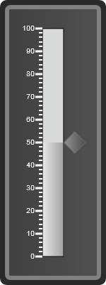

::: {style="DISPLAY: none"}
{#d2h_url_template} {#d2h_package_url style="WIDTH: 0px; DISPLAY: none; HEIGHT: 0px"}
:::

::::: {.d2h_secondary_topic style="PADDING-BOTTOM: 10pt; MARGIN: 0pt; PADDING-LEFT: 0pt; PADDING-RIGHT: 0pt; PADDING-TOP: 0pt"}
#### Frames in Linear Gauge {#frames-in-linear-gauge style="tab-stops: 0pt"}

[In Linear Gauge, there are three frames: ]{style="FONT-FAMILY: 'Arial','sans-serif'"}

[·      ]{style="FONT-FAMILY: Symbol"}Outer Frame

[·      ]{style="FONT-FAMILY: Symbol"}Inner Frame

[·      ]{style="FONT-FAMILY: Symbol"}Frame Interior

 

 

[You can set the border width, color and gradient colors by using the properties tabulated below.]{style="FONT-FAMILY: 'Arial','sans-serif'"}

[The linear gauge also supports three types of frame styles:]{style="FONT-FAMILY: 'Arial','sans-serif'"}

[1.   Rounded Rectangle]{style="FONT-FAMILY: 'Arial','sans-serif'"}

[2.   Rectangle]{style="FONT-FAMILY: 'Arial','sans-serif'"}

[3.   Cropped Rectangle.]{style="FONT-FAMILY: 'Arial','sans-serif'"}

[The frame style can be set by using the property **FrameType, (**tabulated below, along with the other properties for the three frames):]{style="FONT-FAMILY: 'Arial','sans-serif'"}

  ---------------------------------------------------------------------------------------------------------- --------------------------------------------------------------------------------------------------------------- -------------------------------------------------------------------------------------------------------- ----------------------------------------------------------------------------------------------------------- -----------------------------------------------------------------------------------------------------------------
  **[Property ]{style="FONT-FAMILY: 'Arial','sans-serif'"}** []{style="FONT-FAMILY: 'Arial','sans-serif'"}   **[Description ]{style="FONT-FAMILY: 'Arial','sans-serif'"}** []{style="FONT-FAMILY: 'Arial','sans-serif'"}     **[Type ]{style="FONT-FAMILY: 'Arial','sans-serif'"}** []{style="FONT-FAMILY: 'Arial','sans-serif'"}     **[Data Type ]{style="FONT-FAMILY: 'Arial','sans-serif'"}** []{style="FONT-FAMILY: 'Arial','sans-serif'"}   **[Reference links ]{style="FONT-FAMILY: 'Arial','sans-serif'"}** []{style="FONT-FAMILY: 'Arial','sans-serif'"}
  [ FrameOuterWidth]{style="FONT-FAMILY: 'Arial','sans-serif'"}                                              [Sets the width for the outer frame of the circular gauge ]{style="FONT-FAMILY: 'Arial','sans-serif'"}          [Server-Side]{style="FONT-FAMILY: 'Arial','sans-serif'"} []{style="FONT-FAMILY: 'Arial','sans-serif'"}   [Double ]{style="FONT-FAMILY: 'Arial','sans-serif'"}                                                        [NA]{style="FONT-FAMILY: 'Arial','sans-serif'"}
  [FrameOuterColor]{style="FONT-FAMILY: 'Arial','sans-serif'"}                                               [Sets the background color for the outer frame]{style="FONT-FAMILY: 'Arial','sans-serif'"}                      [Server-Side]{style="FONT-FAMILY: 'Arial','sans-serif'"}                                                 [Color]{style="FONT-FAMILY: 'Arial','sans-serif'"}                                                          [NA]{style="FONT-FAMILY: 'Arial','sans-serif'"}
  [FrameInnerWidth]{style="FONT-FAMILY: 'Arial','sans-serif'"}                                               [Sets the width for the inner frame]{style="FONT-FAMILY: 'Arial','sans-serif'"}                                 [Server-Side]{style="FONT-FAMILY: 'Arial','sans-serif'"}                                                 [Double]{style="FONT-FAMILY: 'Arial','sans-serif'"}                                                         [NA]{style="FONT-FAMILY: 'Arial','sans-serif'"}
  [FrameInnerColor]{style="FONT-FAMILY: 'Arial','sans-serif'"}                                               [Sets the background color for the inner frame]{style="FONT-FAMILY: 'Arial','sans-serif'"}                      [Server-Side]{style="FONT-FAMILY: 'Arial','sans-serif'"}                                                 [Color]{style="FONT-FAMILY: 'Arial','sans-serif'"}                                                          [NA]{style="FONT-FAMILY: 'Arial','sans-serif'"}
  [FrameInterior]{style="FONT-FAMILY: 'Arial','sans-serif'"}                                                 [Sets the gradient color for the background of the circular gauge]{style="FONT-FAMILY: 'Arial','sans-serif'"}   [Server-Side]{style="FONT-FAMILY: 'Arial','sans-serif'"}                                                 [ColorInfo\[\]]{style="FONT-FAMILY: 'Arial','sans-serif'"}                                                  [NA]{style="FONT-FAMILY: 'Arial','sans-serif'"}
  [FrameType]{style="FONT-FAMILY: 'Arial','sans-serif'"}                                                     [Sets the style of the frame in linear gauge]{style="FONT-FAMILY: 'Arial','sans-serif'"}                        [Server-Side]{style="FONT-FAMILY: 'Arial','sans-serif'"}                                                 [Enum]{style="FONT-FAMILY: 'Arial','sans-serif'"}                                                           [NA]{style="FONT-FAMILY: 'Arial','sans-serif'"}
  [Orientation]{style="FONT-FAMILY: 'Arial','sans-serif'"}                                                   [Sets the orientation for the frame]{style="FONT-FAMILY: 'Arial','sans-serif'"}                                 [Server-Side]{style="FONT-FAMILY: 'Arial','sans-serif'"}                                                 [Enum]{style="FONT-FAMILY: 'Arial','sans-serif'"}                                                           [NA]{style="FONT-FAMILY: 'Arial','sans-serif'"}
  ---------------------------------------------------------------------------------------------------------- --------------------------------------------------------------------------------------------------------------- -------------------------------------------------------------------------------------------------------- ----------------------------------------------------------------------------------------------------------- -----------------------------------------------------------------------------------------------------------------

[]{style="FONT-FAMILY: 'Arial','sans-serif'"} 

::: {style="BORDER-BOTTOM: windowtext 1pt solid; BORDER-LEFT: medium none; PADDING-BOTTOM: 1pt; MARGIN-TOP: 9pt; PADDING-LEFT: 0pt; PADDING-RIGHT: 0pt; MARGIN-BOTTOM: 9pt; BORDER-TOP: windowtext 1pt solid; BORDER-RIGHT: medium none; PADDING-TOP: 1pt"}
Note: the properties for Frames in the circular and linear gauges are the same.
:::

 

[To set the gradient color for the interior frame use the following code snippets:]{style="FONT-FAMILY: 'Arial','sans-serif'"}

+----------------------------------------------------------------------------------------------------------------------------------------------------------------------------------------------------------------------------------------------------------------------------------------------------------------------------------------------------------------------------------------------------------------------------------------------------------------------------------------------------------------------------------------------------------------------------------------------------------------------------------------------------------------------------------------------------------------------------------------------------------------------------------------------------------------------------------------------------------+
| [\[C#\]]{style="FONT-FAMILY: 'Courier New'"}                                                                                                                                                                                                                                                                                                                                                                                                                                                                                                                                                                                                                                                                                                                                                                                                             |
|                                                                                                                                                                                                                                                                                                                                                                                                                                                                                                                                                                                                                                                                                                                                                                                                                                                          |
| []{style="FONT-FAMILY: 'Courier New'"}                                                                                                                                                                                                                                                                                                                                                                                                                                                                                                                                                                                                                                                                                                                                                                                                                   |
|                                                                                                                                                                                                                                                                                                                                                                                                                                                                                                                                                                                                                                                                                                                                                                                                                                                          |
| [this]{style="FONT-FAMILY: 'Courier New'; COLOR: blue"} [.LinearGauge1.FrameInterior = [new]{style="COLOR: blue"}[Brush]{style="COLOR: #2b91af"}([new]{style="COLOR: blue"}[ColorInfo]{style="COLOR: #2b91af"}\[\] { [new]{style="COLOR: blue"}[ColorInfo]{style="COLOR: #2b91af"}(System.Drawing.[ColorTranslator]{style="COLOR: #2b91af"}.FromHtml([this]{style="COLOR: blue"}.ColorPallete1.SelectedColor), 0),[ new]{style="COLOR: blue"}[ColorInfo]{style="COLOR: #2b91af"}(System.Drawing.[ColorTranslator]{style="COLOR: #2b91af"}.FromHtml([this]{style="COLOR: blue"}.ColorPallete2.SelectedColor), 0.5), [new]{style="COLOR: blue"}[ColorInfo]{style="COLOR: #2b91af"}(System.Drawing.[ColorTranslator]{style="COLOR: #2b91af"}.FromHtml([this]{style="COLOR: blue"}.ColorPallete3.SelectedColor), 1) });]{style="FONT-FAMILY: 'Courier New'"} |
|                                                                                                                                                                                                                                                                                                                                                                                                                                                                                                                                                                                                                                                                                                                                                                                                                                                          |
| [this]{style="FONT-FAMILY: 'Courier New'; COLOR: blue"} [.LinearGauge1.FrameType = [LinearGaugeFrameType]{style="COLOR: #2b91af"}.RoundedRectangle;]{style="FONT-FAMILY: 'Courier New'"} []{style="FONT-FAMILY: 'Courier New'; COLOR: blue"}                                                                                                                                                                                                                                                                                                                                                                                                                                                                                                                                                                                                             |
|                                                                                                                                                                                                                                                                                                                                                                                                                                                                                                                                                                                                                                                                                                                                                                                                                                                          |
| []{style="FONT-FAMILY: 'Courier New'"}                                                                                                                                                                                                                                                                                                                                                                                                                                                                                                                                                                                                                                                                                                                                                                                                                   |
+----------------------------------------------------------------------------------------------------------------------------------------------------------------------------------------------------------------------------------------------------------------------------------------------------------------------------------------------------------------------------------------------------------------------------------------------------------------------------------------------------------------------------------------------------------------------------------------------------------------------------------------------------------------------------------------------------------------------------------------------------------------------------------------------------------------------------------------------------------+

 

+------------------------------------------------------------------------------------------------------------------------------------------------------------------------------------------------------------------------------------------------------------------------------------------------------------------------------------------------------------------------------------------------------------------------------------------------------------------------------------------------------------------------------------------------------------------------------------------------------------------------------------------------------------------------------------+
| [\[VB\]]{style="FONT-FAMILY: 'Courier New'"}                                                                                                                                                                                                                                                                                                                                                                                                                                                                                                                                                                                                                                       |
|                                                                                                                                                                                                                                                                                                                                                                                                                                                                                                                                                                                                                                                                                    |
| []{style="FONT-FAMILY: 'Courier New'"}                                                                                                                                                                                                                                                                                                                                                                                                                                                                                                                                                                                                                                             |
|                                                                                                                                                                                                                                                                                                                                                                                                                                                                                                                                                                                                                                                                                    |
| [Me]{style="FONT-FAMILY: 'Courier New'; COLOR: blue"} [.LinearGauge1.FrameInterior = [New]{style="COLOR: blue"} Brush([New]{style="COLOR: blue"} ColorInfo() {[New]{style="COLOR: blue"} ColorInfo(System.Drawing.ColorTranslator.FromHtml([Me]{style="COLOR: blue"}.ColorPallete1.SelectedColor), 0),[ New]{style="COLOR: blue"} ColorInfo(System.Drawing.ColorTranslator.FromHtml([Me]{style="COLOR: blue"}.ColorPallete2.SelectedColor), 1), [New]{style="COLOR: blue"} ColorInfo(System.Drawing.ColorTranslator.FromHtml([Me]{style="COLOR: blue"}.ColorPallete3.SelectedColor), 1)})]{style="FONT-FAMILY: 'Courier New'"} []{style="FONT-FAMILY: 'Courier New'; COLOR: blue"} |
|                                                                                                                                                                                                                                                                                                                                                                                                                                                                                                                                                                                                                                                                                    |
| [Me]{style="FONT-FAMILY: 'Courier New'; COLOR: blue"} [.LinearGauge1.FrameType = [LinearGaugeFrameType]{style="COLOR: #2b91af"}.RoundedRectangle]{style="FONT-FAMILY: 'Courier New'"} []{style="FONT-FAMILY: 'Courier New'; COLOR: blue"}                                                                                                                                                                                                                                                                                                                                                                                                                                          |
|                                                                                                                                                                                                                                                                                                                                                                                                                                                                                                                                                                                                                                                                                    |
| []{style="FONT-FAMILY: 'Courier New'"}                                                                                                                                                                                                                                                                                                                                                                                                                                                                                                                                                                                                                                             |
+------------------------------------------------------------------------------------------------------------------------------------------------------------------------------------------------------------------------------------------------------------------------------------------------------------------------------------------------------------------------------------------------------------------------------------------------------------------------------------------------------------------------------------------------------------------------------------------------------------------------------------------------------------------------------------+

 

Follow similar procedures to tweak the frames as well as the frame styles.

{border="0"}

Figure 45: Vertical linear gauge with a rounded rectangle frame, and gradient color in the interior frame

 

::: {style="BORDER-BOTTOM: windowtext 1pt solid; BORDER-LEFT: medium none; PADDING-BOTTOM: 1pt; MARGIN-TOP: 9pt; PADDING-LEFT: 0pt; PADDING-RIGHT: 0pt; MARGIN-BOTTOM: 9pt; BORDER-TOP: windowtext 1pt solid; BORDER-RIGHT: medium none; PADDING-TOP: 1pt"}
Note: Properties for the frames of Circular and linear gauges are all the same.
:::

[]{#related-topics}
:::::
