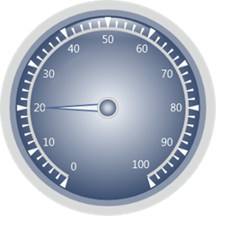
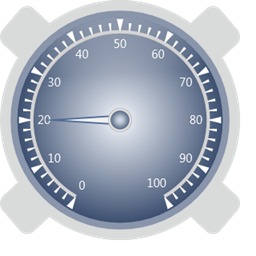
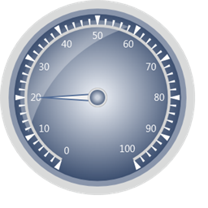
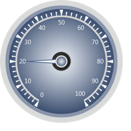

::: {style="DISPLAY: none"}
{#d2h_url_template}{#d2h_package_url style="WIDTH: 0px; DISPLAY: none; HEIGHT: 0px"}
:::

::: {.d2h_secondary_topic style="PADDING-BOTTOM: 10pt; MARGIN: 0pt; PADDING-LEFT: 0pt; PADDING-RIGHT: 0pt; PADDING-TOP: 0pt"}
##### FrameTypes {#frametypes style="tab-stops: 0pt"}

 

The following built-in Frame Types are available in Circular Gauge.

 

FullCircle:

Circular Gauge with default template will be displayed as full circle.

 

{border="0"}

Figure 56: Full Circle**[]{style="FONT-FAMILY: 'Calibri','sans-serif'"}**

[]{style="FONT-FAMILY: 'Calibri','sans-serif'"} 

CircularOuterFrames:

Circular Gauge with outer frames.

 

 

{border="0"}

Figure 57: CircularOuterFrames

**[]{style="FONT-FAMILY: 'Calibri','sans-serif'"}** 

CircularWithInnerTopGradient:

Circular Gauge frame with inner top gradient.

[]{style="FONT-FAMILY: 'Calibri','sans-serif'"} 

{border="0"}

Figure 58: CircularWithInnerTopGradient

**[]{style="FONT-FAMILY: 'Calibri','sans-serif'"}** 

CircularWithInnerLeftGradient:

Circular Gauge frame with inner left gradient.

 

{border="0"}

Figure 59: CircularWithInnerLeftGradient[]{style="FONT-FAMILY: 'Calibri','sans-serif'"}

 

CircularCenterGradient:

Circular Gauge with center gradient.

[]{style="FONT-FAMILY: 'Calibri','sans-serif'"} 

{border="0"}

Figure 60: CircularCenterGradient**[]{style="FONT-FAMILY: 'Calibri','sans-serif'"}**

[]{#related-topics}
:::
