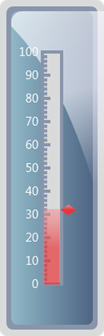
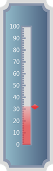
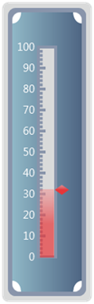
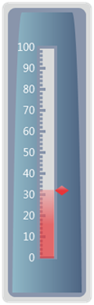

::: {style="DISPLAY: none"}
{#d2h_url_template}{#d2h_package_url style="WIDTH: 0px; DISPLAY: none; HEIGHT: 0px"}
:::

::: {.d2h_secondary_topic style="PADDING-BOTTOM: 10pt; MARGIN: 0pt; PADDING-LEFT: 0pt; PADDING-RIGHT: 0pt; PADDING-TOP: 0pt"}
##### Frame Types {#frame-types style="tab-stops: 0pt"}

 

The following built-in frame types are available in Linear Gauge:

 

Rectangle

Linear Gauge with default template will be displayed as a Rectangle.

[]{style="FONT-FAMILY: 'Calibri','sans-serif'"} 

{border="0"}

Figure 93: Rectangle

 

CroppedRectangle

Linear Gauge with CroppedRectangle.

 

{border="0"}

Figure 94: CroppedRectangle**[]{style="FONT-FAMILY: 'Calibri','sans-serif'"}**

 

BoltedRectangle

Linear Gauge frame with BoltedRectangle.

 

{border="0"}

Figure 95: BoltedRectangle[]{style="FONT-FAMILY: 'Calibri','sans-serif'"}

[                         ]{style="FONT-FAMILY: 'Calibri','sans-serif'"}

RoundedRectangleWithInnerTopGradient

Linear Gauge frame with inner top gradient.

 

{border="0"}

Figure 96: RoundedRectangleWithInnerGradient**[]{style="FONT-FAMILY: 'Calibri','sans-serif'"}**

[                                                                                  ]{style="FONT-FAMILY: 'Calibri','sans-serif'"}

[]{#related-topics}
:::
