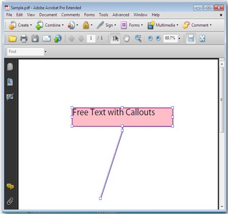
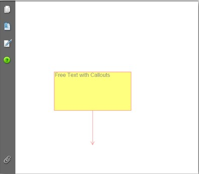

::: {style="DISPLAY: none"}
{#d2h_url_template}{#d2h_package_url style="WIDTH: 0px; DISPLAY: none; HEIGHT: 0px"}
:::

::::: {.d2h_secondary_topic style="PADDING-BOTTOM: 10pt; MARGIN: 0pt; PADDING-LEFT: 0pt; PADDING-RIGHT: 0pt; PADDING-TOP: 0pt"}
##### Free Text Annotation {#free-text-annotation style="tab-stops: 0pt"}

 

This feature enables the user to display the text directly on the page. Unlike an ordinary text annotation, a free text annotation has no open or closed state; the text is not displayed in the pop-up window. If the user wants to add a comment directly, without placing it in a pop-up window, FreeTextAnnotation can be used. Free Text Annotations can be included anywhere in the PDF Document by specifying the location and the CallOutLine points. While creating the project, the Interactive namespace has to be added in the project to enable this feature.

{border="0"}

Figure 28: Free Text Annotation

***[]{style="FONT-FAMILY: 'Trebuchet MS','sans-serif'; COLOR: #15428b; FONT-SIZE: 9pt"}*** 

List of Properties

The following table lists the properties available.

[]{style="FONT-FAMILY: 'Trebuchet MS','sans-serif'; COLOR: #15428b; FONT-SIZE: 9pt"} 

::: {align="center"}
  Property          Type                Value It Accepts                  Description
  ----------------- ------------------- --------------------------------- ----------------------------------------------------------------------------
  MarkupText        String              String                            Allows you to set the comment text.
  TextMarkupColor   Color               PdfColor                          Allows you to set the color of the comment text.
  Font              Font                PdfStandardFont/PdfTrueTypeFont   Allows you to set the font type for the comment text.
  Color             Color               PdfColor                          Allows you to set the background color of the Annotation box.
  BorderColor       Color               PdfColor                          Allows you to set the border color of the Annotation box.
  Border            float               PdfAnnotationBorder               Allows you to set the border type of the Annotation box.
  LineEndingStyle   lineStyle           PdfLineEndingStyle                Allows you to set the line ending style for the callout line.
  AnnotationFlags   PdfAnnotationFlag   PdfAnnotationFlags                Allows you to set annotation flags.
  Opacity           opacity             Float                             Allows you to set the opacity of the Annotation box.
  CalloutLines      Points              PointF\[\]                        Allows you to set the starting and ending coordinates of the callout line.
:::

[]{style="FONT-FAMILY: 'Trebuchet MS','sans-serif'; COLOR: #15428b; FONT-SIZE: 9pt"} 

[]{style="FONT-FAMILY: 'Trebuchet MS','sans-serif'; COLOR: #15428b; FONT-SIZE: 9pt"} 

List of Methods

 

The following table lists the methods available.

 

::: {align="center"}
  ----------------------- -------------------------------------------------- ------------- -----------------------------------------------------
  Method                  Parameters of the Method                           Return Type   Purpose
  PdfFreeTextAnnotation   PdfFreeTextAnnotation(System.Drawing.RectangleF)   Annotations   Creates annotation to be added to the PDF document.
  ----------------------- -------------------------------------------------- ------------- -----------------------------------------------------
:::

***[]{style="FONT-FAMILY: 'Trebuchet MS','sans-serif'; COLOR: #15428b; FONT-SIZE: 9pt"}*** 

Creating a Free Text Annotation

 

The following code snippet illustrates the creation of Free Text Annotation in PDF.

 

+------------------------------------------------------------------------------------------------------------------------------------------------------------------------------------------------------------------------------------------------------------------------------------------+
| **[\[C#\]]{style="FONT-FAMILY: 'Courier New'"}**                                                                                                                                                                                                                                         |
|                                                                                                                                                                                                                                                                                          |
| []{style="FONT-FAMILY: 'Courier New'; COLOR: green"}                                                                                                                                                                                                                                     |
|                                                                                                                                                                                                                                                                                          |
| [PdfFreeTextAnnotation]{style="FONT-FAMILY: 'Courier New'; COLOR: #2b91af"}[ annot = [new]{style="COLOR: blue"} [PdfFreeTextAnnotation]{style="COLOR: #2b91af"}([new]{style="COLOR: blue"} [RectangleF]{style="COLOR: #2b91af"}(50, 100, 100, 50));]{style="FONT-FAMILY: 'Courier New'"} |
|                                                                                                                                                                                                                                                                                          |
| []{style="FONT-FAMILY: 'Courier New'"}                                                                                                                                                                                                                                                   |
|                                                                                                                                                                                                                                                                                          |
| [           ]{style="FONT-FAMILY: 'Courier New'"}                                                                                                                                                                                                                                        |
|                                                                                                                                                                                                                                                                                          |
| [            annot.MarkupText = [\"Free Text with Callouts\"]{style="COLOR: #a31515"};]{style="FONT-FAMILY: 'Courier New'"}                                                                                                                                                              |
|                                                                                                                                                                                                                                                                                          |
| []{style="FONT-FAMILY: 'Courier New'"}                                                                                                                                                                                                                                                   |
|                                                                                                                                                                                                                                                                                          |
| [            annot.TextMarkupColor = [new]{style="COLOR: blue"} [PdfColor]{style="COLOR: #2b91af"}([Color]{style="COLOR: #2b91af"}.Black);]{style="FONT-FAMILY: 'Courier New'"}                                                                                                          |
|                                                                                                                                                                                                                                                                                          |
| [            annot.Font = [new]{style="COLOR: blue"} [PdfStandardFont]{style="COLOR: #2b91af"}([PdfFontFamily]{style="COLOR: #2b91af"}.Helvetica, 7f);]{style="FONT-FAMILY: 'Courier New'"}                                                                                              |
|                                                                                                                                                                                                                                                                                          |
| [            annot.Color = [new]{style="COLOR: blue"} [PdfColor]{style="COLOR: #2b91af"}([Color]{style="COLOR: #2b91af"}.Yellow);]{style="FONT-FAMILY: 'Courier New'"}                                                                                                                   |
|                                                                                                                                                                                                                                                                                          |
| [            annot.BorderColor = [new]{style="COLOR: blue"} [PdfColor]{style="COLOR: #2b91af"}([Color]{style="COLOR: #2b91af"}.Red);]{style="FONT-FAMILY: 'Courier New'"}                                                                                                                |
|                                                                                                                                                                                                                                                                                          |
| [            annot.Border = [new]{style="COLOR: blue"} [PdfAnnotationBorder]{style="COLOR: #2b91af"}(.5f);]{style="FONT-FAMILY: 'Courier New'"}                                                                                                                                          |
|                                                                                                                                                                                                                                                                                          |
| [            annot.LineEndingStyle = [PdfLineEndingStyle]{style="COLOR: #2b91af"}.OpenArrow;]{style="FONT-FAMILY: 'Courier New'"}                                                                                                                                                        |
|                                                                                                                                                                                                                                                                                          |
| [            annot.AnnotationFlags = [PdfAnnotationFlags]{style="COLOR: #2b91af"}.Default;          ]{style="FONT-FAMILY: 'Courier New'"}                                                                                                                                                |
|                                                                                                                                                                                                                                                                                          |
| [            annot.Text = [\"Free Text\"]{style="COLOR: #a31515"};]{style="FONT-FAMILY: 'Courier New'"}                                                                                                                                                                                  |
|                                                                                                                                                                                                                                                                                          |
| [            annot.Opacity = 0.5f;]{style="FONT-FAMILY: 'Courier New'"}                                                                                                                                                                                                                  |
|                                                                                                                                                                                                                                                                                          |
| [            [PointF]{style="COLOR: #2b91af"}\[\] points = { [new]{style="COLOR: blue"} [PointF]{style="COLOR: #2b91af"}(100, 400), [new]{style="COLOR: blue"} [PointF]{style="COLOR: #2b91af"}(100, 450) };]{style="FONT-FAMILY: 'Courier New'"}                                        |
|                                                                                                                                                                                                                                                                                          |
| []{style="FONT-FAMILY: 'Courier New'"}                                                                                                                                                                                                                                                   |
|                                                                                                                                                                                                                                                                                          |
| [            annot.CalloutLines = points;]{style="FONT-FAMILY: 'Courier New'"}                                                                                                                                                                                                           |
|                                                                                                                                                                                                                                                                                          |
| []{style="FONT-FAMILY: 'Courier New'"}                                                                                                                                                                                                                                                   |
|                                                                                                                                                                                                                                                                                          |
| [            page.Annotations.Add(annot);]{style="FONT-FAMILY: 'Courier New'"}                                                                                                                                                                                                           |
|                                                                                                                                                                                                                                                                                          |
| []{style="FONT-FAMILY: 'Courier New'"}                                                                                                                                                                                                                                                   |
+------------------------------------------------------------------------------------------------------------------------------------------------------------------------------------------------------------------------------------------------------------------------------------------+

 

Run the code. You have successfully created a Free Text Annotation box.

 

{border="0"}

Figure 29: Free Text Annotation

[]{#related-topics}
:::::
