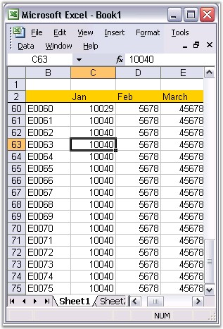

::: {style="DISPLAY: none"}
{#d2h_url_template}{#d2h_package_url style="WIDTH: 0px; DISPLAY: none; HEIGHT: 0px"}
:::

:::: {.d2h_secondary_topic style="PADDING-BOTTOM: 10pt; MARGIN: 0pt; PADDING-LEFT: 0pt; PADDING-RIGHT: 0pt; PADDING-TOP: 0pt"}
#### FreezePane {#freezepane style="tab-stops: 0pt"}

 

It is difficult to read and understand very large spreadsheets. When you scroll too far to the right or down, you will not be able to view the headings that are located at the top and at the the left side of the worksheet. Without the headings, its hard to keep track of the columns or rows of data, you are currently viewing.

 

Excel features Freeze Panes to avoid this problem. This feature can be enabled by selecting Freeze option from the Window menu. It allows you to \"freeze\" certain areas or panes of the spreadsheet, so that they remain visible at all times while scrolling to the right or bottom. Headings make it easier to read the data in the spreadsheet.

 

XlsIO provides support for the freeze panes functionality through the FreezePanes method of IRange.

  

+----------------------------------------------------------------------------------------------------------------+
| **[\[C#\]]{style="FONT-FAMILY: 'Courier New'"}**                                                               |
|                                                                                                                |
| **[]{style="FONT-FAMILY: 'Courier New'"}**                                                                     |
|                                                                                                                |
| [// Applying Freeze Pane to the sheet by specifying a cell.]{style="FONT-FAMILY: 'Courier New'; COLOR: green"} |
|                                                                                                                |
| [sheet.Range\[[\"B2\"]{style="COLOR: #a31515"}\].FreezePanes();]{style="FONT-FAMILY: 'Courier New'"}           |
+----------------------------------------------------------------------------------------------------------------+

[]{style="FONT-FAMILY: 'Trebuchet MS','sans-serif'; COLOR: #15428b; FONT-SIZE: 9pt"} 

+----------------------------------------------------------------------------------------------------------------+
| **[\[VB.NET\]]{style="FONT-FAMILY: 'Courier New'"}**                                                           |
|                                                                                                                |
| **[]{style="FONT-FAMILY: 'Courier New'"}**                                                                     |
|                                                                                                                |
| [\' Applying Freeze Pane to the sheet by specifying a cell.]{style="FONT-FAMILY: 'Courier New'; COLOR: green"} |
|                                                                                                                |
| [sheet.Range([\"B2\"]{style="COLOR: maroon"}).FreezePanes()]{style="FONT-FAMILY: 'Courier New'"}               |
+----------------------------------------------------------------------------------------------------------------+

[]{style="FONT-FAMILY: 'Trebuchet MS','sans-serif'; COLOR: #15428b; FONT-SIZE: 9pt"} 

{border="0"}

Figure 148: XlsIO with Freeze Pane[]{style="FONT-FAMILY: 'Trebuchet MS','sans-serif'; COLOR: #15428b"}

 

XlsIO also allows you to scroll to the first row in the bottom pane and first column in the right pane. It helps you to navigate to the top row while opening a spreadsheet with large number of rows/columns. Note that this works only with the sheet that has the freeze panes.

 

+-----------------------------------------------------------------------------------------------------+
| **[\[C#\]]{style="FONT-FAMILY: 'Courier New'"}**                                                    |
|                                                                                                     |
| **[]{style="FONT-FAMILY: 'Courier New'"}**                                                          |
|                                                                                                     |
| [// Sets first visible row in the bottom pane.]{style="FONT-FAMILY: 'Courier New'; COLOR: green"}   |
|                                                                                                     |
| [sheet.FirstVisibleRow = 2;]{style="FONT-FAMILY: 'Courier New'; COLOR: black"}                      |
|                                                                                                     |
| []{style="FONT-FAMILY: 'Courier New'; COLOR: black"}                                                |
|                                                                                                     |
| [// Sets first visible column in the right pane.]{style="FONT-FAMILY: 'Courier New'; COLOR: green"} |
|                                                                                                     |
| [sheet.FirstVisibleColumn = 2; ]{style="FONT-FAMILY: 'Courier New'; COLOR: black"}                  |
+-----------------------------------------------------------------------------------------------------+

[]{style="FONT-FAMILY: 'Trebuchet MS','sans-serif'; COLOR: #15428b; FONT-SIZE: 9pt"} 

+-----------------------------------------------------------------------------------------------------+
| **[\[VB.NET\]]{style="FONT-FAMILY: 'Courier New'"}**                                                |
|                                                                                                     |
| **[]{style="FONT-FAMILY: 'Courier New'"}**                                                          |
|                                                                                                     |
| [\' Sets first visible row in the bottom pane.]{style="FONT-FAMILY: 'Courier New'; COLOR: green"}   |
|                                                                                                     |
| [sheet.FirstVisibleRow = 2]{style="FONT-FAMILY: 'Courier New'; COLOR: black"}                       |
|                                                                                                     |
| []{style="FONT-FAMILY: 'Courier New'; COLOR: black"}                                                |
|                                                                                                     |
| [\' Sets first visible column in the right pane.]{style="FONT-FAMILY: 'Courier New'; COLOR: green"} |
|                                                                                                     |
| [sheet.FirstVisibleColumn = 2]{style="FONT-FAMILY: 'Courier New'; COLOR: black"}                    |
+-----------------------------------------------------------------------------------------------------+

::: {style="BORDER-BOTTOM: windowtext 1pt solid; BORDER-LEFT: medium none; PADDING-BOTTOM: 1pt; MARGIN-TOP: 9pt; PADDING-LEFT: 0pt; PADDING-RIGHT: 0pt; MARGIN-BOTTOM: 9pt; BORDER-TOP: windowtext 1pt solid; BORDER-RIGHT: medium none; PADDING-TOP: 1pt"}
 

{border="0"}Note: FirstVisibleColumn and FirstVisibleRow indexes are \"zero-based\".
:::

 

[]{#related-topics}
::::
