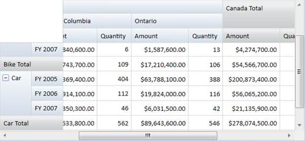

::: {style="DISPLAY: none"}
{#d2h_url_template} {#d2h_package_url style="WIDTH: 0px; DISPLAY: none; HEIGHT: 0px"}
:::

::: {.d2h_secondary_topic style="PADDING-BOTTOM: 10pt; MARGIN: 0pt; PADDING-LEFT: 0pt; PADDING-RIGHT: 0pt; PADDING-TOP: 0pt"}
#### Freezing Headers {#freezing-headers style="tab-stops: 0pt"}

PivotGrid for WPF provides built-in support for freezing column and row headers. This is achieved by setting the FreezeHeaders property of PivotGrid to True. This feature also enables scrolling through the value cells.

+------------------------------------------------------------------------------------------------------------------------------------------------------------------------------------------------------+
| **[\[C#\]]{style="FONT-FAMILY: 'Courier New'"}**                                                                                                                                                     |
|                                                                                                                                                                                                      |
| [// To Freeze Grid Headers]{style="FONT-FAMILY: 'Courier New'; COLOR: green"}                                                                                                                        |
|                                                                                                                                                                                                      |
| [this]{style="FONT-FAMILY: 'Courier New'; COLOR: blue"} [.PivotGridControl1.FreezeHeaders = [true]{style="COLOR: blue"};]{style="FONT-FAMILY: 'Courier New'"} []{style="FONT-FAMILY: 'Courier New'"} |
|                                                                                                                                                                                                      |
| []{style="FONT-FAMILY: 'Courier New'"}                                                                                                                                                               |
+------------------------------------------------------------------------------------------------------------------------------------------------------------------------------------------------------+

 

+------------------------------------------------------------------------------------------------------------------------------------------------------------+
| **[\[VB\]]{style="FONT-FAMILY: 'Courier New'"}**                                                                                                           |
|                                                                                                                                                            |
| [\' To Freeze Grid Headers]{style="FONT-FAMILY: 'Courier New'; COLOR: green"} []{style="FONT-FAMILY: 'Courier New'"}                                       |
|                                                                                                                                                            |
| [Me]{style="FONT-FAMILY: 'Courier New'; COLOR: blue"} [.PivotGridControl1.FreezeHeaders = [True]{style="COLOR: blue"}]{style="FONT-FAMILY: 'Courier New'"} |
|                                                                                                                                                            |
| []{style="FONT-FAMILY: 'Courier New'"}                                                                                                                     |
+------------------------------------------------------------------------------------------------------------------------------------------------------------+

 

[]{style="FONT-FAMILY: 'Courier New'; COLOR: blue"} 

{border="0"}

 

Figure 9: PivotGrid with Frozen Headers

[]{#related-topics}
:::
