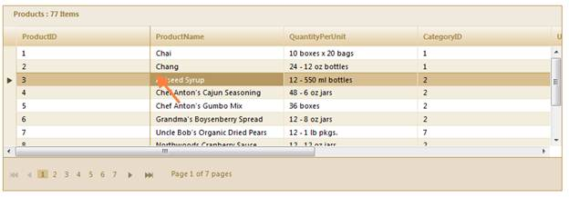

::: {style="DISPLAY: none"}
{#d2h_url_template}{#d2h_package_url style="WIDTH: 0px; DISPLAY: none; HEIGHT: 0px"}
:::

:::: {.d2h_secondary_topic style="PADDING-BOTTOM: 10pt; MARGIN: 0pt; PADDING-LEFT: 0pt; PADDING-RIGHT: 0pt; PADDING-TOP: 0pt"}
#### Freezing Panes {#freezing-panes style="tab-stops: 0pt"}

Use the following code snippet in the client side to freeze panes based on the current selection.

 

[]{style="FONT-FAMILY: 'Myriad Pro','sans-serif'"} 

::: {align="center"}
+---------------------------------------------------------------------------------------------------------------------------------------+
| **[\[JavaScript\]]{style="FONT-FAMILY: 'Courier New'"}**                                                                              |
|                                                                                                                                       |
| **[]{style="FONT-FAMILY: 'Courier New'"}**                                                                                            |
|                                                                                                                                       |
| [    [var]{style="COLOR: blue"} grid = \$find([\"MyGrid\"]{style="COLOR: maroon"});]{style="FONT-FAMILY: Consolas; FONT-SIZE: 9.5pt"} |
|                                                                                                                                       |
| [    **grid.freezePanes();**]{style="FONT-FAMILY: Consolas; FONT-SIZE: 9.5pt"}**[   ]{style="FONT-FAMILY: 'Courier New'"}**           |
+---------------------------------------------------------------------------------------------------------------------------------------+
:::

 

If the third row and second column of the grid is selected, freeze panes will keep the first two rows and first column visble as always while the grid is scrolling.

 

{border="0"}

Figure 279: Rows and Columns are Frozen Based on Selection

[]{#related-topics}
::::
