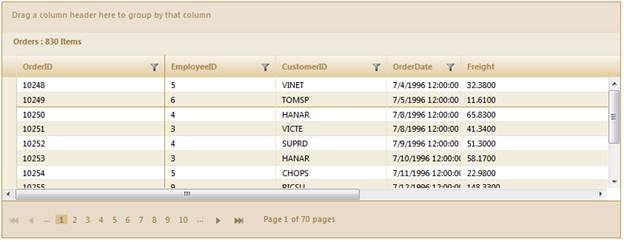
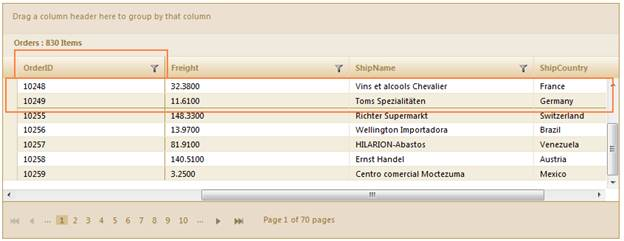

::: {style="DISPLAY: none"}
{#d2h_url_template}{#d2h_package_url style="WIDTH: 0px; DISPLAY: none; HEIGHT: 0px"}
:::

::::: {#nsbanner .d2h_main_nsbanner style="BORDER-BOTTOM: #999999 1px solid; POSITION: relative; PADDING-BOTTOM: 0px; BACKGROUND-COLOR: transparent; PADDING-LEFT: 0px; PADDING-RIGHT: 0px; DISPLAY: none; BORDER-TOP: #999999 1px solid; PADDING-TOP: 0px; LEFT: 0px"}
:::: {#TitleRow .d2h_main_titlerow style="PADDING-BOTTOM: 4px; BACKGROUND-COLOR: transparent; PADDING-LEFT: 22px; WIDTH: 100%; PADDING-RIGHT: 10px; DISPLAY: none; PADDING-TOP: 4px"}
::: {#ienav .d2h_main_ienav style="DISPLAY: none"}
{#D2HPrevious .D2HPreviousEnabled}  {#D2HNext .D2HNextEnabled}
:::
::::
:::::

:::::::::: {#nstext .d2h_main_nstext style="PADDING-BOTTOM: 10px; BACKGROUND-COLOR: transparent; PADDING-LEFT: 22px; PADDING-RIGHT: 10px; HEIGHT: 100%; OVERFLOW: auto; PADDING-TOP: 5px" hasuserbackground="true" valign="bottom"}
::: {#d2h_breadcrumbs .d2h_breadcrumbs}
[Essential Studio User Guide Documentation](ms-xhelp:///?Id=12457748-09e3-4d74-a240-8e049cedf030){.d2h_breadcrumbsNormal}[ \> ]{.d2h_breadcrumbsLinkSeparator}[User Interface Edition](ms-xhelp:///?Id=c29296b7-531c-413b-a0ec-488ca1f7f669){.d2h_breadcrumbsNormal}[ \> ]{.d2h_breadcrumbsLinkSeparator}[Essential ASP.NET MVC](ms-xhelp:///?Id=4b14e7d1-65c4-4f67-b1aa-2c37709905a5){.d2h_breadcrumbsNormal}[ \> ]{.d2h_breadcrumbsLinkSeparator}[Essential Grid]{.d2h_breadcrumbsContentsOnly}[ \> ]{.d2h_breadcrumbsLinkSeparator}[Getting Started](ms-xhelp:///?Id=c7ed3902-b25b-4170-be58-1d3d0b57748a){.d2h_breadcrumbsNormal}[ \> ]{.d2h_breadcrumbsLinkSeparator}[Feature Summary](ms-xhelp:///?Id=1923e679-441a-44e0-9bca-e0e50988a857){.d2h_breadcrumbsNormal}[ \> ]{.d2h_breadcrumbsLinkSeparator}[Concepts and Features](ms-xhelp:///?Id=4a1657fa-4756-42b9-9153-aebf5dcfc503){.d2h_breadcrumbsNormal}
:::

## Freezing Rows and Columns {#freezing-rows-and-columns style="tab-stops: 0pt"}

When scrolling the grid content, some columns and rows should be locked, similar to freeze panes in Microsoft Excel. This is quite useful when you want to make a part of the data (in columns/rows) visible to end users at all times.

 

Use Case Scenarios

Users can freeze rows and columns to the left or top of the grid so that they are always visible when scrolling through a grid with a large number of rows or columns.

 

Sample Link

To view the samples:

1.   Open the sample browser and select **ASP.NET MVC** from the left-hand panel.

2.   Click **Run samples** to launch the ASP.NET MVC sample browser.

3.   Select **Grid** from the product icons in the bottom-left of the screen.

4.   Select **Rows and Columns\>Frozen rows and columns** to launch the sample.

 

 

Freezing Grid Rows/Columns in an Application

 

Through GridBuilder

 

To freeze the rows and columns in the grid using **GridBuilder**:

1.   Create a model in the application (Refer to [Getting Started\>Adding a Model to the Application]{.UGHyperlink}).

2.   Create a strongly typed view (Refer to [How to\>Strongly Typed View]{.UGHyperlink}).

3.   Create the Grid control in the view and configure the properties.

4.   Set the number of rows that need to be frozen using the **FrozenRows** method.

5.   Set the number of columns that need to be frozen using **FrozenColumns** method.

6.   Scrolling can be enabled using **EnableScrolling** method. The Grid width should be less than the total columns width.

[]{style="FONT-FAMILY: 'Myriad Pro','sans-serif'"} 

::: {align="center"}
+-----------------------------------------------------------------------------------------------------------------------------------------------------------------------------------------------------------------------------------------------------+
| **[View \[ASPX\]]{style="FONT-FAMILY: 'Courier New'"}**                                                                                                                                                                                             |
|                                                                                                                                                                                                                                                     |
| **[]{style="FONT-FAMILY: 'Courier New'"}**                                                                                                                                                                                                          |
|                                                                                                                                                                                                                                                     |
| [ ]{style="FONT-FAMILY: Consolas"}[\<%]{style="FONT-FAMILY: 'Courier New'; BACKGROUND: yellow"}[=]{style="FONT-FAMILY: 'Courier New'; COLOR: blue"}[Html.Syncfusion().Grid\<[Order]{style="COLOR: #2b91af"}\>([\"Grid1\"]{style="COLOR: #a31515"})\ |
|        .Datasource(Model)\                                                                                                                                                                                                                          |
|        .Caption([\"Orders\"]{style="COLOR: #a31515"})\                                                                                                                                                                                              |
|        .AutoFormat([Skins]{style="COLOR: #2b91af"}.Sandune)[]{style="COLOR: green"}]{style="FONT-FAMILY: 'Courier New'"}                                                                                                                            |
|                                                                                                                                                                                                                                                     |
| **[       .FrozenRows(2)]{style="FONT-FAMILY: 'Courier New'"}**                                                                                                                                                                                     |
|                                                                                                                                                                                                                                                     |
| **[       .FrozenColumns(1)]{style="FONT-FAMILY: 'Courier New'"}**                                                                                                                                                                                  |
|                                                                                                                                                                                                                                                     |
| **[        .EnableScrolling()]{style="FONT-FAMILY: Consolas; FONT-SIZE: 9.5pt"}**                                                                                                                                                                   |
|                                                                                                                                                                                                                                                     |
| **[       .Scrolling(scroll =\> scroll.Height(150).Width(535))]{style="FONT-FAMILY: 'Courier New'"}**[ \                                                                                                                                            |
|        .Column( columns =\> {\                                                                                                                                                                                                                      |
|            columns.Add(p =\> p.OrderID).Width(200);\                                                                                                                                                                                                |
|            columns.Add(p =\> p.CustomerID).Width(200);\                                                                                                                                                                                             |
|            columns.Add(p =\> p.EmployeeID).Width(200);  \                                                                                                                                                                                           |
|            columns.Add(P =\> P.ShipCountry).Width(200);]{style="FONT-FAMILY: 'Courier New'"}                                                                                                                                                        |
|                                                                                                                                                                                                                                                     |
| [           columns.Add(p =\> p.OrderDate).Width(200).Format([\"{0:dd-MM-yyyy}\"]{style="COLOR: #a31515"});\                                                                                                                                        |
|            })\                                                                                                                                                                                                                                      |
|        [%\>]{style="BACKGROUND: yellow"}]{style="FONT-FAMILY: 'Courier New'"}                                                                                                                                                                       |
|                                                                                                                                                                                                                                                     |
| [   ]{style="FONT-FAMILY: 'Courier New'"}                                                                                                                                                                                                           |
+-----------------------------------------------------------------------------------------------------------------------------------------------------------------------------------------------------------------------------------------------------+
:::

[]{style="FONT-FAMILY: 'Myriad Pro','sans-serif'"} 

[]{style="FONT-FAMILY: 'Myriad Pro','sans-serif'"} 

::: {align="center"}
+-----------------------------------------------------------------------------------------------------------------------------------------------------------------------------------------------------------------------------------------------------+
| **[View \[cshtml\]]{style="FONT-FAMILY: 'Courier New'"}**                                                                                                                                                                                           |
|                                                                                                                                                                                                                                                     |
| **[]{style="FONT-FAMILY: 'Courier New'"}**                                                                                                                                                                                                          |
|                                                                                                                                                                                                                                                     |
| [ ]{style="FONT-FAMILY: Consolas"}[\@{]{style="FONT-FAMILY: 'Courier New'; BACKGROUND: yellow"}[ ]{style="FONT-FAMILY: 'Courier New'; COLOR: blue"}[Html.Syncfusion().Grid\<[Order]{style="COLOR: #2b91af"}\>([\"Grid1\"]{style="COLOR: #a31515"})\ |
|        .Datasource(Model)\                                                                                                                                                                                                                          |
|        .Caption([\"Orders\"]{style="COLOR: #a31515"})\                                                                                                                                                                                              |
|        .AutoFormat([Skins]{style="COLOR: #2b91af"}.Sandune)[]{style="COLOR: green"}]{style="FONT-FAMILY: 'Courier New'"}                                                                                                                            |
|                                                                                                                                                                                                                                                     |
| **[       .FrozenRows(2)]{style="FONT-FAMILY: 'Courier New'"}**                                                                                                                                                                                     |
|                                                                                                                                                                                                                                                     |
| **[       .FrozenColumns(1)]{style="FONT-FAMILY: 'Courier New'"}**                                                                                                                                                                                  |
|                                                                                                                                                                                                                                                     |
| **[        .EnableScrolling()]{style="FONT-FAMILY: Consolas; FONT-SIZE: 9.5pt"}**                                                                                                                                                                   |
|                                                                                                                                                                                                                                                     |
| **[       .Scrolling(scroll =\> scroll.Height(150).Width(535))]{style="FONT-FAMILY: 'Courier New'"}**[ \                                                                                                                                            |
|        .Column( columns =\> {\                                                                                                                                                                                                                      |
|            columns.Add(p =\> p.OrderID).Width(200);\                                                                                                                                                                                                |
|            columns.Add(p =\> p.CustomerID).Width(200);\                                                                                                                                                                                             |
|            columns.Add(p =\> p.EmployeeID).Width(200);  \                                                                                                                                                                                           |
|            columns.Add(P =\> P.ShipCountry).Width(200);]{style="FONT-FAMILY: 'Courier New'"}                                                                                                                                                        |
|                                                                                                                                                                                                                                                     |
| [           columns.Add(p =\> p.OrderDate).Width(200).Format([\"{0:dd-MM-yyyy}\"]{style="COLOR: #a31515"});\                                                                                                                                        |
|            }).Render();]{style="FONT-FAMILY: 'Courier New'"}                                                                                                                                                                                        |
|                                                                                                                                                                                                                                                     |
| [       [}]{style="BACKGROUND: yellow"}]{style="FONT-FAMILY: 'Courier New'"}                                                                                                                                                                        |
|                                                                                                                                                                                                                                                     |
| [   ]{style="FONT-FAMILY: 'Courier New'"}                                                                                                                                                                                                           |
+-----------------------------------------------------------------------------------------------------------------------------------------------------------------------------------------------------------------------------------------------------+
:::

[]{style="FONT-FAMILY: 'Myriad Pro','sans-serif'"} 

7.   Set its data source and render the view.

[]{style="FONT-FAMILY: 'Myriad Pro','sans-serif'"} 

::: {align="center"}
+-----------------------------------------------------------------------------------------------------------------------------------------------------------------------------------------------------------------------------------+
| **[\[C#\]]{style="FONT-FAMILY: 'Courier New'"}**                                                                                                                                                                                  |
|                                                                                                                                                                                                                                   |
| [        ]{style="FONT-FAMILY: Consolas; COLOR: gray"}[///]{style="FONT-FAMILY: 'Courier New'; COLOR: gray"}[ ]{style="FONT-FAMILY: 'Courier New'; COLOR: green"}[\<summary\>]{style="FONT-FAMILY: 'Courier New'; COLOR: gray"}[\ |
|         [///]{style="COLOR: gray"}[ Used for rendering the grid initially.]{style="COLOR: green"}\                                                                                                                                |
|         [///]{style="COLOR: gray"}[ ]{style="COLOR: green"}[\</summary\>]{style="COLOR: gray"}\                                                                                                                                   |
|         [///]{style="COLOR: gray"}[ ]{style="COLOR: green"}[\<returns\>]{style="COLOR: gray"}[View page, it displays the Grid]{style="COLOR: green"}[\</returns\>]{style="COLOR: gray"}\                                          |
|         [public]{style="COLOR: blue"} [ActionResult]{style="COLOR: #2b91af"} Index()\                                                                                                                                             |
|         {\                                                                                                                                                                                                                        |
|             [var]{style="COLOR: blue"} data = [new]{style="COLOR: blue"} [NorthwindDataContext]{style="COLOR: #2b91af"}().Orders;\                                                                                                |
|             [return]{style="COLOR: blue"} View(data);\                                                                                                                                                                            |
|         }]{style="FONT-FAMILY: 'Courier New'"}                                                                                                                                                                                    |
|                                                                                                                                                                                                                                   |
| [   ]{style="FONT-FAMILY: 'Courier New'"}                                                                                                                                                                                         |
+-----------------------------------------------------------------------------------------------------------------------------------------------------------------------------------------------------------------------------------+
:::

[]{style="FONT-FAMILY: 'Myriad Pro','sans-serif'"} 

8.   Run the application. The grid will appear as displayed in the following screenshot:

[]{style="FONT-FAMILY: 'Myriad Pro','sans-serif'"} 

{border="0"}

Figure 275: "OrderID" Column and First Two Rows Frozen

 

{border="0"}

Figure 276: "OrderID" Column and First Two Rows Visible after Scrolling

[   ]{style="FONT-FAMILY: 'Courier New'"}[]{style="FONT-FAMILY: 'Myriad Pro','sans-serif'"}

Through GridPropertiesModel

To freeze the rows and columns in the grid using **GridPropertiesModel**:

**[]{style="COLOR: red"}** 

1.   Create a model in the application (Refer to [Getting Started\>Adding a Model to the Application]{.UGHyperlink}).

2.   Add the following code in the **Index.aspx** file to create the Grid control in the view.

[]{style="FONT-FAMILY: 'Myriad Pro','sans-serif'"} 

::: {align="center"}
+-----------------------------------------------------------------------------------------------------------------------------------------------------------------------------------------------------------------------------------------------------------------------------------------------+
| **[View \[ASPX\]]{style="FONT-FAMILY: 'Courier New'"}**                                                                                                                                                                                                                                       |
|                                                                                                                                                                                                                                                                                               |
| [        ]{style="FONT-FAMILY: Consolas; COLOR: gray"}[ ]{style="FONT-FAMILY: Consolas"}[   [\<%]{style="BACKGROUND: yellow"}[=]{style="COLOR: blue"}Html.Grid\<[Order]{style="COLOR: #2b91af"}\>([\"Grid1\"]{style="COLOR: #a31515"},[\"GridModel\"]{style="COLOR: #a31515"}, columns =\> {\ |
|             columns.Add(p =\> p.OrderID).Width(200);\                                                                                                                                                                                                                                         |
|             columns.Add(p =\> p.CustomerID).Width(200);\                                                                                                                                                                                                                                      |
|             columns.Add(p =\> p.EmployeeID).Width(200);  \                                                                                                                                                                                                                                    |
|             columns.Add(P =\> P.ShipCountry).Width(200);]{style="FONT-FAMILY: 'Courier New'"}                                                                                                                                                                                                 |
|                                                                                                                                                                                                                                                                                               |
| [            columns.Add(p =\> p.OrderDate).Width(200).Format([\"{0:dd-MM-yyyy}\"]{style="COLOR: #a31515"});]{style="FONT-FAMILY: 'Courier New'"}                                                                                                                                             |
|                                                                                                                                                                                                                                                                                               |
| [           })[%\>]{style="BACKGROUND: yellow"}]{style="FONT-FAMILY: 'Courier New'"}                                                                                                                                                                                                          |
|                                                                                                                                                                                                                                                                                               |
| [   ]{style="FONT-FAMILY: 'Courier New'"}                                                                                                                                                                                                                                                     |
+-----------------------------------------------------------------------------------------------------------------------------------------------------------------------------------------------------------------------------------------------------------------------------------------------+
:::

[]{style="FONT-FAMILY: 'Myriad Pro','sans-serif'"} 

[]{style="FONT-FAMILY: 'Myriad Pro','sans-serif'"} 

::: {align="center"}
+-----------------------------------------------------------------------------------------------------------------------------------------------------------------------------------------------------------------------------------------------------------------------------------------------+
| **[View \[cshtml\]]{style="FONT-FAMILY: 'Courier New'"}**                                                                                                                                                                                                                                     |
|                                                                                                                                                                                                                                                                                               |
| [        ]{style="FONT-FAMILY: Consolas; COLOR: gray"}[ ]{style="FONT-FAMILY: Consolas"}[   [\@{]{style="BACKGROUND: yellow"}[ ]{style="COLOR: blue"}Html.Grid\<[Order]{style="COLOR: #2b91af"}\>([\"Grid1\"]{style="COLOR: #a31515"},[\"GridModel\"]{style="COLOR: #a31515"}, columns =\> {\ |
|             columns.Add(p =\> p.OrderID).Width(200);\                                                                                                                                                                                                                                         |
|             columns.Add(p =\> p.CustomerID).Width(200);\                                                                                                                                                                                                                                      |
|             columns.Add(p =\> p.EmployeeID).Width(200);  \                                                                                                                                                                                                                                    |
|             columns.Add(P =\> P.ShipCountry).Width(200);]{style="FONT-FAMILY: 'Courier New'"}                                                                                                                                                                                                 |
|                                                                                                                                                                                                                                                                                               |
| [            columns.Add(p =\> p.OrderDate).Width(200).Format([\"{0:dd-MM-yyyy}\"]{style="COLOR: #a31515"});]{style="FONT-FAMILY: 'Courier New'"}                                                                                                                                             |
|                                                                                                                                                                                                                                                                                               |
| [           }).Render();]{style="FONT-FAMILY: 'Courier New'"}                                                                                                                                                                                                                                 |
|                                                                                                                                                                                                                                                                                               |
| [}]{style="FONT-FAMILY: 'Courier New'; BACKGROUND: yellow"}[]{style="FONT-FAMILY: 'Courier New'"}                                                                                                                                                                                             |
|                                                                                                                                                                                                                                                                                               |
| [   ]{style="FONT-FAMILY: 'Courier New'"}                                                                                                                                                                                                                                                     |
+-----------------------------------------------------------------------------------------------------------------------------------------------------------------------------------------------------------------------------------------------------------------------------------------------+
:::

[]{style="FONT-FAMILY: 'Myriad Pro','sans-serif'"} 

3.   Create a **GridPropertiesModel** in the **Index** method. Use the **Localize** property to specify the culture details.

[]{style="FONT-FAMILY: 'Myriad Pro','sans-serif'"} 

::: {align="center"}
+------------------------------------------------------------------------------------------------------------------------------------------------------------------------------------------------------------------------------------------------------------------------+
| **[\[C#\]]{style="FONT-FAMILY: 'Courier New'"}**                                                                                                                                                                                                                       |
|                                                                                                                                                                                                                                                                        |
| [   ]{style="FONT-FAMILY: Consolas"}[public]{style="COLOR: blue"} [ActionResult]{style="COLOR: #2b91af"} Index()\                                                                                                                                                      |
|    {\                                                                                                                                                                                                                                                                  |
|       [   [GridPropertiesModel]{style="COLOR: #2b91af"}\<[Order]{style="COLOR: #2b91af"}\> gridModel = [new]{style="COLOR: blue"} [GridPropertiesModel]{style="COLOR: #2b91af"}\<[Order]{style="COLOR: #2b91af"}\>()]{style="FONT-FAMILY: Consolas; FONT-SIZE: 9.5pt"} |
|                                                                                                                                                                                                                                                                        |
| [      {]{style="FONT-FAMILY: Consolas; FONT-SIZE: 9.5pt"}                                                                                                                                                                                                             |
|                                                                                                                                                                                                                                                                        |
| [                DataSource = [new]{style="COLOR: blue"} [NorthwindDataContext]{style="COLOR: #2b91af"}().Orders,]{style="FONT-FAMILY: Consolas; FONT-SIZE: 9.5pt"}                                                                                                    |
|                                                                                                                                                                                                                                                                        |
| [                Caption = [\"Orders\"]{style="COLOR: #a31515"},]{style="FONT-FAMILY: Consolas; FONT-SIZE: 9.5pt"}                                                                                                                                                     |
|                                                                                                                                                                                                                                                                        |
| [                AutoFormat = Syncfusion.Mvc.Shared.[Skins]{style="COLOR: #2b91af"}.Sandune,]{style="FONT-FAMILY: Consolas; FONT-SIZE: 9.5pt"}                                                                                                                         |
|                                                                                                                                                                                                                                                                        |
| **[                FrozenRows = 2,]{style="FONT-FAMILY: Consolas; FONT-SIZE: 9.5pt"}**                                                                                                                                                                                 |
|                                                                                                                                                                                                                                                                        |
| **[                FrozenColumns = 1,]{style="FONT-FAMILY: Consolas; FONT-SIZE: 9.5pt"}**                                                                                                                                                                              |
|                                                                                                                                                                                                                                                                        |
| **[                Width = 635,]{style="FONT-FAMILY: Consolas; FONT-SIZE: 9.5pt"}**                                                                                                                                                                                    |
|                                                                                                                                                                                                                                                                        |
| **[                Height = 150,]{style="FONT-FAMILY: Consolas; FONT-SIZE: 9.5pt"}**                                                                                                                                                                                   |
|                                                                                                                                                                                                                                                                        |
| **[                AllowScrolling = [true]{style="COLOR: blue"}]{style="FONT-FAMILY: Consolas; FONT-SIZE: 9.5pt"}**                                                                                                                                                    |
|                                                                                                                                                                                                                                                                        |
| [      };]{style="FONT-FAMILY: Consolas; FONT-SIZE: 9.5pt"}                                                                                                                                                                                                            |
|                                                                                                                                                                                                                                                                        |
| \                                                                                                                                                                                                                                                                      |
|         ViewData\[[\"GridModel\"]{style="COLOR: #a31515"}\] = gridModel;\                                                                                                                                                                                              |
|         [return]{style="COLOR: blue"} View();\                                                                                                                                                                                                                         |
|    }[]{style="FONT-FAMILY: Consolas; FONT-SIZE: 9.5pt"}                                                                                                                                                                                                                |
|                                                                                                                                                                                                                                                                        |
| [   ]{style="FONT-FAMILY: 'Courier New'"}                                                                                                                                                                                                                              |
+------------------------------------------------------------------------------------------------------------------------------------------------------------------------------------------------------------------------------------------------------------------------+
:::

[]{style="FONT-FAMILY: 'Myriad Pro','sans-serif'"} 

4.   Run the application, the grid will appear as shown in the following screenshot:

[]{style="FONT-FAMILY: 'Myriad Pro','sans-serif'"} 

{border="0"}

Figure 277: "OrderID" Column and First Two Rows Frozen

{border="0"}

Figure 278: "OrderID" Column and First Two Rows Visible after Scrolling

 

Tables for Properties, Methods, and Events

 

Properties

**** 

+--------------------------------------------------------------------+----------------------------------------------------------------------------------------------------------------------------------------------------+-----------------+------------------------------------+
| Property                                                           | Description                                                                                                                                        | Type            | Data Type                          |
+====================================================================+====================================================================================================================================================+=================+====================================+
| FrozenRows[]{style="COLOR: #c00000"}                               | Gets or sets the number of rows that need to be frozen. Scrolling should be enabled.                                                               | Server side     | Integer[ ]{style="COLOR: #c00000"} |
+--------------------------------------------------------------------+----------------------------------------------------------------------------------------------------------------------------------------------------+-----------------+------------------------------------+
| FrozenColumns                                                      | Gets or sets the number of columns that need to be frozen. Scrolling should be enabled and grid width should be less than the total columns width. | Server side     | Integer                            |
+--------------------------------------------------------------------+----------------------------------------------------------------------------------------------------------------------------------------------------+-----------------+------------------------------------+
| EnableScrolling[]{style="FONT-FAMILY: Consolas; FONT-SIZE: 9.5pt"} | Indicates whether scrolling is enabled or not.                                                                                                     | Server Side     | Boolean                            |
|                                                                    |                                                                                                                                                    |                 |                                    |
|                                                                    |                                                                                                                                                    |                 |                                    |
+--------------------------------------------------------------------+----------------------------------------------------------------------------------------------------------------------------------------------------+-----------------+------------------------------------+

**[]{style="FONT-FAMILY: 'Calibri','sans-serif'; COLOR: black"}** 

Methods

 

+-------------------+----------------------------------------------------------------------------------------------------------------------------------------------------+---------------------+-------------+-------------+
| Method            | Description                                                                                                                                        | Parameters          | Type        | Return Type |
+-------------------+----------------------------------------------------------------------------------------------------------------------------------------------------+---------------------+-------------+-------------+
| FrozenRows        | Gets the number of rows that need to be frozen. Scrolling should be enabled.                                                                       | (int frozenRows)    | Server-side | Void        |
+-------------------+----------------------------------------------------------------------------------------------------------------------------------------------------+---------------------+-------------+-------------+
| FrozenColumns     | Gets or sets the number of columns that need to be frozen. Scrolling should be enabled and grid width should be less than the total columns width. | (int frozenColumns) | Server-side | Void        |
+-------------------+----------------------------------------------------------------------------------------------------------------------------------------------------+---------------------+-------------+-------------+
| EnableScrolling   | Indicates whether scrolling is enabled or not.                                                                                                     | No Arguments        | Server-side | Void        |
|                   |                                                                                                                                                    |                     |             |             |
|                   |                                                                                                                                                    |                     |             |             |
+-------------------+----------------------------------------------------------------------------------------------------------------------------------------------------+---------------------+-------------+-------------+
| set_frozenRows    | Gets the number of rows that need to be frozen. Scrolling should be enabled.                                                                       | (int frozenRows)    | Client-side | Void        |
|                   |                                                                                                                                                    |                     |             |             |
|                   |                                                                                                                                                    |                     |             |             |
+-------------------+----------------------------------------------------------------------------------------------------------------------------------------------------+---------------------+-------------+-------------+
| set_frozenColumns | Gets or sets the number of columns that need to be frozen. Scrolling should be enabled and grid width should be less than the total columns width. | (int frozenColumns) | Client-side | Void        |
|                   |                                                                                                                                                    |                     |             |             |
|                   |                                                                                                                                                    |                     |             |             |
+-------------------+----------------------------------------------------------------------------------------------------------------------------------------------------+---------------------+-------------+-------------+
| freezePanes       | Keep the rows and columns visible while Grid scrolls based on the current selection.                                                               | No Argumnets        | Client-side | Boolean     |
|                   |                                                                                                                                                    |                     |             |             |
|                   |                                                                                                                                                    |                     |             |             |
+-------------------+----------------------------------------------------------------------------------------------------------------------------------------------------+---------------------+-------------+-------------+
| unFreezePanes     | Unlock all rows and columns to scroll through the entire grid.                                                                                     | No Arguments        | Client-side | Void        |
|                   |                                                                                                                                                    |                     |             |             |
|                   |                                                                                                                                                    |                     |             |             |
+===================+====================================================================================================================================================+=====================+=============+=============+

[]{style="FONT-FAMILY: 'Calibri','sans-serif'; COLOR: black"} 

[]{style="FONT-FAMILY: 'Calibri','sans-serif'; COLOR: black"} 

More:

[ ]{#related-topics}

[{border="0" align="absMiddle"}Freezing Panes](ms-xhelp:///?Id=238ef866-51b5-45e6-8855-d5e866191bb2){style="TEXT-DECORATION: none"}

[{border="0" align="absMiddle"}Unfreezing Panes](ms-xhelp:///?Id=bcb48c39-c755-4729-8451-0e0b08441542){style="TEXT-DECORATION: none"}

[{border="0" align="absMiddle"}Appearance](ms-xhelp:///?Id=5b45f582-5b04-42de-a5f1-2b2792b39cd9){style="TEXT-DECORATION: none"}
::::::::::
