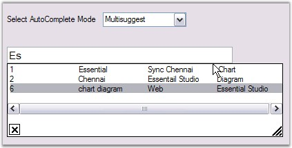
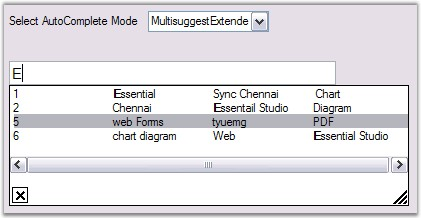

::: {style="DISPLAY: none"}
{#d2h_url_template}{#d2h_package_url style="WIDTH: 0px; DISPLAY: none; HEIGHT: 0px"}
:::

::: {.d2h_secondary_topic style="PADDING-BOTTOM: 10pt; MARGIN: 0pt; PADDING-LEFT: 0pt; PADDING-RIGHT: 0pt; PADDING-TOP: 0pt"}
##### Frequently Asked Questions {#frequently-asked-questions style="tab-stops: 0pt"}

 

This section illustrates the solutions for various task-based queries about the control.

###### 3.3.1.1.5.1 How to add a new data row to the Data table at run time[]{#p183}? {#how-to-add-a-new-data-row-to-the-data-table-at-run-time style="tab-stops: 0pt"}

[]{style="COLOR: #15428b"} 

This is achieved by calling the **SetTableData()** method as follows. This method sets internal table data based on **AutoComplete.DataSource** property.

[]{style="COLOR: #15428b"} 

+-----------------------------------------------------------------------------------------------------------------------------------------------------------------------------------------------------------------------------+
| **[\[C#\]]{style="FONT-FAMILY: 'Courier New'; COLOR: black"}**                                                                                                                                                              |
|                                                                                                                                                                                                                             |
| []{style="COLOR: #15428b"}                                                                                                                                                                                                  |
|                                                                                                                                                                                                                             |
| [DataTable]{style="FONT-FAMILY: 'Courier New'; COLOR: teal"}[ dt;]{style="FONT-FAMILY: 'Courier New'"}                                                                                                                      |
|                                                                                                                                                                                                                             |
| [private]{style="FONT-FAMILY: 'Courier New'; COLOR: blue"}[ [void]{style="COLOR: blue"} Form1_Load([object]{style="COLOR: blue"} sender, System.[EventArgs]{style="COLOR: teal"} e)]{style="FONT-FAMILY: 'Courier New'"}    |
|                                                                                                                                                                                                                             |
| [{]{style="FONT-FAMILY: 'Courier New'"}                                                                                                                                                                                     |
|                                                                                                                                                                                                                             |
| [    dt = [new]{style="COLOR: blue"} [DataTable]{style="COLOR: teal"}([\"select\"]{style="COLOR: maroon"});]{style="FONT-FAMILY: 'Courier New'"}                                                                            |
|                                                                                                                                                                                                                             |
| [    dt.Columns.Add([\"Countries\"]{style="COLOR: maroon"});]{style="FONT-FAMILY: 'Courier New'"}                                                                                                                           |
|                                                                                                                                                                                                                             |
| [    dt.Columns.Add([\"states\"]{style="COLOR: maroon"});]{style="FONT-FAMILY: 'Courier New'"}                                                                                                                              |
|                                                                                                                                                                                                                             |
| [    dt.Rows.Add([new]{style="COLOR: blue"} [object]{style="COLOR: blue"}\[\] { [\"NorthCarolina\"]{style="COLOR: maroon"} });]{style="FONT-FAMILY: 'Courier New'"}                                                         |
|                                                                                                                                                                                                                             |
| [    dt.Rows.Add([new]{style="COLOR: blue"} [object]{style="COLOR: blue"}\[\] { [\"India \"]{style="COLOR: maroon"} });]{style="FONT-FAMILY: 'Courier New'"}                                                                |
|                                                                                                                                                                                                                             |
| [    dt.Rows.Add([new]{style="COLOR: blue"} [object]{style="COLOR: blue"}\[\] { [\"New York \"]{style="COLOR: maroon"} });]{style="FONT-FAMILY: 'Courier New'"}                                                             |
|                                                                                                                                                                                                                             |
| [    dt.Rows.Add([new]{style="COLOR: blue"} [object]{style="COLOR: blue"}\[\] { [\"Washington \"]{style="COLOR: maroon"} });]{style="FONT-FAMILY: 'Courier New'"}                                                           |
|                                                                                                                                                                                                                             |
| [    dt.Rows.Add([new]{style="COLOR: blue"} [object]{style="COLOR: blue"}\[\] { [\"London\"]{style="COLOR: maroon"} });]{style="FONT-FAMILY: 'Courier New'"}                                                                |
|                                                                                                                                                                                                                             |
| [    dt.Rows.Add([new]{style="COLOR: blue"} [object]{style="COLOR: blue"}\[\] { [\"Canada\"]{style="COLOR: maroon"} });]{style="FONT-FAMILY: 'Courier New'"}                                                                |
|                                                                                                                                                                                                                             |
| [    autoComplete1.DataSource = dt;]{style="FONT-FAMILY: 'Courier New'"}                                                                                                                                                    |
|                                                                                                                                                                                                                             |
| [}]{style="FONT-FAMILY: 'Courier New'"}                                                                                                                                                                                     |
|                                                                                                                                                                                                                             |
| []{style="FONT-FAMILY: 'Courier New'"}                                                                                                                                                                                      |
|                                                                                                                                                                                                                             |
| [private]{style="FONT-FAMILY: 'Courier New'; COLOR: blue"}[ [void]{style="COLOR: blue"} button1_Click([object]{style="COLOR: blue"} sender, System.[EventArgs]{style="COLOR: teal"} e)]{style="FONT-FAMILY: 'Courier New'"} |
|                                                                                                                                                                                                                             |
| [{]{style="FONT-FAMILY: 'Courier New'"}                                                                                                                                                                                     |
|                                                                                                                                                                                                                             |
| [    dt.Rows.Add([new]{style="COLOR: blue"} [object]{style="COLOR: blue"}\[\] { [\"new1\"]{style="COLOR: maroon"} });]{style="FONT-FAMILY: 'Courier New'"}                                                                  |
|                                                                                                                                                                                                                             |
| [    dt.Rows.Add([new]{style="COLOR: blue"} [object]{style="COLOR: blue"}\[\] { [\"new2\"]{style="COLOR: maroon"} });]{style="FONT-FAMILY: 'Courier New'"}                                                                  |
|                                                                                                                                                                                                                             |
| []{style="FONT-FAMILY: 'Courier New'"}                                                                                                                                                                                      |
|                                                                                                                                                                                                                             |
| [   [//sets the internal table data based on the AutoComplete.DataSource property. ]{style="COLOR: green"}]{style="FONT-FAMILY: 'Courier New'"}                                                                             |
|                                                                                                                                                                                                                             |
| [    [this]{style="COLOR: blue"}.autoComplete1.SetTableData();]{style="FONT-FAMILY: 'Courier New'"}                                                                                                                         |
|                                                                                                                                                                                                                             |
| [}]{style="FONT-FAMILY: 'Courier New'"}                                                                                                                                                                                     |
+-----------------------------------------------------------------------------------------------------------------------------------------------------------------------------------------------------------------------------+

[]{style="COLOR: #15428b"} 

+-------------------------------------------------------------------------------------------------------------------------------------------------------------------------------------------------------------------------------------------------------------------------------------------------------------------+
| **[\[VB.NET\]]{style="FONT-FAMILY: 'Courier New'; COLOR: black"}**                                                                                                                                                                                                                                                |
|                                                                                                                                                                                                                                                                                                                   |
| []{style="COLOR: black"}                                                                                                                                                                                                                                                                                          |
|                                                                                                                                                                                                                                                                                                                   |
| [Private]{style="FONT-FAMILY: 'Courier New'; COLOR: blue"}[ dt [As]{style="COLOR: blue"} DataTable]{style="FONT-FAMILY: 'Courier New'"}                                                                                                                                                                           |
|                                                                                                                                                                                                                                                                                                                   |
| []{style="FONT-FAMILY: 'Courier New'"}                                                                                                                                                                                                                                                                            |
|                                                                                                                                                                                                                                                                                                                   |
| [Private]{style="FONT-FAMILY: 'Courier New'; COLOR: blue"}[ [Sub]{style="COLOR: blue"} Form1_Load([ByVal]{style="COLOR: blue"} sender [As]{style="COLOR: blue"} [Object]{style="COLOR: blue"}, [ByVal]{style="COLOR: blue"} e [As]{style="COLOR: blue"} System.EventArgs)]{style="FONT-FAMILY: 'Courier New'"}    |
|                                                                                                                                                                                                                                                                                                                   |
| [    dt = [New]{style="COLOR: blue"} DataTable([\"select\"]{style="COLOR: maroon"})]{style="FONT-FAMILY: 'Courier New'"}                                                                                                                                                                                          |
|                                                                                                                                                                                                                                                                                                                   |
| [    dt.Columns.Add([\"Countries\"]{style="COLOR: maroon"})]{style="FONT-FAMILY: 'Courier New'"}                                                                                                                                                                                                                  |
|                                                                                                                                                                                                                                                                                                                   |
| [    dt.Columns.Add([\"states\"]{style="COLOR: maroon"})]{style="FONT-FAMILY: 'Courier New'"}                                                                                                                                                                                                                     |
|                                                                                                                                                                                                                                                                                                                   |
| [    dt.Rows.Add([New]{style="COLOR: blue"} [Object]{style="COLOR: blue"}() {[\"NorthCarolina\"]{style="COLOR: maroon"}})]{style="FONT-FAMILY: 'Courier New'"}                                                                                                                                                    |
|                                                                                                                                                                                                                                                                                                                   |
| [    dt.Rows.Add([New]{style="COLOR: blue"} [Object]{style="COLOR: blue"}() {[\"India \"]{style="COLOR: maroon"}})]{style="FONT-FAMILY: 'Courier New'"}                                                                                                                                                           |
|                                                                                                                                                                                                                                                                                                                   |
| [    dt.Rows.Add([New]{style="COLOR: blue"} [Object]{style="COLOR: blue"}() {[\"New York \"]{style="COLOR: maroon"}})]{style="FONT-FAMILY: 'Courier New'"}                                                                                                                                                        |
|                                                                                                                                                                                                                                                                                                                   |
| [    dt.Rows.Add([New]{style="COLOR: blue"} [Object]{style="COLOR: blue"}() {[\"Washington \"]{style="COLOR: maroon"}})]{style="FONT-FAMILY: 'Courier New'"}                                                                                                                                                      |
|                                                                                                                                                                                                                                                                                                                   |
| [    dt.Rows.Add([New]{style="COLOR: blue"} [Object]{style="COLOR: blue"}() {[\"London\"]{style="COLOR: maroon"}})]{style="FONT-FAMILY: 'Courier New'"}                                                                                                                                                           |
|                                                                                                                                                                                                                                                                                                                   |
| [    dt.Rows.Add([New]{style="COLOR: blue"} [Object]{style="COLOR: blue"}() {[\"Canada\"]{style="COLOR: maroon"}})]{style="FONT-FAMILY: 'Courier New'"}                                                                                                                                                           |
|                                                                                                                                                                                                                                                                                                                   |
| [    autoComplete1.DataSource = dt]{style="FONT-FAMILY: 'Courier New'"}                                                                                                                                                                                                                                           |
|                                                                                                                                                                                                                                                                                                                   |
| [End]{style="FONT-FAMILY: 'Courier New'; COLOR: blue"}[ [Sub]{style="COLOR: blue"}]{style="FONT-FAMILY: 'Courier New'"}                                                                                                                                                                                           |
|                                                                                                                                                                                                                                                                                                                   |
| []{style="FONT-FAMILY: 'Courier New'; COLOR: blue"}                                                                                                                                                                                                                                                               |
|                                                                                                                                                                                                                                                                                                                   |
| [Private]{style="FONT-FAMILY: 'Courier New'; COLOR: blue"}[ [Sub]{style="COLOR: blue"} button1_Click([ByVal]{style="COLOR: blue"} sender [As]{style="COLOR: blue"} [Object]{style="COLOR: blue"}, [ByVal]{style="COLOR: blue"} e [As]{style="COLOR: blue"} System.EventArgs)]{style="FONT-FAMILY: 'Courier New'"} |
|                                                                                                                                                                                                                                                                                                                   |
| [    dt.Rows.Add([New]{style="COLOR: blue"} [Object]{style="COLOR: blue"}() {[\"new1\"]{style="COLOR: maroon"}})]{style="FONT-FAMILY: 'Courier New'"}                                                                                                                                                             |
|                                                                                                                                                                                                                                                                                                                   |
| [    dt.Rows.Add([New]{style="COLOR: blue"} [Object]{style="COLOR: blue"}() {[\"new2\"]{style="COLOR: maroon"}})]{style="FONT-FAMILY: 'Courier New'"}                                                                                                                                                             |
|                                                                                                                                                                                                                                                                                                                   |
| [    [Me]{style="COLOR: blue"}.autoComplete1.SetTableData()]{style="FONT-FAMILY: 'Courier New'"}                                                                                                                                                                                                                  |
|                                                                                                                                                                                                                                                                                                                   |
| [End]{style="FONT-FAMILY: 'Courier New'; COLOR: blue"}[ [Sub]{style="COLOR: blue"}]{style="FONT-FAMILY: 'Courier New'"}                                                                                                                                                                                           |
+-------------------------------------------------------------------------------------------------------------------------------------------------------------------------------------------------------------------------------------------------------------------------------------------------------------------+

###### []{#p184}3.3.1.1.5.2 How to Programmatically display the autocomplete popup when a text box is enabled with autocomplete feature? {#how-to-programmatically-display-the-autocomplete-popup-when-a-text-box-is-enabled-with-autocomplete-feature style="tab-stops: 0pt"}

[]{style="COLOR: #15428b"} 

You can show the autocomplete popup programmatically using the following code.

[]{style="COLOR: #15428b"} 

+-------------------------------------------------------------------------------------------------------------------------------------------------------------------------------------+
| **[\[C#\]]{style="FONT-FAMILY: 'Courier New'; COLOR: black"}**                                                                                                                      |
|                                                                                                                                                                                     |
| []{style="FONT-FAMILY: 'Courier New'"}                                                                                                                                              |
|                                                                                                                                                                                     |
| [this]{style="FONT-FAMILY: 'Courier New'; COLOR: blue"}[.autoComplete1.AutoCompletePopup.ParentControl = [this]{style="COLOR: blue"}.textBox1;]{style="FONT-FAMILY: 'Courier New'"} |
|                                                                                                                                                                                     |
| [this]{style="FONT-FAMILY: 'Courier New'; COLOR: blue"}[.autoComplete1.AutoCompletePopup.ShowPopup([Point]{style="COLOR: #2b91af"}.Empty);]{style="FONT-FAMILY: 'Courier New'"}     |
+-------------------------------------------------------------------------------------------------------------------------------------------------------------------------------------+

[]{style="COLOR: #15428b"} 

+--------------------------------------------------------------------------------------------------------------------------------------------------------------------------------+
| **[\[VB.NET\]]{style="FONT-FAMILY: 'Courier New'; COLOR: black"}**                                                                                                             |
|                                                                                                                                                                                |
| []{style="COLOR: black"}                                                                                                                                                       |
|                                                                                                                                                                                |
| [Me]{style="FONT-FAMILY: 'Courier New'; COLOR: blue"}[.autoComplete1.AutoCompletePopup.ParentControl = [Me]{style="COLOR: blue"}.textBox1]{style="FONT-FAMILY: 'Courier New'"} |
|                                                                                                                                                                                |
| [Me]{style="FONT-FAMILY: 'Courier New'; COLOR: blue"}[.autoComplete1.AutoCompletePopup.ShowPopup(Point.Empty)]{style="FONT-FAMILY: 'Courier New'"}                             |
+--------------------------------------------------------------------------------------------------------------------------------------------------------------------------------+

 

[]{#p185} 

###### 3.3.1.1.5.3 How to remove default selection from autocomplete drop-down? {#how-to-remove-default-selection-from-autocomplete-drop-down style="tab-stops: 0pt"}

[]{style="COLOR: #15428b"} 

To remove the default selection in autocomplete drop-down, set SelectedIndex property to ***-1*** inside **DropdownDisplayed** event of the autocomplete control as follows.

[]{style="COLOR: #15428b"} 

+-------------------------------------------------------------------------------------------------------------------------------------------------------------------------------------------------------------------------------------------+
| **[\[C#\]]{style="FONT-FAMILY: 'Courier New'; COLOR: black"}**                                                                                                                                                                            |
|                                                                                                                                                                                                                                           |
| []{style="FONT-FAMILY: 'Courier New'"}                                                                                                                                                                                                    |
|                                                                                                                                                                                                                                           |
| [private]{style="FONT-FAMILY: 'Courier New'; COLOR: blue"}[ [void]{style="COLOR: blue"} autoComplete1_DropDownDisplayed([object]{style="COLOR: blue"} sender, [EventArgs]{style="COLOR: #2b91af"} e)]{style="FONT-FAMILY: 'Courier New'"} |
|                                                                                                                                                                                                                                           |
| [{]{style="FONT-FAMILY: 'Courier New'"}                                                                                                                                                                                                   |
|                                                                                                                                                                                                                                           |
| [    [this]{style="COLOR: blue"}.autoComplete1.SelectedIndex = -1;]{style="FONT-FAMILY: 'Courier New'"}                                                                                                                                   |
|                                                                                                                                                                                                                                           |
| [}]{style="FONT-FAMILY: 'Courier New'"}                                                                                                                                                                                                   |
+-------------------------------------------------------------------------------------------------------------------------------------------------------------------------------------------------------------------------------------------+

[]{style="COLOR: #15428b"} 

+------------------------------------------------------------------------------------------------------------------------------------------------------------------------------------------------------------------------------------------------------------------------------------------------------------------------------+
| **[\[VB.NET\]]{style="FONT-FAMILY: 'Courier New'; COLOR: black"}**                                                                                                                                                                                                                                                           |
|                                                                                                                                                                                                                                                                                                                              |
| []{style="COLOR: black"}                                                                                                                                                                                                                                                                                                     |
|                                                                                                                                                                                                                                                                                                                              |
| [Private]{style="FONT-FAMILY: 'Courier New'; COLOR: blue"}[ [Sub]{style="COLOR: blue"} autoComplete1_DropDownDisplayed([ByVal]{style="COLOR: blue"} sender [As]{style="COLOR: blue"} [Object]{style="COLOR: blue"}, [ByVal]{style="COLOR: blue"} e [As]{style="COLOR: blue"} EventArgs)]{style="FONT-FAMILY: 'Courier New'"} |
|                                                                                                                                                                                                                                                                                                                              |
| [    [Me]{style="COLOR: blue"}.autoComplete1.SelectedIndex = -1]{style="FONT-FAMILY: 'Courier New'"}                                                                                                                                                                                                                         |
|                                                                                                                                                                                                                                                                                                                              |
| [End]{style="FONT-FAMILY: 'Courier New'; COLOR: blue"}[ [Sub]{style="COLOR: blue"}]{style="FONT-FAMILY: 'Courier New'"}                                                                                                                                                                                                      |
+------------------------------------------------------------------------------------------------------------------------------------------------------------------------------------------------------------------------------------------------------------------------------------------------------------------------------+

###### []{#_How_to_delete}3.3.1.1.5.4 How to delete the items in the list at run time[]{#p186}? {#how-to-delete-the-items-in-the-list-at-run-time style="tab-stops: 0pt"}

[]{style="COLOR: #15428b"} 

You can delete items in the list at run time by pressing the Delete Key, by enabling **AllowListDelete** property.

[]{style="COLOR: #15428b"} 

+------------------------------------------------------------------------------------------------------------------------------------------------------------+
| **[\[C#\]]{style="FONT-FAMILY: 'Courier New'; COLOR: black"}**                                                                                             |
|                                                                                                                                                            |
| []{style="COLOR: #15428b"}                                                                                                                                 |
|                                                                                                                                                            |
| [this]{style="FONT-FAMILY: 'Courier New'; COLOR: blue"}[.autoComplete1.AllowListDelete = [true]{style="COLOR: blue"};]{style="FONT-FAMILY: 'Courier New'"} |
+------------------------------------------------------------------------------------------------------------------------------------------------------------+

[]{style="COLOR: #15428b"} 

+---------------------------------------------------------------------------------------------------------------------------------------------------------+
| **[\[VB.NET\]]{style="FONT-FAMILY: 'Courier New'; COLOR: black"}**                                                                                      |
|                                                                                                                                                         |
| []{style="COLOR: #15428b"}                                                                                                                              |
|                                                                                                                                                         |
| [Me]{style="FONT-FAMILY: 'Courier New'; COLOR: blue"}[.autoComplete1.AllowListDelete = [True]{style="COLOR: blue"}]{style="FONT-FAMILY: 'Courier New'"} |
+---------------------------------------------------------------------------------------------------------------------------------------------------------+

###### []{#p187}3.3.1.1.5.5 How to delete the history items persisted by an AutoComplete control? {#how-to-delete-the-history-items-persisted-by-an-autocomplete-control style="tab-stops: 0pt"}

 

We can delete the history items persisted by an AutoCompleteControl by calling **AutoComplete.ResetHistory()** method.

[]{style="COLOR: #15428b"} 

+-----------------------------------------------------------------------------------------------------------------------------+
| **[\[C#\]]{style="FONT-FAMILY: 'Courier New'; COLOR: black"}**                                                              |
|                                                                                                                             |
| []{style="COLOR: #15428b"}                                                                                                  |
|                                                                                                                             |
| [this]{style="FONT-FAMILY: 'Courier New'; COLOR: blue"}[.autoComplete1.ResetHistory();]{style="FONT-FAMILY: 'Courier New'"} |
+-----------------------------------------------------------------------------------------------------------------------------+

[]{style="COLOR: #15428b"} 

+--------------------------------------------------------------------------------------------------------------------------+
| **[\[VB.NET\]]{style="FONT-FAMILY: 'Courier New'; COLOR: black"}**                                                       |
|                                                                                                                          |
| []{style="COLOR: #15428b"}                                                                                               |
|                                                                                                                          |
| [Me]{style="FONT-FAMILY: 'Courier New'; COLOR: blue"}[.autoComplete1.ResetHistory()]{style="FONT-FAMILY: 'Courier New'"} |
+--------------------------------------------------------------------------------------------------------------------------+

###### 3.3.1.1.5.6 How to implement an AutoComplete Control in an User Control[]{#p188}? {#how-to-implement-an-autocomplete-control-in-an-user-control style="tab-stops: 0pt"}

[]{style="COLOR: #15428b"} 

AutoComplete control can be used in an UserControl by setting the parent form of the User Control to the parent form property of the AutoComplete Control.

[]{style="COLOR: #15428b"} 

+-----------------------------------------------------------------------------------------------------------------------------------------------------------------------------------------------------------+
| **[\[C#\]]{style="FONT-FAMILY: 'Courier New'; COLOR: black"}**                                                                                                                                            |
|                                                                                                                                                                                                           |
| []{style="COLOR: black"}                                                                                                                                                                                  |
|                                                                                                                                                                                                           |
| [private]{style="FONT-FAMILY: 'Courier New'; COLOR: blue"}[ [void]{style="COLOR: blue"} UserControl1_Load([object]{style="COLOR: blue"} sender, System.EventArgs e) ]{style="FONT-FAMILY: 'Courier New'"} |
|                                                                                                                                                                                                           |
| [{  ]{style="FONT-FAMILY: 'Courier New'"}                                                                                                                                                                 |
|                                                                                                                                                                                                           |
| [this]{style="FONT-FAMILY: 'Courier New'; COLOR: blue"}[.autoComplete1.ParentForm = [this]{style="COLOR: blue"}.ParentForm;  ]{style="FONT-FAMILY: 'Courier New'"}                                        |
|                                                                                                                                                                                                           |
| [this]{style="FONT-FAMILY: 'Courier New'; COLOR: blue"}[.autoComplete1.DataSource = [this]{style="COLOR: blue"}.items; ]{style="FONT-FAMILY: 'Courier New'"}                                              |
|                                                                                                                                                                                                           |
| [} ]{style="FONT-FAMILY: 'Courier New'"}                                                                                                                                                                  |
+-----------------------------------------------------------------------------------------------------------------------------------------------------------------------------------------------------------+

[]{style="COLOR: #15428b"} 

+-----------------------------------------------------------------------------------------------------------------------------------------------------------------------------------------------------------------------------------------------------------------------------------------------------------------------+
| **[\[VB.NET\]]{style="FONT-FAMILY: 'Courier New'; COLOR: black"}**                                                                                                                                                                                                                                                    |
|                                                                                                                                                                                                                                                                                                                       |
| []{style="COLOR: #15428b"}                                                                                                                                                                                                                                                                                            |
|                                                                                                                                                                                                                                                                                                                       |
| [Private]{style="FONT-FAMILY: 'Courier New'; COLOR: blue"}[ [Sub]{style="COLOR: blue"} UserControl1_Load([ByVal]{style="COLOR: blue"} sender [As]{style="COLOR: blue"} [Object]{style="COLOR: blue"}, [ByVal]{style="COLOR: blue"} e [As]{style="COLOR: blue"} System.EventArgs)]{style="FONT-FAMILY: 'Courier New'"} |
|                                                                                                                                                                                                                                                                                                                       |
| [    [Me]{style="COLOR: blue"}.autoComplete1.ParentForm = [Me]{style="COLOR: blue"}.ParentForm]{style="FONT-FAMILY: 'Courier New'"}                                                                                                                                                                                   |
|                                                                                                                                                                                                                                                                                                                       |
| [    [Me]{style="COLOR: blue"}.autoComplete1.DataSource = [Me]{style="COLOR: blue"}.items]{style="FONT-FAMILY: 'Courier New'"}                                                                                                                                                                                        |
|                                                                                                                                                                                                                                                                                                                       |
| [End]{style="FONT-FAMILY: 'Courier New'; COLOR: blue"}[ [Sub]{style="COLOR: blue"}]{style="FONT-FAMILY: 'Courier New'"}                                                                                                                                                                                               |
+-----------------------------------------------------------------------------------------------------------------------------------------------------------------------------------------------------------------------------------------------------------------------------------------------------------------------+

###### []{#p189}3.3.1.1.5.7 How to implement AutoComplete with RichTextBox control? {#how-to-implement-autocomplete-with-richtextbox-control style="tab-stops: 0pt"}

 

Follow the below steps to implement AutoComplete feature with RichTextBox control.

[]{style="COLOR: #15428b"} 

1.   Implement the IEditControlsEmbed interface in a RichTextBox class which, will enable the AutoComplete functionality for the RichTextBox control.

[]{style="COLOR: #15428b"} 

+-----------------------------------------------------------------------------------------------------------------------------------------------------------------------------------------------------------------------------------------------------------------------------------------------------------+
| **[\[C#\]]{style="FONT-FAMILY: 'Courier New'; COLOR: black"}**                                                                                                                                                                                                                                            |
|                                                                                                                                                                                                                                                                                                           |
| []{style="COLOR: #15428b"}                                                                                                                                                                                                                                                                                |
|                                                                                                                                                                                                                                                                                                           |
| [public class]{style="FONT-FAMILY: 'Courier New'; COLOR: blue"}[ MyRichTextBox : System.Windows.Forms.RichTextBox, IEditControlsEmbed]{style="FONT-FAMILY: 'Courier New'; COLOR: black"}                                                                                                                  |
|                                                                                                                                                                                                                                                                                                           |
| [{]{style="FONT-FAMILY: 'Courier New'; COLOR: black"}                                                                                                                                                                                                                                                     |
|                                                                                                                                                                                                                                                                                                           |
| [      ]{style="FONT-FAMILY: 'Courier New'; COLOR: black"}[// Returns the active RichTextBox control.]{style="FONT-FAMILY: 'Courier New'; COLOR: green"}                                                                                                                                                  |
|                                                                                                                                                                                                                                                                                                           |
| [     ]{style="FONT-FAMILY: 'Courier New'; COLOR: black"}[  public]{style="FONT-FAMILY: 'Courier New'; COLOR: blue"}[ Control GetActiveEditControl(IEditControlsEmbedListener listener)]{style="FONT-FAMILY: 'Courier New'; COLOR: black"}                                                                |
|                                                                                                                                                                                                                                                                                                           |
| [       {]{style="FONT-FAMILY: 'Courier New'; COLOR: black"}                                                                                                                                                                                                                                              |
|                                                                                                                                                                                                                                                                                                           |
| [                  ]{style="FONT-FAMILY: 'Courier New'; COLOR: black"}[return]{style="FONT-FAMILY: 'Courier New'; COLOR: blue"}[ (Control)]{style="FONT-FAMILY: 'Courier New'; COLOR: black"}[this]{style="FONT-FAMILY: 'Courier New'; COLOR: blue"}[;]{style="FONT-FAMILY: 'Courier New'; COLOR: black"} |
|                                                                                                                                                                                                                                                                                                           |
| [       }]{style="FONT-FAMILY: 'Courier New'; COLOR: black"}                                                                                                                                                                                                                                              |
|                                                                                                                                                                                                                                                                                                           |
| [                ]{style="FONT-FAMILY: 'Courier New'; COLOR: black"}                                                                                                                                                                                                                                      |
|                                                                                                                                                                                                                                                                                                           |
| [}]{style="FONT-FAMILY: 'Courier New'; COLOR: black"}                                                                                                                                                                                                                                                     |
+-----------------------------------------------------------------------------------------------------------------------------------------------------------------------------------------------------------------------------------------------------------------------------------------------------------+

[]{style="COLOR: #15428b"} 

+------------------------------------------------------------------------------------------------------------------------------------------------------------------------------------------------------------------------------------------------------------------+
| **[\[VB.NET\]]{style="FONT-FAMILY: 'Courier New'; COLOR: black"}**                                                                                                                                                                                               |
|                                                                                                                                                                                                                                                                  |
| []{style="COLOR: #15428b"}                                                                                                                                                                                                                                       |
|                                                                                                                                                                                                                                                                  |
| [Public]{style="FONT-FAMILY: 'Courier New'; COLOR: blue"}[ [Class]{style="COLOR: blue"} MyRichTextBox [Inherits]{style="COLOR: blue"} System.Windows.Forms.RichTextBox [Implements]{style="COLOR: blue"} IEditControlsEmbed]{style="FONT-FAMILY: 'Courier New'"} |
|                                                                                                                                                                                                                                                                  |
| []{style="FONT-FAMILY: 'Courier New'"}                                                                                                                                                                                                                           |
|                                                                                                                                                                                                                                                                  |
| [    [\' Returns the active RichTextBox control.]{style="COLOR: green"}]{style="FONT-FAMILY: 'Courier New'"}                                                                                                                                                     |
|                                                                                                                                                                                                                                                                  |
| []{style="FONT-FAMILY: 'Courier New'; COLOR: green"}                                                                                                                                                                                                             |
|                                                                                                                                                                                                                                                                  |
| [    [Public]{style="COLOR: blue"} [Function]{style="COLOR: blue"} GetActiveEditControl([ByVal]{style="COLOR: blue"} listener [As]{style="COLOR: blue"} IEditControlsEmbedListener) [As]{style="COLOR: blue"} Control]{style="FONT-FAMILY: 'Courier New'"}       |
|                                                                                                                                                                                                                                                                  |
| []{style="FONT-FAMILY: 'Courier New'"}                                                                                                                                                                                                                           |
|                                                                                                                                                                                                                                                                  |
| [        [Return]{style="COLOR: blue"} [CType]{style="COLOR: blue"}([Me]{style="COLOR: blue"}, Control)]{style="FONT-FAMILY: 'Courier New'"}                                                                                                                     |
|                                                                                                                                                                                                                                                                  |
| []{style="FONT-FAMILY: 'Courier New'"}                                                                                                                                                                                                                           |
|                                                                                                                                                                                                                                                                  |
| [    [End]{style="COLOR: blue"} [Function]{style="COLOR: blue"}]{style="FONT-FAMILY: 'Courier New'"}                                                                                                                                                             |
|                                                                                                                                                                                                                                                                  |
| []{style="FONT-FAMILY: 'Courier New'; COLOR: blue"}                                                                                                                                                                                                              |
|                                                                                                                                                                                                                                                                  |
| [End]{style="FONT-FAMILY: 'Courier New'; COLOR: blue"}[ [Class]{style="COLOR: blue"}]{style="FONT-FAMILY: 'Courier New'"}                                                                                                                                        |
+------------------------------------------------------------------------------------------------------------------------------------------------------------------------------------------------------------------------------------------------------------------+

[]{style="COLOR: #15428b"} 

2.   Drag and drop the RichTextBox control and the AutoComplete control to a form.

[]{style="COLOR: #15428b"} 

+---------------------------------------------------------------------------------------------------------------------------------------------------------------------------------------------------------------------------------------------------------------------------+
| **[\[C#\]]{style="FONT-FAMILY: 'Courier New'; COLOR: black"}**                                                                                                                                                                                                            |
|                                                                                                                                                                                                                                                                           |
| []{style="COLOR: #15428b"}                                                                                                                                                                                                                                                |
|                                                                                                                                                                                                                                                                           |
| [// Initialization]{style="FONT-FAMILY: 'Courier New'; COLOR: green"}                                                                                                                                                                                                     |
|                                                                                                                                                                                                                                                                           |
| [Syncfusion.Windows.Forms.Tools.AutoComplete autoComplete1= ]{style="FONT-FAMILY: 'Courier New'; COLOR: black"}[new]{style="FONT-FAMILY: 'Courier New'; COLOR: blue"}[ Syncfusion.Windows.Forms.Tools.AutoComplete();;]{style="FONT-FAMILY: 'Courier New'; COLOR: black"} |
|                                                                                                                                                                                                                                                                           |
| [MyRichTextBox richTextBox1= ]{style="FONT-FAMILY: 'Courier New'; COLOR: black"}[new]{style="FONT-FAMILY: 'Courier New'; COLOR: blue"}[ MyRichTextBox();]{style="FONT-FAMILY: 'Courier New'; COLOR: black"}                                                               |
+---------------------------------------------------------------------------------------------------------------------------------------------------------------------------------------------------------------------------------------------------------------------------+

[]{style="COLOR: #15428b"} 

+-------------------------------------------------------------------------------------------------------------------------------------------------------------------------------------------------------------------------------------------------------------------------------------------------------------------------------------------------------------------------------------------------------------------------------+
| **[\[VB.NET\]]{style="FONT-FAMILY: 'Courier New'; COLOR: black"}**                                                                                                                                                                                                                                                                                                                                                            |
|                                                                                                                                                                                                                                                                                                                                                                                                                               |
| []{style="COLOR: #15428b"}                                                                                                                                                                                                                                                                                                                                                                                                    |
|                                                                                                                                                                                                                                                                                                                                                                                                                               |
| [\' Initialization]{style="FONT-FAMILY: 'Courier New'; COLOR: green"}                                                                                                                                                                                                                                                                                                                                                         |
|                                                                                                                                                                                                                                                                                                                                                                                                                               |
| [Dim]{style="FONT-FAMILY: 'Courier New'; COLOR: blue"}[ autoComplete1 ]{style="FONT-FAMILY: 'Courier New'; COLOR: black"}[As]{style="FONT-FAMILY: 'Courier New'; COLOR: blue"}[ Syncfusion.Windows.Forms.Tools.AutoComplete = ]{style="FONT-FAMILY: 'Courier New'; COLOR: black"}[New]{style="FONT-FAMILY: 'Courier New'; COLOR: blue"}[ Syncfusion.Windows.Forms.Tools.AutoComplete\                                         |
| ]{style="FONT-FAMILY: 'Courier New'; COLOR: black"}[Dim]{style="FONT-FAMILY: 'Courier New'; COLOR: blue"}[ richTextBox1 ]{style="FONT-FAMILY: 'Courier New'; COLOR: black"}[As]{style="FONT-FAMILY: 'Courier New'; COLOR: blue"}[ MyRichTextBox = ]{style="FONT-FAMILY: 'Courier New'; COLOR: black"}[New]{style="FONT-FAMILY: 'Courier New'; COLOR: blue"}[ MyRichTextBox]{style="FONT-FAMILY: 'Courier New'; COLOR: black"} |
+-------------------------------------------------------------------------------------------------------------------------------------------------------------------------------------------------------------------------------------------------------------------------------------------------------------------------------------------------------------------------------------------------------------------------------+

[]{style="COLOR: #15428b"} 

3.   The AutoComplete control can take an external data source (any data source that implements IList or IListSource) for its history list. Here we have set a StringCollection as the DataSource.

4.   When this property is set, the AutoComplete control will initialize itself with the data source and use that as the basis for its matching routines. For example, if you have a DataSet with a list of names of the States in the US and if you specify that as the DataSource, then the AutoComplete control will display all the matches from within these names when the user types in the target edit control.

[]{style="COLOR: #15428b"} 

+-------------------------------------------------------------------------------------------------------------------------------------------------------------------------------------------------------------+
| **[\[C#\]]{style="FONT-FAMILY: 'Courier New'; COLOR: black"}**                                                                                                                                              |
|                                                                                                                                                                                                             |
| []{style="COLOR: #15428b"}                                                                                                                                                                                  |
|                                                                                                                                                                                                             |
| [// Sets the DataSource.]{style="FONT-FAMILY: 'Courier New'; COLOR: green"}                                                                                                                                 |
|                                                                                                                                                                                                             |
| [StringCollection liste = ]{style="FONT-FAMILY: 'Courier New'; COLOR: black"}[new]{style="FONT-FAMILY: 'Courier New'; COLOR: blue"}[ StringCollection();]{style="FONT-FAMILY: 'Courier New'; COLOR: black"} |
|                                                                                                                                                                                                             |
| [    liste.Add(\"New Jersey\");]{style="FONT-FAMILY: 'Courier New'; COLOR: black"}                                                                                                                          |
|                                                                                                                                                                                                             |
| [    liste.Add(\"North Carolina\");]{style="FONT-FAMILY: 'Courier New'; COLOR: black"}                                                                                                                      |
|                                                                                                                                                                                                             |
| [    liste.Add(\"North Dakota\");]{style="FONT-FAMILY: 'Courier New'; COLOR: black"}                                                                                                                        |
|                                                                                                                                                                                                             |
| [    liste.Add(\"New York\");]{style="FONT-FAMILY: 'Courier New'; COLOR: black"}                                                                                                                            |
|                                                                                                                                                                                                             |
| [    liste.Add(\"New Mexico\");]{style="FONT-FAMILY: 'Courier New'; COLOR: black"}                                                                                                                          |
|                                                                                                                                                                                                             |
| [    autoComplete1.DataSource = liste;]{style="FONT-FAMILY: 'Courier New'; COLOR: black"}                                                                                                                   |
+-------------------------------------------------------------------------------------------------------------------------------------------------------------------------------------------------------------+

[]{style="COLOR: #15428b"} 

+-------------------------------------------------------------------------------------------------------------------------------------------------------------------------------------------------------------------------------------------------------------------------------------------------------------------------+
| **[\[VB.NET\]]{style="FONT-FAMILY: 'Courier New'; COLOR: black"}**                                                                                                                                                                                                                                                      |
|                                                                                                                                                                                                                                                                                                                         |
| []{style="COLOR: #15428b"}                                                                                                                                                                                                                                                                                              |
|                                                                                                                                                                                                                                                                                                                         |
| [\' Sets the DataSource. ]{style="FONT-FAMILY: 'Courier New'; COLOR: green"}                                                                                                                                                                                                                                            |
|                                                                                                                                                                                                                                                                                                                         |
| [Dim]{style="FONT-FAMILY: 'Courier New'; COLOR: blue"}[ liste ]{style="FONT-FAMILY: 'Courier New'; COLOR: black"}[As]{style="FONT-FAMILY: 'Courier New'; COLOR: blue"}[ StringCollection = ]{style="FONT-FAMILY: 'Courier New'; COLOR: black"}[New]{style="FONT-FAMILY: 'Courier New'; COLOR: blue"}[ StringCollection\ |
|         liste.Add(\"New Jersey\")\                                                                                                                                                                                                                                                                                      |
|         liste.Add(\"North Carolina\")\                                                                                                                                                                                                                                                                                  |
|         liste.Add(\"North Dakota\")\                                                                                                                                                                                                                                                                                    |
|         liste.Add(\"New York\")\                                                                                                                                                                                                                                                                                        |
|         liste.Add(\"New Mexico\")\                                                                                                                                                                                                                                                                                      |
|         autoComplete1.DataSource = liste]{style="FONT-FAMILY: 'Courier New'; COLOR: black"}                                                                                                                                                                                                                             |
+-------------------------------------------------------------------------------------------------------------------------------------------------------------------------------------------------------------------------------------------------------------------------------------------------------------------------+

[]{style="COLOR: #15428b"} 

5.   Set the AutoCompleteonautoComplete1 property in the properties page to either AutoSuggest, AutoAppend or Both.

6.   SetAutoComplete is the extended property for the AutoComplete property which, will be called by the framework when the AutoComplete property is set on any control. When using the AutoComplete control programmatically, you need to use this method to add and remove auto completion for the RichTextBox control.

[]{style="COLOR: #15428b"} 

+-----------------------------------------------------------------------------------------------------------------------------------------------------------------------------------------------------------------------------------------------------------------------------------------------------------------------------------+
| **[\[C#\]]{style="FONT-FAMILY: 'Courier New'; COLOR: black"}**                                                                                                                                                                                                                                                                    |
|                                                                                                                                                                                                                                                                                                                                   |
| []{style="COLOR: #15428b"}                                                                                                                                                                                                                                                                                                        |
|                                                                                                                                                                                                                                                                                                                                   |
| [this]{style="FONT-FAMILY: 'Courier New'; COLOR: blue"}[.autoComplete1.SetAutoComplete(]{style="FONT-FAMILY: 'Courier New'; COLOR: black"}[this]{style="FONT-FAMILY: 'Courier New'; COLOR: blue"}[.richTextBox1,Syncfusion.Windows.Forms.Tools.AutoCompleteModes.AutoSuggest);]{style="FONT-FAMILY: 'Courier New'; COLOR: black"} |
+-----------------------------------------------------------------------------------------------------------------------------------------------------------------------------------------------------------------------------------------------------------------------------------------------------------------------------------+

[]{style="COLOR: #15428b"} 

+------------------------------------------------------------------------------------------------------------------------------------------------------------------------------------------------------------------------------------------------------------------------------------------------------------------------------+
| **[\[VB.NET\]]{style="FONT-FAMILY: 'Courier New'; COLOR: black"}**                                                                                                                                                                                                                                                           |
|                                                                                                                                                                                                                                                                                                                              |
| []{style="COLOR: #15428b"}                                                                                                                                                                                                                                                                                                   |
|                                                                                                                                                                                                                                                                                                                              |
| [Me]{style="FONT-FAMILY: 'Courier New'; COLOR: blue"}[.autoComplete1.SetAutoComplete(]{style="FONT-FAMILY: 'Courier New'; COLOR: black"}[Me]{style="FONT-FAMILY: 'Courier New'; COLOR: blue"}[.richTextBox1,Syncfusion.Windows.Forms.Tools.AutoCompleteModes.AutoSuggest)]{style="FONT-FAMILY: 'Courier New'; COLOR: black"} |
+------------------------------------------------------------------------------------------------------------------------------------------------------------------------------------------------------------------------------------------------------------------------------------------------------------------------------+

[]{style="COLOR: #15428b"} 

7.   The RichTextBox will be enabled with the AutoComplete functionality.

 

###### []{#p190}[]{#_How_to_match}3.3.1.1.5.8 How to match items in all the columns using AutoCompleteControl {#how-to-match-items-in-all-the-columns-using-autocompletecontrol style="tab-stops: 0pt"}

[]{style="COLOR: #15428b"} 

Matching items in multiple columns is possible using the AutoComplete control. We need to set the **AutoCompleteModes** to MultiSuggest or MultiExtended mode for this.

 

**MultiSuggest** - Possible matches from Multiple columns for the current content of the Active edit control, will be presented in a form of a popup window with a selectable list of matches. MultiSuggest mode is an extended mode of AutoSuggest. On selecting this mode, user  will be able to get the matching items in the active edit control from all the columns.

[]{style="COLOR: #15428b"} 

+---------------------------------------------------------------------------------------------------------------------------------------------------------------------------------------------------------------------------------------+
| **[\[C#\]]{style="FONT-FAMILY: 'Courier New'; COLOR: black"}**                                                                                                                                                                        |
|                                                                                                                                                                                                                                       |
| []{style="COLOR: black"}                                                                                                                                                                                                              |
|                                                                                                                                                                                                                                       |
| [this]{style="FONT-FAMILY: 'Courier New'; COLOR: blue"}[.autoComplete1.SetAutoComplete([this]{style="COLOR: blue"}.textBoxExt1 , Syncfusion.Windows.Forms.Tools.AutoCompleteModes.MultiSuggest);]{style="FONT-FAMILY: 'Courier New'"} |
+---------------------------------------------------------------------------------------------------------------------------------------------------------------------------------------------------------------------------------------+

[]{style="COLOR: #15428b"} 

+----------------------------------------------------------------------------------------------------------------------------------------------------------------------------------------------------------------------------------+
| **[\[VB.NET\]]{style="FONT-FAMILY: 'Courier New'; COLOR: black"}**                                                                                                                                                               |
|                                                                                                                                                                                                                                  |
| []{style="COLOR: black"}                                                                                                                                                                                                         |
|                                                                                                                                                                                                                                  |
| [Me]{style="FONT-FAMILY: 'Courier New'; COLOR: blue"}[.autoComplete1.SetAutoComplete([Me]{style="COLOR: blue"}.textBoxExt1 , Syncfusion.Windows.Forms.Tools.AutoCompleteModes.MultiSuggest)]{style="FONT-FAMILY: 'Courier New'"} |
+----------------------------------------------------------------------------------------------------------------------------------------------------------------------------------------------------------------------------------+

**[]{style="COLOR: #15428b"}** 

{border="0"}

**[]{style="COLOR: #15428b"}** 

Figure 129: MultiSuggest Mode

**[]{style="COLOR: #15428b"}** 

**MultiSuggestExtended** - This mode highlights all possible matches from Multiple columns, for the current content of the Active edit control, presented in the form of a popup window, with a selectable list of matches.

[]{style="COLOR: #15428b"} 

+-----------------------------------------------------------------------------------------------------------------------------------------------------------------------------------------------------------------------------------------------+
| **[\[C#\]]{style="FONT-FAMILY: 'Courier New'; COLOR: black"}**                                                                                                                                                                                |
|                                                                                                                                                                                                                                               |
| []{style="COLOR: black"}                                                                                                                                                                                                                      |
|                                                                                                                                                                                                                                               |
| [this]{style="FONT-FAMILY: 'Courier New'; COLOR: blue"}[.autoComplete1.SetAutoComplete([this]{style="COLOR: blue"}.textBoxExt1 , Syncfusion.Windows.Forms.Tools.AutoCompleteModes.MultiSuggestExtended);]{style="FONT-FAMILY: 'Courier New'"} |
+-----------------------------------------------------------------------------------------------------------------------------------------------------------------------------------------------------------------------------------------------+

[]{style="COLOR: #15428b"} 

+------------------------------------------------------------------------------------------------------------------------------------------------------------------------------------------------------------------------------------------+
| **[\[VB.NET\]]{style="FONT-FAMILY: 'Courier New'; COLOR: black"}**                                                                                                                                                                       |
|                                                                                                                                                                                                                                          |
| []{style="COLOR: black"}                                                                                                                                                                                                                 |
|                                                                                                                                                                                                                                          |
| [Me]{style="FONT-FAMILY: 'Courier New'; COLOR: blue"}[.autoComplete1.SetAutoComplete([Me]{style="COLOR: blue"}.textBoxExt1 , Syncfusion.Windows.Forms.Tools.AutoCompleteModes.MultiSuggestExtended)]{style="FONT-FAMILY: 'Courier New'"} |
+------------------------------------------------------------------------------------------------------------------------------------------------------------------------------------------------------------------------------------------+

**[]{style="COLOR: #15428b"}** 

{border="0"}

Figure 130: MultiSuggestExtended Mode

 

 

###### 3.3.1.1.5.9 How to retrieve the corresponding matching item from a Datasource for the selected Item in the AutoComplete Control? {#how-to-retrieve-the-corresponding-matching-item-from-a-datasource-for-the-selected-item-in-the-autocomplete-control style="tab-stops: 0pt"}

[]{#p191}[]{style="COLOR: #15428b"} 

This can be done using AutoCompleteItemSelected Event which is discussed in External Datasource topic.

[]{#p192} 

[]{#related-topics}
:::
