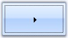
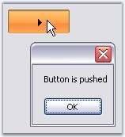

::: {style="DISPLAY: none"}
{#d2h_url_template}{#d2h_package_url style="WIDTH: 0px; DISPLAY: none; HEIGHT: 0px"}
:::

::::: {.d2h_secondary_topic style="PADDING-BOTTOM: 10pt; MARGIN: 0pt; PADDING-LEFT: 0pt; PADDING-RIGHT: 0pt; PADDING-TOP: 0pt"}
##### Frequently Asked Questions {#frequently-asked-questions style="tab-stops: 0pt"}

[]{#p218} This section illustrates the solutions for various task-based queries about the control.

 

###### []{#p219}3.3.2.1.4.1 How to draw or hide focus rectangle for the ButtonAdv control {#how-to-draw-or-hide-focus-rectangle-for-the-buttonadv-control style="tab-stops: 0pt"}

ButtonControl shows some special features which the user interacts with the control. Those properties are discussed in this section.

[]{style="COLOR: #15428b"} 

::: {align="center"}
  -------------------- -----------------------------------------------------------------------------------------------
  Properties           Description
  KeepFocusRectangle   Specifies whether rectangle will be drawn around the control when it is focussed at run time.
  -------------------- -----------------------------------------------------------------------------------------------
:::

[]{style="COLOR: #15428b"} 

+------------------------------------------------------------------------------------------------------------------------------------------------------------------------------------+
| **[\[C#\]]{style="FONT-FAMILY: 'Courier New'; COLOR: black"}**                                                                                                                     |
|                                                                                                                                                                                    |
| []{style="COLOR: #15428b"}                                                                                                                                                         |
|                                                                                                                                                                                    |
| [this]{style="FONT-FAMILY: 'Courier New'; COLOR: blue"}[.buttonAdv1.[KeepFocusRectangle]{style="COLOR: black"} = [true]{style="COLOR: blue"};]{style="FONT-FAMILY: 'Courier New'"} |
+------------------------------------------------------------------------------------------------------------------------------------------------------------------------------------+

[]{style="COLOR: #15428b"} 

+---------------------------------------------------------------------------------------------------------------------------------------------------------------------------------+
| **[\[VB.NET\]]{style="FONT-FAMILY: 'Courier New'; COLOR: black"}**                                                                                                              |
|                                                                                                                                                                                 |
| []{style="COLOR: #15428b"}                                                                                                                                                      |
|                                                                                                                                                                                 |
| [Me]{style="FONT-FAMILY: 'Courier New'; COLOR: blue"}[.buttonAdv1.[KeepFocusRectangle]{style="COLOR: black"} = [True]{style="COLOR: blue"}]{style="FONT-FAMILY: 'Courier New'"} |
+---------------------------------------------------------------------------------------------------------------------------------------------------------------------------------+

[]{style="COLOR: #15428b"} 

{border="0"}

[]{style="COLOR: #15428b"} 

Figure 160: ButtonAdv with Focus Rectangle

 

###### 3.3.2.1.4.2 How to identify whether a ButtonAdv control is in pressed state or not {#how-to-identify-whether-a-buttonadv-control-is-in-pressed-state-or-not style="tab-stops: 0pt"}

[]{#p220}[]{style="COLOR: #15428b"} 

When **ButtonAdv.PushButton** property is enabled, the button will remain in its pressed state, when clicked. The state of the button will be present in the property State. So by examining the state property, we can conclude whether the button is in the Pressed state or not. Using the Office2007 visual styles will help better understanding of this feature.

[]{style="COLOR: #15428b"} 

::: {align="center"}
  ------------ ---------------------------------------------------------------------------------------------------------------------------------------------------------------------------------------------------------------------------------------------------------------
  Property     Description
  PushButton   Specifies the state of the control. By default it is set to false. Set this to true. Now at run time, when the user click this button, the appearance of the button will change to pushed state and will regain its original state only by clicking it again.
  ------------ ---------------------------------------------------------------------------------------------------------------------------------------------------------------------------------------------------------------------------------------------------------------
:::

[]{style="COLOR: #15428b"} 

+--------------------------------------------------------------------------------------------------------------------------------------------------------------------------------------------+
| **[\[C#\]]{style="FONT-FAMILY: 'Courier New'; COLOR: black"}**                                                                                                                             |
|                                                                                                                                                                                            |
| []{style="COLOR: #15428b"}                                                                                                                                                                 |
|                                                                                                                                                                                            |
| [private void]{style="FONT-FAMILY: 'Courier New'; COLOR: blue"}[ buttonAdv1_Click([object]{style="COLOR: blue"} sender, System.EventArgs e)]{style="FONT-FAMILY: 'Courier New'"}           |
|                                                                                                                                                                                            |
| [{]{style="FONT-FAMILY: 'Courier New'"}                                                                                                                                                    |
|                                                                                                                                                                                            |
| [if]{style="FONT-FAMILY: 'Courier New'; COLOR: blue"}[([this]{style="COLOR: blue"}.buttonAdv1.State==Syncfusion.Windows.Forms.ButtonAdvState.Pressed)]{style="FONT-FAMILY: 'Courier New'"} |
|                                                                                                                                                                                            |
| [MessageBox.Show(\"Button is pushed\");]{style="FONT-FAMILY: 'Courier New'"}                                                                                                               |
|                                                                                                                                                                                            |
| [else]{style="FONT-FAMILY: 'Courier New'; COLOR: blue"}                                                                                                                                    |
|                                                                                                                                                                                            |
| [MessageBox.Show(\"Button is in normal state\");]{style="FONT-FAMILY: 'Courier New'"}                                                                                                      |
|                                                                                                                                                                                            |
| [}]{style="FONT-FAMILY: 'Courier New'"}                                                                                                                                                    |
+--------------------------------------------------------------------------------------------------------------------------------------------------------------------------------------------+

[]{style="COLOR: #15428b"} 

+------------------------------------------------------------------------------------------------------------------------------------------------------------------------------------------------------------------------------------------------------------------------------------------------------------------------------------------------------+
| **[\[VB.NET\]]{style="FONT-FAMILY: 'Courier New'; COLOR: black"}**                                                                                                                                                                                                                                                                                   |
|                                                                                                                                                                                                                                                                                                                                                      |
| []{style="COLOR: #15428b"}                                                                                                                                                                                                                                                                                                                           |
|                                                                                                                                                                                                                                                                                                                                                      |
| [Private]{style="FONT-FAMILY: 'Courier New'; COLOR: blue"}[ [Sub]{style="COLOR: blue"} buttonAdv1_Click([ByVal]{style="COLOR: blue"} sender [As]{style="COLOR: blue"} System.Object, [ByVal]{style="COLOR: blue"} e [As]{style="COLOR: blue"} System.EventArgs) [Handles]{style="COLOR: blue"} buttonAdv1.Click]{style="FONT-FAMILY: 'Courier New'"} |
|                                                                                                                                                                                                                                                                                                                                                      |
| [if]{style="FONT-FAMILY: 'Courier New'; COLOR: blue"}[(]{style="FONT-FAMILY: 'Courier New'; COLOR: black"}[Me]{style="FONT-FAMILY: 'Courier New'; COLOR: blue"}[.buttonAdv1.State==Syncfusion.Windows.Forms.ButtonAdvState.Pressed)]{style="FONT-FAMILY: 'Courier New'; COLOR: black"}                                                               |
|                                                                                                                                                                                                                                                                                                                                                      |
| [MessageBox.Show(\"Button is pushed\")]{style="FONT-FAMILY: 'Courier New'"}                                                                                                                                                                                                                                                                          |
|                                                                                                                                                                                                                                                                                                                                                      |
| [else]{style="FONT-FAMILY: 'Courier New'; COLOR: blue"}                                                                                                                                                                                                                                                                                              |
|                                                                                                                                                                                                                                                                                                                                                      |
| [MessageBox.Show(\"Button is in normal state\")]{style="FONT-FAMILY: 'Courier New'"}                                                                                                                                                                                                                                                                 |
|                                                                                                                                                                                                                                                                                                                                                      |
| [End]{style="FONT-FAMILY: 'Courier New'; COLOR: blue"}[ [Sub]{style="COLOR: blue"}]{style="FONT-FAMILY: 'Courier New'"}                                                                                                                                                                                                                              |
+------------------------------------------------------------------------------------------------------------------------------------------------------------------------------------------------------------------------------------------------------------------------------------------------------------------------------------------------------+

[]{style="COLOR: #15428b"} 

{border="0"}

[]{style="COLOR: #15428b"} 

Figure 161: Button Pressed State Identified at Run time

[]{#related-topics}
:::::
