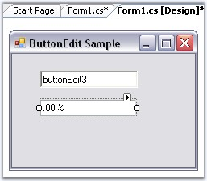
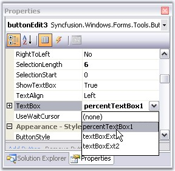
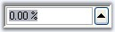
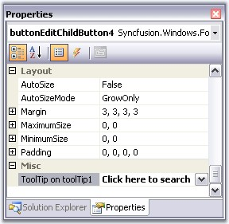
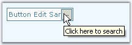

::: {style="DISPLAY: none"}
{#d2h_url_template}{#d2h_package_url style="WIDTH: 0px; DISPLAY: none; HEIGHT: 0px"}
:::

:::: {.d2h_secondary_topic style="PADDING-BOTTOM: 10pt; MARGIN: 0pt; PADDING-LEFT: 0pt; PADDING-RIGHT: 0pt; PADDING-TOP: 0pt"}
##### Frequently Asked Questions {#frequently-asked-questions style="tab-stops: 0pt"}

[]{style="COLOR: #15428b"} 

This section illustrates the solutions for various task-based queries about the control.

 

###### []{#p241}3.3.2.2.5.1 How to hide a child button of a ButtonEdit control? {#how-to-hide-a-child-button-of-a-buttonedit-control style="tab-stops: 0pt"}

   By calling the ButtonEdit.HideButton method, we can hide a child button.

[]{style="COLOR: #15428b"} 

::: {align="center"}
+-----------------------------------+----------------------------------------------------------------------------------------------------------------------------------------------------------------+
| Method                            | Description                                                                                                                                                    |
+-----------------------------------+----------------------------------------------------------------------------------------------------------------------------------------------------------------+
| HideButton                        | Indicates whether a child button is hidden or visible. The parameters are,                                                                                     |
|                                   |                                                                                                                                                                |
|                                   |                                                                                                                                                                |
|                                   |                                                                                                                                                                |
|                                   | *btnIndex* - Specifies the index of the button.                                                                                                                |
|                                   |                                                                                                                                                                |
|                                   | *visible* - Specifies the visibility of the button. It can be true or false. If true, the button will be visible and if false, the button will not be visible. |
+-----------------------------------+----------------------------------------------------------------------------------------------------------------------------------------------------------------+
:::

[  ]{style="COLOR: #15428b"}

+--------------------------------------------------------------------------------------------------------------------------------------------------------+
| **[\[C#\]]{style="FONT-FAMILY: 'Courier New'; COLOR: black"}**                                                                                         |
|                                                                                                                                                        |
| []{style="FONT-FAMILY: 'Courier New'; COLOR: black"}                                                                                                   |
|                                                                                                                                                        |
| [this]{style="FONT-FAMILY: 'Courier New'; COLOR: blue"}[.buttonEdit1.HideButton(0, [false)]{style="COLOR: blue"};]{style="FONT-FAMILY: 'Courier New'"} |
+--------------------------------------------------------------------------------------------------------------------------------------------------------+

[]{style="COLOR: #15428b"} 

+-----------------------------------------------------------------------------------------------------------------------------------------------------+
| **[\[VB.NET\]]{style="FONT-FAMILY: 'Courier New'; COLOR: black"}**                                                                                  |
|                                                                                                                                                     |
| []{style="FONT-FAMILY: 'Courier New'; COLOR: blue"}                                                                                                 |
|                                                                                                                                                     |
| [Me]{style="FONT-FAMILY: 'Courier New'; COLOR: blue"}[.buttonEdit1.HideButton(0, [False)]{style="COLOR: blue"}]{style="FONT-FAMILY: 'Courier New'"} |
+-----------------------------------------------------------------------------------------------------------------------------------------------------+

###### 3.3.2.2.5.2 How to replace the default TextBox in a ButtonEdit control? {#how-to-replace-the-default-textbox-in-a-buttonedit-control style="tab-stops: 0pt"}

[]{#p242}[]{style="COLOR: #15428b"} 

We can replace the default TextBox of the ButtonEdit control with other TextBox by doing the following steps.

[]{style="COLOR: #15428b"} 

1.   Drag a ButtonEdit control and a PercentTextBox control that you would like to replace with the default TextBox of the ButtonEdit control.

[]{style="COLOR: #15428b"} 

{border="0"}

[]{style="COLOR: #15428b"} 

Figure 180: ButtonEdit and PercentTextBox Controls

[]{style="COLOR: #15428b"} 

2.   From the property window of ButtonEdit, select the PercentTextBox to be the TextBox control of the ButtonEdit control as shown below.

[]{style="COLOR: #15428b"} 

{border="0"}

[]{style="COLOR: #15428b"} 

Figure 181: Associating PercentTextBox to the ButtonEdit Control

[]{style="COLOR: #15428b"} 

3.   From the same properties window, you can set the percent properties for the ButtonEdit control.

[]{style="COLOR: #15428b"} 

{border="0"}

[]{style="COLOR: #15428b"} 

Figure 182: ButtonEditControl with PercentTextBox Control

 

 

###### []{#p243}[]{#_How_to_set}3.3.2.2.5.3 How to set tooltip for ButtonEdit Child buttons? {#how-to-set-tooltip-for-buttonedit-child-buttons style="tab-stops: 0pt"}

[]{style="COLOR: #15428b"} 

To set tooltip for a child button in a ButtonEdit control, drag and drop a ToolTip control from the toolbox. Text for tooltip is set using the extender property of the particular child button.

[]{style="COLOR: #15428b"} 

{border="0"}

[]{style="COLOR: #15428b"} 

Figure 183: Setting ToolTip Text

[]{style="COLOR: #15428b"} 

   We can also set the Tooltip for ButtonEdit control programmatically using its **SetToolTip()** method.

[  ]{style="COLOR: #15428b"}

+----------------------------------------------------------------------------------------------------------------------------------------------------------------------------------------------------------------+
| **[\[C#\]]{style="FONT-FAMILY: 'Courier New'; COLOR: black"}**                                                                                                                                                 |
|                                                                                                                                                                                                                |
| []{style="FONT-FAMILY: 'Courier New'; COLOR: black"}                                                                                                                                                           |
|                                                                                                                                                                                                                |
| [this]{style="FONT-FAMILY: 'Courier New'; COLOR: blue"}[.toolTip1.SetToolTip([this]{style="COLOR: blue"}.buttonEdit1, [\"Click here to search\"]{style="COLOR: maroon"});]{style="FONT-FAMILY: 'Courier New'"} |
+----------------------------------------------------------------------------------------------------------------------------------------------------------------------------------------------------------------+

[]{style="COLOR: #15428b"} 

+-----------------------------------------------------------------------------------------------------------------------------------------------------------------------------------------------------------+
| **[\[VB.NET\]]{style="FONT-FAMILY: 'Courier New'; COLOR: black"}**                                                                                                                                        |
|                                                                                                                                                                                                           |
| []{style="FONT-FAMILY: 'Courier New'; COLOR: blue"}                                                                                                                                                       |
|                                                                                                                                                                                                           |
| [Me]{style="FONT-FAMILY: 'Courier New'; COLOR: blue"}[.toolTip1.SetToolTip([Me]{style="COLOR: blue"}.buttonEdit1, [\"Click here to search\"]{style="COLOR: maroon"})]{style="FONT-FAMILY: 'Courier New'"} |
+-----------------------------------------------------------------------------------------------------------------------------------------------------------------------------------------------------------+

[]{style="COLOR: #15428b"} 

{border="0"}

[]{style="COLOR: #15428b"} 

Figure 184: ToolTip set by using the SetToolTip Method

 

[]{#p244} 

[]{#related-topics}
::::
