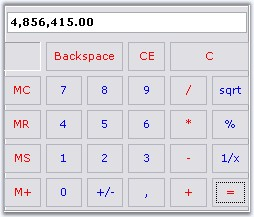

::: {style="DISPLAY: none"}
{#d2h_url_template}{#d2h_package_url style="WIDTH: 0px; DISPLAY: none; HEIGHT: 0px"}
:::

::: {.d2h_secondary_topic style="PADDING-BOTTOM: 10pt; MARGIN: 0pt; PADDING-LEFT: 0pt; PADDING-RIGHT: 0pt; PADDING-TOP: 0pt"}
##### Frequently Asked Questions {#frequently-asked-questions style="tab-stops: 0pt"}

[]{style="COLOR: #15428b"} 

This section illustrates the solutions for various task-based queries about the control.

###### []{#p265}3.3.2.3.5.1 How to customize the calculator display text area to use NumberGroupSeparator? {#how-to-customize-the-calculator-display-text-area-to-use-numbergroupseparator style="tab-stops: 0pt"}

[]{style="COLOR: #15428b"} 

The calculator control by default does not allow the use of NumberGroupSeparator like in DoubleTextBox.

[]{style="COLOR: #15428b"} 

{border="0"}

[]{style="COLOR: #15428b"} 

Figure 203: DoubleTextBox

[]{style="COLOR: #15428b"} 

So to achieve this we need to derive the CalculatorControl and override the **CreateCalculatorDisplayBox()** method.

[]{style="COLOR: #15428b"} 

+---------------------------------------------------------------------------------------------------------------------------------------------------------------------------------------------------------------------------------------------+
| **[\[C#\]]{style="FONT-FAMILY: 'Courier New'; COLOR: black"}**                                                                                                                                                                              |
|                                                                                                                                                                                                                                             |
| []{style="COLOR: #15428b"}                                                                                                                                                                                                                  |
|                                                                                                                                                                                                                                             |
| [private]{style="FONT-FAMILY: 'Courier New'; COLOR: blue"}[ [CalculatorAdv]{style="COLOR: teal"} calculatorControl1;]{style="FONT-FAMILY: 'Courier New'"}                                                                                   |
|                                                                                                                                                                                                                                             |
| [this]{style="FONT-FAMILY: 'Courier New'; COLOR: blue"}[.calculatorControl1 = [new]{style="COLOR: blue"} [CalculatorAdv]{style="COLOR: teal"}();]{style="FONT-FAMILY: 'Courier New'"}                                                       |
|                                                                                                                                                                                                                                             |
| [public]{style="FONT-FAMILY: 'Courier New'; COLOR: blue"}[ [class]{style="COLOR: blue"} [CalculatorAdv]{style="COLOR: teal"} : Syncfusion.Windows.Forms.Tools.[CalculatorControl]{style="COLOR: teal"}]{style="FONT-FAMILY: 'Courier New'"} |
|                                                                                                                                                                                                                                             |
| [{]{style="FONT-FAMILY: 'Courier New'"}                                                                                                                                                                                                     |
|                                                                                                                                                                                                                                             |
| [    [public]{style="COLOR: blue"} CalculatorAdv()]{style="FONT-FAMILY: 'Courier New'"}                                                                                                                                                     |
|                                                                                                                                                                                                                                             |
| [    {]{style="FONT-FAMILY: 'Courier New'"}                                                                                                                                                                                                 |
|                                                                                                                                                                                                                                             |
| [    }]{style="FONT-FAMILY: 'Courier New'"}                                                                                                                                                                                                 |
|                                                                                                                                                                                                                                             |
| [    [protected]{style="COLOR: blue"} [override]{style="COLOR: blue"} [void]{style="COLOR: blue"} CreateCalculatorDisplayBox()]{style="FONT-FAMILY: 'Courier New'"}                                                                         |
|                                                                                                                                                                                                                                             |
| [    {]{style="FONT-FAMILY: 'Courier New'"}                                                                                                                                                                                                 |
|                                                                                                                                                                                                                                             |
| [        Syncfusion.Windows.Forms.Tools.[DoubleTextBox]{style="COLOR: teal"} dtb = [new]{style="COLOR: blue"} Syncfusion.Windows.Forms.Tools.[DoubleTextBox]{style="COLOR: teal"}();]{style="FONT-FAMILY: 'Courier New'"}                   |
|                                                                                                                                                                                                                                             |
| []{style="FONT-FAMILY: 'Courier New'"}                                                                                                                                                                                                      |
|                                                                                                                                                                                                                                             |
| [        dtb.NumberGroupSeparator = [\",\"]{style="COLOR: maroon"};]{style="FONT-FAMILY: 'Courier New'"}                                                                                                                                    |
|                                                                                                                                                                                                                                             |
| [        [this]{style="COLOR: blue"}.textCalculatorBox = dtb; [//Changing the TextBox to DoubleTextBox]{style="COLOR: green"}]{style="FONT-FAMILY: 'Courier New'"}                                                                          |
|                                                                                                                                                                                                                                             |
| []{style="FONT-FAMILY: 'Courier New'; COLOR: green"}                                                                                                                                                                                        |
|                                                                                                                                                                                                                                             |
| [    }]{style="FONT-FAMILY: 'Courier New'"}                                                                                                                                                                                                 |
|                                                                                                                                                                                                                                             |
| [}]{style="FONT-FAMILY: 'Courier New'"}                                                                                                                                                                                                     |
+---------------------------------------------------------------------------------------------------------------------------------------------------------------------------------------------------------------------------------------------+

[]{style="COLOR: #15428b"} 

+------------------------------------------------------------------------------------------------------------------------------------------------------------------------------------------------------+
| **[\[VB.NET\]]{style="FONT-FAMILY: 'Courier New'; COLOR: black"}**                                                                                                                                   |
|                                                                                                                                                                                                      |
| []{style="COLOR: black"}                                                                                                                                                                             |
|                                                                                                                                                                                                      |
| [Private]{style="FONT-FAMILY: 'Courier New'; COLOR: blue"}[ calculatorControl1 [As]{style="COLOR: blue"} CalculatorAdv]{style="FONT-FAMILY: 'Courier New'"}                                          |
|                                                                                                                                                                                                      |
| [Me.calculatorControl1 = New CalculatorAdv() ]{style="FONT-FAMILY: 'Courier New'"}                                                                                                                   |
|                                                                                                                                                                                                      |
| [Public]{style="FONT-FAMILY: 'Courier New'; COLOR: blue"}[ [Class]{style="COLOR: blue"} CalculatorAdv]{style="FONT-FAMILY: 'Courier New'"}                                                           |
|                                                                                                                                                                                                      |
| [    [Inherits]{style="COLOR: blue"} Syncfusion.Windows.Forms.Tools.CalculatorControl]{style="FONT-FAMILY: 'Courier New'"}                                                                           |
|                                                                                                                                                                                                      |
| []{style="FONT-FAMILY: 'Courier New'"}                                                                                                                                                               |
|                                                                                                                                                                                                      |
| [    [Public]{style="COLOR: blue"} [Sub]{style="COLOR: blue"} [New]{style="COLOR: blue"}()]{style="FONT-FAMILY: 'Courier New'"}                                                                      |
|                                                                                                                                                                                                      |
| [    [End]{style="COLOR: blue"} [Sub]{style="COLOR: blue"}]{style="FONT-FAMILY: 'Courier New'"}                                                                                                      |
|                                                                                                                                                                                                      |
| [    [Protected]{style="COLOR: blue"} [Overloads]{style="COLOR: blue"} [Overrides]{style="COLOR: blue"} [Sub]{style="COLOR: blue"} CreateCalculatorDisplayBox()]{style="FONT-FAMILY: 'Courier New'"} |
|                                                                                                                                                                                                      |
| [        [Dim]{style="COLOR: blue"} dtb [As]{style="COLOR: blue"} [New]{style="COLOR: blue"} Syncfusion.Windows.Forms.Tools.DoubleTextBox()]{style="FONT-FAMILY: 'Courier New'"}                     |
|                                                                                                                                                                                                      |
| []{style="FONT-FAMILY: 'Courier New'"}                                                                                                                                                               |
|                                                                                                                                                                                                      |
| [        dtb.NumberGroupSeparator = [\",\"]{style="COLOR: maroon"}]{style="FONT-FAMILY: 'Courier New'"}                                                                                              |
|                                                                                                                                                                                                      |
| [        [Me]{style="COLOR: blue"}.textCalculatorBox = dtb]{style="FONT-FAMILY: 'Courier New'"}                                                                                                      |
|                                                                                                                                                                                                      |
| [        [\'Changing the TextBox to DoubleTextBox ]{style="COLOR: green"}]{style="FONT-FAMILY: 'Courier New'"}                                                                                       |
|                                                                                                                                                                                                      |
| [    [End]{style="COLOR: blue"} [Sub]{style="COLOR: blue"}]{style="FONT-FAMILY: 'Courier New'"}                                                                                                      |
|                                                                                                                                                                                                      |
| [End]{style="FONT-FAMILY: 'Courier New'; COLOR: blue"}[ [Class]{style="COLOR: blue"}]{style="FONT-FAMILY: 'Courier New'"}                                                                            |
+------------------------------------------------------------------------------------------------------------------------------------------------------------------------------------------------------+

[  ]{style="FONT-FAMILY: 'Courier New'"}**[ ]{style="COLOR: #333399"}**

{border="0"}

[]{style="COLOR: #15428b"} 

Figure 204: Calculator displaying NumberGroupSeparator with the help of DoubleTextBox

 

 

###### 3.3.2.3.5.2 How to Simulate a Particular button in the Calculator[]{#p266}? {#how-to-simulate-a-particular-button-in-the-calculator style="tab-stops: 0pt"}

[]{style="COLOR: #15428b"} 

We can use **Calculator.ButtonAction()** method for this. When the user clicks the button, the ButtonAction method of the Calculator control will  call back the action of the particular button (in this example it is \"=\" button) and displays the result in the textbox area, using CalcActions Enumerator. This enumerator has all the actions that can be assigned to the calculator buttons including digits and arithmetic operators also.

[]{style="COLOR: #15428b"} 

+-------------------------------------------------------------------------------------------------------------------------------------------------------------------------------------------------------------------------+
| **[\[C#\]]{style="FONT-FAMILY: 'Courier New'; COLOR: black"}**                                                                                                                                                          |
|                                                                                                                                                                                                                         |
| []{style="COLOR: black"}                                                                                                                                                                                                |
|                                                                                                                                                                                                                         |
| [private]{style="FONT-FAMILY: 'Courier New'; COLOR: blue"}[ [void]{style="COLOR: blue"} buttonAdv1_Click([object]{style="COLOR: blue"} sender, [EventArgs]{style="COLOR: teal"} e)]{style="FONT-FAMILY: 'Courier New'"} |
|                                                                                                                                                                                                                         |
| [{]{style="FONT-FAMILY: 'Courier New'"}                                                                                                                                                                                 |
|                                                                                                                                                                                                                         |
| [    [//Performing the \"=\" button action]{style="COLOR: green"}]{style="FONT-FAMILY: 'Courier New'"}                                                                                                                  |
|                                                                                                                                                                                                                         |
| [    [this]{style="COLOR: blue"}.calculatorControl1.ButtonAction(Syncfusion.Windows.Forms.Tools.[CalcActions]{style="COLOR: teal"}.CalcOperatorEquals);]{style="FONT-FAMILY: 'Courier New'"}                            |
|                                                                                                                                                                                                                         |
| [}]{style="FONT-FAMILY: 'Courier New'"}                                                                                                                                                                                 |
+-------------------------------------------------------------------------------------------------------------------------------------------------------------------------------------------------------------------------+

[]{style="COLOR: #15428b"} 

+-----------------------------------------------------------------------------------------------------------------------------------------------------------------------------------------------------------------------------------------------------------------------------------------------------------------------------------------------------------------------------------------------------------------------------------------------------+
| **[\[VB.NET\]]{style="FONT-FAMILY: 'Courier New'; COLOR: black"}**                                                                                                                                                                                                                                                                                                                                                                                  |
|                                                                                                                                                                                                                                                                                                                                                                                                                                                     |
| []{style="COLOR: #15428b"}                                                                                                                                                                                                                                                                                                                                                                                                                          |
|                                                                                                                                                                                                                                                                                                                                                                                                                                                     |
| [Private Sub]{style="FONT-FAMILY: 'Courier New'; COLOR: blue"}[ ]{style="FONT-FAMILY: 'Courier New'; COLOR: black"}[buttonAdv1_Click[(]{style="COLOR: black"}[ByVal]{style="COLOR: blue"}[ sender]{style="COLOR: black"}[ As Object]{style="COLOR: blue"}[, ]{style="COLOR: black"}[ByVal]{style="COLOR: blue"}[ e ]{style="COLOR: black"}[As]{style="COLOR: blue"}[ System.EventArgs) ]{style="COLOR: black"}]{style="FONT-FAMILY: 'Courier New'"} |
|                                                                                                                                                                                                                                                                                                                                                                                                                                                     |
| []{style="FONT-FAMILY: 'Courier New'; COLOR: black"}                                                                                                                                                                                                                                                                                                                                                                                                |
|                                                                                                                                                                                                                                                                                                                                                                                                                                                     |
| [   \'Performing the \"=\" button action]{style="FONT-FAMILY: 'Courier New'; COLOR: green"}                                                                                                                                                                                                                                                                                                                                                         |
|                                                                                                                                                                                                                                                                                                                                                                                                                                                     |
| [   ]{style="FONT-FAMILY: 'Courier New'; COLOR: black"}[Me]{style="FONT-FAMILY: 'Courier New'; COLOR: blue"}[.calculatorControl1.ButtonAction(Syncfusion.Windows.Forms.Tools.CalcActions.CalcOperatorEquals) ]{style="FONT-FAMILY: 'Courier New'; COLOR: black"}                                                                                                                                                                                    |
|                                                                                                                                                                                                                                                                                                                                                                                                                                                     |
| [End Sub]{style="FONT-FAMILY: 'Courier New'; COLOR: blue"}                                                                                                                                                                                                                                                                                                                                                                                          |
+-----------------------------------------------------------------------------------------------------------------------------------------------------------------------------------------------------------------------------------------------------------------------------------------------------------------------------------------------------------------------------------------------------------------------------------------------------+

[]{#related-topics}
:::
