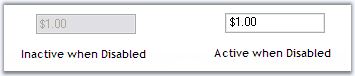

::: {style="DISPLAY: none"}
{#d2h_url_template}{#d2h_package_url style="WIDTH: 0px; DISPLAY: none; HEIGHT: 0px"}
:::

:::: {.d2h_secondary_topic style="PADDING-BOTTOM: 10pt; MARGIN: 0pt; PADDING-LEFT: 0pt; PADDING-RIGHT: 0pt; PADDING-TOP: 0pt"}
##### Frequently Asked Questions {#frequently-asked-questions style="tab-stops: 0pt"}

When the control is set to disabled, we could not make any changes in it. But we can make the text active by setting **DrawActiveWhenDisabled** to **True.**[]{style="COLOR: black"}

[]{style="COLOR: black"} 

::: {align="center"}
  -------------------------------------------------- -------------------------------------------------------------------------------------------------------------------------------------------------------------
  CurrencyTextBox Property[]{style="COLOR: black"}   Description[]{style="COLOR: black"}
  DrawActiveWhenDisabled[]{style="COLOR: black"}     Specifies whether the text should be drawn active even when the control is disabled. **Enabled** property must be set to **False.**[]{style="COLOR: black"}
  -------------------------------------------------- -------------------------------------------------------------------------------------------------------------------------------------------------------------
:::

[]{style="COLOR: black"} 

The following figure illustrates this.[]{style="COLOR: black"}

[]{style="COLOR: black"} 

{border="0"}

[]{style="COLOR: black"} 

Figure 520: Text Active even when Control is Disabled[]{style="COLOR: black"}

 

###### 3.3.8.6.8.1 How to make the text active when the control is disabled {#how-to-make-the-text-active-when-the-control-is-disabled style="tab-stops: 0pt"}

[]{#related-topics}
::::
