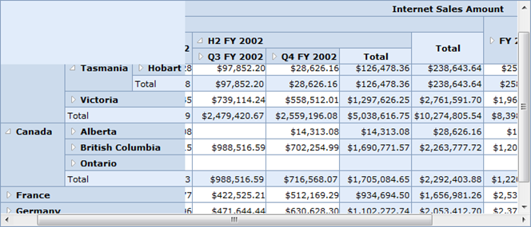

::: {style="DISPLAY: none"}
{#d2h_url_template}{#d2h_package_url style="WIDTH: 0px; DISPLAY: none; HEIGHT: 0px"}
:::

::::: {#nsbanner .d2h_main_nsbanner style="BORDER-BOTTOM: #999999 1px solid; POSITION: relative; PADDING-BOTTOM: 0px; BACKGROUND-COLOR: transparent; PADDING-LEFT: 0px; PADDING-RIGHT: 0px; DISPLAY: none; BORDER-TOP: #999999 1px solid; PADDING-TOP: 0px; LEFT: 0px"}
:::: {#TitleRow .d2h_main_titlerow style="PADDING-BOTTOM: 4px; BACKGROUND-COLOR: transparent; PADDING-LEFT: 22px; WIDTH: 100%; PADDING-RIGHT: 10px; DISPLAY: none; PADDING-TOP: 4px"}
::: {#ienav .d2h_main_ienav style="DISPLAY: none"}
{#D2HPrevious .D2HPreviousEnabled}  {#D2HNext .D2HNextEnabled}
:::
::::
:::::

:::: {#nstext .d2h_main_nstext style="PADDING-BOTTOM: 10px; BACKGROUND-COLOR: transparent; PADDING-LEFT: 22px; PADDING-RIGHT: 10px; HEIGHT: 100%; OVERFLOW: auto; PADDING-TOP: 5px" hasuserbackground="true" valign="bottom"}
### Frozen Header {#frozen-header style="tab-stops: 0pt"}

Users can freeze the header of the grid so that headers are always visible when scrolling through a grid with a large number of rows or columns.

Use Case Scenarios

This feature enables users to view headers even while scrolling through the grid.

 

{border="0"}

Figure 15: OLAP Grid with FreezeColumnHeaders and FreezeRowHeaders enabled

 

Properties

Table 6: OlapGrid Properties Table

::: {align="center"}
  ----------------------------------------------- ----------------------------------------------------------------- ------------- -----------
  Property                                        Description                                                       Type          Data Type
  FreezeColumnHeaders[]{style="COLOR: #c00000"}   To freeze/unfreeze the column headers[]{style="COLOR: #c00000"}   Server side   bool
  FreezeRowHeaders[]{style="COLOR: #c00000"}      To freeze/unfreeze the row headers[]{style="COLOR: #c00000"}      Server side   bool
  ----------------------------------------------- ----------------------------------------------------------------- ------------- -----------
:::

 

 

Sample Link

Follow the steps given below to view a sample of this feature.

1    Open the **Syncfusion Dashboard**.

2    Click **Business Intelligence**.

3    Click the **ASP.NET** drop-down list, and select **Explore Samples**.

4    Navigate to **OlapGrid.Web** \> **Samples** \> **3.5** \> **Scrolling** \> **Frozen Headers Demo**.

[]{style="COLOR: #c00000"} 

Adding Frozen Header to an Application

The frozen header can be added to an application by using the following code:

 

+-------------------------------------------------------------------------------------------------------------------------------------------------------------------------------------------------------------------------------------------------------------------------------------------------------------------------------------------------------------------------------------------------------------------------------------------------------------------------------------------------------------------------------------------------------------------------------------------------------------------------------------------------------------------------------------------------------------------+
| **[\[ASPX\]]{style="FONT-FAMILY: 'Courier New'"}**                                                                                                                                                                                                                                                                                                                                                                                                                                                                                                                                                                                                                                                                |
|                                                                                                                                                                                                                                                                                                                                                                                                                                                                                                                                                                                                                                                                                                                   |
| **[]{style="FONT-FAMILY: 'Courier New'"}**                                                                                                                                                                                                                                                                                                                                                                                                                                                                                                                                                                                                                                                                        |
|                                                                                                                                                                                                                                                                                                                                                                                                                                                                                                                                                                                                                                                                                                                   |
| [\<]{style="FONT-FAMILY: 'Courier New'; COLOR: blue"}[Syncfusion]{style="FONT-FAMILY: 'Courier New'; COLOR: maroon"}[:]{style="FONT-FAMILY: 'Courier New'; COLOR: blue"}[OlapGrid]{style="FONT-FAMILY: 'Courier New'; COLOR: maroon"}[ [ID]{style="COLOR: red"}[=\"OlapGridControl1\"]{style="COLOR: blue"} [runat]{style="COLOR: red"}[=\"server\"]{style="COLOR: blue"} [Height]{style="COLOR: red"}[=\"300\"]{style="COLOR: blue"} [Width]{style="COLOR: red"}[=\"800\"]{style="COLOR: blue"} [FreezeRowHeaders]{style="COLOR: red"}[=\"true\"]{style="COLOR: blue"} [FreezeColumnHeaders]{style="COLOR: red"}[=\"true\"]{style="COLOR: blue"} [/\>]{style="COLOR: blue"}]{style="FONT-FAMILY: 'Courier New'"} |
|                                                                                                                                                                                                                                                                                                                                                                                                                                                                                                                                                                                                                                                                                                                   |
| []{style="FONT-FAMILY: Consolas; COLOR: blue; FONT-SIZE: 9.5pt"}                                                                                                                                                                                                                                                                                                                                                                                                                                                                                                                                                                                                                                                  |
+-------------------------------------------------------------------------------------------------------------------------------------------------------------------------------------------------------------------------------------------------------------------------------------------------------------------------------------------------------------------------------------------------------------------------------------------------------------------------------------------------------------------------------------------------------------------------------------------------------------------------------------------------------------------------------------------------------------------+

 

[]{#related-topics}
::::
