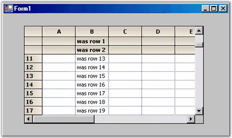

::: {style="DISPLAY: none"}
{#d2h_url_template}{#d2h_package_url style="WIDTH: 0px; DISPLAY: none; HEIGHT: 0px"}
:::

::: {.d2h_secondary_topic style="PADDING-BOTTOM: 10pt; MARGIN: 0pt; PADDING-LEFT: 0pt; PADDING-RIGHT: 0pt; PADDING-TOP: 0pt"}
##### Frozen Rows and Columns {#frozen-rows-and-columns style="tab-stops: 0pt"}

[]{style="FONT-FAMILY: 'Trebuchet MS','sans-serif'; COLOR: #15428b; FONT-SIZE: 9pt"} 

A  frozen row  is one that cannot be scrolled. For example, the default column header (row 0) is a frozen row. Frozen rows will always be displayed at the top of the grid. You can set the number of frozen rows using the  **GridControl.Rows.FrozenCount** property. In our previous code sample, we used the **Rows.HeaderCount** property to set up two additional column header rows. To cause the new headers to be fixed and not to scroll, you need to set the Rows.FrozenCount to two. Note that you can freeze non-header type rows as well but, in the following code samples, we are freezing headers only.

[]{style="FONT-FAMILY: 'Trebuchet MS','sans-serif'; COLOR: #15428b; FONT-SIZE: 9pt"} 

+-----------------------------------------------------------------------------------------------------------------------------------------------------------+
| **[\[C#\]]{style="FONT-FAMILY: 'Courier New'; COLOR: black"}**                                                                                            |
|                                                                                                                                                           |
| []{style="FONT-FAMILY: 'Courier New'; COLOR: black"}                                                                                                      |
|                                                                                                                                                           |
| [// Have 3 non-scrollable rows at the top.     ]{style="FONT-FAMILY: 'Courier New'; COLOR: green"}[   ]{style="FONT-FAMILY: 'Courier New'; COLOR: black"} |
|                                                                                                                                                           |
| [this]{style="FONT-FAMILY: 'Courier New'; COLOR: blue"}[.gridControl1.Rows.FrozenCount = 2;  ]{style="FONT-FAMILY: 'Courier New'; COLOR: black"}          |
|                                                                                                                                                           |
| []{style="FONT-FAMILY: 'Courier New'; COLOR: black"}                                                                                                      |
|                                                                                                                                                           |
| [// Total of three column header rows.      ]{style="FONT-FAMILY: 'Courier New'; COLOR: green"}[  ]{style="FONT-FAMILY: 'Courier New'; COLOR: black"}     |
|                                                                                                                                                           |
| [this]{style="FONT-FAMILY: 'Courier New'; COLOR: blue"}[.gridControl1.Rows.HeaderCount = 2;  ]{style="FONT-FAMILY: 'Courier New'; COLOR: black"}          |
+-----------------------------------------------------------------------------------------------------------------------------------------------------------+

[]{style="FONT-FAMILY: 'Trebuchet MS','sans-serif'; COLOR: #15428b; FONT-SIZE: 9pt"} 

+-----------------------------------------------------------------------------------------------------------------------------------------------------------+
| **[\[VB.NET\]]{style="FONT-FAMILY: 'Courier New'; COLOR: black"}**                                                                                        |
|                                                                                                                                                           |
| []{style="FONT-FAMILY: 'Courier New'; COLOR: black"}                                                                                                      |
|                                                                                                                                                           |
| [\' Have 3 non-scrollable rows at the top.   ]{style="FONT-FAMILY: 'Courier New'; COLOR: green"}[     ]{style="FONT-FAMILY: 'Courier New'; COLOR: black"} |
|                                                                                                                                                           |
| [Me]{style="FONT-FAMILY: 'Courier New'; COLOR: blue"}[.GridControl1.Rows.FrozenCount = 2    ]{style="FONT-FAMILY: 'Courier New'; COLOR: black"}           |
|                                                                                                                                                           |
| []{style="FONT-FAMILY: 'Courier New'; COLOR: black"}                                                                                                      |
|                                                                                                                                                           |
| [\' Total of three column header rows.    ]{style="FONT-FAMILY: 'Courier New'; COLOR: green"}[    ]{style="FONT-FAMILY: 'Courier New'; COLOR: black"}     |
|                                                                                                                                                           |
| [Me]{style="FONT-FAMILY: 'Courier New'; COLOR: blue"}[.GridControl1.Rows.HeaderCount = 2   ]{style="FONT-FAMILY: 'Courier New'; COLOR: black"}            |
+-----------------------------------------------------------------------------------------------------------------------------------------------------------+

[]{style="FONT-FAMILY: 'Trebuchet MS','sans-serif'; COLOR: #15428b; FONT-SIZE: 9pt"} 

{border="0"}

[]{style="FONT-FAMILY: 'Trebuchet MS','sans-serif'; COLOR: #15428b; FONT-SIZE: 9pt"} 

*[Figure ]{style="FONT-SIZE: 9pt"}[173]{style="FONT-SIZE: 9pt"}[: Grid with Three Frozen Column Header Rows]{style="FONT-SIZE: 9pt"}*

[]{style="FONT-FAMILY: 'Trebuchet MS','sans-serif'; COLOR: #15428b; FONT-SIZE: 9pt"} 

As we have said, frozen rows will always appear at the top of the grid and frozen columns will always appear to the left of the grid. It is possible to freeze an interior range of row or columns, using the ** GridControl.Rows.FreezeRange** or **GridControl.Cols.FreezeRange** method. But, the **FreezeRange** method will move the requested rows / columns to the top or left and then it will set the **FrozenCount** to actually freeze the rows or columns.

[]{style="FONT-FAMILY: 'Trebuchet MS','sans-serif'; COLOR: #15428b; FONT-SIZE: 9pt"} 

+--------------------------------------------------------------------------------------------------------------------------------------------------------------------------------+
| **[\[C#\]]{style="FONT-FAMILY: 'Courier New'; COLOR: black"}**                                                                                                                 |
|                                                                                                                                                                                |
| []{style="FONT-FAMILY: 'Courier New'; COLOR: black"}                                                                                                                           |
|                                                                                                                                                                                |
| [// Moves rows 3 and 4 to the top of the grid and freezes them.   ]{style="FONT-FAMILY: 'Courier New'; COLOR: green"}[     ]{style="FONT-FAMILY: 'Courier New'; COLOR: black"} |
|                                                                                                                                                                                |
| [this]{style="FONT-FAMILY: 'Courier New'; COLOR: blue"}[.gridControl1.Rows.FreezeRange(3,4);]{style="FONT-FAMILY: 'Courier New'; COLOR: black"}                                |
+--------------------------------------------------------------------------------------------------------------------------------------------------------------------------------+

[]{style="FONT-FAMILY: 'Trebuchet MS','sans-serif'; COLOR: #15428b; FONT-SIZE: 9pt"} 

+------------------------------------------------------------------------------------------------------------------------------------------------+
| **[\[VB.NET\]]{style="FONT-FAMILY: 'Courier New'; COLOR: black"}**                                                                             |
|                                                                                                                                                |
| []{style="FONT-FAMILY: 'Courier New'; COLOR: black"}                                                                                           |
|                                                                                                                                                |
| [\' Moves rows 3 and 4 to the top of the grid and freezes them.        ]{style="FONT-FAMILY: 'Courier New'; COLOR: green"}                     |
|                                                                                                                                                |
| [Me]{style="FONT-FAMILY: 'Courier New'; COLOR: blue"}[.GridControl1.Rows.FreezeRange(3,4)  ]{style="FONT-FAMILY: 'Courier New'; COLOR: black"} |
+------------------------------------------------------------------------------------------------------------------------------------------------+

 

[]{#p328} 

 

[]{#related-topics}
:::
