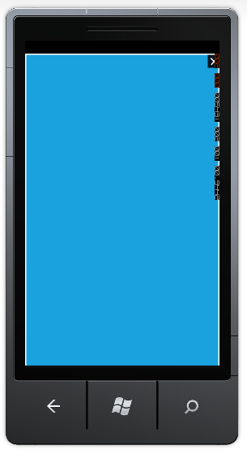

::: {style="DISPLAY: none"}
[](ms-xhelp:///?Id=d2h_url_template){#d2h_url_template}{#d2h_package_url style="WIDTH: 0px; DISPLAY: none; HEIGHT: 0px"}
:::

::: {.d2h_secondary_topic style="PADDING-BOTTOM: 10pt; MARGIN: 0pt; PADDING-LEFT: 0pt; PADDING-RIGHT: 0pt; PADDING-TOP: 0pt"}
#### Full Screen Mode {#full-screen-mode style="tab-stops: 0pt"}

Dialog control provides support to set dialog box in full screen mode.

           

Setting Full Screen Mode  

To enable full screen mode, set the *[IsFullScreen]{style="COLOR: black"}*[ property ]{style="COLOR: black"}of the *Dialog*[ to *true*.  Default value is *false*. ]{style="COLOR: black"}

[]{style="COLOR: black"} 

[The following code illustrates how to set dialog box in full screen mode:]{style="COLOR: black"}

``` {style="BACKGROUND: white"}
 
```

+-------------------------------------------------------------------------------------------------------------------------------------------------------------------------------------------------------------------------------------------------------------------------------------------------------------------------------------------------------------------------------------------------------------------------------------------------------------------------------------------------------------------------------------------------------------------------------------------------------------------------------------------------------------------------------------------------------------------------------------------------------------------------+
| **[\[xaml\]]{style="FONT-FAMILY: 'Courier New'"}**[\                                                                                                                                                                                                                                                                                                                                                                                                                                                                                                                                                                                                                                                                                                                    |
| ]{style="FONT-FAMILY: 'Courier New'"}[\<]{style="FONT-FAMILY: 'Courier New'; COLOR: blue"}[syncfusion]{style="FONT-FAMILY: 'Courier New'; COLOR: #a31515"}[:]{style="FONT-FAMILY: 'Courier New'; COLOR: blue"}[Dialog]{style="FONT-FAMILY: 'Courier New'; COLOR: #a31515"}[ AnimationType]{style="FONT-FAMILY: 'Courier New'; COLOR: red"}[=\"None\"]{style="FONT-FAMILY: 'Courier New'; COLOR: blue"}[ IsBackKeyClose]{style="FONT-FAMILY: 'Courier New'; COLOR: red"}[=\"True\"]{style="FONT-FAMILY: 'Courier New'; COLOR: blue"}[ [ x]{style="COLOR: red"}[:]{style="COLOR: blue"}[Name]{style="COLOR: red"}[=\"dialogFullScreen\"]{style="COLOR: blue"} [ IsFullScreen]{style="COLOR: red"}[=\"True\" \>]{style="COLOR: blue"}]{style="FONT-FAMILY: 'Courier New'"} |
|                                                                                                                                                                                                                                                                                                                                                                                                                                                                                                                                                                                                                                                                                                                                                                         |
| [                        ]{style="FONT-FAMILY: 'Courier New'; COLOR: #a31515"}[]{style="FONT-FAMILY: 'Courier New'"}                                                                                                                                                                                                                                                                                                                                                                                                                                                                                                                                                                                                                                                    |
|                                                                                                                                                                                                                                                                                                                                                                                                                                                                                                                                                                                                                                                                                                                                                                         |
| [ ]{style="FONT-FAMILY: 'Courier New'; COLOR: #a31515"}[\</]{style="FONT-FAMILY: 'Courier New'; COLOR: blue"}[syncfusion]{style="FONT-FAMILY: 'Courier New'; COLOR: #a31515"}[:]{style="FONT-FAMILY: 'Courier New'; COLOR: blue"}[Dialog]{style="FONT-FAMILY: 'Courier New'; COLOR: #a31515"}[\>]{style="FONT-FAMILY: 'Courier New'; COLOR: blue"}                                                                                                                                                                                                                                                                                                                                                                                                                      |
+-------------------------------------------------------------------------------------------------------------------------------------------------------------------------------------------------------------------------------------------------------------------------------------------------------------------------------------------------------------------------------------------------------------------------------------------------------------------------------------------------------------------------------------------------------------------------------------------------------------------------------------------------------------------------------------------------------------------------------------------------------------------------+

[]{style="FONT-FAMILY: Consolas; COLOR: blue; FONT-SIZE: 9.5pt"} 

+-------------------------------------------------------------------------------------------------------------------------------------------------------------------------------------------------------------------------------------------------------------------------------------+
| **[\[C#\]]{style="FONT-FAMILY: 'Courier New'"}**                                                                                                                                                                                                                                    |
|                                                                                                                                                                                                                                                                                     |
| [Dialog]{style="FONT-FAMILY: 'Courier New'; COLOR: #2b91af"}[ dialogFullScreen = [new]{style="COLOR: blue"} [Dialog]{style="COLOR: #2b91af"}() { IsFullScreen = [true]{style="COLOR: blue"}, IsBackKeyClose = [true]{style="COLOR: blue"},  };]{style="FONT-FAMILY: 'Courier New'"} |
|                                                                                                                                                                                                                                                                                     |
| []{style="FONT-FAMILY: 'Courier New'; COLOR: blue"}                                                                                                                                                                                                                                 |
+-------------------------------------------------------------------------------------------------------------------------------------------------------------------------------------------------------------------------------------------------------------------------------------+

[]{style="FONT-FAMILY: Consolas; COLOR: blue; FONT-SIZE: 9.5pt"} 

{border="0"}

Figure 88: Dialog in Full Screen Mode

 

 

[]{style="COLOR: #c00000"} 

[]{#related-topics}
:::
