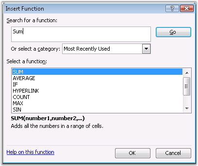
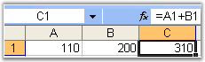

::: {style="DISPLAY: none"}
{#d2h_url_template}{#d2h_package_url style="WIDTH: 0px; DISPLAY: none; HEIGHT: 0px"}
:::

::::: {#nsbanner .d2h_main_nsbanner style="BORDER-BOTTOM: #999999 1px solid; POSITION: relative; PADDING-BOTTOM: 0px; BACKGROUND-COLOR: transparent; PADDING-LEFT: 0px; PADDING-RIGHT: 0px; DISPLAY: none; BORDER-TOP: #999999 1px solid; PADDING-TOP: 0px; LEFT: 0px"}
:::: {#TitleRow .d2h_main_titlerow style="PADDING-BOTTOM: 4px; BACKGROUND-COLOR: transparent; PADDING-LEFT: 22px; WIDTH: 100%; PADDING-RIGHT: 10px; DISPLAY: none; PADDING-TOP: 4px"}
::: {#ienav .d2h_main_ienav style="DISPLAY: none"}
{#D2HPrevious .D2HPreviousEnabled}  {#D2HNext .D2HNextEnabled}
:::
::::
:::::

::::: {#nstext .d2h_main_nstext style="PADDING-BOTTOM: 10px; BACKGROUND-COLOR: transparent; PADDING-LEFT: 22px; PADDING-RIGHT: 10px; HEIGHT: 100%; OVERFLOW: auto; PADDING-TOP: 5px" hasuserbackground="true" valign="bottom"}
::: {#d2h_breadcrumbs .d2h_breadcrumbs}
[Essential Studio User Guide Documentation](ms-xhelp:///?Id=12457748-09e3-4d74-a240-8e049cedf030){.d2h_breadcrumbsNormal}[ \> ]{.d2h_breadcrumbsLinkSeparator}[Reporting Edition](ms-xhelp:///?Id=027aa5b6-6676-4f93-ad23-c20e8c45792e){.d2h_breadcrumbsNormal}[ \> ]{.d2h_breadcrumbsLinkSeparator}[Essential XlsIO](ms-xhelp:///?Id=b01a1b50-1d7d-40c0-bc83-af67e57c9005){.d2h_breadcrumbsNormal}[ \> ]{.d2h_breadcrumbsLinkSeparator}[Concepts and Features](ms-xhelp:///?Id=21b26556-5905-4ad9-90b4-40320db25faf){.d2h_breadcrumbsNormal}[ \> ]{.d2h_breadcrumbsLinkSeparator}[Formulas](ms-xhelp:///?Id=c863333a-35ff-470d-abbc-279e765c84b1){.d2h_breadcrumbsNormal}
:::

### Function Library {#function-library style="tab-stops: 0pt"}

 

Excel supports various built-in functions that make large calculations in large sheets easier.

 

{border="0"}

Figure 117: Insert Function Dialog Box in Excel**[]{style="FONT-STYLE: normal; FONT-FAMILY: 'Trebuchet MS','sans-serif'; COLOR: #15428b"}**

 

 

XlsIO provides support for reading and writing around 520+ predefined Excel functions.

[]{style="FONT-FAMILY: 'Trebuchet MS','sans-serif'"} 

[]{style="FONT-FAMILY: 'Trebuchet MS','sans-serif'"} 

Formula Writing

 

You can enter formulas in a spreadsheet by using the **Formula** property. Following code example illustrates the built-in function of Excel by using XlsIO APIs.

 

+-----------------------------------------------------------------------------------------------------------------------------------------------------------------------------------------------+
| **[\[C#\]]{style="FONT-FAMILY: 'Courier New'"}**                                                                                                                                              |
|                                                                                                                                                                                               |
| **[]{style="FONT-FAMILY: 'Courier New'"}**                                                                                                                                                    |
|                                                                                                                                                                                               |
| [// Excel Functions]{style="FONT-FAMILY: 'Courier New'; COLOR: green"}                                                                                                                        |
|                                                                                                                                                                                               |
| [sheet.Range\[[\"A22\"]{style="COLOR: #a31515"}\].Text = [\"ABS(ABS(-A3))\"]{style="COLOR: #a31515"};]{style="FONT-FAMILY: 'Courier New'"}                                                    |
|                                                                                                                                                                                               |
| [sheet.Range\[[\"B22\"]{style="COLOR: #a31515"}\].Formula = [\"ABS(ABS(-A3))\"]{style="COLOR: #a31515"};]{style="FONT-FAMILY: 'Courier New'"}                                                 |
|                                                                                                                                                                                               |
| []{style="FONT-FAMILY: 'Courier New'"}                                                                                                                                                        |
|                                                                                                                                                                                               |
| [sheet.Range\[[\"A23\"]{style="COLOR: #a31515"}\].Text = [\"ABS(ABS(-100))\"]{style="COLOR: #a31515"};]{style="FONT-FAMILY: 'Courier New'"}                                                   |
|                                                                                                                                                                                               |
| [sheet.Range\[[\"B23\"]{style="COLOR: #a31515"}\].Formula = [\"ABS(ABS(-100))\"]{style="COLOR: #a31515"};]{style="FONT-FAMILY: 'Courier New'"}                                                |
|                                                                                                                                                                                               |
| []{style="FONT-FAMILY: 'Courier New'"}                                                                                                                                                        |
|                                                                                                                                                                                               |
| [sheet.Range\[[\"A24\"]{style="COLOR: #a31515"}\].Text = [\"-A3\"]{style="COLOR: #a31515"};]{style="FONT-FAMILY: 'Courier New'"}                                                              |
|                                                                                                                                                                                               |
| [sheet.Range\[[\"B24\"]{style="COLOR: #a31515"}\].Formula = [\"-A3\"]{style="COLOR: #a31515"};]{style="FONT-FAMILY: 'Courier New'"}                                                           |
|                                                                                                                                                                                               |
| []{style="FONT-FAMILY: 'Courier New'"}                                                                                                                                                        |
|                                                                                                                                                                                               |
| [sheet.Range\[[\"A25\"]{style="COLOR: #a31515"}\].Text = [\"ACOS(A8)\"]{style="COLOR: #a31515"};]{style="FONT-FAMILY: 'Courier New'"}                                                         |
|                                                                                                                                                                                               |
| [sheet.Range\[[\"B25\"]{style="COLOR: #a31515"}\].Formula = [\"ACOS(A8)\"]{style="COLOR: #a31515"};]{style="FONT-FAMILY: 'Courier New'"}                                                      |
|                                                                                                                                                                                               |
| []{style="FONT-FAMILY: 'Courier New'"}                                                                                                                                                        |
|                                                                                                                                                                                               |
| [sheet.Range\[[\"A26\"]{style="COLOR: #a31515"}\].Text = [\"ADDRESS(1,1)\"]{style="COLOR: #a31515"};]{style="FONT-FAMILY: 'Courier New'"}                                                     |
|                                                                                                                                                                                               |
| [sheet.Range\[[\"B26\"]{style="COLOR: #a31515"}\].Formula = [\"ADDRESS(1,1)\"]{style="COLOR: #a31515"};]{style="FONT-FAMILY: 'Courier New'"}                                                  |
|                                                                                                                                                                                               |
| []{style="FONT-FAMILY: 'Courier New'"}                                                                                                                                                        |
|                                                                                                                                                                                               |
| [sheet.Range\[[\"A27\"]{style="COLOR: #a31515"}\].Text = [\"ADDRESS(1,1,2)\"]{style="COLOR: #a31515"};]{style="FONT-FAMILY: 'Courier New'"}                                                   |
|                                                                                                                                                                                               |
| [sheet.Range\[[\"B27\"]{style="COLOR: #a31515"}\].Formula = [\"ADDRESS(1,1,2)\"]{style="COLOR: #a31515"};]{style="FONT-FAMILY: 'Courier New'"}                                                |
|                                                                                                                                                                                               |
| []{style="FONT-FAMILY: 'Courier New'"}                                                                                                                                                        |
|                                                                                                                                                                                               |
| [sheet.Range\[[\"A28\"]{style="COLOR: #a31515"}\].Text = [\"ADDRESS(1,1,3)\"]{style="COLOR: #a31515"};]{style="FONT-FAMILY: 'Courier New'"}                                                   |
|                                                                                                                                                                                               |
| [sheet.Range\[[\"B28\"]{style="COLOR: #a31515"}\].Formula = [\"ADDRESS(1,1,3)\"]{style="COLOR: #a31515"};]{style="FONT-FAMILY: 'Courier New'"}                                                |
|                                                                                                                                                                                               |
| []{style="FONT-FAMILY: 'Courier New'"}                                                                                                                                                        |
|                                                                                                                                                                                               |
| [sheet.Range\[[\"A29\"]{style="COLOR: #a31515"}\].Text = [\"ADDRESS(1,1,4)\"]{style="COLOR: #a31515"};]{style="FONT-FAMILY: 'Courier New'"}                                                   |
|                                                                                                                                                                                               |
| [sheet.Range\[[\"B29\"]{style="COLOR: #a31515"}\].Formula = [\"ADDRESS(1,1,4)\"]{style="COLOR: #a31515"};]{style="FONT-FAMILY: 'Courier New'"}                                                |
|                                                                                                                                                                                               |
| []{style="FONT-FAMILY: 'Courier New'"}                                                                                                                                                        |
|                                                                                                                                                                                               |
| [sheet.Range\[[\"A30\"]{style="COLOR: #a31515"}\].Text = [\"ASIN(A8)\"]{style="COLOR: #a31515"};]{style="FONT-FAMILY: 'Courier New'"}                                                         |
|                                                                                                                                                                                               |
| [sheet.Range\[[\"B30\"]{style="COLOR: #a31515"}\].Formula = [\"ASIN(A8)\"]{style="COLOR: #a31515"};]{style="FONT-FAMILY: 'Courier New'"}                                                      |
|                                                                                                                                                                                               |
| []{style="FONT-FAMILY: 'Courier New'"}                                                                                                                                                        |
|                                                                                                                                                                                               |
| [sheet.Range\[[\"A31\"]{style="COLOR: #a31515"}\].Text = [\"ATAN(A8)\"]{style="COLOR: #a31515"};]{style="FONT-FAMILY: 'Courier New'"}                                                         |
|                                                                                                                                                                                               |
| [sheet.Range\[[\"B31\"]{style="COLOR: #a31515"}\].Formula = [\"ATAN(A8)\"]{style="COLOR: #a31515"};]{style="FONT-FAMILY: 'Courier New'"}                                                      |
|                                                                                                                                                                                               |
| []{style="FONT-FAMILY: 'Courier New'"}                                                                                                                                                        |
|                                                                                                                                                                                               |
| [sheet.Range\[[\"A32\"]{style="COLOR: #a31515"}\].Text = [\"ATANH(A8)\"]{style="COLOR: #a31515"};]{style="FONT-FAMILY: 'Courier New'"}                                                        |
|                                                                                                                                                                                               |
| [sheet.Range\[[\"B32\"]{style="COLOR: #a31515"}\].Formula = [\"ATANH(A8)\"]{style="COLOR: #a31515"};]{style="FONT-FAMILY: 'Courier New'"}                                                     |
|                                                                                                                                                                                               |
| []{style="FONT-FAMILY: 'Courier New'"}                                                                                                                                                        |
|                                                                                                                                                                                               |
| [sheet.Range\[[\"A33\"]{style="COLOR: #a31515"}\].Text = [\"BETADIST(A8,A8,A8)\"]{style="COLOR: #a31515"};]{style="FONT-FAMILY: 'Courier New'"}                                               |
|                                                                                                                                                                                               |
| [sheet.Range\[[\"B33\"]{style="COLOR: #a31515"}\].Formula = [\"BETADIST(A8,A8,A8)\"]{style="COLOR: #a31515"};]{style="FONT-FAMILY: 'Courier New'"}                                            |
|                                                                                                                                                                                               |
| []{style="FONT-FAMILY: 'Courier New'"}                                                                                                                                                        |
|                                                                                                                                                                                               |
| [sheet.Range\[[\"A34\"]{style="COLOR: #a31515"}\].Text = [\"BETAINV(A8,A8,A8)\"]{style="COLOR: #a31515"};]{style="FONT-FAMILY: 'Courier New'"}                                                |
|                                                                                                                                                                                               |
| [sheet.Range\[[\"B34\"]{style="COLOR: #a31515"}\].Formula = [\"BETAINV(A8,A8,A8)\"]{style="COLOR: #a31515"};]{style="FONT-FAMILY: 'Courier New'"}                                             |
|                                                                                                                                                                                               |
| []{style="FONT-FAMILY: 'Courier New'"}                                                                                                                                                        |
|                                                                                                                                                                                               |
| [sheet.Range\[[\"A35\"]{style="COLOR: #a31515"}\].Text = [\"BINOMDIST(A4,A3,A8,A6)\"]{style="COLOR: #a31515"};]{style="FONT-FAMILY: 'Courier New'"}                                           |
|                                                                                                                                                                                               |
| [sheet.Range\[[\"B35\"]{style="COLOR: #a31515"}\].Formula = [\"BINOMDIST(A4,A3,A8,A6)\"]{style="COLOR: #a31515"};]{style="FONT-FAMILY: 'Courier New'"}                                        |
|                                                                                                                                                                                               |
| []{style="FONT-FAMILY: 'Courier New'"}                                                                                                                                                        |
|                                                                                                                                                                                               |
| [sheet.Range\[[\"A36\"]{style="COLOR: #a31515"}\].Text = [\"CEILING(A3,A4)\"]{style="COLOR: #a31515"};]{style="FONT-FAMILY: 'Courier New'"}                                                   |
|                                                                                                                                                                                               |
| [sheet.Range\[[\"B36\"]{style="COLOR: #a31515"}\].Formula = [\"CEILING(A3,A4)\"]{style="COLOR: #a31515"};]{style="FONT-FAMILY: 'Courier New'"}                                                |
|                                                                                                                                                                                               |
| []{style="FONT-FAMILY: 'Courier New'"}                                                                                                                                                        |
|                                                                                                                                                                                               |
| [sheet.Range\[[\"A37\"]{style="COLOR: #a31515"}\].Text = [\"CELL(B3,A4)\"]{style="COLOR: #a31515"};]{style="FONT-FAMILY: 'Courier New'"}                                                      |
|                                                                                                                                                                                               |
| [sheet.Range\[[\"B37\"]{style="COLOR: #a31515"}\].Formula = [\"CELL(B3,A4)\"]{style="COLOR: #a31515"};]{style="FONT-FAMILY: 'Courier New'"}                                                   |
|                                                                                                                                                                                               |
| []{style="FONT-FAMILY: 'Courier New'"}                                                                                                                                                        |
|                                                                                                                                                                                               |
| [sheet.Range\[[\"A38\"]{style="COLOR: #a31515"}\].Text = [\"CHAR(65)\"]{style="COLOR: #a31515"};]{style="FONT-FAMILY: 'Courier New'"}                                                         |
|                                                                                                                                                                                               |
| [sheet.Range\[[\"B38\"]{style="COLOR: #a31515"}\].Formula = [\"CHAR(65)\"]{style="COLOR: #a31515"};]{style="FONT-FAMILY: 'Courier New'"}                                                      |
|                                                                                                                                                                                               |
| []{style="FONT-FAMILY: 'Courier New'"}                                                                                                                                                        |
|                                                                                                                                                                                               |
| [sheet.Range\[[\"A39\"]{style="COLOR: #a31515"}\].Text = [\"CHIDIST(A3,A4)\"]{style="COLOR: #a31515"};]{style="FONT-FAMILY: 'Courier New'"}                                                   |
|                                                                                                                                                                                               |
| [sheet.Range\[[\"B39\"]{style="COLOR: #a31515"}\].Formula = [\"CHIDIST(A3,A4)\"]{style="COLOR: #a31515"};]{style="FONT-FAMILY: 'Courier New'"}                                                |
|                                                                                                                                                                                               |
| []{style="FONT-FAMILY: 'Courier New'"}                                                                                                                                                        |
|                                                                                                                                                                                               |
| [sheet.Range\[[\"A40\"]{style="COLOR: #a31515"}\].Text = [\"CHIINV(A8,A4)\"]{style="COLOR: #a31515"};]{style="FONT-FAMILY: 'Courier New'"}                                                    |
|                                                                                                                                                                                               |
| [sheet.Range\[[\"B40\"]{style="COLOR: #a31515"}\].Formula = [\"CHIINV(A8,A4)\"]{style="COLOR: #a31515"};]{style="FONT-FAMILY: 'Courier New'"}                                                 |
|                                                                                                                                                                                               |
| []{style="FONT-FAMILY: 'Courier New'"}                                                                                                                                                        |
|                                                                                                                                                                                               |
| [sheet.Range\[[\"A41\"]{style="COLOR: #a31515"}\].Text = [\"CHITEST(A3:A8,A13:F18)\"]{style="COLOR: #a31515"};]{style="FONT-FAMILY: 'Courier New'"}                                           |
|                                                                                                                                                                                               |
| [sheet.Range\[[\"B41\"]{style="COLOR: #a31515"}\].Formula = [\"CHITEST(A3:A8,A13:F18)\"]{style="COLOR: #a31515"};]{style="FONT-FAMILY: 'Courier New'"}                                        |
|                                                                                                                                                                                               |
| []{style="FONT-FAMILY: 'Courier New'"}                                                                                                                                                        |
|                                                                                                                                                                                               |
| [sheet.Range\[[\"A42\"]{style="COLOR: #a31515"}\].Text = [\"CHITEST({150,100,200,300,500,0.3},{95,155,195,305,495,0.7})\"]{style="COLOR: #a31515"};]{style="FONT-FAMILY: 'Courier New'"}      |
|                                                                                                                                                                                               |
| [sheet.Range\[[\"B42\"]{style="COLOR: #a31515"}\].Formula = [\"CHITEST({150,100,200,300,500,0.3},{95,155,195,305,495,0.7})\"]{style="COLOR: #a31515"};]{style="FONT-FAMILY: 'Courier New'"}   |
|                                                                                                                                                                                               |
| []{style="FONT-FAMILY: 'Courier New'"}                                                                                                                                                        |
|                                                                                                                                                                                               |
| [sheet.Range\[[\"A43\"]{style="COLOR: #a31515"}\].Text = [\"CONFIDENCE(A8,A4,A5)\"]{style="COLOR: #a31515"};]{style="FONT-FAMILY: 'Courier New'"}                                             |
|                                                                                                                                                                                               |
| [sheet.Range\[[\"B43\"]{style="COLOR: #a31515"}\].Formula = [\"CONFIDENCE(A8,A4,A5)\"]{style="COLOR: #a31515"};]{style="FONT-FAMILY: 'Courier New'"}                                          |
|                                                                                                                                                                                               |
| []{style="FONT-FAMILY: 'Courier New'"}                                                                                                                                                        |
|                                                                                                                                                                                               |
| [sheet.Range\[[\"A44\"]{style="COLOR: #a31515"}\].Text = [\"CORREL(A3:A8,A13:A18)\"]{style="COLOR: #a31515"};]{style="FONT-FAMILY: 'Courier New'"}                                            |
|                                                                                                                                                                                               |
| [sheet.Range\[[\"B44\"]{style="COLOR: #a31515"}\].Formula = [\"CORREL(A3:A8,A13:A18)\"]{style="COLOR: #a31515"};]{style="FONT-FAMILY: 'Courier New'"}                                         |
|                                                                                                                                                                                               |
| []{style="FONT-FAMILY: 'Courier New'"}                                                                                                                                                        |
|                                                                                                                                                                                               |
| [sheet.Range\[[\"A45\"]{style="COLOR: #a31515"}\].Text = [\"CORREL({150,100,200,300,500,0.3},{95,155,195,305,495,0.7})\"]{style="COLOR: #a31515"};]{style="FONT-FAMILY: 'Courier New'"}       |
|                                                                                                                                                                                               |
| [sheet.Range\[[\"B45\"]{style="COLOR: #a31515"}\].Formula = [\"CORREL({150,100,200,300,500,0.3},{95,155,195,305,495,0.7})\"]{style="COLOR: #a31515"};]{style="FONT-FAMILY: 'Courier New'"}    |
|                                                                                                                                                                                               |
| []{style="FONT-FAMILY: 'Courier New'"}                                                                                                                                                        |
|                                                                                                                                                                                               |
| [sheet.Range\[[\"A46\"]{style="COLOR: #a31515"}\].Text = [\"CRITBINOM(A3,A8,A8)\"]{style="COLOR: #a31515"};]{style="FONT-FAMILY: 'Courier New'"}                                              |
|                                                                                                                                                                                               |
| [sheet.Range\[[\"B46\"]{style="COLOR: #a31515"}\].Formula = [\"CRITBINOM(A3,A8,A8)\"]{style="COLOR: #a31515"};]{style="FONT-FAMILY: 'Courier New'"}                                           |
|                                                                                                                                                                                               |
| []{style="FONT-FAMILY: 'Courier New'"}                                                                                                                                                        |
|                                                                                                                                                                                               |
| [sheet.Range\[[\"A47\"]{style="COLOR: #a31515"}\].Text = [\"DATEVALUE(B8)\"]{style="COLOR: #a31515"};]{style="FONT-FAMILY: 'Courier New'"}                                                    |
|                                                                                                                                                                                               |
| [sheet.Range\[[\"B47\"]{style="COLOR: #a31515"}\].Formula = [\"DATEVALUE(B8)\"]{style="COLOR: #a31515"};]{style="FONT-FAMILY: 'Courier New'"}                                                 |
|                                                                                                                                                                                               |
| []{style="FONT-FAMILY: 'Courier New'"}                                                                                                                                                        |
|                                                                                                                                                                                               |
| [sheet.Range\[[\"A48\"]{style="COLOR: #a31515"}\].Text = [\"DAYS360(A3,A4)\"]{style="COLOR: #a31515"};]{style="FONT-FAMILY: 'Courier New'"}                                                   |
|                                                                                                                                                                                               |
| [sheet.Range\[[\"B48\"]{style="COLOR: #a31515"}\].Formula = [\"DAYS360(A3,A4)\"]{style="COLOR: #a31515"};]{style="FONT-FAMILY: 'Courier New'"}                                                |
|                                                                                                                                                                                               |
| []{style="FONT-FAMILY: 'Courier New'"}                                                                                                                                                        |
|                                                                                                                                                                                               |
| [sheet.Range\[[\"A49\"]{style="COLOR: #a31515"}\].Text = [\"DOLLAR(A3)\"]{style="COLOR: #a31515"};]{style="FONT-FAMILY: 'Courier New'"}                                                       |
|                                                                                                                                                                                               |
| [sheet.Range\[[\"B49\"]{style="COLOR: #a31515"}\].Formula = [\"DOLLAR(A3)\"]{style="COLOR: #a31515"};]{style="FONT-FAMILY: 'Courier New'"}                                                    |
|                                                                                                                                                                                               |
| []{style="FONT-FAMILY: 'Courier New'"}                                                                                                                                                        |
|                                                                                                                                                                                               |
| [sheet.Range\[[\"A50\"]{style="COLOR: #a31515"}\].Text = [\"FIND(B4,B7)\"]{style="COLOR: #a31515"};]{style="FONT-FAMILY: 'Courier New'"}                                                      |
|                                                                                                                                                                                               |
| [sheet.Range\[[\"B50\"]{style="COLOR: #a31515"}\].Formula = [\"FIND(B4,B7)\"]{style="COLOR: #a31515"};]{style="FONT-FAMILY: 'Courier New'"}                                                   |
|                                                                                                                                                                                               |
| []{style="FONT-FAMILY: 'Courier New'"}                                                                                                                                                        |
|                                                                                                                                                                                               |
| [sheet.Range\[[\"A51\"]{style="COLOR: #a31515"}\].Text = [\"FINDB(B4,B7)\"]{style="COLOR: #a31515"};]{style="FONT-FAMILY: 'Courier New'"}                                                     |
|                                                                                                                                                                                               |
| [sheet.Range\[[\"B51\"]{style="COLOR: #a31515"}\].Formula = [\"FINDB(B4,B7)\"]{style="COLOR: #a31515"};]{style="FONT-FAMILY: 'Courier New'"}                                                  |
|                                                                                                                                                                                               |
| []{style="FONT-FAMILY: 'Courier New'"}                                                                                                                                                        |
|                                                                                                                                                                                               |
| [sheet.Range\[[\"A52\"]{style="COLOR: #a31515"}\].Text = [\"FINV(A8,A4,A5)\"]{style="COLOR: #a31515"};]{style="FONT-FAMILY: 'Courier New'"}                                                   |
|                                                                                                                                                                                               |
| [sheet.Range\[[\"B52\"]{style="COLOR: #a31515"}\].Formula = [\"FINV(A8,A4,A5)\"]{style="COLOR: #a31515"};]{style="FONT-FAMILY: 'Courier New'"}                                                |
|                                                                                                                                                                                               |
| []{style="FONT-FAMILY: 'Courier New'"}                                                                                                                                                        |
|                                                                                                                                                                                               |
| [sheet.Range\[[\"A53\"]{style="COLOR: #a31515"}\].Text = [\"FISHER(A8)\"]{style="COLOR: #a31515"};]{style="FONT-FAMILY: 'Courier New'"}                                                       |
|                                                                                                                                                                                               |
| [sheet.Range\[[\"B53\"]{style="COLOR: #a31515"}\].Formula = [\"FISHER(A8)\"]{style="COLOR: #a31515"};]{style="FONT-FAMILY: 'Courier New'"}                                                    |
|                                                                                                                                                                                               |
| []{style="FONT-FAMILY: 'Courier New'"}                                                                                                                                                        |
|                                                                                                                                                                                               |
| [sheet.Range\[[\"A54\"]{style="COLOR: #a31515"}\].Text = [\"FTEST(A3:A8,A13:A18)\"]{style="COLOR: #a31515"};]{style="FONT-FAMILY: 'Courier New'"}                                             |
|                                                                                                                                                                                               |
| [sheet.Range\[[\"B54\"]{style="COLOR: #a31515"}\].Formula = [\"FTEST(A3:A8,A13:A18)\"]{style="COLOR: #a31515"};]{style="FONT-FAMILY: 'Courier New'"}                                          |
|                                                                                                                                                                                               |
| []{style="FONT-FAMILY: 'Courier New'"}                                                                                                                                                        |
|                                                                                                                                                                                               |
| [sheet.Range\[[\"A55\"]{style="COLOR: #a31515"}\].Text = [\"FTEST({150,100,200,300,500,0.3},{95,155,195,305,495,0.7})\"]{style="COLOR: #a31515"};]{style="FONT-FAMILY: 'Courier New'"}        |
|                                                                                                                                                                                               |
| [sheet.Range\[[\"B55\"]{style="COLOR: #a31515"}\].Formula = [\"FTEST({150,100,200,300,500,0.3},{95,155,195,305,495,0.7})\"]{style="COLOR: #a31515"};]{style="FONT-FAMILY: 'Courier New'"}     |
|                                                                                                                                                                                               |
| []{style="FONT-FAMILY: 'Courier New'"}                                                                                                                                                        |
|                                                                                                                                                                                               |
| [sheet.Range\[[\"A56\"]{style="COLOR: #a31515"}\].Text = [\"FV(A8,A4,A5)\"]{style="COLOR: #a31515"};]{style="FONT-FAMILY: 'Courier New'"}                                                     |
|                                                                                                                                                                                               |
| [sheet.Range\[[\"B56\"]{style="COLOR: #a31515"}\].Formula = [\"FV(A8,A4,A5)\"]{style="COLOR: #a31515"};]{style="FONT-FAMILY: 'Courier New'"}                                                  |
|                                                                                                                                                                                               |
| []{style="FONT-FAMILY: 'Courier New'"}                                                                                                                                                        |
|                                                                                                                                                                                               |
| [sheet.Range\[[\"A57\"]{style="COLOR: #a31515"}\].Text = [\"GAMMAINV(A8,A4,A5)\"]{style="COLOR: #a31515"};]{style="FONT-FAMILY: 'Courier New'"}                                               |
|                                                                                                                                                                                               |
| [sheet.Range\[[\"B57\"]{style="COLOR: #a31515"}\].Formula = [\"GAMMAINV(A8,A4,A5)\"]{style="COLOR: #a31515"};]{style="FONT-FAMILY: 'Courier New'"}                                            |
|                                                                                                                                                                                               |
| []{style="FONT-FAMILY: 'Courier New'"}                                                                                                                                                        |
|                                                                                                                                                                                               |
| [sheet.Range\[[\"A58\"]{style="COLOR: #a31515"}\].Text = [\"HYPGEOMDIST(A4,A3,A5,A6)\"]{style="COLOR: #a31515"};]{style="FONT-FAMILY: 'Courier New'"}                                         |
|                                                                                                                                                                                               |
| [sheet.Range\[[\"B58\"]{style="COLOR: #a31515"}\].Formula = [\"HYPGEOMDIST(A4,A3,A5,A6)\"]{style="COLOR: #a31515"};]{style="FONT-FAMILY: 'Courier New'"}                                      |
|                                                                                                                                                                                               |
| []{style="FONT-FAMILY: 'Courier New'"}                                                                                                                                                        |
|                                                                                                                                                                                               |
| [sheet.Range\[[\"A59\"]{style="COLOR: #a31515"}\].Text = [\"INDEX(A3,1)\"]{style="COLOR: #a31515"};]{style="FONT-FAMILY: 'Courier New'"}                                                      |
|                                                                                                                                                                                               |
| [sheet.Range\[[\"B59\"]{style="COLOR: #a31515"}\].Formula = [\"INDEX(A3,1)\"]{style="COLOR: #a31515"};]{style="FONT-FAMILY: 'Courier New'"}                                                   |
|                                                                                                                                                                                               |
| []{style="FONT-FAMILY: 'Courier New'"}                                                                                                                                                        |
|                                                                                                                                                                                               |
| [sheet.Range\[[\"A60\"]{style="COLOR: #a31515"}\].Text = [\"INDEX({150,100,200,300,500,0.3},3)\"]{style="COLOR: #a31515"};]{style="FONT-FAMILY: 'Courier New'"}                               |
|                                                                                                                                                                                               |
| [sheet.Range\[[\"B60\"]{style="COLOR: #a31515"}\].Formula = [\"INDEX({150,100,200,300,500,0.3},3)\"]{style="COLOR: #a31515"};]{style="FONT-FAMILY: 'Courier New'"}                            |
|                                                                                                                                                                                               |
| []{style="FONT-FAMILY: 'Courier New'"}                                                                                                                                                        |
|                                                                                                                                                                                               |
| [sheet.Range\[[\"A61\"]{style="COLOR: #a31515"}\].Text = [\"INDIRECT(B5)\"]{style="COLOR: #a31515"};]{style="FONT-FAMILY: 'Courier New'"}                                                     |
|                                                                                                                                                                                               |
| [sheet.Range\[[\"B61\"]{style="COLOR: #a31515"}\].Formula = [\"INDIRECT(B5)\"]{style="COLOR: #a31515"};]{style="FONT-FAMILY: 'Courier New'"}                                                  |
|                                                                                                                                                                                               |
| []{style="FONT-FAMILY: 'Courier New'"}                                                                                                                                                        |
|                                                                                                                                                                                               |
| [sheet.Range\[[\"A62\"]{style="COLOR: #a31515"}\].Text = [\"INFO(B6)\"]{style="COLOR: #a31515"};]{style="FONT-FAMILY: 'Courier New'"}                                                         |
|                                                                                                                                                                                               |
| [sheet.Range\[[\"B62\"]{style="COLOR: #a31515"}\].Formula = [\"INFO(B6)\"]{style="COLOR: #a31515"};]{style="FONT-FAMILY: 'Courier New'"}                                                      |
|                                                                                                                                                                                               |
| []{style="FONT-FAMILY: 'Courier New'"}                                                                                                                                                        |
|                                                                                                                                                                                               |
| [sheet.Range\[[\"A63\"]{style="COLOR: #a31515"}\].Text = [\"INTERCEPT(A3:A8,A13:A18)\"]{style="COLOR: #a31515"};]{style="FONT-FAMILY: 'Courier New'"}                                         |
|                                                                                                                                                                                               |
| [sheet.Range\[[\"B63\"]{style="COLOR: #a31515"}\].Formula = [\"INTERCEPT(A3:A8,A13:A18)\"]{style="COLOR: #a31515"};]{style="FONT-FAMILY: 'Courier New'"}                                      |
|                                                                                                                                                                                               |
| []{style="FONT-FAMILY: 'Courier New'"}                                                                                                                                                        |
|                                                                                                                                                                                               |
| [sheet.Range\[[\"A64\"]{style="COLOR: #a31515"}\].Text = [\"INTERCEPT({150,100,200,300,500,0.3},{95,155,195,305,495,0.7})\"]{style="COLOR: #a31515"};]{style="FONT-FAMILY: 'Courier New'"}    |
|                                                                                                                                                                                               |
| [sheet.Range\[[\"B64\"]{style="COLOR: #a31515"}\].Formula = [\"INTERCEPT({150,100,200,300,500,0.3},{95,155,195,305,495,0.7})\"]{style="COLOR: #a31515"};]{style="FONT-FAMILY: 'Courier New'"} |
|                                                                                                                                                                                               |
| []{style="FONT-FAMILY: 'Courier New'"}                                                                                                                                                        |
|                                                                                                                                                                                               |
| [sheet.Range\[[\"A65\"]{style="COLOR: #a31515"}\].Text = [\"IPMT(A18,3,A5,A6)\"]{style="COLOR: #a31515"};]{style="FONT-FAMILY: 'Courier New'"}                                                |
|                                                                                                                                                                                               |
| [sheet.Range\[[\"B65\"]{style="COLOR: #a31515"}\].Formula = [\"IPMT(A18,3,A5,A6)\"]{style="COLOR: #a31515"};]{style="FONT-FAMILY: 'Courier New'"}                                             |
|                                                                                                                                                                                               |
| []{style="FONT-FAMILY: 'Courier New'"}                                                                                                                                                        |
|                                                                                                                                                                                               |
| [sheet.Range\[[\"A66\"]{style="COLOR: #a31515"}\].Text = [\"IRR(A9:A12)\"]{style="COLOR: #a31515"};]{style="FONT-FAMILY: 'Courier New'"}                                                      |
|                                                                                                                                                                                               |
| [sheet.Range\[[\"B66\"]{style="COLOR: #a31515"}\].Formula = [\"IRR(A9:A12)\"]{style="COLOR: #a31515"};]{style="FONT-FAMILY: 'Courier New'"}                                                   |
|                                                                                                                                                                                               |
| []{style="FONT-FAMILY: 'Courier New'"}                                                                                                                                                        |
|                                                                                                                                                                                               |
| [sheet.Range\[[\"A67\"]{style="COLOR: #a31515"}\].Text = [\"IRR({-100,100,200,150})\"]{style="COLOR: #a31515"};]{style="FONT-FAMILY: 'Courier New'"}                                          |
|                                                                                                                                                                                               |
| [sheet.Range\[[\"B67\"]{style="COLOR: #a31515"}\].Formula = [\"IRR({-100,100,200,150})\"]{style="COLOR: #a31515"};]{style="FONT-FAMILY: 'Courier New'"}                                       |
|                                                                                                                                                                                               |
| []{style="FONT-FAMILY: 'Courier New'"}                                                                                                                                                        |
|                                                                                                                                                                                               |
| [sheet.Range\[[\"A68\"]{style="COLOR: #a31515"}\].Text = [\"KURT(A3:A8)\"]{style="COLOR: #a31515"};]{style="FONT-FAMILY: 'Courier New'"}                                                      |
|                                                                                                                                                                                               |
| [sheet.Range\[[\"B68\"]{style="COLOR: #a31515"}\].Formula = [\"KURT(A3:A8)\"]{style="COLOR: #a31515"};]{style="FONT-FAMILY: 'Courier New'"}                                                   |
|                                                                                                                                                                                               |
| []{style="FONT-FAMILY: 'Courier New'"}                                                                                                                                                        |
|                                                                                                                                                                                               |
| [sheet.Range\[[\"A69\"]{style="COLOR: #a31515"}\].Text = [\"KURT({150,100,200,300,500,0.3})\"]{style="COLOR: #a31515"};]{style="FONT-FAMILY: 'Courier New'"}                                  |
|                                                                                                                                                                                               |
| [sheet.Range\[[\"B69\"]{style="COLOR: #a31515"}\].Formula = [\"KURT({150,100,200,300,500,0.3})\"]{style="COLOR: #a31515"};]{style="FONT-FAMILY: 'Courier New'"}                               |
|                                                                                                                                                                                               |
| []{style="FONT-FAMILY: 'Courier New'"}                                                                                                                                                        |
|                                                                                                                                                                                               |
| [sheet.Range\[[\"A70\"]{style="COLOR: #a31515"}\].Text = [\"LARGE(A13:A18,3)\"]{style="COLOR: #a31515"};]{style="FONT-FAMILY: 'Courier New'"}                                                 |
|                                                                                                                                                                                               |
| [sheet.Range\[[\"B70\"]{style="COLOR: #a31515"}\].Formula = [\"LARGE(A13:A18,3)\"]{style="COLOR: #a31515"};]{style="FONT-FAMILY: 'Courier New'"}                                              |
|                                                                                                                                                                                               |
| []{style="FONT-FAMILY: 'Courier New'"}                                                                                                                                                        |
|                                                                                                                                                                                               |
| [sheet.Range\[[\"A71\"]{style="COLOR: #a31515"}\].Text = [\"LARGE({95,155,195,305,495,0.7},3)\"]{style="COLOR: #a31515"};]{style="FONT-FAMILY: 'Courier New'"}                                |
|                                                                                                                                                                                               |
| [sheet.Range\[[\"B71\"]{style="COLOR: #a31515"}\].Formula = [\"LARGE({95,155,195,305,495,0.7},3)\"]{style="COLOR: #a31515"};]{style="FONT-FAMILY: 'Courier New'"}                             |
|                                                                                                                                                                                               |
| []{style="FONT-FAMILY: 'Courier New'"}                                                                                                                                                        |
|                                                                                                                                                                                               |
| [sheet.Range\[[\"A72\"]{style="COLOR: #a31515"}\].Text = [\"LOGEST({10,20,30},{10,20,30})\"]{style="COLOR: #a31515"};]{style="FONT-FAMILY: 'Courier New'"}                                    |
|                                                                                                                                                                                               |
| [sheet.Range\[[\"B72\"]{style="COLOR: #a31515"}\].Formula = [\"LOGEST({10,20,30},{10,20,30})\"]{style="COLOR: #a31515"};]{style="FONT-FAMILY: 'Courier New'"}                                 |
|                                                                                                                                                                                               |
| []{style="FONT-FAMILY: 'Courier New'"}                                                                                                                                                        |
|                                                                                                                                                                                               |
| [sheet.Range\[[\"A73\"]{style="COLOR: #a31515"}\].Text = [\"LOGNORMDIST({10,20,30},A4,A5)\"]{style="COLOR: #a31515"};]{style="FONT-FAMILY: 'Courier New'"}                                    |
|                                                                                                                                                                                               |
| [sheet.Range\[[\"B73\"]{style="COLOR: #a31515"}\].Formula = [\"LOGNORMDIST({10,20,30},A4,A5)\"]{style="COLOR: #a31515"};]{style="FONT-FAMILY: 'Courier New'"}                                 |
|                                                                                                                                                                                               |
| []{style="FONT-FAMILY: 'Courier New'"}                                                                                                                                                        |
|                                                                                                                                                                                               |
| [sheet.Range\[[\"A74\"]{style="COLOR: #a31515"}\].Text = [\"MAX({10,20,30;5,15,35;6,16,36})\"]{style="COLOR: #a31515"};]{style="FONT-FAMILY: 'Courier New'"}                                  |
|                                                                                                                                                                                               |
| [sheet.Range\[[\"B74\"]{style="COLOR: #a31515"}\].Formula = [\"MAX({10,20,30;5,15,35;6,16,36})\"]{style="COLOR: #a31515"};]{style="FONT-FAMILY: 'Courier New'"}                               |
|                                                                                                                                                                                               |
| []{style="FONT-FAMILY: 'Courier New'"}                                                                                                                                                        |
|                                                                                                                                                                                               |
| [sheet.Range\[[\"A75\"]{style="COLOR: #a31515"}\].Text = [\"MAXA({10,20,30;5,15,35;6,16,36})\"]{style="COLOR: #a31515"};]{style="FONT-FAMILY: 'Courier New'"}                                 |
|                                                                                                                                                                                               |
| [sheet.Range\[[\"B75\"]{style="COLOR: #a31515"}\].Formula = [\"MAXA({10,20,30;5,15,35;6,16,36})\"]{style="COLOR: #a31515"};]{style="FONT-FAMILY: 'Courier New'"}                              |
|                                                                                                                                                                                               |
| []{style="FONT-FAMILY: 'Courier New'"}                                                                                                                                                        |
|                                                                                                                                                                                               |
| [sheet.Range\[[\"A76\"]{style="COLOR: #a31515"}\].Text = [\"MID(B6,A19,A19)\"]{style="COLOR: #a31515"};]{style="FONT-FAMILY: 'Courier New'"}                                                  |
|                                                                                                                                                                                               |
| [sheet.Range\[[\"B76\"]{style="COLOR: #a31515"}\].Formula = [\"MID(B6,A19,A19)\"]{style="COLOR: #a31515"};]{style="FONT-FAMILY: 'Courier New'"}                                               |
|                                                                                                                                                                                               |
| []{style="FONT-FAMILY: 'Courier New'"}                                                                                                                                                        |
|                                                                                                                                                                                               |
| [sheet.Range\[[\"A77\"]{style="COLOR: #a31515"}\].Text = [\"MID(\\\"Test string\\\",A19,A19\*A19)\"]{style="COLOR: #a31515"};]{style="FONT-FAMILY: 'Courier New'"}                            |
|                                                                                                                                                                                               |
| [sheet.Range\[[\"B77\"]{style="COLOR: #a31515"}\].Formula = [\"MID(\\\"Test string\\\",A19,A19\*A19)\"]{style="COLOR: #a31515"};]{style="FONT-FAMILY: 'Courier New'"}                         |
|                                                                                                                                                                                               |
| []{style="FONT-FAMILY: 'Courier New'"}                                                                                                                                                        |
|                                                                                                                                                                                               |
| [sheet.Range\[[\"A78\"]{style="COLOR: #a31515"}\].Text = [\"MIDB(\\\"Test string\\\",A19,A19\*A19)\"]{style="COLOR: #a31515"};]{style="FONT-FAMILY: 'Courier New'"}                           |
|                                                                                                                                                                                               |
| [sheet.Range\[[\"B78\"]{style="COLOR: #a31515"}\].Formula = [\"MIDB(\\\"Test string\\\",A19,A19\*A19)\"]{style="COLOR: #a31515"};]{style="FONT-FAMILY: 'Courier New'"}                        |
|                                                                                                                                                                                               |
| []{style="FONT-FAMILY: 'Courier New'"}                                                                                                                                                        |
|                                                                                                                                                                                               |
| [sheet.Range\[[\"A79\"]{style="COLOR: #a31515"}\].Text = [\"LOGINV(A8,A8,A8)\"]{style="COLOR: #a31515"};]{style="FONT-FAMILY: 'Courier New'"}                                                 |
|                                                                                                                                                                                               |
| [sheet.Range\[[\"B79\"]{style="COLOR: #a31515"}\].Formula = [\"LOGINV(A8,A8,A8)\"]{style="COLOR: #a31515"};]{style="FONT-FAMILY: 'Courier New'"}                                              |
|                                                                                                                                                                                               |
| []{style="FONT-FAMILY: 'Courier New'"}                                                                                                                                                        |
|                                                                                                                                                                                               |
| [sheet.Range\[[\"A80\"]{style="COLOR: #a31515"}\].Text = [\"LOOKUP(A3,{1,2,3,100})\"]{style="COLOR: #a31515"};]{style="FONT-FAMILY: 'Courier New'"}                                           |
|                                                                                                                                                                                               |
| [sheet.Range\[[\"B80\"]{style="COLOR: #a31515"}\].Formula = [\"LOOKUP(A3,{1,2,3,100})\"]{style="COLOR: #a31515"};]{style="FONT-FAMILY: 'Courier New'"}                                        |
|                                                                                                                                                                                               |
| []{style="FONT-FAMILY: 'Courier New'"}                                                                                                                                                        |
|                                                                                                                                                                                               |
| [sheet.Range\[[\"A81\"]{style="COLOR: #a31515"}\].Text = [\"LOOKUP(A3,A3:A8)\"]{style="COLOR: #a31515"};]{style="FONT-FAMILY: 'Courier New'"}                                                 |
|                                                                                                                                                                                               |
| [sheet.Range\[[\"B81\"]{style="COLOR: #a31515"}\].Formula = [\"LOOKUP(A3,A3:A8)\"]{style="COLOR: #a31515"};]{style="FONT-FAMILY: 'Courier New'"}                                              |
|                                                                                                                                                                                               |
| []{style="FONT-FAMILY: 'Courier New'"}                                                                                                                                                        |
|                                                                                                                                                                                               |
| [sheet.Range\[[\"A82\"]{style="COLOR: #a31515"}\].Text = [\"LOOKUP(A3,A3:A8,A13:A18)\"]{style="COLOR: #a31515"};]{style="FONT-FAMILY: 'Courier New'"}                                         |
|                                                                                                                                                                                               |
| [sheet.Range\[[\"B82\"]{style="COLOR: #a31515"}\].Formula = [\"LOOKUP(A3,A3:A8,A13:A18)\"]{style="COLOR: #a31515"};]{style="FONT-FAMILY: 'Courier New'"}                                      |
|                                                                                                                                                                                               |
| []{style="FONT-FAMILY: 'Courier New'"}                                                                                                                                                        |
|                                                                                                                                                                                               |
| [sheet.Range\[[\"A83\"]{style="COLOR: #a31515"}\].Text = [\"MATCH(A1,{1,2,3,4,5,100,200,300})\"]{style="COLOR: #a31515"};]{style="FONT-FAMILY: 'Courier New'"}                                |
|                                                                                                                                                                                               |
| [sheet.Range\[[\"B83\"]{style="COLOR: #a31515"}\].Formula = [\"MATCH(A1,{1,2,3,4,5,100,200,300})\"]{style="COLOR: #a31515"};]{style="FONT-FAMILY: 'Courier New'"}                             |
|                                                                                                                                                                                               |
| []{style="FONT-FAMILY: 'Courier New'"}                                                                                                                                                        |
|                                                                                                                                                                                               |
| [sheet.Range\[[\"A84\"]{style="COLOR: #a31515"}\].Text = [\"MIRR(A9:A12,1,3)\"]{style="COLOR: #a31515"};]{style="FONT-FAMILY: 'Courier New'"}                                                 |
|                                                                                                                                                                                               |
| [sheet.Range\[[\"B84\"]{style="COLOR: #a31515"}\].Formula = [\"MIRR(A9:A12,1,3)\"]{style="COLOR: #a31515"};]{style="FONT-FAMILY: 'Courier New'"}                                              |
|                                                                                                                                                                                               |
| []{style="FONT-FAMILY: 'Courier New'"}                                                                                                                                                        |
|                                                                                                                                                                                               |
| [sheet.Range\[[\"A85\"]{style="COLOR: #a31515"}\].Text = [\"MIRR({-100,100,200,150},1,3)\"]{style="COLOR: #a31515"};]{style="FONT-FAMILY: 'Courier New'"}                                     |
|                                                                                                                                                                                               |
| [sheet.Range\[[\"B85\"]{style="COLOR: #a31515"}\].Formula = [\"MIRR({-100,100,200,150},1,3)\"]{style="COLOR: #a31515"};]{style="FONT-FAMILY: 'Courier New'"}                                  |
|                                                                                                                                                                                               |
| []{style="FONT-FAMILY: 'Courier New'"}                                                                                                                                                        |
|                                                                                                                                                                                               |
| [sheet.Range\[[\"A86\"]{style="COLOR: #a31515"}\].Text = [\"MATCH(A3,A3:A8)\"]{style="COLOR: #a31515"};]{style="FONT-FAMILY: 'Courier New'"}                                                  |
|                                                                                                                                                                                               |
| [sheet.Range\[[\"B86\"]{style="COLOR: #a31515"}\].Formula = [\"MATCH(A3,A3:A8)\"]{style="COLOR: #a31515"};]{style="FONT-FAMILY: 'Courier New'"}                                               |
|                                                                                                                                                                                               |
| []{style="FONT-FAMILY: 'Courier New'"}                                                                                                                                                        |
|                                                                                                                                                                                               |
| [sheet.Range\[[\"A87\"]{style="COLOR: #a31515"}\].Text = [\"MDETERM({3,6,1;1,1,0;3,10,1})\"]{style="COLOR: #a31515"};]{style="FONT-FAMILY: 'Courier New'"}                                    |
|                                                                                                                                                                                               |
| [sheet.Range\[[\"B87\"]{style="COLOR: #a31515"}\].Formula = [\"MDETERM({3,6,1;1,1,0;3,10,1})\"]{style="COLOR: #a31515"};]{style="FONT-FAMILY: 'Courier New'"}                                 |
|                                                                                                                                                                                               |
| []{style="FONT-FAMILY: 'Courier New'"}                                                                                                                                                        |
|                                                                                                                                                                                               |
| [sheet.Range\[[\"A88\"]{style="COLOR: #a31515"}\].Text = [\"MEDIAN({10,20,40,10,21})\"]{style="COLOR: #a31515"};]{style="FONT-FAMILY: 'Courier New'"}                                         |
|                                                                                                                                                                                               |
| [sheet.Range\[[\"B88\"]{style="COLOR: #a31515"}\].Formula = [\"MEDIAN({10,20,40,10,21})\"]{style="COLOR: #a31515"};]{style="FONT-FAMILY: 'Courier New'"}                                      |
|                                                                                                                                                                                               |
| []{style="FONT-FAMILY: 'Courier New'"}                                                                                                                                                        |
|                                                                                                                                                                                               |
| [sheet.Range\[[\"A89\"]{style="COLOR: #a31515"}\].Text = [\"MIN({10,20,30;5,15,35;6,16,36})\"]{style="COLOR: #a31515"};]{style="FONT-FAMILY: 'Courier New'"}                                  |
|                                                                                                                                                                                               |
| [sheet.Range\[[\"B89\"]{style="COLOR: #a31515"}\].Formula = [\"MIN({10,20,30;5,15,35;6,16,36})\"]{style="COLOR: #a31515"};]{style="FONT-FAMILY: 'Courier New'"}                               |
|                                                                                                                                                                                               |
| []{style="FONT-FAMILY: 'Courier New'"}                                                                                                                                                        |
|                                                                                                                                                                                               |
| [sheet.Range\[[\"A90\"]{style="COLOR: #a31515"}\].Text = [\"MINA({10,20,30;5,15,35;6,16,36})\"]{style="COLOR: #a31515"};]{style="FONT-FAMILY: 'Courier New'"}                                 |
|                                                                                                                                                                                               |
| [sheet.Range\[[\"B90\"]{style="COLOR: #a31515"}\].Formula = [\"MINA({10,20,30;5,15,35;6,16,36})\"]{style="COLOR: #a31515"};]{style="FONT-FAMILY: 'Courier New'"}                              |
|                                                                                                                                                                                               |
| []{style="FONT-FAMILY: 'Courier New'"}                                                                                                                                                        |
|                                                                                                                                                                                               |
| [sheet.Range\[[\"A91\"]{style="COLOR: #a31515"}\].Text = [\"MODE(A3:A4)\"]{style="COLOR: #a31515"};]{style="FONT-FAMILY: 'Courier New'"}                                                      |
|                                                                                                                                                                                               |
| [sheet.Range\[[\"B91\"]{style="COLOR: #a31515"}\].Formula = [\"MODE(A3:A4)\"]{style="COLOR: #a31515"};]{style="FONT-FAMILY: 'Courier New'"}                                                   |
|                                                                                                                                                                                               |
| []{style="FONT-FAMILY: 'Courier New'"}                                                                                                                                                        |
|                                                                                                                                                                                               |
| [sheet.Range\[[\"A92\"]{style="COLOR: #a31515"}\].Text = [\"NEGBINOMDIST(A3,A4,A8)\"]{style="COLOR: #a31515"};]{style="FONT-FAMILY: 'Courier New'"}                                           |
|                                                                                                                                                                                               |
| [sheet.Range\[[\"B92\"]{style="COLOR: #a31515"}\].Formula = [\"NEGBINOMDIST(A3,A4,A8)\"]{style="COLOR: #a31515"};]{style="FONT-FAMILY: 'Courier New'"}                                        |
|                                                                                                                                                                                               |
| []{style="FONT-FAMILY: 'Courier New'"}                                                                                                                                                        |
|                                                                                                                                                                                               |
| [sheet.Range\[[\"A93\"]{style="COLOR: #a31515"}\].Text = [\"NORMINV(A8,A4,A5)\"]{style="COLOR: #a31515"};]{style="FONT-FAMILY: 'Courier New'"}                                                |
|                                                                                                                                                                                               |
| [sheet.Range\[[\"B93\"]{style="COLOR: #a31515"}\].Formula = [\"NORMINV(A8,A4,A5)\"]{style="COLOR: #a31515"};]{style="FONT-FAMILY: 'Courier New'"}                                             |
|                                                                                                                                                                                               |
| []{style="FONT-FAMILY: 'Courier New'"}                                                                                                                                                        |
|                                                                                                                                                                                               |
| [sheet.Range\[[\"A94\"]{style="COLOR: #a31515"}\].Text = [\"NORMSINV(A8)\"]{style="COLOR: #a31515"};]{style="FONT-FAMILY: 'Courier New'"}                                                     |
|                                                                                                                                                                                               |
| [sheet.Range\[[\"B94\"]{style="COLOR: #a31515"}\].Formula = [\"NORMSINV(A8)\"]{style="COLOR: #a31515"};]{style="FONT-FAMILY: 'Courier New'"}                                                  |
|                                                                                                                                                                                               |
| []{style="FONT-FAMILY: 'Courier New'"}                                                                                                                                                        |
|                                                                                                                                                                                               |
| [sheet.Range\[[\"A95\"]{style="COLOR: #a31515"}\].Text = [\"NPER(A3,A4,A5)\"]{style="COLOR: #a31515"};]{style="FONT-FAMILY: 'Courier New'"}                                                   |
|                                                                                                                                                                                               |
| [sheet.Range\[[\"B95\"]{style="COLOR: #a31515"}\].Formula = [\"NPER(A3,A4,A5)\"]{style="COLOR: #a31515"};]{style="FONT-FAMILY: 'Courier New'"}                                                |
|                                                                                                                                                                                               |
| []{style="FONT-FAMILY: 'Courier New'"}                                                                                                                                                        |
|                                                                                                                                                                                               |
| [sheet.Range\[[\"A96\"]{style="COLOR: #a31515"}\].Text = [\"NPV(A3,A4)\"]{style="COLOR: #a31515"};]{style="FONT-FAMILY: 'Courier New'"}                                                       |
|                                                                                                                                                                                               |
| [sheet.Range\[[\"B96\"]{style="COLOR: #a31515"}\].Formula = [\"NPV(A3,A4)\"]{style="COLOR: #a31515"};]{style="FONT-FAMILY: 'Courier New'"}                                                    |
|                                                                                                                                                                                               |
| []{style="FONT-FAMILY: 'Courier New'"}                                                                                                                                                        |
|                                                                                                                                                                                               |
| [sheet.Range\[[\"A97\"]{style="COLOR: #a31515"}\].Text = [\"PEARSON(A3:A8,A13:A18)\"]{style="COLOR: #a31515"};]{style="FONT-FAMILY: 'Courier New'"}                                           |
|                                                                                                                                                                                               |
| [sheet.Range\[[\"B97\"]{style="COLOR: #a31515"}\].Formula = [\"PEARSON(A3:A8,A13:A18)\"]{style="COLOR: #a31515"};]{style="FONT-FAMILY: 'Courier New'"}                                        |
|                                                                                                                                                                                               |
| []{style="FONT-FAMILY: 'Courier New'"}                                                                                                                                                        |
|                                                                                                                                                                                               |
| [sheet.Range\[[\"A98\"]{style="COLOR: #a31515"}\].Text = [\"PERCENTILE(A3:A8,A18)\"]{style="COLOR: #a31515"};]{style="FONT-FAMILY: 'Courier New'"}                                            |
|                                                                                                                                                                                               |
| [sheet.Range\[[\"B98\"]{style="COLOR: #a31515"}\].Formula = [\"PERCENTILE(A3:A8,A18)\"]{style="COLOR: #a31515"};]{style="FONT-FAMILY: 'Courier New'"}                                         |
|                                                                                                                                                                                               |
| []{style="FONT-FAMILY: 'Courier New'"}                                                                                                                                                        |
|                                                                                                                                                                                               |
| [sheet.Range\[[\"A99\"]{style="COLOR: #a31515"}\].Text = [\"PERCENTRANK(A3:A8,A3)\"]{style="COLOR: #a31515"};]{style="FONT-FAMILY: 'Courier New'"}                                            |
|                                                                                                                                                                                               |
| [sheet.Range\[[\"B99\"]{style="COLOR: #a31515"}\].Formula = [\"PERCENTRANK(A3:A8,A3)\"]{style="COLOR: #a31515"};]{style="FONT-FAMILY: 'Courier New'"}                                         |
|                                                                                                                                                                                               |
| []{style="FONT-FAMILY: 'Courier New'"}                                                                                                                                                        |
|                                                                                                                                                                                               |
| [sheet.Range\[[\"A100\"]{style="COLOR: #a31515"}\].Text = [\"PERMUT(A3,2)\"]{style="COLOR: #a31515"};]{style="FONT-FAMILY: 'Courier New'"}                                                    |
|                                                                                                                                                                                               |
| [sheet.Range\[[\"B100\"]{style="COLOR: #a31515"}\].Formula = [\"PERMUT(A3,2)\"]{style="COLOR: #a31515"};]{style="FONT-FAMILY: 'Courier New'"}                                                 |
|                                                                                                                                                                                               |
| []{style="FONT-FAMILY: 'Courier New'"}                                                                                                                                                        |
|                                                                                                                                                                                               |
| [sheet.Range\[[\"A101\"]{style="COLOR: #a31515"}\].Text = [\"PMT(A3,A4,A5)\"]{style="COLOR: #a31515"};]{style="FONT-FAMILY: 'Courier New'"}                                                   |
|                                                                                                                                                                                               |
| [sheet.Range\[[\"B101\"]{style="COLOR: #a31515"}\].Formula = [\"PMT(A3,A4,A5)\"]{style="COLOR: #a31515"};]{style="FONT-FAMILY: 'Courier New'"}                                                |
|                                                                                                                                                                                               |
| []{style="FONT-FAMILY: 'Courier New'"}                                                                                                                                                        |
|                                                                                                                                                                                               |
| [sheet.Range\[[\"A102\"]{style="COLOR: #a31515"}\].Text = [\"PPMT(A8,A4,A5,A6)\"]{style="COLOR: #a31515"};]{style="FONT-FAMILY: 'Courier New'"}                                               |
|                                                                                                                                                                                               |
| [sheet.Range\[[\"B102\"]{style="COLOR: #a31515"}\].Formula = [\"PPMT(A8,A4,A5,A6)\"]{style="COLOR: #a31515"};]{style="FONT-FAMILY: 'Courier New'"}                                            |
|                                                                                                                                                                                               |
| []{style="FONT-FAMILY: 'Courier New'"}                                                                                                                                                        |
|                                                                                                                                                                                               |
| [sheet.Range\[[\"A103\"]{style="COLOR: #a31515"}\].Text = [\"PROB(A3:A4,A8:A18,A3)\"]{style="COLOR: #a31515"};]{style="FONT-FAMILY: 'Courier New'"}                                           |
|                                                                                                                                                                                               |
| [sheet.Range\[[\"B103\"]{style="COLOR: #a31515"}\].Formula = [\"PROB(A3:A4,A8:A18,A3)\"]{style="COLOR: #a31515"};]{style="FONT-FAMILY: 'Courier New'"}                                        |
|                                                                                                                                                                                               |
| []{style="FONT-FAMILY: 'Courier New'"}                                                                                                                                                        |
|                                                                                                                                                                                               |
| [sheet.Range\[[\"A104\"]{style="COLOR: #a31515"}\].Text = [\"PRODUCT({150,2,3,4,5,20})\"]{style="COLOR: #a31515"};]{style="FONT-FAMILY: 'Courier New'"}                                       |
|                                                                                                                                                                                               |
| [sheet.Range\[[\"B104\"]{style="COLOR: #a31515"}\].Formula = [\"PRODUCT({150,2,3,4,5,20})\"]{style="COLOR: #a31515"};]{style="FONT-FAMILY: 'Courier New'"}                                    |
|                                                                                                                                                                                               |
| []{style="FONT-FAMILY: 'Courier New'"}                                                                                                                                                        |
|                                                                                                                                                                                               |
| [sheet.Range\[[\"A105\"]{style="COLOR: #a31515"}\].Text = [\"PV(A3,A4,A5)\"]{style="COLOR: #a31515"};]{style="FONT-FAMILY: 'Courier New'"}                                                    |
|                                                                                                                                                                                               |
| [sheet.Range\[[\"B105\"]{style="COLOR: #a31515"}\].Formula = [\"PV(A3,A4,A5)\"]{style="COLOR: #a31515"};]{style="FONT-FAMILY: 'Courier New'"}                                                 |
|                                                                                                                                                                                               |
| []{style="FONT-FAMILY: 'Courier New'"}                                                                                                                                                        |
|                                                                                                                                                                                               |
| [sheet.Range\[[\"A106\"]{style="COLOR: #a31515"}\].Text = [\"QUARTILE(A3:A7,A8)\"]{style="COLOR: #a31515"};]{style="FONT-FAMILY: 'Courier New'"}                                              |
|                                                                                                                                                                                               |
| [sheet.Range\[[\"B106\"]{style="COLOR: #a31515"}\].Formula = [\"QUARTILE(A3:A7,A8)\"]{style="COLOR: #a31515"};]{style="FONT-FAMILY: 'Courier New'"}                                           |
|                                                                                                                                                                                               |
| []{style="FONT-FAMILY: 'Courier New'"}                                                                                                                                                        |
|                                                                                                                                                                                               |
| [sheet.Range\[[\"A107\"]{style="COLOR: #a31515"}\].Text = [\"RATE(A19,-A3,A4)\"]{style="COLOR: #a31515"};]{style="FONT-FAMILY: 'Courier New'"}                                                |
|                                                                                                                                                                                               |
| [sheet.Range\[[\"B107\"]{style="COLOR: #a31515"}\].Formula = [\"RATE(A19,-A3,A4)\"]{style="COLOR: #a31515"};]{style="FONT-FAMILY: 'Courier New'"}                                             |
|                                                                                                                                                                                               |
| []{style="FONT-FAMILY: 'Courier New'"}                                                                                                                                                        |
|                                                                                                                                                                                               |
| [sheet.Range\[[\"A108\"]{style="COLOR: #a31515"}\].Text = [\"RANK(A3,A3:A8)\"]{style="COLOR: #a31515"};]{style="FONT-FAMILY: 'Courier New'"}                                                  |
|                                                                                                                                                                                               |
| [sheet.Range\[[\"B108\"]{style="COLOR: #a31515"}\].Formula = [\"RANK(A3,A3:A8)\"]{style="COLOR: #a31515"};]{style="FONT-FAMILY: 'Courier New'"}                                               |
|                                                                                                                                                                                               |
| []{style="FONT-FAMILY: 'Courier New'"}                                                                                                                                                        |
|                                                                                                                                                                                               |
| [sheet.Range\[[\"A109\"]{style="COLOR: #a31515"}\].Text = [\"RSQ(A3:A8,A18:A18)\"]{style="COLOR: #a31515"};]{style="FONT-FAMILY: 'Courier New'"}                                              |
|                                                                                                                                                                                               |
| [sheet.Range\[[\"B109\"]{style="COLOR: #a31515"}\].Formula = [\"RSQ(A3:A8,A18:A18)\"]{style="COLOR: #a31515"};]{style="FONT-FAMILY: 'Courier New'"}                                           |
|                                                                                                                                                                                               |
| []{style="FONT-FAMILY: 'Courier New'"}                                                                                                                                                        |
|                                                                                                                                                                                               |
| [sheet.Range\[[\"A110\"]{style="COLOR: #a31515"}\].Text = [\"SEARCH(B4,B7)\"]{style="COLOR: #a31515"};]{style="FONT-FAMILY: 'Courier New'"}                                                   |
|                                                                                                                                                                                               |
| [sheet.Range\[[\"B110\"]{style="COLOR: #a31515"}\].Formula = [\"SEARCH(B4,B7)\"]{style="COLOR: #a31515"};]{style="FONT-FAMILY: 'Courier New'"}                                                |
|                                                                                                                                                                                               |
| []{style="FONT-FAMILY: 'Courier New'"}                                                                                                                                                        |
|                                                                                                                                                                                               |
| [sheet.Range\[[\"A111\"]{style="COLOR: #a31515"}\].Text = [\"SEARCHB(B4,B7)\"]{style="COLOR: #a31515"};]{style="FONT-FAMILY: 'Courier New'"}                                                  |
|                                                                                                                                                                                               |
| [sheet.Range\[[\"B111\"]{style="COLOR: #a31515"}\].Formula = [\"SEARCHB(B4,B7)\"]{style="COLOR: #a31515"};]{style="FONT-FAMILY: 'Courier New'"}                                               |
|                                                                                                                                                                                               |
| []{style="FONT-FAMILY: 'Courier New'"}                                                                                                                                                        |
|                                                                                                                                                                                               |
| [sheet.Range\[[\"A112\"]{style="COLOR: #a31515"}\].Text = [\"SKEW(A3:A8)\"]{style="COLOR: #a31515"};]{style="FONT-FAMILY: 'Courier New'"}                                                     |
|                                                                                                                                                                                               |
| [sheet.Range\[[\"B112\"]{style="COLOR: #a31515"}\].Formula = [\"SKEW(A3:A8)\"]{style="COLOR: #a31515"};]{style="FONT-FAMILY: 'Courier New'"}                                                  |
|                                                                                                                                                                                               |
| []{style="FONT-FAMILY: 'Courier New'"}                                                                                                                                                        |
|                                                                                                                                                                                               |
| [sheet.Range\[[\"A113\"]{style="COLOR: #a31515"}\].Text = [\"SLOPE(A3:A8,A13:A18)\"]{style="COLOR: #a31515"};]{style="FONT-FAMILY: 'Courier New'"}                                            |
|                                                                                                                                                                                               |
| [sheet.Range\[[\"B113\"]{style="COLOR: #a31515"}\].Formula = [\"SLOPE(A3:A8,A13:A18)\"]{style="COLOR: #a31515"};]{style="FONT-FAMILY: 'Courier New'"}                                         |
|                                                                                                                                                                                               |
| []{style="FONT-FAMILY: 'Courier New'"}                                                                                                                                                        |
|                                                                                                                                                                                               |
| [sheet.Range\[[\"A114\"]{style="COLOR: #a31515"}\].Text = [\"SMALL(A3:A8,3)\"]{style="COLOR: #a31515"};]{style="FONT-FAMILY: 'Courier New'"}                                                  |
|                                                                                                                                                                                               |
| [sheet.Range\[[\"B114\"]{style="COLOR: #a31515"}\].Formula = [\"SMALL(A3:A8,3)\"]{style="COLOR: #a31515"};]{style="FONT-FAMILY: 'Courier New'"}                                               |
|                                                                                                                                                                                               |
| []{style="FONT-FAMILY: 'Courier New'"}                                                                                                                                                        |
|                                                                                                                                                                                               |
| [sheet.Range\[[\"A115\"]{style="COLOR: #a31515"}\].Text = [\"STDEV(A3:A8)\"]{style="COLOR: #a31515"};]{style="FONT-FAMILY: 'Courier New'"}                                                    |
|                                                                                                                                                                                               |
| [sheet.Range\[[\"B115\"]{style="COLOR: #a31515"}\].Formula = [\"STDEV(A3:A8)\"]{style="COLOR: #a31515"};]{style="FONT-FAMILY: 'Courier New'"}                                                 |
|                                                                                                                                                                                               |
| []{style="FONT-FAMILY: 'Courier New'"}                                                                                                                                                        |
|                                                                                                                                                                                               |
| [sheet.Range\[[\"A116\"]{style="COLOR: #a31515"}\].Text = [\"STDEVA(A3:A8)\"]{style="COLOR: #a31515"};]{style="FONT-FAMILY: 'Courier New'"}                                                   |
|                                                                                                                                                                                               |
| [sheet.Range\[[\"B116\"]{style="COLOR: #a31515"}\].Formula = [\"STDEVA(A3:A8)\"]{style="COLOR: #a31515"};]{style="FONT-FAMILY: 'Courier New'"}                                                |
|                                                                                                                                                                                               |
| []{style="FONT-FAMILY: 'Courier New'"}                                                                                                                                                        |
|                                                                                                                                                                                               |
| [sheet.Range\[[\"A117\"]{style="COLOR: #a31515"}\].Text = [\"STDEVP(A3:A8)\"]{style="COLOR: #a31515"};]{style="FONT-FAMILY: 'Courier New'"}                                                   |
|                                                                                                                                                                                               |
| [sheet.Range\[[\"B117\"]{style="COLOR: #a31515"}\].Formula = [\"STDEVP(A3:A8)\"]{style="COLOR: #a31515"};]{style="FONT-FAMILY: 'Courier New'"}                                                |
|                                                                                                                                                                                               |
| []{style="FONT-FAMILY: 'Courier New'"}                                                                                                                                                        |
|                                                                                                                                                                                               |
| [sheet.Range\[[\"A118\"]{style="COLOR: #a31515"}\].Text = [\"STDEVPA(A3:A8)\"]{style="COLOR: #a31515"};]{style="FONT-FAMILY: 'Courier New'"}                                                  |
|                                                                                                                                                                                               |
| [sheet.Range\[[\"B118\"]{style="COLOR: #a31515"}\].Formula = [\"STDEVPA(A3:A8)\"]{style="COLOR: #a31515"};]{style="FONT-FAMILY: 'Courier New'"}                                               |
|                                                                                                                                                                                               |
| []{style="FONT-FAMILY: 'Courier New'"}                                                                                                                                                        |
|                                                                                                                                                                                               |
| [sheet.Range\[[\"A119\"]{style="COLOR: #a31515"}\].Text = [\"STEYX(A3:A8,A13:A18)\"]{style="COLOR: #a31515"};]{style="FONT-FAMILY: 'Courier New'"}                                            |
|                                                                                                                                                                                               |
| [sheet.Range\[[\"B119\"]{style="COLOR: #a31515"}\].Formula = [\"STEYX(A3:A8,A13:A18)\"]{style="COLOR: #a31515"};]{style="FONT-FAMILY: 'Courier New'"}                                         |
|                                                                                                                                                                                               |
| []{style="FONT-FAMILY: 'Courier New'"}                                                                                                                                                        |
|                                                                                                                                                                                               |
| [sheet.Range\[[\"A120\"]{style="COLOR: #a31515"}\].Text = [\"SUBSTITUTE(B3,B4,\\\"Test\\\")\"]{style="COLOR: #a31515"};]{style="FONT-FAMILY: 'Courier New'"}                                  |
|                                                                                                                                                                                               |
| [sheet.Range\[[\"B120\"]{style="COLOR: #a31515"}\].Formula = [\"SUBSTITUTE(B3,B4,\\\"Test\\\")\"]{style="COLOR: #a31515"};]{style="FONT-FAMILY: 'Courier New'"}                               |
|                                                                                                                                                                                               |
| []{style="FONT-FAMILY: 'Courier New'"}                                                                                                                                                        |
|                                                                                                                                                                                               |
| [sheet.Range\[[\"A121\"]{style="COLOR: #a31515"}\].Text = [\"SUBTOTAL(A19,A3:A8)\"]{style="COLOR: #a31515"};]{style="FONT-FAMILY: 'Courier New'"}                                             |
|                                                                                                                                                                                               |
| [sheet.Range\[[\"B121\"]{style="COLOR: #a31515"}\].Formula = [\"SUBTOTAL(A19,A3:A8)\"]{style="COLOR: #a31515"};]{style="FONT-FAMILY: 'Courier New'"}                                          |
|                                                                                                                                                                                               |
| []{style="FONT-FAMILY: 'Courier New'"}                                                                                                                                                        |
|                                                                                                                                                                                               |
| [sheet.Range\[[\"A122\"]{style="COLOR: #a31515"}\].Text = [\"SUM(A3:A8,A13:A18)\"]{style="COLOR: #a31515"};]{style="FONT-FAMILY: 'Courier New'"}                                              |
|                                                                                                                                                                                               |
| [sheet.Range\[[\"B122\"]{style="COLOR: #a31515"}\].Formula = [\"SUM(A3:A8,A13:A18)\"]{style="COLOR: #a31515"};]{style="FONT-FAMILY: 'Courier New'"}                                           |
|                                                                                                                                                                                               |
| []{style="FONT-FAMILY: 'Courier New'"}                                                                                                                                                        |
|                                                                                                                                                                                               |
| [sheet.Range\[[\"A123\"]{style="COLOR: #a31515"}\].Text = [\"SUMIF(A3:A8,\\\"\>300\\\",A13:A18)\"]{style="COLOR: #a31515"};]{style="FONT-FAMILY: 'Courier New'"}                              |
|                                                                                                                                                                                               |
| [sheet.Range\[[\"B123\"]{style="COLOR: #a31515"}\].Formula = [\"SUMIF(A3:A8,\\\"\>300\\\",A13:A18)\"]{style="COLOR: #a31515"};]{style="FONT-FAMILY: 'Courier New'"}                           |
|                                                                                                                                                                                               |
| []{style="FONT-FAMILY: 'Courier New'"}                                                                                                                                                        |
|                                                                                                                                                                                               |
| [sheet.Range\[[\"A124\"]{style="COLOR: #a31515"}\].Text = [\"SUMPRODUCT(A3:A8,A13:A18)\"]{style="COLOR: #a31515"};]{style="FONT-FAMILY: 'Courier New'"}                                       |
|                                                                                                                                                                                               |
| [sheet.Range\[[\"B124\"]{style="COLOR: #a31515"}\].Formula = [\"SUMPRODUCT(A3:A8,A13:A18)\"]{style="COLOR: #a31515"};]{style="FONT-FAMILY: 'Courier New'"}                                    |
|                                                                                                                                                                                               |
| []{style="FONT-FAMILY: 'Courier New'"}                                                                                                                                                        |
|                                                                                                                                                                                               |
| [sheet.Range\[[\"A125\"]{style="COLOR: #a31515"}\].Text = [\"SUMSQ(A3:A8)\"]{style="COLOR: #a31515"};]{style="FONT-FAMILY: 'Courier New'"}                                                    |
|                                                                                                                                                                                               |
| [sheet.Range\[[\"B125\"]{style="COLOR: #a31515"}\].Formula = [\"SUMSQ(A3:A8)\"]{style="COLOR: #a31515"};]{style="FONT-FAMILY: 'Courier New'"}                                                 |
|                                                                                                                                                                                               |
| []{style="FONT-FAMILY: 'Courier New'"}                                                                                                                                                        |
|                                                                                                                                                                                               |
| [sheet.Range\[[\"A126\"]{style="COLOR: #a31515"}\].Text = [\"SUMX2MY2(A3:A8,A13:A18)\"]{style="COLOR: #a31515"};]{style="FONT-FAMILY: 'Courier New'"}                                         |
|                                                                                                                                                                                               |
| [sheet.Range\[[\"B126\"]{style="COLOR: #a31515"}\].Formula = [\"SUMX2MY2(A3:A8,A13:A18)\"]{style="COLOR: #a31515"};]{style="FONT-FAMILY: 'Courier New'"}                                      |
|                                                                                                                                                                                               |
| []{style="FONT-FAMILY: 'Courier New'"}                                                                                                                                                        |
|                                                                                                                                                                                               |
| [sheet.Range\[[\"A127\"]{style="COLOR: #a31515"}\].Text = [\"SUMX2PY2(A3:A8,A13:A18)\"]{style="COLOR: #a31515"};]{style="FONT-FAMILY: 'Courier New'"}                                         |
|                                                                                                                                                                                               |
| [sheet.Range\[[\"B127\"]{style="COLOR: #a31515"}\].Formula = [\"SUMX2PY2(A3:A8,A13:A18)\"]{style="COLOR: #a31515"};]{style="FONT-FAMILY: 'Courier New'"}                                      |
|                                                                                                                                                                                               |
| []{style="FONT-FAMILY: 'Courier New'"}                                                                                                                                                        |
|                                                                                                                                                                                               |
| [sheet.Range\[[\"A128\"]{style="COLOR: #a31515"}\].Text = [\"SUMXMY2(A3:A8,A13:A18)\"]{style="COLOR: #a31515"};]{style="FONT-FAMILY: 'Courier New'"}                                          |
|                                                                                                                                                                                               |
| [sheet.Range\[[\"B128\"]{style="COLOR: #a31515"}\].Formula = [\"SUMXMY2(A3:A8,A13:A18)\"]{style="COLOR: #a31515"};]{style="FONT-FAMILY: 'Courier New'"}                                       |
|                                                                                                                                                                                               |
| []{style="FONT-FAMILY: 'Courier New'"}                                                                                                                                                        |
|                                                                                                                                                                                               |
| [sheet.Range\[[\"A129\"]{style="COLOR: #a31515"}\].Text = [\"SYD(A3,A4,A5,A19)\"]{style="COLOR: #a31515"};]{style="FONT-FAMILY: 'Courier New'"}                                               |
|                                                                                                                                                                                               |
| [sheet.Range\[[\"B129\"]{style="COLOR: #a31515"}\].Formula = [\"SYD(A3,A4,A5,A19)\"]{style="COLOR: #a31515"};]{style="FONT-FAMILY: 'Courier New'"}                                            |
|                                                                                                                                                                                               |
| []{style="FONT-FAMILY: 'Courier New'"}                                                                                                                                                        |
|                                                                                                                                                                                               |
| [sheet.Range\[[\"A130\"]{style="COLOR: #a31515"}\].Text = [\"TDIST(A3,1,A19)\"]{style="COLOR: #a31515"};]{style="FONT-FAMILY: 'Courier New'"}                                                 |
|                                                                                                                                                                                               |
| [sheet.Range\[[\"B130\"]{style="COLOR: #a31515"}\].Formula = [\"TDIST(A3,1,A19)\"]{style="COLOR: #a31515"};]{style="FONT-FAMILY: 'Courier New'"}                                              |
|                                                                                                                                                                                               |
| []{style="FONT-FAMILY: 'Courier New'"}                                                                                                                                                        |
|                                                                                                                                                                                               |
| [sheet.Range\[[\"A131\"]{style="COLOR: #a31515"}\].Text = [\"TIMEVALUE(B10)\"]{style="COLOR: #a31515"};]{style="FONT-FAMILY: 'Courier New'"}                                                  |
|                                                                                                                                                                                               |
| [sheet.Range\[[\"B131\"]{style="COLOR: #a31515"}\].Formula = [\"TIMEVALUE(B10)\"]{style="COLOR: #a31515"};]{style="FONT-FAMILY: 'Courier New'"}                                               |
|                                                                                                                                                                                               |
| []{style="FONT-FAMILY: 'Courier New'"}                                                                                                                                                        |
|                                                                                                                                                                                               |
| [sheet.Range\[[\"A132\"]{style="COLOR: #a31515"}\].Text = [\"TINV(A8,A4)\"]{style="COLOR: #a31515"};]{style="FONT-FAMILY: 'Courier New'"}                                                     |
|                                                                                                                                                                                               |
| [sheet.Range\[[\"B132\"]{style="COLOR: #a31515"}\].Formula = [\"TINV(A8,A4)\"]{style="COLOR: #a31515"};]{style="FONT-FAMILY: 'Courier New'"}                                                  |
|                                                                                                                                                                                               |
| []{style="FONT-FAMILY: 'Courier New'"}                                                                                                                                                        |
|                                                                                                                                                                                               |
| [sheet.Range\[[\"A133\"]{style="COLOR: #a31515"}\].Text = [\"TRANSPOSE({150,2,3,4,5,20})\"]{style="COLOR: #a31515"};]{style="FONT-FAMILY: 'Courier New'"}                                     |
|                                                                                                                                                                                               |
| [sheet.Range\[[\"B133\"]{style="COLOR: #a31515"}\].Formula = [\"TRANSPOSE({150,2,3,4,5,20})\"]{style="COLOR: #a31515"};]{style="FONT-FAMILY: 'Courier New'"}                                  |
|                                                                                                                                                                                               |
| []{style="FONT-FAMILY: 'Courier New'"}                                                                                                                                                        |
|                                                                                                                                                                                               |
| [sheet.Range\[[\"A134\"]{style="COLOR: #a31515"}\].Text = [\"TREND({150,2,3,4,5,20},{110,21,6,1,3,50})\"]{style="COLOR: #a31515"};]{style="FONT-FAMILY: 'Courier New'"}                       |
|                                                                                                                                                                                               |
| [sheet.Range\[[\"B134\"]{style="COLOR: #a31515"}\].Formula = [\"TREND({150,2,3,4,5,20},{110,21,6,1,3,50})\"]{style="COLOR: #a31515"};]{style="FONT-FAMILY: 'Courier New'"}                    |
|                                                                                                                                                                                               |
| []{style="FONT-FAMILY: 'Courier New'"}                                                                                                                                                        |
|                                                                                                                                                                                               |
| [sheet.Range\[[\"A135\"]{style="COLOR: #a31515"}\].Text = [\"TRIMMEAN(A3:A8,A18)\"]{style="COLOR: #a31515"};]{style="FONT-FAMILY: 'Courier New'"}                                             |
|                                                                                                                                                                                               |
| [sheet.Range\[[\"B135\"]{style="COLOR: #a31515"}\].Formula = [\"TRIMMEAN(A3:A8,A18)\"]{style="COLOR: #a31515"};]{style="FONT-FAMILY: 'Courier New'"}                                          |
|                                                                                                                                                                                               |
| []{style="FONT-FAMILY: 'Courier New'"}                                                                                                                                                        |
|                                                                                                                                                                                               |
| [sheet.Range\[[\"A136\"]{style="COLOR: #a31515"}\].Text = [\"TTEST(A3:A8,A13:A18,1,1)\"]{style="COLOR: #a31515"};]{style="FONT-FAMILY: 'Courier New'"}                                        |
|                                                                                                                                                                                               |
| [sheet.Range\[[\"B136\"]{style="COLOR: #a31515"}\].Formula = [\"TTEST(A3:A8,A13:A18,1,1)\"]{style="COLOR: #a31515"};]{style="FONT-FAMILY: 'Courier New'"}                                     |
|                                                                                                                                                                                               |
| []{style="FONT-FAMILY: 'Courier New'"}                                                                                                                                                        |
|                                                                                                                                                                                               |
| [sheet.Range\[[\"A137\"]{style="COLOR: #a31515"}\].Text = [\"TYPE({150,2,3,4,5,20})\"]{style="COLOR: #a31515"};]{style="FONT-FAMILY: 'Courier New'"}                                          |
|                                                                                                                                                                                               |
| [sheet.Range\[[\"B137\"]{style="COLOR: #a31515"}\].Formula = [\"TYPE({150,2,3,4,5,20})\"]{style="COLOR: #a31515"};]{style="FONT-FAMILY: 'Courier New'"}                                       |
|                                                                                                                                                                                               |
| []{style="FONT-FAMILY: 'Courier New'"}                                                                                                                                                        |
|                                                                                                                                                                                               |
| [sheet.Range\[[\"A138\"]{style="COLOR: #a31515"}\].Text = [\"UPPER(B7)\"]{style="COLOR: #a31515"};]{style="FONT-FAMILY: 'Courier New'"}                                                       |
|                                                                                                                                                                                               |
| [sheet.Range\[[\"B138\"]{style="COLOR: #a31515"}\].Formula = [\"UPPER(B7)\"]{style="COLOR: #a31515"};]{style="FONT-FAMILY: 'Courier New'"}                                                    |
|                                                                                                                                                                                               |
| []{style="FONT-FAMILY: 'Courier New'"}                                                                                                                                                        |
|                                                                                                                                                                                               |
| [sheet.Range\[[\"A139\"]{style="COLOR: #a31515"}\].Text = [\"VAR(A3:A8)\"]{style="COLOR: #a31515"};]{style="FONT-FAMILY: 'Courier New'"}                                                      |
|                                                                                                                                                                                               |
| [sheet.Range\[[\"B139\"]{style="COLOR: #a31515"}\].Formula = [\"VAR(A3:A8)\"]{style="COLOR: #a31515"};]{style="FONT-FAMILY: 'Courier New'"}                                                   |
|                                                                                                                                                                                               |
| []{style="FONT-FAMILY: 'Courier New'"}                                                                                                                                                        |
|                                                                                                                                                                                               |
| [sheet.Range\[[\"A140\"]{style="COLOR: #a31515"}\].Text = [\"VARA(A3:A8)\"]{style="COLOR: #a31515"};]{style="FONT-FAMILY: 'Courier New'"}                                                     |
|                                                                                                                                                                                               |
| [sheet.Range\[[\"B140\"]{style="COLOR: #a31515"}\].Formula = [\"VARA(A3:A8)\"]{style="COLOR: #a31515"};]{style="FONT-FAMILY: 'Courier New'"}                                                  |
|                                                                                                                                                                                               |
| []{style="FONT-FAMILY: 'Courier New'"}                                                                                                                                                        |
|                                                                                                                                                                                               |
| [sheet.Range\[[\"A141\"]{style="COLOR: #a31515"}\].Text = [\"VARPA(A3:A8)\"]{style="COLOR: #a31515"};]{style="FONT-FAMILY: 'Courier New'"}                                                    |
|                                                                                                                                                                                               |
| [sheet.Range\[[\"B141\"]{style="COLOR: #a31515"}\].Formula = [\"VARPA(A3:A8)\"]{style="COLOR: #a31515"};]{style="FONT-FAMILY: 'Courier New'"}                                                 |
|                                                                                                                                                                                               |
| []{style="FONT-FAMILY: 'Courier New'"}                                                                                                                                                        |
|                                                                                                                                                                                               |
| [sheet.Range\[[\"A142\"]{style="COLOR: #a31515"}\].Text = [\"VDB(A3,A4,A5,0,1)\"]{style="COLOR: #a31515"};]{style="FONT-FAMILY: 'Courier New'"}                                               |
|                                                                                                                                                                                               |
| [sheet.Range\[[\"B142\"]{style="COLOR: #a31515"}\].Formula = [\"VDB(A3,A4,A5,0,1)\"]{style="COLOR: #a31515"};]{style="FONT-FAMILY: 'Courier New'"}                                            |
|                                                                                                                                                                                               |
| []{style="FONT-FAMILY: 'Courier New'"}                                                                                                                                                        |
|                                                                                                                                                                                               |
| [sheet.Range\[[\"A143\"]{style="COLOR: #a31515"}\].Text = [\"ZTEST(A3:A8,4)\"]{style="COLOR: #a31515"};]{style="FONT-FAMILY: 'Courier New'"}                                                  |
|                                                                                                                                                                                               |
| [sheet.Range\[[\"B143\"]{style="COLOR: #a31515"}\].Formula = [\"ZTEST(A3:A8,4)\"]{style="COLOR: #a31515"};]{style="FONT-FAMILY: 'Courier New'"}                                               |
|                                                                                                                                                                                               |
| []{style="FONT-FAMILY: 'Courier New'"}                                                                                                                                                        |
|                                                                                                                                                                                               |
| [sheet.Range\[[\"A144\"]{style="COLOR: #a31515"}\].Text = [\"ZTEST({150,100,200,300,500,0.3},4)\"]{style="COLOR: #a31515"};]{style="FONT-FAMILY: 'Courier New'"}                              |
|                                                                                                                                                                                               |
| [sheet.Range\[[\"B144\"]{style="COLOR: #a31515"}\].Formula = [\"ZTEST({150,100,200,300,500,0.3},4)\"]{style="COLOR: #a31515"};]{style="FONT-FAMILY: 'Courier New'"}                           |
+-----------------------------------------------------------------------------------------------------------------------------------------------------------------------------------------------+

[]{style="FONT-FAMILY: 'Trebuchet MS','sans-serif'; COLOR: #15428b; FONT-SIZE: 9pt"} 

[]{style="FONT-FAMILY: 'Trebuchet MS','sans-serif'; COLOR: #15428b; FONT-SIZE: 9pt"} 

[{border="0"}]{style="FONT-FAMILY: 'Trebuchet MS','sans-serif'; COLOR: #15428b; FONT-SIZE: 9pt"}

Figure 118: Formula Settings[]{style="FONT-FAMILY: 'Trebuchet MS','sans-serif'; COLOR: #15428b"}

[]{style="FONT-FAMILY: 'Trebuchet MS','sans-serif'; COLOR: #15428b; FONT-SIZE: 9pt"} 

Note that formula separators vary for each culture/regional settings, and there will be exceptions in such cases. This can be overcome by setting the separators by using the **SetSeparators** method of IWorkbook. Following code example illustrates how to change the formula separators through XlsIO.

[]{style="FONT-FAMILY: 'Trebuchet MS','sans-serif'; COLOR: #15428b; FONT-SIZE: 9pt"} 

+-------------------------------------------------------------------------------------------------------------------------------+
| **[\[C#\] ]{style="FONT-FAMILY: 'Courier New'; COLOR: black"}**                                                               |
|                                                                                                                               |
| **[]{style="FONT-FAMILY: 'Courier New'; COLOR: black"}**                                                                      |
|                                                                                                                               |
| [workbook.SetSeparators([\";\"]{style="COLOR: maroon"}, [\",\"]{style="COLOR: maroon"});]{style="FONT-FAMILY: 'Courier New'"} |
+-------------------------------------------------------------------------------------------------------------------------------+

[]{style="FONT-FAMILY: 'Trebuchet MS','sans-serif'; COLOR: #15428b; FONT-SIZE: 9pt"} 

[·      ]{style="FONT-FAMILY: Symbol"}Sheet1 and Sheet2 are the default names of the worksheets.

[]{style="FONT-FAMILY: 'Trebuchet MS','sans-serif'; COLOR: #15428b; FONT-SIZE: 9pt"} 

+------------------------------------------------------------------------------------------------------------------------------+
| **[\[VB.NET\]]{style="FONT-FAMILY: 'Courier New'; COLOR: black"}**                                                           |
|                                                                                                                              |
| **[]{style="FONT-FAMILY: 'Courier New'; COLOR: black"}**                                                                     |
|                                                                                                                              |
| [workbook.SetSeparators([\";\"]{style="COLOR: maroon"}, [\",\"]{style="COLOR: maroon"})]{style="FONT-FAMILY: 'Courier New'"} |
+------------------------------------------------------------------------------------------------------------------------------+

[]{style="FONT-FAMILY: 'Trebuchet MS','sans-serif'; COLOR: #15428b; FONT-SIZE: 9pt"} 

[·      ]{style="FONT-FAMILY: Symbol"}In addition to being able to access values in the same worksheet, you can also access values across worksheets. Assume that the \"B\" is present on the second worksheet, then use the following code for calculation.

[]{style="FONT-FAMILY: 'Trebuchet MS','sans-serif'; COLOR: #15428b; FONT-SIZE: 9pt"} 

+------------------------------------------------------------------------------------------------------------------------------+
| **[\[C#\] ]{style="FONT-FAMILY: 'Courier New'; COLOR: black"}**                                                              |
|                                                                                                                              |
| **[]{style="FONT-FAMILY: 'Courier New'; COLOR: black"}**                                                                     |
|                                                                                                                              |
| [sheet.Range\[\"C2:C4\"\]. Formula = \"=SUM(Sheet2!B2:B4,Sheet1!A2:A4)\";]{style="FONT-FAMILY: 'Courier New'; COLOR: black"} |
+------------------------------------------------------------------------------------------------------------------------------+

[]{style="FONT-FAMILY: 'Trebuchet MS','sans-serif'; COLOR: #15428b; FONT-SIZE: 9pt"} 

[·      ]{style="FONT-FAMILY: Symbol"}Sheet1 and Sheet2 are the default names of the worksheets.

[]{style="FONT-FAMILY: 'Trebuchet MS','sans-serif'; COLOR: #15428b; FONT-SIZE: 9pt"} 

+--------------------------------------------------------------------------------------------------------------------------+
| **[\[VB.NET\]]{style="FONT-FAMILY: 'Courier New'; COLOR: black"}**                                                       |
|                                                                                                                          |
| **[]{style="FONT-FAMILY: 'Courier New'; COLOR: black"}**                                                                 |
|                                                                                                                          |
| [sheet.Range(\"C2:C4\").Formula = \"=SUM(sheet2!B2:B4,sheet1!A2:A4)\"]{style="FONT-FAMILY: 'Courier New'; COLOR: black"} |
+--------------------------------------------------------------------------------------------------------------------------+

 

You can also read the Formula Text and the Computed Value of the formula in the cell.

 

Following code example illustrates how to read the formulas and computed values.

 

+-----------------------------------------------------------------------------------------------------------------------------------------------------------------------------------------------------+
| **[\[C#\]]{style="FONT-FAMILY: 'Courier New'"}**                                                                                                                                                    |
|                                                                                                                                                                                                     |
| **[]{style="FONT-FAMILY: 'Courier New'"}**                                                                                                                                                          |
|                                                                                                                                                                                                     |
| [// Read computed Formula Value. ]{style="FONT-FAMILY: 'Courier New'; COLOR: green"}                                                                                                                |
|                                                                                                                                                                                                     |
| [this]{style="FONT-FAMILY: 'Courier New'; COLOR: blue"}[.txtFomulaNumber.Text = sheet.Range\[[\"C1\"]{style="COLOR: #a31515"}\].FormulaNumberValue.ToString();]{style="FONT-FAMILY: 'Courier New'"} |
|                                                                                                                                                                                                     |
| []{style="FONT-FAMILY: 'Courier New'"}                                                                                                                                                              |
|                                                                                                                                                                                                     |
| [// Read Formula.]{style="FONT-FAMILY: 'Courier New'; COLOR: green"}                                                                                                                                |
|                                                                                                                                                                                                     |
| [this]{style="FONT-FAMILY: 'Courier New'; COLOR: blue"}[.txtFormula.Text = sheet.Range\[[\"C1\"]{style="COLOR: #a31515"}\].Formula;]{style="FONT-FAMILY: 'Courier New'"}                            |
+-----------------------------------------------------------------------------------------------------------------------------------------------------------------------------------------------------+

[]{style="FONT-FAMILY: 'Trebuchet MS','sans-serif'; COLOR: #15428b; FONT-SIZE: 9pt"} 

+-----------------------------------------------------------------------------------------------------------------------------------------------------------------------------------------------+
| **[\[VB.NET\]]{style="FONT-FAMILY: 'Courier New'"}**                                                                                                                                          |
|                                                                                                                                                                                               |
| **[]{style="FONT-FAMILY: 'Courier New'"}**                                                                                                                                                    |
|                                                                                                                                                                                               |
| [\' Read computed Formula Value. ]{style="FONT-FAMILY: 'Courier New'; COLOR: green"}                                                                                                          |
|                                                                                                                                                                                               |
| [Me]{style="FONT-FAMILY: 'Courier New'; COLOR: blue"}[.txtFomulaNumber.Text = sheet.Range([\"C1\"]{style="COLOR: maroon"}).FormulaNumberValue.ToString()]{style="FONT-FAMILY: 'Courier New'"} |
|                                                                                                                                                                                               |
| []{style="FONT-FAMILY: 'Courier New'"}                                                                                                                                                        |
|                                                                                                                                                                                               |
| [\' Read Formula.]{style="FONT-FAMILY: 'Courier New'; COLOR: green"}                                                                                                                          |
|                                                                                                                                                                                               |
| [Me]{style="FONT-FAMILY: 'Courier New'; COLOR: blue"}[.txtFormula.Text = sheet.Range([\"C1\"]{style="COLOR: maroon"}).Formula ]{style="FONT-FAMILY: 'Courier New'"}                           |
+-----------------------------------------------------------------------------------------------------------------------------------------------------------------------------------------------+

[]{style="FONT-FAMILY: 'Trebuchet MS','sans-serif'; COLOR: #15428b; FONT-SIZE: 9pt"} 

You can also get the Formula values as bool, date, and number type. Note that XlsIO can only read already computed formulas, and cannot compute. Please refer to the [[[Calculation Engine]{style="COLOR: blue"}]{.underline}](ms-xhelp:///?Id=4069a627-f874-414f-b4f6-32f9865670a1) for more information on dynamic formula computation.

[]{style="FONT-FAMILY: 'Verdana','sans-serif'; FONT-SIZE: 8pt"} 

Following properties of the **IRange** interface are used to fetch formulas, computed values, and to check if there exists a formula in the cell.

[]{style="FONT-FAMILY: 'Verdana','sans-serif'; FONT-SIZE: 8pt"} 

::: {align="center"}
  ---------------------- ------------------------------------------------------------------------------------------------------------------------------------------------------------------------------------
  Property               Description
  Formula                Returns or sets the object\'s formula in A1-style notation and in the language of the macro. Read/write Variant.
  FormulaArray           Represents array-entered formula. Visit[[http://www.cpearson.com/excel/array.htm]{.UGHyperlink}](http://www.cpearson.com/excel/ArrayFormulas.aspx) for more information.
  FormulaArrayR1C1       Returns or sets the formula array for the range by using R1C1-style notation.
  FormulaBoolValue       Returns the calculated value of the formula as a boolean.
  FormulaDateTime        Gets/sets formula DateTime value contained by this cell. DateTime.MinValue if not all cells of the range have same DateTime value.
  FormulaErrorValue      Returns the calculated value of the formula as a string.
  FormulaHidden          True if the formula will be hidden when the worksheet is protected; False if at least part of formula in the range is not hidden.
  FormulaNumberValue     Gets/sets number value evaluated by formula.
  FormulaR1C1            Returns or sets the formula for the range by using R1C1-style notation.
  FormulaStringValue     Gets/sets string value evaluated by formula.
  HasDataValidation      Indicates whether specified range object has data validation. If Range is not single cell, then returns True only if all cells have data validation. This is a Read-Only property.
  HasDateTime            Indicates whether the range contains DateTime value. This is a Read-Only property.
  HasExternalFormula     Indicates if current range has external formula. This is a Read-Only property.
  HasFormula             True if all cells in the range contain formulas; False if at least one of the cells in the range doesn\'t contain a formula. This is a Read-Only property.
  HasFormulaArray        Indicates whether range contains array-entered formula. This is a Read-Only property.
  HasFormulaBoolValue    Indicates if current range has formula bool value. This is a Read-Only property.
  HasFormulaDateTime     Indicates if current range has formula value formatted as DateTime. This is a Read-Only property.
  HasFormulaErrorValue   Indicates if current range has formula error value. This is a Read-Only property.
  HasNumber              Indicates whether the range contains number. This is a Read-Only property.
  HasRichText            Indicates whether cell contains formatted rich text string.
  HasString              Indicates whether the range contains String. This is a Read-Only property.
  HasStyle               Indicates whether range has default style. False means default style. This is a Read-Only property.
  IgnoreErrorOptions     Represents various [[ignore error options]{.UGHyperlink}](ms-xhelp:///?Id=4a0b77ed-c145-4996-9d70-213bf9e27a8f) in Excel.
  ---------------------- ------------------------------------------------------------------------------------------------------------------------------------------------------------------------------------
:::

[]{style="FONT-FAMILY: 'Trebuchet MS','sans-serif'; COLOR: #15428b; FONT-SIZE: 9pt"} 

 

More:

[ ]{#related-topics}

[{border="0" align="absMiddle"}Array Formula](ms-xhelp:///?Id=53a2ff33-af5a-4e7b-a4fb-51d9c2b38ca2){style="TEXT-DECORATION: none"}

[{border="0" align="absMiddle"}External Formula](ms-xhelp:///?Id=25923f33-c757-4d84-8650-77869d026667){style="TEXT-DECORATION: none"}
:::::
