::: {style="DISPLAY: none"}
{#d2h_url_template}{#d2h_package_url style="WIDTH: 0px; DISPLAY: none; HEIGHT: 0px"}
:::

:::::::: {.d2h_secondary_topic style="PADDING-BOTTOM: 10pt; MARGIN: 0pt; PADDING-LEFT: 0pt; PADDING-RIGHT: 0pt; PADDING-TOP: 0pt"}
##### Function Reference Section {#function-reference-section style="tab-stops: 0pt"}

[]{style="FONT-FAMILY: 'Trebuchet MS','sans-serif'; COLOR: #15428b; FONT-SIZE: 9pt"} 

In this section, the library functions that are shipped in the Essential Calculate library are discussed. The arguments required by each of these functions are listed in bold text. Optional arguments are listed in a normal text.

[]{style="FONT-FAMILY: 'Trebuchet MS','sans-serif'; COLOR: #15428b; FONT-SIZE: 9pt"} 

Following functions are discussed under this section:

[]{style="FONT-FAMILY: 'Trebuchet MS','sans-serif'; COLOR: #15428b; FONT-SIZE: 9pt"} 

 

###### []{#p121}4.1.4.6.6.1 ABS {#abs style="tab-stops: 0pt"}

[]{style="FONT-FAMILY: 'Trebuchet MS','sans-serif'; COLOR: #15428b; FONT-SIZE: 9pt"} 

Returns the absolute value of a number. The absolute value of a non-negative number is the number itself. The**[ ]{style="COLOR: red"}**absolute value of a negative number is -1 times the number.

[]{style="FONT-FAMILY: 'Trebuchet MS','sans-serif'; COLOR: #15428b; FONT-SIZE: 9pt"} 

Syntax

[]{style="FONT-FAMILY: 'Trebuchet MS','sans-serif'; COLOR: #15428b; FONT-SIZE: 9pt"} 

**ABS(*number*),** where:

**number** is the real number for which you want the absolute value.

 

[]{#p122} 

###### 4.1.4.6.6.2 ACOS {#acos style="tab-stops: 0pt"}

[]{style="FONT-FAMILY: 'Trebuchet MS','sans-serif'; COLOR: #15428b; FONT-SIZE: 9pt"} 

Returns the inverse cosine of a number. Inverse cosine is also referred to as arccosine. The arccosine is the angle whose cosine is the given number. The returned angle is given in radians in the range of 0 to pi.

[]{style="FONT-FAMILY: 'Trebuchet MS','sans-serif'; COLOR: #15428b; FONT-SIZE: 9pt"} 

Syntax

[]{style="FONT-FAMILY: 'Trebuchet MS','sans-serif'; COLOR: #15428b; FONT-SIZE: 9pt"} 

**ACOS(*number*),** where:

 

**number** is the cosine of the angle that you want and must be between -1 and 1.

 

[]{#p123} 

###### 4.1.4.6.6.3 ACOSH {#acosh style="tab-stops: 0pt"}

 

Returns the inverse hyperbolic cosine of a number. The number must be greater than or equal to 1. The inverse hyperbolic cosine is the value whose hyperbolic cosine is the given number.

[]{style="FONT-FAMILY: 'Trebuchet MS','sans-serif'; COLOR: #15428b; FONT-SIZE: 9pt"} 

Syntax

[]{style="FONT-FAMILY: 'Trebuchet MS','sans-serif'; COLOR: #15428b; FONT-SIZE: 9pt"} 

**ACOSH(*number*)**, where:

 

**number** is any real number that is greater than or equal to 1.

 

[]{#p124} 

###### 4.1.4.6.6.4 AND {#and style="tab-stops: 0pt"}

[]{style="FONT-FAMILY: 'Trebuchet MS','sans-serif'; COLOR: #15428b; FONT-SIZE: 9pt"} 

Returns True if all the arguments have a logical value of True and returns False if at least one argument is False.

[]{style="FONT-FAMILY: 'Trebuchet MS','sans-serif'; COLOR: #15428b; FONT-SIZE: 9pt"} 

Syntax

[]{style="FONT-FAMILY: 'Trebuchet MS','sans-serif'; COLOR: #15428b; FONT-SIZE: 9pt"} 

**AND(*logical1, logical2, \...),*** where:

 

**logical1, logical2**, \... are multiple conditions you want to test for True or False.

[]{style="FONT-FAMILY: 'Trebuchet MS','sans-serif'; COLOR: #15428b; FONT-SIZE: 9pt"} 

Remarks

[]{style="FONT-FAMILY: 'Trebuchet MS','sans-serif'; COLOR: #15428b; FONT-SIZE: 9pt"} 

[·      ]{style="FONT-FAMILY: Symbol"}The arguments must evaluate to logical values (True or False).

[·      ]{style="FONT-FAMILY: Symbol"}If an argument does not evaluate to True or False, those values are ignored.

[·      ]{style="FONT-FAMILY: Symbol"}There must be at least one value in the argument list.

 

[]{#p125} 

###### 4.1.4.6.6.5 ASIN {#asin style="tab-stops: 0pt"}

[]{style="FONT-FAMILY: 'Trebuchet MS','sans-serif'; COLOR: #15428b; FONT-SIZE: 9pt"} 

Returns the**[ ]{style="COLOR: red"}**inverse sine of a number. Inverse sine is also referred to as arcsine. The arcsine is the angle whose sine is the given number. The returned angle is given in radians in the range from -pi/2 to +pi/2.

[]{style="FONT-FAMILY: 'Trebuchet MS','sans-serif'; COLOR: #15428b; FONT-SIZE: 9pt"} 

Syntax

 

**ASIN(*number*)**, where:

 

**number**[ ]{style="FONT-FAMILY: 'Times New Roman','serif'; FONT-SIZE: 12pt"}is the sine of the angle that you want and must be between -1 and 1.

 

[]{#p126} 

###### 4.1.4.6.6.6 ASINH {#asinh style="tab-stops: 0pt"}

[]{style="FONT-FAMILY: 'Trebuchet MS','sans-serif'; COLOR: #15428b; FONT-SIZE: 9pt"} 

Returns the inverse hyperbolic sine of a number. The inverse hyperbolic sine is the value whose hyperbolic sine is the given number, so ASINH(SINH(number)) equals number.

[]{style="FONT-FAMILY: 'Trebuchet MS','sans-serif'; COLOR: #15428b; FONT-SIZE: 9pt"} 

Syntax

[]{style="FONT-FAMILY: 'Trebuchet MS','sans-serif'; COLOR: #15428b; FONT-SIZE: 9pt"} 

ASINH(number), where:

 

number is any real number.

 

[]{#p127} 

###### 4.1.4.6.6.7 ATAN {#atan style="tab-stops: 0pt"}

[]{style="FONT-FAMILY: 'Trebuchet MS','sans-serif'; COLOR: #15428b; FONT-SIZE: 9pt"} 

Returns the**[ ]{style="COLOR: red"}**inverse tangent of a number. Inverse tangent is also known as arctangent. The arctangent is the angle whose tangent is a number. The returned angle is given in radians in the range from -pi/2 to +pi/2.

[]{style="FONT-FAMILY: 'Trebuchet MS','sans-serif'; COLOR: #15428b; FONT-SIZE: 9pt"} 

Syntax

[]{style="FONT-FAMILY: 'Trebuchet MS','sans-serif'; COLOR: #15428b; FONT-SIZE: 9pt"} 

ATAN(number), where:

 

number is the tangent of the angle that you want.

 

[]{#p128} 

###### 4.1.4.6.6.8 ATAN2 {#atan2 style="tab-stops: 0pt"}

[]{style="FONT-FAMILY: 'Trebuchet MS','sans-serif'; COLOR: #15428b; FONT-SIZE: 9pt"} 

Returns the inverse tangent of the specified x- and y-coordinates. The arctangent is the angle from the x-axis to a line containing the origin (0, 0) and the point (x_num, y_num). The angle is given in radians between -pi and pi, excluding -pi.

[]{style="FONT-FAMILY: 'Trebuchet MS','sans-serif'; COLOR: #15428b; FONT-SIZE: 9pt"} 

Syntax

[]{style="FONT-FAMILY: 'Trebuchet MS','sans-serif'; COLOR: #15428b; FONT-SIZE: 9pt"} 

**ATAN2(*x_num,y_num*),** where:

 

**x_num**[ ]{style="FONT-FAMILY: 'Times New Roman','serif'; FONT-SIZE: 12pt"}is the X coordinate of the point.

**y_num**[ ]{style="FONT-FAMILY: 'Times New Roman','serif'; FONT-SIZE: 12pt"}is the Y coordinate of the point.

[]{style="FONT-FAMILY: 'Trebuchet MS','sans-serif'; COLOR: #15428b; FONT-SIZE: 9pt"} 

Remarks

[]{style="FONT-FAMILY: 'Trebuchet MS','sans-serif'; COLOR: #15428b; FONT-SIZE: 9pt"} 

[·      ]{style="FONT-FAMILY: Symbol"}A positive result represents a counterclockwise angle from the x-axis; a negative result represents a clockwise angle.

[·      ]{style="FONT-FAMILY: Symbol"}ATAN2(a,b) equals ATAN(b/a), except that a can equal 0 in ATAN2.

 

[]{#p129} 

###### 4.1.4.6.6.9 ATANH {#atanh style="tab-stops: 0pt"}

[]{style="FONT-FAMILY: 'Trebuchet MS','sans-serif'; COLOR: #15428b; FONT-SIZE: 9pt"} 

Returns the inverse hyperbolic tangent of a number. Number must be strictly between -1 and 1. The inverse hyperbolic tangent is the value whose hyperbolic tangent is number, so ATANH(TANH(number)) equals the given number.

[]{style="FONT-FAMILY: 'Trebuchet MS','sans-serif'; COLOR: #15428b; FONT-SIZE: 9pt"} 

Syntax

[]{style="FONT-FAMILY: 'Trebuchet MS','sans-serif'; COLOR: #15428b; FONT-SIZE: 9pt"} 

**ATANH(*number*),** where:

 

**number** is any real number that is between 1 and -1.

 

[]{#p130} 

###### 4.1.4.6.6.10        AVEDEV {#avedev style="tab-stops: 0pt"}

[]{style="FONT-FAMILY: 'Trebuchet MS','sans-serif'; COLOR: #15428b; FONT-SIZE: 9pt"} 

Returns the average of the absolute mean deviations of data points. AVEDEV is a measure of the variability in a data set.

[]{style="FONT-FAMILY: 'Trebuchet MS','sans-serif'; COLOR: #15428b; FONT-SIZE: 9pt"} 

**Syntax**

[]{style="FONT-SIZE: 9pt"} 

**[AVEDEV(number1, number2, \...)]{style="FONT-SIZE: 9pt"}**[, where:]{style="FONT-SIZE: 9pt"}

[]{style="FONT-SIZE: 9pt"} 

**[number1,]{style="FONT-SIZE: 9pt"}[ ]{style="FONT-FAMILY: 'Times New Roman','serif'; FONT-SIZE: 12pt"}[number2]{style="FONT-SIZE: 9pt"}**[, \... are arguments for which, you want the average of the absolute deviations. You can also use a single array or a reference to an array instead of arguments separated by commas.]{style="FONT-SIZE: 9pt"}

[]{style="FONT-FAMILY: 'Trebuchet MS','sans-serif'; COLOR: #15428b; FONT-SIZE: 9pt"} 

Remarks

[]{style="FONT-FAMILY: 'Trebuchet MS','sans-serif'; COLOR: #15428b; FONT-SIZE: 9pt"} 

[·      ]{style="FONT-FAMILY: Symbol"}The arguments must either be numbers or names, arrays or references that contain numbers.

[·      ]{style="FONT-FAMILY: Symbol"}If an array or reference argument contains text, logical values or empty cells, those values are ignored; however, cells with the a zero value are included.

[·      ]{style="FONT-FAMILY: Symbol"}The equation for average deviation is,

[]{style="FONT-FAMILY: 'Trebuchet MS','sans-serif'; COLOR: #15428b; FONT-SIZE: 9pt"} 

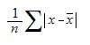{border="0"}

[]{style="FONT-FAMILY: 'Trebuchet MS','sans-serif'; COLOR: #15428b; FONT-SIZE: 9pt"} 

[·      ]{style="FONT-FAMILY: Symbol"}where x-bar is the arithmetic mean of the data.

 

[]{#p131} 

###### 4.1.4.6.6.11        AVERAGE {#average style="tab-stops: 0pt"}

[]{style="FONT-FAMILY: 'Trebuchet MS','sans-serif'; COLOR: #15428b; FONT-SIZE: 9pt"} 

Returns the average (arithmetic mean) of the arguments.

 

**Syntax**

 

**AVERAGE(number1, number2, \...)**, where:

 

**number1,** **number2, \...** are numeric arguments for which you want the average.

[]{style="FONT-FAMILY: 'Trebuchet MS','sans-serif'; COLOR: #15428b; FONT-SIZE: 9pt"} 

Remarks

[]{style="FONT-FAMILY: 'Trebuchet MS','sans-serif'; COLOR: #15428b; FONT-SIZE: 9pt"} 

[·      ]{style="FONT-FAMILY: Symbol"}The arguments must either be numbers or names, arrays or references that contain numbers.

[·      ]{style="FONT-FAMILY: Symbol"}If an array or reference argument contains text, logical values or empty cells, those values are ignored; however, cells with a zero value are included.

 

[]{#p132} 

###### 4.1.4.6.6.12        AVERAGEA {#averagea style="tab-stops: 0pt"}

[]{style="FONT-FAMILY: 'Trebuchet MS','sans-serif'; COLOR: #15428b; FONT-SIZE: 9pt"} 

Calculates the average (arithmetic mean) of the values in the list of arguments. In addition to numbers and text  logical values such as True and False are also included in the calculation.

 

**Syntax**

 

**AVERAGEA(value1**, **value2, \...)**, where:

 

**value1, value2, \...** are cells, ranges of cells, or values for which you want the average.

[]{style="FONT-FAMILY: 'Trebuchet MS','sans-serif'; COLOR: #15428b; FONT-SIZE: 9pt"} 

Remarks

[]{style="FONT-FAMILY: 'Trebuchet MS','sans-serif'; COLOR: #15428b; FONT-SIZE: 9pt"} 

[·      ]{style="FONT-FAMILY: Symbol"}The arguments must be numbers, names, arrays, or references.

[·      ]{style="FONT-FAMILY: Symbol"}Array or reference arguments that contain text evaluate as 0 (zero). If the calculation should not include text values in the average, then use the AVERAGE function.

[·      ]{style="FONT-FAMILY: Symbol"}Arguments that contain True evaluate as 1; arguments that contain False evaluate as 0 (zero).

 

[]{#p133} 

###### 4.1.4.6.6.13        AVG {#avg style="tab-stops: 0pt"}

[]{style="FONT-FAMILY: 'Trebuchet MS','sans-serif'; COLOR: #15428b; FONT-SIZE: 9pt"} 

Returns the average (arithmetic mean) of the arguments.

 

**Syntax**

 

**AVG(number1, number2, \...)**, where:

 

**number1, number2, \...** are numeric arguments for which, you want the average.

 

**Remarks**

[]{style="FONT-FAMILY: 'Trebuchet MS','sans-serif'; COLOR: #15428b; FONT-SIZE: 9pt"} 

[·      ]{style="FONT-FAMILY: Symbol"}This method is the same as AVERAGE and is included for compatibility purposes.

 

[]{#p134} 

###### 4.1.4.6.6.14        BINOMDIST {#binomdist style="tab-stops: 0pt"}

[]{style="FONT-FAMILY: 'Trebuchet MS','sans-serif'; COLOR: #15428b; FONT-SIZE: 9pt"} 

Returns the individual term binomial distribution probability.

 

**Syntax**

 

**BINOMDIST(number_s, trials, probability_s, cumulative)**, where:

 

**number_s**[  ]{style="FONT-FAMILY: 'Times New Roman','serif'; FONT-SIZE: 12pt"}is the number of successes in trials.

**trials**[ ]{style="FONT-FAMILY: 'Times New Roman','serif'; FONT-SIZE: 12pt"}is the number of independent trials.

**probability_s  **is the probability of success on each trial.

**Cumulative**[ ]{style="FONT-FAMILY: 'Times New Roman','serif'; FONT-SIZE: 12pt"}is a logical value that determines the form of the function. If cumulative is True, then**[ ]{style="COLOR: red"}**BINOMDIST returns the cumulative distribution which, is the probability that there are at most number_s successes; if False, it returns the probability that there are exactly number_s successes.

[]{style="FONT-FAMILY: 'Trebuchet MS','sans-serif'; COLOR: #15428b; FONT-SIZE: 9pt"} 

Remarks

[]{style="FONT-FAMILY: 'Trebuchet MS','sans-serif'; COLOR: #15428b; FONT-SIZE: 9pt"} 

[·      ]{style="FONT-FAMILY: Symbol"}Number_s and trials are truncated to integers.

[·      ]{style="FONT-FAMILY: Symbol"}Number_s should be \>= 0 and \<= trials.

[·      ]{style="FONT-FAMILY: Symbol"}Probability_s  should be \>=0 and \<= 1.

[·      ]{style="FONT-FAMILY: Symbol"}The binomial probability mass function is,

[]{style="FONT-FAMILY: 'Trebuchet MS','sans-serif'; COLOR: #15428b; FONT-SIZE: 9pt"} 

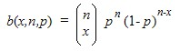{border="0"}

[]{style="FONT-FAMILY: 'Trebuchet MS','sans-serif'; COLOR: #15428b; FONT-SIZE: 9pt"} 

where:

[]{style="FONT-FAMILY: 'Trebuchet MS','sans-serif'; COLOR: #15428b; FONT-SIZE: 9pt"} 

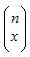{border="0"} 

 

is COMBIN(n,x).

[]{style="FONT-FAMILY: 'Trebuchet MS','sans-serif'; COLOR: #15428b; FONT-SIZE: 9pt"} 

[·      ]{style="FONT-FAMILY: Symbol"}The cumulative binomial distribution is,

[]{style="FONT-FAMILY: 'Trebuchet MS','sans-serif'; COLOR: #15428b; FONT-SIZE: 9pt"} 

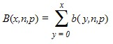{border="0"}

 

[]{#p135} 

###### 4.1.4.6.6.15        CEILING {#ceiling style="tab-stops: 0pt"}

[]{style="FONT-FAMILY: 'Trebuchet MS','sans-serif'; COLOR: #15428b; FONT-SIZE: 9pt"} 

Returns number rounded up, away from zero, to the nearest multiple of significance. For example, if you want to avoid using pennies in your prices and your product is priced at \$4.82, use the formula =CEILING(4.82,0.05) to round prices up to the nearest nickel.

[]{style="FONT-FAMILY: 'Trebuchet MS','sans-serif'; COLOR: #15428b; FONT-SIZE: 9pt"} 

Syntax

[]{style="FONT-FAMILY: 'Trebuchet MS','sans-serif'; COLOR: #15428b; FONT-SIZE: 9pt"} 

**CEILING(number, significance),** where:

 

**number**[ ]{style="FONT-FAMILY: 'Times New Roman','serif'; FONT-SIZE: 12pt"}is the value you want to round off.

**significance** is the multiple to which you want to round.

 

Remarks

 

[·      ]{style="FONT-FAMILY: Symbol"}Both values must be numeric.

[·      ]{style="FONT-FAMILY: Symbol"}Regardless of the sign of a number, a value is rounded up when adjusted away from zero. If the number is an exact multiple of significance, no rounding occurs.

 

[]{#p136} 

###### 4.1.4.6.6.16        CHIDIST {#chidist style="tab-stops: 0pt"}

[]{style="FONT-FAMILY: 'Trebuchet MS','sans-serif'; COLOR: #15428b; FONT-SIZE: 9pt"} 

Returns the one-tailed probability of the chi-squared ([χ]{style="FONT-SIZE: 12pt"}[2]{style="POSITION: relative; FONT-SIZE: 6pt; TOP: -2.5pt"}[ ]{style="FONT-FAMILY: 'Times New Roman','serif'; FONT-SIZE: 12pt"}) distribution. The[ ]{style="FONT-FAMILY: 'Times New Roman','serif'; FONT-SIZE: 12pt"}[χ]{style="FONT-SIZE: 12pt"}[2]{style="POSITION: relative; FONT-SIZE: 6pt; TOP: -2.5pt"}[ ]{style="FONT-FAMILY: 'Times New Roman','serif'; FONT-SIZE: 12pt"}distribution is associated with a [χ]{style="FONT-SIZE: 12pt"}[2]{style="POSITION: relative; FONT-SIZE: 6pt; TOP: -2.5pt"}[ ]{style="FONT-FAMILY: 'Times New Roman','serif'; FONT-SIZE: 12pt"}test.

 

**Syntax**

 

**CHIDIST(x, degrees_freedom)**, where:

 

**x** is the value at which you want to evaluate the distribution.

**degrees_freedom**[ ]{style="FONT-FAMILY: 'Times New Roman','serif'; FONT-SIZE: 12pt"}is the number of degrees of freedom.

[]{style="FONT-FAMILY: 'Trebuchet MS','sans-serif'; COLOR: #15428b; FONT-SIZE: 9pt"} 

Remarks

[]{style="FONT-FAMILY: 'Trebuchet MS','sans-serif'; COLOR: #15428b; FONT-SIZE: 9pt"} 

[·      ]{style="FONT-FAMILY: Symbol"}Both arguments should be numeric.

[·      ]{style="FONT-FAMILY: Symbol"}degrees_freedom  \>= 1 and \< 10\^10.

[·      ]{style="FONT-FAMILY: Symbol"}CHIDIST is calculated as CHIDIST = P(X \> x), where X is a [χ]{style="FONT-SIZE: 12pt"}[2]{style="POSITION: relative; FONT-SIZE: 6pt; TOP: -2.5pt"}[ ]{style="FONT-FAMILY: 'Times New Roman','serif'; FONT-SIZE: 12pt"}random variable.

 

[]{#p137} 

###### 4.1.4.6.6.17        CHIINV {#chiinv style="tab-stops: 0pt"}

[]{style="FONT-FAMILY: 'Trebuchet MS','sans-serif'; COLOR: #15428b; FONT-SIZE: 9pt"} 

Returns the inverse of the one-tailed probability of the chi-squared ([χ]{style="FONT-SIZE: 12pt"}[2]{style="POSITION: relative; FONT-SIZE: 6pt; TOP: -2.5pt"}) distribution. If probability = CHIDIST(x,\...), then CHIINV(probability,\...) = x. Use this function to compare observed results with expected ones in order to decide whether your original hypothesis is valid.

 

**Syntax**

 

**CHIINV(probability, degrees_freedom)**, where:

 

**probability**[ ]{style="FONT-FAMILY: 'Times New Roman','serif'; FONT-SIZE: 12pt"}is a probability associated with the chi-squared distribution.

**degrees_freedom**[ ]{style="FONT-FAMILY: 'Times New Roman','serif'; FONT-SIZE: 12pt"}is the number of degrees of freedom.

[]{style="FONT-FAMILY: 'Trebuchet MS','sans-serif'; COLOR: #15428b; FONT-SIZE: 9pt"} 

Remarks

[]{style="FONT-FAMILY: 'Trebuchet MS','sans-serif'; COLOR: #15428b; FONT-SIZE: 9pt"} 

[·      ]{style="FONT-FAMILY: Symbol"}Probability must be \>= 0 and \<= 1.

[·      ]{style="FONT-FAMILY: Symbol"}degrees_freedom \>=1 and  = 10\^10.

[]{style="FONT-FAMILY: 'Trebuchet MS','sans-serif'; COLOR: #15428b; FONT-SIZE: 9pt"} 

Given a value for probability, CHIINV seeks the value x such that CHIDIST(x, degrees_freedom) = probability. Thus, precision of CHIINV depends on precision of CHIDIST. CHIINV uses an iterative search technique.

 

[]{#p138} 

###### 4.1.4.6.6.18        CHI- TEST {#chi--test style="tab-stops: 0pt"}

[]{style="FONT-FAMILY: 'Trebuchet MS','sans-serif'; COLOR: #15428b; FONT-SIZE: 9pt"} 

Returns the test for independence. CHITEST returns the value from the chi-squared (c2) distribution for the statistic and the appropriate degrees of freedom.

[]{style="FONT-FAMILY: 'Trebuchet MS','sans-serif'; COLOR: #15428b; FONT-SIZE: 9pt"} 

Syntax

[]{style="FONT-FAMILY: 'Trebuchet MS','sans-serif'; COLOR: #15428b; FONT-SIZE: 9pt"} 

**CHITEST(actual_range, expected_range),** where:

 

**actual_range**[ ]{style="FONT-FAMILY: 'Times New Roman','serif'; FONT-SIZE: 12pt"}is the range of data that contains observations to test against expected values.

**expected_range**[ ]{style="FONT-FAMILY: 'Times New Roman','serif'; FONT-SIZE: 12pt"}is the range of data that contains the ratio of the product of row totals and column totals to the grand total.

[]{style="FONT-FAMILY: 'Trebuchet MS','sans-serif'; COLOR: #15428b; FONT-SIZE: 9pt"} 

Remarks

[]{style="FONT-FAMILY: 'Trebuchet MS','sans-serif'; COLOR: #15428b; FONT-SIZE: 9pt"} 

[·      ]{style="FONT-FAMILY: Symbol"}The[ ]{style="FONT-FAMILY: 'Times New Roman','serif'; FONT-SIZE: 12pt"}[χ]{style="FONT-SIZE: 12pt"}[2]{style="POSITION: relative; FONT-SIZE: 6pt; TOP: -2.5pt"}[ ]{style="FONT-FAMILY: 'Times New Roman','serif'; FONT-SIZE: 12pt"}test first calculates a[ ]{style="FONT-FAMILY: 'Times New Roman','serif'; FONT-SIZE: 12pt"}[χ]{style="FONT-SIZE: 12pt"}[2]{style="POSITION: relative; FONT-SIZE: 6pt; TOP: -2.5pt"} statistic using the formula,

[]{style="FONT-FAMILY: 'Trebuchet MS','sans-serif'; COLOR: #15428b; FONT-SIZE: 9pt"} 

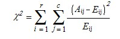{border="0"}

[]{style="FONT-FAMILY: 'Trebuchet MS','sans-serif'; COLOR: #15428b; FONT-SIZE: 9pt"} 

      where:

 

[    ]{style="FONT-FAMILY: 'Times New Roman','serif'; FONT-SIZE: 12pt"}    Aij = actual frequency in the i-th row, j-th column

        Eij = expected frequency in the i-th row, j-th column

        r = number of rows

        c = number of columns

       A low value of [χ]{style="FONT-SIZE: 12pt"}[2]{style="POSITION: relative; FONT-SIZE: 6pt; TOP: -2.5pt"} is an indicator of independence.

[]{style="FONT-FAMILY: 'Trebuchet MS','sans-serif'; COLOR: #15428b; FONT-SIZE: 9pt"} 

The use of CHITEST is most appropriate when Eij\'s are not too small. Some statisticians suggest that each Eij should be greater than or equal to 5.

 

[]{#p139} 

###### 4.1.4.6.6.19        COMBIN {#combin style="tab-stops: 0pt"}

[]{style="FONT-FAMILY: 'Trebuchet MS','sans-serif'; COLOR: #15428b; FONT-SIZE: 9pt"} 

Returns the number of combinations for a given number of items. Use COMBIN to determine the total possible number of groups for a given number of items.

[]{style="FONT-FAMILY: 'Trebuchet MS','sans-serif'; COLOR: #15428b; FONT-SIZE: 9pt"} 

**Syntax**

 

**COMBIN(number, number_chosen)**, where:

 

**number** is the number of items.

**number_chosen** is the number of items in each combination.

[]{style="FONT-FAMILY: 'Trebuchet MS','sans-serif'; COLOR: #15428b; FONT-SIZE: 9pt"} 

Remarks

[]{style="FONT-FAMILY: 'Trebuchet MS','sans-serif'; COLOR: #15428b; FONT-SIZE: 9pt"} 

[·      ]{style="FONT-FAMILY: Symbol"}Numeric arguments are truncated to integers.

[·      ]{style="FONT-FAMILY: Symbol"}A combination is any set or subset of items, regardless of their internal order. Combinations are distinct from permutations where the internal order is significant.

[·      ]{style="FONT-FAMILY: Symbol"}The number of combinations is as follows, where number = n and number_chosen = k,

[]{style="FONT-FAMILY: 'Trebuchet MS','sans-serif'; COLOR: #15428b; FONT-SIZE: 9pt"} 

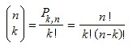{border="0"}

[]{style="FONT-FAMILY: 'Trebuchet MS','sans-serif'; COLOR: #15428b; FONT-SIZE: 9pt"} 

where:

[]{style="FONT-FAMILY: 'Trebuchet MS','sans-serif'; COLOR: #15428b; FONT-SIZE: 9pt"} 

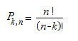{border="0"}

 

[]{#p140} 

###### 4.1.4.6.6.20        CONCATENATE {#concatenate style="tab-stops: 0pt"}

[]{style="FONT-FAMILY: 'Trebuchet MS','sans-serif'; COLOR: #15428b; FONT-SIZE: 9pt"} 

Joins several text strings into one text string.

[]{style="FONT-FAMILY: 'Trebuchet MS','sans-serif'; COLOR: #15428b; FONT-SIZE: 9pt"} 

Syntax

 

**CONCATENATE (text1, text2, \...)**, where:

 

**text1,[ ]{style="FONT-FAMILY: 'Times New Roman','serif'; FONT-SIZE: 12pt"}text2, \...** are text items to be joined into a single text item. The text items can be text strings, numbers, or single-cell references.

[]{style="FONT-FAMILY: 'Trebuchet MS','sans-serif'; COLOR: #15428b; FONT-SIZE: 9pt"} 

Remarks

[]{style="FONT-FAMILY: 'Trebuchet MS','sans-serif'; COLOR: #15428b; FONT-SIZE: 9pt"} 

[·      ]{style="FONT-FAMILY: Symbol"}The \"&\" operator can be used instead of CONCATENATE to join text items.

 

[]{#p141} 

###### 4.1.4.6.6.21        CONFIDENCE {#confidence style="tab-stops: 0pt"}

[]{style="FONT-FAMILY: 'Trebuchet MS','sans-serif'; COLOR: #15428b; FONT-SIZE: 9pt"} 

Returns a value that you can use to construct a confidence interval about a population mean. The confidence interval is a range of values. In your sample, mean x is at the center of this range and the range is x ± CONFIDENCE. For example, if x is the sample mean of delivery times for products ordered through the mail, x ± CONFIDENCE is a range of population means.

[]{style="FONT-FAMILY: 'Trebuchet MS','sans-serif'; COLOR: #15428b; FONT-SIZE: 9pt"} 

Syntax

[]{style="FONT-FAMILY: 'Trebuchet MS','sans-serif'; COLOR: #15428b; FONT-SIZE: 9pt"} 

**CONFIDENCE(alpha, standard_dev, size),** where:

 

**alpha** is the significance level used to compute the confidence level. The confidence level equals 100\*(1 - alpha)%, or in other words, an alpha of 0.05 indicates a 95 percent confidence level.

**standard_dev**[ ]{style="FONT-FAMILY: 'Times New Roman','serif'; FONT-SIZE: 12pt"}is the population standard deviation for the data range and is assumed to be known.

**size** is the sample size.

[]{style="FONT-FAMILY: 'Trebuchet MS','sans-serif'; COLOR: #15428b; FONT-SIZE: 9pt"} 

Remarks

[]{style="FONT-FAMILY: 'Trebuchet MS','sans-serif'; COLOR: #15428b; FONT-SIZE: 9pt"} 

[·      ]{style="FONT-FAMILY: Symbol"}All arguments must be non-numeric.

[·      ]{style="FONT-FAMILY: Symbol"}Alpha must be \> 0 and \< 1.

[·      ]{style="FONT-FAMILY: Symbol"}Standard_dev must be \> 0.

[·      ]{style="FONT-FAMILY: Symbol"}Size must be \>= 1.

 

[]{#p142} 

###### 4.1.4.6.6.22        CORREL {#correl style="tab-stops: 0pt"}

[]{style="FONT-FAMILY: 'Trebuchet MS','sans-serif'; COLOR: #15428b; FONT-SIZE: 9pt"} 

Returns the correlation coefficient of the array1 and array2 cell ranges.

 

**Syntax**

 

**CORREL(array1, array2)**, where:

 

**array1 **is a cell range of values.

**array2** is the second cell range of values.

 

**Remarks**

[]{style="FONT-FAMILY: 'Trebuchet MS','sans-serif'; COLOR: #15428b; FONT-SIZE: 9pt"} 

[·      ]{style="FONT-FAMILY: Symbol"}array1 and array2 must have the same number of data points.

[·      ]{style="FONT-FAMILY: Symbol"}The equation for the correlation coefficient is,

[]{style="FONT-FAMILY: 'Trebuchet MS','sans-serif'; COLOR: #15428b; FONT-SIZE: 9pt"} 

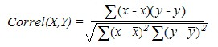{border="0"}

[]{style="FONT-FAMILY: 'Trebuchet MS','sans-serif'; COLOR: #15428b; FONT-SIZE: 9pt"} 

where x-bar and y-bar are the sample means AVERAGE(array1) and AVERAGE(array2).

 

[]{#p143} 

###### 4.1.4.6.6.23        COS {#cos style="tab-stops: 0pt"}

[]{style="FONT-FAMILY: 'Trebuchet MS','sans-serif'; COLOR: #15428b; FONT-SIZE: 9pt"} 

Returns the cosine of the given angle.

[]{style="FONT-FAMILY: 'Trebuchet MS','sans-serif'; COLOR: #15428b; FONT-SIZE: 9pt"} 

Syntax

 

**COS(number)**, where:

 

**number**[ ]{style="FONT-FAMILY: 'Times New Roman','serif'; FONT-SIZE: 12pt"}is the angle in radians for which you want the cosine.

 

[]{#p144} 

###### 4.1.4.6.6.24        COSH {#cosh style="tab-stops: 0pt"}

[]{style="FONT-FAMILY: 'Trebuchet MS','sans-serif'; COLOR: #15428b; FONT-SIZE: 9pt"} 

Returns the hyperbolic cosine of a number.

[]{style="FONT-FAMILY: 'Trebuchet MS','sans-serif'; COLOR: #15428b; FONT-SIZE: 9pt"} 

Syntax

[]{style="FONT-SIZE: 9pt"} 

**[COSH(number),]{style="FONT-SIZE: 9pt"}**[ where:]{style="FONT-SIZE: 9pt"}

[]{style="FONT-SIZE: 9pt"} 

**[number]{style="FONT-SIZE: 9pt"}[ ]{style="COLOR: red"}**[is any real number for which you want to find the hyperbolic cosine.]{style="FONT-SIZE: 9pt"}

[]{style="FONT-SIZE: 9pt"} 

Remarks

[]{style="FONT-SIZE: 9pt"} 

[The formula for the hyperbolic cosine is,]{style="FONT-SIZE: 9pt"}

[]{style="FONT-FAMILY: 'Trebuchet MS','sans-serif'; COLOR: #15428b; FONT-SIZE: 9pt"} 

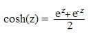{border="0"}

 

[]{#p145} 

###### 4.1.4.6.6.25        COUNT {#count style="tab-stops: 0pt"}

[]{style="FONT-FAMILY: 'Trebuchet MS','sans-serif'; COLOR: #15428b; FONT-SIZE: 9pt"} 

Counts the number of items in a list that contains numbers.

 

**Syntax**

 

**COUNT(value1,** **value2, \...)**, where:

 

**value1,[ ]{style="FONT-FAMILY: 'Times New Roman','serif'; FONT-SIZE: 12pt"}value2, \...** are arguments that can contain or refer to a variety of different types of data but, only numbers are counted.

[]{style="FONT-FAMILY: 'Trebuchet MS','sans-serif'; COLOR: #15428b; FONT-SIZE: 9pt"} 

Remarks

[]{style="FONT-FAMILY: 'Trebuchet MS','sans-serif'; COLOR: #15428b; FONT-SIZE: 9pt"} 

[·      ]{style="FONT-FAMILY: Symbol"}Arguments that are numbers, dates or text representations of numbers are counted; arguments that are error values or text that cannot be translated into numbers are ignored.

[·      ]{style="FONT-FAMILY: Symbol"}If an argument is an array or reference, only numbers in that array or reference are counted. Empty cells, logical values, text or error values in the array or reference are ignored.

 

[]{#p146} 

###### 4.1.4.6.6.26        COUNTA {#counta style="tab-stops: 0pt"}

[]{style="FONT-FAMILY: 'Trebuchet MS','sans-serif'; COLOR: #15428b; FONT-SIZE: 9pt"} 

Counts the number of cells that are not empty.

 

**Syntax**

 

**COUNTA(value1, value2, \...)**, where:

 

**value1,[ ]{style="FONT-FAMILY: 'Times New Roman','serif'; FONT-SIZE: 12pt"}value2, \...** are arguments representing the values you want to count. In this case, a value is any type of information, excluding empty cells.

 

[]{#p147} 

###### 4.1.4.6.6.27        COUNTBLANK {#countblank style="tab-stops: 0pt"}

[]{style="FONT-FAMILY: 'Trebuchet MS','sans-serif'; COLOR: #15428b; FONT-SIZE: 9pt"} 

Counts empty cells in a specified range of cells.

 

**Syntax**

 

**COUNTBLANK(range)**, where:

 

**range[ ]{style="COLOR: red"}**is the range from which you want to count the blank cells.

[]{style="FONT-FAMILY: 'Trebuchet MS','sans-serif'; COLOR: #15428b; FONT-SIZE: 9pt"} 

Remark

[]{style="FONT-FAMILY: 'Trebuchet MS','sans-serif'; COLOR: #15428b; FONT-SIZE: 9pt"} 

[·      ]{style="FONT-FAMILY: Symbol"}Cells with formulas that return \"\" (empty text) are also counted. Cells with zero values are not counted.

 

[]{#p148} 

###### 4.1.4.6.6.28        COUNTIF {#countif style="tab-stops: 0pt"}

[]{style="FONT-FAMILY: 'Trebuchet MS','sans-serif'; COLOR: #15428b; FONT-SIZE: 9pt"} 

Counts the number of cells within a range that meet the given criteria.

 

**Syntax**

 

**COUNTIF(range, criteria)**, where:

 

**range**[ ]{style="FONT-FAMILY: 'Times New Roman','serif'; FONT-SIZE: 12pt"}is the range of cells from which you want to count cells.

**criteria **is the criteria in the form of a number, expression or text that defines which cells will be counted. For example, the criteria can be expressed as \"\>32\".

[]{style="FONT-FAMILY: 'Trebuchet MS','sans-serif'; COLOR: #15428b; FONT-SIZE: 9pt"} 

Remark

[]{style="FONT-FAMILY: 'Trebuchet MS','sans-serif'; COLOR: #15428b; FONT-SIZE: 9pt"} 

[·      ]{style="FONT-FAMILY: Symbol"}If and SumIf are other library functions that can be used to conditionally compute values.

 

[]{#p149} 

###### 4.1.4.6.6.29        COVAR {#covar style="tab-stops: 0pt"}

[]{style="FONT-FAMILY: 'Trebuchet MS','sans-serif'; COLOR: #15428b; FONT-SIZE: 9pt"} 

Returns covariance, the average of the products of deviations for each data point pair.

 

**Syntax**

 

**COVAR(array1, array2)**, where:

 

**array1** is the first cell range of numbers.

**array2** is the second cell range of numbers.

[]{style="FONT-FAMILY: 'Trebuchet MS','sans-serif'; COLOR: #15428b; FONT-SIZE: 9pt"} 

Remarks

[]{style="FONT-FAMILY: 'Trebuchet MS','sans-serif'; COLOR: #15428b; FONT-SIZE: 9pt"} 

[·      ]{style="FONT-FAMILY: Symbol"}The arguments must either be numbers or be names, arrays or references that contain numbers.

[·      ]{style="FONT-FAMILY: Symbol"}array1 and array2 must have the same number of data points.

[·      ]{style="FONT-FAMILY: Symbol"}The covariance is,

[]{style="FONT-FAMILY: 'Trebuchet MS','sans-serif'; COLOR: #15428b; FONT-SIZE: 9pt"} 

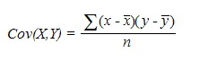{border="0"}

[]{style="FONT-FAMILY: 'Trebuchet MS','sans-serif'; COLOR: #15428b; FONT-SIZE: 9pt"} 

where X is array1, Y is array2, x-bar and y-bar are the sample means AVERAGE(array1) and AVERAGE(array2) and n is the sample size.

 

[]{#p150} 

###### 4.1.4.6.6.30        CRITBINOM {#critbinom style="tab-stops: 0pt"}

[]{style="FONT-FAMILY: 'Trebuchet MS','sans-serif'; COLOR: #15428b; FONT-SIZE: 9pt"} 

Returns the smallest value for which, the cumulative binomial distribution is greater than or equal to a criterion value.

 

**Syntax**

 

**CRITBINOM(trials, probability_s, alpha)**, where:

 

**trials** is the number of Bernoulli trials.

**probability_s**[ ]{style="FONT-FAMILY: 'Times New Roman','serif'; FONT-SIZE: 12pt"}is the probability of a success on each trial.

**alpha**[ ]{style="FONT-FAMILY: 'Times New Roman','serif'; FONT-SIZE: 12pt"}is the criterion value.

[]{style="FONT-FAMILY: 'Trebuchet MS','sans-serif'; COLOR: #15428b; FONT-SIZE: 9pt"} 

Remarks

[]{style="FONT-FAMILY: 'Trebuchet MS','sans-serif'; COLOR: #15428b; FONT-SIZE: 9pt"} 

[·      ]{style="FONT-FAMILY: Symbol"}Trials must be \>= 0.

[·      ]{style="FONT-FAMILY: Symbol"}Probability_s must be \>=0 and \<= 1.

[·      ]{style="FONT-FAMILY: Symbol"}Alpha must be \>= 0 and \<= 1.

 

[]{#p151} 

###### 4.1.4.6.6.31        DATE {#date style="tab-stops: 0pt"}

[]{style="FONT-FAMILY: 'Trebuchet MS','sans-serif'; COLOR: #15428b; FONT-SIZE: 9pt"} 

Returns the sequential serial number that represents a particular date.

 

**Syntax**

 

**DATE(year, month, day)**, where:

 

**year[ ]{style="COLOR: red"}**can be one to four digits. Year is interpreted based on 1900.

 

[·      ]{style="FONT-FAMILY: Symbol"}If a year is between 0 (zero) and 1899 (inclusive), the value is added to 1900 to calculate the year. For example, DATE(102,11,12) returns November 12, 2002 (1900+102).

[·      ]{style="FONT-FAMILY: Symbol"}If a year is between 1900 and 9999 (inclusive), the value is used as is, for example, DATE(2002,11,12) returns November 12, 2002.

**month** is a number representing the month of the year.

**day**[ ]{style="FONT-FAMILY: 'Times New Roman','serif'; FONT-SIZE: 12pt"}is a number representing the day of the month.

[]{style="FONT-FAMILY: 'Trebuchet MS','sans-serif'; COLOR: #15428b; FONT-SIZE: 9pt"} 

Remark

[]{style="FONT-FAMILY: 'Trebuchet MS','sans-serif'; COLOR: #15428b; FONT-SIZE: 9pt"} 

[·      ]{style="FONT-FAMILY: Symbol"}Dates are stored as sequential serial numbers so that they can be used in calculations. By default, January 1, 1900 is serial number 1 and November 12, 2002 is serial number 37572 because it is 37572 days after January 1, 1900.

 

[]{#p152} 

###### 4.1.4.6.6.32        DATEVALUE {#datevalue style="tab-stops: 0pt"}

[]{style="FONT-FAMILY: 'Trebuchet MS','sans-serif'; COLOR: #15428b; FONT-SIZE: 9pt"} 

Returns the serial number of the date represented by the date_text.

 

**Syntax**

 

**DATEVALUE(date_text)**, where:

 

**date_text **is the text that represents a date as a formatted string. For example, \"11/12/2002\" or \"12-Nov-2002\" are text strings within quotation marks that represent dates. If the year portion of the date_text is omitted, DATEVALUE uses the current year from your computer\'s built-in clock. The time information in the date_text is ignored.

[]{style="FONT-FAMILY: 'Trebuchet MS','sans-serif'; COLOR: #15428b; FONT-SIZE: 9pt"} 

Remarks

[]{style="FONT-FAMILY: 'Trebuchet MS','sans-serif'; COLOR: #15428b; FONT-SIZE: 9pt"} 

[·      ]{style="FONT-FAMILY: Symbol"}Dates are stored as sequential serial numbers so that they can be used in calculations. By default, January 1, 1900 is serial number 1, and November 12, 2002 is serial number 37572 because it is 37572 days after January 1, 1900.

[·      ]{style="FONT-FAMILY: Symbol"}Most functions automatically convert date values to serial numbers.

 

[]{#p153} 

###### 4.1.4.6.6.33        DAY {#day style="tab-stops: 0pt"}

[]{style="FONT-FAMILY: 'Trebuchet MS','sans-serif'; COLOR: #15428b; FONT-SIZE: 9pt"} 

Returns the day of a date, represented by a serial number. The day is given as an integer ranging from 1 to 31.

 

**Syntax**

 

**DAY(serial_number)**, where:

 

**serial_number[ ]{style="COLOR: red"}**is the date of the day you are trying to find. Dates should be entered by using the DATE function or as results of other formulas or functions. For example, use DATE(2002,4,23) for the 23rd day of April, 2002.

 

[]{#p154} 

###### 4.1.4.6.6.34        DAYS360 {#days360 style="tab-stops: 0pt"}

[]{style="FONT-FAMILY: 'Trebuchet MS','sans-serif'; COLOR: #15428b; FONT-SIZE: 9pt"} 

Returns the number of days between two dates based on a 360-day year (twelve 30-day months) which, is used in some accounting calculations.

 

**Syntax**

 

**DAYS360(start_date, end_date, method)**, where:

 

**start_date** and**[ ]{style="COLOR: red"}end_date**[ ]{style="FONT-FAMILY: 'Times New Roman','serif'; FONT-SIZE: 12pt"}are the two dates between which you want to know the number of days. If start_date occurs after end_date, DAYS360 returns a negative number. Dates should be entered by using the DATE function or as results of other formulas or functions.

**method** is a logical value that specifies whether to use the U.S. or European method in the calculation.

 

If method is:

[·      ]{style="FONT-FAMILY: Symbol"}**False or omitted** -- The calculation uses the U.S. (NASD) method. If the starting date is the 31st of a month, it becomes equal to the 30th of the same month. If the ending date is the 31st of a month and the starting date is earlier than the 30th of a month, the ending date becomes equal to the 1st of the next month; otherwise the ending date becomes equal to the 30th of the same month.

[·      ]{style="FONT-FAMILY: Symbol"}**True** -- The calculation uses the European method. Starting dates and ending dates that occur on the 31st of a month become equal to the 30th of the same month.

 

[]{#p155} 

###### 4.1.4.6.6.35        DB {#db style="tab-stops: 0pt"}

 

Returns the**[ ]{style="COLOR: red"}**depreciation of an asset for a specified period using the**[ ]{style="COLOR: red"}**fixed-declining balance method.

 

**Syntax**

 

**DB(cost, salvage, life, period, month)**, where:

 

**cost**[ ]{style="FONT-FAMILY: 'Times New Roman','serif'; FONT-SIZE: 12pt"}is the initial cost of the asset.

**salvage**[ ]{style="FONT-FAMILY: 'Times New Roman','serif'; FONT-SIZE: 12pt"}is the value at the end of the depreciation (sometimes called the salvage value of the asset).

**life** is the number of periods over which the asset is being depreciated (sometimes called the useful life of the asset).

**period**[ ]{style="FONT-FAMILY: 'Times New Roman','serif'; FONT-SIZE: 12pt"}is the period for which you want to calculate the depreciation. Period must use the same units as life.

**month**[ ]{style="FONT-FAMILY: 'Times New Roman','serif'; FONT-SIZE: 12pt"}is the number of months in the first year. If month is omitted, it is assumed to be 12.

[]{style="FONT-FAMILY: 'Trebuchet MS','sans-serif'; COLOR: #15428b; FONT-SIZE: 9pt"} 

Remarks

[]{style="FONT-FAMILY: 'Trebuchet MS','sans-serif'; COLOR: #15428b; FONT-SIZE: 9pt"} 

[·      ]{style="FONT-FAMILY: Symbol"}The fixed-declining balance method computes the depreciation at a fixed rate. DB uses the following formulas to calculate the depreciation for a period,

 

**(cost - total depreciation from prior periods) \* rate**

               

where rate = 1 - ((salvage / cost) \^ (1 / life)), rounded to three decimal places.

 

[·      ]{style="FONT-FAMILY: Symbol"}Depreciation for the first and last periods is a special case. For the first period, DB uses this formula,

 

**cost \* rate \* month / 12**

 

[·      ]{style="FONT-FAMILY: Symbol"}For the last period, DB uses this formula,

 

**((cost - total depreciation from prior periods) \* rate \* (12 - month)) / 12**

 

[]{#p156} 

###### 4.1.4.6.6.36        DDB {#ddb style="tab-stops: 0pt"}

[]{style="FONT-FAMILY: 'Trebuchet MS','sans-serif'; COLOR: #15428b; FONT-SIZE: 9pt"} 

Returns the depreciation of an asset for a specified period using the double-declining balance method or some other method you specify.

 

**Syntax**

 

**DDB(cost, salvage, life, period, factor)**, where:

 

**cost**[ ]{style="FONT-FAMILY: 'Times New Roman','serif'; FONT-SIZE: 12pt"}is the initial cost of the asset.

**salvage** is the value at the end of the depreciation (sometimes called the salvage value of the asset).

**life** is the number of periods over which the asset is being depreciated (sometimes called the useful life of the asset).

**period** is the period for which you want to calculate the depreciation. Period must use the same units as life.

**factor**[ ]{style="FONT-FAMILY: 'Times New Roman','serif'; FONT-SIZE: 12pt"}is the rate at which the balance declines. If factor is omitted, it is assumed to be 2 (the double-declining balance method).

[]{style="FONT-FAMILY: 'Trebuchet MS','sans-serif'; COLOR: #15428b; FONT-SIZE: 9pt"} 

::: {style="BORDER-BOTTOM: windowtext 1pt solid; BORDER-LEFT: medium none; PADDING-BOTTOM: 1pt; MARGIN-TOP: 9pt; PADDING-LEFT: 0pt; PADDING-RIGHT: 0pt; MARGIN-BOTTOM: 9pt; BORDER-TOP: windowtext 1pt solid; BORDER-RIGHT: medium none; PADDING-TOP: 1pt"}
{border="0"}Note: All five arguments must be positive numbers.
:::

**[]{style="FONT-FAMILY: 'Trebuchet MS','sans-serif'; COLOR: #15428b; FONT-SIZE: 9pt"}** 

Remarks

[]{style="FONT-FAMILY: 'Trebuchet MS','sans-serif'; COLOR: #15428b; FONT-SIZE: 9pt"} 

[·      ]{style="FONT-FAMILY: Symbol"}The double-declining balance method computes the depreciation at an accelerated rate. Depreciation is highest in the first period and decreases in successive periods. DDB uses the following formula to calculate depreciation for a period,

**((cost-salvage) - total depreciation from prior periods) \* (factor/life)**

[]{#p157} 

 

###### 4.1.4.6.6.37        DEGREES {#degrees style="tab-stops: 0pt"}

[]{style="FONT-FAMILY: 'Trebuchet MS','sans-serif'; COLOR: #15428b; FONT-SIZE: 9pt"} 

Converts radians into degrees.

 

**Syntax**

 

**DEGREES(angle)**, where:

 

**angle** is the angle in radians that you want to convert.

 

[]{#p158} 

###### 4.1.4.6.6.38        DEVSQ {#devsq style="tab-stops: 0pt"}

 

Returns the sum of squares of deviations of data points from their sample mean.

[]{style="FONT-FAMILY: 'Trebuchet MS','sans-serif'; COLOR: #15428b; FONT-SIZE: 9pt"} 

Syntax

[]{style="FONT-FAMILY: 'Trebuchet MS','sans-serif'; COLOR: #15428b; FONT-SIZE: 9pt"} 

DEVSQ(number1, number2, \...), where:

 

number1, number2, \... are arguments for which you want to calculate the sum of squared deviations. You can also use a single array or a reference to an array instead of arguments separated by commas.

[]{style="FONT-FAMILY: 'Trebuchet MS','sans-serif'; COLOR: #15428b; FONT-SIZE: 9pt"} 

Remarks

[]{style="FONT-FAMILY: 'Trebuchet MS','sans-serif'; COLOR: #15428b; FONT-SIZE: 9pt"} 

[·      ]{style="FONT-FAMILY: Symbol"}The arguments must be numbers or names, arrays or references that contain numbers.

[·      ]{style="FONT-FAMILY: Symbol"}The equation for the sum of squared deviations is,

[]{style="FONT-FAMILY: 'Trebuchet MS','sans-serif'; COLOR: #15428b; FONT-SIZE: 9pt"} 

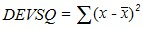{border="0"}

 

###### 4.1.4.6.6.39        Dollar {#dollar style="tab-stops: 0pt"}

The Dollar function converts a number to text, using currency format.

The format used is \$#,##0.00\_);(\$#,##0.00).

 

Syntax:

**Dollar (number, decimal_places)**

Where:

**number** is the number, which you want to convert to text.

**decimal_places** is the number of decimal digits to be displayed. The value will be rounded off accordingly.

 

[]{#p159} 

###### 4.1.4.6.6.40        EVEN {#even style="tab-stops: 0pt"}

[]{style="FONT-FAMILY: 'Trebuchet MS','sans-serif'; COLOR: #15428b; FONT-SIZE: 9pt"} 

Returns the number rounded up**[ ]{style="COLOR: red"}**to the**[ ]{style="COLOR: red"}**nearest even integer.

 

**Syntax**

 

**EVEN(number)**, where:

 

**number**[ ]{style="FONT-FAMILY: 'Times New Roman','serif'; FONT-SIZE: 12pt"}is the value that is to be rounded.

 

**Remarks**

[]{style="FONT-FAMILY: 'Trebuchet MS','sans-serif'; COLOR: #15428b; FONT-SIZE: 9pt"} 

[·      ]{style="FONT-FAMILY: Symbol"}Regardless of the sign of the number a value is rounded up when adjusted away from zero. If the number is an even integer no rounding occurs.

 

[]{#p160} 

###### 4.1.4.6.6.41        EXP {#exp style="tab-stops: 0pt"}

[]{style="FONT-FAMILY: 'Trebuchet MS','sans-serif'; COLOR: #15428b; FONT-SIZE: 9pt"} 

Returns e raised to the power of the given number[.]{style="FONT-FAMILY: 'Times New Roman','serif'; FONT-SIZE: 12pt"}

 

**Syntax**

 

**EXP(number)**, where:

 

**number**[ ]{style="FONT-FAMILY: 'Times New Roman','serif'; FONT-SIZE: 12pt"}is the exponent applied to the base e.

 

[]{#p161} 

###### 4.1.4.6.6.42        EXPONDIST {#expondist style="tab-stops: 0pt"}

[]{style="FONT-FAMILY: 'Trebuchet MS','sans-serif'; COLOR: #15428b; FONT-SIZE: 9pt"} 

Returns the exponential distribution.

 

**Syntax**

 

**EXPONDIST(x, lambda, cumulative)**, where:

 

**x** is the value of the function.

**lambda** is the parameter value.

**cumulative** is a logical value that indicates which form of the exponential function is to be provided. If cumulative is True, EXPONDIST returns the cumulative distribution function; if False, it returns the probability density function.

[]{style="FONT-FAMILY: 'Trebuchet MS','sans-serif'; COLOR: #15428b; FONT-SIZE: 9pt"} 

Remarks

[]{style="FONT-FAMILY: 'Trebuchet MS','sans-serif'; COLOR: #15428b; FONT-SIZE: 9pt"} 

The equation for the probability density function is,

[]{style="FONT-FAMILY: 'Trebuchet MS','sans-serif'; COLOR: #15428b; FONT-SIZE: 9pt"} 

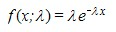{border="0"}

[]{style="FONT-FAMILY: 'Trebuchet MS','sans-serif'; COLOR: #15428b; FONT-SIZE: 9pt"} 

[·      ]{style="FONT-FAMILY: Symbol"}The equation for the cumulative distribution function is,

[]{style="FONT-FAMILY: 'Trebuchet MS','sans-serif'; COLOR: #15428b; FONT-SIZE: 9pt"} 

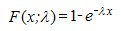{border="0"}

 

[]{#p162} 

###### 4.1.4.6.6.43        FACT {#fact style="tab-stops: 0pt"}

[]{style="FONT-FAMILY: 'Trebuchet MS','sans-serif'; COLOR: #15428b; FONT-SIZE: 9pt"} 

Returns the factorial of a number. The factorial of a number is the product of all positive integers \<= the given number.

 

**Syntax**

 

**FACT(number)**, where:

 

**number** is the non-negative number for which you want the factorial of. If the number is not an integer, it is truncated.

[]{#p163} 

###### 4.1.4.6.6.44        False {#false style="tab-stops: 0pt"}

The False function returns alogical value when the given sting value is false.

 

Syntax:

**False(stringvalue)**

 

where:

**stringvalue** is to provide any text value or empty string.

 

###### 4.1.4.6.6.45        FDIST {#fdist style="tab-stops: 0pt"}

[]{style="FONT-FAMILY: 'Trebuchet MS','sans-serif'; COLOR: #15428b; FONT-SIZE: 9pt"} 

Returns the**[ ]{style="COLOR: red"}**F probability distribution.

 

**Syntax**

\
**FDIST(x, degrees_freedom1, degrees_freedom2)**, where:

 

**x** is the value at which to evaluate the function.

**degrees_freedom1** is the numerator degrees of freedom.

**degrees_freedom2**[ ]{style="FONT-FAMILY: 'Times New Roman','serif'; FONT-SIZE: 12pt"}is the denominator degrees of freedom.

 

**Remarks**

[]{style="FONT-FAMILY: 'Trebuchet MS','sans-serif'; COLOR: #15428b; FONT-SIZE: 9pt"} 

[·      ]{style="FONT-FAMILY: Symbol"}All arguments must be numeric.

[·      ]{style="FONT-FAMILY: Symbol"}X must be \>= 0.

[·      ]{style="FONT-FAMILY: Symbol"}Both degrees_freedom1 and degrees_freedom2 must be \>= 1 and \< 10\^10.

[·      ]{style="FONT-FAMILY: Symbol"}FDIST is calculated as FDIST=P( F\>x ), where F is a random variable that has an F distribution with degrees_freedom1 and degrees_freedom2 degrees of freedom.

 

###### []{#p164}4.1.4.6.6.46        Finv {#finv style="tab-stops: 0pt"}

 

The Finv function returns the inverse of the F probability distribution. If p = FDIST(x,\...), then FINV(p,\...) = x.

Using F distribution, you can compare the degree of variability for two data sets.

 

Syntax:

**FINV(probability,deg_freedom1,deg_freedom2)**

 

The FINV function syntax has the following three arguments (Argument is a value that provides information to an action, an event, a method, a property, a function, or a procedure):

 

**Probability** is a probability associated with the F cumulative distribution.

**Deg_freedom1** is the numerator degrees of freedom.

**Deg_freedom2** is the denominator degrees of freedom.

 

###### 4.1.4.6.6.47        FISHER {#fisher style="tab-stops: 0pt"}

 

Returns the Fisher transformation at x. This transformation produces a function that is normally distributed rather than skewed.

 

**Syntax**

 

**FISHER(x)**, where:

 

**x **is a numeric value for which you want the transformation.

[]{style="FONT-FAMILY: 'Trebuchet MS','sans-serif'; COLOR: #15428b; FONT-SIZE: 9pt"} 

Remarks

[]{style="FONT-FAMILY: 'Trebuchet MS','sans-serif'; COLOR: #15428b; FONT-SIZE: 9pt"} 

[·      ]{style="FONT-FAMILY: Symbol"}X must be \> -1 and \< 1.

[·      ]{style="FONT-FAMILY: Symbol"}The equation for the Fisher transformation is,

[]{style="FONT-FAMILY: 'Trebuchet MS','sans-serif'; COLOR: #15428b; FONT-SIZE: 9pt"} 

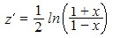{border="0"}

 

[]{#p165} 

###### 4.1.4.6.6.48        FISHERINV {#fisherinv style="tab-stops: 0pt"}

[]{style="FONT-FAMILY: 'Trebuchet MS','sans-serif'; COLOR: #15428b; FONT-SIZE: 9pt"} 

Returns the inverse of the Fisher transformation. If y = FISHER(x), then FISHERINV(y) = x.

 

**Syntax**

 

**FISHERINV(y)**, where:

 

**y** is the value for which you want to perform the inverse of the transformation.

[]{style="FONT-FAMILY: 'Trebuchet MS','sans-serif'; COLOR: #15428b; FONT-SIZE: 9pt"} 

Remarks

[]{style="FONT-FAMILY: 'Trebuchet MS','sans-serif'; COLOR: #15428b; FONT-SIZE: 9pt"} 

[·      ]{style="FONT-FAMILY: Symbol"}The equation for the inverse of the Fisher transformation is,

[]{style="FONT-FAMILY: 'Trebuchet MS','sans-serif'; COLOR: #15428b; FONT-SIZE: 9pt"} 

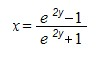{border="0"}

###### []{#p166}4.1.4.6.6.49        Fixed {#fixed style="tab-stops: 0pt"}

The Fixed function rounds off the given value to a specified number of decimal places and returns the value in text format.

 

Syntax:

**Fixed (number, decimal_places, no_commas)**

where:

**number** is the number, which you want to round off.

**decimal_places** is the number of decimal places you want to display in the result.

**no_commas** is a logical value. It will display commas when it is set to FALSE and does not display commas when it is set to TRUE.

 

 

###### 4.1.4.6.6.50        FLOOR {#floor style="tab-stops: 0pt"}

[]{style="FONT-FAMILY: 'Trebuchet MS','sans-serif'; COLOR: #15428b; FONT-SIZE: 9pt"} 

Rounds off the given number down, toward zero, to the nearest multiple of significance.

[]{style="FONT-FAMILY: 'Trebuchet MS','sans-serif'; COLOR: #15428b; FONT-SIZE: 9pt"} 

Syntax

[]{style="FONT-FAMILY: 'Trebuchet MS','sans-serif'; COLOR: #15428b; FONT-SIZE: 9pt"} 

FLOOR(number, significance), where:

 

number is the numeric value that you want to round off.

significance[ ]{style="FONT-FAMILY: 'Times New Roman','serif'; FONT-SIZE: 12pt"}is the multiple to which you want to round the number off.

[]{style="FONT-FAMILY: 'Trebuchet MS','sans-serif'; COLOR: #15428b; FONT-SIZE: 9pt"} 

Remarks

[]{style="FONT-FAMILY: 'Trebuchet MS','sans-serif'; COLOR: #15428b; FONT-SIZE: 9pt"} 

[·      ]{style="FONT-FAMILY: Symbol"}Number and significance must have the same sign.

[·      ]{style="FONT-FAMILY: Symbol"}Regardless of the sign of the number, a value is rounded down when adjusted away from zero. If a number is an exact multiple of significance, no rounding occurs.

 

[]{#p167} 

###### 4.1.4.6.6.51        FORECAST {#forecast style="tab-stops: 0pt"}

[]{style="FONT-FAMILY: 'Trebuchet MS','sans-serif'; COLOR: #15428b; FONT-SIZE: 9pt"} 

Calculates a future value by using existing values using a linear regression. The predicted value is a y-value for a given x-value.

 

**Syntax**

 

**FORECAST(x, known_ys, known_xs)**, where:

 

**x** is the data point for which you want to predict a value.

**known_ys**[ ]{style="FONT-FAMILY: 'Times New Roman','serif'; FONT-SIZE: 12pt"}is the dependent array or range of data.

**known_xs** is the independent array or range of data.

[]{style="FONT-FAMILY: 'Trebuchet MS','sans-serif'; COLOR: #15428b; FONT-SIZE: 9pt"} 

Remarks

[]{style="FONT-FAMILY: 'Trebuchet MS','sans-serif'; COLOR: #15428b; FONT-SIZE: 9pt"} 

[·      ]{style="FONT-FAMILY: Symbol"}The equation for FORECAST is a+bx,

[]{style="FONT-FAMILY: 'Trebuchet MS','sans-serif'; COLOR: #15428b; FONT-SIZE: 9pt"} 

 where:

[]{style="FONT-FAMILY: 'Trebuchet MS','sans-serif'; COLOR: #15428b; FONT-SIZE: 9pt"} 

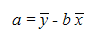{border="0"}

[]{style="FONT-FAMILY: 'Trebuchet MS','sans-serif'; COLOR: #15428b; FONT-SIZE: 9pt"} 

and

[]{style="FONT-FAMILY: 'Trebuchet MS','sans-serif'; COLOR: #15428b; FONT-SIZE: 9pt"} 

 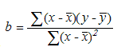{border="0"}

[]{style="FONT-FAMILY: 'Trebuchet MS','sans-serif'; COLOR: #15428b; FONT-SIZE: 9pt"} 

and

[]{style="FONT-FAMILY: 'Trebuchet MS','sans-serif'; COLOR: #15428b; FONT-SIZE: 9pt"} 

x-bar and y-bar are the sample means AVERAGE(known_xs) and AVERAGE(known_ys).

 

[]{#p168} 

###### 4.1.4.6.6.52        FV {#fv style="tab-stops: 0pt"}

[]{style="FONT-FAMILY: 'Trebuchet MS','sans-serif'; COLOR: #15428b; FONT-SIZE: 9pt"} 

Returns the**[ ]{style="COLOR: red"}**future value of an investment based on periodic, constant payments and interest rate.

 

**Syntax**

 

**FV(rate, nper, pmt, pv, type)**, where:

 

**rate** is the interest rate per period.

**nper**[ ]{style="FONT-FAMILY: 'Times New Roman','serif'; FONT-SIZE: 12pt"}is the total number of payment periods in an annuity.

**pmt**[ ]{style="FONT-FAMILY: 'Times New Roman','serif'; FONT-SIZE: 12pt"}is the payment made each period; it cannot change over the life of the annuity. Typically, pmt contains principal and interest but, no other fees or taxes. If pmt is omitted, you must include the pv argument.

**pv** is the present value or lump-sum amount that a series of future payments is worth right now. If pv is omitted, it is assumed to be 0 (zero), and you must include the pmt argument.

**type **is the number 0 or 1 and indicates when payments are due. If type is omitted it is assumed to be 0. If type equals:

[·      ]{style="FONT-FAMILY: Symbol"}0 - Payments are due at the end of the period.

[·      ]{style="FONT-FAMILY: Symbol"}1 - Payments are due at the beginning of the period.

[]{style="FONT-FAMILY: 'Trebuchet MS','sans-serif'; COLOR: #15428b; FONT-SIZE: 9pt"} 

::: {style="BORDER-BOTTOM: windowtext 1pt solid; BORDER-LEFT: medium none; PADDING-BOTTOM: 1pt; MARGIN-TOP: 9pt; PADDING-LEFT: 0pt; PADDING-RIGHT: 0pt; MARGIN-BOTTOM: 9pt; BORDER-TOP: windowtext 1pt solid; BORDER-RIGHT: medium none; PADDING-TOP: 1pt"}
{border="0"}Note: For a more complete description of the arguments in FV, see PV.
:::

[\
]{style="FONT-SIZE: 9pt"}Remarks

[]{style="FONT-FAMILY: 'Trebuchet MS','sans-serif'; COLOR: #15428b; FONT-SIZE: 9pt"} 

[·      ]{style="FONT-FAMILY: Symbol"}Make sure that you are consistent about the units you use for specifying rate and nper. If you make monthly payments for a four-year loan at 12 percent annual interest, use 12%/12 for rate and 4\*12 for nper. If you make annual payments on the same loan, use 12% for rate and 4 for nper.

[·      ]{style="FONT-FAMILY: Symbol"}For all the arguments, cash you pay out, such as deposits to savings, is represented by negative numbers; cash you receive, such as dividend checks, is represented by positive numbers.

[]{#p169} 

 

###### 4.1.4.6.6.53        GAMMADIST {#gammadist style="tab-stops: 0pt"}

[]{style="FONT-FAMILY: 'Trebuchet MS','sans-serif'; COLOR: #15428b; FONT-SIZE: 9pt"} 

Returns the**[ ]{style="COLOR: red"}**gamma distribution.

 

**Syntax**

 

**GAMMADIST(x, alpha, beta, cumulative)**, where:

 

**x**[ ]{style="FONT-FAMILY: 'Times New Roman','serif'; FONT-SIZE: 12pt"}is the value at which you want to evaluate the distribution.

**alpha**[ ]{style="FONT-FAMILY: 'Times New Roman','serif'; FONT-SIZE: 12pt"}is a parameter to the distribution.

**beta**[ ]{style="FONT-FAMILY: 'Times New Roman','serif'; FONT-SIZE: 12pt"}is a parameter to the distribution. If beta = 1, GAMMADIST returns the standard gamma distribution.

**cumulative**[ ]{style="FONT-FAMILY: 'Times New Roman','serif'; FONT-SIZE: 12pt"}is a logical value that determines the form of the function. If cumulative is True, GAMMADIST returns the cumulative distribution function; if False, it returns the probability density function.

[]{style="FONT-FAMILY: 'Trebuchet MS','sans-serif'; COLOR: #15428b; FONT-SIZE: 9pt"} 

Remarks

[]{style="FONT-FAMILY: 'Trebuchet MS','sans-serif'; COLOR: #15428b; FONT-SIZE: 9pt"} 

[·      ]{style="FONT-FAMILY: Symbol"}X must be \>=  0.

[·      ]{style="FONT-FAMILY: Symbol"}Alpha and beta must be \> 0.

[·      ]{style="FONT-FAMILY: Symbol"}The equation for the gamma probability density function is,

[]{style="FONT-FAMILY: 'Trebuchet MS','sans-serif'; COLOR: #15428b; FONT-SIZE: 9pt"} 

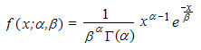{border="0"}

[]{style="FONT-FAMILY: 'Trebuchet MS','sans-serif'; COLOR: #15428b; FONT-SIZE: 9pt"} 

The standard gamma probability density function is,

[]{style="FONT-FAMILY: 'Trebuchet MS','sans-serif'; COLOR: #15428b; FONT-SIZE: 9pt"} 

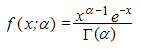{border="0"}

[]{style="FONT-FAMILY: 'Trebuchet MS','sans-serif'; COLOR: #15428b; FONT-SIZE: 9pt"} 

[·      ]{style="FONT-FAMILY: Symbol"}When alpha = 1, GAMMADIST returns the exponential distribution with,

[]{style="FONT-FAMILY: 'Trebuchet MS','sans-serif'; COLOR: #15428b; FONT-SIZE: 9pt"} 

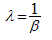{border="0"}

 

[]{#p170} 

###### 4.1.4.6.6.54        GAMMALN {#gammaln style="tab-stops: 0pt"}

 

Returns the natural logarithm of the gamma function, Ã(x).

 

**Syntax**

 

**GAMMALN(x)**, where:

 

**x[ ]{style="COLOR: red"}**is the value for which you want to calculate GAMMALN.

[]{style="FONT-FAMILY: 'Trebuchet MS','sans-serif'; COLOR: #15428b; FONT-SIZE: 9pt"} 

Remarks

[]{style="FONT-FAMILY: 'Trebuchet MS','sans-serif'; COLOR: #15428b; FONT-SIZE: 9pt"} 

[·      ]{style="FONT-FAMILY: Symbol"}x must be positive.

[·      ]{style="FONT-FAMILY: Symbol"}GAMMALN is calculated as follows,

[]{style="FONT-FAMILY: 'Trebuchet MS','sans-serif'; COLOR: #15428b; FONT-SIZE: 9pt"} 

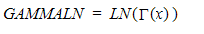{border="0"}

where:

[]{style="FONT-FAMILY: 'Trebuchet MS','sans-serif'; COLOR: #15428b; FONT-SIZE: 9pt"} 

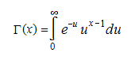{border="0"}

 

[]{#p171} 

###### 4.1.4.6.6.55        GAMMAINV {#gammainv style="tab-stops: 0pt"}

[]{style="FONT-FAMILY: 'Trebuchet MS','sans-serif'; COLOR: #15428b; FONT-SIZE: 9pt"} 

Returns the inverse of the gamma cumulative distribution. If p = GAMMADIST(x,\...), then GAMMAINV(p,\...) = x.

 

**Syntax**

 

**GAMMAINV(probability, alpha, beta)**, where:

 

**probability** is the probability associated with the gamma distribution.

**alpha**[ ]{style="FONT-FAMILY: 'Times New Roman','serif'; FONT-SIZE: 12pt"}is a parameter to the distribution.

**beta** is a parameter to the distribution.

[]{style="FONT-FAMILY: 'Trebuchet MS','sans-serif'; COLOR: #15428b; FONT-SIZE: 9pt"} 

Remarks

[]{style="FONT-FAMILY: 'Trebuchet MS','sans-serif'; COLOR: #15428b; FONT-SIZE: 9pt"} 

[·      ]{style="FONT-FAMILY: Symbol"}Probability must be \>= 0 and \<= 1.

[·      ]{style="FONT-FAMILY: Symbol"}Alpha and beta must be positive.

[]{style="FONT-FAMILY: 'Trebuchet MS','sans-serif'; COLOR: #15428b; FONT-SIZE: 9pt"} 

Given a value for probability, GAMMAINV seeks value x such that GAMMADIST(x, alpha, beta, True) = probability. Thus, precision of GAMMAINV depends on the precision of GAMMADIST. GAMMAINV uses an iterative search technique.

 

[]{#p172} 

###### 4.1.4.6.6.56        GEOMEAN {#geomean style="tab-stops: 0pt"}

[]{style="FONT-FAMILY: 'Trebuchet MS','sans-serif'; COLOR: #15428b; FONT-SIZE: 9pt"} 

Returns the geometric mean of an array or range of positive data.

 

**Syntax**

 

**GEOMEAN(number1, number2, \...)**, where:

 

**number1, number2, \...** are arguments for which you want to calculate the mean.

[]{style="FONT-FAMILY: 'Trebuchet MS','sans-serif'; COLOR: #15428b; FONT-SIZE: 9pt"} 

Remarks

[]{style="FONT-FAMILY: 'Trebuchet MS','sans-serif'; COLOR: #15428b; FONT-SIZE: 9pt"} 

[·      ]{style="FONT-FAMILY: Symbol"}The arguments must be either numbers or names, arrays or references that contain numbers.

[·      ]{style="FONT-FAMILY: Symbol"}All values must be positive.

[·      ]{style="FONT-FAMILY: Symbol"}The equation for the geometric mean is,

[]{style="FONT-FAMILY: 'Trebuchet MS','sans-serif'; COLOR: #15428b; FONT-SIZE: 9pt"} 

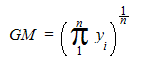{border="0"}

 

###### []{#p173}4.1.4.6.6.57        Growth {#growth style="tab-stops: 0pt"}

This feature enables you to calculate predicted exponential growth using existing data.  This calculates and returns an array of values used for the regression analysis. Growth enables you to perform a regression analysis.

     Table 3: Method Table

::: {align="center"}
  **[Method ]{style="LINE-HEIGHT: 115%; FONT-FAMILY: 'Calibri','sans-serif'; FONT-SIZE: 11pt"}**[]{style="LINE-HEIGHT: 115%; FONT-FAMILY: 'Calibri','sans-serif'; FONT-SIZE: 11pt"}   **[Description ]{style="LINE-HEIGHT: 115%; FONT-FAMILY: 'Calibri','sans-serif'; FONT-SIZE: 11pt"}**[]{style="LINE-HEIGHT: 115%; FONT-FAMILY: 'Calibri','sans-serif'; FONT-SIZE: 11pt"}   **[Parameters ]{style="LINE-HEIGHT: 115%; FONT-FAMILY: 'Calibri','sans-serif'; FONT-SIZE: 11pt"}**[]{style="LINE-HEIGHT: 115%; FONT-FAMILY: 'Calibri','sans-serif'; FONT-SIZE: 11pt"}   **[Type ]{style="LINE-HEIGHT: 115%; FONT-FAMILY: 'Calibri','sans-serif'; FONT-SIZE: 11pt"}**[]{style="LINE-HEIGHT: 115%; FONT-FAMILY: 'Calibri','sans-serif'; FONT-SIZE: 11pt"}   **[Return Type ]{style="LINE-HEIGHT: 115%; FONT-FAMILY: 'Calibri','sans-serif'; FONT-SIZE: 11pt"}**[]{style="LINE-HEIGHT: 115%; FONT-FAMILY: 'Calibri','sans-serif'; FONT-SIZE: 11pt"}   **[Reference links ]{style="LINE-HEIGHT: 115%; FONT-FAMILY: 'Calibri','sans-serif'; FONT-SIZE: 11pt"}**[]{style="LINE-HEIGHT: 115%; FONT-FAMILY: 'Calibri','sans-serif'; FONT-SIZE: 11pt"}
  ----------------------------------------------------------------------------------------------------------------------------------------------------------------------------------- ---------------------------------------------------------------------------------------------------------------------------------------------------------------------------------------- --------------------------------------------------------------------------------------------------------------------------------------------------------------------------------------- --------------------------------------------------------------------------------------------------------------------------------------------------------------------------------- ---------------------------------------------------------------------------------------------------------------------------------------------------------------------------------------- --------------------------------------------------------------------------------------------------------------------------------------------------------------------------------------------
  Growth()                                                                                                                                                                            Calculates the Growth for an array of cells.                                                                                                                                             [Known y's, Known x's, new_x\'s]{style="LINE-HEIGHT: 115%; FONT-FAMILY: 'Microsoft Sans Serif','sans-serif'; FONT-SIZE: 11pt"}                                                          Method                                                                                                                                                                            String                                                                                                                                                                                   N/A
:::

 

The following is the formula to calculate Growth for an array of cells in a column:

**\[Syntax\]**

 

[=GROWTH(known_y\'s, \[known_x\'s\], \[new_x\'s\], ]{style="COLOR: #454545"}

[]{style="COLOR: #454545"} 

**[Known_y\'s]{style="COLOR: #454545"}**[: A set of y-values you already know in a relationship, where y = b\*m\^x.]{style="COLOR: #454545"}

[]{style="COLOR: #454545"} 

Known_x\'s: An optional set of x-values that you may already know in the relationship, where y = b\*m\^x.

 

**[New_x\'s:]{style="COLOR: #454545"}**[ New x-values for which you want GROWTH to return corresponding y-values.]{style="COLOR: #454545"}

[]{style="COLOR: #454545"} 

[]{style="COLOR: #454545"} 

**\[Code\]**

 

**=**Growth(B2:B7,A2:A7,C6:C7)

 

 

###### 4.1.4.6.6.58        HARMEAN {#harmean style="tab-stops: 0pt"}

[]{style="FONT-FAMILY: 'Trebuchet MS','sans-serif'; COLOR: #15428b; FONT-SIZE: 9pt"} 

Returns the harmonic mean of a data set. The harmonic mean is the reciprocal of the arithmetic mean of reciprocals.

 

**Syntax**

 

**HARMEAN(number1, number2, \...)**, where:

 

**number1**, **number2, \...** are arguments for which you want to calculate the mean.

[]{style="FONT-FAMILY: 'Trebuchet MS','sans-serif'; COLOR: #15428b; FONT-SIZE: 9pt"} 

Remarks

[]{style="FONT-FAMILY: 'Trebuchet MS','sans-serif'; COLOR: #15428b; FONT-SIZE: 9pt"} 

[·      ]{style="FONT-FAMILY: Symbol"}The arguments must be either numbers or names, arrays or references that contain numbers.

[·      ]{style="FONT-FAMILY: Symbol"}All data values must be positive.

[·      ]{style="FONT-FAMILY: Symbol"}The equation for the harmonic mean is,

[]{style="FONT-FAMILY: 'Trebuchet MS','sans-serif'; COLOR: #15428b; FONT-SIZE: 9pt"} 

                        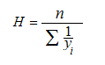{border="0"}

[]{#p174} 

 

###### 4.1.4.6.6.59        HLOOKUP {#hlookup style="tab-stops: 0pt"}

[]{style="FONT-FAMILY: 'Trebuchet MS','sans-serif'; COLOR: #15428b; FONT-SIZE: 9pt"} 

Searches for a value in the top row of the array of values and then returns a value in the same column from a row you specify in the array. Use HLOOKUP when your comparison values are located in a row across the top of a table of data and you want to look down a specified number of rows. Use VLOOKUP when your comparison values are located in a column to the left of the data you want to find.

 

**Syntax**

 

**HLOOKUP(lookup_value, table_array, row_index_num, range_lookup)**, where:

 

**lookup_value**[ ]{style="FONT-FAMILY: 'Times New Roman','serif'; FONT-SIZE: 12pt"}is the value to be found in the first row of the table. Lookup_value can be a value, a reference or a text string.

**table_array** is a table of information in which data is looked up. Use a reference to a range or a range name.

**row_index_num** is the row number in table_array from which, the matching value will be returned. A row_index_num of 1 returns the first row value in table_array, a row_index_num of 2 returns the second row value in table_array and so on.

**range_lookup**[ ]{style="FONT-FAMILY: 'Times New Roman','serif'; FONT-SIZE: 12pt"}is a logical value that specifies whether you want HLOOKUP to find an exact match or an approximate match. If True or omitted, an approximate match is returned. In other words, if an exact match is not found, the next largest value that is less than the lookup_value is returned. (This requires your lookup values to be sorted.) If False, HLOOKUP will find an exact match.

 

[]{#p175} 

###### 4.1.4.6.6.60        HOUR {#hour style="tab-stops: 0pt"}

[]{style="FONT-FAMILY: 'Trebuchet MS','sans-serif'; COLOR: #15428b; FONT-SIZE: 9pt"} 

Returns the hour of a time value. The hour is given as an integer, ranging from 0 (12:00 A.M.) to 23 (11:00 P.M.).

 

**Syntax**

 

**HOUR(serial_number)**, where:

 

**serial_number**[ ]{style="FONT-FAMILY: 'Times New Roman','serif'; FONT-SIZE: 12pt"}is the time that contains the hour you want to find. Times may be entered as text strings within quotation marks (for example, \"6:00 PM\"), as decimal numbers (for example, 0.75, which represents 6:00 PM), or as results of other formulas or functions (for example, TIMEVALUE(\"6:00 PM\")).

 

[]{#p176} 

###### 4.1.4.6.6.61        HYPGEOMDIST {#hypgeomdist style="tab-stops: 0pt"}

 

Returns the hypergeometric distribution. HYPGEOMDIST returns the probability of a given number of sample successes, given the sample size, population successes and population size.

 

**Syntax**

 

**HYPGEOMDIST(sample_s, number_sample, population_s, number_population)**, where:

 

**sample_s**[ ]{style="FONT-FAMILY: 'Times New Roman','serif'; FONT-SIZE: 12pt"}is the number of successes in the sample.

**number_sample** is the size of the sample.

**population_s** is the number of successes in the population.

**number_population**[ ]{style="FONT-FAMILY: 'Times New Roman','serif'; FONT-SIZE: 12pt"}is the population size.

[]{style="FONT-FAMILY: 'Trebuchet MS','sans-serif'; COLOR: #15428b; FONT-SIZE: 9pt"} 

Remarks

[]{style="FONT-FAMILY: 'Trebuchet MS','sans-serif'; COLOR: #15428b; FONT-SIZE: 9pt"} 

[·      ]{style="FONT-FAMILY: Symbol"}All arguments are truncated to integers.

[·      ]{style="FONT-FAMILY: Symbol"}sample_s must be \>= 0 less than both  number_sample and population_s.

[·      ]{style="FONT-FAMILY: Symbol"}number_sample must be \>= 0 and \< number_population.

[·      ]{style="FONT-FAMILY: Symbol"}population_s must be \>= 0 and \< number_population.

[·      ]{style="FONT-FAMILY: Symbol"}number_population must b \>= 0.

[·      ]{style="FONT-FAMILY: Symbol"}The equation for the hypergeometric distribution is,

[]{style="FONT-FAMILY: 'Trebuchet MS','sans-serif'; COLOR: #15428b; FONT-SIZE: 9pt"} 

                                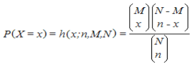{border="0"}

[]{style="FONT-FAMILY: 'Trebuchet MS','sans-serif'; COLOR: #15428b; FONT-SIZE: 9pt"} 

where:

 

x = sample_s

n = number_sample

M = population_s

N = number_population

 

[]{#p177} 

###### 4.1.4.6.6.62        IF {#if style="tab-stops: 0pt"}

[]{style="FONT-FAMILY: 'Trebuchet MS','sans-serif'; COLOR: #15428b; FONT-SIZE: 9pt"} 

Returns one value if a condition you specify evaluates to True and another value if it evaluates to False.

Use IF to conduct conditional tests on values and formulas.

[]{style="FONT-FAMILY: 'Trebuchet MS','sans-serif'; COLOR: #15428b; FONT-SIZE: 9pt"} 

Syntax

[]{style="FONT-FAMILY: 'Trebuchet MS','sans-serif'; COLOR: #15428b; FONT-SIZE: 9pt"} 

IF(logical_test, value_if_true, value_if_false), where:

 

logical_test[ ]{style="FONT-FAMILY: 'Times New Roman','serif'; FONT-SIZE: 12pt"}is any value or expression that can be evaluated to True or False.

value_if_true is the value that is returned if a logical_test is True.

value_if_false[ ]{style="FONT-FAMILY: 'Times New Roman','serif'; FONT-SIZE: 12pt"}is the value that is returned if a logical_test is False.

[]{style="FONT-FAMILY: 'Trebuchet MS','sans-serif'; COLOR: #15428b; FONT-SIZE: 9pt"} 

Remarks

 

[·      ]{style="FONT-FAMILY: Symbol"}Countif and Sumif are additional methods that provide conditional calculations.

 

###### []{#p178}4.1.4.6.6.63        Index {#index style="tab-stops: 0pt"}

The Index function returns the exact cell value from the provided row index and column index from a specific range of cells.

 

Syntax:

**Index(range,row,col)**

 

where:

**range** is a string to mention the specific range.

**row** is the integer that indicates the specific row index.

**col** is the integer that indicates the specific column index.

 

###### 4.1.4.6.6.64        Indirect {#indirect style="tab-stops: 0pt"}

The Indirect function returns the reference as a string instead of providing the content or range within the cell.

 

Syntax:

**Indirect(content)**

 

where:

**content** is the string that provides the textual representation of the cell reference.

 

###### 4.1.4.6.6.65        INT {#int style="tab-stops: 0pt"}

[]{style="FONT-FAMILY: 'Trebuchet MS','sans-serif'; COLOR: #15428b; FONT-SIZE: 9pt"} 

Rounds a number down to the nearest integer.

[]{style="FONT-FAMILY: 'Trebuchet MS','sans-serif'; COLOR: #15428b; FONT-SIZE: 9pt"} 

Syntax

 

**INT(number)**, where:

 

**number**[ ]{style="FONT-FAMILY: 'Times New Roman','serif'; FONT-SIZE: 12pt"}is the real number that you want to round down to an integer.

 

[]{#p179} 

###### 4.1.4.6.6.66        INTERCEPT {#intercept style="tab-stops: 0pt"}

[]{style="FONT-FAMILY: 'Trebuchet MS','sans-serif'; COLOR: #15428b; FONT-SIZE: 9pt"} 

Calculates the point at which, the least squares fit line will intersect the y-axis.

 

**Syntax**

 

**INTERCEPT(known_y\'s, known_x\'s)**, where:

 

**known_y\'s**[ i]{style="FONT-FAMILY: 'Times New Roman','serif'; FONT-SIZE: 12pt"}s the dependent set of observations or data.

**known_x\'s** is the independent set of observations or data.

[]{style="FONT-FAMILY: 'Trebuchet MS','sans-serif'; COLOR: #15428b; FONT-SIZE: 9pt"} 

Remarks

[]{style="FONT-FAMILY: 'Trebuchet MS','sans-serif'; COLOR: #15428b; FONT-SIZE: 9pt"} 

[·      ]{style="FONT-FAMILY: Symbol"}The equation for the intercept of the regression line, a, is,

[]{style="FONT-FAMILY: 'Trebuchet MS','sans-serif'; COLOR: #15428b; FONT-SIZE: 9pt"} 

{border="0"}

[]{style="FONT-FAMILY: 'Trebuchet MS','sans-serif'; COLOR: #15428b; FONT-SIZE: 9pt"} 

where the slope, b, is calculated as:

[]{style="FONT-FAMILY: 'Trebuchet MS','sans-serif'; COLOR: #15428b; FONT-SIZE: 9pt"} 

{border="0"}

[]{style="FONT-FAMILY: 'Trebuchet MS','sans-serif'; COLOR: #15428b; FONT-SIZE: 9pt"} 

and x-bar and y-bar are the sample means AVERAGE(known_x\'s) and AVERAGE(known_y\'s).

 

[]{#p180} 

###### 4.1.4.6.6.67        IPMT {#ipmt style="tab-stops: 0pt"}

[]{style="FONT-FAMILY: 'Trebuchet MS','sans-serif'; COLOR: #15428b; FONT-SIZE: 9pt"} 

Returns the interest payment for a given period for an investment based on periodic, constant payments and a constant interest rate.

 

**Syntax**

 

**IPMT(rate, per, nper, pv, fv, type)**, where:

 

**rate **is the interest rate per period.

**per**[ ]{style="FONT-FAMILY: 'Times New Roman','serif'; FONT-SIZE: 12pt"}is the period for which you want to find the interest and must be in the range 1 to nper.

**nper** is the total number of payment periods in an annuity.

**pv**[ ]{style="FONT-FAMILY: 'Times New Roman','serif'; FONT-SIZE: 12pt"}is the present value or the lump-sum amount that a series of future payments is worth right now.

**fv**[ ]{style="FONT-FAMILY: 'Times New Roman','serif'; FONT-SIZE: 12pt"}is the future value or a cash balance that you want to attain after the last payment is made. If fv is omitted, it is assumed to be 0 (the future value of a loan, for example, is 0).

**type **is the number 0 or 1 and indicates when payments are due. If type is omitted, it is assumed to be 0. If type = 0, payments are made at the end of the period. If type is 1, payments are made at the beginning of the period.

[\
]{style="FONT-SIZE: 9pt"}Remarks

[]{style="FONT-FAMILY: 'Trebuchet MS','sans-serif'; COLOR: #15428b; FONT-SIZE: 9pt"} 

[·      ]{style="FONT-FAMILY: Symbol"}Make sure that you are consistent about the units you use for specifying rate and nper. If you make monthly payments on a four-year loan at 12 percent annual interest, use 12%/12 for rate and 4\*12 for nper. If you make annual payments on the same loan, use 12% for rate and 4 for nper.

 

[]{#p181} 

###### 4.1.4.6.6.68        IRR {#irr style="tab-stops: 0pt"}

[]{style="FONT-FAMILY: 'Trebuchet MS','sans-serif'; COLOR: #15428b; FONT-SIZE: 9pt"} 

Returns the**[ ]{style="COLOR: red"}**internal rate of return for a series of cash flows represented by the numbers in values. The cash flows must occur at regular intervals such as monthly or annually.

 

**Syntax**

 

**IRR(values, guess)**, where:

 

**values**[ ]{style="FONT-FAMILY: 'Times New Roman','serif'; FONT-SIZE: 12pt"}is an array or a reference to cells that contain numbers for which you want to calculate the internal rate of return.

[]{style="FONT-FAMILY: 'Trebuchet MS','sans-serif'; COLOR: #15428b; FONT-SIZE: 9pt"} 

[·      ]{style="FONT-FAMILY: Symbol"}Values must contain at least one positive value and one negative value to calculate the internal rate of return.

[·      ]{style="FONT-FAMILY: Symbol"}IRR uses the order of values to interpret the order of cash flows. Be sure to enter your payment and income values in the sequence you want.

[·      ]{style="FONT-FAMILY: Symbol"}guess is a number that you guess is close to the result of IRR.

[·      ]{style="FONT-FAMILY: Symbol"}An iterative technique is used for calculating IRR.

[·      ]{style="FONT-FAMILY: Symbol"}In most cases, you do not need to provide a guess for the IRR calculation. If a guess is omitted, it is assumed to be 0.1 (10 percent).

 

###### []{#p182}4.1.4.6.6.69        IsErr {#iserr style="tab-stops: 0pt"}

The IsErr function checks  whether a value is has an error.

 

Syntax:

**IsErr(value)**

 

where:

**value** is the value that you want to test for error. If the value has an error (except #N/A), this function will return TRUE else returns FALSE.

 

###### 4.1.4.6.6.70        ISERROR {#iserror style="tab-stops: 0pt"}

[]{style="FONT-FAMILY: 'Trebuchet MS','sans-serif'; COLOR: #15428b; FONT-SIZE: 9pt"} 

Returns True if the value is a string that starts with a #.

 

**Syntax**

 

**ISERROR(value)**, where:

 

**value** is the value that is to be tested.

 

###### []{#p183}4.1.4.6.6.71        IsNA {#isna style="tab-stops: 0pt"}

The IsNA function returns a boolean value after determining that the provided value is a  #NA error value.

 

Syntax:

**IsNA(value)**

 

where:

**value** is the value, which the function will test.

 

###### 4.1.4.6.6.72        ISNUMBER {#isnumber style="tab-stops: 0pt"}

[]{style="FONT-FAMILY: 'Trebuchet MS','sans-serif'; COLOR: #15428b; FONT-SIZE: 9pt"} 

Returns True if the value parses as a numeric value.

 

**Syntax**

\
**ISNUMBER(value)**, where:

 

**value** is the value that is to be tested.

 

[]{#p184} 

###### 4.1.4.6.6.73        ISPMT {#ispmt style="tab-stops: 0pt"}

 

Calculates the**[ ]{style="COLOR: red"}**interest paid during a specific period of an investment.

 

**Syntax**

 

**ISPMT(rate, per, nper, pv)**, where:

 

**rate**[ ]{style="FONT-FAMILY: 'Times New Roman','serif'; FONT-SIZE: 12pt"}is the interest rate for the investment.

**per**[ ]{style="FONT-FAMILY: 'Times New Roman','serif'; FONT-SIZE: 12pt"}is the period for which you want to find the interest and must be between 1 and nper.

**nper** is the total number of payment periods for the investment.

**pv** is the present value of the investment. For a loan, pv is the loan amount.

[]{style="FONT-FAMILY: 'Trebuchet MS','sans-serif'; COLOR: #15428b; FONT-SIZE: 9pt"} 

Remarks

[]{style="FONT-FAMILY: 'Trebuchet MS','sans-serif'; COLOR: #15428b; FONT-SIZE: 9pt"} 

[·      ]{style="FONT-FAMILY: Symbol"}Make sure that you are consistent about the units you use for specifying rate and nper. If you make monthly payments on a four-year loan at an annual interest rate of 12 percent, use 12%/12 for rate and 4\*12 for nper. If you make annual payments on the same loan, use 12% for rate and 4 for nper.

 

###### []{#p185}4.1.4.6.6.74        IsText {#istext style="tab-stops: 0pt"}

The IsText function returns a boolean value after determining that the provided value is a string.

 

Syntax:

**IsText(text)**

 

where:

**text** is the value you want to check whether it is a string or not.

###### 4.1.4.6.6.75        IsNonText {#isnontext style="tab-stops: 0pt"}

The IsNonText function returns the boolean value after determining that the provided value is not a string.

 

Syntax:

**IsNonText(text)**

 

where:

**text** is the value you want to check whether it is a string or not.

 

 

###### 4.1.4.6.6.76        KURT {#kurt style="tab-stops: 0pt"}

[]{style="FONT-FAMILY: 'Trebuchet MS','sans-serif'; COLOR: #15428b; FONT-SIZE: 9pt"} 

Returns the kurtosis of a data set. Kurtosis characterizes the relative peakedness or flatness of a distribution compared with the normal distribution. Positive kurtosis indicates a relatively peaked distribution. Negative kurtosis indicates a relatively flat distribution.

 

**Syntax**

\
**KURT(number1, number2, \...)**, where:

 

**number1, number2, \...** are arguments for which you want to calculate kurtosis. You can also use a single array or a reference to an array instead of arguments separated by commas.

[]{style="FONT-FAMILY: 'Trebuchet MS','sans-serif'; COLOR: #15428b; FONT-SIZE: 9pt"} 

Remarks

[]{style="FONT-FAMILY: 'Trebuchet MS','sans-serif'; COLOR: #15428b; FONT-SIZE: 9pt"} 

[·      ]{style="FONT-FAMILY: Symbol"}The arguments must be either numbers or names, arrays or references that contain numbers.

[·      ]{style="FONT-FAMILY: Symbol"}If an array or reference argument contains text, logical values or empty cells, those values are ignored; however, cells with the value zero are included.

[·      ]{style="FONT-FAMILY: Symbol"}If there are fewer than four data points or if the standard deviation of the sample equals zero, KURT returns the #DIV/0! error value.

[·      ]{style="FONT-FAMILY: Symbol"}Kurtosis is defined as:

[]{style="FONT-FAMILY: 'Trebuchet MS','sans-serif'; COLOR: #15428b; FONT-SIZE: 9pt"} 

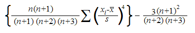{border="0"}

[]{style="FONT-FAMILY: 'Trebuchet MS','sans-serif'; COLOR: #15428b; FONT-SIZE: 9pt"} 

where s is the sample standard deviation.

 

[]{#p186} 

###### 4.1.4.6.6.77        LARGE {#large style="tab-stops: 0pt"}

[]{style="FONT-FAMILY: 'Trebuchet MS','sans-serif'; COLOR: #15428b; FONT-SIZE: 9pt"} 

Returns the k-th largest value in a data set.

 

**Syntax**

 

**LARGE(array, k)**, where:

 

**array**[ ]{style="FONT-FAMILY: 'Times New Roman','serif'; FONT-SIZE: 12pt"}is the array or range of data for which you want to determine the k-th largest value.

**k**[ ]{style="FONT-FAMILY: 'Times New Roman','serif'; FONT-SIZE: 12pt"}is the position (from the largest) in the array or cell range of data to return.

[]{style="FONT-FAMILY: 'Trebuchet MS','sans-serif'; COLOR: #15428b; FONT-SIZE: 9pt"} 

Remarks

[]{style="FONT-FAMILY: 'Trebuchet MS','sans-serif'; COLOR: #15428b; FONT-SIZE: 9pt"} 

[·      ]{style="FONT-FAMILY: Symbol"}If n is the number of data points in a range, then LARGE(array,1) returns the largest value, and LARGE(array,n) returns the smallest value.

 

[]{#p187} 

###### 4.1.4.6.6.78        LEFT {#left style="tab-stops: 0pt"}

[]{style="FONT-FAMILY: 'Trebuchet MS','sans-serif'; COLOR: #15428b; FONT-SIZE: 9pt"} 

LEFT returns the first character or characters in a text string, based on the number of characters you specify.

 

**Syntax**

 

**LEFT(text, num_chars)**, where:

 

**text**[ ]{style="FONT-FAMILY: 'Times New Roman','serif'; FONT-SIZE: 12pt"}is the text string that contains the characters which you want to extract.

**num_chars** specifies the number of characters which you want **LEFT** to extract.

[]{style="FONT-FAMILY: 'Trebuchet MS','sans-serif'; COLOR: #15428b; FONT-SIZE: 9pt"} 

Remarks

 

[·      ]{style="FONT-FAMILY: Symbol"}Num_chars must be greater than or equal to zero.

[·      ]{style="FONT-FAMILY: Symbol"}If num_chars is greater than the length of text, LEFT returns all the text.

[·      ]{style="FONT-FAMILY: Symbol"}If num_chars is omitted, it is assumed to be 1.

 

[]{#p188} 

###### 4.1.4.6.6.79        LN {#ln style="tab-stops: 0pt"}

[]{style="FONT-FAMILY: 'Trebuchet MS','sans-serif'; COLOR: #15428b; FONT-SIZE: 9pt"} 

Returns the natural logarithm of a number. Natural logarithms are based on the constant e (2.718281828459\...).     

 

**Syntax**

 

**LN(number)**, where:

 

**number** is the positive real number for which you want the natural logarithm.

[\
]{style="FONT-SIZE: 9pt"}Remarks

[]{style="FONT-FAMILY: 'Trebuchet MS','sans-serif'; COLOR: #15428b; FONT-SIZE: 9pt"} 

[·      ]{style="FONT-FAMILY: Symbol"}  LN is the inverse of the EXP function.

 

[]{#p189} 

###### 4.1.4.6.6.80        LEN {#len style="tab-stops: 0pt"}

[]{style="FONT-FAMILY: 'Trebuchet MS','sans-serif'; COLOR: #15428b; FONT-SIZE: 9pt"} 

LEN returns the length of a text string, including spaces.

 

**Syntax**

 

**Len(text)**, where:

 

**text** is the text string whose length is to be determined.

 

 

###### []{#p190}4.1.4.6.6.81        OG {#og style="tab-stops: 0pt"}

[]{style="FONT-FAMILY: 'Trebuchet MS','sans-serif'; COLOR: #15428b; FONT-SIZE: 9pt"} 

Returns the logarithm of a number to the base that you specify.

 

**Syntax**

 

**LOG(number, base)**, where:

 

**number **is the positive real number for which you want the logarithm[.]{style="FONT-FAMILY: 'Times New Roman','serif'; FONT-SIZE: 12pt"}

**base**[ ]{style="FONT-FAMILY: 'Times New Roman','serif'; FONT-SIZE: 12pt"}is the base of the logarithm. If base is omitted, it is assumed to be 10.

 

[]{#p191} 

###### 4.1.4.6.6.82        LOG10 {#log10 style="tab-stops: 0pt"}

[]{style="FONT-FAMILY: 'Trebuchet MS','sans-serif'; COLOR: #15428b; FONT-SIZE: 9pt"} 

Returns the base-10 logarithm of a number.

 

**Syntax**

\
**LOG10(number)**, where:

 

**number**[ ]{style="FONT-FAMILY: 'Times New Roman','serif'; FONT-SIZE: 12pt"}is the positive real number for which you want the base-10 logarithm.

###### 4.1.4.6.6.83        IsBlank {#isblank style="tab-stops: 0pt"}

The IsBlank function checks for blank or null values.

 

Syntax:

**IsBlank(value)**

 

where:

**value** is the value that you want to test. If the value is blank, this function will return TRUE. If the value is not blank, the function will return FALSE.

 

###### 4.1.4.6.6.84        Logest {#logest style="tab-stops: 0pt"}

This feature enables you to calculate predicted exponential growth using existing data.  This calculates and returns an array of values used for the regression analysis. Logest calculates and returns an array of values that is used in regression analysis.

 

Table 4: Method Table

::: {align="center"}
+-----------------------------------------------------------------------------------------------------------------------------------------------------------------------------------+----------------------------------------------------------------------------------------------------------------------------------------------------------------------------------------+---------------------------------------------------------------------------------------------------------------------------------------------------------------------------------------+---------------------------------------------------------------------------------------------------------------------------------------------------------------------------------+----------------------------------------------------------------------------------------------------------------------------------------------------------------------------------------+--------------------------------------------------------------------------------------------------------------------------------------------------------------------------------------------+
| **[Method ]{style="LINE-HEIGHT: 115%; FONT-FAMILY: 'Calibri','sans-serif'; FONT-SIZE: 11pt"}**[]{style="LINE-HEIGHT: 115%; FONT-FAMILY: 'Calibri','sans-serif'; FONT-SIZE: 11pt"} | **[Description ]{style="LINE-HEIGHT: 115%; FONT-FAMILY: 'Calibri','sans-serif'; FONT-SIZE: 11pt"}**[]{style="LINE-HEIGHT: 115%; FONT-FAMILY: 'Calibri','sans-serif'; FONT-SIZE: 11pt"} | **[Parameters ]{style="LINE-HEIGHT: 115%; FONT-FAMILY: 'Calibri','sans-serif'; FONT-SIZE: 11pt"}**[]{style="LINE-HEIGHT: 115%; FONT-FAMILY: 'Calibri','sans-serif'; FONT-SIZE: 11pt"} | **[Type ]{style="LINE-HEIGHT: 115%; FONT-FAMILY: 'Calibri','sans-serif'; FONT-SIZE: 11pt"}**[]{style="LINE-HEIGHT: 115%; FONT-FAMILY: 'Calibri','sans-serif'; FONT-SIZE: 11pt"} | **[Return Type ]{style="LINE-HEIGHT: 115%; FONT-FAMILY: 'Calibri','sans-serif'; FONT-SIZE: 11pt"}**[]{style="LINE-HEIGHT: 115%; FONT-FAMILY: 'Calibri','sans-serif'; FONT-SIZE: 11pt"} | **[Reference links ]{style="LINE-HEIGHT: 115%; FONT-FAMILY: 'Calibri','sans-serif'; FONT-SIZE: 11pt"}**[]{style="LINE-HEIGHT: 115%; FONT-FAMILY: 'Calibri','sans-serif'; FONT-SIZE: 11pt"} |
+-----------------------------------------------------------------------------------------------------------------------------------------------------------------------------------+----------------------------------------------------------------------------------------------------------------------------------------------------------------------------------------+---------------------------------------------------------------------------------------------------------------------------------------------------------------------------------------+---------------------------------------------------------------------------------------------------------------------------------------------------------------------------------+----------------------------------------------------------------------------------------------------------------------------------------------------------------------------------------+--------------------------------------------------------------------------------------------------------------------------------------------------------------------------------------------+
| Logest()                                                                                                                                                                          | Calculates Logest for an array of cells.                                                                                                                                               | known_y\'s, known_x\'s, const,                                                                                                                                                        | **Method**                                                                                                                                                                      | String                                                                                                                                                                                 | N/A                                                                                                                                                                                        |
|                                                                                                                                                                                   |                                                                                                                                                                                        |                                                                                                                                                                                       |                                                                                                                                                                                 |                                                                                                                                                                                        |                                                                                                                                                                                            |
|                                                                                                                                                                                   |                                                                                                                                                                                        | stats                                                                                                                                                                                 |                                                                                                                                                                                 |                                                                                                                                                                                        |                                                                                                                                                                                            |
+===================================================================================================================================================================================+========================================================================================================================================================================================+=======================================================================================================================================================================================+=================================================================================================================================================================================+========================================================================================================================================================================================+============================================================================================================================================================================================+
:::

[]{style="FONT-FAMILY: 'Calibri','sans-serif'; COLOR: black"} 

The following is the formula to calculate Logest for an array of cells in a column:

**\[Syntax\]**

 

=LOGEST(known_y\'s, \[known_x\'s\], \[const\], \[stats\])

 

Known_y\'s : A set of y-values you already know in a relationship, where y = b\*m\^x.

 

Known_x\'s : An optional set of x-values that you may already know in a relationship, where y = b\*m\^x.

 

Const  :  A logical value specifying whether to force the constant b to equal 1.

 

Stats  : A logical value specifying whether to return additional regression statistics.

 

**\[Code\]**

 

**=** Logest(B2:B7,A2:A7,TRUE,FALSE)

 

 

 

 

###### []{#p192}4.1.4.6.6.85        IsLogical {#islogical style="tab-stops: 0pt"}

The IsLogical function checks whether a value is a logical value and returns TRUE or FALSE.

 

Syntax:

**IsLogical(value)**

 

where:

**value** is the value that you want to check whether it is logical. If the value is TRUE or FALSE, this function will return TRUE. Otherwise, it will return FALSE.

 

###### 4.1.4.6.6.86        LOGINV {#loginv style="tab-stops: 0pt"}

[]{style="FONT-FAMILY: 'Trebuchet MS','sans-serif'; COLOR: #15428b; FONT-SIZE: 9pt"} 

Returns the inverse of the lognormal cumulative distribution function of x, where ln(x) is normally distributed with parameters mean and standard_dev. If p = LOGNORMDIST(x,\...), then LOGINV(p,\...) = x.

 

**Syntax**

 

**LOGINV(probability, mean, standard_dev)**, where:

 

**probability**[ ]{style="FONT-FAMILY: 'Times New Roman','serif'; FONT-SIZE: 12pt"}is the probability associated with the lognormal distribution.

**mean **is the mean of ln(x).

**standard_dev**[ ]{style="FONT-FAMILY: 'Times New Roman','serif'; FONT-SIZE: 12pt"}is the standard deviation of ln(x).

[]{style="FONT-FAMILY: 'Trebuchet MS','sans-serif'; COLOR: #15428b; FONT-SIZE: 9pt"} 

Remarks

[]{style="FONT-FAMILY: 'Trebuchet MS','sans-serif'; COLOR: #15428b; FONT-SIZE: 9pt"} 

[·      ]{style="FONT-FAMILY: Symbol"}Probability must be \>= 0 and \< 1.

[·      ]{style="FONT-FAMILY: Symbol"}Standard_dev must be positive.

[·      ]{style="FONT-FAMILY: Symbol"}The inverse of the lognormal distribution function is,

[]{style="FONT-FAMILY: 'Trebuchet MS','sans-serif'; COLOR: #15428b; FONT-SIZE: 9pt"} 

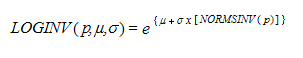{border="0"}

[]{#p193} 

 

###### 4.1.4.6.6.87        LOGNORMDIST {#lognormdist style="tab-stops: 0pt"}

[]{style="FONT-FAMILY: 'Trebuchet MS','sans-serif'; COLOR: #15428b; FONT-SIZE: 9pt"} 

Returns the cumulative lognormal distribution of x, where ln(x) is normally distributed with parameters mean and standard_dev.

 

**Syntax**

 

**LOGNORMDIST(x, mean, standard_dev)**, where:

 

**x** is the value at which the function can be evaluated.

**mean** is the mean of ln(x).

**standard_dev**[ ]{style="FONT-FAMILY: 'Times New Roman','serif'; FONT-SIZE: 12pt"}is the standard deviation of ln(x)[.]{style="FONT-FAMILY: 'Times New Roman','serif'; FONT-SIZE: 12pt"}

[]{style="FONT-FAMILY: 'Trebuchet MS','sans-serif'; COLOR: #15428b; FONT-SIZE: 9pt"} 

Remarks

[]{style="FONT-FAMILY: 'Trebuchet MS','sans-serif'; COLOR: #15428b; FONT-SIZE: 9pt"} 

[·      ]{style="FONT-FAMILY: Symbol"}Both x and standard_dev must be positive.

[·      ]{style="FONT-FAMILY: Symbol"}The equation for the lognormal cumulative distribution function is,

[]{style="FONT-FAMILY: 'Trebuchet MS','sans-serif'; COLOR: #15428b; FONT-SIZE: 9pt"} 

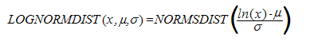{border="0"}

###### 4.1.4.6.6.88        Lower {#lower style="tab-stops: 0pt"}

The Lower function converts all characters in a specified text string to lowercase. Characters in the string that are not text are not changed.

 

Syntax:

**Lower(text)**

 

where:

**text** is the string you want to convert to lowercase.

 

[]{#p194} 

###### 4.1.4.6.6.89        MAX {#max style="tab-stops: 0pt"}

[]{style="FONT-FAMILY: 'Trebuchet MS','sans-serif'; COLOR: #15428b; FONT-SIZE: 9pt"} 

Returns the largest value in a set of values.

 

**Syntax**

 

**MAX(number1, number2, \...)**, where:

 

**number1, number2, \...** are numbers for which you want to find the maximum value.

 

[]{#p195} 

###### 4.1.4.6.6.90        MAXA {#maxa style="tab-stops: 0pt"}

[]{style="FONT-FAMILY: 'Trebuchet MS','sans-serif'; COLOR: #15428b; FONT-SIZE: 9pt"} 

Returns the largest value in a list of arguments. Text and logical values such as True and False are compared as well as numbers.

 

**Syntax**

 

**MAXA(value1, value2, \...)**, where:

 

**value1, value2, \...** are values for which you want to find the largest value.

[]{style="FONT-FAMILY: 'Trebuchet MS','sans-serif'; COLOR: #15428b; FONT-SIZE: 9pt"} 

Remarks

[]{style="FONT-FAMILY: 'Trebuchet MS','sans-serif'; COLOR: #15428b; FONT-SIZE: 9pt"} 

[·      ]{style="FONT-FAMILY: Symbol"}You can specify arguments that are numbers, empty cells, logical values or text representations of numbers. Arguments that are error values cause errors. If the calculation does not include text or logical values, use the MAX worksheet function instead.

[·      ]{style="FONT-FAMILY: Symbol"}If an argument is an array or reference, only values in that array or reference are used. Empty cells and text values in the array or reference are ignored.

[·      ]{style="FONT-FAMILY: Symbol"}Arguments that contain True evaluate as 1; arguments that contain text or False evaluate as 0 (zero).

[·      ]{style="FONT-FAMILY: Symbol"}If the arguments contain no values, MAXA returns 0 (zero).

 

[]{#p196} 

###### 4.1.4.6.6.91        MEDIAN {#median style="tab-stops: 0pt"}

[]{style="FONT-FAMILY: 'Trebuchet MS','sans-serif'; COLOR: #15428b; FONT-SIZE: 9pt"} 

Returns the median of the given numbers. The median is the number in the middle of a set of numbers; that is, half the numbers have values that are greater than the median and half have values that are less.

 

**Syntax**

 

**MEDIAN(number1, number2, \...)**, where:

 

**number1, number2, \...** are numbers for which you want the median.

[]{style="FONT-FAMILY: 'Trebuchet MS','sans-serif'; COLOR: #15428b; FONT-SIZE: 9pt"} 

Remarks

[]{style="FONT-FAMILY: 'Trebuchet MS','sans-serif'; COLOR: #15428b; FONT-SIZE: 9pt"} 

[·      ]{style="FONT-FAMILY: Symbol"}If there is an even number of numbers in the set, then MEDIAN calculates the average of the two numbers in the middle.

 

[]{#p197} 

###### 4.1.4.6.6.92        MID {#mid style="tab-stops: 0pt"}

[]{style="FONT-FAMILY: 'Trebuchet MS','sans-serif'; COLOR: #15428b; FONT-SIZE: 9pt"} 

MID returns a text segment of a character string. The parameters specify the starting position and the number of characters.

 

**Syntax**

 

**MID(text, start_position, num_chars)**, where:

 

**text** is the text containing the characters to extract.

**start** is the position of the first character in the text to extract.

**number[ ]{style="FONT-FAMILY: Albany"}**specifies the number of characters in the part of the text.

[]{#p198} 

 

###### 4.1.4.6.6.93        MIN {#min style="tab-stops: 0pt"}

[]{style="FONT-FAMILY: 'Trebuchet MS','sans-serif'; COLOR: #15428b; FONT-SIZE: 9pt"} 

Returns the smallest number in a set of values.

 

**Syntax**

\
**MIN(number1, number2, \...)**, where:

 

**number1, number2, \...** are numbers for which you want to find the minimum value.

[]{style="FONT-FAMILY: 'Trebuchet MS','sans-serif'; COLOR: #15428b; FONT-SIZE: 9pt"} 

Remarks

[]{style="FONT-FAMILY: 'Trebuchet MS','sans-serif'; COLOR: #15428b; FONT-SIZE: 9pt"} 

[·      ]{style="FONT-FAMILY: Symbol"}If an argument is an array or reference, only numbers in that array or reference are used. Empty cells, logical values or text in the array or reference are ignored. If logical values and text should not be ignored, use MINA.

[]{#p199} 

 

###### 4.1.4.6.6.94        MINA {#mina style="tab-stops: 0pt"}

[]{style="FONT-FAMILY: 'Trebuchet MS','sans-serif'; COLOR: #15428b; FONT-SIZE: 9pt"} 

Returns the smallest value in the list of arguments. Text and logical values such as True and False are compared as well as numbers.

 

**Syntax**

 

**MINA(value1,value2, \...)**, where:

 

**value1, value2, \...** are values for which you want to find the smallest value.

[]{style="FONT-FAMILY: 'Trebuchet MS','sans-serif'; COLOR: #15428b; FONT-SIZE: 9pt"} 

Remarks

[]{style="FONT-FAMILY: 'Trebuchet MS','sans-serif'; COLOR: #15428b; FONT-SIZE: 9pt"} 

[·      ]{style="FONT-FAMILY: Symbol"}Arguments that contain True evaluate as 1; arguments that contain text or False evaluate as 0 (zero).

 

[]{#p200} 

###### 4.1.4.6.6.95        MINUTE {#minute style="tab-stops: 0pt"}

[]{style="FONT-FAMILY: 'Trebuchet MS','sans-serif'; COLOR: #15428b; FONT-SIZE: 9pt"} 

Returns the**[ ]{style="COLOR: red"}**minutes of a time value. The minute is given as an integer, ranging from 0 to 59.

 

**Syntax**

 

**MINUTE(serial_number)**, where:

 

**serial_number** is the time that contains the minute you want to find. Times may be entered as text strings within quotation marks (for example, \"6:00 PM\"), as decimal numbers (for example, 0.75, which represents 6:00 PM), or as results of other formulas or functions (for example, TIMEVALUE(\"6:00 PM\")).

[]{style="FONT-FAMILY: 'Trebuchet MS','sans-serif'; COLOR: #15428b; FONT-SIZE: 9pt"} 

Remarks

[]{style="FONT-FAMILY: 'Trebuchet MS','sans-serif'; COLOR: #15428b; FONT-SIZE: 9pt"} 

[·      ]{style="FONT-FAMILY: Symbol"}Time values are a portion of a date value and are represented by a decimal number (for example, 12:00 PM is represented as 0.5).

[]{style="FONT-FAMILY: 'Trebuchet MS','sans-serif'; COLOR: #15428b; FONT-SIZE: 9pt"} 

 

[]{#p201} 

###### 4.1.4.6.6.96        MIRR {#mirr style="tab-stops: 0pt"}

[]{style="FONT-FAMILY: 'Trebuchet MS','sans-serif'; COLOR: #15428b; FONT-SIZE: 9pt"} 

Returns the**[ ]{style="COLOR: red"}**modified internal rate of return for a series of periodic cash flows.

 

**Syntax**

 

**MIRR(values, finance_rate, reinvest_rate)**, where:

 

**values**[ ]{style="FONT-FAMILY: 'Times New Roman','serif'; FONT-SIZE: 12pt"}is an array or a reference to cells that contain numbers. These numbers represent a series of payments (negative values) and income (positive values) occurring at regular periods.

[·      ]{style="FONT-FAMILY: Symbol"}Values must contain at least one positive value and one negative value to calculate the modified internal rate of return.

[·      ]{style="FONT-FAMILY: Symbol"}**finance_rate**[ ]{style="FONT-FAMILY: 'Times New Roman','serif'; FONT-SIZE: 12pt"}is the interest rate you pay on the money used in the cash flows.

[·      ]{style="FONT-FAMILY: Symbol"}**reinvest_rate**[ ]{style="FONT-FAMILY: 'Times New Roman','serif'; FONT-SIZE: 12pt"}is the interest rate you receive on the cash flows as you reinvest them.

[]{style="FONT-FAMILY: 'Trebuchet MS','sans-serif'; COLOR: #15428b; FONT-SIZE: 9pt"} 

Remarks

[]{style="FONT-FAMILY: 'Trebuchet MS','sans-serif'; COLOR: #15428b; FONT-SIZE: 9pt"} 

[·      ]{style="FONT-FAMILY: Symbol"}MIRR uses the order of values to interpret the order of cash flows. Be sure to enter your payment and income values in the sequence you want and with the correct signs (positive values for cash received, negative values for cash paid).

[·      ]{style="FONT-FAMILY: Symbol"}If n is the number of cash flows in values, frate is the finance_rate, and rrate is the reinvest_rate, then the formula for MIRR is,

[]{style="FONT-FAMILY: 'Trebuchet MS','sans-serif'; COLOR: #15428b; FONT-SIZE: 9pt"} 

                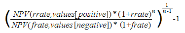{border="0"}

 

[]{#p202} 

###### 4.1.4.6.6.97        MOD {#mod style="tab-stops: 0pt"}

[]{style="FONT-FAMILY: 'Trebuchet MS','sans-serif'; COLOR: #15428b; FONT-SIZE: 9pt"} 

Returns the remainder after the number is divided by a divisor. The result has the same sign as the divisor.

 

**Syntax**

 

**MOD(number, divisor)**, where:

 

**number**[ ]{style="FONT-FAMILY: 'Times New Roman','serif'; FONT-SIZE: 12pt"}is the number for which you want to find the remainder.

**divisor** is the value by which you want to divide the number.

[]{style="FONT-FAMILY: 'Trebuchet MS','sans-serif'; COLOR: #15428b; FONT-SIZE: 9pt"} 

Remarks

[]{style="FONT-FAMILY: 'Trebuchet MS','sans-serif'; COLOR: #15428b; FONT-SIZE: 9pt"} 

[·      ]{style="FONT-FAMILY: Symbol"}The MOD function can be expressed in terms of the INT function,

[]{style="FONT-FAMILY: 'Trebuchet MS','sans-serif'; COLOR: #15428b; FONT-SIZE: 9pt"} 

[       ]{style="FONT-FAMILY: 'Courier New'; COLOR: black"} MOD(n, d) = n -- d \* INT(n/d)

 

[]{#p203} 

###### 4.1.4.6.6.98        MODE {#mode style="tab-stops: 0pt"}

[]{style="FONT-FAMILY: 'Trebuchet MS','sans-serif'; COLOR: #15428b; FONT-SIZE: 9pt"} 

Returns the most frequently occurring or repetitive, value in an array or range of data.

 

**Syntax**

 

**MODE(number1, number2, \...)**, where:

 

**number1, number2, \...** are arguments for which you want to calculate the mode.

[]{style="FONT-FAMILY: 'Trebuchet MS','sans-serif'; COLOR: #15428b; FONT-SIZE: 9pt"} 

Remarks

[]{style="FONT-FAMILY: 'Trebuchet MS','sans-serif'; COLOR: #15428b; FONT-SIZE: 9pt"} 

[·      ]{style="FONT-FAMILY: Symbol"}In a set of values, the mode is the most frequently occurring value.

[]{#p204} 

 

###### 4.1.4.6.6.99        MONTH {#month style="tab-stops: 0pt"}

 

Returns the month of a date represented by a serial number. The month is given as an integer, ranging from 1 (January) to 12 (December).

 

**Syntax**

 

**MONTH(serial_number)**, where:

 

**serial_number** is the date of the month you are trying to find. Dates should be entered by using the DATE function or as results of other formulas or functions. For example, use DATE(2002,11,12) for the 12th day of Nov, 2002.

 

**Remarks**

[]{style="FONT-FAMILY: 'Trebuchet MS','sans-serif'; COLOR: #15428b; FONT-SIZE: 9pt"} 

[·      ]{style="FONT-FAMILY: Symbol"}Dates are stored as sequential serial numbers so that they can be used in calculations. By default, January 1, 1900 is serial number 1 and January 1, 2008 is serial number 39448 because it is 39,448 days after January 1, 1900.

 

[]{#p205} 

###### 4.1.4.6.6.100      NEGBINOMDIST {#negbinomdist style="tab-stops: 0pt"}

[]{style="FONT-FAMILY: 'Trebuchet MS','sans-serif'; COLOR: #15428b; FONT-SIZE: 9pt"} 

Returns the negative binomial distribution. NEGBINOMDIST returns the probability that there will be number_f failures before the number_s-th success, when the constant probability of a success is probability_s.

 

**Syntax**

 

**NEGBINOMDIST(number_f, number_s, probability_s)**, where:

 

**number_f **is the number of failures.

**number_s[ ]{style="FONT-FAMILY: 'Times New Roman','serif'; FONT-SIZE: 12pt"}**is the threshold number of successes.

**probability_s[ ]{style="FONT-FAMILY: 'Times New Roman','serif'; FONT-SIZE: 12pt"}**is the probability of a success.

[]{style="FONT-FAMILY: 'Trebuchet MS','sans-serif'; COLOR: #15428b; FONT-SIZE: 9pt"} 

Remarks

[]{style="FONT-FAMILY: 'Trebuchet MS','sans-serif'; COLOR: #15428b; FONT-SIZE: 9pt"} 

[·      ]{style="FONT-FAMILY: Symbol"}number_s  must be \>= 1.

[·      ]{style="FONT-FAMILY: Symbol"}probability_s must be \>= 0 and \<= 1.

[·      ]{style="FONT-FAMILY: Symbol"}number_f  must be \>= 0.

[·      ]{style="FONT-FAMILY: Symbol"}The equation for the negative binomial distribution is,

[]{style="FONT-FAMILY: 'Trebuchet MS','sans-serif'; COLOR: #15428b; FONT-SIZE: 9pt"} 

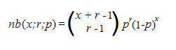{border="0"}

[]{style="FONT-FAMILY: 'Trebuchet MS','sans-serif'; COLOR: #15428b; FONT-SIZE: 9pt"} 

where x is number_f, r is number_s and p is probability_s.

[]{#p206} 

 

###### 4.1.4.6.6.101      NORMDIST {#normdist style="tab-stops: 0pt"}

[]{style="FONT-FAMILY: 'Trebuchet MS','sans-serif'; COLOR: #15428b; FONT-SIZE: 9pt"} 

Returns the normal distribution for the specified mean and standard deviation.

 

**Syntax**

 

**NORMDIST(x, mean, standard_dev, cumulative)**, where:

 

**x**[ ]{style="FONT-FAMILY: 'Times New Roman','serif'; FONT-SIZE: 12pt"}is the value for which you want the distribution.

**mean**[ ]{style="FONT-FAMILY: 'Times New Roman','serif'; FONT-SIZE: 12pt"}is the arithmetic mean of the distribution.

**standard_dev**[ ]{style="FONT-FAMILY: 'Times New Roman','serif'; FONT-SIZE: 12pt"}is the standard deviation of the distribution.

**cumulative**[ ]{style="FONT-FAMILY: 'Times New Roman','serif'; FONT-SIZE: 12pt"}is a logical value that determines the form of the function. If cumulative is True, NORMDIST returns the cumulative distribution function; if False, it returns the probability mass function.

[]{style="FONT-FAMILY: 'Trebuchet MS','sans-serif'; COLOR: #15428b; FONT-SIZE: 9pt"} 

Remarks

[]{style="FONT-FAMILY: 'Trebuchet MS','sans-serif'; COLOR: #15428b; FONT-SIZE: 9pt"} 

[·      ]{style="FONT-FAMILY: Symbol"}Standard_dev must be \> 0.

[·      ]{style="FONT-FAMILY: Symbol"}The equation for the normal density function (cumulative = False) is,

[]{style="FONT-FAMILY: 'Trebuchet MS','sans-serif'; COLOR: #15428b; FONT-SIZE: 9pt"} 

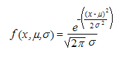{border="0"}

[]{style="FONT-FAMILY: 'Trebuchet MS','sans-serif'; COLOR: #15428b; FONT-SIZE: 9pt"} 

[·      ]{style="FONT-FAMILY: Symbol"}When cumulative = True, the formula is the integral from negative infinity to x of the given formula.

 

###### []{#p207}4.1.4.6.6.102      NormsDist {#normsdist style="tab-stops: 0pt"}

The NormsDist function returns the probability that the observed value of a standard normal random variable will be less than or equal to the parameter.

 

Syntax:

**NormsDist(value)**

 

where:

**value** is a numeric value that checks with the random variable.

 

###### 4.1.4.6.6.103      NORMINV {#norminv style="tab-stops: 0pt"}

[]{style="FONT-FAMILY: 'Trebuchet MS','sans-serif'; COLOR: #15428b; FONT-SIZE: 9pt"} 

Returns the**[ ]{style="COLOR: red"}**inverse of the normal cumulative distribution for the specified mean and standard deviation.

 

**Syntax**

 

**NORMINV(probability, mean, standard_dev)**, where:

 

**probability**[ ]{style="FONT-FAMILY: 'Times New Roman','serif'; FONT-SIZE: 12pt"}is a probability corresponding to the normal distribution.

**mean** is the arithmetic mean of the distribution.

**standard_dev** is the standard deviation of the distribution.

[]{style="FONT-FAMILY: 'Trebuchet MS','sans-serif'; COLOR: #15428b; FONT-SIZE: 9pt"} 

Remarks

[]{style="FONT-FAMILY: 'Trebuchet MS','sans-serif'; COLOR: #15428b; FONT-SIZE: 9pt"} 

[·      ]{style="FONT-FAMILY: Symbol"}Probability must be \>= 0 and \<= 1.

[·      ]{style="FONT-FAMILY: Symbol"}standard_dev must be \> 0.

[]{style="FONT-FAMILY: 'Trebuchet MS','sans-serif'; COLOR: #15428b; FONT-SIZE: 9pt"} 

Given a value for probability, NORMINV seeks value x such that NORMDIST(x, mean, standard_dev, True) = probability. NORMINV uses an iterative search technique.

 

###### []{#p208}4.1.4.6.6.104      NormsInv {#normsinv style="tab-stops: 0pt"}

The NormsInv function returns the standard normal random variable that has Mean 0 and Standard Deviation 1

 

Syntax:

**NormsDist(value)**

 

where:

**value** is the probability of the standard deviation.

 

###### 4.1.4.6.6.105      NOT {#not style="tab-stops: 0pt"}

[]{style="FONT-FAMILY: 'Trebuchet MS','sans-serif'; COLOR: #15428b; FONT-SIZE: 9pt"} 

Reverses the value of its argument.

 

**Syntax**

 

**NOT(logical)**, where:

 

**logical **is a value or expression that can be evaluated to True or False.

 

[]{#p209} 

###### 4.1.4.6.6.106      NOW {#now style="tab-stops: 0pt"}

[]{style="FONT-FAMILY: 'Trebuchet MS','sans-serif'; COLOR: #15428b; FONT-SIZE: 9pt"} 

Returns the serial number of the current date and time.

 

**Syntax**

 

**NOW( )**

 

**Remarks**

[]{style="FONT-FAMILY: 'Trebuchet MS','sans-serif'; COLOR: #15428b; FONT-SIZE: 9pt"} 

[·      ]{style="FONT-FAMILY: Symbol"}Dates are stored as sequential serial numbers so that they can be used in calculations. By default, January 1, 1900 is serial number 1 and January 1, 2008 is serial number 39448 because it is 39,448 days after January 1, 1900.

[·      ]{style="FONT-FAMILY: Symbol"}Numbers to the right of the decimal point in the serial number represent the time; numbers to the left represent the date. For example, the serial number .5 represents the time 12:00 noon.

 

[]{#p210} 

###### 4.1.4.6.6.107      NPER {#nper style="tab-stops: 0pt"}

[]{style="FONT-FAMILY: 'Trebuchet MS','sans-serif'; COLOR: #15428b; FONT-SIZE: 9pt"} 

Returns the number of periods for an investment based on periodic, constant payments and a constant interest rate.

 

**Syntax**

 

**NPER(rate, pmt, pv, fv, type)**, where:

 

**rate** is the interest rate per period.

**pmt**[ ]{style="FONT-FAMILY: 'Times New Roman','serif'; FONT-SIZE: 12pt"}is the payment made each period; it cannot change over the life of the annuity.

**pv** is the present value or the lump-sum amount that a series of future payments is worth right now.

**fv**[ ]{style="FONT-FAMILY: 'Times New Roman','serif'; FONT-SIZE: 12pt"}is the future value or a cash balance that you want to attain after the last payment is made. If fv is omitted, it is assumed to be 0 (the future value of a loan, for example, is 0).

**type**[ ]{style="FONT-FAMILY: 'Times New Roman','serif'; FONT-SIZE: 12pt"}is the number 0 or 1 and indicates when payments are due. If type equals:

[·      ]{style="FONT-FAMILY: Symbol"}0 - Payments are due at the end of the period.

[·      ]{style="FONT-FAMILY: Symbol"}1 - Payments are due at the beginning of the period.

 

[]{#p211} 

###### 4.1.4.6.6.108      NPV {#npv style="tab-stops: 0pt"}

[]{style="FONT-FAMILY: 'Trebuchet MS','sans-serif'; COLOR: #15428b; FONT-SIZE: 9pt"} 

Calculates the net present value of an investment by using a discount rate and a series of future payments (negative values) and income (positive values).

 

**Syntax**

 

**NPV(rate, value1, value2, \...)**, where:

 

**rate**[ ]{style="FONT-FAMILY: 'Times New Roman','serif'; FONT-SIZE: 12pt"}is the rate of discount over the length of one period.

**value1, value2, \...** are arguments representing the payments and income.

[·      ]{style="FONT-FAMILY: Symbol"}Value1, value2, \... must be equally spaced in time and occur at the end of each period.

[·      ]{style="FONT-FAMILY: Symbol"}NPV uses the order of value1, value2, \... to interpret the order of cash flows. Be sure to enter your payment and income values in the correct sequence.

[]{style="FONT-FAMILY: 'Trebuchet MS','sans-serif'; COLOR: #15428b; FONT-SIZE: 9pt"} 

Remarks

[]{style="FONT-FAMILY: 'Trebuchet MS','sans-serif'; COLOR: #15428b; FONT-SIZE: 9pt"} 

[·      ]{style="FONT-FAMILY: Symbol"}The NPV investment begins one period before the date of the value1 cash flow and ends with the last cash flow in the list. The NPV calculation is based on future cash flows. If your first cash flow occurs at the beginning of the first period, the first value must be added to the NPV result, not included in the value arguments.

[·      ]{style="FONT-FAMILY: Symbol"}If n is the number of cash flows in the list of values, the formula for NPV is,

[]{style="FONT-FAMILY: 'Trebuchet MS','sans-serif'; COLOR: #15428b; FONT-SIZE: 9pt"} 

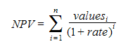{border="0"}

[]{#p212} 

 

###### 4.1.4.6.6.109      ODD {#odd style="tab-stops: 0pt"}

[]{style="FONT-FAMILY: 'Trebuchet MS','sans-serif'; COLOR: #15428b; FONT-SIZE: 9pt"} 

Returns the number rounded up to the nearest odd integer.

 

**Syntax**

 

**ODD(number)**, where:

 

**number**[ ]{style="FONT-FAMILY: 'Times New Roman','serif'; FONT-SIZE: 12pt"}is the value to be rounded off.

 

**Remarks**

[]{style="FONT-FAMILY: 'Trebuchet MS','sans-serif'; COLOR: #15428b; FONT-SIZE: 9pt"} 

[·      ]{style="FONT-FAMILY: Symbol"}Regardless of the sign of a number, a value is rounded up when adjusted away from zero. If the number is an odd integer, no rounding occurs.

 

[]{#p213} 

###### 4.1.4.6.6.110      O[[R]{style="FONT-WEIGHT: normal"}]{.Heading6Char} {#or style="tab-stops: 0pt"}

[]{style="FONT-FAMILY: 'Trebuchet MS','sans-serif'; COLOR: #15428b; FONT-SIZE: 9pt"} 

Returns True if any argument is True; returns False if all arguments are False.

 

**Syntax**

 

**OR(logical1, logical2, \...)**, where:

 

**logical1, logical2, \...** are conditions you want to test that can be either True or False.

[]{style="FONT-FAMILY: 'Trebuchet MS','sans-serif'; COLOR: #15428b; FONT-SIZE: 9pt"} 

Remarks

[]{style="FONT-FAMILY: 'Trebuchet MS','sans-serif'; COLOR: #15428b; FONT-SIZE: 9pt"} 

[·      ]{style="FONT-FAMILY: Symbol"}The arguments must evaluate to logical values such as True or False or in arrays or references that contain logical values.

 

[]{#p214} 

###### 4.1.4.6.6.111      PEARSON {#pearson style="tab-stops: 0pt"}

[]{style="FONT-FAMILY: 'Trebuchet MS','sans-serif'; COLOR: #15428b; FONT-SIZE: 9pt"} 

Returns the Pearson product moment correlation coefficient, r, a dimensionless index that ranges from -1.0 to 1.0 inclusive and reflects the extent of a linear relationship between two data sets.

 

**Syntax**

 

**PEARSON(array1, array2)**, where:

 

**array1 **is a set of independent values.

**array2**[ ]{style="FONT-FAMILY: 'Times New Roman','serif'; FONT-SIZE: 12pt"}is a set of dependent values.

[]{style="FONT-FAMILY: 'Trebuchet MS','sans-serif'; COLOR: #15428b; FONT-SIZE: 9pt"} 

Remarks

[]{style="FONT-FAMILY: 'Trebuchet MS','sans-serif'; COLOR: #15428b; FONT-SIZE: 9pt"} 

[·      ]{style="FONT-FAMILY: Symbol"}The arguments must be either numbers or names, array constants or references that contain numbers.

[·      ]{style="FONT-FAMILY: Symbol"}The formula for the Pearson product moment correlation coefficient, r, is,

[]{style="FONT-FAMILY: 'Trebuchet MS','sans-serif'; COLOR: #15428b; FONT-SIZE: 9pt"} 

{border="0"}

[]{style="FONT-FAMILY: 'Trebuchet MS','sans-serif'; COLOR: #15428b; FONT-SIZE: 9pt"} 

where x-bar and y-bar are the sample means AVERAGE(array1) and AVERAGE(array2).

 

[]{#p215} 

###### 4.1.4.6.6.112      PERCENTILE {#percentile style="tab-stops: 0pt"}

[]{style="FONT-FAMILY: 'Trebuchet MS','sans-serif'; COLOR: #15428b; FONT-SIZE: 9pt"} 

Returns the k-th percentile of values in a range.

 

**Syntax**

\
**PERCENTILE(array, k)**, where:

 

**array**[ ]{style="FONT-FAMILY: 'Times New Roman','serif'; FONT-SIZE: 12pt"}is the array or range of data that defines relative standing.

**k **is the percentile value in the range 0..1, inclusive.

[]{style="FONT-FAMILY: 'Trebuchet MS','sans-serif'; COLOR: #15428b; FONT-SIZE: 9pt"} 

Remarks

[]{style="FONT-FAMILY: 'Trebuchet MS','sans-serif'; COLOR: #15428b; FONT-SIZE: 9pt"} 

[·      ]{style="FONT-FAMILY: Symbol"}k must be \>=10 and \<= 1.

[·      ]{style="FONT-FAMILY: Symbol"}If k is not a multiple of 1/(n - 1), PERCENTILE interpolates to determine the value at the k-th percentile.

 

[]{#p216} 

###### 4.1.4.6.6.113      PERCENTRANK {#percentrank style="tab-stops: 0pt"}

[]{style="FONT-FAMILY: 'Trebuchet MS','sans-serif'; COLOR: #15428b; FONT-SIZE: 9pt"} 

Returns the rank of a value in a data set as a percentage of the data set.

 

**Syntax**

 

**PERCENTRANK(array, x, significance)**, where:

 

**array** is the range of data with numeric values that defines relative standing.

**x **is the value for which you want to know the rank.

**significance**[ ]{style="FONT-FAMILY: 'Times New Roman','serif'; FONT-SIZE: 12pt"}is an optional value that identifies the number of significant digits for the returned percentage value. If omitted, PERCENTRANK uses three digits (0.xxx).

[]{style="FONT-FAMILY: 'Trebuchet MS','sans-serif'; COLOR: #15428b; FONT-SIZE: 9pt"} 

Remarks

[]{style="FONT-FAMILY: 'Trebuchet MS','sans-serif'; COLOR: #15428b; FONT-SIZE: 9pt"} 

[·      ]{style="FONT-FAMILY: Symbol"}Significance must be \>= 1.

[·      ]{style="FONT-FAMILY: Symbol"}If x does not match one of the values in the array, PERCENTRANK interpolates to return the correct percentage rank.

 

[]{#p217} 

###### 4.1.4.6.6.114      PERMUT {#permut style="tab-stops: 0pt"}

[]{style="FONT-FAMILY: 'Trebuchet MS','sans-serif'; COLOR: #15428b; FONT-SIZE: 9pt"} 

Returns the**[ ]{style="COLOR: red"}**number of permutations for a given number of objects that can be selected from a number of objects.

 

**Syntax**

 

**PERMUT(number, number_chosen)**, where:

 

**number** is an integer that describes the number of objects.

**number_chosen** is an integer that describes the number of objects in each permutation.

[]{style="FONT-FAMILY: 'Trebuchet MS','sans-serif'; COLOR: #15428b; FONT-SIZE: 9pt"} 

Remarks

[]{style="FONT-FAMILY: 'Trebuchet MS','sans-serif'; COLOR: #15428b; FONT-SIZE: 9pt"} 

[·      ]{style="FONT-FAMILY: Symbol"}Number must be \> 0 and  number_chosen must be \>= 0.

[·      ]{style="FONT-FAMILY: Symbol"}Number must be \>= number_chosen.

[·      ]{style="FONT-FAMILY: Symbol"}The equation for the number of permutations is,

[]{style="FONT-FAMILY: 'Trebuchet MS','sans-serif'; COLOR: #15428b; FONT-SIZE: 9pt"} 

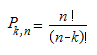{border="0"}

 

[]{#p218} 

###### 4.1.4.6.6.115      PI {#pi style="tab-stops: 0pt"}

[]{style="FONT-FAMILY: 'Trebuchet MS','sans-serif'; COLOR: #15428b; FONT-SIZE: 9pt"} 

Returns the number 3.14159265358979, the mathematical constant pi, accurate to 15 digits.

 

**Syntax**

 

**PI( )**

 

[]{#p219} 

###### 4.1.4.6.6.116      PMT {#pmt style="tab-stops: 0pt"}

[]{style="FONT-FAMILY: 'Trebuchet MS','sans-serif'; COLOR: #15428b; FONT-SIZE: 9pt"} 

Calculates the payment for a loan based on constant payments and a constant interest rate.

 

**Syntax**

 

**PMT(rate, nper, pv, fv, type)**, where:

 

**rate**[ ]{style="FONT-FAMILY: 'Times New Roman','serif'; FONT-SIZE: 12pt"}is the interest rate for the loan.

**nper[ ]{style="COLOR: red"}**is the total number of payments for the loan.

**pv**[ ]{style="FONT-FAMILY: 'Times New Roman','serif'; FONT-SIZE: 12pt"}is the present value or the total amount that a series of future payments is worth now; also known as the principal.

**fv**[ ]{style="FONT-FAMILY: 'Times New Roman','serif'; FONT-SIZE: 12pt"}is the future value or a cash balance you want to attain after the last payment is made. If fv is omitted, it is assumed to be 0 (zero), that is, the future value of a loan is 0.

**type** is the number 0 (zero) or 1 and indicates when payments are due. If type equals:

[·      ]{style="FONT-FAMILY: Symbol"}0 - Payments are due at the end of the period.

[·      ]{style="FONT-FAMILY: Symbol"}1 - Payments are due at the beginning of the period.

[]{style="FONT-FAMILY: 'Trebuchet MS','sans-serif'; COLOR: #15428b; FONT-SIZE: 9pt"} 

Remarks[ ]{style="FONT-FAMILY: 'Times New Roman','serif'; FONT-SIZE: 12pt"}

[]{style="FONT-FAMILY: 'Trebuchet MS','sans-serif'; COLOR: #15428b; FONT-SIZE: 9pt"} 

[·      ]{style="FONT-FAMILY: Symbol"}The payment returned by PMT includes principal and interest but no taxes, reserve payments or fees sometimes associated with loans.

[·      ]{style="FONT-FAMILY: Symbol"}Make sure that you are consistent about the units you use for specifying rate and nper. If you make monthly payments on a four-year loan at an annual interest rate of 12 percent, use 12%/12 for rate and 4\*12 for nper. If you make annual payments on the same loan, use 12 percent for rate and 4 for nper.

 

[]{#p220} 

###### 4.1.4.6.6.117      POISSON {#poisson style="tab-stops: 0pt"}

[]{style="FONT-FAMILY: 'Trebuchet MS','sans-serif'; COLOR: #15428b; FONT-SIZE: 9pt"} 

Returns the Poisson distribution.

 

**Syntax**

 

**POISSON(x, mean, cumulative)**, where:

 

**x**[ ]{style="FONT-FAMILY: 'Times New Roman','serif'; FONT-SIZE: 12pt"}is the number of events.

**mean** is the expected numeric value.

**cumulative**[ ]{style="FONT-FAMILY: 'Times New Roman','serif'; FONT-SIZE: 12pt"}is a logical value that determines the form of the probability distribution returned. If cumulative is True, **POISSON** returns the cumulative Poisson probability that the number of random events occurring will be between zero and x inclusive; if False, it returns the Poisson probability mass function that the number of events occurring will be exactly x.

[]{style="FONT-FAMILY: 'Trebuchet MS','sans-serif'; COLOR: #15428b; FONT-SIZE: 9pt"} 

Remarks

[]{style="FONT-FAMILY: 'Trebuchet MS','sans-serif'; COLOR: #15428b; FONT-SIZE: 9pt"} 

[·      ]{style="FONT-FAMILY: Symbol"}X must be \>= 0.

[·      ]{style="FONT-FAMILY: Symbol"}Mean must be \> 0.

[·      ]{style="FONT-FAMILY: Symbol"}POISSON is calculated as follows:

[]{style="FONT-FAMILY: 'Trebuchet MS','sans-serif'; COLOR: #15428b; FONT-SIZE: 9pt"} 

For cumulative = False,

[]{style="FONT-FAMILY: 'Trebuchet MS','sans-serif'; COLOR: #15428b; FONT-SIZE: 9pt"} 

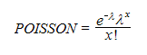{border="0"}

[]{style="FONT-FAMILY: 'Trebuchet MS','sans-serif'; COLOR: #15428b; FONT-SIZE: 9pt"} 

For cumulative = True,

[]{style="FONT-FAMILY: 'Trebuchet MS','sans-serif'; COLOR: #15428b; FONT-SIZE: 9pt"} 

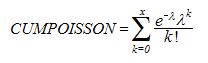{border="0"}

 

###### []{#p221}4.1.4.6.6.118      Pow {#pow style="tab-stops: 0pt"}

The **Pow** function returns the number raised to the specified power.

 

Syntax:

**POW(number, power) **

 

where:

**number** is the base number. It can be any real number.

**power** is the exponent to which, the base number is raised.

 

###### 4.1.4.6.6.119      POWER {#power style="tab-stops: 0pt"}

[]{style="FONT-FAMILY: 'Trebuchet MS','sans-serif'; COLOR: #15428b; FONT-SIZE: 9pt"} 

Returns the result of a number raised to a power.

 

**Syntax**

 

**POWER(number, power)**, where:

 

**number **is the base number. It can be any real number.

**power **is the exponent to which the base number is raised.

 

[]{#p222} 

###### 4.1.4.6.6.120      PPMT {#ppmt style="tab-stops: 0pt"}

[]{style="FONT-FAMILY: 'Trebuchet MS','sans-serif'; COLOR: #15428b; FONT-SIZE: 9pt"} 

Returns the payment on the principal for a given period, for an investment based on periodic, constant payments and a constant interest rate.

 

**Syntax**

 

**PPMT(rate, per, nper, pv, fv, type)**, where:

 

**rate**[ ]{style="FONT-FAMILY: 'Times New Roman','serif'; FONT-SIZE: 12pt"}is the interest rate per period.

**per**[ ]{style="FONT-FAMILY: 'Times New Roman','serif'; FONT-SIZE: 12pt"}specifies the period and must be in the range of 1 to nper.

**nper[ ]{style="COLOR: red"}**is the total number of payment periods in an annuity.

**pv** is the present value--- the total amount that a series of future payments is worth now.

**fv** is the future value or a cash balance that you may want to attain after the last payment is made. If fv is omitted, it is assumed to be 0 (zero), that is, the future value of a loan is 0.

**type**[ ]{style="FONT-FAMILY: 'Times New Roman','serif'; FONT-SIZE: 12pt"}is the number 0 or 1 and indicates when payments are due. If type equals:

[·      ]{style="FONT-FAMILY: Symbol"}0 - Payments are due at the end of the period.

[·      ]{style="FONT-FAMILY: Symbol"}1 - Payments are due at the beginning of the period.

[\
]{style="FONT-SIZE: 9pt"}Remarks

[]{style="FONT-FAMILY: 'Trebuchet MS','sans-serif'; COLOR: #15428b; FONT-SIZE: 9pt"} 

[·      ]{style="FONT-FAMILY: Symbol"}Make sure that you are consistent about the units you use for specifying rate and nper. If you make monthly payments on a four-year loan at 12 percent annual interest, use 12%/12 for rate and 4\*12 for nper. If you make annual payments on the same loan, use 12% for rate and 4 for nper.

 

[]{#p223} 

###### 4.1.4.6.6.121      PROB {#prob style="tab-stops: 0pt"}

[]{style="FONT-FAMILY: 'Trebuchet MS','sans-serif'; COLOR: #15428b; FONT-SIZE: 9pt"} 

Returns the probability whose values are in a range that is between two limits. If upper_limit is not supplied, returns the probability that values in x_range are equal to lower_limit.

 

**Syntax**

 

**PROB(x_range, prob_range, lower_limit, upper_limit)**, where:

 

**x_range[ ]{style="COLOR: red"}**is the range of numeric values of x with which there are associated probabilities.

**prob_range** is a set of probabilities associated with values in x_range.

**lower_limit** is the lower bound on the value for which you want a probability.

**upper_limit**[ ]{style="FONT-FAMILY: 'Times New Roman','serif'; FONT-SIZE: 12pt"}is the optional upper bound on the value for which you want a probability.

[]{style="FONT-FAMILY: 'Trebuchet MS','sans-serif'; COLOR: #15428b; FONT-SIZE: 9pt"} 

Remarks

[]{style="FONT-FAMILY: 'Trebuchet MS','sans-serif'; COLOR: #15428b; FONT-SIZE: 9pt"} 

[·      ]{style="FONT-FAMILY: Symbol"}Any value in prob_range must be \> 0 and \< 1.

[·      ]{style="FONT-FAMILY: Symbol"}If upper_limit is omitted, PROB returns the probability of being equal to lower_limit.

 

[]{#p224} 

###### 4.1.4.6.6.122      PRODUCT {#product style="tab-stops: 0pt"}

[]{style="FONT-FAMILY: 'Trebuchet MS','sans-serif'; COLOR: #15428b; FONT-SIZE: 9pt"} 

Multiplies all the numbers given as arguments and returns the product.

 

**Syntax**

 

**PRODUCT(number1, number2, \...)**, where:

 

**number1, number2, \...** are numbers that you want to multiply.

 

[]{#p225} 

###### 4.1.4.6.6.123      PV {#pv style="tab-stops: 0pt"}

[]{style="FONT-FAMILY: 'Trebuchet MS','sans-serif'; COLOR: #15428b; FONT-SIZE: 9pt"} 

Returns the present value of an investment. The present value is the total amount that a series of future payments is worth now.

 

**Syntax**

 

**PV(rate, nper, pmt, fv, type)**, where:

 

**rate** is the interest rate per period. For example, if you obtain an automobile loan at a 10% annual interest rate and make monthly payments, your interest rate per month is 10%/12 or 0.83%. You would enter 10%/12 or 0.83% or 0.0083, into the formula as the rate.

**nper**[ ]{style="FONT-FAMILY: 'Times New Roman','serif'; FONT-SIZE: 12pt"}is the total number of payment periods in an annuity. For example, if you get a four-year car loan and make monthly payments, your loan has 4\*12 (or 48) periods. You would enter 48 into the formula for nper.

**pmt**[ ]{style="FONT-FAMILY: 'Times New Roman','serif'; FONT-SIZE: 12pt"}is the payment made for each period and cannot change over the life of the annuity. Typically, pmt includes principal and interest but, no other fees or taxes. For example, the monthly payments on a \$10,000, four-year car loan at 12 percent are \$263.33. You will have to enter -263.33 into the formula as the pmt. If pmt is omitted, you must include the fv argument.

**fv **is the future value or a cash balance that you want to attain after the last payment is made. If fv is omitted, it is assumed to be 0 (the future value of a loan, for example, is 0). For example, if you want to save \$50,000 to pay for a special project in 18 years, then \$50,000 is the future value. You could then make a conservative guess at an interest rate and determine how much you must save each month. If fv is omitted, you must include the pmt argument.

**type[ ]{style="COLOR: red"}**is the number 0 or 1 and indicates when payments are due. If type equals:

[·      ]{style="FONT-FAMILY: Symbol"}0 - Payments are due at the end of the period.

[·      ]{style="FONT-FAMILY: Symbol"}1 - Payments are due at the beginning of the period.

[\
]{style="FONT-SIZE: 9pt"}Remarks[ ]{style="FONT-FAMILY: 'Times New Roman','serif'; FONT-SIZE: 12pt"}

[]{style="FONT-FAMILY: 'Trebuchet MS','sans-serif'; COLOR: #15428b; FONT-SIZE: 9pt"} 

[·      ]{style="FONT-FAMILY: Symbol"}Make sure that you are consistent about the units you use for specifying rate and nper. If you make monthly payments on a four-year loan at 12 percent annual interest, use 12%/12 for rate and 4\*12 for nper. If you make annual payments on the same loan, use 12% for rate and 4 for nper.

[·      ]{style="FONT-FAMILY: Symbol"}In annuity functions, the cash you pay out such as a deposit to savings is represented by a negative number; the cash you receive such as a dividend check is represented by a positive number.

[·      ]{style="FONT-FAMILY: Symbol"}One financial argument is solved for in terms of the others. If rate is not 0, then,

[]{style="FONT-FAMILY: 'Trebuchet MS','sans-serif'; COLOR: #15428b; FONT-SIZE: 9pt"} 

 {border="0"}

[]{style="FONT-FAMILY: 'Trebuchet MS','sans-serif'; COLOR: #15428b; FONT-SIZE: 9pt"} 

If rate is 0, then,

 

 (pmt \* nper) + pv + fv = 0

 

[]{#p226} 

###### 4.1.4.6.6.124      QUARTILE {#quartile style="tab-stops: 0pt"}

[]{style="FONT-FAMILY: 'Trebuchet MS','sans-serif'; COLOR: #15428b; FONT-SIZE: 9pt"} 

Returns the quartile of a data set.

[]{style="FONT-FAMILY: 'Trebuchet MS','sans-serif'; COLOR: #15428b; FONT-SIZE: 9pt"} 

Syntax

[]{style="FONT-FAMILY: 'Trebuchet MS','sans-serif'; COLOR: #15428b; FONT-SIZE: 9pt"} 

QUARTILE(array, quart), where:

 

array[ ]{style="FONT-FAMILY: 'Times New Roman','serif'; FONT-SIZE: 12pt"}is the array or cell range of numeric values for which you want the quartile value.

quart[ ]{style="FONT-FAMILY: 'Times New Roman','serif'; FONT-SIZE: 12pt"}indicates which value to return.

 

 

+------------------------------------------------------------------+-----------------------------------+
| []{#p227}   Quartile   [      ]{style="COLOR: red"}              |                                   |
|                                                                  |                                   |
|                                                                  | Value Returned                    |
|                                                                  |                                   |
|                                                                  |                                   |
+------------------------------------------------------------------+-----------------------------------+
| 0                                                                | Minimum value                     |
|                                                                  |                                   |
|                                                                  |                                   |
+------------------------------------------------------------------+-----------------------------------+
| 1                                                                | First quartile (25th percentile)  |
|                                                                  |                                   |
|                                                                  |                                   |
+------------------------------------------------------------------+-----------------------------------+
| 2                                                                | Median value (50th percentile)    |
|                                                                  |                                   |
|                                                                  |                                   |
+------------------------------------------------------------------+-----------------------------------+
| 3                                                                | Third quartile (75th percentile)  |
|                                                                  |                                   |
|                                                                  |                                   |
+------------------------------------------------------------------+-----------------------------------+
| 4                                                                | Maximum value                     |
|                                                                  |                                   |
|                                                                  |                                   |
+------------------------------------------------------------------+-----------------------------------+

 

 

###### 4.1.4.6.6.125      RADIANS {#radians style="tab-stops: 0pt"}

[]{style="FONT-FAMILY: 'Trebuchet MS','sans-serif'; COLOR: #15428b; FONT-SIZE: 9pt"} 

Converts degrees to radians.

 

**Syntax**

 

**RADIANS(angle)**, where:

 

**angle **is an angle in degrees that you want to convert.

 

[]{#p228} 

###### 4.1.4.6.6.126      RAND {#rand style="tab-stops: 0pt"}

[]{style="FONT-FAMILY: 'Trebuchet MS','sans-serif'; COLOR: #15428b; FONT-SIZE: 9pt"} 

Returns an evenly distributed random number greater than or equal to 0 and less than 1.

[]{style="FONT-FAMILY: 'Trebuchet MS','sans-serif'; COLOR: #15428b; FONT-SIZE: 9pt"} 

Syntax

[]{style="FONT-SIZE: 9pt"} 

**[RAND( )]{style="FONT-SIZE: 9pt"}**

 

[]{#p229} 

###### 4.1.4.6.6.127      RANK {#rank style="tab-stops: 0pt"}

 

Returns the rank of a number in a list of numbers. The rank of a number is its size relative to other values in a list. (If you were to sort the list, the rank of the number would be its position)

 

**Syntax**

 

**RANK(number, ref, order)**, where:

 

**number**[ ]{style="FONT-FAMILY: 'Times New Roman','serif'; FONT-SIZE: 12pt"}is the number whose rank you want to find.

**ref **is an array of or a reference to a list of numbers. 

**order**[ ]{style="FONT-FAMILY: 'Times New Roman','serif'; FONT-SIZE: 12pt"}is a number specifying how to rank numbers.

[]{style="FONT-FAMILY: 'Trebuchet MS','sans-serif'; COLOR: #15428b; FONT-SIZE: 9pt"} 

[·      ]{style="FONT-FAMILY: Symbol"}If the order is 0 (zero) or omitted, the number is ranked as if ref were a list sorted in descending order.

[·      ]{style="FONT-FAMILY: Symbol"}If the order is any nonzero value, the number is ranked as if ref were a list sorted in ascending order.

[]{style="FONT-FAMILY: 'Trebuchet MS','sans-serif'; COLOR: #15428b; FONT-SIZE: 9pt"} 

Remark

[]{style="FONT-FAMILY: 'Trebuchet MS','sans-serif'; COLOR: #15428b; FONT-SIZE: 9pt"} 

[·      ]{style="FONT-FAMILY: Symbol"}RANK gives duplicate numbers of the same rank. However, the presence of duplicate numbers will affect the ranks of subsequent numbers.

 

[]{#p230} 

###### 4.1.4.6.6.128      RATE {#rate style="tab-stops: 0pt"}

[]{style="FONT-FAMILY: 'Trebuchet MS','sans-serif'; COLOR: #15428b; FONT-SIZE: 9pt"} 

Returns the interest rate per period of an annuity. RATE is calculated by iteration and may not converge to a unique solution.

 

**Syntax**

 

**RATE(nper, pmt, pv, fv, type, guess)**, where:

 

**nper**[ ]{style="FONT-FAMILY: 'Times New Roman','serif'; FONT-SIZE: 12pt"}is the total number of payment periods in an annuity.

**pmt** is the payment made for each period and cannot change over the life of the annuity. Typically, pmt includes  the principal and interest but, no other fees or taxes. If pmt is omitted, you must include the fv argument.

**pv**[ ]{style="FONT-FAMILY: 'Times New Roman','serif'; FONT-SIZE: 12pt"}is the present value--- the total amount that a series of future payments is worth now.

**fv **is the future value or a cash balance that you want to attain after the last payment is made. If fv is omitted, it is assumed to be 0 (the future value of a loan, for example, is 0).

**type **is the number 0 or 1 and indicates when payments are due. If type equals:

[·      ]{style="FONT-FAMILY: Symbol"}**0** - Payments are due at the end of the period.

[·      ]{style="FONT-FAMILY: Symbol"}**1** - Payments are due at the beginning of the period.

[·      ]{style="FONT-FAMILY: Symbol"}**guess** is your guess for what the rate will be.

[·      ]{style="FONT-FAMILY: Symbol"}If you omit guess, it is assumed to be 10 percent.

[·      ]{style="FONT-FAMILY: Symbol"}If RATE does not converge, try different values for guess. RATE usually converges if guess is between 0 and 1.

 

[]{#p231} 

###### 4.1.4.6.6.129      RIGHT {#right style="tab-stops: 0pt"}

[]{style="FONT-FAMILY: 'Trebuchet MS','sans-serif'; COLOR: #15428b; FONT-SIZE: 9pt"} 

RIGHT returns the last character or characters in a text string, based on the number of characters you specify.

 

**Syntax**

 

**RIGHT(text, num_chars)**, where:

 

**text** is the text string containing the characters you want to extract.

**num_chars **specifies the number of characters you want RIGHT to extract.

[]{style="FONT-FAMILY: 'Trebuchet MS','sans-serif'; COLOR: #15428b; FONT-SIZE: 9pt"} 

Remarks

[]{style="FONT-FAMILY: 'Trebuchet MS','sans-serif'; COLOR: #15428b; FONT-SIZE: 9pt"} 

[·      ]{style="FONT-FAMILY: Symbol"}**Num_chars** must be **greater than or equal to zero**.

[·      ]{style="FONT-FAMILY: Symbol"}If num_chars is greater than the length of text, RIGHT returns all the text.

[·      ]{style="FONT-FAMILY: Symbol"}If num_chars is omitted, it is assumed to be 1.

 

[]{#p232} 

###### 4.1.4.6.6.130      ROUND {#round style="tab-stops: 0pt"}

[]{style="FONT-FAMILY: 'Trebuchet MS','sans-serif'; COLOR: #15428b; FONT-SIZE: 9pt"} 

Rounds a number to a specified number of digits.

 

**Syntax**

 

**ROUND(number, num_digits)**, where:

 

**number**[ ]{style="FONT-FAMILY: 'Times New Roman','serif'; FONT-SIZE: 12pt"}is the number you want to round off.

**num_digits**[ ]{style="FONT-FAMILY: 'Times New Roman','serif'; FONT-SIZE: 12pt"}specifies the number of digits you want to round off.

[]{style="FONT-FAMILY: 'Trebuchet MS','sans-serif'; COLOR: #15428b; FONT-SIZE: 9pt"} 

Remarks

[]{style="FONT-FAMILY: 'Trebuchet MS','sans-serif'; COLOR: #15428b; FONT-SIZE: 9pt"} 

[·      ]{style="FONT-FAMILY: Symbol"}If num_digits \> 0, then number is rounded off to the specified number of decimal places.

[·      ]{style="FONT-FAMILY: Symbol"}If num_digits = 0, then number is rounded off to the nearest integer.

[·      ]{style="FONT-FAMILY: Symbol"}If num_digits  \< 0, then number is rounded off to the left of the decimal point.

 

[]{#p233} 

###### 4.1.4.6.6.131      ROUNDDOWN {#rounddown style="tab-stops: 0pt"}

 

Rounds a number down towards zero.

 

**Syntax**

\
**ROUNDDOWN(number, num_digits)**, where:

 

**number** is any real number that you want rounded down.

**Num_digits**[ ]{style="FONT-FAMILY: 'Times New Roman','serif'; FONT-SIZE: 12pt"}is the number of digits to which you want to round a number.

[]{style="FONT-FAMILY: 'Trebuchet MS','sans-serif'; COLOR: #15428b; FONT-SIZE: 9pt"} 

Remark

[]{style="FONT-FAMILY: 'Trebuchet MS','sans-serif'; COLOR: #15428b; FONT-SIZE: 9pt"} 

[·      ]{style="FONT-FAMILY: Symbol"}ROUNDDOWN behaves like ROUND, except that it always rounds a number down.

 

[]{#p234} 

###### 4.1.4.6.6.132      ROUNDUP {#roundup style="tab-stops: 0pt"}

[]{style="FONT-FAMILY: 'Trebuchet MS','sans-serif'; COLOR: #15428b; FONT-SIZE: 9pt"} 

Rounds a number up away from 0 (zero).

 

**Syntax**

\
**ROUNDUP(number, num_digits)**, where:

 

**number**[ ]{style="FONT-FAMILY: 'Times New Roman','serif'; FONT-SIZE: 12pt"}is any real number that you want rounded up.

**num_digits**[ ]{style="FONT-FAMILY: 'Times New Roman','serif'; FONT-SIZE: 12pt"}is the number of digits to which you want to round a number.

[]{style="FONT-FAMILY: 'Trebuchet MS','sans-serif'; COLOR: #15428b; FONT-SIZE: 9pt"} 

Remarks

[]{style="FONT-FAMILY: 'Trebuchet MS','sans-serif'; COLOR: #15428b; FONT-SIZE: 9pt"} 

[·      ]{style="FONT-FAMILY: Symbol"}ROUNDUP behaves like ROUND, except that it always rounds a number up.

 

[]{#p235} 

###### 4.1.4.6.6.133      RSQ {#rsq style="tab-stops: 0pt"}

[]{style="FONT-FAMILY: 'Trebuchet MS','sans-serif'; COLOR: #15428b; FONT-SIZE: 9pt"} 

Returns the square of the Pearson product moment correlation coefficient through data points in known_y\'s and known_x\'s.[ ]{style="FONT-FAMILY: 'Times New Roman','serif'; FONT-SIZE: 12pt"}

 

Syntax

 

**RSQ(known_y\'s, known_x\'s)**, where:

 

**known_y\'s** is an array or range of data points.

**known_x\'s**[ ]{style="FONT-FAMILY: 'Times New Roman','serif'; FONT-SIZE: 12pt"}is an array or range of data points.

[]{style="FONT-FAMILY: 'Trebuchet MS','sans-serif'; COLOR: #15428b; FONT-SIZE: 9pt"} 

Remarks

[]{style="FONT-FAMILY: 'Trebuchet MS','sans-serif'; COLOR: #15428b; FONT-SIZE: 9pt"} 

[·      ]{style="FONT-FAMILY: Symbol"}The equation for the Pearson product moment correlation coefficient is,

[]{style="FONT-FAMILY: 'Trebuchet MS','sans-serif'; COLOR: #15428b; FONT-SIZE: 9pt"} 

{border="0"}

[]{style="FONT-FAMILY: 'Trebuchet MS','sans-serif'; COLOR: #15428b; FONT-SIZE: 9pt"} 

where:

 

x-bar and y-bar are the sample means AVERAGE(known_x\'s) and AVERAGE(known_y\'s).

RSQ returns r2 which, is the square of this correlation coefficient.

 

[]{#p236} 

###### 4.1.4.6.6.134      SECOND {#second style="tab-stops: 0pt"}

 

Returns the seconds of a time value. The second is given as an integer in the range 0 (zero) to 59.

 

Syntax

 

**SECOND(serial_number)**, where:

 

**serial_number** is the time that contains the seconds you want to find.

[]{style="FONT-FAMILY: 'Trebuchet MS','sans-serif'; COLOR: #15428b; FONT-SIZE: 9pt"} 

Remarks

[]{style="FONT-FAMILY: 'Trebuchet MS','sans-serif'; COLOR: #15428b; FONT-SIZE: 9pt"} 

[·      ]{style="FONT-FAMILY: Symbol"}Time values are a portion of a date value and are represented by a decimal number (for example, 12:00 PM is represented as 0.5 because it is half of a day).

 

[]{#p237} 

###### 4.1.4.6.6.135      SIGN {#sign style="tab-stops: 0pt"}

[]{style="FONT-FAMILY: 'Trebuchet MS','sans-serif'; COLOR: #15428b; FONT-SIZE: 9pt"} 

Determines the sign of a number. Returns 1 if the number is positive, zero (0) if the number is 0 and -1 if the number is negative.

 

Syntax

 

**SIGN(number)**, where:

 

**number**[ ]{style="FONT-FAMILY: 'Times New Roman','serif'; FONT-SIZE: 12pt"}is any real number.

 

[]{#p238} 

###### 4.1.4.6.6.136      SIN {#sin style="tab-stops: 0pt"}

 

Returns the sine of the given angle.

[]{style="FONT-FAMILY: 'Trebuchet MS','sans-serif'; COLOR: #15428b; FONT-SIZE: 9pt"} 

Syntax

 

**SIN(number)**, where:

 

**number **is the angle in radians for which you want the sine.

 

[]{#p239} 

###### 4.1.4.6.6.137      SINH {#sinh style="tab-stops: 0pt"}

 

Returns the**[ ]{style="COLOR: red"}**hyperbolic sine of a number.

[]{style="FONT-FAMILY: 'Trebuchet MS','sans-serif'; COLOR: #15428b; FONT-SIZE: 9pt"} 

Syntax

 

**SINH(number)**, where:

 

**number **is any real number.

[]{style="FONT-FAMILY: 'Trebuchet MS','sans-serif'; COLOR: #15428b; FONT-SIZE: 9pt"} 

Remarks

[]{style="FONT-FAMILY: 'Trebuchet MS','sans-serif'; COLOR: #15428b; FONT-SIZE: 9pt"} 

[·      ]{style="FONT-FAMILY: Symbol"}The formula for the hyperbolic sine is,

[]{style="FONT-FAMILY: 'Trebuchet MS','sans-serif'; COLOR: #15428b; FONT-SIZE: 9pt"} 

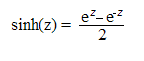{border="0"}

 

[]{#p240} 

###### 4.1.4.6.6.138      SKEW {#skew style="tab-stops: 0pt"}

[]{style="FONT-FAMILY: 'Trebuchet MS','sans-serif'; COLOR: #15428b; FONT-SIZE: 9pt"} 

Returns the skewness of a distribution. Skewness characterizes the degree of asymmetry of a distribution around its mean.

[]{style="FONT-FAMILY: 'Trebuchet MS','sans-serif'; COLOR: #15428b; FONT-SIZE: 9pt"} 

Syntax

[]{style="FONT-FAMILY: 'Trebuchet MS','sans-serif'; COLOR: #15428b; FONT-SIZE: 9pt"} 

**SKEW(number1, number2, \...)**, where:

 

**number1, number2** \... are arguments for which you want to calculate the skewness. You can also use a single array or a reference to an array instead of arguments separated by commas.

[]{style="FONT-FAMILY: 'Trebuchet MS','sans-serif'; COLOR: #15428b; FONT-SIZE: 9pt"} 

Remarks

[]{style="FONT-FAMILY: 'Trebuchet MS','sans-serif'; COLOR: #15428b; FONT-SIZE: 9pt"} 

[·      ]{style="FONT-FAMILY: Symbol"}The equation for skewness is defined as follows.

[]{style="FONT-FAMILY: 'Trebuchet MS','sans-serif'; COLOR: #15428b; FONT-SIZE: 9pt"} 

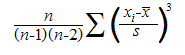{border="0"}

 

[]{#p241} 

###### 4.1.4.6.6.139      SLN {#sln style="tab-stops: 0pt"}

[]{style="FONT-FAMILY: 'Trebuchet MS','sans-serif'; COLOR: #15428b; FONT-SIZE: 9pt"} 

Returns the straight-line depreciation of an asset for one period.

[]{style="FONT-FAMILY: 'Trebuchet MS','sans-serif'; COLOR: #15428b; FONT-SIZE: 9pt"} 

Syntax

[]{style="FONT-FAMILY: 'Trebuchet MS','sans-serif'; COLOR: #15428b; FONT-SIZE: 9pt"} 

**SLN(cost, salvage, life)**, where:

 

**cost** is the **initial cost** of the asset.

**salvage**[ ]{style="COLOR: red"}is the **value at the end of the depreciation** (sometimes called the salvage value of the asset).

**life**[ ]{style="FONT-FAMILY: 'Times New Roman','serif'; FONT-SIZE: 12pt"}is the number of periods over which the asset is depreciated (the **useful life** of the asset).

 

[]{#p242} 

###### 4.1.4.6.6.140      SLOPE {#slope style="tab-stops: 0pt"}

 

Returns the slope of the linear regression line through data points in known_y\'s and known_x\'s. The slope is the rate of change along the regression line.

[]{style="FONT-FAMILY: 'Trebuchet MS','sans-serif'; COLOR: #15428b; FONT-SIZE: 9pt"} 

Syntax

[]{style="FONT-FAMILY: 'Trebuchet MS','sans-serif'; COLOR: #15428b; FONT-SIZE: 9pt"} 

**SLOPE(known_y\'s, known_x\'s)**, where:

 

**known_y\'s** is an array or cell range of **numeric dependent data points**.

**known_x\'s**[ ]{style="COLOR: red"}is the set of **independent data points**.

[]{style="FONT-FAMILY: 'Trebuchet MS','sans-serif'; COLOR: #15428b; FONT-SIZE: 9pt"} 

Remarks

[]{style="FONT-FAMILY: 'Trebuchet MS','sans-serif'; COLOR: #15428b; FONT-SIZE: 9pt"} 

[·      ]{style="FONT-FAMILY: Symbol"}The equation for the slope of the regression line is,

[]{style="FONT-FAMILY: 'Trebuchet MS','sans-serif'; COLOR: #15428b; FONT-SIZE: 9pt"} 

{border="0"}

[]{style="FONT-FAMILY: 'Trebuchet MS','sans-serif'; COLOR: #15428b; FONT-SIZE: 9pt"} 

where x-bar and y-bar are the sample means AVERAGE(known_x\'s) and AVERAGE(known_y\'s).

[]{#p243} 

 

###### 4.1.4.6.6.141      SMALL {#small style="tab-stops: 0pt"}

[]{style="FONT-FAMILY: 'Trebuchet MS','sans-serif'; COLOR: #15428b; FONT-SIZE: 9pt"} 

Returns the k-th smallest value in a data set.

[]{style="FONT-FAMILY: 'Trebuchet MS','sans-serif'; COLOR: #15428b; FONT-SIZE: 9pt"} 

Syntax

[]{style="FONT-FAMILY: 'Trebuchet MS','sans-serif'; COLOR: #15428b; FONT-SIZE: 9pt"} 

**SMALL(array, k),** where:

 

**array** is an **array** or range of numerical data for which you want to determine the k-th smallest value.

**k**[ ]{style="FONT-FAMILY: 'Times New Roman','serif'; FONT-SIZE: 12pt"}is the **position** (from the smallest) in the array or range of data to return.

[]{#p244} 

 

###### 4.1.4.6.6.142      SQRT {#sqrt style="tab-stops: 0pt"}

[]{style="FONT-FAMILY: 'Trebuchet MS','sans-serif'; COLOR: #15428b; FONT-SIZE: 9pt"} 

Returns a positive square root.

[]{style="FONT-FAMILY: 'Trebuchet MS','sans-serif'; COLOR: #15428b; FONT-SIZE: 9pt"} 

Syntax

[]{style="FONT-FAMILY: 'Trebuchet MS','sans-serif'; COLOR: #15428b; FONT-SIZE: 9pt"} 

**SQRT(number),** where:

 

**number**[ ]{style="COLOR: red"}is the **number** for which you want the square root.

[]{style="FONT-FAMILY: 'Trebuchet MS','sans-serif'; COLOR: #15428b; FONT-SIZE: 9pt"} 

Remarks

[]{style="FONT-FAMILY: 'Trebuchet MS','sans-serif'; COLOR: #15428b; FONT-SIZE: 9pt"} 

[·      ]{style="FONT-FAMILY: Symbol"}Number must be \>= 0.

 

[]{#p245} 

###### 4.1.4.6.6.143      STANDARDIZE {#standardize style="tab-stops: 0pt"}

[]{style="FONT-FAMILY: 'Trebuchet MS','sans-serif'; COLOR: #15428b; FONT-SIZE: 9pt"} 

Returns a normalized value from a distribution characterized by mean and standard_dev.

[]{style="FONT-FAMILY: 'Trebuchet MS','sans-serif'; COLOR: #15428b; FONT-SIZE: 9pt"} 

Syntax

[]{style="FONT-FAMILY: 'Trebuchet MS','sans-serif'; COLOR: #15428b; FONT-SIZE: 9pt"} 

**STANDARDIZE(x,mean, standard_dev)**, where:

 

**x**[ ]{style="FONT-FAMILY: 'Times New Roman','serif'; FONT-SIZE: 12pt"}is the **value** that you want to normalize.

**mean** is the **arithmetic mean** of the distribution.

**standard_dev**[ ]{style="FONT-FAMILY: 'Times New Roman','serif'; FONT-SIZE: 12pt"}is the **standard deviation** of the distribution.

[]{style="FONT-FAMILY: 'Trebuchet MS','sans-serif'; COLOR: #15428b; FONT-SIZE: 9pt"} 

Remarks

[]{style="FONT-FAMILY: 'Trebuchet MS','sans-serif'; COLOR: #15428b; FONT-SIZE: 9pt"} 

[·      ]{style="FONT-FAMILY: Symbol"}standard_dev must be \> 0.

[·      ]{style="FONT-FAMILY: Symbol"}The equation for the normalized value is,

[]{style="FONT-FAMILY: 'Trebuchet MS','sans-serif'; COLOR: #15428b; FONT-SIZE: 9pt"} 

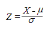{border="0"}

[]{#p246} 

 

###### 4.1.4.6.6.144      STDEV {#stdev style="tab-stops: 0pt"}

 

Estimates the standard deviation based on a sample. The standard deviation is a measure of how widely values are dispersed from the average value (the mean).

[]{style="FONT-FAMILY: 'Trebuchet MS','sans-serif'; COLOR: #15428b; FONT-SIZE: 9pt"} 

Syntax

[]{style="FONT-FAMILY: 'Trebuchet MS','sans-serif'; COLOR: #15428b; FONT-SIZE: 9pt"} 

**STDEV(number1, number2, \...)**, where:

 

**number1, number2**, \... are **number arguments** corresponding to a sample of a population.

[]{style="FONT-FAMILY: 'Trebuchet MS','sans-serif'; COLOR: #15428b; FONT-SIZE: 9pt"} 

Remarks

[]{style="FONT-FAMILY: 'Trebuchet MS','sans-serif'; COLOR: #15428b; FONT-SIZE: 9pt"} 

[·      ]{style="FONT-FAMILY: Symbol"}STDEV assumes that its arguments are a sample of the population. If your data represents the entire population, then compute the standard deviation using STDEVP.

[·      ]{style="FONT-FAMILY: Symbol"}STDEV uses the following formula,

[]{style="FONT-FAMILY: 'Trebuchet MS','sans-serif'; COLOR: #15428b; FONT-SIZE: 9pt"} 

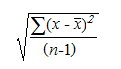{border="0"}

[]{style="FONT-FAMILY: 'Trebuchet MS','sans-serif'; COLOR: #15428b; FONT-SIZE: 9pt"} 

where x-bar is the sample mean AVERAGE(number1,number2,...) and n is the sample size.

 

[]{#p247} 

###### 4.1.4.6.6.145      STDEVA {#stdeva style="tab-stops: 0pt"}

[]{style="FONT-FAMILY: 'Trebuchet MS','sans-serif'; COLOR: #15428b; FONT-SIZE: 9pt"} 

Estimates standard deviation based on a sample. The standard deviation is a measure of how widely values are dispersed from the average value (the mean). Text and logical values such as True and False are also included in the calculation.

[]{style="FONT-FAMILY: 'Trebuchet MS','sans-serif'; COLOR: #15428b; FONT-SIZE: 9pt"} 

Syntax

[]{style="FONT-FAMILY: 'Trebuchet MS','sans-serif'; COLOR: #15428b; FONT-SIZE: 9pt"} 

**STDEVA(value1, value2, \...)**, where:

 

**value1, value2**, \... are values corresponding to a sample of a population. You can also use a single array or a reference to an array instead of arguments separated by commas.

[]{style="FONT-FAMILY: 'Trebuchet MS','sans-serif'; COLOR: #15428b; FONT-SIZE: 9pt"} 

Remarks

[]{style="FONT-FAMILY: 'Trebuchet MS','sans-serif'; COLOR: #15428b; FONT-SIZE: 9pt"} 

[·      ]{style="FONT-FAMILY: Symbol"}Arguments that contain True evaluate as 1; arguments that contain text or False evaluate as 0 (zero).

[·      ]{style="FONT-FAMILY: Symbol"}STDEVA uses the following formula,

[]{style="FONT-FAMILY: 'Trebuchet MS','sans-serif'; COLOR: #15428b; FONT-SIZE: 9pt"} 

{border="0"}

[]{style="FONT-FAMILY: 'Trebuchet MS','sans-serif'; COLOR: #15428b; FONT-SIZE: 9pt"} 

where x-bar is the sample **mean AVERAGE**(value1,value2,...) and **n** is the **sample size**.

 

[]{#p248} 

###### 4.1.4.6.6.146      STDEVP {#stdevp style="tab-stops: 0pt"}

[]{style="FONT-FAMILY: 'Trebuchet MS','sans-serif'; COLOR: #15428b; FONT-SIZE: 9pt"} 

Calculates standard deviation based on the entire population given as arguments.

[]{style="FONT-FAMILY: 'Trebuchet MS','sans-serif'; COLOR: #15428b; FONT-SIZE: 9pt"} 

Syntax

[]{style="FONT-FAMILY: 'Trebuchet MS','sans-serif'; COLOR: #15428b; FONT-SIZE: 9pt"} 

**STDEVP(number1, number2, \...)**, where:

 

**number1, number2**, \... are **1 to 30 number arguments** corresponding to a population. You can also use a single array or a reference to an array instead of arguments separated by commas.

[]{style="FONT-FAMILY: 'Trebuchet MS','sans-serif'; COLOR: #15428b; FONT-SIZE: 9pt"} 

Remarks

[]{style="FONT-FAMILY: 'Trebuchet MS','sans-serif'; COLOR: #15428b; FONT-SIZE: 9pt"} 

[·      ]{style="FONT-FAMILY: Symbol"}STDEVP assumes that its arguments are the entire population. If your data represents a sample of the population, then compute the standard deviation using STDEV.

[·      ]{style="FONT-FAMILY: Symbol"}STDEVP uses the following formula,

[]{style="FONT-FAMILY: 'Trebuchet MS','sans-serif'; COLOR: #15428b; FONT-SIZE: 9pt"} 

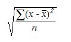{border="0"}

 

where **x** is the sample **mean AVERAGE**(number1,number2,...) and **n** is the **sample size**.

[]{#p249} 

 

###### 4.1.4.6.6.147      STDEVPA {#stdevpa style="tab-stops: 0pt"}

[]{style="FONT-FAMILY: 'Trebuchet MS','sans-serif'; COLOR: #15428b; FONT-SIZE: 9pt"} 

Calculates the standard deviation based on the entire population given as arguments, including text and logical values.

[]{style="FONT-FAMILY: 'Trebuchet MS','sans-serif'; COLOR: #15428b; FONT-SIZE: 9pt"} 

Syntax

[]{style="FONT-FAMILY: 'Trebuchet MS','sans-serif'; COLOR: #15428b; FONT-SIZE: 9pt"} 

**STDEVPA(value1, value2, \...),** where:

 

**value1**, **value2**, \... are values corresponding to a population. You can also use a single array or a reference to an array instead of arguments separated by commas.

[]{style="FONT-FAMILY: 'Trebuchet MS','sans-serif'; COLOR: #15428b; FONT-SIZE: 9pt"} 

Remarks

[]{style="FONT-FAMILY: 'Trebuchet MS','sans-serif'; COLOR: #15428b; FONT-SIZE: 9pt"} 

[·      ]{style="FONT-FAMILY: Symbol"}Arguments that contain **True** evaluate as **1**; arguments that contain **text or False** evaluate as **0** (zero).

[·      ]{style="FONT-FAMILY: Symbol"}STDEVPA uses the following formula,

[]{style="FONT-FAMILY: 'Trebuchet MS','sans-serif'; COLOR: #15428b; FONT-SIZE: 9pt"} 

{border="0"}

 

where x-bar is the sample **mean AVERAGE**(value1,value2,...) and **n** is the **sample size**.

 

[]{#p250} 

###### 4.1.4.6.6.148      STEYX {#steyx style="tab-stops: 0pt"}

[]{style="FONT-FAMILY: 'Trebuchet MS','sans-serif'; COLOR: #15428b; FONT-SIZE: 9pt"} 

Returns the standard error of the predicted y-value for each x in the regression.

[]{style="FONT-FAMILY: 'Trebuchet MS','sans-serif'; COLOR: #15428b; FONT-SIZE: 9pt"} 

Syntax

[]{style="FONT-FAMILY: 'Trebuchet MS','sans-serif'; COLOR: #15428b; FONT-SIZE: 9pt"} 

**STEYX(known_y\'s, known_x\'s),** where:

 

**known_y\'s**[ ]{style="FONT-FAMILY: 'Times New Roman','serif'; FONT-SIZE: 12pt"}is an array or range of dependent data points.

**known_x\'s**[ ]{style="FONT-FAMILY: 'Times New Roman','serif'; FONT-SIZE: 12pt"}is an array or range of independent data points.

[]{style="FONT-FAMILY: 'Trebuchet MS','sans-serif'; COLOR: #15428b; FONT-SIZE: 9pt"} 

Remarks

[]{style="FONT-FAMILY: 'Trebuchet MS','sans-serif'; COLOR: #15428b; FONT-SIZE: 9pt"} 

[·      ]{style="FONT-FAMILY: Symbol"}The equation for the standard error of the predicted y is,

[]{style="FONT-FAMILY: 'Trebuchet MS','sans-serif'; COLOR: #15428b; FONT-SIZE: 9pt"} 

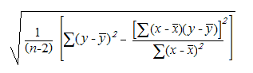{border="0"}

[]{style="FONT-FAMILY: 'Trebuchet MS','sans-serif'; COLOR: #15428b; FONT-SIZE: 9pt"} 

where **x-bar** and **y-bar** are the sample means **AVERAGE**(known_x's) and **AVERAGE**(known_y's) and **n** is the **sample size**.

[]{#p251} 

 

###### 4.1.4.6.6.149      SUBSTITUTE {#substitute style="tab-stops: 0pt"}

[]{style="FONT-FAMILY: 'Trebuchet MS','sans-serif'; COLOR: #15428b; FONT-SIZE: 9pt"} 

Substitutes new_text for old_text in a text string. Use SUBSTITUTE when you want to replace specific text in a text string; use REPLACE when you want to replace any text that occurs in a specific location in a text string.

[]{style="FONT-FAMILY: 'Trebuchet MS','sans-serif'; COLOR: #15428b; FONT-SIZE: 9pt"} 

Syntax

[]{style="FONT-FAMILY: 'Trebuchet MS','sans-serif'; COLOR: #15428b; FONT-SIZE: 9pt"} 

**SUBSTITUTE(text, old_text, new_text, instance_num)**, where:

[]{style="FONT-FAMILY: 'Trebuchet MS','sans-serif'; COLOR: #15428b; FONT-SIZE: 9pt"} 

[·      ]{style="FONT-FAMILY: Symbol"}**Text** is the text or the reference to a cell containing text for which you want to substitute characters.

[·      ]{style="FONT-FAMILY: Symbol"}**Old_text** is the text you want to replace.

[·      ]{style="FONT-FAMILY: Symbol"}**New_text** is the text you want to replace old_text with.

[·      ]{style="FONT-FAMILY: Symbol"}**Instance_num** specifies which occurrence of old_text you want to replace with new_text. If you specify instance_num, only that instance of old_text is replaced. Otherwise, every occurrence of old_text in text is changed to new_text.

[]{style="FONT-FAMILY: 'Trebuchet MS','sans-serif'; COLOR: #15428b; FONT-SIZE: 9pt"} 

Example

**[]{style="FONT-FAMILY: 'Trebuchet MS','sans-serif'; COLOR: #15428b; FONT-SIZE: 9pt"}** 

The example may be easier to understand if you copy it to a blank worksheet.

[]{style="FONT-FAMILY: 'Trebuchet MS','sans-serif'; COLOR: #15428b; FONT-SIZE: 9pt"} 

::: {align="center"}
  ------------------------------------------------------------------------------------------- -------------------------------------- -------------------------------------------------------------------
  **[]{style="FONT-FAMILY: 'Trebuchet MS','sans-serif'; COLOR: #15428b; FONT-SIZE: 9pt"}**    A                                       
  1                                                                                           Data                                    
  2                                                                                           Sales Data                              
  3                                                                                           Quarter 1, 2008                         
  4                                                                                           Quarter 1, 2011                         
  **[]{style="FONT-FAMILY: 'Trebuchet MS','sans-serif'; COLOR: #15428b; FONT-SIZE: 9pt"}**    Formula                                Description (Result)
  **[]{style="FONT-FAMILY: 'Trebuchet MS','sans-serif'; COLOR: #15428b; FONT-SIZE: 9pt"}**    =SUBSTITUTE(A2, \"Sales\", \"Cost\")   Substitutes Cost for Sales (Cost Data).
  **[]{style="FONT-FAMILY: 'Trebuchet MS','sans-serif'; COLOR: #15428b; FONT-SIZE: 9pt"}**    =SUBSTITUTE(A3, \"1\", \"2\", 1)       Substitutes first instance of \"1\" with \"2\" (Quarter 2, 2008).
  **[]{style="FONT-FAMILY: 'Trebuchet MS','sans-serif'; COLOR: #15428b; FONT-SIZE: 9pt"}**    =SUBSTITUTE(A4, \"1\", \"2\", 3)       Substitutes third instance of \"1\" with \"2\" (Quarter 1, 2012).
  ------------------------------------------------------------------------------------------- -------------------------------------- -------------------------------------------------------------------
:::

 

[]{#p252} 

###### 4.1.4.6.6.150      Sum {#sum style="tab-stops: 0pt"}

The **Sum** function adds all numbers in a range of cells and returns the result.

 

Syntax:

**Sum(number1, number2, \... number_n)**

 

where:

**number1** is the first number, number2 is the second and number_n is the nth number to be added together.

 

 

###### 4.1.4.6.6.151      SUMIF {#sumif style="tab-stops: 0pt"}

[]{style="FONT-FAMILY: 'Trebuchet MS','sans-serif'; COLOR: #15428b; FONT-SIZE: 9pt"} 

Adds the cells specified by a given criteria.

[]{style="FONT-FAMILY: 'Trebuchet MS','sans-serif'; COLOR: #15428b; FONT-SIZE: 9pt"} 

**Syntax**

**[]{style="FONT-SIZE: 9pt"}** 

**[SUMIF(range, criteria, sum_range),]{style="FONT-SIZE: 9pt"}**[ where:]{style="FONT-SIZE: 9pt"}

[]{style="FONT-SIZE: 9pt"} 

**[range]{style="FONT-SIZE: 9pt"}**[ is the range of cells you want evaluated.]{style="FONT-SIZE: 9pt"}

**[criteria]{style="FONT-SIZE: 9pt"}**[ is the criteria in the form of a number, expression or text that defines which, cells will be added. For example, criteria can be expressed as \"\>32\" or some other logical expression.]{style="FONT-SIZE: 9pt"}

**[Sum_range]{style="FONT-SIZE: 9pt"}**[ are the actual cells to sum.]{style="FONT-SIZE: 9pt"}

[]{style="FONT-FAMILY: 'Trebuchet MS','sans-serif'; COLOR: #15428b; FONT-SIZE: 9pt"} 

Remarks

[]{style="FONT-FAMILY: 'Trebuchet MS','sans-serif'; COLOR: #15428b; FONT-SIZE: 9pt"} 

[·      ]{style="FONT-FAMILY: Symbol"}The cells in sum_range are summed only if their corresponding cells in range match the criteria.

[·      ]{style="FONT-FAMILY: Symbol"}If sum_range is omitted, the cells in range are summed.

 

[]{#p253} 

###### 4.1.4.6.6.152      SUMPRODUCT {#sumproduct style="tab-stops: 0pt"}

[]{style="FONT-FAMILY: 'Trebuchet MS','sans-serif'; COLOR: #15428b; FONT-SIZE: 9pt"} 

Multiplies corresponding components in the given arrays and returns the sum of those products.

[]{style="FONT-FAMILY: 'Trebuchet MS','sans-serif'; COLOR: #15428b; FONT-SIZE: 9pt"} 

Syntax

 

**SUMPRODUCT(array1, array2, array3, \...)**, where:

 

**array1, array2, array3, \...** are 2 to 30 arrays whose components you will want to multiply and then add.

[]{style="FONT-FAMILY: 'Trebuchet MS','sans-serif'; COLOR: #15428b; FONT-SIZE: 9pt"} 

Remarks

[]{style="FONT-FAMILY: 'Trebuchet MS','sans-serif'; COLOR: #15428b; FONT-SIZE: 9pt"} 

[·      ]{style="FONT-FAMILY: Symbol"}The array arguments must have the same dimensions.

[·      ]{style="FONT-FAMILY: Symbol"}SUMPRODUCT treats array entries that are not numeric as if they were zeros.

 

[]{#p254} 

###### 4.1.4.6.6.153      SUMSQ {#sumsq style="tab-stops: 0pt"}

[]{style="FONT-FAMILY: 'Trebuchet MS','sans-serif'; COLOR: #15428b; FONT-SIZE: 9pt"} 

Returns the sum of the squares of the arguments.

 

**Syntax**

 

**SUMSQ(number1, number2, \...)**, where:

 

**number1, number2, \...** are arguments for which you want the sum of the squares. You can also use a single array or a reference to an array instead of arguments separated by commas.

 

[]{#p255} 

###### 4.1.4.6.6.154      SUMX2MY2 {#sumx2my2 style="tab-stops: 0pt"}

[]{style="FONT-FAMILY: 'Trebuchet MS','sans-serif'; COLOR: #15428b; FONT-SIZE: 9pt"} 

Returns the sum of the difference of squares of corresponding values in two arrays.

 

**Syntax**

 

**SUMX2MY2(array_x, array_y)**, where:

 

**array_x**[ ]{style="FONT-FAMILY: 'Times New Roman','serif'; FONT-SIZE: 12pt"}is the first array or range of values.

**array_y**[ ]{style="FONT-FAMILY: 'Times New Roman','serif'; FONT-SIZE: 12pt"}is the second array or range of values.

[]{style="FONT-FAMILY: 'Trebuchet MS','sans-serif'; COLOR: #15428b; FONT-SIZE: 9pt"} 

Remarks

[]{style="FONT-FAMILY: 'Trebuchet MS','sans-serif'; COLOR: #15428b; FONT-SIZE: 9pt"} 

[·      ]{style="FONT-FAMILY: Symbol"}If an array or reference argument contains text, logical values or empty cells, those values are ignored; however, cells with the value zero are included.

[·      ]{style="FONT-FAMILY: Symbol"}The equation for the sum of the difference of squares is,

[]{style="FONT-FAMILY: 'Trebuchet MS','sans-serif'; COLOR: #15428b; FONT-SIZE: 9pt"} 

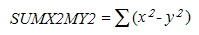{border="0"}

[]{#p256} 

 

###### 4.1.4.6.6.155      SUMX2PY2 {#sumx2py2 style="tab-stops: 0pt"}

 

Returns the sum of the sum of squares of corresponding values in two arrays. The sum of the sum of squares is a common term in many statistical calculations.

 

**Syntax**

 

**SUMX2PY2(array_x, array_y)**, where:

 

**array_x **is the first array or range of values.

**array_y**[ ]{style="FONT-FAMILY: 'Times New Roman','serif'; FONT-SIZE: 12pt"}is the second array or range of values.

[]{style="FONT-FAMILY: 'Trebuchet MS','sans-serif'; COLOR: #15428b; FONT-SIZE: 9pt"} 

Remarks

[]{style="FONT-FAMILY: 'Trebuchet MS','sans-serif'; COLOR: #15428b; FONT-SIZE: 9pt"} 

[·      ]{style="FONT-FAMILY: Symbol"}If an array or reference argument contains text, logical values or empty cells, those values are ignored; however, cells with the value zero are included.

[·      ]{style="FONT-FAMILY: Symbol"}The equation for the sum of the sum of squares is,

[]{style="FONT-FAMILY: 'Trebuchet MS','sans-serif'; COLOR: #15428b; FONT-SIZE: 9pt"} 

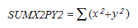{border="0"}

[]{#p257} 

 

###### 4.1.4.6.6.156      SUMXMY2 {#sumxmy2 style="tab-stops: 0pt"}

[]{style="FONT-FAMILY: 'Trebuchet MS','sans-serif'; COLOR: #15428b; FONT-SIZE: 9pt"} 

Returns the sum of squares of differences of corresponding values in two arrays.

 

**Syntax**

 

**SUMXMY2(array_x, array_y)**, where:

 

**array_x** is the first array or range of values[.]{style="FONT-FAMILY: 'Times New Roman','serif'; FONT-SIZE: 12pt"}

**array_y**[ ]{style="FONT-FAMILY: 'Times New Roman','serif'; FONT-SIZE: 12pt"}is the second array or range of values.

[]{style="FONT-FAMILY: 'Trebuchet MS','sans-serif'; COLOR: #15428b; FONT-SIZE: 9pt"} 

Remarks

[]{style="FONT-FAMILY: 'Trebuchet MS','sans-serif'; COLOR: #15428b; FONT-SIZE: 9pt"} 

[·      ]{style="FONT-FAMILY: Symbol"}If an array or reference argument contains text, logical values or empty cells, those values are ignored; however, cells with the value zero are included.

[·      ]{style="FONT-FAMILY: Symbol"}The equation for the sum of squared differences is,

[]{style="FONT-FAMILY: 'Trebuchet MS','sans-serif'; COLOR: #15428b; FONT-SIZE: 9pt"} 

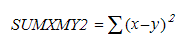{border="0"}

 

[]{#p258} 

###### 4.1.4.6.6.157      SYD {#syd style="tab-stops: 0pt"}

[]{style="FONT-FAMILY: 'Trebuchet MS','sans-serif'; COLOR: #15428b; FONT-SIZE: 9pt"} 

Returns the**[ ]{style="COLOR: red"}**sum-of-years\' digits depreciation of an asset for a specified period.

 

**Syntax**

 

**SYD(cost, salvage, life, per)**, where:

 

**cost**[ ]{style="FONT-FAMILY: 'Times New Roman','serif'; FONT-SIZE: 12pt"}is the initial cost of the asset.

**salvage** is the value at the end of the depreciation (sometimes called the salvage value of the asset).

**life** is the number of periods over which the asset is depreciated (sometimes called the useful life of the asset).

**per** is the period and must use the same units as life.

[]{style="FONT-FAMILY: 'Trebuchet MS','sans-serif'; COLOR: #15428b; FONT-SIZE: 9pt"} 

Remarks

[]{style="FONT-FAMILY: 'Trebuchet MS','sans-serif'; COLOR: #15428b; FONT-SIZE: 9pt"} 

[·      ]{style="FONT-FAMILY: Symbol"}SYD is calculated as follows,

[]{style="FONT-FAMILY: 'Trebuchet MS','sans-serif'; COLOR: #15428b; FONT-SIZE: 9pt"} 

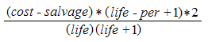{border="0"}

 

[]{#p259} 

###### 4.1.4.6.6.158      TAN {#tan style="tab-stops: 0pt"}

[]{style="FONT-FAMILY: 'Trebuchet MS','sans-serif'; COLOR: #15428b; FONT-SIZE: 9pt"} 

Returns the tangent of the given angle.

 

**Syntax**

 

**TAN(number)**, where:

 

**number**[ ]{style="FONT-FAMILY: 'Times New Roman','serif'; FONT-SIZE: 12pt"}is the angle in radians for which, you want the tangent.

 

[]{#p260} 

###### 4.1.4.6.6.159      TANH {#tanh style="tab-stops: 0pt"}

[]{style="FONT-FAMILY: 'Trebuchet MS','sans-serif'; COLOR: #15428b; FONT-SIZE: 9pt"} 

Returns the hyperbolic tangent of a number.

 

**Syntax**

 

**TANH(number)**, where:

 

**number **is any real number.

[]{style="FONT-FAMILY: 'Trebuchet MS','sans-serif'; COLOR: #15428b; FONT-SIZE: 9pt"} 

Remarks

[]{style="FONT-FAMILY: 'Trebuchet MS','sans-serif'; COLOR: #15428b; FONT-SIZE: 9pt"} 

[·      ]{style="FONT-FAMILY: Symbol"}The formula for the hyperbolic tangent is,

[]{style="FONT-FAMILY: 'Trebuchet MS','sans-serif'; COLOR: #15428b; FONT-SIZE: 9pt"} 

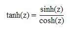{border="0"}

 

[]{#p261} 

###### 4.1.4.6.6.160      TEXT {#text style="tab-stops: 0pt"}

[]{style="FONT-FAMILY: 'Trebuchet MS','sans-serif'; COLOR: #15428b; FONT-SIZE: 9pt"} 

Converts a value to text in a specific number format.

 

**Syntax**

 

**TEXT(value, format_text)**, where:

 

**value **is a numeric value a formula that evaluates to a numeric value or a reference to a cell containing a numeric value.

**format_text** is a number format in text form in the[ ]{style="FONT-FAMILY: 'Times New Roman','serif'; FONT-SIZE: 12pt"}Category[ ]{style="FONT-FAMILY: 'Times New Roman','serif'; FONT-SIZE: 12pt"}box on the[ ]{style="FONT-FAMILY: 'Times New Roman','serif'; FONT-SIZE: 12pt"}Number[ ]{style="FONT-FAMILY: 'Times New Roman','serif'; FONT-SIZE: 12pt"}tab in the Format Cells**[ ]{style="COLOR: red"}**dialog box.

 

[]{#p262} 

###### 4.1.4.6.6.161      TIME {#time style="tab-stops: 0pt"}

[]{style="FONT-FAMILY: 'Trebuchet MS','sans-serif'; COLOR: #15428b; FONT-SIZE: 9pt"} 

Returns the decimal number for a particular time.

The decimal number returned by TIME is a value ranging from 0 (zero) to 0.99999999, representing the times from 0:00:00 (12:00:00 A.M.) to 23:59:59 (11:59:59 P.M.).

 

**Syntax**

 

**TIME(hour, minute, second)**, where:

 

**hour** is a number from 0 (zero) to 23 representing the hour.

**minute**[ ]{style="FONT-FAMILY: 'Times New Roman','serif'; FONT-SIZE: 12pt"}is a number from 0 to 59 representing the minute.

**second**[ ]{style="FONT-FAMILY: 'Times New Roman','serif'; FONT-SIZE: 12pt"}is a number from 0 to 59 representing the second.

 

[]{#p263} 

###### 4.1.4.6.6.162      TIMEVALUE {#timevalue style="tab-stops: 0pt"}

[]{style="FONT-FAMILY: 'Trebuchet MS','sans-serif'; COLOR: #15428b; FONT-SIZE: 9pt"} 

Returns the**[ ]{style="COLOR: red"}**decimal number of the time represented by a text string. The decimal number is a value ranging from 0 (zero) to 0.99999999, representing the times from 0:00:00 (12:00:00 A.M.) to 23:59:59 (11:59:59 P.M.).

 

**Syntax**

 

**TIMEVALUE(time_text)**, where:

 

**time_text **is a text string that represents a time as a formatted string; for example, \"6:45 PM\" and \"18:45\" text strings within quotation marks that represent time.

[]{style="FONT-FAMILY: 'Trebuchet MS','sans-serif'; COLOR: #15428b; FONT-SIZE: 9pt"} 

Remarks

[]{style="FONT-FAMILY: 'Trebuchet MS','sans-serif'; COLOR: #15428b; FONT-SIZE: 9pt"} 

[·      ]{style="FONT-FAMILY: Symbol"}Date information in time_text is ignored.

 

[]{#p264} 

###### 4.1.4.6.6.163      TODAY {#today style="tab-stops: 0pt"}

[]{style="FONT-FAMILY: 'Trebuchet MS','sans-serif'; COLOR: #15428b; FONT-SIZE: 9pt"} 

Returns the**[ ]{style="COLOR: red"}**serial number of the current date. The serial number is the number of days since Jan 1, 1900.

 

**Syntax**

 

**TODAY( )**

[]{style="FONT-FAMILY: 'Trebuchet MS','sans-serif'; COLOR: #15428b; FONT-SIZE: 9pt"} 

Remarks

[]{style="FONT-FAMILY: 'Trebuchet MS','sans-serif'; COLOR: #15428b; FONT-SIZE: 9pt"} 

[·      ]{style="FONT-FAMILY: Symbol"}Dates are stored as sequential serial numbers so that they can be used in calculations. By default, January 1, 1900 is serial number 1 and January 1, 2008 is serial number 39448 because it is 39,448 days after January 1, 1900.

###### 4.1.4.6.6.164      Trim {#trim style="tab-stops: 0pt"}

The Trim function returns a text value with the leading and trailing spaces removed.

 

Syntax:

**Trim(text)**

 

where:

**text** is the text value for which you want to remove the leading and the trailing spaces.

 

[]{#p265} 

###### 4.1.4.6.6.165      TRIMMEAN {#trimmean style="tab-stops: 0pt"}

[]{style="FONT-FAMILY: 'Trebuchet MS','sans-serif'; COLOR: #15428b; FONT-SIZE: 9pt"} 

Returns the mean of the interior of a data set. TRIMMEAN calculates the mean taken by excluding a percentage of data points from the top and bottom tails of a data set.

 

**Syntax**

 

**TRIMMEAN(array, percent)**, where:

 

**array **is the array or range of values to trim and average.

**percent** is the fractional number of data points to exclude from the calculation. For example, if percent = 0.2, 4 points are trimmed from a data set of 20 points (20 x 0.2): 2 from the top and 2 from the bottom of the set.

[]{style="FONT-FAMILY: 'Trebuchet MS','sans-serif'; COLOR: #15428b; FONT-SIZE: 9pt"} 

Remarks

[]{style="FONT-FAMILY: 'Trebuchet MS','sans-serif'; COLOR: #15428b; FONT-SIZE: 9pt"} 

[·      ]{style="FONT-FAMILY: Symbol"}Percent must be \>= 0 and \<= 1.

[·      ]{style="FONT-FAMILY: Symbol"}TRIMMEAN rounds off the number of excluded data points down to the nearest multiple of 2. If percent = 0.1, 10 percent of 30 data points equals 3 points. For symmetry, TRIMMEAN excludes a single value from the top and bottom of the data set.

 

[]{#p266} 

###### 4.1.4.6.6.166      TRUNC {#trunc style="tab-stops: 0pt"}

[]{style="FONT-FAMILY: 'Trebuchet MS','sans-serif'; COLOR: #15428b; FONT-SIZE: 9pt"} 

Truncates a number to an integer by removing the fractional part of the number.

 

**Syntax**

 

**TRUNC(number, num_digits)**, where:

 

**number** is the number you want to truncate[.]{style="FONT-FAMILY: 'Times New Roman','serif'; FONT-SIZE: 12pt"}

**num_digits** is a number specifying the precision of the truncation. The default value for num_digits is 0 (zero).

[]{style="FONT-FAMILY: 'Trebuchet MS','sans-serif'; COLOR: #15428b; FONT-SIZE: 9pt"} 

Remarks

[]{style="FONT-FAMILY: 'Trebuchet MS','sans-serif'; COLOR: #15428b; FONT-SIZE: 9pt"} 

[·      ]{style="FONT-FAMILY: Symbol"}TRUNC and INT are similar in that both return integers. TRUNC removes the fractional part of the number. INT rounds numbers down to the nearest integer based on the value of the fractional part of the number. INT and TRUNC are different only when using negative numbers: TRUNC(-4.3) returns -4 but, INT(-4.3) returns -5 because -5 is the lower number.

 

###### 4.1.4.6.6.167      True {#true style="tab-stops: 0pt"}

The **True** function returns the logical value when the given sting value is true.

 

Syntax:

**True(stringvalue)**

 

where:

**stringvalue** is to provide any text value or empty string.

 

###### []{#p267}4.1.4.6.6.168      Upper {#upper style="tab-stops: 0pt"}

The Upper function converts all characters in a text string to uppercase.

 

Syntax:

**Upper(text)**

 

where:

 

**text** is the string you want to convert to uppercase.

 

###### 4.1.4.6.6.169      VALUE {#value style="tab-stops: 0pt"}

[]{style="FONT-FAMILY: 'Trebuchet MS','sans-serif'; COLOR: #15428b; FONT-SIZE: 9pt"} 

Converts a text string that represents a number to a number.

 

**Syntax**

 

**VALUE(text)**, where:

 

**text **is the text enclosed in quotation marks or a reference to a cell containing the text you want to convert.

[]{style="FONT-FAMILY: 'Trebuchet MS','sans-serif'; COLOR: #15428b; FONT-SIZE: 9pt"} 

Remarks

[]{style="FONT-FAMILY: 'Trebuchet MS','sans-serif'; COLOR: #15428b; FONT-SIZE: 9pt"} 

[·      ]{style="FONT-FAMILY: Symbol"}Text can be in any of the constant number, date or time formats recognized by Essential Calculate.

[·      ]{style="FONT-FAMILY: Symbol"}You do not generally need to use the VALUE function in a formula, as the text is automatically converted to numbers as necessary.

 

[]{#p268} 

###### 4.1.4.6.6.170      VAR {#var style="tab-stops: 0pt"}

[]{style="FONT-FAMILY: 'Trebuchet MS','sans-serif'; COLOR: #15428b; FONT-SIZE: 9pt"} 

Estimates variance based on a sample.

 

**Syntax**

 

**VAR(number1, number2, \...)**, where:

 

**number1, number2, \...** are arguments corresponding to a sample of a population.

[]{style="FONT-FAMILY: 'Trebuchet MS','sans-serif'; COLOR: #15428b; FONT-SIZE: 9pt"} 

Remarks

[]{style="FONT-FAMILY: 'Trebuchet MS','sans-serif'; COLOR: #15428b; FONT-SIZE: 9pt"} 

[·      ]{style="FONT-FAMILY: Symbol"}VAR assumes that its arguments are a sample of the population. If your data represents the entire population, then compute the variance using VARP.

[·      ]{style="FONT-FAMILY: Symbol"}Logical values such as True, False and text are ignored. If logical values and text must not be ignored, use the VARA worksheet function.

[·      ]{style="FONT-FAMILY: Symbol"}VAR uses the following formula,

[]{style="FONT-FAMILY: 'Trebuchet MS','sans-serif'; COLOR: #15428b; FONT-SIZE: 9pt"} 

                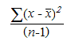{border="0"}

[]{style="FONT-FAMILY: 'Trebuchet MS','sans-serif'; COLOR: #15428b; FONT-SIZE: 9pt"} 

where x-bar is the sample mean AVERAGE(number1,number2,...) and n is the sample size.

 

[]{#p269} 

###### 4.1.4.6.6.171      VARA {#vara style="tab-stops: 0pt"}

[]{style="FONT-FAMILY: 'Trebuchet MS','sans-serif'; COLOR: #15428b; FONT-SIZE: 9pt"} 

Estimates variance based on a sample. In addition to numbers and text, logical values such as True and False are included in the calculation.

 

**Syntax**

 

**VARA(value1, value2, \...)**, where:

 

**value1, value2, \...** are value arguments corresponding to a sample of a population.

[]{style="FONT-FAMILY: 'Trebuchet MS','sans-serif'; COLOR: #15428b; FONT-SIZE: 9pt"} 

Remarks

[]{style="FONT-FAMILY: 'Trebuchet MS','sans-serif'; COLOR: #15428b; FONT-SIZE: 9pt"} 

[·      ]{style="FONT-FAMILY: Symbol"}VARA assumes that its arguments are a sample of the population. If your data represents the entire population, you must compute the variance using VARPA.

[·      ]{style="FONT-FAMILY: Symbol"}Arguments that contain True evaluate as 1; arguments that contain text or False evaluate as 0 (zero). If the calculation must not include text or logical values, use the VAR worksheet function instead.

[·      ]{style="FONT-FAMILY: Symbol"}VARA uses the following formula,

[]{style="FONT-FAMILY: 'Trebuchet MS','sans-serif'; COLOR: #15428b; FONT-SIZE: 9pt"} 

                {border="0"}

[]{style="FONT-FAMILY: 'Trebuchet MS','sans-serif'; COLOR: #15428b; FONT-SIZE: 9pt"} 

where x-bar is the sample mean AVERAGE(value1,value2,...) and n is the sample size.

 

[]{#p270} 

###### 4.1.4.6.6.172      VARP {#varp style="tab-stops: 0pt"}

[]{style="FONT-FAMILY: 'Trebuchet MS','sans-serif'; COLOR: #15428b; FONT-SIZE: 9pt"} 

Calculates variance based on the entire population.

 

**Syntax**

 

**VARP(number1, number2, \...)**, where:

 

**number1, number2, \...** are number arguments corresponding to a population.

[]{style="FONT-FAMILY: 'Trebuchet MS','sans-serif'; COLOR: #15428b; FONT-SIZE: 9pt"} 

Remarks

[]{style="FONT-FAMILY: 'Trebuchet MS','sans-serif'; COLOR: #15428b; FONT-SIZE: 9pt"} 

[·      ]{style="FONT-FAMILY: Symbol"}VARP assumes that its arguments are the entire population. If your data represents a sample of the population, then compute the variance using VAR.

[·      ]{style="FONT-FAMILY: Symbol"}The equation for VARP is,

[]{style="FONT-FAMILY: 'Trebuchet MS','sans-serif'; COLOR: #15428b; FONT-SIZE: 9pt"} 

{border="0"}

 

where x-bar is the sample mean AVERAGE(number1,number2,...) and n is the sample size.

 

[]{#p271} 

###### 4.1.4.6.6.173      VARPA {#varpa style="tab-stops: 0pt"}

[]{style="FONT-FAMILY: 'Trebuchet MS','sans-serif'; COLOR: #15428b; FONT-SIZE: 9pt"} 

Calculates variance based on the entire population. In addition to numbers and text, logical values such as True and False are also included in the calculation.

 

**Syntax**

 

**VARPA(value1, value2, \...)**, where:

 

**value1, value2, \...** are arguments corresponding to a population.

[]{style="FONT-FAMILY: 'Trebuchet MS','sans-serif'; COLOR: #15428b; FONT-SIZE: 9pt"} 

Remarks

[]{style="FONT-FAMILY: 'Trebuchet MS','sans-serif'; COLOR: #15428b; FONT-SIZE: 9pt"} 

[·      ]{style="FONT-FAMILY: Symbol"}VARPA assumes that its arguments are the entire population. If your data represents a sample of the population, you must compute the variance using VARA.

[·      ]{style="FONT-FAMILY: Symbol"}Arguments that contain True evaluate as 1; arguments that contain text or False evaluate as 0 (zero). If the calculation does not include text or logical values, use the VARP worksheet function instead.

[·      ]{style="FONT-FAMILY: Symbol"}The equation for VARPA is,

[]{style="FONT-FAMILY: 'Trebuchet MS','sans-serif'; COLOR: #15428b; FONT-SIZE: 9pt"} 

{border="0"}

 

where x is the sample mean AVERAGE(value1,value2,...) and n is the sample size.

[]{#p272} 

 

###### 4.1.4.6.6.174      VDB {#vdb style="tab-stops: 0pt"}

[]{style="FONT-FAMILY: 'Trebuchet MS','sans-serif'; COLOR: #15428b; FONT-SIZE: 9pt"} 

Returns the depreciation of an asset for any period you specify, including partial periods, using the double-declining balance method or some other method you specify. VDB stands for variable declining balance.

 

**Syntax**

 

**VDB(cost, salvage, life, start_period, end_period, factor, no_switch)**, where:

 

**cost**[ ]{style="FONT-FAMILY: 'Times New Roman','serif'; FONT-SIZE: 12pt"}is the initial cost of the asset.

**salvage**[ ]{style="FONT-FAMILY: 'Times New Roman','serif'; FONT-SIZE: 12pt"}is the value at the end of the depreciation (sometimes called the salvage value of the asset).

**life** is the number of periods over which the asset is depreciated (sometimes called the useful life of the asset).

**start_period**[ ]{style="FONT-FAMILY: 'Times New Roman','serif'; FONT-SIZE: 12pt"}is the starting period for which you want to calculate the depreciation. start_period must use the same units as life.

**end_period**[ ]{style="FONT-FAMILY: 'Times New Roman','serif'; FONT-SIZE: 12pt"}is the ending period for which you want to calculate the depreciation. end_period must use the same units as life.

**factor **is the rate at which, the balance declines. If factor is omitted, it is assumed to be 2 (the double-declining balance method).

**no_switch** is a logical value specifying whether to switch to straight-line depreciation when depreciation is greater than the declining balance calculation.

[]{style="FONT-FAMILY: 'Trebuchet MS','sans-serif'; COLOR: #15428b; FONT-SIZE: 9pt"} 

[·      ]{style="FONT-FAMILY: Symbol"}If no_switch is True, straight-line depreciation is not used even when the depreciation is greater than the declining balance calculation.

[·      ]{style="FONT-FAMILY: Symbol"}If no_switch is False or omitted, straight-line depreciation is used when depreciation is greater than the declining balance calculation.

 

All arguments except no_switch must be positive numbers.

 

[]{#p273} 

###### 4.1.4.6.6.175      VLOOKUP {#vlookup style="tab-stops: 0pt"}

[]{style="FONT-FAMILY: 'Trebuchet MS','sans-serif'; COLOR: #15428b; FONT-SIZE: 9pt"} 

Searches for a value in the left most column of a table and then returns a value in the same row from a column you specify in the table. Use VLOOKUP instead of HLOOKUP when your comparison values are located in a column to the left of the data you want to find.

 

The V in VLOOKUP stands for \"Vertical.\"

 

**Syntax**

 

**VLOOKUP(lookup_value, table_array, col_index_num, range_lookup)**, where:

 

**lookup_value[ ]{style="COLOR: red"}**is the value to be found in the first column of the array. Lookup_value can be a value, a reference or a text string.

**table_array**[ ]{style="FONT-FAMILY: 'Times New Roman','serif'; FONT-SIZE: 12pt"}is the table of information in which data is looked up. Use a reference to a range or a range name.

[·      ]{style="FONT-FAMILY: Symbol"}If range_lookup is True, the values in the first column of the table_array must be placed in ascending order: \..., -2, -1, 0, 1, 2, \..., A-Z, False, True; otherwise VLOOKUP may not give the correct value. If range_lookup is False, table_array does not need to be sorted.

[·      ]{style="FONT-FAMILY: Symbol"}The values in the first column of the table_array can be text, numbers or logical values.

[·      ]{style="FONT-FAMILY: Symbol"}Uppercase and lowercase text are equivalent.

**col_index_num**[ ]{style="FONT-FAMILY: 'Times New Roman','serif'; FONT-SIZE: 12pt"}is the column number in the table_array from which the matching value must be returned. A col_index_num of 1 returns the value in the first column of the table_array; a col_index_num of 2 returns the value in the second column of the table_array, and so on.

**range_lookup **is a logical value that specifies whether you want VLOOKUP to find an exact match or an approximate match. If True or omitted, an approximate match is returned. In other words, if an exact match is not found, the next largest value that is less than the lookup_value is returned.

[]{style="FONT-FAMILY: 'Trebuchet MS','sans-serif'; COLOR: #15428b; FONT-SIZE: 9pt"} 

Remarks

[]{style="FONT-FAMILY: 'Trebuchet MS','sans-serif'; COLOR: #15428b; FONT-SIZE: 9pt"} 

[·      ]{style="FONT-FAMILY: Symbol"}If VLOOKUP can\'t find a lookup_value and the range_lookup is True, it uses the largest value that is less than or equal to the lookup_value.

 

[]{#p274} 

###### 4.1.4.6.6.176      WEEKDAY {#weekday style="tab-stops: 0pt"}

[]{style="FONT-FAMILY: 'Trebuchet MS','sans-serif'; COLOR: #15428b; FONT-SIZE: 9pt"} 

Returns the day of the week corresponding to a date. The day is given as an integer, ranging from 1 (Sunday) to 7 (Saturday) by default.

 

**Syntax**

 

**WEEKDAY(serial_number, return_type)**, where:

 

**serial_number**[ ]{style="FONT-FAMILY: 'Times New Roman','serif'; FONT-SIZE: 12pt"}is a sequential number that represents the date of the day you are trying to find. Dates should be entered by using the DATE function or as results of other formulas or functions. For example, use DATE(2008,5,23) for the 23rd day of May 2008.

**return_type **is a number that determines the type of return value.

[]{style="FONT-FAMILY: 'Trebuchet MS','sans-serif'; COLOR: #15428b; FONT-SIZE: 9pt"} 

[]{style="FONT-FAMILY: 'Trebuchet MS','sans-serif'; COLOR: #15428b; FONT-SIZE: 9pt"} 

+-------------------------------------------------------+------------------------------------------+
|  Return_type is   [            ]{style="COLOR: red"}  |                                          |
|                                                       |                                          |
|                                                       | Number Returned                          |
|                                                       |                                          |
|                                                       |                                          |
+-------------------------------------------------------+------------------------------------------+
| 1 or omitted                                          | Numbers 1 (Sunday) through 7 (Saturday). |
+-------------------------------------------------------+------------------------------------------+
| 2                                                     | Numbers 1 (Monday) through 7 (Sunday).   |
+-------------------------------------------------------+------------------------------------------+
| 3                                                     | Numbers 0 (Monday) through 6 (Sunday).   |
+-------------------------------------------------------+------------------------------------------+

[\
]{style="FONT-SIZE: 9pt"}Remarks[ ]{style="FONT-SIZE: 9pt"}

[]{style="FONT-FAMILY: 'Trebuchet MS','sans-serif'; COLOR: #15428b; FONT-SIZE: 9pt"} 

[·      ]{style="FONT-FAMILY: Symbol"}Dates are stored as sequential serial numbers so that they can be used in calculations. By default, January 1, 1900 is serial number 1 and January 1, 2008 is serial number 39448 because it is 39,448 days after January 1, 1900.

 

[]{#p275} 

###### 4.1.4.6.6.177      WEIBULL {#weibull style="tab-stops: 0pt"}

[]{style="FONT-FAMILY: 'Trebuchet MS','sans-serif'; COLOR: #15428b; FONT-SIZE: 9pt"} 

Returns the Weibull distribution**.**

 

**Syntax**

 

**WEIBULL(x, alpha, beta, cumulative)**, where:

 

**x** is the value at which to evaluate the function.

**alpha**[ ]{style="FONT-FAMILY: 'Times New Roman','serif'; FONT-SIZE: 12pt"}is a parameter to the distribution[.]{style="FONT-FAMILY: 'Times New Roman','serif'; FONT-SIZE: 12pt"}

**beta** is a parameter to the distribution.

**cumulative** determines the form of the function.

[]{style="FONT-FAMILY: 'Trebuchet MS','sans-serif'; COLOR: #15428b; FONT-SIZE: 9pt"} 

Remarks

[]{style="FONT-FAMILY: 'Trebuchet MS','sans-serif'; COLOR: #15428b; FONT-SIZE: 9pt"} 

[·      ]{style="FONT-FAMILY: Symbol"}X must be \>= 0.

[·      ]{style="FONT-FAMILY: Symbol"}Alpha and beta must \> 0.

[·      ]{style="FONT-FAMILY: Symbol"}The equation for the Weibull cumulative distribution function is,

[]{style="FONT-FAMILY: 'Trebuchet MS','sans-serif'; COLOR: #15428b; FONT-SIZE: 9pt"} 

                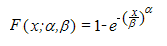{border="0"}

[]{style="FONT-FAMILY: 'Trebuchet MS','sans-serif'; COLOR: #15428b; FONT-SIZE: 9pt"} 

[·      ]{style="FONT-FAMILY: Symbol"}The equation for the Weibull probability density function is,

[]{style="FONT-FAMILY: 'Trebuchet MS','sans-serif'; COLOR: #15428b; FONT-SIZE: 9pt"} 

                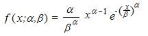{border="0"}

[]{style="FONT-FAMILY: 'Trebuchet MS','sans-serif'; COLOR: #15428b; FONT-SIZE: 9pt"} 

[·      ]{style="FONT-FAMILY: Symbol"}When alpha = 1, WEIBULL returns the exponential distribution with,

[]{style="FONT-FAMILY: 'Trebuchet MS','sans-serif'; COLOR: #15428b; FONT-SIZE: 9pt"} 

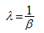{border="0"}

 

###### []{#p276}4.1.4.6.6.178      Xirr {#xirr style="tab-stops: 0pt"}

The Xirr function computes the internal rate-of-return for a schedule of possibly non-periodic cash flows.

 

Syntax:

**Xirr(cashflow, datelist, value)**

 

where:

**cashflow** is the range of cash flow.

**datelist** is the list of serial number of the corresponding date values.

**value** is an initial guess interger value which reflects in the result of the function.

 

###### 4.1.4.6.6.179      YEAR {#year style="tab-stops: 0pt"}

[]{style="FONT-FAMILY: 'Trebuchet MS','sans-serif'; COLOR: #15428b; FONT-SIZE: 9pt"} 

Returns the year corresponding to a date. The year is returned as an integer in the range 1900-9999.

 

**Syntax**

 

**YEAR(serial_number)**, where:

 

**serial_number** is the date of the year you want to find. Dates should be entered by using the DATE function or as results of other formulas or functions. For example, use DATE(2002,11,12) for the 12th day of November 2002.

[]{style="FONT-FAMILY: 'Trebuchet MS','sans-serif'; COLOR: #15428b; FONT-SIZE: 9pt"} 

Remarks

[]{style="FONT-FAMILY: 'Trebuchet MS','sans-serif'; COLOR: #15428b; FONT-SIZE: 9pt"} 

[·      ]{style="FONT-FAMILY: Symbol"}Dates are stored as sequential serial numbers so that they can be used in calculations. By default, January 1, 1900 is serial number 1 and January 1, 2008 is serial number 39448 because it is 39,448 days after January 1, 1900.

 

[]{#p277} 

###### 4.1.4.6.6.180      ZTEST {#ztest style="tab-stops: 0pt"}

[]{style="FONT-FAMILY: 'Trebuchet MS','sans-serif'; COLOR: #15428b; FONT-SIZE: 9pt"} 

Returns the one-tailed probability-value of a z-test.

[]{style="FONT-FAMILY: 'Trebuchet MS','sans-serif'; COLOR: #15428b; FONT-SIZE: 9pt"} 

**Syntax**

**[]{style="FONT-FAMILY: 'Trebuchet MS','sans-serif'; COLOR: #15428b; FONT-SIZE: 9pt"}** 

**ZTEST(array, u0, sigma),** where:

 

**array** is the array or range of data against which to test u0

**u0** is the value to test.

**sigma** is the population (known) standard deviation. If omitted, the sample standard deviation is used.

[]{style="FONT-FAMILY: 'Trebuchet MS','sans-serif'; COLOR: #15428b; FONT-SIZE: 9pt"} 

Remarks

[]{style="FONT-FAMILY: 'Trebuchet MS','sans-serif'; COLOR: #15428b; FONT-SIZE: 9pt"} 

[·      ]{style="FONT-FAMILY: Symbol"}ZTEST is calculated as follows when sigma is not omitted,

[]{style="FONT-FAMILY: 'Trebuchet MS','sans-serif'; COLOR: #15428b; FONT-SIZE: 9pt"} 

        {border="0"}

[]{style="FONT-FAMILY: 'Trebuchet MS','sans-serif'; COLOR: #15428b; FONT-SIZE: 9pt"} 

[·      ]{style="FONT-FAMILY: Symbol"}or when sigma is omitted,

[]{style="FONT-FAMILY: 'Trebuchet MS','sans-serif'; COLOR: #15428b; FONT-SIZE: 9pt"} 

        {border="0"}

[]{style="FONT-FAMILY: 'Trebuchet MS','sans-serif'; COLOR: #15428b; FONT-SIZE: 9pt"} 

where x is the sample mean AVERAGE(array); s is the sample standard deviation STDEV(array); and n is the number of observations in the sample COUNT(array).

 

[]{#p278} 

 

[]{#related-topics}
::::::::
