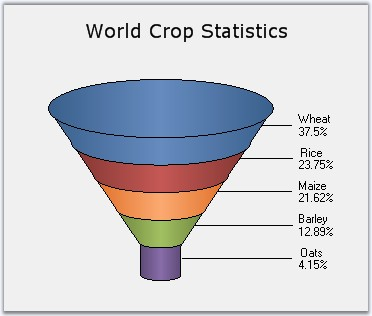

::: {style="DISPLAY: none"}
{#d2h_url_template}{#d2h_package_url style="WIDTH: 0px; DISPLAY: none; HEIGHT: 0px"}
:::

:::: {.d2h_secondary_topic style="PADDING-BOTTOM: 10pt; MARGIN: 0pt; PADDING-LEFT: 0pt; PADDING-RIGHT: 0pt; PADDING-TOP: 0pt"}
#### Funnel Chart {#funnel-chart style="tab-stops: 0pt"}

[]{style="FONT-FAMILY: 'Trebuchet MS','sans-serif'; FONT-SIZE: 9pt"} 

The Funnel chart is a single series chart representing the data as portions of 100%, and this chart does not use any axes. Funnel chart can be viewed in 2D or 3D mode.

Funnel charts are often used to represent stages in a sales process and show the amount of potential revenue for each stage. This type of chart can be useful also in identifying potential problem areas in an organization\'s sales processes. A funnel chart is similar to a stacked percent bar chart.

The following images are some sample Funnel Charts.

[]{style="FONT-FAMILY: 'Trebuchet MS','sans-serif'; FONT-SIZE: 9pt"} 

{border="0"}

[]{style="FONT-FAMILY: 'Trebuchet MS','sans-serif'; FONT-SIZE: 9pt"} 

Figure 60: 2D Funnel Chart

**[]{style="FONT-FAMILY: 'Trebuchet MS','sans-serif'; FONT-SIZE: 9pt"}** 

{border="0"}

**[]{style="FONT-FAMILY: 'Trebuchet MS','sans-serif'; FONT-SIZE: 9pt"}** 

Figure 61: 3D Funnel-FigureBase-Circle Chart

**[]{style="FONT-FAMILY: 'Trebuchet MS','sans-serif'; FONT-SIZE: 9pt"}** 

{border="0"}

**[]{style="FONT-FAMILY: 'Trebuchet MS','sans-serif'; FONT-SIZE: 9pt"}** 

Figure 62: 3D Funnel-FigureBase-Square Chart

**[]{style="FONT-FAMILY: 'Trebuchet MS','sans-serif'; FONT-SIZE: 9pt"}** 

{border="0"}

**[]{style="FONT-FAMILY: 'Trebuchet MS','sans-serif'; FONT-SIZE: 9pt"}** 

Figure 63: 3D Funnel Chart with Gap ratio 0.1

**[]{style="FONT-FAMILY: 'Trebuchet MS','sans-serif'; FONT-SIZE: 9pt"}** 

::: {align="center"}
+------------------------------+------------------------+
| Details                                               |
+------------------------------+------------------------+
| Number of Y values per point | 1                      |
+------------------------------+------------------------+
| Number of Series             | One.                   |
+------------------------------+------------------------+
| Cannot be Combined with      | Any other chart types. |
+------------------------------+------------------------+
:::

[]{style="FONT-FAMILY: 'Trebuchet MS','sans-serif'; FONT-SIZE: 9pt"} 

+----------------------------------------------------------------------------------------------------------------------------------------------------------------------------------------------+
| **[\[C#\]]{style="FONT-FAMILY: 'Courier New'; COLOR: black"}**                                                                                                                               |
|                                                                                                                                                                                              |
| **[]{style="FONT-FAMILY: 'Courier New'; COLOR: black"}**                                                                                                                                     |
|                                                                                                                                                                                              |
| [ChartSeries series1 = [this]{style="COLOR: blue"}.ChartWebControl1.Model.NewSeries([\"Funnel chart\"]{style="COLOR: maroon"}, ChartSeriesType.Funnel);]{style="FONT-FAMILY: 'Courier New'"} |
|                                                                                                                                                                                              |
| [series1.Points.Add(0, 25.3);]{style="FONT-FAMILY: 'Courier New'"}                                                                                                                           |
|                                                                                                                                                                                              |
| [series1.Points.Add(1, 45.7);]{style="FONT-FAMILY: 'Courier New'"}                                                                                                                           |
|                                                                                                                                                                                              |
| [series1.Points.Add(2, 97.3);]{style="FONT-FAMILY: 'Courier New'"}                                                                                                                           |
|                                                                                                                                                                                              |
| [series1.Points.Add(3, 20.6);]{style="FONT-FAMILY: 'Courier New'"}                                                                                                                           |
|                                                                                                                                                                                              |
| [series1.Points.Add(4, 125.8);]{style="FONT-FAMILY: 'Courier New'"}                                                                                                                          |
|                                                                                                                                                                                              |
| [series1.Points.Add(5, 216.1);]{style="FONT-FAMILY: 'Courier New'"}                                                                                                                          |
|                                                                                                                                                                                              |
| [this]{style="FONT-FAMILY: 'Courier New'; COLOR: blue"}[.ChartWebControl1.Series.Add(series1);]{style="FONT-FAMILY: 'Courier New'"}                                                          |
+----------------------------------------------------------------------------------------------------------------------------------------------------------------------------------------------+

[]{style="FONT-FAMILY: 'Trebuchet MS','sans-serif'; FONT-SIZE: 9pt"} 

+----------------------------------------------------------------------------------------------------------------------------------------------------------------------------------------------------------------------------------------------------------------------------+
| **[\[VB.NET\]]{style="FONT-FAMILY: 'Courier New'; COLOR: black"}**                                                                                                                                                                                                         |
|                                                                                                                                                                                                                                                                            |
| **[]{style="FONT-FAMILY: 'Courier New'; COLOR: black"}**                                                                                                                                                                                                                   |
|                                                                                                                                                                                                                                                                            |
| [Dim]{style="FONT-FAMILY: 'Courier New'; COLOR: blue"}[ series1 [As]{style="COLOR: blue"} ChartSeries = [Me]{style="COLOR: blue"}.ChartWebControl1.Model.NewSeries([\"Funnel chart\"]{style="COLOR: maroon"}, ChartSeriesType.Funnel)]{style="FONT-FAMILY: 'Courier New'"} |
|                                                                                                                                                                                                                                                                            |
| [series1.Points.Add(0,25.3)]{style="FONT-FAMILY: 'Courier New'"}                                                                                                                                                                                                           |
|                                                                                                                                                                                                                                                                            |
| [series1.Points.Add(1,45.7)]{style="FONT-FAMILY: 'Courier New'"}                                                                                                                                                                                                           |
|                                                                                                                                                                                                                                                                            |
| [series1.Points.Add(2,97.3)]{style="FONT-FAMILY: 'Courier New'"}                                                                                                                                                                                                           |
|                                                                                                                                                                                                                                                                            |
| [series1.Points.Add(3,20.6)]{style="FONT-FAMILY: 'Courier New'"}                                                                                                                                                                                                           |
|                                                                                                                                                                                                                                                                            |
| [series1.Points.Add(4,125.8)]{style="FONT-FAMILY: 'Courier New'"}                                                                                                                                                                                                          |
|                                                                                                                                                                                                                                                                            |
| [series1.Points.Add(5,216.1)]{style="FONT-FAMILY: 'Courier New'"}                                                                                                                                                                                                          |
|                                                                                                                                                                                                                                                                            |
| [Me]{style="FONT-FAMILY: 'Courier New'; COLOR: blue"}[.ChartWebControl1.Series.Add(series1)]{style="FONT-FAMILY: 'Courier New'"}                                                                                                                                           |
+----------------------------------------------------------------------------------------------------------------------------------------------------------------------------------------------------------------------------------------------------------------------------+

**[]{style="FONT-FAMILY: 'Trebuchet MS','sans-serif'; FONT-SIZE: 9pt"}** 

 

+--------------------------------------------------------------------------------------------------------------------------------------------------------------------------------------------------------------------------------------------------------------------------------------------------------------------------------------------------------------------------------------------------------------------------------------------------------------------------------------------------------------------------------------------------------------------------------------------------------------------------------------------------------------------------------------------------------------------------------------------------------------------------------------------------------------------------------------------------------------------------------------------------------------------------------------------------------------------------------------------------------------------------------------------------------------------------------------------------------------------------------------------------------------------------------------------------------------------------------------------------------------+
| []{#p55}[]{style="COLOR: black; FONT-SIZE: 8pt"}                                                                                                                                                                                                                                                                                                                                                                                                                                                                                                                                                                                                                                                                                                                                                                                                                                                                                                                                                                                                                                                                                                                                                                                                             |
|                                                                                                                                                                                                                                                                                                                                                                                                                                                                                                                                                                                                                                                                                                                                                                                                                                                                                                                                                                                                                                                                                                                                                                                                                                                              |
| Customization Options[]{style="FONT-FAMILY: 'Trebuchet MS','sans-serif'; FONT-SIZE: 9pt; FONT-WEIGHT: normal"}                                                                                                                                                                                                                                                                                                                                                                                                                                                                                                                                                                                                                                                                                                                                                                                                                                                                                                                                                                                                                                                                                                                                               |
+--------------------------------------------------------------------------------------------------------------------------------------------------------------------------------------------------------------------------------------------------------------------------------------------------------------------------------------------------------------------------------------------------------------------------------------------------------------------------------------------------------------------------------------------------------------------------------------------------------------------------------------------------------------------------------------------------------------------------------------------------------------------------------------------------------------------------------------------------------------------------------------------------------------------------------------------------------------------------------------------------------------------------------------------------------------------------------------------------------------------------------------------------------------------------------------------------------------------------------------------------------------+
| [[DisplayShadow]{.UGHyperlink}](ms-xhelp:///?Id=985c525e-c4c8-40ea-8222-130fe9b88fd7)[, ]{.UGHyperlink}[[DisplayText]{.UGHyperlink}](ms-xhelp:///?Id=f7eb84a8-511e-4814-8b89-d8a2fe7731f3)[, ]{.UGHyperlink}[[DrawErrorBars]{.UGHyperlink}](ms-xhelp:///?Id=292813fa-54b4-42a4-8f0d-0291dc5221fb)[, ]{.UGHyperlink}[[DrawSeriesNameInDepth]{.UGHyperlink}](ms-xhelp:///?Id=78286af6-eb2c-4c81-aa63-ed667b9d74f8)[, ]{.UGHyperlink}[[ElementBorders]{.UGHyperlink}](ms-xhelp:///?Id=78286af6-eb2c-4c81-aa63-ed667b9d74f8)[, ]{.UGHyperlink}[[ErrorBarsSymbolShape]{.UGHyperlink}](ms-xhelp:///?Id=78286af6-eb2c-4c81-aa63-ed667b9d74f8)[, ]{.UGHyperlink}[[HighlightInterior]{.UGHyperlink}](ms-xhelp:///?Id=78286af6-eb2c-4c81-aa63-ed667b9d74f8)[, ]{.UGHyperlink}[[HitTestRadius]{.UGHyperlink}](ms-xhelp:///?Id=78286af6-eb2c-4c81-aa63-ed667b9d74f8)[, ]{.UGHyperlink}[[Images]{.UGHyperlink}](ms-xhelp:///?Id=78286af6-eb2c-4c81-aa63-ed667b9d74f8)[]{.UGHyperlink}                                                                                                                                                                                                                                                                                     |
|                                                                                                                                                                                                                                                                                                                                                                                                                                                                                                                                                                                                                                                                                                                                                                                                                                                                                                                                                                                                                                                                                                                                                                                                                                                              |
| [[ImageIndex]{.UGHyperlink}](ms-xhelp:///?Id=743c99d4-6def-4487-8630-0f62728800d1)[, ]{.UGHyperlink}[[Rotate]{.UGHyperlink}](ms-xhelp:///?Id=ba19bc5c-afa8-482b-8067-8538d49f969b)[, ]{.UGHyperlink}[[Spacing Between Series]{.UGHyperlink}](ms-xhelp:///?Id=f3c66e28-a2aa-4906-8e2c-17a9d80d9538)[, ]{.UGHyperlink}[[ShadowInterior]{.UGHyperlink}](ms-xhelp:///?Id=557db164-3f96-46ca-bdde-ee63b381764e)[, ]{.UGHyperlink}[[ShadowOffset]{.UGHyperlink}](ms-xhelp:///?Id=743c99d4-6def-4487-8630-0f62728800d1)[, ]{.UGHyperlink}[[FancyToolTip]{.UGHyperlink}](ms-xhelp:///?Id=0af06ef0-75be-4557-b802-343853542859)[, ]{.UGHyperlink}[[Font]{.UGHyperlink}](ms-xhelp:///?Id=0af06ef0-75be-4557-b802-343853542859)[, ]{.UGHyperlink}[[Interior]{.UGHyperlink}](ms-xhelp:///?Id=0af06ef0-75be-4557-b802-343853542859)[, ]{.UGHyperlink}[[LegendItem]{.UGHyperlink}](ms-xhelp:///?Id=49873c40-5115-4969-9508-ad9f10d4d1a2)[, ]{.UGHyperlink}[[Name,]{.UGHyperlink}](ms-xhelp:///?Id=16732d89-fef2-4657-8fe5-947274d8122e)[ ]{.UGHyperlink}[[PointsToolTipFormat]{.UGHyperlink}](ms-xhelp:///?Id=4762306d-608b-41d4-a64b-cb86121b60d8)[, ]{.UGHyperlink}[[SmartLabels]{.UGHyperlink}](ms-xhelp:///?Id=044bea7a-9921-4e67-b528-6ded19bff386)[, ]{.UGHyperlink} |
|                                                                                                                                                                                                                                                                                                                                                                                                                                                                                                                                                                                                                                                                                                                                                                                                                                                                                                                                                                                                                                                                                                                                                                                                                                                              |
| [[Summary]{.UGHyperlink}](ms-xhelp:///?Id=044bea7a-9921-4e67-b528-6ded19bff386)[, ]{.UGHyperlink}[[Text]{.UGHyperlink}](ms-xhelp:///?Id=b817a5ed-ca59-40d5-b3e0-a3a354a4fd05)[, ]{.UGHyperlink}[[TextColor]{.UGHyperlink}](ms-xhelp:///?Id=9202533e-a9c3-47c0-9762-dad7bcfdc47a)[, ]{.UGHyperlink}[[TextFormat]{.UGHyperlink}](ms-xhelp:///?Id=45ea8b0c-ada0-4971-9ed7-ba19064882cd)[, ]{.UGHyperlink}[[TextOffset]{.UGHyperlink}](ms-xhelp:///?Id=4762306d-608b-41d4-a64b-cb86121b60d8)[, ]{.UGHyperlink}[[TextOrientation]{.UGHyperlink}](ms-xhelp:///?Id=62e29461-d0b2-4ed1-b83e-ddf73f34fbf5)[, ]{.UGHyperlink}[[Visible]{.UGHyperlink}](ms-xhelp:///?Id=04fa0a51-9b81-4f2b-adcc-8d8b3502f038)[]{style="FONT-FAMILY: 'Trebuchet MS','sans-serif'; COLOR: black; FONT-SIZE: 9pt"}                                                                                                                                                                                                                                                                                                                                                                                                                                                                         |
+--------------------------------------------------------------------------------------------------------------------------------------------------------------------------------------------------------------------------------------------------------------------------------------------------------------------------------------------------------------------------------------------------------------------------------------------------------------------------------------------------------------------------------------------------------------------------------------------------------------------------------------------------------------------------------------------------------------------------------------------------------------------------------------------------------------------------------------------------------------------------------------------------------------------------------------------------------------------------------------------------------------------------------------------------------------------------------------------------------------------------------------------------------------------------------------------------------------------------------------------------------------+

 

[]{#related-topics}
::::
