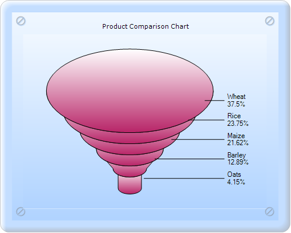

::: {style="DISPLAY: none"}
{#d2h_url_template}{#d2h_package_url style="WIDTH: 0px; DISPLAY: none; HEIGHT: 0px"}
:::

:::: {.d2h_secondary_topic style="PADDING-BOTTOM: 10pt; MARGIN: 0pt; PADDING-LEFT: 0pt; PADDING-RIGHT: 0pt; PADDING-TOP: 0pt"}
#### Funnel Chart {#funnel-chart style="tab-stops: 0pt"}

 

The Funnel chart is a single series chart representing the data as portions of hundred percent and this chart does not use any axes. Funnel chart can be viewed in the 2D or 3D mode.

Funnel charts are often used to represent stages in a sales process and show the amount of potential revenue for each stage. This type of chart can be useful also in identifying potential problem areas in an organization\'s sales processes. A Funnel chart is similar to a Stacked Percent Bar chart.

 

{border="0"}

[]{style="FONT-FAMILY: 'Calibri','sans-serif'"} 

Figure 109: 2D Funnel chart

[]{style="FONT-FAMILY: 'Calibri','sans-serif'"} 

[]{style="FONT-FAMILY: 'Calibri','sans-serif'"} 

{border="0"}

[]{style="FONT-FAMILY: 'Calibri','sans-serif'"} 

Figure 110: 3D Funnel-FigureBase-Circle chart

[]{style="FONT-FAMILY: 'Calibri','sans-serif'"} 

[]{style="FONT-FAMILY: 'Calibri','sans-serif'"} 

[]{style="FONT-FAMILY: 'Calibri','sans-serif'"} 

{border="0"}

[]{style="FONT-FAMILY: 'Calibri','sans-serif'"} 

Figure 111: 3D Funnel-FigureBase-Square chart

[]{style="FONT-FAMILY: 'Calibri','sans-serif'"} 

[]{style="FONT-FAMILY: 'Calibri','sans-serif'"} 

{border="0"}

[]{style="FONT-FAMILY: 'Calibri','sans-serif'"} 

Figure 112: 3D Funnel chart with Gap ratio 0.2

 

Funnel chart can be created in two ways:

[·      ]{style="FONT-FAMILY: Symbol"}Builder

[·      ]{style="FONT-FAMILY: Symbol"}ChartModel

 

Chart Details[]{style="FONT-FAMILY: 'Times New Roman','serif'; FONT-SIZE: 12pt"}

[]{style="FONT-FAMILY: 'Calibri','sans-serif'"} 

::: {align="center"}
+------------------------------+-----------------------+
| Details                                              |
+------------------------------+-----------------------+
| Number of Y values per point | 1                     |
+------------------------------+-----------------------+
| Number of Series             | One                   |
+------------------------------+-----------------------+
| Cannot be Combined with      | Any other chart type. |
+------------------------------+-----------------------+
:::

[]{style="FONT-FAMILY: 'Calibri','sans-serif'"} 

More:

[ ]{#related-topics}

[{border="0" align="absMiddle"}Builder](ms-xhelp:///?Id=dbbd9cf7-055d-4f9a-a81b-5e6f57d0f4a2){style="TEXT-DECORATION: none"}

[{border="0" align="absMiddle"}ChartModel](ms-xhelp:///?Id=d321cdb1-30bf-4e1e-8bd6-6290e0de6c34){style="TEXT-DECORATION: none"}
::::
