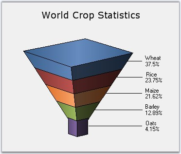
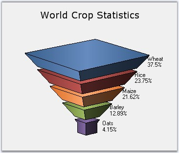

::: {style="DISPLAY: none"}
{#d2h_url_template}{#d2h_package_url style="WIDTH: 0px; DISPLAY: none; HEIGHT: 0px"}
:::

:::: {.d2h_secondary_topic style="PADDING-BOTTOM: 10pt; MARGIN: 0pt; PADDING-LEFT: 0pt; PADDING-RIGHT: 0pt; PADDING-TOP: 0pt"}
#### Funnel Chart {#funnel-chart style="tab-stops: 0pt"}

 

The Funnel chart is a single series chart representing the data as portions of 100%, and this chart does not use any axes. Funnel chart can be viewed in 2D or 3D mode.

 

Funnel charts are often used to represent stages in a sales process and show the amount of potential revenue for each stage. This type of chart can be useful also in identifying potential problem areas in an organization\'s sales processes. A funnel chart is similar to a stacked percent bar chart.

 

The following images are some sample Funnel Charts.

 

{border="0"}

 

Figure 62: 2DFunnelChart

 

{border="0"}

 

Figure 63: 3D Funnel-FigureBase-Circle Chart

 

{border="0"}

 

Figure 64: 3D Funnel-FigureBase-Square Chart

 

{border="0"}

 

Figure 65: 3D Funnel Chart with Gap ratio 0.1

 

::: {align="center"}
+-------------------------------------+-------------------------------------+
|                                                                           |
|                                                                           |
| Details                                                                   |
+-------------------------------------+-------------------------------------+
|                                     |                                     |
|                                     |                                     |
| **Number of Y values per point**    | 1                                   |
+-------------------------------------+-------------------------------------+
|                                     |                                     |
|                                     |                                     |
| **Number of Series         **       | One.                                |
+-------------------------------------+-------------------------------------+
|                                     |                                     |
|                                     |                                     |
| **Cannot be Combined with   **      | Any other chart types.              |
+-------------------------------------+-------------------------------------+
:::

 

 

 

+-------------------------------------------------------------------------------------------------------------------------------------------------------------------------------------------+
| **[\[C#\]]{style="FONT-FAMILY: 'Courier New'; COLOR: black"}**                                                                                                                            |
|                                                                                                                                                                                           |
| **[]{style="FONT-FAMILY: 'Courier New'; COLOR: black"}**                                                                                                                                  |
|                                                                                                                                                                                           |
| [ChartSeries series1 = [this]{style="COLOR: blue"}.chartControl1.Model.NewSeries([\"Funnel chart\"]{style="COLOR: maroon"}, ChartSeriesType.Funnel);]{style="FONT-FAMILY: 'Courier New'"} |
|                                                                                                                                                                                           |
| [series1.Points.Add(0, 25.3);]{style="FONT-FAMILY: 'Courier New'"}                                                                                                                        |
|                                                                                                                                                                                           |
| [series1.Points.Add(1, 45.7);]{style="FONT-FAMILY: 'Courier New'"}                                                                                                                        |
|                                                                                                                                                                                           |
| [series1.Points.Add(2, 97.3);]{style="FONT-FAMILY: 'Courier New'"}                                                                                                                        |
|                                                                                                                                                                                           |
| [series1.Points.Add(3, 20.6);]{style="FONT-FAMILY: 'Courier New'"}                                                                                                                        |
|                                                                                                                                                                                           |
| [series1.Points.Add(4, 125.8);]{style="FONT-FAMILY: 'Courier New'"}                                                                                                                       |
|                                                                                                                                                                                           |
| [series1.Points.Add(5, 216.1);]{style="FONT-FAMILY: 'Courier New'"}                                                                                                                       |
|                                                                                                                                                                                           |
| [this]{style="FONT-FAMILY: 'Courier New'; COLOR: blue"}[.chartControl1.Series.Add(series1);]{style="FONT-FAMILY: 'Courier New'"}                                                          |
+-------------------------------------------------------------------------------------------------------------------------------------------------------------------------------------------+

 

+-------------------------------------------------------------------------------------------------------------------------------------------------------------------------------------------------------------------------------------------------------------------------+
| **[\[VB.NET\]]{style="FONT-FAMILY: 'Courier New'; COLOR: black"}**                                                                                                                                                                                                      |
|                                                                                                                                                                                                                                                                         |
| **[]{style="FONT-FAMILY: 'Courier New'; COLOR: black"}**                                                                                                                                                                                                                |
|                                                                                                                                                                                                                                                                         |
| [Dim]{style="FONT-FAMILY: 'Courier New'; COLOR: blue"}[ series1 [As]{style="COLOR: blue"} ChartSeries = [Me]{style="COLOR: blue"}.chartControl1.Model.NewSeries([\"Funnel chart\"]{style="COLOR: maroon"}, ChartSeriesType.Funnel)]{style="FONT-FAMILY: 'Courier New'"} |
|                                                                                                                                                                                                                                                                         |
| [series1.Points.Add(0,25.3)]{style="FONT-FAMILY: 'Courier New'"}                                                                                                                                                                                                        |
|                                                                                                                                                                                                                                                                         |
| [series1.Points.Add(1,45.7)]{style="FONT-FAMILY: 'Courier New'"}                                                                                                                                                                                                        |
|                                                                                                                                                                                                                                                                         |
| [series1.Points.Add(2,97.3)]{style="FONT-FAMILY: 'Courier New'"}                                                                                                                                                                                                        |
|                                                                                                                                                                                                                                                                         |
| [series1.Points.Add(3,20.6)]{style="FONT-FAMILY: 'Courier New'"}                                                                                                                                                                                                        |
|                                                                                                                                                                                                                                                                         |
| [series1.Points.Add(4,125.8)]{style="FONT-FAMILY: 'Courier New'"}                                                                                                                                                                                                       |
|                                                                                                                                                                                                                                                                         |
| [series1.Points.Add(5,216.1)]{style="FONT-FAMILY: 'Courier New'"}                                                                                                                                                                                                       |
|                                                                                                                                                                                                                                                                         |
| [Me]{style="FONT-FAMILY: 'Courier New'; COLOR: blue"}[.chartControl1.Series.Add(series1)]{style="FONT-FAMILY: 'Courier New'"}                                                                                                                                           |
+-------------------------------------------------------------------------------------------------------------------------------------------------------------------------------------------------------------------------------------------------------------------------+

 

+---------------------------------------------------------------------------------------------------------------------------------------------------------------------------------------------------------------------------------------------------------------------------------------------------------------+
|                                                                                                                                                                                                                                                                                                               |
|                                                                                                                                                                                                                                                                                                               |
| Customization Options                                                                                                                                                                                                                                                                                         |
+---------------------------------------------------------------------------------------------------------------------------------------------------------------------------------------------------------------------------------------------------------------------------------------------------------------+
| Border, DisplayText, DrawSeriesNameInDepth, FigureBase, FunnelMode, GapRatio, HighlightInterior, LabelPlacement, LabelStyle, FancyToolTip, Font, Interior, LegendItem, Name, PointsToolTipFormat, SmartLabels, Summary, Text, TextColor, TextFormat, TextOffset, TextOrientation, Visible, ShowDataBindLabels |
+---------------------------------------------------------------------------------------------------------------------------------------------------------------------------------------------------------------------------------------------------------------------------------------------------------------+

[]{#p53} 

 

[]{#related-topics}
::::
