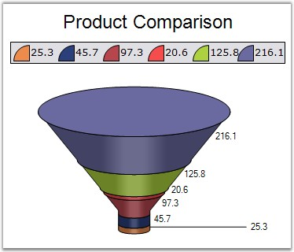
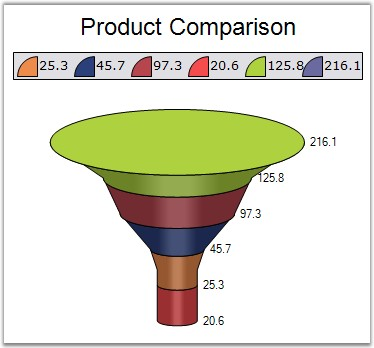

::: {style="DISPLAY: none"}
{#d2h_url_template}{#d2h_package_url style="WIDTH: 0px; DISPLAY: none; HEIGHT: 0px"}
:::

:::: {.d2h_secondary_topic style="PADDING-BOTTOM: 10pt; MARGIN: 0pt; PADDING-LEFT: 0pt; PADDING-RIGHT: 0pt; PADDING-TOP: 0pt"}
#### FunnelMode {#funnelmode style="tab-stops: 0pt"}

[]{style="FONT-FAMILY: 'Trebuchet MS','sans-serif'; FONT-SIZE: 9pt"} 

Gets or sets the chart funnel mode.

[]{style="FONT-FAMILY: 'Trebuchet MS','sans-serif'; FONT-SIZE: 9pt"} 

[]{style="FONT-FAMILY: 'Trebuchet MS','sans-serif'; FONT-SIZE: 9pt"} 

::: {align="center"}
+---------------------------------------+--------------------------------------------------------------------------+
| **[]{style="FONT-FAMILY: 'Trebuchet MS','sans-serif'; FONT-SIZE: 9pt"}**                                         |
|                                                                                                                  |
| Details                                                                                                          |
+---------------------------------------+--------------------------------------------------------------------------+
| Possible Values                       | YIsWidth - DataPoint y-value controls the radius of the funnel segment.\ |
|                                       | YIsHeight - DataPoint y-value controls the height of the funnel segment. |
+---------------------------------------+--------------------------------------------------------------------------+
| Default Value                         | YIsHeight                                                                |
+---------------------------------------+--------------------------------------------------------------------------+
| 2D / 3D Limitations                   | No                                                                       |
+---------------------------------------+--------------------------------------------------------------------------+
| Applies to Chart Element              | All series                                                               |
+---------------------------------------+--------------------------------------------------------------------------+
| Applies to Chart Types                | Funnel Chart                                                             |
+---------------------------------------+--------------------------------------------------------------------------+
:::

**[]{style="FONT-FAMILY: 'Trebuchet MS','sans-serif'; FONT-SIZE: 9pt"}** 

Here is some sample code.

[]{style="FONT-FAMILY: 'Trebuchet MS','sans-serif'; FONT-SIZE: 9pt"} 

+-------------------------------------------------------------------------------------------------------------------------------------------------------------------------------------------+
| **[\[C#\]]{style="FONT-FAMILY: 'Courier New'; COLOR: black"}**                                                                                                                            |
|                                                                                                                                                                                           |
| **[]{style="FONT-FAMILY: 'Courier New'; COLOR: black"}**                                                                                                                                  |
|                                                                                                                                                                                           |
| [this]{style="FONT-FAMILY: 'Courier New'; COLOR: blue"}[.ChartWebControl1.Series\[0\].ConfigItems.FunnelItem.FunnelMode = ChartFunnelMode.YIsHeight;]{style="FONT-FAMILY: 'Courier New'"} |
|                                                                                                                                                                                           |
| [this]{style="FONT-FAMILY: 'Courier New'; COLOR: blue"}[.ChartWebControl1.Series\[0\].ConfigItems.FunnelItem.FunnelMode = ChartFunnelMode.YIsWidth;]{style="FONT-FAMILY: 'Courier New'"}  |
+-------------------------------------------------------------------------------------------------------------------------------------------------------------------------------------------+

[]{style="FONT-FAMILY: 'Trebuchet MS','sans-serif'; FONT-SIZE: 9pt"} 

+--------------------------------------------------------------------------------------------------------------------------------------------------------------------------------------+
| **[\[VB.NET\]]{style="FONT-FAMILY: 'Courier New'; COLOR: black"}**                                                                                                                   |
|                                                                                                                                                                                      |
| **[]{style="FONT-FAMILY: 'Courier New'; COLOR: black"}**                                                                                                                             |
|                                                                                                                                                                                      |
| [Me]{style="FONT-FAMILY: 'Courier New'; COLOR: blue"}[.ChartWebControl1.Series(0).ConfigItems.FunnelItem.FunnelMode = ChartFunnelMode.YIsHeight]{style="FONT-FAMILY: 'Courier New'"} |
|                                                                                                                                                                                      |
| [Me]{style="FONT-FAMILY: 'Courier New'; COLOR: blue"}[.ChartWebControl1.Series(0).ConfigItems.FunnelItem.FunnelMode = ChartFunnelMode.YIsWidth]{style="FONT-FAMILY: 'Courier New'"}  |
+--------------------------------------------------------------------------------------------------------------------------------------------------------------------------------------+

**[]{style="FONT-FAMILY: 'Trebuchet MS','sans-serif'; FONT-SIZE: 9pt"}** 

{border="0"}

**[]{style="FONT-FAMILY: 'Trebuchet MS','sans-serif'; FONT-SIZE: 9pt"}** 

Figure 130: Funnel Chart with FunnelMode as \"Height\"

**[]{style="COLOR: black; FONT-SIZE: 8pt"}** 

{border="0"}

**[]{style="FONT-FAMILY: 'Trebuchet MS','sans-serif'; FONT-SIZE: 9pt"}** 

Figure 131: Funnel Chart with FunnelMode as \"Width\"

**[]{style="FONT-FAMILY: 'Courier New'; COLOR: black; FONT-SIZE: 9pt"}** 

See Also

**[]{style="FONT-FAMILY: 'Trebuchet MS','sans-serif'; FONT-SIZE: 9pt"}** 

[Funnel Chart]{.UGHyperlink}[]{.UGHyperlink}

[]{#p106} 

[]{#related-topics}
::::
