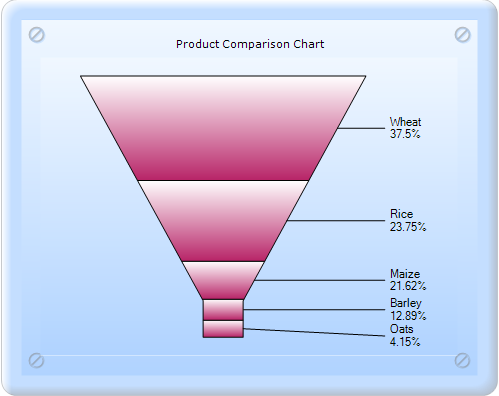
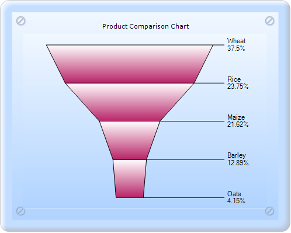

::: {style="DISPLAY: none"}
{#d2h_url_template}{#d2h_package_url style="WIDTH: 0px; DISPLAY: none; HEIGHT: 0px"}
:::

:::: {.d2h_secondary_topic style="PADDING-BOTTOM: 10pt; MARGIN: 0pt; PADDING-LEFT: 0pt; PADDING-RIGHT: 0pt; PADDING-TOP: 0pt"}
##### FunnelMode {#funnelmode style="tab-stops: 0pt"}

FunnelMode gets or sets the chart Funnel mode.

::: {align="center"}
+-------------------------------------+------------------------------------------------------------------------------+
| Details                                                                                                            |
+-------------------------------------+------------------------------------------------------------------------------+
| Possible values                     | **YIsWidth** - DataPoint y-value controls the radius of the funnel segment.\ |
|                                     | **YIsHeight** - DataPoint y-value controls the height of the funnel segment. |
+-------------------------------------+------------------------------------------------------------------------------+
| Default value                       | YIsHeight                                                                    |
+-------------------------------------+------------------------------------------------------------------------------+
| 2D/3D limitations                   | No                                                                           |
+-------------------------------------+------------------------------------------------------------------------------+
| Application to chart element        | All series                                                                   |
+-------------------------------------+------------------------------------------------------------------------------+
| Application to chart types          | Funnel chart                                                                 |
+-------------------------------------+------------------------------------------------------------------------------+
:::

[]{style="FONT-FAMILY: 'Calibri','sans-serif'"} 

{border="0"}

Figure 225: Funnel chart with YISHeight

{border="0"}

Figure 226: Funnel chart with FunnelMode YISWidth

[]{#related-topics}
::::
