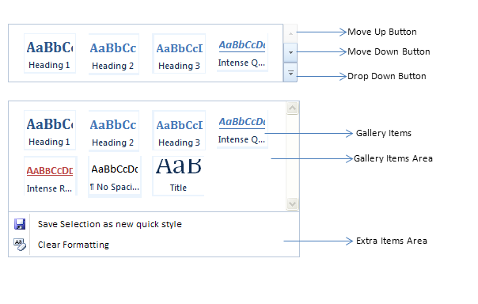

::: {style="DISPLAY: none"}
{#d2h_url_template}{#d2h_package_url style="WIDTH: 0px; DISPLAY: none; HEIGHT: 0px"}
:::

::::: {#nsbanner .d2h_main_nsbanner style="BORDER-BOTTOM: #999999 1px solid; POSITION: relative; PADDING-BOTTOM: 0px; BACKGROUND-COLOR: transparent; PADDING-LEFT: 0px; PADDING-RIGHT: 0px; DISPLAY: none; BORDER-TOP: #999999 1px solid; PADDING-TOP: 0px; LEFT: 0px"}
:::: {#TitleRow .d2h_main_titlerow style="PADDING-BOTTOM: 4px; BACKGROUND-COLOR: transparent; PADDING-LEFT: 22px; WIDTH: 100%; PADDING-RIGHT: 10px; DISPLAY: none; PADDING-TOP: 4px"}
::: {#ienav .d2h_main_ienav style="DISPLAY: none"}
{#D2HPrevious .D2HPreviousEnabled}  {#D2HNext .D2HNextEnabled}
:::
::::
:::::

:::: {#nstext .d2h_main_nstext style="PADDING-BOTTOM: 10px; BACKGROUND-COLOR: transparent; PADDING-LEFT: 22px; PADDING-RIGHT: 10px; HEIGHT: 100%; OVERFLOW: auto; PADDING-TOP: 5px" hasuserbackground="true" valign="bottom"}
::: {#d2h_breadcrumbs .d2h_breadcrumbs}
[Essential Studio User Guide Documentation](ms-xhelp:///?Id=12457748-09e3-4d74-a240-8e049cedf030){.d2h_breadcrumbsNormal}[ \> ]{.d2h_breadcrumbsLinkSeparator}[User Interface Edition](ms-xhelp:///?Id=c29296b7-531c-413b-a0ec-488ca1f7f669){.d2h_breadcrumbsNormal}[ \> ]{.d2h_breadcrumbsLinkSeparator}[Essential ASP.NET](ms-xhelp:///?Id=25c35330-c127-4dad-9a92-ed79dc7261a6){.d2h_breadcrumbsNormal}[ \> ]{.d2h_breadcrumbsLinkSeparator}[Essential Tools]{.d2h_breadcrumbsContentsOnly}[ \> ]{.d2h_breadcrumbsLinkSeparator}[Controls and Components](ms-xhelp:///?Id=99dc3762-3a6c-4306-b62b-5aa347ed3105){.d2h_breadcrumbsNormal}[ \> ]{.d2h_breadcrumbsLinkSeparator}[Navigation Package](ms-xhelp:///?Id=0e5edf75-4f9c-43d9-ba51-e327f21190c3){.d2h_breadcrumbsNormal}
:::

### Gallery View {#gallery-view style="tab-stops: 0pt"}

The Gallery View brings rich user interfaces to your web pages, so that they look like Office 2010. 

Features

[·      ]{style="FONT-FAMILY: Symbol"}The number of gallery items to be displayed in the parent block can be customized using the ItemsToShow property.

[·      ]{style="FONT-FAMILY: Symbol"}The height of the gallery is customizable.

[·      ]{style="FONT-FAMILY: Symbol"}Two different types of display modes are supported: Gallery View and List View.

[·      ]{style="FONT-FAMILY: Symbol"}Extra items are supported in the gallery view.

[·      ]{style="FONT-FAMILY: Symbol"}Server-side click event can be handled for the items in the Gallery View.

 

Use-Case Scenarios

The large number of galleries can be viewed in a single gallery window, so you can easily add a number of items and commands in a single view.

 

Appearance and Structure of the control

 

{border="0"}

Figure 369: Gallery View Control

 

[·      ]{style="FONT-FAMILY: Symbol"}The Gallery View contains Gallery Item and Gallery Extra Items

[·      ]{style="FONT-FAMILY: Symbol"}The Gallery Window opens when you click on the Gallery drop down button

[·      ]{style="FONT-FAMILY: Symbol"}The items in the Gallery Window can be moved down or up by clicking on the respective buttons

[·      ]{style="FONT-FAMILY: Symbol"}The height of the gallery items area can be customized using the Height property**.**

 

Properties

 

+-----------------+----------------------------------------------------------------------------+-----------------+-----------------+
| Property        | Description                                                                | Type            | Data Type       |
+-----------------+----------------------------------------------------------------------------+-----------------+-----------------+
|  DisplayType    | Specifies the type of the control. Default value is GalleryView.           | Server-Side     | Enum            |
|                 |                                                                            |                 |                 |
|                 | The Options  included are                                                  |                 |                 |
|                 |                                                                            |                 |                 |
|                 | [·      ]{style="FONT-FAMILY: Symbol"}GalleryView                          |                 |                 |
|                 |                                                                            |                 |                 |
|                 | [·      ]{style="FONT-FAMILY: Symbol"}ListView                             |                 |                 |
+-----------------+----------------------------------------------------------------------------+-----------------+-----------------+
| Height          | Specifies the height of the Gallery Items Area                             | Server-Side     | Unit            |
+-----------------+----------------------------------------------------------------------------+-----------------+-----------------+
| Width           | Specifies the width of the Gallery View                                    | Server-Side     | Unit            |
+-----------------+----------------------------------------------------------------------------+-----------------+-----------------+
| ItemsToShow     | Specifies the number of items to be displayed in the GalleryView.          | Server-Side     | int             |
+-----------------+----------------------------------------------------------------------------+-----------------+-----------------+
| Text            | Specifies the text of the gallery items                                    | Server-Side     | String          |
+-----------------+----------------------------------------------------------------------------+-----------------+-----------------+
| ImageUrl        | Specifies the ImageUrl to be used for the items in the gallery             | Server-Side     | String          |
+-----------------+----------------------------------------------------------------------------+-----------------+-----------------+
| ClassName       | Specifies the class for the image to be used items in the gallery          | Server-Side     | String          |
+-----------------+----------------------------------------------------------------------------+-----------------+-----------------+
| Name            | Specifies the unique name for the button which may be used to identify it. | Server-Side     | String          |
+-----------------+----------------------------------------------------------------------------+-----------------+-----------------+

 

 

 

Events

 

  Event     Description                                                                               Arguments                                         Type
  --------- ----------------------------------------------------------------------------------------- ------------------------------------------------- -------------
  OnClick   The Event will be triggered when you click on the gallery items or gallery Extra items.   The selected items will be passed as arguments.   Server-Side

 

More:

[ ]{#related-topics}

[{border="0" align="absMiddle"}Creating Gallery View](ms-xhelp:///?Id=3a9bf5d7-c22b-40c8-b47f-0ece3cdae903){style="TEXT-DECORATION: none"}

[{border="0" align="absMiddle"}Concepts and Features](ms-xhelp:///?Id=f1ac2310-8c99-4812-ae44-3bc3b102d6b9){style="TEXT-DECORATION: none"}

[{border="0" align="absMiddle"}Events](ms-xhelp:///?Id=0954fe26-3181-4a47-964f-0f6c9747f33e){style="TEXT-DECORATION: none"}
::::
