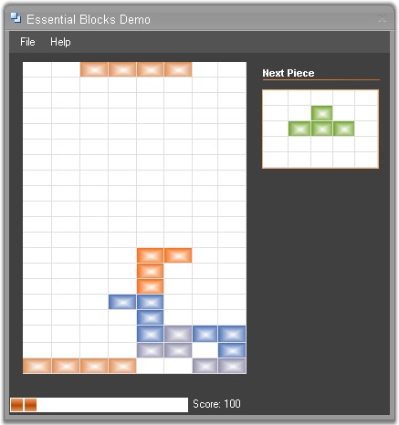

::: {style="DISPLAY: none"}
{#d2h_url_template}{#d2h_package_url style="WIDTH: 0px; DISPLAY: none; HEIGHT: 0px"}
:::

::: {.d2h_secondary_topic style="PADDING-BOTTOM: 10pt; MARGIN: 0pt; PADDING-LEFT: 0pt; PADDING-RIGHT: 0pt; PADDING-TOP: 0pt"}
##### Gaming Applications {#gaming-applications style="tab-stops: 0pt"}

[]{style="FONT-FAMILY: 'Trebuchet MS','sans-serif'; COLOR: #15428b; FONT-SIZE: 9pt"} 

Essential Grid is used to implement gaming applications.

 

**Example**

 

Let us consider the Tetris game application which is implemented by using Essential Grid. This game application makes use of arrow keys to move the blocks and change the block shape. It also provides an option to display the next block.

[]{style="FONT-FAMILY: 'Trebuchet MS','sans-serif'; COLOR: #15428b; FONT-SIZE: 9pt"} 

{border="0"}

[]{style="FONT-FAMILY: 'Trebuchet MS','sans-serif'; COLOR: #15428b; FONT-SIZE: 9pt"} 

*[Figure ]{style="FONT-SIZE: 9pt"}[190]{style="FONT-SIZE: 9pt"}[: Tetris game implemented by using Grid]{style="FONT-SIZE: 9pt"}*

 

A sample demonstrating this feature is available under the following sample installation path.

 

***\<Install Location\>\\Syncfusion\\EssentialStudio\\\[Version Number\]\\Windows\\Grid.Windows\\Samples\\2.0\\Product Showcase\\Essential Blocks Demo***

 

[]{#p347} 

 

[]{#related-topics}
:::
