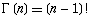
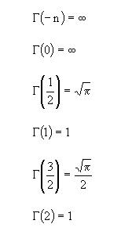

::: {style="DISPLAY: none"}
{#d2h_url_template}{#d2h_package_url style="WIDTH: 0px; DISPLAY: none; HEIGHT: 0px"}
:::

:::: {.d2h_secondary_topic style="PADDING-BOTTOM: 10pt; MARGIN: 0pt; PADDING-LEFT: 0pt; PADDING-RIGHT: 0pt; PADDING-TOP: 0pt"}
#### Gamma Function {#gamma-function style="tab-stops: 0pt"}

 

The Gamma Function is an attempt to generalize the [factorial]{.UGHyperlink} function to real and complex numbers. It is related to the factorial function by

 

{border="0"}

 

The Gamma Function

 

For a complex number x with a positive real part, the function can be given by

[]{style="COLOR: black"} 

{border="0"}

 

Special Values of gamma function

 

{border="0"}

 

Using the Formula

 

The Gamma function is calculated using the **Statistics.UtilityFunctions** class. The following table describes the parameters and the return value of the gamma function.

 

::: {align="center"}
  ------------- ------------------------------------------------------- ----------------------------------------------------
  Method Name   Parameters                                              Return Value
  Gamma         **p**: a value for which the gamma value is required.   A double that represents the gamma function value.
  ------------- ------------------------------------------------------- ----------------------------------------------------
:::

 

Example

 

Here is a code snippet that shows a sample usage.

 

+-----------------------------------------------------------------------------------------------------------------------------------------------------------+
| **[\[C#\]]{style="FONT-FAMILY: 'Courier New'; COLOR: black"}**                                                                                            |
|                                                                                                                                                           |
| **[]{style="FONT-FAMILY: 'Courier New'; COLOR: black"}**                                                                                                  |
|                                                                                                                                                           |
| [using Syncfusion.Windows.Forms.Chart.Statistics;]{style="FONT-FAMILY: 'Courier New'; COLOR: black"}                                                      |
|                                                                                                                                                           |
| [double]{style="FONT-FAMILY: 'Courier New'; COLOR: blue"}[ x = Statistics.UtilityFunctions.Gamma( p );]{style="FONT-FAMILY: 'Courier New'; COLOR: black"} |
+-----------------------------------------------------------------------------------------------------------------------------------------------------------+

 

+----------------------------------------------------------------------------------------------------------------------------------------------------------+
| **[\[VB.NET\]]{style="FONT-FAMILY: 'Courier New'; COLOR: black"}**                                                                                       |
|                                                                                                                                                          |
| **[]{style="FONT-FAMILY: 'Courier New'; COLOR: black"}**                                                                                                 |
|                                                                                                                                                          |
| [Imports Syncfusion.Windows.Forms.Chart.Statistics]{style="FONT-FAMILY: 'Courier New'; COLOR: black"}                                                    |
|                                                                                                                                                          |
| [double]{style="FONT-FAMILY: 'Courier New'; COLOR: blue"}[ x = Statistics.UtilityFunctions.Gamma( p )]{style="FONT-FAMILY: 'Courier New'; COLOR: black"} |
+----------------------------------------------------------------------------------------------------------------------------------------------------------+

 

[]{#p239} 

[]{#related-topics}
::::
