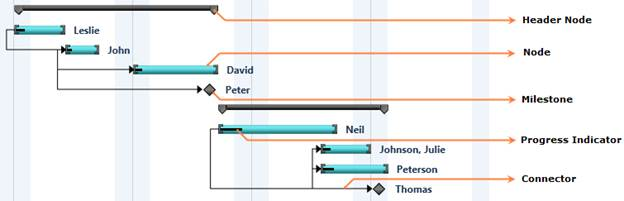

::: {style="DISPLAY: none"}
{#d2h_url_template}{#d2h_package_url style="WIDTH: 0px; DISPLAY: none; HEIGHT: 0px"}
:::

::::: {#nsbanner .d2h_main_nsbanner style="BORDER-BOTTOM: #999999 1px solid; POSITION: relative; PADDING-BOTTOM: 0px; BACKGROUND-COLOR: transparent; PADDING-LEFT: 0px; PADDING-RIGHT: 0px; DISPLAY: none; BORDER-TOP: #999999 1px solid; PADDING-TOP: 0px; LEFT: 0px"}
:::: {#TitleRow .d2h_main_titlerow style="PADDING-BOTTOM: 4px; BACKGROUND-COLOR: transparent; PADDING-LEFT: 22px; WIDTH: 100%; PADDING-RIGHT: 10px; DISPLAY: none; PADDING-TOP: 4px"}
::: {#ienav .d2h_main_ienav style="DISPLAY: none"}
{#D2HPrevious .D2HPreviousEnabled}  {#D2HNext .D2HNextEnabled}
:::
::::
:::::

:::: {#nstext .d2h_main_nstext style="PADDING-BOTTOM: 10px; BACKGROUND-COLOR: transparent; PADDING-LEFT: 22px; PADDING-RIGHT: 10px; HEIGHT: 100%; OVERFLOW: auto; PADDING-TOP: 5px" hasuserbackground="true" valign="bottom"}
::: {#d2h_breadcrumbs .d2h_breadcrumbs}
[Essential Studio User Guide Documentation](ms-xhelp:///?Id=12457748-09e3-4d74-a240-8e049cedf030){.d2h_breadcrumbsNormal}[ \> ]{.d2h_breadcrumbsLinkSeparator}[User Interface Edition](ms-xhelp:///?Id=c29296b7-531c-413b-a0ec-488ca1f7f669){.d2h_breadcrumbsNormal}[ \> ]{.d2h_breadcrumbsLinkSeparator}[Essential Silverlight](ms-xhelp:///?Id=66221bd1-ba2e-43c2-94a7-618f50e01d24){.d2h_breadcrumbsNormal}[ \> ]{.d2h_breadcrumbsLinkSeparator}[Essential Gantt]{.d2h_breadcrumbsContentsOnly}[ \> ]{.d2h_breadcrumbsLinkSeparator}[Getting Started](ms-xhelp:///?Id=35f72cf8-9b12-4131-ab30-00a5a199c143){.d2h_breadcrumbsNormal}[ \> ]{.d2h_breadcrumbsLinkSeparator}[Appearance and Structure of Gantt](ms-xhelp:///?Id=a51e9739-758b-4256-a7f7-ebb646e055d1){.d2h_breadcrumbsNormal}
:::

### Gantt Chart {#gantt-chart style="tab-stops: 0pt"}

Gantt Chart is an items control which provides a graphically representation of the task/activitiy that are currently scheduled. Gantt Chart have different componenets to represent the type of Task, Progress of the Task and Relationship between Tasks.

[]{style="FONT-FAMILY: 'Trebuchet MS','sans-serif'; COLOR: #4f6228; FONT-SIZE: 9pt"} 

{border="0"}

Figure 9: Gantt Chart

 

[·      ]{style="FONT-FAMILY: Symbol"}**Node** -- Node represents an individual or child task.

[·      ]{style="FONT-FAMILY: Symbol"}**Header Node --** Header Node represents the parent or summary task of the projects.

[·      ]{style="FONT-FAMILY: Symbol"}**Milestone --** Milestone represents the target to be completed in a day.

[·      ]{style="FONT-FAMILY: Symbol"}**Progress Indicator --** Progress indicator represents the persentage of work completed for the task.

[·      ]{style="FONT-FAMILY: Symbol"}**Connector -**  Connector represents the dependency relationship between the tasks.

[]{#related-topics}
::::
