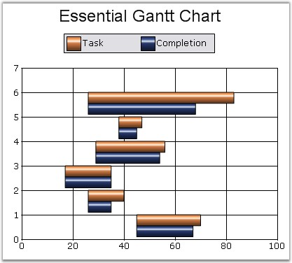
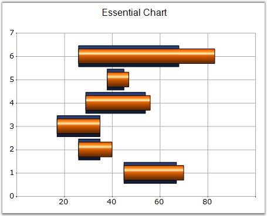

::: {style="DISPLAY: none"}
{#d2h_url_template}{#d2h_package_url style="WIDTH: 0px; DISPLAY: none; HEIGHT: 0px"}
:::

:::: {.d2h_secondary_topic style="PADDING-BOTTOM: 10pt; MARGIN: 0pt; PADDING-LEFT: 0pt; PADDING-RIGHT: 0pt; PADDING-TOP: 0pt"}
#### GanttDrawMode {#ganttdrawmode style="tab-stops: 0pt"}

[]{style="FONT-FAMILY: 'Trebuchet MS','sans-serif'; FONT-SIZE: 9pt"} 

Specifies the drawing mode of Gantt chart.

[]{style="FONT-FAMILY: 'Trebuchet MS','sans-serif'; FONT-SIZE: 9pt"} 

::: {align="center"}
+---------------------------------------+-------------------------------------------------------------+
| **[]{style="FONT-FAMILY: 'Trebuchet MS','sans-serif'; FONT-SIZE: 9pt"}**                            |
|                                                                                                     |
| Details                                                                                             |
+---------------------------------------+-------------------------------------------------------------+
| Possible Values                       | AutoSizeMode - Plots the Gantt Chart side by side.          |
|                                       |                                                             |
|                                       | CustomPointWidthMode - Plots the Gantt Chart as Overlapped. |
+---------------------------------------+-------------------------------------------------------------+
| Default Value                         | CustomPointWidthMode                                        |
+---------------------------------------+-------------------------------------------------------------+
| 2D / 3D Limitations                   | None                                                        |
+---------------------------------------+-------------------------------------------------------------+
| Applies to Chart Element              | All series                                                  |
+---------------------------------------+-------------------------------------------------------------+
| Applies to Chart Types                | Gantt Chart                                                 |
+---------------------------------------+-------------------------------------------------------------+
:::

**[]{style="FONT-FAMILY: 'Trebuchet MS','sans-serif'; FONT-SIZE: 9pt"}** 

Here is some sample code.

[]{style="FONT-FAMILY: 'Trebuchet MS','sans-serif'; FONT-SIZE: 9pt"} 

+------------------------------------------------------------------------------------------------------------------------------------------------------------------------------------------------------------+
| **[\[C#\]]{style="FONT-FAMILY: 'Courier New'; COLOR: black"}**                                                                                                                                             |
|                                                                                                                                                                                                            |
| **[]{style="FONT-FAMILY: 'Courier New'; COLOR: black"}**                                                                                                                                                   |
|                                                                                                                                                                                                            |
| **[ ]{style="FONT-FAMILY: 'Courier New'; COLOR: black"}**[// Specifies GenttDrawMode as CustomPointWidthMode]{style="FONT-FAMILY: 'Courier New'; COLOR: green"}                                            |
|                                                                                                                                                                                                            |
| [this]{style="FONT-FAMILY: 'Courier New'; COLOR: blue"}[.ChartWebControl1.Series\[0\].GanttDrawMode = [ChartGanttDrawMode]{style="COLOR: teal"}.CustomPointWidthMode;]{style="FONT-FAMILY: 'Courier New'"} |
|                                                                                                                                                                                                            |
| [this]{style="FONT-FAMILY: 'Courier New'; COLOR: blue"}[.ChartWebControl1.Series\[0\].Style.PointWidth = 0.7f;]{style="FONT-FAMILY: 'Courier New'"}                                                        |
|                                                                                                                                                                                                            |
| [this]{style="FONT-FAMILY: 'Courier New'; COLOR: blue"}[.ChartWebControl1.Series\[1\].GanttDrawMode = [ChartGanttDrawMode]{style="COLOR: teal"}.CustomPointWidthMode;]{style="FONT-FAMILY: 'Courier New'"} |
|                                                                                                                                                                                                            |
| [this]{style="FONT-FAMILY: 'Courier New'; COLOR: blue"}[.ChartWebControl1.Series\[1\].Style.PointWidth = 1f;]{style="FONT-FAMILY: 'Courier New'"}                                                          |
+------------------------------------------------------------------------------------------------------------------------------------------------------------------------------------------------------------+

[]{style="FONT-FAMILY: 'Trebuchet MS','sans-serif'; FONT-SIZE: 9pt"} 

+-------------------------------------------------------------------------------------------------------------------------------------------------------------------------------------------------------+
| **[\[VB.NET\]]{style="FONT-FAMILY: 'Courier New'; COLOR: black"}**                                                                                                                                    |
|                                                                                                                                                                                                       |
| **[]{style="FONT-FAMILY: 'Courier New'; COLOR: black"}**                                                                                                                                              |
|                                                                                                                                                                                                       |
| [\' Specifies GenttDrawMode as CustomPointWidthMode]{style="FONT-FAMILY: 'Courier New'; COLOR: green"}                                                                                                |
|                                                                                                                                                                                                       |
| [Me]{style="FONT-FAMILY: 'Courier New'; COLOR: blue"}[.ChartWebControl1.Series(0).GanttDrawMode = [ChartGanttDrawMode]{style="COLOR: teal"}.CustomPointWidthMode]{style="FONT-FAMILY: 'Courier New'"} |
|                                                                                                                                                                                                       |
| [Me]{style="FONT-FAMILY: 'Courier New'; COLOR: blue"}[.ChartWebControl1.Series(0).Style.PointWidth = 0.7f]{style="FONT-FAMILY: 'Courier New'"}                                                        |
|                                                                                                                                                                                                       |
| [Me]{style="FONT-FAMILY: 'Courier New'; COLOR: blue"}[.ChartWebControl1.Series(1).GanttDrawMode = ChartGanttDrawMode.CustomPointWidthMode]{style="FONT-FAMILY: 'Courier New'"}                        |
|                                                                                                                                                                                                       |
| [Me]{style="FONT-FAMILY: 'Courier New'; COLOR: blue"}[.ChartWebControl1.Series(1).Style.PointWidth = 1f]{style="FONT-FAMILY: 'Courier New'"}                                                          |
+-------------------------------------------------------------------------------------------------------------------------------------------------------------------------------------------------------+

**[]{style="FONT-FAMILY: 'Trebuchet MS','sans-serif'; FONT-SIZE: 9pt"}** 

+----------------------------------------------------------------------------------------------------------------------------------------------------------------------------------------------------+
| **[\[C#\]]{style="FONT-FAMILY: 'Courier New'; COLOR: black"}**                                                                                                                                     |
|                                                                                                                                                                                                    |
| **[]{style="FONT-FAMILY: 'Courier New'; COLOR: black"}**                                                                                                                                           |
|                                                                                                                                                                                                    |
| [// Specifies GenttDrawMode as AutoSizeMode]{style="FONT-FAMILY: 'Courier New'; COLOR: green"}                                                                                                     |
|                                                                                                                                                                                                    |
| [this]{style="FONT-FAMILY: 'Courier New'; COLOR: blue"}[.ChartWebControl1.Series\[0\].GanttDrawMode = [ChartGanttDrawMode]{style="COLOR: teal"}.AutoSizeMode;]{style="FONT-FAMILY: 'Courier New'"} |
|                                                                                                                                                                                                    |
| [this]{style="FONT-FAMILY: 'Courier New'; COLOR: blue"}[.ChartWebControl1.Series\[1\].GanttDrawMode = [ChartGanttDrawMode]{style="COLOR: teal"}.AutoSizeMode;]{style="FONT-FAMILY: 'Courier New'"} |
+----------------------------------------------------------------------------------------------------------------------------------------------------------------------------------------------------+

[]{style="FONT-FAMILY: 'Trebuchet MS','sans-serif'; FONT-SIZE: 9pt"} 

+-----------------------------------------------------------------------------------------------------------------------------------------------------------------------------------------------+
| **[\[VB.NET\]]{style="FONT-FAMILY: 'Courier New'; COLOR: black"}**                                                                                                                            |
|                                                                                                                                                                                               |
| **[]{style="FONT-FAMILY: 'Courier New'; COLOR: black"}**                                                                                                                                      |
|                                                                                                                                                                                               |
| [\' Specifies GenttDrawMode as AutoSizeMode]{style="FONT-FAMILY: 'Courier New'; COLOR: green"}                                                                                                |
|                                                                                                                                                                                               |
| [Me]{style="FONT-FAMILY: 'Courier New'; COLOR: blue"}[.ChartWebControl1.Series(0).GanttDrawMode = [ChartGanttDrawMode]{style="COLOR: teal"}.AutoSizeMode]{style="FONT-FAMILY: 'Courier New'"} |
|                                                                                                                                                                                               |
| [Me]{style="FONT-FAMILY: 'Courier New'; COLOR: blue"}[.ChartWebControl1.Series(1).GanttDrawMode = [ChartGanttDrawMode]{style="COLOR: teal"}.AutoSizeMode]{style="FONT-FAMILY: 'Courier New'"} |
+-----------------------------------------------------------------------------------------------------------------------------------------------------------------------------------------------+

**[]{style="FONT-FAMILY: 'Trebuchet MS','sans-serif'; FONT-SIZE: 9pt"}** 

{border="0"}

**[]{style="FONT-FAMILY: 'Trebuchet MS','sans-serif'; FONT-SIZE: 9pt"}** 

Figure 133: Gantt Chart with AutoSizeMode

**[]{style="FONT-FAMILY: 'Trebuchet MS','sans-serif'; FONT-SIZE: 9pt"}** 

{border="0"}

**[]{style="FONT-FAMILY: 'Trebuchet MS','sans-serif'; FONT-SIZE: 9pt"}** 

Figure 134: Gantt Chart with CustomPointWidthMode

**[]{style="FONT-FAMILY: 'Trebuchet MS','sans-serif'; FONT-SIZE: 9pt"}** 

See Also

[]{style="FONT-FAMILY: 'Trebuchet MS','sans-serif'; FONT-SIZE: 9pt"} 

[Gantt Chart]{.UGHyperlink}[]{.UGHyperlink}

[]{#p108} 

[]{#related-topics}
::::
