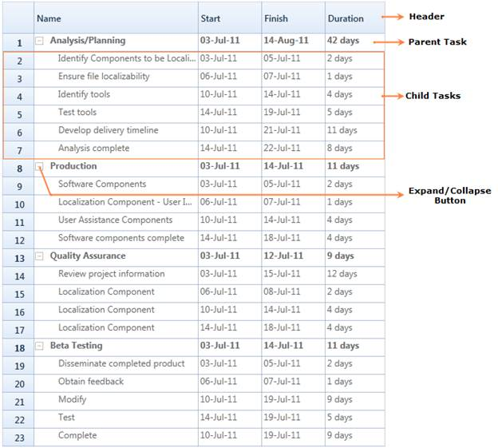

::: {style="DISPLAY: none"}
{#d2h_url_template}{#d2h_package_url style="WIDTH: 0px; DISPLAY: none; HEIGHT: 0px"}
:::

::::: {#nsbanner .d2h_main_nsbanner style="BORDER-BOTTOM: #999999 1px solid; POSITION: relative; PADDING-BOTTOM: 0px; BACKGROUND-COLOR: transparent; PADDING-LEFT: 0px; PADDING-RIGHT: 0px; DISPLAY: none; BORDER-TOP: #999999 1px solid; PADDING-TOP: 0px; LEFT: 0px"}
:::: {#TitleRow .d2h_main_titlerow style="PADDING-BOTTOM: 4px; BACKGROUND-COLOR: transparent; PADDING-LEFT: 22px; WIDTH: 100%; PADDING-RIGHT: 10px; DISPLAY: none; PADDING-TOP: 4px"}
::: {#ienav .d2h_main_ienav style="DISPLAY: none"}
{#D2HPrevious .D2HPreviousEnabled}  {#D2HNext .D2HNextEnabled}
:::
::::
:::::

:::: {#nstext .d2h_main_nstext style="PADDING-BOTTOM: 10px; BACKGROUND-COLOR: transparent; PADDING-LEFT: 22px; PADDING-RIGHT: 10px; HEIGHT: 100%; OVERFLOW: auto; PADDING-TOP: 5px" hasuserbackground="true" valign="bottom"}
::: {#d2h_breadcrumbs .d2h_breadcrumbs}
[Essential Studio User Guide Documentation](ms-xhelp:///?Id=12457748-09e3-4d74-a240-8e049cedf030){.d2h_breadcrumbsNormal}[ \> ]{.d2h_breadcrumbsLinkSeparator}[User Interface Edition](ms-xhelp:///?Id=c29296b7-531c-413b-a0ec-488ca1f7f669){.d2h_breadcrumbsNormal}[ \> ]{.d2h_breadcrumbsLinkSeparator}[Essential Silverlight](ms-xhelp:///?Id=66221bd1-ba2e-43c2-94a7-618f50e01d24){.d2h_breadcrumbsNormal}[ \> ]{.d2h_breadcrumbsLinkSeparator}[Essential Gantt]{.d2h_breadcrumbsContentsOnly}[ \> ]{.d2h_breadcrumbsLinkSeparator}[Getting Started](ms-xhelp:///?Id=35f72cf8-9b12-4131-ab30-00a5a199c143){.d2h_breadcrumbsNormal}[ \> ]{.d2h_breadcrumbsLinkSeparator}[Appearance and Structure of Gantt](ms-xhelp:///?Id=a51e9739-758b-4256-a7f7-ebb646e055d1){.d2h_breadcrumbsNormal}
:::

### Gantt Grid {#gantt-grid style="tab-stops: 0pt"}

Gantt Grid is a table view control which displays the scheduled tasks/activities of the project with its hierarchy. You can edit the fields of the bounded tasks using this grid.

{border="0"}

Figure 8: Gantt Grid

 

[·      ]{style="FONT-FAMILY: Symbol"}**Header --** Header represents the table header which contains the field name of the task.

[·      ]{style="FONT-FAMILY: Symbol"}**Parent Task --** Parent task represents the summary of the child tasks. This is an activity which will be further splitted into various child tasks.

[·      ]{style="FONT-FAMILY: Symbol"}**Child Task --** Child task reprents an individual task. This contains only the information about the specific task. The Child task is a part of parent task.

[·      ]{style="FONT-FAMILY: Symbol"}**Expand/Collapse Button** -- Expand/Collapse button allows you to expand or collapse the particular hierarchy.

[]{#related-topics}
::::
