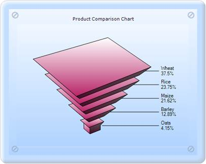

::: {style="DISPLAY: none"}
{#d2h_url_template}{#d2h_package_url style="WIDTH: 0px; DISPLAY: none; HEIGHT: 0px"}
:::

:::: {.d2h_secondary_topic style="PADDING-BOTTOM: 10pt; MARGIN: 0pt; PADDING-LEFT: 0pt; PADDING-RIGHT: 0pt; PADDING-TOP: 0pt"}
##### GapRatio {#gapratio style="tab-stops: 0pt"}

GapRatio gets or sets the gap size between the Funnel chart or Pyramid chart segments. The default value is 0.0. The maximum gap size is limited by the number of points.

::: {align="center"}
+------------------------------+---------------------------------+
| Details                                                        |
+------------------------------+---------------------------------+
| Possible values              | Ranges from 0.0.                |
+------------------------------+---------------------------------+
| Default value                | 0                               |
+------------------------------+---------------------------------+
| 2D/3D limitations            | No                              |
+------------------------------+---------------------------------+
| Application to chart element | All series                      |
+------------------------------+---------------------------------+
| Application to chart types   | Funnel chart and Pyramid chart. |
+------------------------------+---------------------------------+
:::

[]{style="FONT-FAMILY: 'Times New Roman','serif'; FONT-SIZE: 12pt"} 

Funnel[ ]{style="FONT-FAMILY: 'Times New Roman','serif'; FONT-SIZE: 12pt"}Chart[:]{style="FONT-FAMILY: 'Times New Roman','serif'; FONT-SIZE: 12pt"}

**[]{style="FONT-FAMILY: 'Calibri','sans-serif'"}** 

{border="0"}

Figure 223: 3D Funnel chart with Gap ratio 0.2

**[]{style="FONT-FAMILY: 'Calibri','sans-serif'"}** 

Pyramid Chart:

{border="0"}

Figure 224: 3D Pyramid chart with Gap ratio 0.2

[]{#related-topics}
::::
