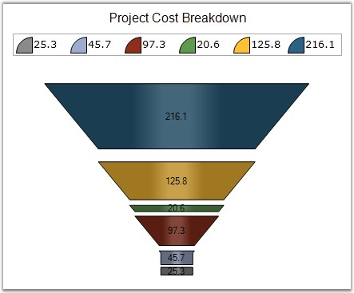
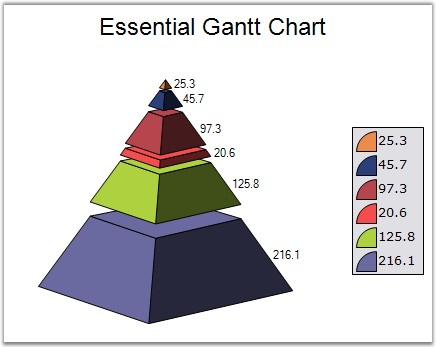

::: {style="DISPLAY: none"}
{#d2h_url_template}{#d2h_package_url style="WIDTH: 0px; DISPLAY: none; HEIGHT: 0px"}
:::

:::: {.d2h_secondary_topic style="PADDING-BOTTOM: 10pt; MARGIN: 0pt; PADDING-LEFT: 0pt; PADDING-RIGHT: 0pt; PADDING-TOP: 0pt"}
#### GapRatio {#gapratio style="tab-stops: 0pt"}

 

Gets or sets the gap size between funnel chart or pyramid chart segments. Default value is 0.0. The maximum gap size is limited by the number of points.

 

::: {align="center"}
+------------------------------+-----------------------------+
| Details                                                    |
+------------------------------+-----------------------------+
| **Possible Values**          | Ranges from 0.0             |
+------------------------------+-----------------------------+
| **Default Value    **        | **0**                       |
+------------------------------+-----------------------------+
| **2D / 3D Limitations**      | No                          |
+------------------------------+-----------------------------+
| **Applies to Chart Element** | All series                  |
+------------------------------+-----------------------------+
| **Applies to Chart Types**   | Funnel Chart, Pyramid Chart |
+------------------------------+-----------------------------+
:::

 

Here is some sample code.

 

+------------------------------------------------------------------------------------------------------------------------------------------------------------------+
| **[\[C#\]]{style="FONT-FAMILY: 'Courier New'; COLOR: black"}**                                                                                                   |
|                                                                                                                                                                  |
| **[]{style="FONT-FAMILY: 'Courier New'; COLOR: black"}**                                                                                                         |
|                                                                                                                                                                  |
| [// Setting GapRatio for Funnel Chart]{style="FONT-FAMILY: 'Courier New'; COLOR: green"}                                                                         |
|                                                                                                                                                                  |
| [this]{style="FONT-FAMILY: 'Courier New'; COLOR: blue"}[.chartControl1.Series\[0\].ConfigItems.FunnelItem.GapRatio = 0.1f;]{style="FONT-FAMILY: 'Courier New'"}  |
|                                                                                                                                                                  |
| []{style="FONT-FAMILY: 'Courier New'"}                                                                                                                           |
|                                                                                                                                                                  |
| [// Setting GapRatio for Pyramid Chart]{style="FONT-FAMILY: 'Courier New'; COLOR: green"}                                                                        |
|                                                                                                                                                                  |
| [this]{style="FONT-FAMILY: 'Courier New'; COLOR: blue"}[.chartControl1.Series\[0\].ConfigItems.PyramidItem.GapRatio = 0.1f;]{style="FONT-FAMILY: 'Courier New'"} |
+------------------------------------------------------------------------------------------------------------------------------------------------------------------+

 

+-------------------------------------------------------------------------------------------------------------------------------------------------------------+
| **[\[VB.NET\]]{style="FONT-FAMILY: 'Courier New'; COLOR: black"}**                                                                                          |
|                                                                                                                                                             |
| **[]{style="FONT-FAMILY: 'Courier New'; COLOR: black"}**                                                                                                    |
|                                                                                                                                                             |
| [\' Setting GapRatio for Funnel Chart]{style="FONT-FAMILY: 'Courier New'; COLOR: green"}                                                                    |
|                                                                                                                                                             |
| [Me]{style="FONT-FAMILY: 'Courier New'; COLOR: blue"}[.chartControl1.Series(0).ConfigItems.FunnelItem.GapRatio = 0.1f]{style="FONT-FAMILY: 'Courier New'"}  |
|                                                                                                                                                             |
| []{style="FONT-FAMILY: 'Courier New'"}                                                                                                                      |
|                                                                                                                                                             |
| [\' Setting GapRatio for Pyramid Chart]{style="FONT-FAMILY: 'Courier New'; COLOR: green"}                                                                   |
|                                                                                                                                                             |
| [Me]{style="FONT-FAMILY: 'Courier New'; COLOR: blue"}[.chartControl1.Series(0).ConfigItems.PyramidItem.GapRatio = 0.1f]{style="FONT-FAMILY: 'Courier New'"} |
+-------------------------------------------------------------------------------------------------------------------------------------------------------------+

 

{border="0"}

 

Figure 140: Funnel chart with 0.1 GapRatio

 

   {border="0"}

 

Figure 141: Pyramid chart with 0.1 GapRatio

 

See Also

 

[Pyramid Chart]{.UGHyperlink}, [Funnel Chart]{.UGHyperlink}[]{style="COLOR: black"}

 

[]{#p108} 

[]{#related-topics}
::::
