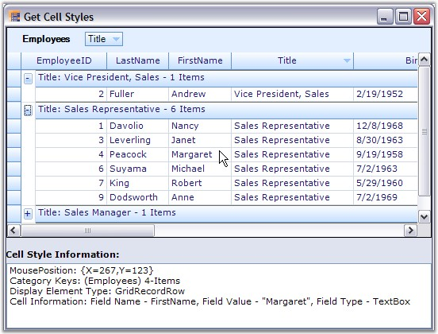

::: {style="DISPLAY: none"}
{#d2h_url_template}{#d2h_package_url style="WIDTH: 0px; DISPLAY: none; HEIGHT: 0px"}
:::

::::: {.d2h_secondary_topic style="PADDING-BOTTOM: 10pt; MARGIN: 0pt; PADDING-LEFT: 0pt; PADDING-RIGHT: 0pt; PADDING-TOP: 0pt"}
##### Get Cell Styles {#get-cell-styles style="tab-stops: 0pt"}

[]{style="FONT-FAMILY: 'Trebuchet MS','sans-serif'; COLOR: #15428b; FONT-SIZE: 9pt"} 

This topic elaborates the way of retrieving the style information of grid cells. On a mouse hit, when you want to retrieve the content of underlying cells and also its style information, it is good to use the **PointToTableCellStyle** method on the instances of the Grid Table control.

 

**PointToTableCellStyleInfo Method**

[]{style="COLOR: #4a5c8c"} 

For any given point on the grid, this method will return the style information of the underlying cell that is displayed under that point. If the underlying cell belongs to a nested table, then style information is returned for the cell inside the nested table. The details of this method are given below.

[]{style="FONT-FAMILY: 'Trebuchet MS','sans-serif'; COLOR: #15428b; FONT-SIZE: 9pt"} 

::: {align="center"}
  ----------------------- ----------------------------------------------------------------------------------------------------------- -----------------------------------------------------------------------------------------------
  Method Name             Parameter                                                                                                   Return Value
  PointToTableCellStyle   ptClient: A type of System.Drawing Point object that represents the mouse position in client coordinates.   A GridTableCellStyleInfo object that stores the stye information of the underlying grid cell.
  ----------------------- ----------------------------------------------------------------------------------------------------------- -----------------------------------------------------------------------------------------------
:::

[]{style="FONT-FAMILY: 'Trebuchet MS','sans-serif'; COLOR: #15428b; FONT-SIZE: 9pt"} 

[]{style="FONT-FAMILY: 'Trebuchet MS','sans-serif'; COLOR: #15428b; FONT-SIZE: 9pt"} 

Implementation

 

The implementation of this method is a two-step process.

[]{style="FONT-FAMILY: 'Trebuchet MS','sans-serif'; COLOR: #15428b; FONT-SIZE: 9pt"} 

1.   As a first step, it gets the corresponding nested display element that is displayed at the given mouse position. This can be performed easily by employing the **PointToNestedDisplayElement** method. This method is explained later in this chapter.

2.  

3.   Once the display element is retrieved, the style information of the corresponding cell can be got by using the **Table.GetTableCellStyleInfo** method which will return a cell style information given its row and column indices.

[]{style="FONT-FAMILY: 'Trebuchet MS','sans-serif'; COLOR: #15428b; FONT-SIZE: 9pt"} 

PointToNestedDisplayElement Method

[]{style="FONT-FAMILY: 'Verdana','sans-serif'; FONT-SIZE: 8pt"} 

This method returns the nested display element that is displayed at the given mouse position. The details are given below.

[]{style="FONT-FAMILY: 'Trebuchet MS','sans-serif'; COLOR: #15428b; FONT-SIZE: 9pt"} 

::: {align="center"}
  ----------------------------- ----------------------------------------------------------------------------------------------------------- -------------------------------------------------------------------
  Method Name                   Parameter                                                                                                   Return Value
  PointToNestedDisplayElement   ptClient: A type of System.Drawing Point object that represents the mouse position in client coordinates.   An Element object that represents the underlying display element.
  ----------------------------- ----------------------------------------------------------------------------------------------------------- -------------------------------------------------------------------
:::

[]{style="FONT-FAMILY: 'Trebuchet MS','sans-serif'; COLOR: #15428b; FONT-SIZE: 9pt"} 

Example

[]{style="FONT-FAMILY: 'Verdana','sans-serif'; FONT-SIZE: 8pt"} 

Below is an example that demonstrates how to use PointToTableCellStyle method to retrieve the cell style information. This example handles a MouseMove handler of the Grid Table Control, retrieves the cell content using the above given method and then writes the content to a listbox control.

[]{style="FONT-FAMILY: 'Trebuchet MS','sans-serif'; COLOR: #15428b; FONT-SIZE: 9pt"} 

1.   Setup a Grouping Grid and bind it to a dataset. Handle TableControl.MouseMove event to let the user get the cell style information printed while hovering the mouse over the grid cells. Once you have the style, you can check Style.TableCellIdentity for information about the cell such as its column, underlying record, parent table, and so on.

[]{style="FONT-FAMILY: 'Trebuchet MS','sans-serif'; COLOR: #15428b; FONT-SIZE: 9pt"} 

+-----------------------------------------------------------------------------------------------------------------------------------------------------------------------------------------------------------------------------------------------------------------------------------------------------------+
| **[\[C#\]]{style="FONT-FAMILY: 'Courier New'; COLOR: black"}**                                                                                                                                                                                                                                            |
|                                                                                                                                                                                                                                                                                                           |
| []{style="FONT-FAMILY: 'Courier New'; COLOR: black"}                                                                                                                                                                                                                                                      |
|                                                                                                                                                                                                                                                                                                           |
| [private]{style="FONT-FAMILY: 'Courier New'; COLOR: blue"}[ [void]{style="COLOR: blue"} TableControl_MouseMove([object]{style="COLOR: blue"} sender, [MouseEventArgs]{style="COLOR: #2b91af"} e)]{style="FONT-FAMILY: 'Courier New'"}                                                                     |
|                                                                                                                                                                                                                                                                                                           |
| [{]{style="FONT-FAMILY: 'Courier New'"}                                                                                                                                                                                                                                                                   |
|                                                                                                                                                                                                                                                                                                           |
| [    [Point]{style="COLOR: #2b91af"} ptClient = [new]{style="COLOR: blue"} [Point]{style="COLOR: #2b91af"}(e.X, e.Y);]{style="FONT-FAMILY: 'Courier New'"}                                                                                                                                                |
|                                                                                                                                                                                                                                                                                                           |
| [    [GridTableControl]{style="COLOR: #2b91af"} tableControl = [this]{style="COLOR: blue"}.groupingGrid1.TableControl;]{style="FONT-FAMILY: 'Courier New'"}                                                                                                                                               |
|                                                                                                                                                                                                                                                                                                           |
| []{style="FONT-FAMILY: 'Courier New'"}                                                                                                                                                                                                                                                                    |
|                                                                                                                                                                                                                                                                                                           |
| [    [GridTableCellStyleInfo]{style="COLOR: #2b91af"} style = tableControl.PointToTableCellStyle(ptClient);]{style="FONT-FAMILY: 'Courier New'"}                                                                                                                                                          |
|                                                                                                                                                                                                                                                                                                           |
| [    [Element]{style="COLOR: #2b91af"} displayElement = style.TableCellIdentity.DisplayElement;]{style="FONT-FAMILY: 'Courier New'"}                                                                                                                                                                      |
|                                                                                                                                                                                                                                                                                                           |
| [    [string]{style="COLOR: blue"} info = [\"\"]{style="COLOR: #a31515"};]{style="FONT-FAMILY: 'Courier New'"}                                                                                                                                                                                            |
|                                                                                                                                                                                                                                                                                                           |
| []{style="FONT-FAMILY: 'Courier New'"}                                                                                                                                                                                                                                                                    |
|                                                                                                                                                                                                                                                                                                           |
| [    [if]{style="COLOR: blue"} (style != [null]{style="COLOR: blue"})]{style="FONT-FAMILY: 'Courier New'"}                                                                                                                                                                                                |
|                                                                                                                                                                                                                                                                                                           |
| [    {]{style="FONT-FAMILY: 'Courier New'"}                                                                                                                                                                                                                                                               |
|                                                                                                                                                                                                                                                                                                           |
| [        [if]{style="COLOR: blue"} (style.TableCellIdentity.Column != [null]{style="COLOR: blue"})]{style="FONT-FAMILY: 'Courier New'"}                                                                                                                                                                   |
|                                                                                                                                                                                                                                                                                                           |
| [            info = [\"Field Name - \"]{style="COLOR: #a31515"}+style.TableCellIdentity.Column.Name + [\", Field Value - \\\"\"]{style="COLOR: #a31515"} + style.CellValue.ToString() + [\"\\\", Field Type - \"]{style="COLOR: #a31515"}+style.CellType.ToString();]{style="FONT-FAMILY: 'Courier New'"} |
|                                                                                                                                                                                                                                                                                                           |
| [        [else]{style="COLOR: blue"}]{style="FONT-FAMILY: 'Courier New'"}                                                                                                                                                                                                                                 |
|                                                                                                                                                                                                                                                                                                           |
| [            info = style.TableCellIdentity.ToString();]{style="FONT-FAMILY: 'Courier New'"}                                                                                                                                                                                                              |
|                                                                                                                                                                                                                                                                                                           |
| [    }]{style="FONT-FAMILY: 'Courier New'"}                                                                                                                                                                                                                                                               |
|                                                                                                                                                                                                                                                                                                           |
| []{style="FONT-FAMILY: 'Courier New'"}                                                                                                                                                                                                                                                                    |
|                                                                                                                                                                                                                                                                                                           |
| [    listBox1.Items.Clear();]{style="FONT-FAMILY: 'Courier New'"}                                                                                                                                                                                                                                         |
|                                                                                                                                                                                                                                                                                                           |
| [    listBox1.Items.Add([\"MousePosition: \"]{style="COLOR: #a31515"} + ptClient.ToString());]{style="FONT-FAMILY: 'Courier New'"}                                                                                                                                                                        |
|                                                                                                                                                                                                                                                                                                           |
| [    listBox1.Items.Add([\"Category Keys: \"]{style="COLOR: #a31515"} + displayElement.ParentChildTable.CategoriesToString());]{style="FONT-FAMILY: 'Courier New'"}                                                                                                                                       |
|                                                                                                                                                                                                                                                                                                           |
| [    listBox1.Items.Add([\"Display Element Type: \"]{style="COLOR: #a31515"} + displayElement.GetType().Name);]{style="FONT-FAMILY: 'Courier New'"}                                                                                                                                                       |
|                                                                                                                                                                                                                                                                                                           |
| [    listBox1.Items.Add([\"Cell Information: \"]{style="COLOR: #a31515"} + info);]{style="FONT-FAMILY: 'Courier New'"}                                                                                                                                                                                    |
|                                                                                                                                                                                                                                                                                                           |
| [}]{style="FONT-FAMILY: 'Courier New'"}                                                                                                                                                                                                                                                                   |
+-----------------------------------------------------------------------------------------------------------------------------------------------------------------------------------------------------------------------------------------------------------------------------------------------------------+

[]{style="FONT-FAMILY: 'Trebuchet MS','sans-serif'; COLOR: #15428b; FONT-SIZE: 9pt"} 

+--------------------------------------------------------------------------------------------------------------------------------------------------------------------------------------------------------------------------------------------------------------------------------------------------------------------------+
| **[\[VB.NET\]]{style="FONT-FAMILY: 'Courier New'; COLOR: black"}**                                                                                                                                                                                                                                                       |
|                                                                                                                                                                                                                                                                                                                          |
| []{style="FONT-FAMILY: 'Courier New'; COLOR: black"}                                                                                                                                                                                                                                                                     |
|                                                                                                                                                                                                                                                                                                                          |
| [Private]{style="FONT-FAMILY: 'Courier New'; COLOR: blue"}[ [Sub]{style="COLOR: blue"} TableControl_MouseMove([ByVal]{style="COLOR: blue"} sender [As]{style="COLOR: blue"} [Object]{style="COLOR: blue"}, [ByVal]{style="COLOR: blue"} e [As]{style="COLOR: blue"} MouseEventArgs)]{style="FONT-FAMILY: 'Courier New'"} |
|                                                                                                                                                                                                                                                                                                                          |
| [Dim]{style="FONT-FAMILY: 'Courier New'; COLOR: blue"}[ ptClient [As]{style="COLOR: blue"} [New]{style="COLOR: blue"} Point(e.X, e.Y)]{style="FONT-FAMILY: 'Courier New'"}                                                                                                                                               |
|                                                                                                                                                                                                                                                                                                                          |
| [Dim]{style="FONT-FAMILY: 'Courier New'; COLOR: blue"}[ tableControl [As]{style="COLOR: blue"} GridTableControl = [Me]{style="COLOR: blue"}.groupingGrid1.TableControl]{style="FONT-FAMILY: 'Courier New'"}                                                                                                              |
|                                                                                                                                                                                                                                                                                                                          |
| []{style="FONT-FAMILY: 'Courier New'"}                                                                                                                                                                                                                                                                                   |
|                                                                                                                                                                                                                                                                                                                          |
| [Dim]{style="FONT-FAMILY: 'Courier New'; COLOR: blue"}[ style [As]{style="COLOR: blue"} GridTableCellStyleInfo = tableControl.PointToTableCellStyle(ptClient)]{style="FONT-FAMILY: 'Courier New'"}                                                                                                                       |
|                                                                                                                                                                                                                                                                                                                          |
| [Dim]{style="FONT-FAMILY: 'Courier New'; COLOR: blue"}[ displayElement [As]{style="COLOR: blue"} Element = style.TableCellIdentity.DisplayElement]{style="FONT-FAMILY: 'Courier New'"}                                                                                                                                   |
|                                                                                                                                                                                                                                                                                                                          |
| [Dim]{style="FONT-FAMILY: 'Courier New'; COLOR: blue"}[ info [As]{style="COLOR: blue"} [String]{style="COLOR: blue"} = [\"\"]{style="COLOR: #a31515"}]{style="FONT-FAMILY: 'Courier New'"}                                                                                                                               |
|                                                                                                                                                                                                                                                                                                                          |
| []{style="FONT-FAMILY: 'Courier New'; COLOR: #a31515"}                                                                                                                                                                                                                                                                   |
|                                                                                                                                                                                                                                                                                                                          |
| [If]{style="FONT-FAMILY: 'Courier New'; COLOR: blue"}[ [Not]{style="COLOR: blue"} (style [Is]{style="COLOR: blue"} [Nothing]{style="COLOR: blue"}) [Then]{style="COLOR: blue"}]{style="FONT-FAMILY: 'Courier New'"}                                                                                                      |
|                                                                                                                                                                                                                                                                                                                          |
| [If]{style="FONT-FAMILY: 'Courier New'; COLOR: blue"}[ [Not]{style="COLOR: blue"} (style.TableCellIdentity.Column [Is]{style="COLOR: blue"} [Nothing]{style="COLOR: blue"}) [Then]{style="COLOR: blue"}]{style="FONT-FAMILY: 'Courier New'"}                                                                             |
|                                                                                                                                                                                                                                                                                                                          |
| [info = [\"Field Name - \"]{style="COLOR: #a31515"} & style.TableCellIdentity.Column.Name & [\", Field Value - \"\"\"]{style="COLOR: #a31515"} & style.CellValue.ToString() & [\"\"\", Field Type - \"]{style="COLOR: #a31515"} & style.CellType.ToString()]{style="FONT-FAMILY: 'Courier New'"}                         |
|                                                                                                                                                                                                                                                                                                                          |
| [Else]{style="FONT-FAMILY: 'Courier New'; COLOR: blue"}                                                                                                                                                                                                                                                                  |
|                                                                                                                                                                                                                                                                                                                          |
| [info = style.TableCellIdentity.ToString()]{style="FONT-FAMILY: 'Courier New'"}                                                                                                                                                                                                                                          |
|                                                                                                                                                                                                                                                                                                                          |
| [End]{style="FONT-FAMILY: 'Courier New'; COLOR: blue"}[ [If]{style="COLOR: blue"}]{style="FONT-FAMILY: 'Courier New'"}                                                                                                                                                                                                   |
|                                                                                                                                                                                                                                                                                                                          |
| [End]{style="FONT-FAMILY: 'Courier New'; COLOR: blue"}[ [If]{style="COLOR: blue"}]{style="FONT-FAMILY: 'Courier New'"}                                                                                                                                                                                                   |
|                                                                                                                                                                                                                                                                                                                          |
| [listBox1.Items.Clear()]{style="FONT-FAMILY: 'Courier New'"}                                                                                                                                                                                                                                                             |
|                                                                                                                                                                                                                                                                                                                          |
| [listBox1.Items.Add([\"MousePosition: \"]{style="COLOR: #a31515"} & ptClient.ToString())]{style="FONT-FAMILY: 'Courier New'"}                                                                                                                                                                                            |
|                                                                                                                                                                                                                                                                                                                          |
| [listBox1.Items.Add([\"Category Keys: \"]{style="COLOR: #a31515"} & displayElement.ParentChildTable.CategoriesToString())]{style="FONT-FAMILY: 'Courier New'"}                                                                                                                                                           |
|                                                                                                                                                                                                                                                                                                                          |
| [listBox1.Items.Add([\"Display Element Type: \"]{style="COLOR: #a31515"} & displayElement.GetType().Name)]{style="FONT-FAMILY: 'Courier New'"}                                                                                                                                                                           |
|                                                                                                                                                                                                                                                                                                                          |
| [listBox1.Items.Add([\"Cell Information: \"]{style="COLOR: #a31515"} & info)]{style="FONT-FAMILY: 'Courier New'"}                                                                                                                                                                                                        |
|                                                                                                                                                                                                                                                                                                                          |
| [End]{style="FONT-FAMILY: 'Courier New'; COLOR: blue"}[ [Sub]{style="COLOR: blue"}]{style="FONT-FAMILY: 'Courier New'"}                                                                                                                                                                                                  |
+--------------------------------------------------------------------------------------------------------------------------------------------------------------------------------------------------------------------------------------------------------------------------------------------------------------------------+

[]{style="FONT-SIZE: 8pt"} 

2.   Here is a sample output.

[]{style="FONT-SIZE: 8pt"} 

{border="0"}

[]{style="FONT-FAMILY: 'Trebuchet MS','sans-serif'; COLOR: #15428b; FONT-SIZE: 9pt"} 

*[Figure ]{style="FONT-SIZE: 9pt"}[330]{style="FONT-SIZE: 9pt"}[: Retrieving Cell Style Information by using the PointToTableCellStyle Method]{style="FONT-SIZE: 9pt"}*

 

[]{#p455} 

 

[]{#related-topics}
:::::
